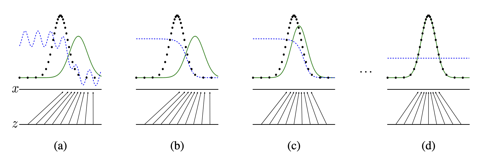
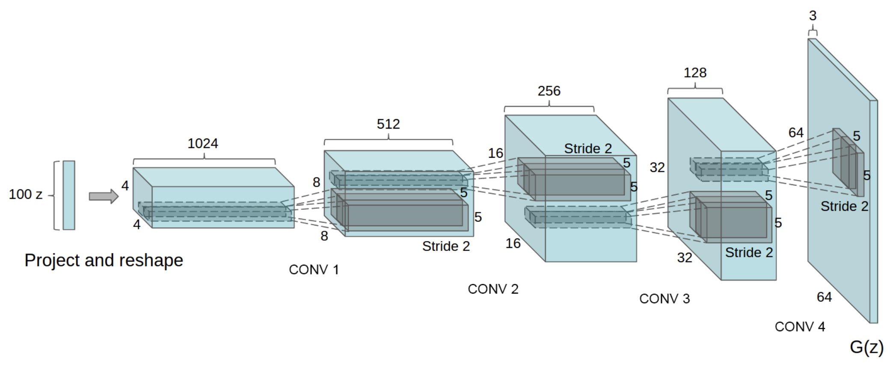

### 理论

在 `GAN (Generative Adversarial Nets)` 中，生成模型要与一个对手博弈：即判别模型，该模型学习判断样本是来自模型分布还是真实数据分布。可以将生成模型类比为一伙造假者，试图制造假币并在不被察觉的情况下流通；而判别模型则类比为警察，负责识别假币。这场博弈中的竞争会促使双方不断改进自身方法，直到伪造品与真品无法区分。

为学习生成器在数据 $x$ 上的分布 $p_g$，我们为输入噪声变量 $z$ 定义先验分布$p_z(z)$，再将到数据空间的映射表示为 $G(z;\theta_g)$。其中 $G$ 是由参数为 $\theta_g$ 的多层感知机实现的可微函数。我们另外定义第二个多层感知机 $D(x;\theta_d)$，其输出单个标量。$D(x)$ 代表样本 $x$ 来自真实数据而非 $p_g$ 的概率。训练判别器 $D$，使其最大化对训练样本与生成器输出样本赋予正确标签的概率；同时训练生成器 $G$，使其最小化 $\log(1-D(G(z)))$，换句话说，$D$ 与 $G$ 进行二人极小极大博弈，价值函数为 $V(G,D)$： 

$$
\min_{G}\max_{D} V(D,G) = \mathbb{E}_{x\sim p_{data}(x)}\big[\log D(x)\big] + \mathbb{E}_{z\sim p_{z}(z)}\big[\log\big(1-D(G(z))\big)\big]
$$

> 要生成不同的样本需要随机输入，因此使用噪声变量
> 定义一个先验分布 $p_z(z)$, 然后取样本得到噪声变量
> $G(z)$ 是生产的假样本，传给判别器进行判断，$G$ 的目标是让 $D(G(z))$ 接近 $1$ (认为它是真的)

当生成器 $G$ 与判别器 $D$ 具备足够的模型容量时（即在非参数极限条件下），该训练准则能够还原出真实的数据生成分布。<font color="#034ea9"><b>图 1 </b></font>给出了该方法的一个解释：



> 生成对抗网络通过同步更新判别分布（蓝色虚线）来训练，使其能够区分来自数据生成分布（黑色点线）$p_x$ 的样本，与生成器分布 $p_g(G)$（绿色实线）的样本
> 下方水平线为 $z$ 的采样空间，本例中服从均匀分布；上方水平线是 $x$ 定义域的一部分。向上的箭头表示映射 $x=G(z)$ 如何对变换后的样本施加非均匀分布 $p_g$
> (b) 固定 $G$，得到最优判别器: $D^{*}(x)=\frac{p_{data}(x)}{p_{data}(x)+p_g(x)}$
> (c) $D^{*}$ 对样本的梯度用来更新 $G$
> (d) 经过多轮训练，若 $G$ 和 $D$ 具备充足模型容量，二者将到达无法继续优化的平衡点，此时$p_g=p_{data}$。判别器无法区分两个分布，即 $D(x)=\frac12$

整体算法流程：

> **算法**：`GAN` 的小批次随机梯度下降训练。判别器的更新步数为超参数 $k$，在实验中令 $k=1$
> &emsp;&emsp;$\mathbf {for} \ \ce{number of training iterations} \ \mathbf{do}$
> &emsp;&emsp;&emsp;&emsp;$\mathbf {for} \ k \ \ce{steps} \ \mathbf{do}$
> &emsp;&emsp;&emsp;&emsp;&emsp;&emsp;1. 从噪声先验分布 $p_z(z)$ 中采样得到包含 $m$ 个噪声样本的小批次 $\{z^{(1)},\dots,z^{(m)}\}$
> &emsp;&emsp;&emsp;&emsp;&emsp;&emsp;2. 从数据生成分布 $p_{data}(x)$ 中采样包含 $m$ 个样本的小批次 $\{x^{(1)},\dots,x^{(m)}\}$
> &emsp;&emsp;&emsp;&emsp;&emsp;&emsp;3. 通过增大判别器的随机梯度来更新判别器：
> &emsp;&emsp;&emsp;&emsp;&emsp;&emsp;&emsp;&emsp;$$\nabla_{\theta_d} \frac1m\sum_{i=1}^m \Big[\log D\big(x^{(i)}\big)+\log\big(1-D\big(G(z^{(i)})\big)\big)\Big]$$
> &emsp;&emsp;&emsp;&emsp;$\mathbf {end} \ \mathbf{for}$
> &emsp;&emsp;1. 从噪声先验分布 $p_z(z)$ 中采样得到包含 $m$ 个噪声样本的小批次 $\{z^{(1)},\dots,z^{(m)}\}$
> &emsp;&emsp;2. 通过降低生成器的随机梯度来更新生成器：
> &emsp;&emsp;&emsp;&emsp;$$\nabla_{\theta_g}\; \frac1m\sum_{i=1}^{m}\log\Big(1-D\big(G(z^{(i)})\big)\Big)$$
> &emsp;&emsp;$\mathbf {end} \ \mathbf{for}$

### DCGAN 的实现

`DCGAN` 是 `GAN` 模型的直接扩展，区别在于判别器与生成器中分别显式使用卷积层和转置卷积层而非 `MLP`。判别器由步幅卷积层、`BN` 层和 `LeakyReLU` 激活函数构成；输入为 $3\times64\times64$ 的图像，输出为代表输入来自真实数据分布的标量概率。生成器由转置卷积层、`BN` 层和 `ReLU` 激活函数构成；输入是从标准正态分布采样得到的隐向量 $z$，输出为 $3\times64\times64$ 的 `RGB` 图像。带步幅的转置卷积层能够将隐向量转换为和图像尺寸一致的张量。

#### 生成器 G

生成器 $G$ 的作用是将隐空间向量 $z$ 映射到数据空间。由于处理的数据为图像，将 $z$ 映射至数据空间等价于最终生成和训练集图像尺寸一致的 `RGB` 图像，即 $3\times64\times64$。实际实现中，该过程由一系列带步幅的二维转置卷积层完成，每一层搭配二维批归一化层与 `ReLU`。生成器的输出经过 `tanh`，将数值映射回输入数据的取值范围 $[-1,1]$。值得注意，转置卷积层之后设置批归一化层是 `DCGAN` 论文的关键创新点，这类层能够改善训练过程中的梯度流通。`DCGAN` 论文中给出的生成器结构示意图如下:



```python
class Generator(nn.Module):
    def __init__(self, ngpu):
        # 同 super().__init__()
        super(Generator, self).__init__()
        self.ngpu = ngpu
        self.main = nn.Sequential(
            # input is Z, going into a convolution
            # 将一维的噪声向量重塑为具有空间结构的特征图
            # in_channels, out_channels, kernel_size, stride, padding
            # nz, 1, 1 -> ngf * 8, 4, 4
            nn.ConvTranspose2d(nz, ngf * 8, 4, 1, 0, bias=False),
            nn.BatchNorm2d(ngf * 8),
            nn.ReLU(True),
            # state size. ``(ngf*8) x 4 x 4``
            nn.ConvTranspose2d(ngf * 8, ngf * 4, 4, 2, 1, bias=False),
            nn.BatchNorm2d(ngf * 4),
            nn.ReLU(True),
            # state size. ``(ngf*4) x 8 x 8``
            nn.ConvTranspose2d( ngf * 4, ngf * 2, 4, 2, 1, bias=False),
            nn.BatchNorm2d(ngf * 2),
            nn.ReLU(True),
            # state size. ``(ngf*2) x 16 x 16``
            nn.ConvTranspose2d( ngf * 2, ngf, 4, 2, 1, bias=False),
            nn.BatchNorm2d(ngf),
            nn.ReLU(True),
            # state size. ``(ngf) x 32 x 32``
            nn.ConvTranspose2d( ngf, nc, 4, 2, 1, bias=False),
            nn.Tanh()
            # state size. ``(nc) x 64 x 64``
        )

    def forward(self, input):
        return self.main(input)
```

#### 判别器 D

如上所述，判别器 $D$ 是一个二分类网络，输入一张图像，输出一个标量概率，表示输入图像为真实图像。此处 $D$ 接收 $3\times64\times64$ 的输入图像，经过一系列 `Conv2d` 层、`BatchNorm2d` 层以及 `LeakyReLU` 处理，最后通过 `Sigmoid` 输出概率。`DCGAN` 论文指出，使用步幅卷积替代池化层做下采样是一种优良实践，网络可以借此自主学习池化操作。同时 `BN` 与 `LeakyReLU` 能够保障梯度正常流动，这对生成器和判别器二者的训练过程都至关重要。

```python
class Discriminator(nn.Module):
    def __init__(self, ngpu):
        super(Discriminator, self).__init__()
        self.ngpu = ngpu
        self.main = nn.Sequential(
            # input is ``(nc) x 64 x 64``
            nn.Conv2d(nc, ndf, 4, 2, 1, bias=False),
            nn.LeakyReLU(0.2, inplace=True),
            # state size. ``(ndf) x 32 x 32``
            nn.Conv2d(ndf, ndf * 2, 4, 2, 1, bias=False),
            nn.BatchNorm2d(ndf * 2),
            nn.LeakyReLU(0.2, inplace=True),
            # state size. ``(ndf*2) x 16 x 16``
            nn.Conv2d(ndf * 2, ndf * 4, 4, 2, 1, bias=False),
            nn.BatchNorm2d(ndf * 4),
            nn.LeakyReLU(0.2, inplace=True),
            # state size. ``(ndf*4) x 8 x 8``
            nn.Conv2d(ndf * 4, ndf * 8, 4, 2, 1, bias=False),
            nn.BatchNorm2d(ndf * 8),
            nn.LeakyReLU(0.2, inplace=True),
            # state size. ``(ndf*8) x 4 x 4``
            nn.Conv2d(ndf * 8, 1, 4, 1, 0, bias=False),
            nn.Sigmoid()
        )

    def forward(self, input):
        return self.main(input)
```

#### 训练

在训练时，为真实图像与伪造图像分别构造不同小批次数据，并调整生成器的目标函数，最大化$\log(D(G(z)))$。训练流程分为两大部分：更新判别器，更新生成器。我们将使用 `BCELoss`，其定义如下：

$$ 
\ell(x,y)=L=\{l_1,\dots,l_N\}^\top,\quad l_n=-\big[y_n\cdot\log x_n+(1-y_n)\cdot\log(1-x_n)\big] 
$$

可以看到，该损失函数可以计算目标函数中的两项对数部分，即 $\log(D(x))$ 与 $\log(1-D(G(z)))$。通过输入标签 $y$，我们就可以选择使用 `BCE` 公式中的对应部分。

##### 训练判别器

回顾一下，训练判别器的目标是最大化对输入样本真假分类正确的概率，即最大化$\log(D(x))+\log(1-D(G(z)))$。该损失分两步计算。第一步，从训练集取出一批真实样本，送入判别器 $D$ 前向传播，计算 $\log(D(x))$ 对应的损失，再反向传播求取梯度。第二步，利用当前生成器生成一批伪造样本，送入判别器 $D$ 前向传播，计算 $\log(1-D(G(z)))$ 对应的损失，再通过反向传播累加梯度。在同时获得全部真实批次、全部伪造批次的梯度之后，调用判别器优化器执行一步参数更新。

> 最大化概率等价于最小化损失 $\mathcal{L}_D = \underbrace{-\log D(x)}_{\mathcal{L}_{D\_real}} + \underbrace{\big(-\log\big(1-D(G(z))\big)\big)}_{\mathcal{L}_{D\_fake}}$
> 第一项是真实样本对应的损失，生成伪造样本传入 $D$ 得到第二项损失

##### 训练生成器

正如原始论文所述，训练生成器的初衷是最小化 $\log(1-D(G(z)))$，以此生成更逼真的伪造样本。但该目标的梯度不足，在训练早期问题尤为突出。作为改进方案，转而最大化 $\log(D(G(z)))$。在代码中的实现方式为：将上一步生成器输出的伪造样本送入判别器做推理，使用真实样本标签作为真值计算生成器损失，反向传播求取生成器梯度，最后调用优化器更新生成器参数。给伪造样本使用真实标签作为损失的真值标签看起来违背直觉，但这样可以启用 `BCELoss` 中的 $\log(x)$ 项，正好匹配我们的目标。

完整的训练步骤:

```python
# Training Loop

    # Lists to keep track of progress
    img_list = []
    G_losses = []
    D_losses = []
    iters = 0

    print("Starting Training Loop...")
    # For each epoch
    for epoch in range(num_epochs):
        # For each batch in the dataloader
        for i, data in enumerate(dataloader, 0):

            ############################
            # (1) Update D network: maximize log(D(x)) + log(1 - D(G(z)))
            ###########################
            ## Train with all-real batch
            netD.zero_grad()
            # Format batch
            real_cpu = data[0].to(device)
            b_size = real_cpu.size(0)
            # data 中取出的是真图，生成跟 bs 大小相同的真 label
            label = torch.full((b_size,), real_label, dtype=torch.float, device=device)
            # Forward pass real batch through D
            # 将 D 的输出展平为 1 维向量
            output = netD(real_cpu).view(-1)
            # Calculate loss on all-real batch
            errD_real = criterion(output, label)
            # Calculate gradients for D in backward pass
            errD_real.backward()
            D_x = output.mean().item()

            ## Train with all-fake batch
            # Generate batch of latent vectors
            noise = torch.randn(b_size, nz, 1, 1, device=device)
            # 假图
            fake = netG(noise)
            label.fill_(fake_label)
            # Classify all fake batch with D
            # fake.detach() 防止梯度传给 G
            output = netD(fake.detach()).view(-1)
            # Calculate D's loss on the all-fake batch
            errD_fake = criterion(output, label)
            # Calculate the gradients for this batch, accumulated (summed) with previous gradients
            errD_fake.backward()
            D_G_z1 = output.mean().item()
            # Compute error of D as sum over the fake and the real batches
            errD = errD_real + errD_fake
            # Update D
            optimizerD.step()

            ############################
            # (2) Update G network: maximize log(D(G(z)))
            ###########################
            netG.zero_grad()
            # 真标签标注假图像
            label.fill_(real_label)  # fake labels are real for generator cost
            # Since we just updated D, perform another forward pass of all-fake batch through D
            # 先计算 G(z), 再计算 D，bp 时梯度从 D 传给 G，这里不用 detach
            output = netD(fake).view(-1)
            # Calculate G's loss based on this output
            errG = criterion(output, label)
            # Calculate gradients for G
            errG.backward()
            D_G_z2 = output.mean().item()
            # Update G
            optimizerG.step()

            # Output training stats
            if i % 50 == 0:
                print('[%d/%d][%d/%d]\tLoss_D: %.4f\tLoss_G: %.4f\tD(x): %.4f\tD(G(z)): %.4f / %.4f'
                    % (epoch, num_epochs, i, len(dataloader),
                        errD.item(), errG.item(), D_x, D_G_z1, D_G_z2))

            # Save Losses for plotting later
            G_losses.append(errG.item())
            D_losses.append(errD.item())

            # Check how the generator is doing by saving G's output on fixed_noise
            if (iters % 500 == 0) or ((epoch == num_epochs-1) and (i == len(dataloader)-1)):
                with torch.no_grad():
                    fake = netG(fixed_noise).detach().cpu()
                img_list.append(vutils.make_grid(fake, padding=2, normalize=True))

            iters += 1
```


