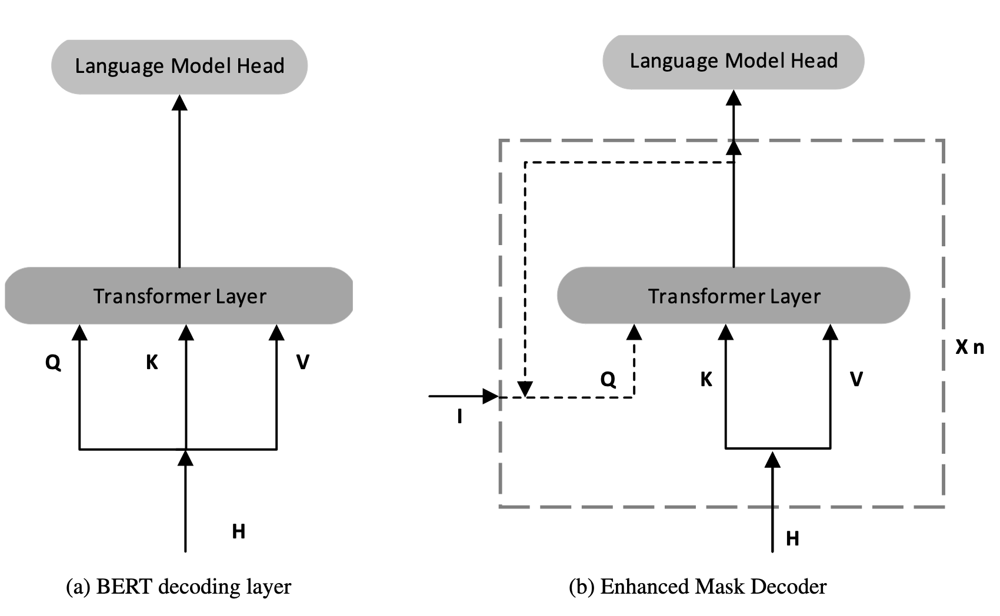
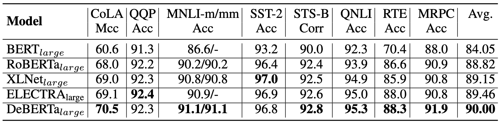
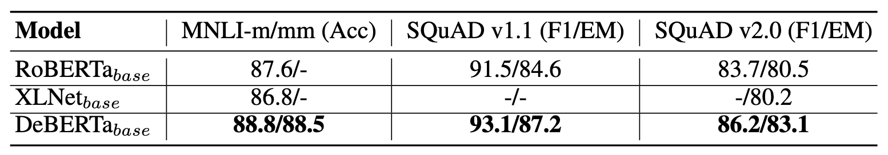
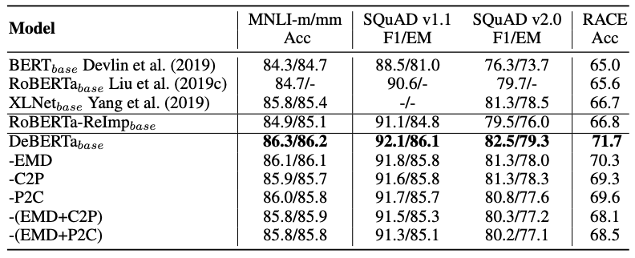

:::note[META]
**DOI**: `10.48550/arXiv.2006.03654` 
**Date**: `2020/06/05`
:::

## 1 问题

`Transformer` 现已成为神经语言建模领域效果最优的神经网络架构。$2018$ 年以来一大批基于 `Transformer` 的大规模预训练语言模型`（PLM）`相继问世，包括 `GPT`，`BERT`，`RoBERTa`，`XLNet`，`UniLM`，`ELECTRA`，`T5` 等。研究者使用各下游任务专属标注数据对这些预训练语言模型进行微调，在大量 `NLP` 任务上刷新了当前最优性能指标。

本文提出了一个基于 `Transformer` 的新模型 `DeBERTa (Decodingenhanced BERT with disentangled attention)`，通过两个新技术改进了此前性能最优的预训练语言模型：解耦注意力机制与增强掩码 `encoder`。

**解耦注意力机制**。`BERT` 在输入层中，每个单词仅由词嵌入与位置嵌入相加得到单一向量表征；与之不同，`DeBERTa` 为每个单词分配两组独立向量，分别编码单词语义内容与位置信息。词与词之间的注意力权重，会依托两套解耦矩阵分别基于单词内容、相对位置进行计算。

**增强掩码 encoder**。与 `BERT` 相同，`DeBERTa` 采用 `MLM` 开展预训练。`DeBERTa` 在执行 `MLM` 时，会同时利用上下文词汇的语义内容与位置信息。解耦注意力机制虽已纳入上下文词语义内容和相对位置，但并未考量词语的绝对位置，而绝对位置在诸多场景下对预测结果至关重要。因此在 `softmax` 解码层前额外引入单词绝对位置嵌入，模型会融合单词语义内容与位置的上下文表征，再依托该融合特征解码出被掩码的词汇。

另外还提出了一个新的虚拟对抗训练方法，用于将预训练语言模型微调适配至各类 `NLP` 下游任务。该方法能够有效提升模型的泛化能力。

## 2 相关工作
### 2.1 解耦注意力

对序列中 $i$ 位置处的 `token`，我们使用两个向量来表示：$\{\mathbf H_i\}$ 和 $\{\mathbf P_{i|j}\}$，分别代表该 `token` 的内容和它与位置 $j$ 处的 `token` 的相对距离。$i,j$ 之间的 `token` 的交叉注意力分数可以分解为四部分：

$$
\begin{align*}
A_{i,j} &= \{\mathbf H_i, \mathbf P_{i|j}\} \times \{\mathbf H_j, \mathbf P_{j|i}\}^\top \\
& = \mathbf H_i\mathbf H_j^\top + \mathbf H_i\mathbf P_{j|i}^\top + \mathbf P_{i|j}\mathbf H_j^\top + \mathbf P_{i|j}\mathbf P_{j|i}^\top \tag{1}
\end{align*}
$$

也就是说，一组词之间的注意力权重可拆分为四项注意力分数相加求得；借助针对语义内容与相对位置解耦分离的矩阵，四项分数分别为：*内容对内容*、*内容对位置*、*位置对内容*、*位置对位置*。

现有相对位置编码方案均使用独立嵌入矩阵，在计算注意力权重时求解相对位置偏置项。这种方式等价于仅采用<b>式 (1) </b>中的内容-内容项与内容-位置项来计算注意力权重。

> 传统的 `RPE`：$A_{i,j} = \frac{\mathbf Q_i \mathbf K_j^\top}{\sqrt{d_k}} + \mathbf Q_i \mathbf R_{i-j}^\top$
> 	$\mathbf Q_i$ 只与内容有关，$\mathbf K_j$ 仅由 $j$ 处 `token` 的内容决定，因此是内容对内容项
> 	$\mathbf R_{i-j}$ 是独立的相对位置嵌入矩阵，$\mathbf Q_i \mathbf R_{i-j}^\top$ 是内容对位置项
> 	等价于式中的 $s_{i,j} = \mathbf H_i \mathbf H_j^\top + \mathbf H_i\mathbf P_{j|i}^\top$

本文认为**位置-内容项**同样不可或缺：一对词汇的注意力关联强度同时受二者语义内容与相对位置共同影响，只有同时引入内容-位置项与位置-内容项，才能完整建模该交互关系。由于本模型采用相对位置嵌入，位置-位置项无法提供有效增量信息，因此在实际实现时从<b>式 (1) </b>中将该项移除。

单头标准注意力的公式如下：

$$
\begin{align*}
\mathbf Q = \mathbf H \mathbf W_{q},\; &\mathbf K = \mathbf H \mathbf W_{k},\; \mathbf V = \mathbf H \mathbf W_{v},\; \mathbf A = \frac{\mathbf Q \mathbf K^\top}{\sqrt{d}} \\ 
& \mathbf H_{\mathbf o} = \mathrm{softmax}(\mathbf A) \mathbf V
\end{align*}
$$

其中 $\mathbf H \in \mathbb R^{d \times d}$ 是输入隐向量，$\mathbf H_{\mathbf o} \in \mathbb R^{N \times d}$ 是自注意力的输出，$\mathbf W_{\mathbf q},\mathbf W_{\mathbf k},\mathbf W_{\mathbf v} \in \mathbb R^{d \times d}$ 是投影向量。$\mathbf A \in \mathbb R^{N \times N}$ 是注意力矩阵，$N$ 是输入序列的长度，$d$ 是隐状态的维度。

假设 $k$ 是最大的相对距离，$\delta (i,j) \in [0,2k)$ 是 `token` $i$ 和 $j$ 之间的距离：

$$
\delta(i,j)= \begin{cases} 0 & \text{for } i-j \le -k \\ 
2k-1 & \text{for } i-j \ge k \\ 
i-j+k & \text{others} \end{cases} \tag{2}
$$

我们可以通过<b>式 (3) </b>表示带有相对位置偏置的解耦自注意力机制：其中 $\mathbf{Q}_c、\mathbf{K}_c、\mathbf{V}_c$ 为内容投影向量，分别由投影矩阵 $\mathbf{W}_{q,c},\mathbf{W}_{k,c},\mathbf{W}_{v,c} \in \mathbb{R}^{d\times d}$ 线性变换得到；$\mathbf{P} \in \mathbb{R}^{2k\times d}$ 是跨所有层共享的相对位置嵌入向量（前向传播过程中参数固定不更新）；$\mathbf{Q}_r、\mathbf{K}_r$ 为相对位置投影向量，分别由投影矩阵 $\mathbf{W}_{q,r},\mathbf{W}_{k,r} \in \mathbb{R}^{d\times d}$ 线性变换得到。

$$
\begin{align*} 
\mathbf Q_c = \mathbf H \mathbf W_{q,c},\; &\mathbf K_c = \mathbf H \mathbf W_{k,c},\; \mathbf V_c = \mathbf H \mathbf W_{v,c},\; \mathbf Q_r = \mathbf P \mathbf W_{q,r},\; \mathbf K_r = \mathbf P \mathbf W_{k,r} \\[4pt] &\tilde{A}_{i,j} = \underbrace{\mathbf Q_i^c {\mathbf K_j^c}^\top}_{(\text{a}) \text{ content-to-content}} + \underbrace{\mathbf Q_i^c {\mathbf K_{\delta(i,j)}^r}^\top}_{(\text{b}) \text{ content-to-position}} + \underbrace{\mathbf K_j^c {\mathbf Q_{\delta(j,i)}^r}^\top}_{(\text{c}) \text{ position-to-content}} \tag{3} \\[4pt] &\mathbf H_o = \mathrm{softmax}\left( \frac{\tilde{A}}{\sqrt{3d}} \right) \mathbf V_c 
\end{align*} 
$$

> $\mathbf Q_r, \mathbf K_r$ 仅用于调整权重，不用于输出特征，不将位置信息添加到隐状态中，因此不需要 $\mathbf V_r$

$\tilde{A}_{i,j}$ 是注意力矩阵 $\tilde{A}$ 的元素，代表 `token` $i$ 指向 `token` $j$ 的注意力原始得分。 $\mathbf Q_i^c$ 是矩阵 $\mathbf Q_c$ 的第 $i$ 行；$\mathbf K_j^c$ 是矩阵 $\mathbf K_c$ 的第 $j$ 行。 $\mathbf K_{\delta(i,j)}^r$ 是根据相对偏移量 $\delta(i,j)$ 取到的 $\mathbf K_r$ 的第 $\delta(i,j)$ 行；$\mathbf Q_{\delta(j,i)}^r$ 是根据相对偏移量 $\delta(j,i)$ 取到的 $\mathbf Q_r$ 的第 $\delta(j,i)$ 行。位置-内容项的计算形式为 $\mathbf K_j^c {\mathbf Q_{\delta(j,i)}^r}^\top$；内容-位置项的计算逻辑与之对称。

> $\mathbf Q_i^c {\mathbf K_{\delta(i,j)}^r}^\top$ 计算的是「$i$ 的查询内容」作用于「$j$ 的键位置」的注意力权重，对应偏移为 $\delta(i,j)$
> $\mathbf K_j^c {\mathbf Q_{\delta(j,i)}^r}^\top$ 计算的是「$j$ 的键内容」作用于「$i$ 的查询位置」的注意力权重，对应偏移为 $\delta(j,ji)$
> `DeBERTa` 的创新就在于新增了 `P → C`

最终我们对 $\tilde{A}_{i,j}$ 施加一个缩放因子 $\frac{1}{\sqrt{3d}}$，该缩放因子对稳定模型训练至关重要，在 `PLM` 场景下效果尤为显著。

#### 2.1.1 有效实现

> **输入**：隐状态 $\mathbf H$，相对距离嵌入 $\mathbf P$，相对距离矩阵 $\delta$。内容投影矩阵 $\mathbf{W}_{q,c},\mathbf{W}_{k,c},\mathbf{W}_{v,c}$，位置投影矩阵 $\mathbf{W}_{q,r},\mathbf{W}_{k,r}$
> 1：$\mathbf K_c = \mathbf H \mathbf W_{k,c},\ \mathbf Q_c = \mathbf H \mathbf W_{q,c},\ \mathbf V_c = \mathbf H \mathbf W_{v,c},\ \mathbf K_r = \mathbf P \mathbf W_{k,r},\ \mathbf Q_r = \mathbf P \mathbf W_{q,r}$
> 2：$\mathbf A_{c\to c} = \mathbf Q_c \mathbf K_c^\top$
> 3：$\mathbf {for} \ i=0,\ldots,N-1 \ \mathbf{do}$
> 4：&emsp;&emsp;$\tilde{A}_{c\to p}[i,:] = \mathbf Q_c[i,:] \mathbf K_r^\top$
> 5：$\mathbf {end \ for}$
> 6：$\mathbf {for} \ i=0,\ldots,N-1 \ \mathbf{do}$
> 7：&emsp;&emsp;$\mathbf {for} \ j=0,\ldots,N-1 \ \mathbf{do}$
> 8：&emsp;&emsp;&emsp;&emsp;$A_{c\to p}[i,j] = \tilde{A}_{c\to p}[i,\delta[i,j]]$
> 9：&emsp;&emsp;$\mathbf {end \ for}$
> 10：$\mathbf {end \ for}$
> 11：$\mathbf {for} \ j=0,\ldots,N-1 \ \mathbf{do}$
> 12：&emsp;&emsp;$\tilde{A}_{p\to c}[j,:] = \mathbf K_c[j,:] \mathbf Q_r^\top$
> 13：$\mathbf {end \ for}$
> 14：$\mathbf {for} \ j=0,\ldots,N-1 \ \mathbf{do}$
> 15：&emsp;&emsp;$\mathbf {for} \ i=0,\ldots,N-1 \ \mathbf{do}$
> 16：&emsp;&emsp;&emsp;&emsp;$A_{p\to c}[i,j] = \tilde{A}_{p\to c}[\delta[j,i],j]$
> 17：&emsp;&emsp;$\mathbf {end \ for}$
> 18：$\mathbf {end \ for}$
> 19：$\tilde{A} = A_{c\to c} + A_{c\to p} + A_{p\to c}$
> 20：$\mathbf H_o = \mathrm{softmax}\left(\frac{\tilde{A}}{\sqrt{3d}}\right) \mathbf V_c$

对于长度为 $N$ 的输入序列，传统方案为每个 `token` 单独存储相对位置嵌入，空间复杂度达到 $O(N^2d)$。 但以内容-位置项为例可以发现：偏移映射函数满足 $\delta(i,j) \in [0, 2k]$，所有可能的相对位置嵌入向量都存放于全局共享矩阵 $K_r \in \mathbb{R}^{2k\times d}$ 中，因此我们可以让全部 `Query` 在注意力计算时复用同一份 $K_r$，无需为每个位置重复存储位置表征。

本文预训练实验中将最大相对距离阈值 $k$ 设置为 $512$。设 $\delta$ 为依据<b>式 (2) </b>定义的相对位置索引矩阵，满足 $\delta[i,j] = \delta(i,j)$。不同于传统方案为每个查询向量单独分配独立的相对位置嵌入矩阵，本方法如算法第 $3-5$ 行所示，将每条查询向量 $\mathbf Q_c[i,:]$ 与 $\mathbf K_r^\top \in \mathbb{R}^{d\times 2k}$ 做矩阵乘法；随后如第 $6-10$ 行，以相对位置矩阵 $\delta$ 作为索引查表取出对应注意力分值，完成内容-位置项计算。针对位置-内容注意力分值的求解与之类似。该设计无需为每个查询分配独立的位置嵌入存储空间，仅需存储 $\mathbf K_r$, $\mathbf Q_r$ 两份全局位置矩阵，将空间复杂度降低至 $O(kd)$。

### 2.2 增强掩码 decoder：建模单词绝对位置信息

`DeBERTa` 采用 `MLM` 完成预训练，该任务的目标是利用掩码 `token` 周边的上下文词汇，还原出被掩码遮盖的原始单词。在 `MLM` 任务中，`DeBERTa` 会同时借助上下文单词的语义内容与位置特征进行推理。其内部的解耦自注意力结构虽然已经建模了上下文词汇的语义内容以及词汇之间的相对位置关系，但完全没有引入单词在整段序列里的绝对位置信息，而这类绝对位置特征在大量场景下对掩码单词的预测起到决定性作用。

引入绝对位置信息存在两种实现方案。`BERT` 在输入层就将绝对位置嵌入与词向量融合；而 `DeBERTa` 则是在全部 `Transformer` 层运算完成后、`token` 预测的 `softmax` 层之前再引入绝对位置信息，如<b>图 1 </b>所示。

`DeBERTa` 在所有 `Transformer` 层中仅学习相对位置，仅在解码预测掩码单词时，把绝对位置作为补充特征使用，因此我们将 `DeBERTa` 的解码模块命名为增强掩码解码器`（EMD）`。

实验对比了两种绝对位置引入方式，结果表明 `EMD` 的效果显著更优。我们推测，`BERT` 过早混入绝对位置的做法会干扰模型充分学习相对位置特征。除此之外，`EMD` 还支持在预训练阶段引入位置以外的其他有效特征，相关拓展工作留待后续研究。

### 2.3 尺度不变微调

本文还提出了一种全新的虚拟对抗训练微调算法 —— 尺度不变微调`（SiFT）`，该算法专门用于下游微调阶段。

虚拟对抗训练是一种用于提升模型泛化能力的正则化手段。其核心思路是增强模型针对对抗样本的鲁棒性，对抗样本通过对原始输入施加微小扰动生成。该正则化约束要求：输入任务原始样本与该样本添加微小扰动后的对抗样本时，模型输出的概率分布保持一致。

针对 `NLP` 任务，扰动会作用于词嵌入而非原始单词序列。但不同单词、不同模型对应的嵌入范数取值区间存在差异，参数量达数十亿的大模型中该差异会进一步扩大，进而造成对抗训练过程不稳定。

本文的 `SiFT` 算法，通过在归一化后的词嵌入上施加扰动来提升训练稳定性。具体来说，实验中将 `DeBERTa` 微调至下游自然语言任务时，`SiFT` 先把词嵌入向量归一化为随机向量，再对归一化后的嵌入添加扰动。实验发现归一化操作能够大幅提升微调后模型的效果，且模型规模越大，提升效果越明显。

## 3 结果
### 3.1 large model 的表现

在 `GLUE` 八项 `NLU` 任务上开展对比实验，将 `DeBERTa` 与 `BERT`、`RoBERTa`、`XLNet`、`ALBERT`、`ELECTRA` 等结构相近（$24$ 层、隐层维度 $1024$）的 `Transformer` 预训练模型对比。需要注意：`RoBERTa、XLNet、ELECTRA` 预训练数据为 `160GB`，而 `DeBERTa` 仅 `78GB`；`RoBERTa` 与 `XLNet` 采用 `batch size 8000` 训练 `500K` 步，合计 $40$ 亿训练样本；`DeBERTa` 以 `batch size 2000` 训练 `1M` 步，共 $20$ 亿训练样本，仅为前两者的一半。

实验结果表明：相比 `BERT`、`RoBERTa`，`DeBERTa` 在全部任务上性能均有提升；八项任务中有六项优于 `XLNet`，在 `MRPC、RTE、CoLA` 任务上提升尤为明显。在 `GLUE` 平均得分上，`DeBERTa` 也优于 `ELECTRA‑large、XLNet‑large` 等现有 `SOTA` 预训练模型。`MNLI` 常被视作衡量预训练语言模型进展的代表性任务，`DeBERTa` 在同等参数量模型下显著超越已有模型，取得新的 `SOTA` 结果。

### 3.2 base model 的表现

`base` 模型架构沿用 `BERT‑base`：层数 $L=12$，隐层维度 $H=768$，注意力头数 $A=12$，`batch size` 为 $2048$，训练 $1M$ 步。$\ce{DeBERTa}_{\ce{base}}$ 同样使用 `78GB` 数据集训练，对比在 `160GB` 文本数据上训练得到的 $\ce{RoBERTa}_{\ce{base}}$、$\ce{XLNet}_{\ce{base}}$。

在全部三项任务上，$\ce{DeBERTa}_{\ce{base}}$ 相对 `RoBERTa`、`XLNet` 的性能增益幅度大于 `Large` 模型上的提升。以 `MNLI‑m` 任务为例，$\ce{DeBERTa}_{\ce{base}}$ 相比 $\ce{RoBERTa}_{\ce{base}}$ 提升 $1.2\%$，相对 $\ce{XLNet}_{\ce{base}}$ 提升 $2.0\%$。

### 3.3 消融实验

为验证整套预训练实验流程，从零预训练得到 $\ce{RoBERTa}_{\ce{base}}$ 复现版本，记作 $\ce{RoBERTa-ReImp}_{\ce{base}}$,同时为探究 `DeBERTa` 各组件的相对贡献，构建三种变体模型:
- `-EMD`: 移除 `EMD` 模块的 $\ce{DeBERTa}_{\ce{base}}$ 模型，在 `decoder` 不加入绝对位置信息
- `‑C2P`：移除内容‑位置交互项的 $\ce{DeBERTa}_{\ce{base}}$ 模型
- `‑P2C`：移除位置‑内容交互项的 $\ce{DeBERTa}_{\ce{base}}$ 模型

第一，$\ce{RoBERTa-ReImp}_{\ce{base}}$ 在全部基准数据集上与原版 `RoBERTa` 性能接近，证明本文实验设置是合理的。第二，移除 `DeBERTa` 的任意一个组件都会造成明显的性能下降。例如，移除 `EMD` 模块后：`RACE` 下降 $1.4\%$，`SQuAD v1.1` 下降 $0.3\%$，`SQuAD v2.0` 下降 $1.2\%$，`MNLI‑m、MNLI‑mm` 分别下降 $0.2\%$ 与 $0.1\%$。与之类似，移除内容‑位置项或位置‑内容项，都会在所有基准任务上带来性能劣化。同时移除两个组件，性能损失会进一步增大。

