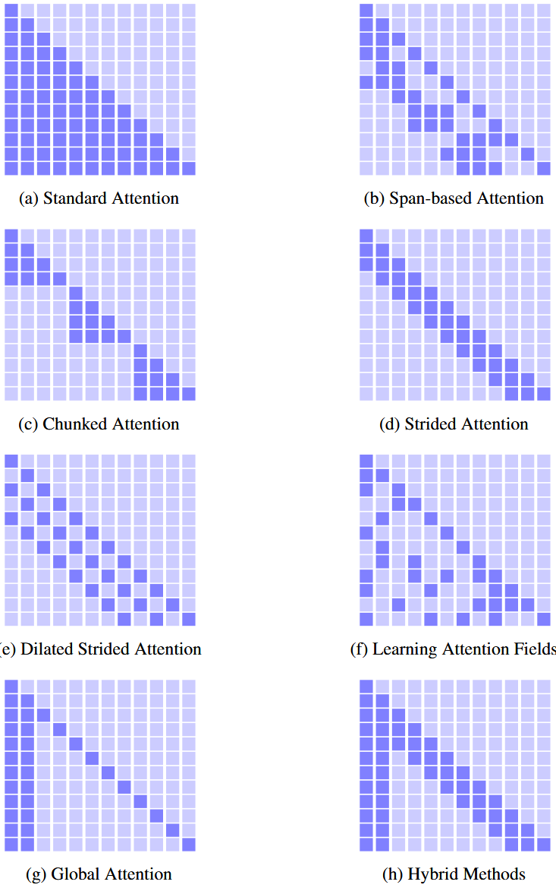
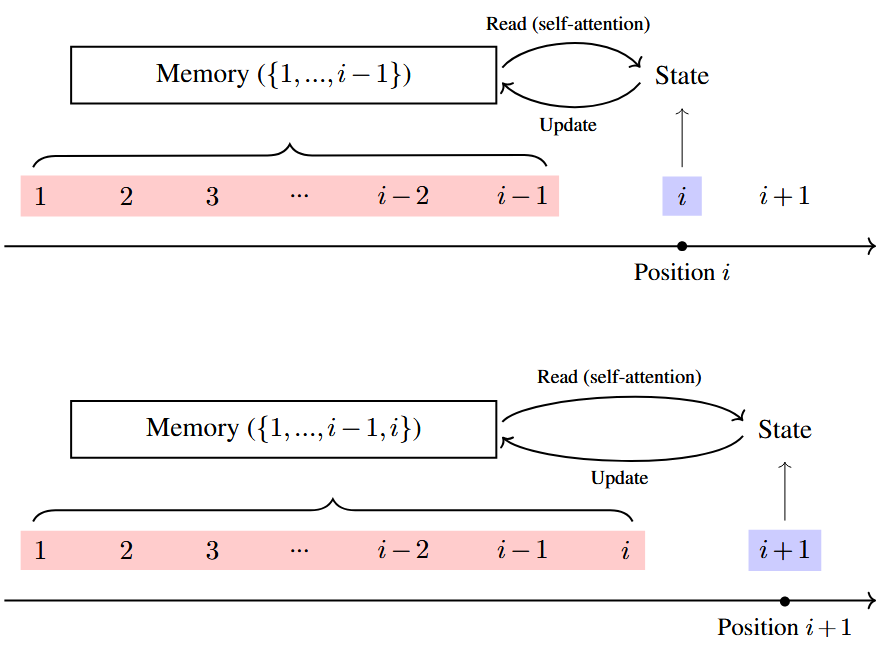
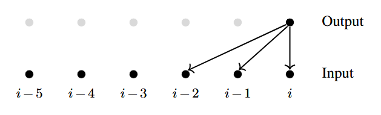
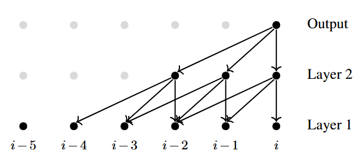
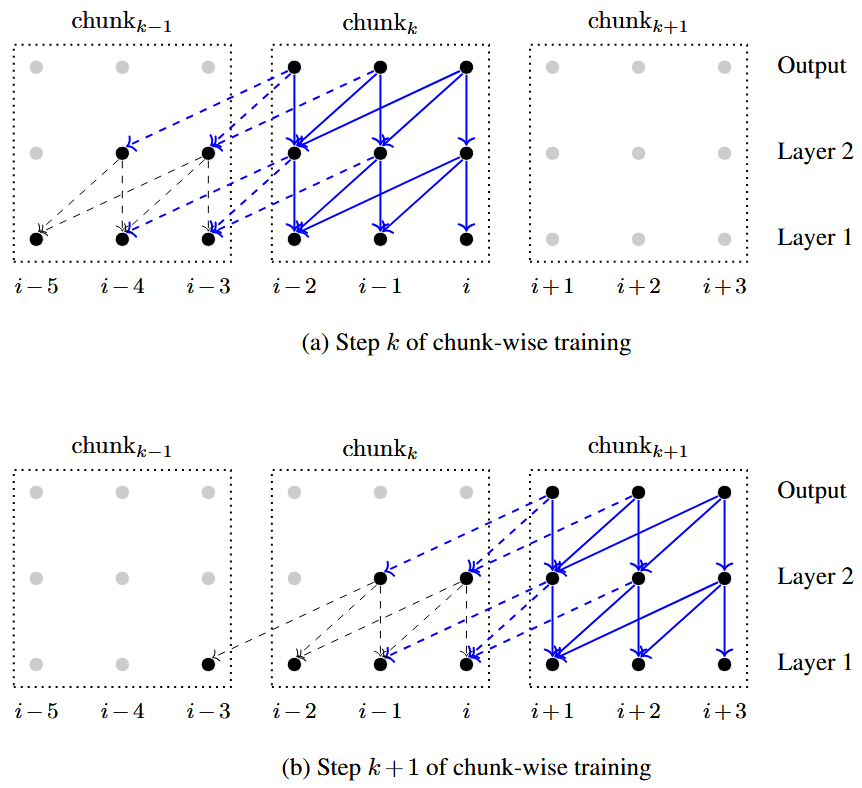

效率是 `Transformer` 模型在各类实际应用中需要重点考量的要素。效率相关问题的分析可从时间效率与空间效率，可扩展性这两个维度展开。

本节会介绍一些在基于 `Transformer` 的序列建模与生成任务中常用的高效优化方法。其中部分方法属于模型架构的改进，另一部分则与架构无关，同样可应用于其他系统。

# 1. Sparse Attention

在实际应用中，`Transformer` 所采用的注意力机制计算耗时较高，输入序列较长时这一问题尤为突出。以 `Transformer decoder` 为例，其会依据前文词汇，在每个时间步预测词表概率分布。假设解码器生成的序列长度为 $n$，自注意力子层的输入为 $n \times d$ 维矩阵 $\mathbf{S}$。首先对 $\mathbf{S}$ 做线性变换，得到查询矩阵 $\mathbf{S}_q \in \mathbb{R}^{n \times d}$、键矩阵 $\mathbf{S}_k \in \mathbb{R}^{n \times d}$ 与值矩阵 $\mathbf{S}_v \in \mathbb{R}^{n \times d}$。为简化本节符号表达，下文统一用 $\mathbf{Q}$、$\mathbf{K}$、$\mathbf{V}$ 分别指代 $\mathbf{S}_q$、$\mathbf{S}_k$、$\mathbf{S}_v$。

随后可通过下式计算自注意力子层的输出：

$$
\operatorname{Att}_{\text{self}}(\mathbf{S}) = \mathbf{A}\mathbf{V} \tag{1}
$$

其中 $\mathbf{A}$ 是一个 $n \times n$ 的注意力矩阵（也称为注意力图）

$$ 
\mathbf{A} = \mathrm{Softmax}\left( \frac{\mathbf{Q}\mathbf{K}^\top}{\sqrt{d}} + \mathbf{M} \right) \tag{2}
$$

其中 $\mathbf{M}$ 为掩码矩阵，用于防止模型在每个位置关注未来上下文。具体来说，对于位置 $i$，当 $j \leq i$ 时，$\mathbf{M}(i, j) = 0$；否则 $\mathbf{M}(i, j) = -\infty$。自注意力子层的时间与空间复杂度均随序列长度 $n$ 呈二次方增长。因此，当 $n$ 较大时，标准自注意力的计算成本将变得极高，难以承受。

上述模型的标准实现依赖于稠密矩阵计算。降低内存占用与浮点运算量的一种常见方法是稀疏化：假设注意力矩阵 $\mathbf{A}$ 为稀疏矩阵，仅保留其中 $\rho \cdot n^2$ 个非零元素（$\rho$ 为<b>稀疏率</b>）。采用稀疏矩阵表示可大幅降低内存需求；同时，模型仅需处理少量相关位置，使得 $\frac{\mathbf{Q}\mathbf{K}^\top}{\sqrt{d}}$ 与 $\mathbf{A}\mathbf{V}$ 的计算效率也得到提升。

给定位置 $i$，我们定义其<b>注意力域</b> $\pi_i$ 为计算该位置表示时所考虑的位置集合。因此，我们仅需计算位置 $i$ 与每个 $j \in \pi_i$ 之间的点积注意力，由此得到一个稀疏注意力矩阵 $\mathbf{A}'$，其满足：

$$ 
A'(i, j) = \begin{cases} a_{i,j} & j \in \pi_i \text{ and } j \leq i \\ 0 & \text{otherwise} \end{cases} \tag{3}
$$

其中 $a_{i,j}$ 是非零权重。该模型的一种简单实现方式是对掩码矩阵 $\mathbf{M}$ 稍作修改，得到新的掩码变量 $\mathbf{M}'$：

$$ 
M'(i, j) = \begin{cases} 0 & j \in \pi_i \text{ and } j \leq i \\ -\infty & \text{otherwise} \end{cases} \tag{4}
$$

在实际实现中，更高效的方法是分别基于掩码矩阵 $\mathbf{M}'$ 和稀疏注意力矩阵 $\mathbf{A}'$，对 $\mathbf{Q}\mathbf{K}^\top$ 与 $\mathbf{A}'\mathbf{V}$ 采用稀疏运算。也就是说，我们仅计算注意力权重非零的位置对，其余位置直接跳过。

稀疏自注意力有多种实现方案:

- **Span-based Attention/Local Attention** 序列建模中多数场景仅需利用局部上下文，局部注意力的核心思路是：将注意力范围限定在输入序列的局部区间内。此时注意力域 $\pi_i$ 可表示为：

	$$
	\pi_i = [a_i^l, a_i^r] \tag{5}
	$$

	其中 $a_i^l$ 和 $a_i^r$ 分别为注意力域 $\pi_i$ 的左右端点。区间长度 $a_i^r - a_i^l + 1$ 决定了局部区域的大小，因此可通过该参数控制注意力模型的稀疏度——例如当 $a_i^r - a_i^l + 1 \ll n$ 时，模型将呈现高度稀疏性。$a_i^l$ 与 $a_i^r$ 可通过启发式规则或机器学习方法确定。局部注意力的示意图可参见<b>图 1(b) </b>。

	

- **Chunked Attention**。该方法将序列划分为多个块，在每个块内执行注意力计算。给定序列 $\{1, \dots, n\}$，我们定义 $\{\text{chunk}_1, \dots, \text{chunk}_q\}$ 为该序列的一种划分方式，每个块可表示为一个区间：

	$$
	\text{chunk}_k = [c_k^l, c_k^r] \tag{6}
	$$

	在注意力计算阶段，每个块被视作独立序列，按常规方式执行自注意力。换言之，位置 $i$ 的表示仅由其所属块内的上下文计算得到。从这个角度看，该模型可视为局部注意力的一种变体，其示意图参见<b>图 1(c)</b>。 序列划分是该方法的关键问题，常见实现方式包括：从语言学角度将序列划分为具有语言学意义的单元；在实际系统中，更常用的方式是将序列划分为等长的块，此时模型的稀疏度由块的大小控制，例如使用更小的块会得到更稀疏的注意力模型。

- **Strided Attention**。由于分块注意力对输入序列进行了硬性划分，模型可能失去从不同块的输入中学习表示的能力。一种替代方案是允许块之间存在重叠，以实现分块式注意力。该方法类似于将局部模型应用于一维或二维数据以生成相同形状输出的常用方法系列。与 `CNN` 类似，我们使用上下文窗口来表示注意力模型的输入场。上下文窗口沿序列滑动，每次向前移动一个 $\text{stride}$。$\text{stride}$ 等于上下文窗口大小时，该模型退化为上述分块注意力模型；$\text{stride}$ 小于上下文窗口大小时，注意力模型会变得更稠密。<b>图 1(d) </b>展示了 $\text{stride}=1$ 的情况，此时块的重叠达到最大。 一种实现相对更稀疏注意力的方式是使用<b>扩张上下文窗口</b>。<b>图 1(e) </b>展示了扩张步幅注意力模型的示例，其中上下文窗口是不连续的，间隔为 $1$。

- **Learning Attention Fields**。由于注意力域 $\pi_i$ 可以是集合 $\{1, \dots, n\}$ 的任意子集，我们可以突破分块类模式，设计更通用的稀疏注意力模型。核心问题在于：如何确定每个位置需要关注哪些位置。 第一种简单思路：借助计算量更低的模型预估每个位置的重要度，仅对判定为高重要度的位置计算注意力权重。第二种思路为分组策略：先对序列位置分组，仅在同组内计算注意力权重，该方式可通过对查询向量、键向量做聚类实现。例如采用 `K-means` 聚类，将聚类中心作为注意力模型的可学习参数，在训练过程中同步优化。

	学习型注意力域的优势在于，模型能够在整个序列上分配注意力。自然语言中常存在长距离词汇依赖，并非局限于局部上下文，因此该特性对诸多自然语言处理任务十分实用。该方法对应的注意力图示例见<b>图 1(f)</b>。此外，还可通过排序或哈希函数对相似的查询、键向量进行分组。重排序列后，同组元素会相邻排列，最终注意力图呈现分块形态，进而沿用分块注意力的计算方式保证运行效率。

- **Hybrid Methods**。上文我们介绍了多种稀疏注意力模型，很自然会想到将多种模型结合，取长补短。一种简单的实现方式是融合不同模型的注意力域。一种方案是融合三种稀疏模型：局部注意力、全局注意力与随机注意力。该模型依旧保持稀疏特性，同时因融合了多种注意力范式，鲁棒性更强。另一种融合思路是在多头注意力中，为不同注意力头配置不同模型。比如将部分注意力头设为局部注意力，其余设为全局注意力，具体可参见<b>图 1(g-h)</b>。

	与稠密模型相比，稀疏模型存在一个短板：受硬件限制，它在显卡与处理器上的运行效率往往更低。理论上稀疏模型能够同时减少内存占用与计算量，但实际运算吞吐速度远不及稠密模型，也难以充分发挥显卡、处理器的峰值浮点运算性能。 因此在现有硬件条件下，稀疏模型主要用于优化内存使用率，而非单纯提升运算速度。

## 2. Recurrent and Memory Models

对于序列生成任务，`Transformer` 也可被视作一种记忆系统。回顾通用的自回归场景：已知前 $i-1$ 个位置的状态，需要预测下一位置的状态。 自注意力机制中，模型利用第 $i$ 个位置的查询向量 $\boldsymbol{q}_i$，读取前文所有位置的键值对 $\{(\boldsymbol{k}_1, \boldsymbol{v}_1), \dots, (\boldsymbol{k}_{i-1}, \boldsymbol{v}_{i-1})\}$，以此完成预测。处理完当前位置后，模型进入第 $i+1$ 位，并将 $(\boldsymbol{k}_i, \boldsymbol{v}_i)$ 追加到键值对集合中。该过程可以直观理解为：`Transformer` 维护一个存储历史信息的记忆库。模型逐位处理序列时，会循环执行两套操作：从记忆库读取信息以生成输出，再将新信息存入记忆库完成更新。具体过程见<b>图 2</b>:

### 2.1 Cache-based Memory

此处的记忆可看作向量数据存储库。从机器学习角度而言，这属于非参数模型，序列越长，访问该模型的开销就越大。处理任意长度的序列时，通常会改用固定长度记忆。和多数自然语言处理任务的做法一致，最简单的方式是缓存近期信息，也就是将建模范围限定在一个上下文窗口内。

设上下文窗口大小为 $n_c$，模型仅保留当前位置之前最近的 $n_c-1$ 个状态，每一步计算都会参考这些紧邻的前文信息。也就是说，每个位置的自注意力子层仅对前面 $n_c-1$ 个位置做注意力计算，具体形式如下：

如果堆叠多层自注意力子层，模型实际能覆盖的上下文窗口会进一步扩大。以两层自注意力子层为例，其等效上下文窗口大小为 $2n_c-1$：

因此，借助多层 `Transformer` 模型，我们便能捕获足够大范围的上下文。需要注意的是，这里的上下文窗口模型与前文介绍的步幅注意力本质一致。 这类模型实现难度较低：在序列上滑动窗口，推理时对窗口末尾位置做预测，训练时则在此处反向传播误差。

训练上下文窗口模型的另一种方式是分块注意力。将序列明确切分为长度固定为 $n_c$ 的子序列（即数据块），并把每个块当作独立样本训练。但该做法会完全忽略不同块之间的关联。为解决这一问题，可以在块之间建立依赖关系。例如 `Transformer-XL` 允许每个块访问前一个或多个历史块。以最简单的场景为例：第 $k$ 个块可以读取第 $k-1$ 个前置块，块 $k$ 内的每个位置，都能对当前块与前一块中所有前文位置执行注意力计算。

`Transformer-XL` 对上述思路做了简化实现。首先，限定每个位置仅关注前 $n_c-1$ 个位置，保证训练与推理阶段的注意力域大小一致。该方式回归到步幅注意力的形式，大幅简化了模型实现。但它和标准步幅注意力存在区别：`Transformer-XL` 以分块形式开展训练，完成一个数据块的训练后，直接切换至下一个块，而非让上下文窗口小幅滑动。其次，该模型虽支持块与块之间建立关联，但在第 $k$ 步训练时，会固定前序块 $\text{chunk}_{k-1}$ 对应的子网络参数，仅更新当前块 $\text{chunk}_k$ 的参数。具体示意见<b>图 3</b>。

该模型在设计思路上与循环模型相近，二者均要求单步计算依赖前序步骤的状态。但它并非标准循环模型：标准循环单元的当前步输出会直接作为下一步输入。 而此处的“循环关联”，是通过层与块之间的连接实现的，即前一数据块 $\text{chunk}_{k-1}$ 某一层的输出，会作为当前块 $\text{chunk}_k$ 更高层网络的输入。

### 2.2 Encoding Long-term Memory

另一种序列状态表征思路，是将该任务转化为编码问题。在从左至右的生成过程中，不再存储全部键值向量，而是把所有历史信息压缩为固定数量的编码后键值向量。这类编码向量分为两种形式：一是从原始序列 $\{(\boldsymbol{k}_1, \boldsymbol{v}_1), \dots, (\boldsymbol{k}_{i-1}, \boldsymbol{v}_{i-1})\}$ 中选取少量子集；二是全新生成一组向量，用它们表征全部历史信息。

实现这类编码的一种方式，是对历史键值对集合 $\{(\boldsymbol{k}_1, \boldsymbol{v}_1), \dots, (\boldsymbol{k}_{i-1}, \boldsymbol{v}_{i-1})\}$ 做池化操作。以平均池化为例，所有历史记忆会被压缩为单个键值对 $(\bar{\boldsymbol{k}}, \bar{\boldsymbol{v}})$。

$$
\begin{align*} \bar{\mathbf{k}} &= \frac{1}{i-1} \sum_{j=1}^{i-1} \mathbf{k}_j \tag{7} \\ 
\bar{\mathbf{v}} &= \frac{1}{i-1} \sum_{j=1}^{i-1} \mathbf{v}_j \tag{8}
\end{align*} 
$$

这会带来一个效率极高的模型，因为我们只需要对聚合后的向量 $(\bar{\mathbf{k}}, \bar{\mathbf{v}})$ 进行增量式更新即可。 设 $(\bar{\mathbf{k}}[i], \bar{\mathbf{v}}[i])$ 表示第 $i$ 个位置的记忆状态，其更通用的形式可递归表示为：

$$
\begin{align*} 
\bar{\mathbf{k}}[i] &= \text{KMem}(\bar{\mathbf{k}}[i-1], \mathbf{k}_{i-1}) \tag{9} \\ 
\bar{\mathbf{v}}[i] &= \text{VMem}\left(\bar{\mathbf{v}}[i-1], \mathbf{v}_{i-1}\right) \tag{10}
\end{align*}
$$

其中 $\text{KMem}(\cdot)$ 与 $\text{VMem}(\cdot)$ 为记忆更新函数，它们同时接收上一位置的记忆状态（即 $\bar{\mathbf{k}}[i-1]$ 与 $\bar{\mathbf{v}}[i-1]$）和新状态（即 $\mathbf{k}_{i-1}$ 与 $\mathbf{v}_{i-1}$）作为输入。$\text{KMem}(\cdot)$ 与 $\text{VMem}(\cdot)$ 存在多种可选形式：若二者为加权求和函数，则可推导出与<b>式 (7), (8) </b>相同的形式；若二者为循环单元，则可得到基于循环结构的记忆模型。

将上述概念扩展到包含多组键值对的记忆结构是：第一种方式是块级表示：设 $\{(\bar{\mathbf{k}}_1, \bar{\mathbf{v}}_1), \dots, (\bar{\mathbf{k}}_\kappa, \bar{\mathbf{v}}_\kappa)\}$ 为大小为 $\kappa$ 的记忆池，其中每一组 $(\bar{\mathbf{k}}_j, \bar{\mathbf{v}}_j)$ 都是长度为 $n_c$ 的序列块的表征。该记忆池最多可编码长度为 $\kappa \cdot n_c$ 的序列，每组 $(\bar{\mathbf{k}}_j, \bar{\mathbf{v}}_j)$ 可通过<b>式 (9), (10) </b>在对应块上计算得到。

第二种方式是将记忆组织为优先队列：通过一个可学习的评分函数（通常是辅助神经网络），为每个生成的键值对计算并分配优先级分数。高分的键值对会通过“入队”操作被加入队列。这样，记忆就能在整个输入序列中动态维护一个仅包含最有价值键值对的集合。

尽管将记忆表示为一组向量是 `Transformer` 中直观的设计选择，但其容量受限于向量的数量。另一种范式是<b>连续记忆</b>。该方法利用函数逼近思想，将键集合 $\{\mathbf{k}_1, \dots, \mathbf{k}_{i-1}\}$ 或值集合 $\{\mathbf{v}_1, \dots, \mathbf{v}_{i-1}\}$ 视为一系列数据点，用一个连续函数来拟合。这种方式不再显式存储这些向量，而是由函数本身来参数化记忆。一种常见方法是使用简单基函数的线性组合，来逼近由离散键或值向量定义的复杂函数。

同时结合短时记忆与长时记忆也十分简便，可兼顾二者优势。例如，采用缓存型记忆捕捉局部上下文，再借助高效的长时记忆编码全部历史信息，以此建模长距离依赖。该思路与上一小节提及的多种稀疏注意力模型融合方案思路相近。

### 2.3 Retrieval-based Methods

本小节前文讨论的都是基于定长结构的方法。我们也可以通过优化记忆的访问效率来设计高效的记忆模型，而非单纯压缩记忆容量。具体做法是将过往的键值对存储在向量数据库中，查询时从中检索出相似度最高的键值对。

具体而言，给定查询向量 $\mathbf{q}$，依据查询向量与键向量的点积计算相似度，在数据库中筛选出排名前 $p$ 的相关键值对，记为集合 $\Omega_p$。随后查询向量 $\mathbf{q}$ 对 $\Omega_p$ 执行标准自注意力计算。该方法只选取对注意力结果贡献最大的少量元素，本质是一种计算高效的稀疏注意力模型。

得益于向量数据库的成熟优化实现，该方案还能对海量向量开展快速相似度检索。将记忆构建为检索系统，属于<b>检索增强生成 (<i>RAG</i>)</b> 这一主流范式，为 `Transformer` 等神经网络架构接入外部记忆提供了可扩展的框架。

## 3. Low-dimensional Models

<b>式 (1), (2) </b>中 $\mathbf{A}\mathbf{V}$ 与 $\mathbf{Q}\mathbf{K}^\top$ 运算的时间复杂度为 $O(n^2 \cdot d)$，空间复杂度为 $O(n^2 + n \cdot d)$。以往研究多采用稀疏模型来降低该复杂度，本小节则介绍通过稠密计算实现运算近似的方法。一种简单思路是将查询矩阵 $\mathbf{Q}$、键矩阵 $\mathbf{K}$、值矩阵 $\mathbf{V}$ 映射为维度更小的矩阵，以此减轻矩阵乘法的计算开销。由于 $\mathbf{Q},\mathbf{K},\mathbf{V}$ 均属于 $\mathbb{R}^{n\times d}$ 空间，可通过缩减序列长度维度 $n$、隐藏层维度 $d$，或同时缩减二者来实现降维。

### 3.1 Reducing $n$

需要注意的是，自注意力输出 $\mathbf{Att}_\text{self}(\mathbf{S})$ 必须为 $n \times d$ 矩阵，因此无法缩减查询向量的数量。我们转而考虑减少键与值的数量。设整数 $n'$ 满足 $n' < n$，通过某种方式将 $\mathbf{K}$、$\mathbf{V}$ 转换为 $n' \times d$ 的矩阵 $\mathbf{K}'$、$\mathbf{V}'$。只需用 $\mathbf{K}'$、$\mathbf{V}'$ 替换原矩阵 $\mathbf{K}$、$\mathbf{V}$，即可得到轻量化模型，表达式如下：

$$
\begin{align*} 
\mathbf{Att}_\text{self}(\mathbf{S}) &= \mathbf{A}\color{red}{\mathbf{V}'} \tag{11} \\ 
\mathbf{A} &= \mathrm{Softmax}\left( \frac{\mathbf{Q}\color{red}{[\mathbf{K}']}^\top}{\sqrt{d}} + \mathbf{M} \right) \tag{12} 
\end{align*}
$$

该模型为标准自注意力形式，但时间与空间复杂度更低，即：$O(n' \cdot n \cdot d) < O(n^2 \cdot d)$ 且 $O(n' \cdot n + n' \cdot d) < O(n^2 + n \cdot d)$。若满足 $n' \ll n$，则该模型的时间复杂度将随 $n$ 呈线性增长。

这里的核心问题是如何在尽可能保留 $\mathbf{K}$ 与 $\mathbf{V}$ 信息的前提下得到 $\mathbf{K}'$ 与 $\mathbf{V}'$。实现该目标的方法有多种，一种简单思路是筛选出被认为重要的键与值。键（或值）的重要性可通过某种计算成本较低的指标来衡量。

上述方法虽实现直接，但仍依赖采样、聚合等稀疏操作。另一种方式是通过稠密计算，将 $\mathbf{K}$、$\mathbf{V}$ 投影降维为 $\mathbf{K}'$、$\mathbf{V}'$。一种常见方案是采用 `CNN`。设 $\mathrm{Conv}(\cdot)$ 为沿序列长度维度 $n$ 滑动的一维卷积操作，则 $\mathbf{K}'$ 可按下式计算：

$$
\mathbf{K}' = \mathrm{Conv}(\mathbf{K}, \mathbf{W}_c, \text{size}_r, \text{stride}) \tag{13}
$$

其中 $\mathbf{W}_c$ 为卷积核的参数矩阵，$\text{size}_r$ 为感受野大小，$\text{stride}$ 为卷积步长。通常，通过选取较大的 $\text{size}_r$ 与 $\text{stride}$，即可实现较高的压缩率。同理，可通过另一个卷积函数计算得到 $\mathbf{V}'$。需要注意的是，若所有样本的参数 $n'$ 固定，沿序列长度维度对 $\mathbf{K}$、$\mathbf{V}$ 进行压缩，本质上与上一小节所述的定长记忆模型等价。

我们也可以尝试将注意力矩阵 $\mathbf{A}$ 视为数据的高维表示，再采用传统降维方法对其建模。经验表明，在多数问题中，$\mathbf{A}$（更准确地说，$\mathbf{Q}\mathbf{K}^\top$）通常是低秩矩阵。此时，我们可以在尽可能保留信息的前提下对 $\mathbf{A}$ 进行压缩，实现方式有多种。例如，可通过 `SVD`，用更小的矩阵乘积来近似 $\mathbf{A}$。但与标准注意力模型相比，使用 `SVD` 会引入额外的计算开销。

一种更简单的思路是，直接通过线性映射将 $\mathbf{K}$ 和 $\mathbf{V}$ 转换为尺寸更小的矩阵，表达式如下：

$$
\begin{align*} 
\mathbf{K}' &= \mathbf{U}^k \mathbf{K} \tag{14} \\ 
\mathbf{V}' &= \mathbf{U}^v \mathbf{V} \tag{15} 
\end{align*}
$$

其中 $\mathbf{U}^k \in \mathbb{R}^{n' \times n}$ 与 $\mathbf{U}^v \in \mathbb{R}^{n' \times n}$ 为参数矩阵。这种方法直观易懂，已有研究证明，当 $n'$ 随 $d/\varepsilon^2$ 呈线性增长时，其近似误差 $\varepsilon$ 可被控制在足够小的范围内。

### 3.2 Reducing $d$

另一种降低计算复杂度的思路是缩减隐藏维度 $d$。最简单的方法之一是将所有查询与键投影到维度为 $d'$ 的空间中（$d' < d$），并在新空间中计算查询-键对的点积。建模时，只需将原矩阵 $\mathbf{Q} \in \mathbb{R}^{n \times d}$、$\mathbf{K} \in \mathbb{R}^{n \times d}$ 替换为新表示 $\mathbf{Q}' \in \mathbb{R}^{n \times d'}$、$\mathbf{K}' \in \mathbb{R}^{n \times d'}$，即可直接修改<b>式 (2)</b>，使用 $\mathbf{Q}'$ 与 $\mathbf{K}'$ 计算注意力矩阵

$$
\mathbf{A} = \mathrm{Softmax}\left( \frac{\color{red}{\mathbf{Q}'} \color{red}{[\mathbf{K}']}^\top}{\sqrt{d'}} + \mathbf{M} \right) \tag{16}
$$

$\mathbf{Q}'$ 和 $\mathbf{K}'$ 由下式给出

$$
\begin{align*} 
\mathbf{Q}' &= \mathbf{Q}\mathbf{U}^q \tag{17} \\ 
\mathbf{K}' &= \mathbf{K}\mathbf{U}^k \tag{18}
\end{align*}
$$

其中 $\mathbf{U}^q \in \mathbb{R}^{d \times d'}$ 与 $\mathbf{U}^k \in \mathbb{R}^{d \times d'}$ 为线性变换的参数矩阵。

我们也可以利用<b>核方法</b>构建高效的点积注意力模型。其核心思想是将数据点（以向量形式表示）从一个空间映射到另一个空间，将原空间中难以处理的问题转化为新空间中更易求解的形式。“核技巧”允许我们通过核函数隐式计算这类内积，而无需显式构造映射函数 $\phi(\cdot)$。特征空间中的这类内积通常由核函数表示，记为 $K(\cdot, \cdot)$。

一个有趣的思路是，借鉴核方法中 $K(\cdot, \cdot)$ 的形式来近似注意力矩阵 $\mathbf{A}$。具体来说，在<b>式 (2)</b> 中，$\mathbf{A}$ 表示归一化后的注意力权重，其分子部分可以写成如下形式：

$$
\widetilde{\mathbf{A}} = \mathrm{Mask}\left( \exp\left( \frac{\mathbf{Q}\mathbf{K}^\top}{\sqrt{d}} \right) \right) \tag{19}
$$

其中 $\mathrm{Mask}(\cdot)$ 函数的作用与加法形式的掩码变量 $\mathbf{M}$ 等价。此时，注意力矩阵 $\mathbf{A}$ 可表示为：

$$
\mathbf{A} = \mathbf{D}^{-1} \widetilde{\mathbf{A}} \tag{20}
$$

其中 $\mathbf{D}$ 为 $n \times n$ 对角矩阵，其主对角线上的每个元素是矩阵 $\widetilde{\mathbf{A}}$ 对应行的元素和，即 `Softmax` 的归一化因子。将该式代入<b>式 (1)</b>，可得：

$$
\mathrm{Att}_\mathrm{self}(\mathbf{S}) = \mathbf{D}^{-1} \widetilde{\mathbf{A}} \mathbf{V} \tag{21}
$$

在该模型中，$\widetilde{A}(i, j)$ 可视为 $d$ 维空间中所有查询-键对的相似度函数。此处我们假设，这个以向量点积形式存在的函数，可以通过核函数来近似

$$
\begin{align*} 
\widetilde{A}(i, j) &= K(\mathbf{q}_i, \mathbf{k}_j) \\ 
&= \langle \phi(\mathbf{q}_i), \phi(\mathbf{k}_j) \rangle \tag{22}
\end{align*}
$$

$\phi(\cdot)$ 是从 $\mathbb{R}^d$ 到 $\mathbb{R}^{d'}$ 的映射。我们可以将查询和键表示为如下形式：

$$
\begin{align*} 
\mathbf{Q}' &= \phi(\mathbf{Q}) = \begin{bmatrix} \phi(\mathbf{q}_1) \\ \vdots \\ \phi(\mathbf{q}_n) \end{bmatrix} \tag{23} \\ \mathbf{K}' &= \phi(\mathbf{K}) = \begin{bmatrix} \phi(\mathbf{k}_1) \\ \vdots \\ \phi(\mathbf{k}_n) \end{bmatrix} \tag{24} 
\end{align*}
$$

接下来，我们以如下形式近似注意力权重 $\alpha_{i,j}$，构建核化注意力模型：

$$
\alpha_{i,j} \approx \frac{\phi(\mathbf{q}_i) \phi(\mathbf{k}_j)^\top}{\sum_{j'=1}^n \phi(\mathbf{q}_i) \phi(\mathbf{k}_{j'})^\top} \tag{25}
$$

该核化注意力模型的核心思想是：若将查询和键映射到新的特征空间，就可以不再依赖 `Softmax` 函数。利用这一近似，注意力模型的第 $i$ 个输出向量（即 $\mathrm{Att}_\mathrm{self}(\mathbf{S})$ 的第 $i$ 行向量）可表示为：

$$
\begin{align*} 
\mathbf{c}_i &= \sum_{j=1}^n \alpha_{i,j} \cdot \mathbf{v}_j \\ 
&\approx \sum_{j=1}^n \left( \frac{\phi(\mathbf{q}_i)\phi(\mathbf{k}_j)^\top} {\sum_{j'=1}^n \phi(\mathbf{q}_i)\phi(\mathbf{k}_{j'})^\top} \cdot \mathbf{v}_j \right) \\ 
&= \frac{\sum_{j=1}^n \phi(\mathbf{q}_i)\phi(\mathbf{k}_j)^\top \mathbf{v}_j} {\sum_{j'=1}^n \phi(\mathbf{q}_i)\phi(\mathbf{k}_{j'})^\top} \\ 
&= \frac{\phi(\mathbf{q}_i)\left( \sum_{j=1}^n \phi(\mathbf{k}_j)^\top \mathbf{v}_j \right)} {\phi(\mathbf{q}_i)\left({\sum_{j'=1}^n \phi(\mathbf{k}_{j'})^\top} \right)} \tag{26}
\end{align*}
$$

这里 $\phi(\mathbf{q}_i) \in \mathbb{R}^{1 \times d'}$，而 $\phi(\mathbf{k}_j)^\top \mathbf{v}_j \in \mathbb{R}^{d' \times d}$。因此，内部项 $\sum_{j=1}^n \phi(\mathbf{k}_j)^\top \mathbf{v}_j$ 是一个 $d' \times d$ 矩阵，最终乘积得到的是一个 $\mathbb{R}^{1 \times d}$ 中的向量。

尽管这个公式看起来有些复杂，但其核心思想很简单：我们无需将查询与所有键逐一匹配来计算注意力权重 $\alpha_{i,j}$，而是可以先计算求和项 $\sum_{j=1}^n \phi(\mathbf{k}_j)^\top \mathbf{v}_j \in \mathbb{R}^{d' \times d}$，再将其与核化后的查询 $\phi(\mathbf{q}_i)$ 相乘。回到<b>式 (21) </b>中的符号表示，我们定义 $\mathbf{D}$ 的第 $i$ 个对角元为 $\phi(\mathbf{q}_i) \sum_{j'=1}^n \phi(\mathbf{k}_{j'})^\top$。于是，该注意力模型可以重新表示为如下形式：

$$
\begin{align*} 
\mathrm{Att}_\mathrm{self}(\mathbf{S}) &= \mathbf{D}^{-1} \phi(\mathbf{Q}) \phi(\mathbf{K})^\top \mathbf{V} \\ 
&= \mathbf{D}^{-1} \mathbf{Q}' \mathbf{K}'^\top \mathbf{V} \\ 
&= \mathbf{D}^{-1} {\left( \mathbf{Q}'{\left( \mathbf{K}'^\top \mathbf{V} \right)} \right)} \tag{27}
\end{align*}
$$

这里我们通过括号将计算顺序从“从左到右”改为“从右到左”。已知 $\mathbf{Q}' \in \mathbb{R}^{n \times d'}$，$\mathbf{K}' \in \mathbb{R}^{n \times d'}$，该模型的时间复杂度为 $O(n \cdot d \cdot d')$，空间复杂度为 $O(n \cdot d + n \cdot d' + d \cdot d')$。因此，该模型相对于序列长度 $n$ 是线性的，有时也被称为<b>线性注意力模型</b>。 该模型的一个计算优势是，我们只需计算一次乘法 $\mathbf{K}'^\top \mathbf{V}$（即 $\sum_{j=1}^n \phi(\mathbf{k}_j)^\top \mathbf{v}_j$）以及对应的归一化因子（即 $\sum_{j'=1}^n \phi(\mathbf{k}_{j'})^\top$），之后结果可用于任意查询。模型需要维护 $\sum_{j=1}^n \phi(\mathbf{k}_j)^\top \mathbf{v}_j$ 和 $\sum_{j'=1}^n \phi(\mathbf{k}_{j'})^\top$，并在新的键和值向量到达时对其进行更新。

不过，这种核化模型仍存在一些局限性，例如如何设计特征映射 $\phi(\cdot)$，以获得对标准注意力模型的良好近似。

降低维度 $d$ 的第二种思路是采用子空间模型：将 $d$ 维空间中的问题转化为多个低维子空间中的子问题，再通过这些子问题的解的某种组合，来近似原问题的解。 在一般的子空间模型中，一个 $d$ 维的键向量 $\mathbf{k}$ 可以被映射为一组 $d'$ 维向量 $\{\mathbf{K}'_1, \dots, \mathbf{K}'_\eta\}$。为简化建模，我们可以通过向量分割来实现这一点：将 $\mathbf{k}$ 分割成 $\eta$ 个子向量，每个子向量的维度为 $d' = \frac{d}{\eta}$。我们可以用同样的方式处理所有的查询和值向量，随后在每个子空间中分别应用注意力模型。

不过，这种方法并不能减少总计算量。我们可以换一种方式：在每个子空间中仅考虑 `top-p` 个候选键值对，以此来近似对全部键值对的点积注意力。更具体地说，我们在每个子空间中找到 $p$ 个最佳键值对，这在计算上成本更低。这些 $p$ 个最佳键集合的笛卡尔积构成了 $p^\eta$ 个组合键，同理也得到 $p^\eta$ 个组合值。

剩下的工作就很简单了：$d$ 维的查询只需对这些 $d$ 维的组合键和值进行注意力计算。这种子空间模型与直接在 $d$ 维空间中建模的一个有趣区别在于：生成的组合键和值可能与原键值对集合 $\{(\mathbf{k}_1, \mathbf{v}_1), \dots, (\mathbf{k}_{i-1}, \mathbf{v}_{i-1})\}$ 中的任何一个都不相同，这为学习过去信息的新表示提供了一种途径。

至此，我们已经介绍了分别针对序列长度维度 $n$ 或特征维度 $d$ 进行降维的各类方法。将二者结合来构建低维模型是十分直观的思路。举例来说，若对键、值做维度压缩 $n \to n'$，同时对查询、键做特征降维 $d \to d'$，则该模型形式可表示为：

$$
\begin{align*} 
\mathrm{Att}_\mathrm{self}(\mathbf{S}) &= \mathbf{A}\textcolor{red}{\mathbf{V}'} \\ 
\mathbf{A} &= \mathrm{Softmax}\left( \frac{\textcolor{red}{\mathbf{Q}'\mathbf{K}'^\top}}{\sqrt{d'}} + \mathbf{M} \right) \tag{28}
\end{align*}
$$

其中 $\mathbf{Q}' \in \mathbb{R}^{n \times d'}$、$\mathbf{K}' \in \mathbb{R}^{n' \times d'}$、$\mathbf{V}' \in \mathbb{R}^{n' \times d}$ 分别是查询、键、值的低维表示。和通常情况一样，我们可以通过对 $\mathbf{Q}$、$\mathbf{K}$、$\mathbf{V}$ 做线性映射轻松得到这些表示。该模型的时间复杂度为 $O(n' \cdot n \cdot d')$，空间复杂度为 $O(n' \cdot n + n' \cdot d')$。