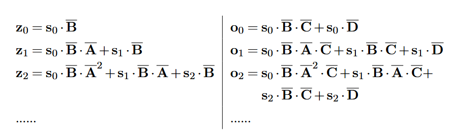

## 1 Parameter and Activation Sharing

冗余现象使得多数模型参数冗余度过高，训练与推理效率随之降低。降低冗余的常用思路是删减多余模块以简化模型，例如对复杂模型进行剪枝，或是在模型不同模块间共享子结构，从而得到更精简的模型。本节将介绍 `Transformer` 模型中的参数与中间状态共享方法。

参数共享架构在各类神经网络系统中应用广泛。CNN、RNN 都是典型案例，二者在输入的不同区域复用同一组参数（或网络层）。由此构建出的大型网络，其多个模块会采用相同结构并共享参数。 对于 `Transformer` 及其他序列模型，参数共享机制可作用于模型的不同层级。词嵌入共享便是一个简单示例：机器翻译任务中，常规做法是为两种语言分别构建嵌入层，也可以改用单个嵌入层同时服务两种语言，该层参数会在源端与目标端网络的联合训练中完成学习。

对于多层神经网络，层间参数共享是一种常用方法。假设模型由多层网络堆叠而成，且所有网络层结构完全一致:

$$
\mathbf{S}^l = \text{Layer}(\mathbf{S}^{l-1}; \theta^l) \tag{1}
$$

我们可以对部分或全部网络层进行参数绑定。例如，给定一组网络层 $\{l_1, l_2, \dots, l_n\}$，我们施加约束 $\theta^{l_1} = \theta^{l_2} = \dots = \theta^{l_n}$，由此可得到更精简的模型，也能简化模型的优化过程。在实际应用中，当网络层数较多时，这种层间共享模型优势显著：我们可以通过重复同一模块多次，构建出非常深的神经网络。

对于 `Transformer` 模型，参数共享也可应用于多头注意力机制中，<b>多查询注意力</b>便是典型示例。标准多头自注意力中第 $h$ 个头的输出可表示为：

$$
\begin{align*} 
\mathbf{C}_{h}^{\text{head}} &= \mathrm{Att}_{\mathrm{qkv}}(\mathbf{S}_{h}^{q}, \mathbf{S}_{h}^{k}, \mathbf{S}_{h}^{v}) \\ 
&= \mathrm{Att}_{\mathrm{qkv}}(\mathbf{S}\mathbf{W}_{h}^{q}, \mathbf{S}\mathbf{W}_{h}^{k}, \mathbf{S}\mathbf{W}_{h}^{v}) \tag{2}
\end{align*}
$$

其中 $\mathbf{S}_{h}^{q} = \mathbf{S}\mathbf{W}_{h}^{q}$、$\mathbf{S}_{h}^{k} = \mathbf{S}\mathbf{W}_{h}^{k}$、$\mathbf{S}_{h}^{v} = \mathbf{S}\mathbf{W}_{h}^{v}$ 分别为查询、键和值，它们是通过将输入 $\mathbf{S}$ 与不同的参数矩阵 $\mathbf{W}_{h}^{q}$、$\mathbf{W}_{h}^{k}$、$\mathbf{W}_{h}^{v}$ 进行线性变换得到的。在多查询注意力中，所有注意力头共享相同的键和值，但不同头使用不同的查询向量。该模型的形式如下所示：

$$
\mathbf{C}_{h}^{\text{head}} = \mathrm{Att}_{\mathrm{qkv}}(\mathbf{S}\mathbf{W}_{h}^{q}, \mathbf{S}\mathbf{W}_{0}^{k}, \mathbf{S}\mathbf{W}_{0}^{v}) \tag{3}
$$

&emsp;由于键 $\mathbf{S}\mathbf{W}_{0}^{k}$ 和值 $\mathbf{S}\mathbf{W}_{0}^{v}$ 与头索引 $h$ 无关，因此它们仅需计算和存储一次，无需为每个头重复冗余计算。这在推理阶段能显著节省计算量与内存带宽，尤其当注意力头数量较多时优势更为明显。凭借其高效性，多查询注意力（及其变体分组查询注意力）已成功应用于 `Llama 2`、`Falcon` 等现代大语言模型中。

将参数共享思路拓展到更广场景后，神经网络理论上还可共享中间状态。例如复用神经元激活值，能让子模块被多次调用时保持高效。该方法可直接用于 `Transformer` 的自注意力矩阵。实验表明，在部分自然语言处理任务中，相邻网络层的注意力图往往高度相似。因此一种高效方案是：只需计算一次稠密注意力图，后续网络层直接复用。

从更广的视角来看，共享机制本质是复用已有计算结果，而非即时重复运算，因此神经网络在多次运行时也能实现信息复用。<b>可逆残差网络</b>便是相关实例，该网络可通过后一层的激活值还原出前一层的激活结果。前向传播过程中，我们只需保留最后一层的输出；训练的反向传播阶段，再借助后层数据逐层复原各层输出。这种可逆结构会隐式复用前向传播产生的信息，有效降低模型的内存占用。

## 2 Alternatives to Self-Attention
### 2.1 CNNs as a Replacement for Self-Attention

`CNN` 结构简洁、应用广泛，有望成为自注意力模型的替代方案。若将 `CNN` 融入 `Transformer`，只需构建卷积子层，替换 `Transformer` 模块中的自注意力子层即可。卷积核的感受野有限，仅能捕获局部上下文信息，但堆叠多层卷积子层便可建模长距离依赖。`CNN` 的一大核心优势在于，其计算复杂度随序列长度 $n$ 呈线性增长，而自注意力模型为二次增长。同时，目前已有大量高度优化的卷积实现方案，便于在实际系统中落地序列建模任务。为进一步提升内存利用率，还可采用深度卷积等轻量化卷积变体。

### 2.2 Linear Attention

和诸多实用的序列建模方案一样，研究人员也十分关注线性模型的构建，以此提升长序列的处理速度。线性模型有多种定义形式，序列模型中常用的通用形式如下：

$$
\mathbf{z}_i = f(a \cdot \mathbf{z}_{i-1} + b \cdot \mathbf{s}_i) \tag{4}
$$

其中 $\mathbf{s}_i$ 表示模型在第 $i$ 步的中间状态，$\mathbf{z}_i$ 表示截至第 $i$ 步的历史状态汇总。显然这是一种循环模型：第 $i$ 步的输出仅依赖当前步输入与上一步输出。和主流神经网络设计一致，线性计算后会再接变换函数 $f(\cdot)$，它可以是激活函数或前馈网络。需要注意：仅当 $f(\cdot)$ 为线性函数时，上式才是标准线性模型。引入 $f(\cdot)$ 能提升建模灵活性，但若其为非线性形式，该模型便不再属于线性模型范畴。

只需对当前输入与上一时刻状态做线性变换，即可将 <b>式 (4) </b>拓展为标准循环神经网络模型：$\mathbf{z}_i = f(\mathbf{z}_{i-1}\mathbf{W}_z + \mathbf{s}_i\mathbf{W}_s)$。由此可很方便地将循环神经网络及其变体融入 `Transformer`，构建混合模型。

实际上，研究人员更倾向于构建线性注意力模型，在保证全局序列建模能力的同时，提升整体运行效率。实现该目标的一大难点在于，标准自注意力本身并非线性形式。先回顾自注意力的表达式：

$$
\begin{align*} 
\mathrm{Att}_{\mathrm{self}} &= \mathbf{A} \cdot \mathbf{V} \\ 
&= \psi(\mathbf{Q} \cdot \mathbf{K}^\top) \cdot \mathbf{V} \tag{5}
\end{align*}
$$

其中 $\psi(\cdot)$ 是一个由缩放、指数运算、掩码和归一化组成的复合函数（即 $\psi(a) = \text{Normalize}(\text{Mask}(\exp(\frac{a}{\sqrt{d}})))$）。由于 $\psi(\cdot)$ 是复杂的非线性函数，无法直接简化计算，通常需要分别执行两次矩阵乘法（一次在 $\psi(\cdot)$ 内部，一次在外部）。这就要求显式存储所有键值对，并在处理每个查询时逐一访问，因此自注意力模型的计算复杂度会随序列长度 $n$ 呈二次增长。

尽管自注意力中键与值是成对存在的，但二者在计算中是分步使用的。一种巧妙的解法是将查询与键值交互解耦，使上下文信息的编码独立于具体的查询。其核心思路是：通过对查询和键应用特征映射函数 $\phi(\cdot)$，绕过非线性的 `Softmax` 运算。我们将 $\mathbf{Q}$ 和 $\mathbf{K}$ 变换为：$\mathbf{Q}' = \phi(\mathbf{Q}) \in \mathbb{R}^{n \times d'}, \quad \mathbf{K}' = \phi(\mathbf{K}) \in \mathbb{R}^{n \times d'}$，此时，注意力机制可重新表示为：

$$
\begin{align*} 
\mathrm{Att}_{\mathrm{self}} &\equiv \psi'(\mathbf{Q}' \cdot \mathbf{K}'^\top) \cdot \mathbf{V} \\ &= \mathbf{D}^{-1} (\mathbf{Q}' \cdot \mathbf{K}'^\top) \cdot \mathbf{V} \\ 
&= \mathbf{D}^{-1} \left( \mathbf{Q}' \cdot (\mathbf{K}'^\top \cdot \mathbf{V}) \right) \tag{6}
\end{align*}
$$

其中 $\mathbf{D}$ 是对角归一化矩阵，且 $\psi'(\mathbf{Z}) = \mathbf{D}^{-1}\mathbf{Z}$。在该变换空间中，查询-键点积无需再经过指数形式的 `Softmax` 归一化，仅需乘以 $\mathbf{D}^{-1}$ 完成归一化即可。由于此时核心运算为纯矩阵乘法，我们可以利用矩阵乘法的结合律改变计算顺序。

由此可以得到一种高效的自回归形式：首先通过 $\mathbf{K}'^\top \cdot \mathbf{V}$ 对键和值进行聚合，再让查询对这个全局表示进行注意力计算。由于 $\mathbf{K}'^\top \cdot \mathbf{V} = \sum_{j=1}^{n} \mathbf{k}'{_j}^\top \cdot \mathbf{v}_j$，我们可以将 $\mathbf{K}'^\top \cdot \mathbf{V}$ 写成<b>式 (4) </b>的形式，如下所示：

$$
\mu_j = \mu_{j-1} + \mathbf{k}'{_j}^\top \cdot \mathbf{v}_j \tag{7}
$$

其中 $\mu_j \in \mathbb{R}^{d' \times d}$ 是一个变量，它每次累加一项 $\mathbf{k}'{_j}^\top \cdot \mathbf{v}_j$。同理，我们可以定义另一个变量 $\nu_j \in \mathbb{R}^{d'}$ 

$$
\nu_j = \nu_{j-1} + \mathbf{k}'{_j}^\top \tag{8}
$$

据此，第 $j$ 个查询对应的自注意力输出可表示为：

$$
\mathrm{Att}_{\mathrm{self},j} = \frac{\mathbf{q}'_j \cdot \mu_n}{\mathbf{q}'_j \cdot \nu_n} \tag{9}
$$

显然，该模型实现了线性时间复杂度，因为 $\mu_n$ 和 $\nu_n$ 随序列长度 $n$ 呈线性增长。在该模型的简单实现中，只需维护 $\mu_j$ 和 $\nu_j$ 两个状态变量即可。每当遇到新的查询时，我们更新 $\mu_j$ 和 $\nu_j$，然后计算：$\mathrm{Att}_{\mathrm{self},j} = \frac{\mathbf{q}'_j \cdot \mu_j}{\mathbf{q}'_j \cdot \nu_j}$。

对线性注意力模型的一个直接扩展，是让<b>式 (7), (8) </b>能够以不同权重组合各项。例如，我们可以将 $\mu_j$ 和 $\nu_j$ 重新定义为：

$$
\begin{align*} 
\mu_j &= a \cdot \mu_{j-1} + (1 - a) \cdot \mathbf{k}'^\top_j \cdot \mathbf{v}_j \tag{10} \\ 
\nu_j &= a \cdot \nu_{j-1} + (1 - a) \cdot \mathbf{k}'^\top_j \tag{11}
\end{align*}
$$

并照常对参数 $a$ 进行训练。此外，我们也可以将 $a$ 视作门控变量，使用额外的神经网络来计算其取值。

我们已经了解了为注意力机制设计线性模型的通用思路。这类模型的核心设计选择是移除基于 `Softmax` 的归一化，从而得到基于模型各类中间状态的线性表示形式。这一思路催生了多种近年提出的自注意力替代方案。尽管这些系统的架构各不相同，但其底层模型均具有<b>式 (4) </b>所描述的类似形式。需要注意的是，通过使用循环模型的通用形式，我们不再局限于标准的 `QKV` 注意力机制；相反，我们可以为查询、键和值赋予新的含义与形式。

此处的讨论也与之前介绍的记忆模型相关。从记忆的角度来看，键和值可以被视为上下文的编码。因此，在上述线性注意力模型中，我们构建了一个记忆系统，其中仅用两个简单变量 $\mu_j$ 和 $\nu_j$ 就可以表示位置 $j$ 之前的所有上下文信息。这形成了一种固定长度的记忆，在实际应用中非常有用。

### 2.3 State-Space Models

在控制系统中，<b>状态空间模型 (<i>SSMs</i>) </b>是一类系统的表示形式，其输入与输出通过若干状态变量（简称状态）关联，系统的动态特性则由这些状态的一阶微分方程描述。作为一个简单示例，我们考虑一个以状态空间形式表示的连续时间线性时不变系统。本节统一采用行向量约定：所有变量均表示为行向量，线性变换作用于向量右侧：

$$
\begin{align*} \frac{d\mathbf{z}(t)}{dt} 
&= \mathbf{z}(t) \cdot \mathbf{A} + \mathbf{s}(t) \cdot \mathbf{B} \tag{12} \\ 
\mathbf{o}(t) &= \mathbf{z}(t) \cdot \mathbf{C} + \mathbf{s}(t) \cdot \mathbf{D} \tag{13}
\end{align*}
$$

其中 $\mathbf{s}(t)$、$\mathbf{o}(t)$ 和 $\mathbf{z}(t)$ 分别表示时刻 $t$ 的输入变量、输出变量和状态变量的值。在一般情况下，这些变量可以具有不同的维度。为简化起见，我们假设 $\mathbf{s}(t), \mathbf{o}(t) \in \mathbb{R}^d$，且 $\mathbf{z}(t) \in \mathbb{R}^{d_z}$。<b>式 (12) </b>被称为状态方程，其中 $\mathbf{A} \in \mathbb{R}^{d_z \times d_z}$ 是状态矩阵，$\mathbf{B} \in \mathbb{R}^{d \times d_z}$ 是输入矩阵。<b>式 (13) </b>被称为输出方程，其中 $\mathbf{C} \in \mathbb{R}^{d_z \times d}$ 是输出矩阵，$\mathbf{D} \in \mathbb{R}^{d \times d}$ 是前馈矩阵。

这些方程描述了从输入 $\mathbf{s}(t)$ 到输出 $\mathbf{o}(t)$ 随时间变化的连续映射关系，因此常被用于处理连续时间序列数据。为了将该模型应用于序列建模，我们需要对上述方程进行修改，以得到离散形式的状态空间表示。假设 $\{\mathbf{s}_0, \mathbf{s}_1, \dots, \mathbf{s}_n\}$ 是从 $\mathbf{s}(t)$ 中以时间步长 $\Delta t$ 采样得到的输入数据点序列，类似地，定义 $\{\mathbf{z}_0, \mathbf{z}_1, \dots, \mathbf{z}_n\}$ 和 $\{\mathbf{o}_0, \mathbf{o}_1, \dots, \mathbf{o}_n\}$ 分别为状态向量和输出向量的序列。基于这些符号，我们可以写出离散化的 `SSM` 的方程：

$$
\begin{align*} 
\mathbf{z}_t &= \mathbf{z}_{t-1} \cdot \overline{\mathbf{A}} + \mathbf{s}_t \cdot \overline{\mathbf{B}} \tag{14} \\ 
\mathbf{o}_t &= \mathbf{z}_t \cdot \overline{\mathbf{C}} + \mathbf{s}_t \cdot \overline{\mathbf{D}} \tag{15}
\end{align*}
$$

这种形式的 `SSM` 定义了一个带有残差连接的 `RNN`。<b>式 (14) </b>描述了一个循环单元，它读取第 $t$ 步的输入和第 $t-1$ 步的状态，且不使用任何激活函数。<b>式 (15) </b>描述了一个输出层，它将状态 $\mathbf{z}_t$ 的线性变换与残差映射 $\mathbf{s}_t$ 相加。

参数 $\overline{\mathbf{A}}$、$\overline{\mathbf{B}}$、$\overline{\mathbf{C}}$ 和 $\overline{\mathbf{D}}$ 可以通过多种不同方式从 $\mathbf{A}$、$\mathbf{B}$、$\mathbf{C}$ 和 $\mathbf{D}$ 推导得出，具体取决于<b>式 (12) </b>如何由<b>式 (14) </b>近似表示。一种时间离散化方法是<b>双线性变换</b>，另一种方法是采用<b>零阶保持 (<i>ZOH</i>) </b>离散化。

<b>式 (14) </b>的循环形式使得在一系列离散时间步上计算状态和输出变得十分简便。我们可以将 $\mathbf{z}_t$ 和 $\mathbf{o}_t$ 以前馈方式展开：

很容易得到：

$$
\begin{align*} 
\mathbf{z}_t &= \sum_{i=0}^{t} \mathbf{s}_i \cdot \overline{\mathbf{B}} \cdot \overline{\mathbf{A}}^{t-i} \tag{16} \\ 
\mathbf{o}_t &= \sum_{i=0}^{t} \mathbf{s}_i \cdot \overline{\mathbf{B}} \cdot \overline{\mathbf{A}}^{t-i} \cdot \overline{\mathbf{C}} + \mathbf{s}_t \cdot \overline{\mathbf{D}} \tag{17}
\end{align*}
$$

显然，<b>式 (17) </b>的右侧可以被解释为一个卷积项与一个线性项的和。鉴于

$$
\begin{align*} 
\sum_{i=0}^{t} \mathbf{s}_i \cdot \overline{\mathbf{B}} \cdot \overline{\mathbf{A}}^{t-i} \cdot \overline{\mathbf{C}} 
={}& 
\begin{bmatrix} \mathbf{s}_0 & \mathbf{s}_1 & \dots & \mathbf{s}_t \end{bmatrix} \cdot \\ 
& 
\begin{bmatrix} \overline{\mathbf{B}} \cdot \overline{\mathbf{A}}^{t} \cdot \overline{\mathbf{C}} & \overline{\mathbf{B}} \cdot \overline{\mathbf{A}}^{t-1} \cdot \overline{\mathbf{C}} & \dots & \overline{\mathbf{B}} \cdot \overline{\mathbf{C}} \end{bmatrix}^\top \tag{18}
\end{align*}
$$

我们定义一个参数化的卷积滤波器：

$$
\mathbf{W}_{\text{ssm}} = \begin{bmatrix} \overline{\mathbf{B}} \cdot \overline{\mathbf{A}}^{n_{\max}} \cdot \overline{\mathbf{C}} & \overline{\mathbf{B}} \cdot \overline{\mathbf{A}}^{n_{\max}-1} \cdot \overline{\mathbf{C}} & \ldots & \overline{\mathbf{B}} \cdot \overline{\mathbf{C}} \end{bmatrix} \tag{19}
$$

其中 $n_{\max}$ 为序列的最大长度。此时，对于序列 $\mathbf{S} = \begin{bmatrix} \mathbf{s}_0 \\ \vdots \\ \mathbf{s}_n \end{bmatrix}$，状态空间模型的输出可表示为：

$$
\mathbf{O} = \text{Conv}(\mathbf{S}, \mathbf{W}_{\text{ssm}}) + \text{Linear}(\mathbf{S}, \overline{\mathbf{D}}) \tag{20}
$$

其中 $\text{Conv}(\cdot)$ 表示卷积操作，$\text{Linear}(\cdot)$ 表示线性变换操作。对状态空间模型的这种处理方式，使得系统能够通过快速并行卷积算法高效实现。

另一个计算瓶颈在于求解 $\overline{\mathbf{A}}^n$ 时需要反复进行矩阵乘法。当 $n$ 较大时，该运算不仅计算开销高，还存在数值不稳定的问题。现代状态空间模型普遍采用<b>对角化</b>方案：通过对状态空间做基变换，使矩阵 $\mathbf{A}$（或变换后的 $\overline{\mathbf{A}}$）化为对角矩阵。对于参数为 $(\mathbf{A},\mathbf{B},\mathbf{C},\mathbf{D})$ 的状态空间模型，引入可逆变换矩阵 $\mathbf{U}$，可得到等价模型 $(\mathbf{U}\mathbf{A}\mathbf{U}^{-1},\mathbf{B}\mathbf{U}^{-1},\mathbf{U}\mathbf{C},\mathbf{D})$。可以证明，两种形式仅为基变换下的不同表达，数学上完全等价。

若对矩阵执行上述变换，且假设 $\mathbf{A}$ 可对角化为标准形式 $\mathbf{P}^{-1}\Lambda\mathbf{P}$（其中 $\boldsymbol{\Lambda}$ 为对角矩阵），便可将状态矩阵约束为对角矩阵，进而得到对角状态空间模型。以卷积形式的滤波器为例，将 $\mathbf{A} = \mathbf{P}^{-1}\Lambda\mathbf{P}$ 代入后，可把 $\mathbf{B} \cdot \overline{\mathbf{A}}^t \cdot \mathbf{C}$ 改写为：

$$
\begin{align*} 
\overline{\mathbf{B}} \cdot \overline{\mathbf{A}}^t \cdot \overline{\mathbf{C}} &= \overline{\mathbf{B}} \cdot (\mathbf{P}^{-1}\Lambda\mathbf{P})^t \cdot \overline{\mathbf{C}} \\ 
&= \overline{\mathbf{B}} \cdot (\mathbf{P}^{-1}\Lambda\mathbf{P}) \cdot (\mathbf{P}^{-1}\Lambda\mathbf{P}) \cdots (\mathbf{P}^{-1}\Lambda\mathbf{P}) \cdot \overline{\mathbf{C}} \\ 
&= (\overline{\mathbf{B}} \cdot \mathbf{P}^{-1}) \cdot \Lambda^t \cdot (\mathbf{P} \cdot \overline{\mathbf{C}}) \tag{21}
\end{align*}
$$

由于 $\Lambda$ 是对角矩阵，我们只需将其所有元素取 $t$ 次幂，即可高效计算出 $\Lambda^t$。这样一来，我们就得到了计算成本更低的模型，在该模型中：

$$
\begin{align*} 
\overline{\mathbf{A}}' &= \Lambda \tag{22} \\ 
\overline{\mathbf{B}}' &= \overline{\mathbf{B}} \cdot \mathbf{P}^{-1} \tag{23} \\ 
\overline{\mathbf{C}}' &= \mathbf{P} \cdot \overline{\mathbf{C}} \tag{24} \\ 
\overline{\mathbf{D}}' &= \overline{\mathbf{D}} \tag{25}
\end{align*}
$$

将 `SSM` 应用于 `Transformer` 的方式十分简便：只需按照<b>式 (14), (15)</b>，用状态空间模型子层替换原有自注意力子层即可。前文已经说明，状态空间模型与卷积神经网络、循环神经网络均存在紧密关联。在序列建模任务中，既可以像循环神经网络那样逐序列串行处理，也能仿照卷积神经网络实现并行运算。由此催生了一种全新范式：训练阶段采用卷积网络的并行模式，借助高效的并行算法加速训练；预测阶段则转化为串行更新形式，依托类循环网络结构实现高效推理。

`SSM` 的形式体系为序列建模搭建了统一框架。借助并行与串行两种互补视角，我们可针对不同硬件条件与延迟要求进行优化。近期多款模型均受这种双重特性启发，成功融合了 `Transformer` 的并行计算能力与循环神经网络的高效推理优势。

