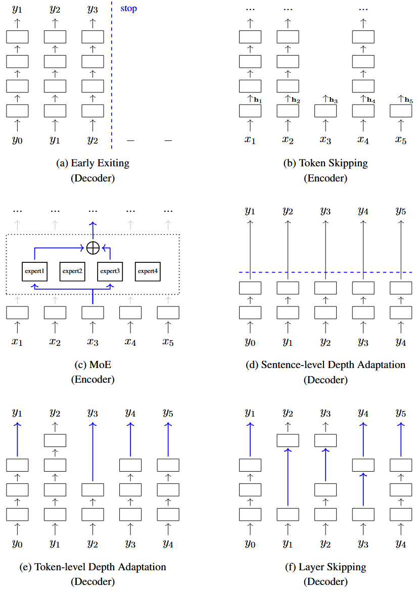

## 1 Conditional Computation

此前在对高效 `Transformer` 模型的探讨中，我们均假定模型架构在训练前就已确定，且全程保持固定。接下来我们转向架构自动学习的研究方向，模型可表示为如下形式：

$$
\mathbf{y} = \mathrm{Model}\big(\mathbf{x},\,g(\mathbf{x})\big) \tag{1}
$$

其中 $\mathbf{x}$ 和 $\mathbf{y}$ 是模型的输入和输出。给定一个输入 $\mathbf{x}$，函数 $g(\mathbf{x})$ 会返回模型结构和相应的参数。通常我们遵循机器学习的通用惯例：固定模型架构，仅学习模型参数，此时 $g(\boldsymbol{\mathbf{x}}) = \theta$。在这种设定下，任务目标是依托既定架构与训练数据学习最优参数；在测试集上进行预测时，仍使用相同的模型架构与优化后的参数。

该思路一个自然的拓展方向是同时学习模型架构与模型参数。在架构学习场景中，我们期望得到函数 $\hat{g}(\mathbf{x})$，该函数可依据输入 $\mathbf{x}$ 输出最优的模型架构与参数取值。但遍历全部架构、参数组合构成的假设空间在计算上不可行，因此需要落地实用算法，主流可分为两类方法。

- **Neural Architecture Search (NAS)**。在 `AutoML` 领域中，神经架构搜索是在神经网络搜索空间内遍历筛选，以寻找满足指定最优指标网络结构的技术。确定最优网络架构后，再按常规流程完成参数训练，最终用于新样本的预测。为保证搜索过程算力可控，通常搭配搜索空间剪枝、快速搜索算法等辅助手段。
- **Dynamic Neural Networks**。动态神经网络的核心思想是让网络依据不同输入实现自适应调整。理想情况下我们需要学习得到函数 $\hat{g}(\cdot)$，对任意新输入 $\mathbf{x}_\mathrm{new}$，采用 $\mathrm{Model}(\mathbf{x}_\mathrm{new},\hat{g}(\mathbf{x}_\mathrm{new}))$ 完成推理。由此在测试阶段，不同输入能够匹配差异化的网络结构与参数。但想要构造可生成任意网络的 $\hat{g}(\cdot)$ 在工程上无法实现，实际应用中，$\hat{g}(\cdot)$ 一般用来从一个超网络中挑选子网络，原问题也就简化为：学习根据输入挑选合适子网络。

从机器学习理论层面来看，神经架构搜索具备通用性，能够适配任意神经网络结构。但落地实操时，想要搜寻出兼顾高效性、拟合能力与泛化性能的网络依旧存在不小难度。

本小节将聚焦动态神经网络中的一类代表性方案：<b>条件计算 (<i>Conditional Computation</i>)</b>。该概念最早源于神经网络神经元的动态筛选思路，现阶段则多指动态选用网络局部模块的技术。从狭义角度理解，$g(\cdot)$ 可看作自适应网络，能够按需增减神经元、网络层等计算单元的数量。依托这套自适应机制，模型计算量可随输入场景灵活变化，以此在模型精度与推理延迟之间取得理想平衡。

实现上述目标的常用手段是学习跳过部分计算步骤，仅启用网络的部分子模块进行运算。其中最简单的方案之一即为<b>提前退出 (<i>Early Exiting</i>)</b>：在序列编码或解码途中提前终止计算，该方法广泛应用于对推理时延要求严苛的序列生成落地场景。

设模型可生成的最长序列为 $y_1\dots y_{n_\mathrm{max}}$，$\mathbf{s}_1\dots \mathbf{s}_{n_\mathrm{max}}$ 为 `Transformer` 顶层对应的隐状态序列。我们构建判别网络 $f_\mathrm{stop}(\cdot)$，逐次输入单步隐状态 $\mathbf{s}_i$，输出二分类变量 $c\in\{\text{stop},\,\text{nonstop}\}$ 的概率分布：

$$
\mathrm{Pr}(c|\mathbf{s}_i)=f_\mathrm{stop}(\mathbf{s}_i) \tag{2}
$$

&emsp;当 $\Pr(\text{stop}|\mathbf{s}_i)$ 取值足够大时，生成过程终止，例如:

$$
\Pr(\text{stop}|\mathbf{s}_i) \ge \Pr(\text{nonstop}|\mathbf{s}_i) + \theta_{\text{stop}} \tag{3}
$$

其中 $\theta_{\ce{stop}}$ 代表区分两种动作所需的最小边界。$f_{\ce{stop}}(\cdot)$ 可通过多种不同形式进行设计。例如在大量实际应用中，停止准则依托简易启发式规则构建；也可将函数 $f_{stop}(\cdot)$ 定义为神经网络，并借助标注数据集完成模型训练。

上述方法能够简便拓展，用于实现部分词元的跳过处理。这种基于学习的词元跳过方案一般应用于编码阶段，该阶段所有输入词元会一次性提前输入。设 $\mathbf{h}_1,\dots,\mathbf{h}_m$ 为序列 $\mathbf{x}_1,\dots,\mathbf{x}_m$ 的底层特征表示。参照<b>式 (2)</b>，我们可以构造概率模型 $\Pr(c|\mathbf{s}_i)\ (c\in\{\ce{skip},\ce{nonskip}\})$，用来判断词元 $x_i$ 是否可以被跳过。<b>图 1 (a)(b) </b>分别为提前退出机制与词元跳过机制的示意图。

条件计算的第二种实现思路是采用<b>稀疏专家模型</b>，其中最具代表性的便是 `MoE`。在深度学习中，这类模型由多个专家子网络构成，所有专家网络结构一致但参数互不相同，只需增加专家数量即可构建超大模型。无论训练还是推理阶段，模型都会通过路由算法仅激活少量专家模块（见<b>图 1 (c)</b>）。由于新输入会被路由分配至不同专家，`MoE` 属于自适应网络。

第三种让 `Transformer` 随输入动态适配的条件计算方案为动态缩减网络层数，现有多种相关优化方法用以提升推理效率。其中最简思路是在中间某隐层提前终止前向运算，在保证预测精度的前提下结束计算（见<b>图 1 (d)(e)</b>）。具体实现分为两类：一是整序列共用统一终止层数，即<b>句子层级自适应深度模型</b>；二是逐个词元独立判定所需层数，即<b>词元层级自适应深度模型</b>。

假设共有 $L$ 层堆叠网络。理想情况下，我们希望从这些层级里选出尽可能浅的一层作为最终隐层来完成预测。但无法直接以第 $L$ 层的结果作为最优参考标准，因为推理阶段无法提前获知最后一层的输出。因此只能结合当前已经算到第 $i$ 层的特征，判断是否在第 $i$ 层终止后续层级计算。

现有一个 `Transformer` 解码器，每一步都会输出词表 $V$ 上的概率分布。沿用惯例，记第 $i$ 步第 $l$ 层的输出特征为 $\mathbf s_i^l$。针对每一个$\mathbf s_i^l$，额外增设输出层（<b>提前退出分类器</b>），基于该特征生成词表上的概率分布 $\mathbf p_i^l$，表达式如下：

$$
\mathbf p_{i}^{l}=\mathrm{Softmax}\left(\mathbf s_{i}^{l}\cdot \mathbf W_o^l\right) \tag{4}
$$

其中 $\mathbf W_o^l\in \mathbb R^{d\times |V|}$ 为参数矩阵。由此额外增设 $L-1$ 个输出层，分别对应深度 $1$ 至 $L-1$ 的各隐层。训练阶段，对 $\{\mathbf p_i^1,\dots,\mathbf p_i^{L-1}\}$ 逐一计算交叉熵损失，将这些附属输出层与 `Transformer` 主体网络联合训练。测试阶段网络照常逐层前向运算，依托 $\{\mathbf p_i^1,\dots,\mathbf p_i^l\}$ 与 $\{\mathbf s_i^1,\dots,\mathbf s_i^l\}$ 判断是否在第 $l$ 层提前终止计算，提前退出存在多种判定规则，举例如下：
- 常用判定准则基于模型预测置信度指标：一种简易方案是计算 $\mathbf p_i^l$ 的熵值，当熵低于预设阈值时执行提前退出。
- 另一种方式是将 $\mathbf p_i^l$ 中元素的最大取值作为预测置信度。
- 除了仅依据单层输出进行判断，也可通过连续多层的输出或隐状态变化量作为判定依据。例如计算 $\mathbf p_i^{l-1}$ 与 $\mathbf p_i^l$、或是 $\mathbf s_i^{l-1}$ 与 $\mathbf s_i^l$ 之间的相似度，若相似度超过给定阈值，则判定网络输出趋于收敛，停止继续堆叠后续层级。
- 上述方法还可拓展为观测各层附属分类器的预测结果变化：若连续多层分类器输出的预测词保持一致，模型即可触发提前退出。

目前存在多种优化提前退出算法的思路：第一种思路是改进各层的预测形式，例如构建模型直接预判当前输入所需的运算层数；第二种优化方向聚焦于改进模型训练策略，通过设计多样化损失函数来优化旁路分类器的训练效果；除此之外，还有研究通过融合多层特征输出，利用多尺度表征协同完成预测。

词元层级自适应深度模型存在一个缺陷：部分历史词元可能未经过对应深度的网络计算，缺失该深度下的特征表示。这种场景下标准自注意力无法直接使用，因为无法在同一表征层级上对前文词元做注意力交互。训练阶段可通过完整运行全部 $L$ 层网络规避该问题；推理阶段有两种解决方案，一是复制当前退出层的特征补齐剩余层级，二是改造自注意力结构，使其能够跨不同深度调取历史词元的特征参与计算。

也可任选部分层级组合搭建浅层网络，由此自适应深度模型能够进一步泛化为层跳过模型（见<b>图 1 (f)</b>）。和提前退出问题类似，层跳过问题可建模为学习任务：训练分类器来判定某一层是否需要被舍弃。针对大规模深度神经网络训练层跳过模型难度较高。在工程落地场景中，采用启发式规则或轻量化简易模型构建含跳层结构的网络仍是务实选择。

## 2 Model Transfer and Pruning

目前已有诸多大型 `Transformer` 模型被成功应用于各类自然语言处理任务。随之产生一个常见问题：能否把训练完备的大模型压缩为小模型，以此提升推理效率？从宏观视角来看，该问题可归为迁移学习范畴，即把知识从源模型迁移至目标模型。

### 2.1 Knowledge Distillation

<b>知识蒸馏 (<i>knowledge distillation</i>) </b>是将大型神经网络（或神经网络集成）中的知识压缩至小型网络的技术。在神经网络的监督学习中，损失函数通常用来衡量模型预测结果与真实标签间的误差，模型通过最小化该损失拟合标准答案。尽管模型依托训练数据按此方式优化，但训练的最终目标是在未知数据上实现良好泛化；仅使用真实标签训练难以达成该目标，因为真值标签无法提供面向泛化能力的直接监督信号。知识蒸馏不再强制小模型拟合真实标签，而是训练其复刻大模型的输出行为或概率分布，以此将预训练大模型的知识迁移至待训练的小模型。

<b>师生训练</b>是知识蒸馏中常用方案：教师模型一般为经过充分训练、泛化性能优异的大容量网络，学生模型则是层数更少等规格的小型网络，知识从教师迁移至学生。最简蒸馏思路是把教师模型输出当作标签来训练学生。设教师 `Transformer` 模型对输入 $\mathbf x$ 输出一组概率分布 $\{\Pr(\cdot|y_0,\mathbf x),\dots,\Pr(\cdot|y_0\dots y_{n-1},\mathbf x)\}$，我们将 $\Pr(\cdot|y_0\dots y_{i-1},\mathbf x)$ 记作 $\tilde{\mathbf p}_i$，同输入下学生模型输出记为 $\mathbf p_i$。选用交叉熵等损失函数 $\mathrm{Loss}(\tilde{\mathbf p}_i,\mathbf p_i)$ 衡量二者分布差异，整序列损失定义如下：

$$
\mathcal{L}(\mathbf x,\theta) = \frac{1}{n}\sum_{i=1}^{n}\mathrm{Loss}(\tilde{\mathbf p}_i,\mathbf p_i) \tag{5}
$$

其中 $\theta$ 表示学生模型的参数。通过这个损失函数，针对源序列集合 $\{\mathbf x_1,\dots,\mathbf x_K\}$，通过最小化目标 $\sum_{k=1}^K \mathcal{L}(\mathbf x_k,\theta)$ 即可完成参数 $\theta$ 的优化。

研究者在基础蒸馏方案之上提出多种拓展方法以实现跨模型知识迁移：第一种思路改用隐状态替代输出概率作为监督目标，优化目标为缩小师生模型对应隐特征的差异；第二种方式不再以各层输出作为训练标签，转而建模样本间关联，通过最小化师生模型的关联表征差异训练学生网络，例如依托 `Transformer` 搭建关联编码模块，约束批量样本在学生侧的关联表征逼近教师模型。

在序列生成任务中有一种特殊的知识蒸馏方式，可视作<b>数据增强</b>手段，常用来训练轻量化模型。以机器翻译任务为例，将成熟的翻译教师模型能力迁移至学生模型：给定源语言句子集合$\{\mathbf x_1,\dots,\mathbf x_K\}$，用教师模型将每个 $\mathbf x_k$ 翻译得到译文 $\tilde {\mathbf y}_k$，由此构造平行语料$\{(\mathbf x_1,\tilde {\mathbf y}_1),\dots,(\mathbf x_K,\tilde {\mathbf y}_K)\}$，再用该数据集常规训练学生模型。该增强方案不依赖网络结构，无需知晓师生模型内部架构，即便教师模型是黑盒也能使用。

### 2.2 Structured Pruning

剪枝是应用广泛的模型压缩算法。无结构化剪枝仅保留部分神经元连接权重，生成稀疏网络，但这类稀疏模型往往需要专用代码与硬件加速，落地受限。<b>结构化剪枝</b>操作粒度更大、实现更简便，一次性删减整组神经元或连接，例如直接移除完整网络层得到浅层模型。`Transformer` 分层加上多头注意力的架构适配结构化剪枝，常用方案有两种：剪去多头注意力中的部分注意力头，或是直接剔除完整 `Transformer` 层。

从形式化角度，可将神经网络表示为参数组集合 $\{\theta_1,\dots,\theta_R\}$，每组参数对应网络里一个独立子模块。剪枝优化目标是从中筛选子集，在模型性能降幅可控的前提下大幅削减计算开销。但遍历搜寻最优子集不具备可行性：候选子集呈组合爆炸式增长，逐一验证所需算力成本过高。

结构化剪枝主要有三类实现思路：第一种是随机剔除模型组件，多次随机剪枝生成多个候选子模型，从中挑选效果最优的版本；第二种依靠启发式规则判定冗余模块，常利用权重范数、梯度范数等指标衡量参数组 $\theta_r$ 的重要度，指标低于预设阈值则对该模块剪枝；第三种将剪枝转化为连续优化问题，为各子模块增设可学习的门控参数，用门控取值标记模块是否保留，训练完成后依据门控结果得到最终剪枝模型。目前剪枝大多不再是模型训练完毕后的后置操作，而是嵌入整个训练流程同步优化。

## 3 Sequence Compression

在序列建模与生成任务中，输入、输出序列长度会显著影响时空复杂度，因此精简序列长度具备实用价值。该问题对 `Transformer` 尤为关键：其时空复杂度随序列长度呈二次方增长，超长序列极易造成显存占用过高、推理延迟过大。之前介绍过通过修改 `Transformer` 原生架构 (稀疏注意力、滑动窗口注意力等) 适配长序列，本节则聚焦序列压缩方法，把原始长序列压缩至更短的有效长度。

一种简易方案是将输入序列映射为定长表征。例如可把整段向量序列编码为单个向量；也可选取序列中固定数量的隐状态，组成定长新序列，以此留存更多原始信息。另一种变长转定长的思路：用 $r$ 个可学习隐向量 $\{\mathbf u_1,\dots,\mathbf u_r\}$ 与输入向量 $\{\mathbf x_1,\dots,\mathbf x_m\}$ 做交叉注意力：将隐向量作为查询、输入向量作为键值来执行标准 `QKV` 交叉注意力，最终输出长度恒为 $r$ 的向量序列，作为下游模型的定长输入。

第二种方案是通过下采样压缩序列长度，步幅卷积是经典下采样手段，在计算机视觉与语音领域应用成熟。但下采样难免造成信息损耗，需在序列压缩程度与下游模型效果之间权衡取舍。

在 `NLP` 中，序列压缩与输入文本分词密切相关，因此分词是优化序列长度的实用手段。将文本切分为字符这类细粒度单元，能降低数据稀疏度、便于词嵌入学习，但会造成序列过长；反之，以更大粒度单元分词可缩短序列，却容易引发数据稀疏问题。基于全局统计的确定性分词可通过超参调控序列长度，例如字节对编码 `(BPE)` 中，扩充词表容量能够减少分词后的 `token` 数量。另一种方案是借助模型从多种分词候选里择优，类似概率生成模型，可在分词筛选准则中加入先验约束，优先选取分词长度更短的结果。

第四类序列压缩方案为直接舍弃序列内部分 `token`。工程常用手段是序列长度超出阈值时做截断，该思路和条件计算里的提前退出、层跳过思想相通，之前的相关算法可直接复用。这类删 `token` 操作又称 `token` 剪枝：剔除对整句语义贡献低的字词，在保证下游任务精度基本不变的前提下有效缩短序列长度。

## 3 High Performance Computing Methods

前文从深度学习算法层面介绍了高效 `Transformer` 方案，但尚未结合硬件运行效率展开。现代硬件具备多种运行架构，算法实际节省的耗时与显存开销高度依赖硬件规格。

本小节介绍面向硬件的 `Transformer` 优化方案。首先是应用广泛的低精度/混合精度量化。传统网络普遍采用单精度、双精度浮点存储参数与中间特征，多数场景下无需这么高的精度。改用半精度乃至更低精度浮点后，模型体积可减半。半精度运算需要硬件与线性代数算子接口适配，但无需改动网络结构，仅小幅调整代码，可用于 `Transformer` 训练、推理任一阶段。

近年来，量化技术大幅优化了大 `Transformer` 模型的落地部署。在信号处理中，量化是把连续浮点数值映射为离散定点整数的运算，由量化器实现。神经网络量化器包含量化、反量化两个函数：量化函数将浮点数转为低位宽整数，其简易表达式如下：

$$
Q(x)=\left\lfloor \frac{x}{s} \right\rceil \tag{6}
$$

其中 $\lfloor\cdot\rceil$ 代表 `round` 运算，$x$ 为浮点输入值，$s$ 是量化步长，用于调控量化精细程度；量化函数需搭配反量化函数协同使用:

$$
D(r) = s \cdot r \tag{7}
$$

基于上述定义，量化器可以写作 $D(Q(x)) = s\cdot\left\lfloor \frac{x}{s}\right\rceil$，$D(Q(x))$ 与原数值 $x$ 的差值即为量化误差。缩小量化步长 $s$ 通常能够降低量化误差；实际工程中需要选取合适 $s$，让量化后的整数均匀布满整型数值取值区间。常用取值：$s=\frac{\max\{D(r)\}}{2^{p}-1}$，式中 $p$ 为量化比特位宽，$\max\{D(r)\}$ 是反量化后的最大有效值。

量化落地至 `Transformer` 的实现逻辑较为直观：借助量化函数 $Q(x)$ 对输入与模型参数量化，送入全整型运算的量化 `Transformer`，所有网络层基于整型张量完成计算，实现纯整数算术运算。和深度学习各类近似优化手段一致，量化压缩会带来精度损耗：整数运算拟合连续浮点计算天然存在近似误差，网络层数越深误差累积越明显；加之自注意力等模块涉及复杂线性代数运算，直接粗暴量化极易造成效果大幅下滑。

优化思路分为两类：一是重构网络结构，设计适配量化的轻量化子模块；二是量化网络主流方案——层间插入反量化运算，将单层输出还原为浮点张量供后续正常流转。以浮点矩阵乘法 $\mathbf{a\cdot A}$ 举例：先分别量化 $\mathbf a、\mathbf A$，通过整型矩阵乘法运算后再反量化，最终以极低算力得到近似结果$D(Q(a)\cdot Q(A))$。

但若每层前后都嵌套量化 $Q(\cdot)$ 与反量化 $D(\cdot)$，会引入额外运算开销；部分场景下，量化、反量化的耗时甚至超过整型运算省下的开销。一般仅当网络规模足够大时，量化收益才可覆盖额外开销。工程上通常只对高开销算子做量化，当下大模型多仅量化大规模矩阵乘法，以此大幅节约算力与显存。

量化既可用于训练也可用于推理，业界主流是<b>训练后量化 (<i>PTQ</i>)</b>：在浮点模型训练完毕后再量化，量化误差相对更小，但误差在训练结束后无法通过参数迭代补偿。效果更优的是量化感知训练 `(QAT)`，训练阶段嵌入量化运算，让网络自主学习抵消量化带来的误差，已有大量工作将QAT落地于 `Transformer`。

除计算效率外，高性能系统还需兼顾存储层级约束。理想状态是大容量高速片上缓存存下全部数据，但实际高速片上存储容量远小于数据集。因此调整算法访存顺序，把临近计算所需数据批量载入高速缓存，各类高性能线性代数库（如定制优化的矩阵乘算法）均基于该思路设计。

依托优化后的线性代数算子搭建 `Transformer` 系统较为简便，但各模块缺少整体协同优化。以自注意力层为例，包含缩放、归一化、矩阵乘等多类运算，单个算子虽经库优化，但算子串行调用会频繁发生中间数据的内存迁移。更优思路：将中间结果驻留片上高速缓存，后续计算直接复用，避免反复从低速内存读取。`Transformer` 优化核心：合理数据分块与排布，最大化单片高速缓存内的数据计算量、缩减数据搬移开销。`FlashAttention`、`PagedAttention` 等方案依此优化注意力计算，现已广泛集成到大模型中。