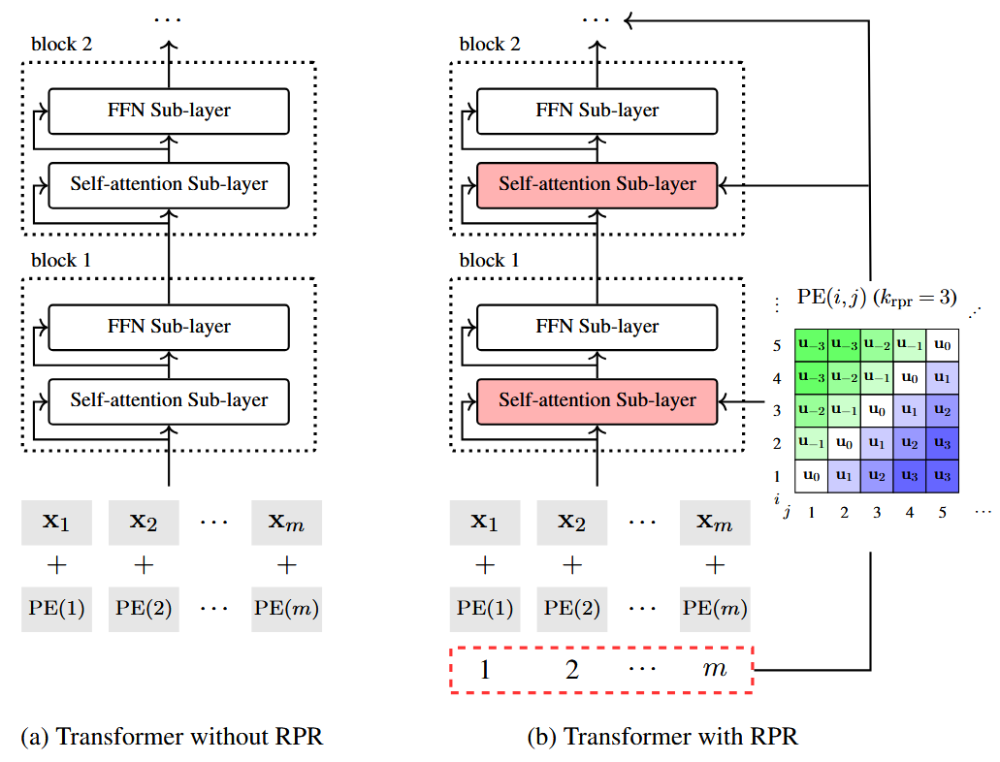
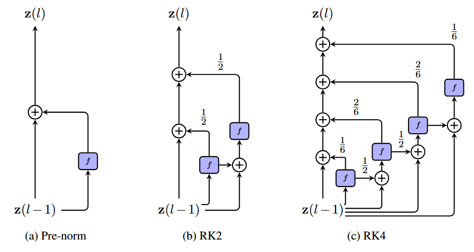
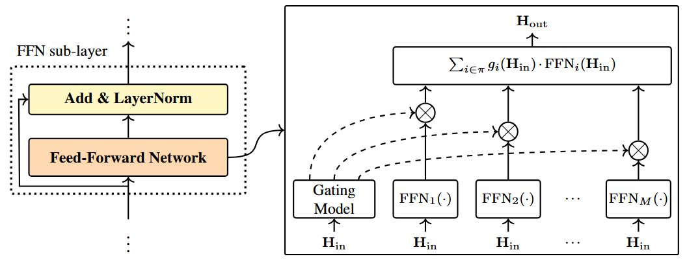

本节我们学习一些对原始 `Transformer` 模型的改进。与之前引入先验知识不同，本节聚焦于机器学习的角度。

## 1. Locally Attentive Models

之前讨论过的自注意力是对整个输入序列的学习表示，这种全局注意力机制虽具备强大的长距离依赖捕捉能力，但并未对局部信息进行显式建模。下面将介绍几种可在表征中显式提取局部特征的方法。

### 1.1 Priors for Local Modeling

向 `Transformer` 中引入局部上下文建模，最简单的方式之一是为注意力函数添加惩罚项，以此抑制远距离位置之间产生过大的注意力权重。在 `encoder` 端形式如下：

$$
\operatorname{AttLocal}_{\text{self}}(\mathbf{H}) = \operatorname{Softmax}\left( \frac{\mathbf{H}^q \left[ \mathbf{H}^k \right]^\top}{\sqrt{d}} - \gamma \cdot \mathbf{G} \right) \mathbf{H}^v \tag{1}
$$

其中 $\gamma$ 是惩罚项的权重，$\mathbf{G} \in \mathbb{R}^{m \times m}$ 是惩罚矩阵。每一项 $G(i,j)$ 代表模型从位置 $i$ 关注位置 $j$ 时所受到的惩罚强度。$G(i,j)$ 的一种简单实现方式是计算 $i$ 和 $j$ 之间的绝对距离：

$$
G(i,j) = |i-j| \tag{2}
$$

&emsp;或者，$G(i,j)$ 也可以通过高斯惩罚函数来定义：

$$
G(i,j) = \frac{(i-j)^2}{2\sigma_i^2}\tag{3}
$$

其中 $\sigma_i$ 是高斯分布的标准差。对一个给定的 $i$，两种形式的惩罚项都随距离 $|i-j|$ 的增大而增大。

这个方法也可以扩展到交叉注意力：

$$
\operatorname{AttLocal}_{\text{cross}}(\mathbf{H}, \mathbf{S}) = \operatorname{Softmax}\left( \frac{\mathbf{S}^q \left[ \mathbf{H}^k \right]^\top}{\sqrt{d}} - \gamma \cdot \mathbf{G} \right) \mathbf{H}^v \tag{4}
$$

其中 $\mathbf{G}$ 是一个 $n \times m$ 的矩阵，$\mathbf{G}$ 中的每个元素可以定义为：

$$
G(i,j) = \frac{(\mu_i-j)^2}{2\sigma_i^2}\tag{5}
$$

式中的 $\mu_i$ 是源端位置上高斯分布的均值。$\mu_i$ 和 $\sigma_i$ 都可以通过启发式方法确定；也可额外构建神经网络对其建模，与模型其余部分的参数进行联合学习。

我们也可将惩罚项看作是单独的分布，将其与注意力进行线性组合：

$$
\operatorname{AttLocal}_{\text{self}}(\mathbf{H}) = \left( (1 - \beta) \cdot \operatorname{Softmax}\left( \frac{\mathbf{H}^q \left[ \mathbf{H}^k \right]^\top}{\sqrt{d}} \right) + \beta \cdot \operatorname{Softmax}\left( -\gamma \cdot \mathbf{G} \right) \right) \mathbf{H}^v \tag{6}
$$

其中 $\beta \in [0,1]$ 是线性组合系数，为了防止手动调参，可以引入门控网络来动态预测 $\beta$，与主模型端到端联合训练。

除了加性惩罚项外，也可使用乘法掩码来引入先验：

$$
\operatorname{AttLocal}_{\text{self}}(\mathbf{H}) = \operatorname{Softmax}\left( \frac{\mathbf{H}^q \left[ \mathbf{H}^k \right]^\top}{\sqrt{d}} \odot \mathbf{G}' \right) \mathbf{H}^v\tag{7}
$$

其中 $\mathbf{G}' \in [0,1]^{m \times m}$ 是一个元素在 $[0,1]$ 取值的矩阵。标量 $G'(i,j)$ 在 $i=j$ 时取最大值 $1$，随 $i$ 和 $j$ 之间距离的增大而衰减。可以通过在所有的 $j$ 上对 $-G(i,j)$ 做归一化，或者通过其他的衰减函数来得到 $G'(i,j)$。

### 1.2 Relative Positional Embedding

相对位置编码，也叫做相对位置表征 `(RPR)`，是对标准 `Transformer` 中绝对位置编码的改进方案。其核心思路是：建模序列中两个位置之间的相对距离，而非为每个位置分配固定表征。由此，针对位置 $i$ 和 $j$，会得到二者的成对位置表征 $\ce{PE(i,j)}$。定义 $\ce{PE(i,j)}$ 的一个简单方式是将它看作所有 $ij$ 对的查找表。也就是说，设 $\mathbf{u}_{\pi}$ 为距离 $\pi$ 对应的 $d$ 维向量表征，原始 `RPR` 中 $\ce{PE(i,j)}$ 的定义如下：

$$
\ce{PE(i,j)} = \mathbf{u}_\ce{clip(j-i,k_{\ce{rpr}})} \tag{8}
$$

其中 $\ce{clip}(x,k_{\ce{rpr}})$ 是在区间 $[-k_{\ce{rpr}},k_{\ce{rpr}}]$ 上对 $x$ 进行截断的函数

$$
\ce{clip}(x,k_{\ce{rpr}}) = \ce{max}\{-k_{\ce{rpr}}, \ce{min}\{x,k_\ce{{rpr}} \} \}\tag{9}
$$

&emsp;这样我们就得到了一个带有参数的模型

$$
\mathbf{U}_{\text{rpr}} = \begin{bmatrix} \mathbf{u}_{-k_{\text{rpr}}} \\ \vdots \\ \mathbf{u}_{0} \\ \vdots \\ \mathbf{u}_{k_{\text{rpr}}} \end{bmatrix} \tag{10}
$$

我们可以将 $\mathbf{U}_{\text{rpr}}$ 看作一个大小为 $(2k_{\ce{rpr}}+1) \times d$ 的矩阵，计算给定的 $i$ 和 $j$ 之间的距离就等价于在其中选择值为 $\ce{clip}(j-i,k_{\ce{rpr}})$ 的一行。

利用上面的方法，我们可以定义三个 `RPR` 模型 $\ce{PE^q(i,j)},\ce{PE^k(i,j)},\ce{PE^v(i,j)}$，分别用于查询，键和值，利用公式 $\mathbf{c}_i=\sum_{j=1}^m \alpha_{i,j} \mathbf{h}_j$ 将注意力的输出定义为：

$$
\begin{align} 
c_i &= \sum_{j=1}^m \alpha_{i,j} \left[ \mathbf{h}_j^v + \mathrm{PE}^v(i,j) \right] \notag \\ 
&= \sum_{j=1}^m \alpha_{i,j} \mathbf{h}_j^v + \sum_{j=1}^m \alpha_{i,j} \mathrm{PE}^v(i,j) \tag{11}
\end{align} 
$$

其中 $\mathbf{h}_j^v$ 是 $\mathbf{H}^v$ 的第 $j$ 个行向量。这个表示由两部分组成，$\sum_{j=1}^m \alpha_{i,j} \mathbf{h}_j^v$ 是基本表示，$\sum_{j=1}^m \alpha_{i,j} \mathrm{PE}^v(i,j)$ 是位置表示。

注意力权重 $\alpha_{i,j}$ 的计算方式不变，但是每个查询和键要加上额外的 $\ce{PE^q(i,j)},\ce{PE^k(i,j)}$:

$$
\alpha_{i,j} = \mathrm{Softmax}\left( \frac{ \left[ \mathbf{h}_i^q + \mathrm{PE}^q(i,j) \right] \left[ \mathbf{h}_j^k + \mathrm{PE}^k(i,j) \right]^\top }{ \sqrt{d} } \right) \tag{12}
$$

&emsp;<b>图 1 </b>展示了使用 `RPR` 和不使用 `RPR` 的 `Transformer encoder` 结构。采用 `RPR` 时，$\ce{PE^q(i,j)},\ce{PE^k(i,j)},\ce{PE^v(i,j)}$ 会会直接输入到每个自注意力子层中，从而在序列建模中更充分地利用位置信息。使用截断函数能简化建模过程，因为我们无需区分 $|j-i| \ge k_{\ce{rpr}}$ 时的相对距离。这种基于截断距离的模型能在局部上下文窗口中实现更优的建模效果。

现在 `RPR` 基本被 `RoPE` 及其变体替代，后续再进行学习。

## 2. Deep Models
当前多数顶尖自然语言处理系统均基于深度 `Transformer` 模型构建。近期的大语言模型通常包含数十层 `Transformer` 结构。通过堆叠 `Transformer` 层即可轻松搭建深度模型，但训练极深的神经网络却存在诸多难点。

一方面，深度神经网络的误差面高度非凸，存在大量局部最优解，训练过程很容易陷入停滞。另一方面，反向传播过程中易出现梯度消失与梯度爆炸问题，这也大幅提升了多层 `Transformer` 模型的训练难度。下文将介绍几种适用于深度 `Transformer` 模型的训练策略。

### 2.1 Re-thinking the Pre-Norm and Post-Norm Architectures

`Transformer` 中的残差连接通常会搭配层归一化使用，由此衍生出两种主流结构：后归一化与前归一化。具体来说，后归一化结构的表达式如下：

$$
\mathbf{z}^l = \mathrm{LNorm}\left( F^l\left(\mathbf{z}^{l-1}\right) + \mathbf{z}^{l-1} \right) \tag{13}
$$

其中 $\mathbf{z}^l$ 和 $\mathbf{z}^{l-1}$ 分别是子层 $l$ 的输出和输入，$F^l(\cdot)$ 是这个子层的核心函数。前归一化结构将恒等映射 $\mathbf{z}^{l-1}$ 置于层归一化函数之外，其形式为：

$$
\mathbf{z}^l = F^l\left( \mathrm{LNorm}\left(\mathbf{z}^{l-1}\right) \right) + \mathbf{z}^{l-1} \tag{14}
$$

后归一化结构可以防止输入的恒等映射直接与子层的最终输出相加。这并不是一个实际意义上的残差网络，因为所有信息都通过了一个非线性函数 (层归一化单元)。因此，后归一化结构在反向传播中的效果较差。一个包含 $L$ 个子层的 `Transformer` 网络，其损失关于 $\mathbf{z}^l$ 的梯度为：

$$
\frac{\partial E}{\partial \mathbf{z}^l} = \frac{\partial E}{\partial \mathbf{z}^L} \cdot \prod_{k=l}^{L-1} \frac{\partial \mathrm{LNorm}(\mathbf{v}^k)}{\partial \mathbf{v}^k} \cdot \prod_{k=l}^{L-1} \left( 1 + \frac{\partial F^k(\mathbf{z}^k)}{\partial \mathbf{z}^k} \right) \tag{15}
$$

其中 $\mathbf{z}^l$ 是上一层的输出，$\mathbf{v}^k$ 是 $F^k(\mathbf{z}^{k-1})$ 的简写，$E$ 是损失函数计算得到的误差。$\frac{\partial \mathrm{LNorm}(\mathbf{v}^k)}{\partial \mathbf{v}^k}$ 和 $\frac{\partial F^k(\mathbf{z}^k)}{\partial \mathbf{z}^k}$ 分别为层归一化函数与核心变换函数的梯度。尽管该公式形式复杂，但可以看到 $\prod_{k=l}^{L-1} \frac{\partial \mathrm{LNorm}(\mathbf{v}^k)}{\partial \mathbf{v}^k}$ 是 $L-l$ 个因子的连乘。这意味着随着层数 $L$ 增大，误差梯度会被反复缩放，导致深层模型出现梯度消失或梯度爆炸的风险显著升高。

前归一化结构构成了一个标准的残差神经网络，其中网络的输入会直接与其输出相加。我们可以将误差在 $\mathbf{z}^l$ 处的梯度写作：

$$
\begin{align*} 
\frac{\partial E}{\partial \mathbf{z}^l} 
&= \frac{\partial E}{\partial \mathbf{z}^L} \cdot \left( 1 + \sum_{k=l}^{L-1} \frac{\partial F^k\left( \mathrm{LNorm}(\mathbf{z}^k) \right)}{\partial z^k} \right) \notag \\ 
&= \frac{\partial E}{\partial \mathbf{z}^L} + \frac{\partial E}{\partial \mathbf{z}^L} \cdot \sum_{k=l}^{L-1} \frac{\partial F^k\left( \mathrm{LNorm}(\mathbf{z}^k) \right)}{\partial \mathbf{z}^k} \tag{16}
\end{align*}
$$

很容易看出，$\frac{\partial E}{\partial \mathbf{z}^l}$ 能直接接收到误差的反馈信号，因为等式右侧的第一项是模型输出的梯度，它与网络深度无关。

采用前归一化结构，也有助于梯度下降早期的优化过程。例如，研究发现，前归一化 `Transformer` 模型在训练初期可以使用更大的学习率，而无需从较小值开始进行学习率预热。

尽管前归一化结构为深层 `Transformer` 模型的优化提供了便利，但我们不能简单地认为它比后归一化结构更优。后归一化结构强制表示通过更多非线性函数学习，形成表达能力强但复杂度高、训练难度较大的模型，例如 `BERT`，`RoBERTa` 等编码器模型；前归一化结构让 `Transformer` 模型的训练变得更容易，梯度路径稳定，适合 `LLaMA`、`GPT` 等生成式模型。

对这些结构的一种改进是，通过控制 “跳过” 子层的程度来优化模型。一种简单的实现方式是为不同路径赋予不同权重，而非对它们一视同仁。例如，可以为残差连接引入一个标量因子，以确定该残差连接相对于核心函数路径的权重占比：

$$
\mathbf{z}^l = \mathrm{LNorm}\left( F^l\left( \mathbf{z}^{l-1} \right) + \beta \cdot \mathbf{z}^{l-1} \right) + \gamma \cdot \mathbf{z}^{l-1} \tag{17}
$$

式中的 $\beta$ 是层归一化函数内部恒等映射的权重，$\gamma$ 是函数外部恒等映射的权重。当 $\beta = 1,\gamma = 0$ 时，该式退化为后归一化，当 $\beta = 0,\gamma = 1$ 时，退化为前归一化。

该模型为残差块的构建提供了一种多分支视角：块的输入可以通过多条建模复杂度不同的路径进行计算。当 $\beta$ 和 $\gamma$ 较小时，特征表示必须通过包含多层级联非线性单元的 “深层” 模型来学习；相反，当 $\beta$ 和 $\gamma$ 较大时，特征表示更倾向于通过层数更少的 “浅层” 方式学习。

要确定 $\beta$ 和 $\gamma$ 的最优值，既可以结合理论性质或验证集上的系统性能为它们赋予固定值，也可以通过额外的可训练函数来动态计算这些权重。

### 2.2 Parameter Initialization

与其他深度神经网络类似，学界十分关注针对深层 `Transformer` 模型的参数初始化方法，旨在让模型在参数空间中更优的区域开展优化。下文将聚焦 `Transformer` 体系中专用的参数初始化方案。

尽管神经网络的参数可以通过多种方式初始化，但大多数实用系统都会采用简单的技术来提供合适的初始值。例如，考虑针对参数矩阵 $\mathbf{W} \in \mathbb{R}^{d_{\ce{in}} \times d_{\ce{out}}}$ 进行 `Xavier` 初始化。我们定义一个变量 $\eta$：

$$
\eta = \ce{gain} \cdot \sqrt{\frac{6}{d_{\ce{in}} + d_{\ce{out}}}} \tag{18}
$$

其中 $\ce{gain}$ 是默认为 $1$ 的超参数。矩阵 $\mathbf{W}$ 的每个元素都可以通过均匀分布来初始化

$$
W \sim U(-\eta,\eta) \tag{19}
$$

或者使用高斯分布

$$
W \sim \mathcal{N}(0,\eta^2) \tag{20}
$$

这种方法可以轻松适配具有大量层数的 `Transformer` 模型的初始化。一种常用的做法是：考虑到不同深度的神经网络其最优初始化条件可能不同，从而找到更合适的 $\ce{gain}$ 取值。例如，可以随着模型深度的增加而增大 $\ce{gain}$ 的值。因此，$\ce{gain}$ 可以被定义为网络深度的函数，形式如下：

$$
\ce{gain} = a \cdot L^b \tag{21}
$$

其中 $a$ 是标量，$L^b$ 是网络深度 $L$ 的 $b$ 次幂。$a$ 和 $b$ 一般取正数，意味着模型层数越深，参数初始值倾向于设置得更大。

上式对所有子层使用相同的增益系数，但研究发现，子层距离输出层越远，其梯度范数就越小。若整个模型统一使用同一增益系数，底层网络易因梯度消失问题出现训练不充分的情况。为此，研究者提出了依据子层位置动态调整增益的方法，这类方法的通用形式如下：

$$
\ce{gain} = \frac{a}{l^b} \tag{22}
$$

这里的 $l$ 表示子层的深度，$l$ 越大，离输出越近，$\ce{gain}$ 就会越小，相应的参数都会设置成较小的值。

将深度多层神经网络的通用初始化方法应用到 `Transformer` 模型中也十分简便。例如，在参数初始化时引入利普希茨常数，该方法已被证实能够提升深度模型的训练稳定性。另一种思路是采用二阶优化方法估算合适的参数取值，比如通过计算每个参数矩阵的海森矩阵来刻画其曲率特征。

对于层数较多的模型，还可以先借助小规模模型预训练部分网络层，再将训练得到的参数用于初始化更大规模的模型。这类方法统称为<b>模型增长</b>或<b>深度递增</b>训练法。以 `BERT` 类模型为例：先在海量数据上训练 `Transformer encoder`，再将训练好的参数用于初始化下游任务模型。

### 2.3 Layer Fusion

训练深层 `Transformer` 模型还存在另一个问题：最终预测结果仅依赖网络最后一层的输出。残差连接虽能让高层直接访问低层，但信息从网络底部传递至顶部，路径依然偏长。一种简易的解决思路是构建跨更多层的残差连接。以一组包含 $L$ 个 `Transformer` 子层的模型为例，对于深度 $l$ 的子层，我们可以引入 $l-1$ 个残差连接，分别与前面每一个子层相连。由此便构成密集连接网络，每个子层都会接收此前所有子层的输出作为输入。最终一个子层的输出，可看作是不同层级特征表示的融合结果。

沿用之前的符号，记深度为 $l$ 的子层输出为 $\mathbf{z}^l$，子层的函数记作 $\ce{Layer}^l(\cdot)$。那么 $\mathbf{z}^l$ 可以表达为

$$
\mathbf{z}^l = \ce{Layer}^l(\mathbf{z}^l,\ldots,\mathbf{z}^{l-1}) \tag{23}
$$

我们可以简单将 $\ce{Layer}^l(\cdot)$ 看作是将来自 $\{\mathbf{z}^l,\ldots,\mathbf{z}^{l-1}\}$ 的信息融合起来的函数，一个简单的实现方式是

$$
\begin{align*} \mathrm{Layer}^l(\mathbf{z}^1, \dots, \mathbf{z}^{l-1}) &= \mathrm{LNorm}\big(F^l(\mathbf{Z}^l)\big) \tag{24} \\ 
\mathbf{Z}^l &= \phi(\mathbf{z}^1, \dots, \mathbf{z}^{l-1}) \tag{25}\end{align*}
$$

这里的 $\phi(\cdot)$ 接受层输出 $\{\mathbf{z}^l,\ldots,\mathbf{z}^{l-1}\}$ 将它们融合成一个单独的表示 $\mathbf{Z}^l$。例如可以将 $\phi(\cdot)$ 设置成平均池化，计算 $\{\mathbf{z}^l,\ldots,\mathbf{z}^{l-1}\}$ 的和后除以 $l-1$。

将类似结构应用在 `Transformer` 上时，也可以考虑前归一化形式 

$$
\begin{align*} \mathrm{Layer}^l(\mathbf{z}^1, \dots, \mathbf{z}^{l-1}) &= \mathrm{LNorm}\big(\mathbf{Z}^l\big) \tag{26} \\ 
\mathbf{Z}^l &= \phi(F^l(\mathbf{z}^{l-1}),\mathbf{z}^1, \dots, \mathbf{z}^{l-1}) \tag{27}\end{align*}
$$

或者后归一化

$$
\begin{align*} \mathrm{Layer}^l(\mathbf{z}^1, \dots, \mathbf{z}^{l-1}) &= \mathbf{Z}^l \tag{28} \\ 
\mathbf{Z}^l &= \phi\Big(\mathrm{LNorm}\big(F^l(\mathbf{z}^{l-1})\big), \mathbf{z}^1, \dots, \mathbf{z}^{l-1}\Big) \tag{29}
\end{align*}
$$

这些模型的通用性很强，假如去掉对子层 $1$ 到 $l-2$ 的依赖，再将 $\phi(\cdot)$ 定义成下式，就可以得到一个标准的后归一化 `encoder` 子层：

$$
\phi\big(F^l(\mathbf{z}^{l-1}), \mathbf{z}^1, \dots, \mathbf{z}^{l-1}\big) = F^l(\mathbf{z}^{l-1}) + \mathbf{z}^{l-1} \tag{30}
$$

密集连接网络通过子层间的直接连接，让信息流动更顺畅，但由此得到的模型复杂度也略高，尤其是当我们使用参数化的融合函数时。在实际应用中，我们通常只对部分子层添加密集连接，避免整个网络过于冗余。

### 2.4 Regularization

机器学习中，正则化用于缓解深度神经网络训练过程中的过拟合问题。因此，将各类正则化方法应用于 `Transformer` 模型也十分自然。

对深层 `Transformer` 模型进行正则化的一种方法，是在训练过程中随机跳过部分子层或完整网络层。模型每一轮前向传播时，每个子层会以概率 $\rho$ 被保留，再将选中的子层重新组合成新模型。该方式等价于在同一数据集上，训练一批结构与参数共享的网络集成模型。这会让各个子层具备一定独立工作的能力，同时避免子层间相互依赖，进而缓解过拟合。这类方法也常被称作子层丢弃或层丢弃。

在测试阶段，我们需要整合所有可能的网络结构以完成预测。一种简单的实现方法是对模型中随机组件的输出进行缩放处理。例如，假设每个子层采用前归一化结构，那么深度为 $l$ 的子层的输出可表示为：

$$
\mathbf{z}^l = \rho \cdot \mathrm{LNorm}\big(F^l(\mathbf{z}^{l-1})\big) + \mathbf{z}^{l-1} \tag{31}
$$

另一种思路是实现子层参数共享。最简单的方式之一，就是让所有对应子层使用完全相同的参数。该方法具备正则化效果，原理与在损失函数中加入参数矩阵范数、从而约束模型复杂度的思路相近。

## 3. Numerical Method-Inspired Models

残差网络的输出等于恒等映射与输入变换之和。这类模型可以被解释为常微分方程 `(ODE)` 的欧拉离散化形式。为了说明这一思想，我们考虑一种通用形式的残差网络

$$
\mathbf{z}^{l} = f^l(\mathbf{z}^{l-1}) + \mathbf{z}^{l-1} \tag{32}
$$
其中 $f^l(\mathbf{z}^{l-1})$ 是一个接受输入变量 $\mathbf{z}^{l-1}$，输出同维度的特征。显然 `Transformer` 子层是该公式的一种特例。例如对于前归一化架构的 `Transformer`，有 $f^l(\cdot) = \ce{LNorm}(F^l(\cdot))$ 。

为简化符号表达，我们将上述公式改写为等价形式

$$
\mathbf{z}(l) = f(\mathbf{z}(l-1),l) + \mathbf{z}(l-1) \tag{33}
$$

使用记号 $\mathbf{z}(l)$ 和 $f(\mathbf{z}(\cdot,l))$ 来强调 $\mathbf{z}(\cdot)$ 和 $f(\cdot)$ 是 $l$ 的函数。此处假设 $l$ 是离散的。如果我们将 $l$ 和 $\mathbf{z}(l)$ 分别松弛成连续变量和连续函数，那么上式可以改写成

$$
\mathbf{z}(l) = \Delta l \cdot f\big(\mathbf{z}(l-\Delta l), l\big) + \mathbf{z}(l-\Delta l) \tag{34}
$$

进一步写成 

$$
\frac{\mathbf{z}(l) - \mathbf{z}(l-\Delta l)}{\Delta l} = f\big(\mathbf{z}(l-\Delta l), l\big) \tag{35}
$$

取极限 $\Delta l \to 0$，我们有 `ODE`

$$
\frac{d\mathbf{z}(l)}{dl} = f\big(\mathbf{z}(l), l\big) \tag{36}
$$

因此我们可以说，前归一化 `Transformer` 子层是上述 `ODE` 的欧拉离散化形式。子层本质上就是一个 `ODE` 的求解器。

<b>式 32 </b>和<b>式 33 </b>是欧拉法的标准形式。该方法从先前的估计值出发，沿 $l$ 方向前进一步，计算解的新估计值。一般而言，在为 `ODE` 设计数值方法时，可从两个方面展开考量。

- **线性多步法**：线性多步法利用多个前序步的估计值与导数信息，计算当前解的估计值。$p$ 步法的通用形式可表示为：

	$$
	\mathbf{z}(l) = \sum_{i=1}^{p} a_i \cdot \mathbf{z}(l-i) + h \sum_{i=1}^{p+1} b_i \cdot f\big(\mathbf{z}(l-i), l-i+1\big) \tag{37}
	$$

	式中的 $h$ 是每次前进的步数，也就是<b>式 34 </b>和<b>式 35 </b>中的 $\Delta l$。$\{a_i\}$ 和 $\{b_i\}$ 是线性组合中解点与导数项的系数。根据这一定义，我们可以将欧拉法视为求解 `ODE` 的单步低阶方法。

- (高阶) 龙格-库塔 `(RK)` 方法：龙格-库塔方法及其变体通过在求解 `ODE` 时引入中间结果来计算下一步的解。因此，我们得到了高阶方法，但仍保持单步法的形式——即当前解仅依赖于 $\mathbf{z}(l-1)$ 而非多个前序步的输出。

事实上，之前介绍的层融合方法中已经隐性用到了线性多步法。一个带有全稠密连接（连接之前所有子层）的前归一化子层可表示为

$$
\mathrm{Layer}^l(\mathbf{z}^1, \dots, \mathbf{z}^{l-1}) = a_1 \cdot \mathbf{z}^{l-1} + \dots + a_{l-1} \cdot \mathbf{z}^1 + b_1 \cdot \mathrm{LNorm}\big(F^l(\mathbf{z}^{l-1})\big) \tag{38}
$$

我们也可直接将龙格-库塔方法应用于 `Transformer` 模型，对于<b>式 36 </b>中的 `ODE`，$p$ 阶显式龙格-库塔解法形式如下：

$$
\begin{align*} 
\mathbf{z}(l) &= \mathbf{z}(l-1) + \sum_{i=1}^{p} \gamma_i \cdot \mathbf{g}_i \tag{39} \\
\mathbf{g}_i &= h \cdot f\Big(\mathbf{z}(l-1) + \sum_{j=1}^{i-1} \beta_{i,j} \cdot \mathbf{g}_j,\ l-1 + \lambda_i \cdot h\Big) \tag{40}
\end{align*}
$$

式中的 $\mathbf{g}_i$ 是计算过程中的中间步骤。$\{\gamma_i\}$, $\{\beta_{i,j}\}$ 和 $\{\lambda_i\}$ 是通过对 $\mathbf{z}(l)$ 进行泰勒展开确定的系数。为简化模型，我们假设所有 $\{\mathbf{g}_i\}$ 均使用相同的函数 $f$。随后，我们去除 $f$ 中对项 $l-1+\lambda_i \cdot h$ 的依赖，将<b>式 40 </b>改写为：

$$
\mathbf{g}_i = h \cdot f\left( \mathbf{z}(l-1) + \sum_{j=1}^{i-1} \beta_{i,j} \cdot \mathbf{g}_j \right) \tag{41}
$$

其中 $f(\cdot)$ 是与 $i$ 无关的函数。

例如，考虑 `RK4` 的解法：

$$
\begin{align*} 
\mathbf{z}(l) &= \mathbf{z}(l-1) + \frac{1}{6}\left(\mathbf{g}_1 + 2\mathbf{g}_2 + 2\mathbf{g}_3 + \mathbf{g}_4\right) \tag{42} \\ 
\mathbf{g}_1 &= h \cdot f\left(\mathbf{z}(l-1)\right) \tag{43} \\ 
\mathbf{g}_2 &= h \cdot f\left(\mathbf{z}(l-1) + \frac{1}{2}\mathbf{g}_1\right) \tag{44} \\ 
\mathbf{g}_3 &= h \cdot f\left(\mathbf{z}(l-1) + \frac{1}{2}\mathbf{g}_2\right) \tag{45} \\ 
\mathbf{g}_4 &= h \cdot f\left(\mathbf{z}(l-1) + \mathbf{g}_3\right) \tag{46}
\end{align*}
$$

这些方程定义了一个子层的新结构。例如令 $h=1$，$f(\cdot)=\ce{LNorm}(F^l(\cdot))$，就得到了一个 `RK4 Transformer` 子层，如<b>图 2 </b>所示。这种方法会形成一个更深的模型，因为每个子层内部要依次计算四次 $f(\cdot)$。但另一方面，得到的模型非常参数高效，因为我们在子层内部复用了同一个函数 $f(\cdot)$，没有引入额外参数。

到目前为止，本小节的讨论一直聚焦于以动力系统为灵感设计 `Transformer` 架构。另一种思路是使用神经 `ODE`，将 “深度” 松弛为连续变量。通过这种方式，我们可以得到一个连续深度模型，用于求解 `ODE` 方程。

## 4 Wide Models

神经网络设计中另一项常见抉择，是确定网络宽度。`Transformer` 的宽度通常定义为输入序列单个位置表征的维度，即参数 $d$。增大网络宽度是提升模型复杂度与表达能力的常用手段。然而，构建极宽的 `Transformer` 模型存在不少难点。一大挑战是这类模型的训练计算开销极大。模型参数量随维度 $d$ 呈线性增长，但时间复杂度却随 $d$ 呈平方增长。

一种简易思路是沿维度 $d$ 逐步扩容模型，而非从零开始训练。假设现有初始模型包含一个 $d_1 \times d_1$ 个参数的矩阵 $\mathbf{W}_1$ (例如某一层中查询 / 键的线性变换矩阵)，先按常规方式训练该模型，得到优化后的 $\mathbf{W}_1$。

接下来将模型扩容为更宽的版本，把 $\mathbf{W}_1$ 替换为 $d_2 \times d_2$ 的参数矩阵 $\mathbf{W}_2$，我们令 $d_2 = kd_1$。把 $d_1 \times d_1$ 矩阵扩充为 $d_2 \times d_2$ 有多种方式，其中最直接的做法是用原矩阵 $\mathbf{W}_1$ 填充 $\mathbf{W}_2$：

$$
\mathbf{W}_2 = \begin{bmatrix} \frac{\mathbf{W}_1}{\rho} & \dots & \frac{\mathbf{W}_1}{\rho} \\ \vdots & & \vdots \\ 
\frac{\mathbf{W}_1}{\rho} & \dots & \frac{\mathbf{W}_1}{\rho} \end{bmatrix} \quad \tag{47}
$$

其中 $\rho$ 是控制 $\mathbf{W}_2$ 范数的超参数，如果令 $\rho=k$，那么 $\mathbf{W}_2$ 的范数和 $\mathbf{W}_1$ 相同。上述公式为宽模型的训练提供了良好的初始化起点，我们可以在初始化后按常规方式训练 $\mathbf{W}_2$。该过程可重复多次，以构建任意宽度的模型。

构建宽 `Transformer` 模型的第二个难点是内存需求过大。由于 `FFN` 的隐藏层通常比模型其他部分更宽，当模型宽度增加时，它对内存的占用也会相对更高。以下面的 `FFN` 为例：

$$
\begin{align*} 
\mathbf{H}_{\text{out}} &= \text{FFN}(\mathbf{H}_{\text{in}}) \\ &= \text{ReLU}\left( \mathbf{H}_{\text{in}} \cdot \mathbf{W}_h + \mathbf{b}_h \right) \cdot \mathbf{W}_f + \mathbf{b}_f \tag{48}
\end{align*} 
$$

其中 $\mathbf{W}_h \in \mathbb{R}^{d \times d_{\ce{ffn}}}$， $\mathbf{W}_f \in \mathbb{R}^{d_{\ce{ffn}} \times d}$ 是线性变换的参数。$d_{\ce{ffn}}$ 通常是 $d$ 的数倍。因此当 $d$ 和 $d_{\ce{ffn}}$ 取值很大时，$\mathbf{W}_h$ 和 $\mathbf{W}_f$ 将主导模型的大小。

在某些情况下，前馈网络的规模可能会超出单个设备的内存容量。这一问题可以通过<b>混合专家模型 (<i>MoE, Mixture-of-Experts</i>)</b> 来解决。一个 `MoE` 模型由 $M$ 个专家模型 $\{e_1(\cdot),\cdots,e_M(\cdot)\}$ 组成。给定一个输入 $\mathbf{h}_{\ce{in}} \in \mathbb{R}^d$，每个专家模型都会产生输出 $e_k(\mathbf{h}_{\ce{in}})$。`MoE` 模型的输出是 $\{e_1(\mathbf{h}_{\ce{in}}),\cdots,e_M(\mathbf{h}_{\ce{in}})\}$ 的线性组合：

$$
\mathbf{h}_{\text{out}} = \sum_{i=1}^{M} g_i(\mathbf{h}_{\text{in}}) \cdot e_i(\mathbf{h}_{\text{in}}) \tag{49}
$$

其中 $g(\cdot)$ 是门控模型，其输出是一个向量 $g(\mathbf{h}_{\text{in}}) = \left[ g_1(\mathbf{h}_{\text{in}}),\ \dots,\ g_M(\mathbf{h}_{\text{in}}) \right]$，元素 $g_i(\mathbf{h}_{\text{in}})$ 是对应专家模型的权重。在多数应用中，通常假设 $g(\mathbf{h}_{\text{in}})$ 是是一个稀疏向量，这意味着只有少数几个专家模型会参与输出的计算。一个广泛应用的 $g(\mathbf{h}_{\text{in}})$ 的形式是通过 `Softmax` 层：

$$
g(\mathbf{h}_{\text{in}}) = \text{Softmax}\left( \mathbf{h}_{\text{in}} \cdot \mathbf{W}_g \right) \tag{50}
$$

其中 $\mathbf{W}_g \in \mathbb{R}^{d \times M}$ 是该层的矩阵参数。为了增加 $g(\mathbf{h}_{\text{in}})$ 的稀疏性，我们可以选择 $g(\mathbf{h}_{\text{in}})$ 的 `top-k` 个元素，也就是将其他元素设置为 $0$。另一种方法是，先对 $\mathbf{h}_{\text{in}} \cdot \mathbf{W}_g$ 的的结果执行选择，再用 `Softmax` 函数对选出的 $k$ 个分量进行归一化。

这种方法的一个优势是，我们可以将不同的专家模型分配到不同的处理器上，从而能够在并行计算设备上执行这些模型。在 `MoE` 模型的每次运行中（无论是训练还是推理阶段），我们只需要激活并使用 $k$ 个专家模型，而非全部专家模型。

现在回到<b>式 48</b>，直接对其应用 `MoE` 方法。为简化讨论，我们以第一层的线性变换 $\mathbf{H}_{\text{in}} \cdot \mathbf{W}_h$ 为例，我们可以用 `MoE` 的形式来近似 $\mathbf{H}_{\text{in}} \cdot \mathbf{W}_h$：

$$ 
\begin{align*} 
\mathbf{H}_{\text{in}} \cdot \mathbf{W}_h &\approx \sum_{i \in \pi} g_i(\mathbf{H}_{\text{in}}) \cdot e_i(\mathbf{H}_{\text{in}}) \\ 
&= \sum_{i \in \pi} g_i(\mathbf{H}_{\text{in}}) \cdot \left[ \mathbf{H}_{\text{in}} \cdot \mathbf{W}_h^i \right] \tag{51} 
\end{align*} 
$$

这里的 $\mathbf{W}_h$ 被划分为 $M$ 个切片（或子矩阵）$\{\mathbf{W}_h^1, \dots, \mathbf{W}_h^M\}$，记作

$$
\mathbf{W}_h = \begin{bmatrix} \mathbf{W}_h^1 & \dots & \mathbf{W}_h^M \end{bmatrix} \tag{52}
$$

因此，每个专家模型 $e_i(\mathbf{H}_{\text{in}}) = \mathbf{H}_{\text{in}} \cdot \mathbf{W}_h^i$ 解决了原始线性映射的一个子问题，<b>式 51 </b>可以被视为矩阵乘法问题的一种分治解决方案。

当然，我们可以将任意前馈神经网络视为一个专家模型，由此得到如下模型：

$$
\mathbf{H}_{\text{out}} = \sum_{i \in \pi} g_i(\mathbf{H}_{\text{in}}) \cdot \text{FFN}_i(\mathbf{H}_{\text{in}}) \tag{53}
$$

其中 $\text{FFN}_i(\cdot)$ 是一个与<b>式 48 </b>形式相同的“小型”前馈神经网络。该模型的示例如<b>图 3 </b>所示。在实际实现中，所有这些专家模型都可以在不同设备上并行运行，因此得到的系统具有较高的效率。

构建超大规模 `Transformer` 模型的另一大难题是训练不稳定问题。造成这一训练难题的原因之一是：矩阵乘法等常规线性代数运算，在处理维度极高的向量与矩阵时，容易出现数值不稳定的问题。因此，采用数值稳健的算法与混合精度技术来提升训练稳定性，就显得尤为关键。