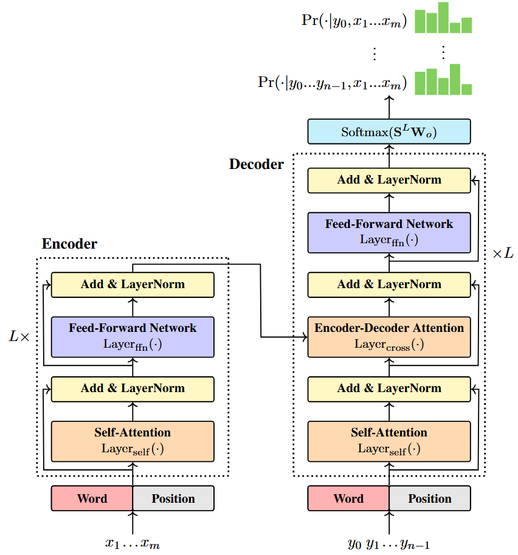
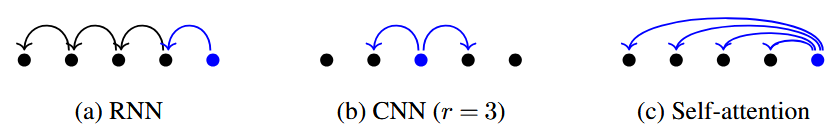
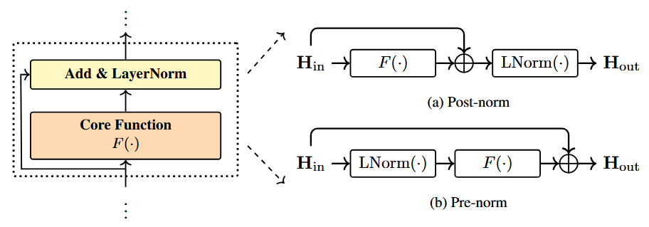
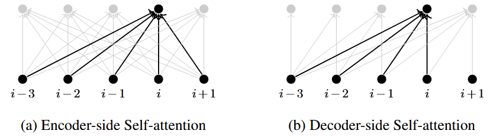
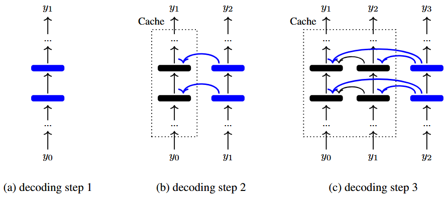

`Transformer` 和一般 `seq2sqe` 模型的区别:
- `Transformer` 不依赖于循环或卷积神经网络，只使用注意力机制和前馈神经网络
- 自注意力机制使 `Transformer` 可以更容易地处理全局上下文以及词之间的依赖关系
- `Transformer` 的架构很灵活，针对不同的任务可以进行修改

## The Basic Model
### The Transformer Architecture

<b>图 1 </b>是有着标准 `encoder-decoder` 框架的 `Transformer` 模型。一个 `Transformer encoder` 包含数个堆叠的<b>编码层 </b>(或编码块)，每个编码层有两个不同的子层，分别是子注意力子层和前馈神经网络子层 ($\ce{FNN}$)

假设源端序列为 $\mathbf{x}=x_1\ldots x_m$，目标序列为 $\textbf{y}=y_1\ldots y_m$。编码层的输入是 $m$ 个向量的序列 $\mathbf{h}_1\ldots \mathbf{h}_m$，每一个向量均为 $d$ 维，我们将这些向量记作 $\textbf{H}\in \mathbb{R}^{m\times d}$。自注意力子层首先对 $\textbf{H}$ 做自注意力运算 $\ce{Att_{self}(\cdot)}$ 得到输出 $\textbf{C}$：

$$
\mathbf{C} = \ce{Att_{self}}(\mathbf{H})\tag{1}
$$

其中 $\textbf{C}$ 与 $\textbf{H}$ 的大小一样，可以看作是输入的全新表征。随后对输出添加残差连接与层归一化模块，以此降低模型优化难度

原始 `Transformer` 模型采用<b>后归一化</b>结构，先构建残差连接，再执行层归一化操作，具体形式如下：

$$
\mathbf{H}_{\ce{self}} = \ce{LNorm}(\mathbf{C} + \mathbf{H})\tag{2}
$$

其中 $\mathbf{H}$ 表示残差连接，$\ce{LNorm}(\cdot)$ 表示层归一化函数。将<b>公式 1 </b>带入<b>公式 2 </b>我们有自注意力子层：

$$
\begin{align} \text{Layer}_{\ce{self}}(\mathbf{H}) &= \mathbf{H}_{\text{self}} \nonumber \\ &= \text{LNorm}\left( \text{Att}_{\text{self}}(\mathbf{H}) + \mathbf{H} \right) \tag{3} \end{align}
$$

&emsp;自注意力子层的输出 $\mathbf{H}_{\ce{self}}$ 进入 `FFN` 子层，输出一个新的表示 $\mathbf{H}_{\ce{ffn}}\in \mathbb{R}^{m \times d}$。它与自注意力子层的结构类似，只是将自注意力函数替换成 `FFN` 函数，即

$$
\begin{align} \text{Layer}_{\ce{ffn}}(\mathbf{H}) &= \mathbf{H}_{\text{ffn}} \nonumber \\ &= \text{LNorm}\left( \text{FFN}(\mathbf{H}_{\ce{self}}) + \mathbf{H}_\ce{self} \right) \tag{4} \end{align}
$$

这里的 $\text{FFN}(\cdot)$ 可以是任何含有非线性激活函数的前馈网络。最常用的 $\text{FFN}(\cdot)$ 的结构是一个包含两层线性变换及中间 `ReLU` 激活函数的双层网络

对于深度模型，我们可以堆叠上述神经网路结构。假设第 $l$ 层的输出是 $\mathbf{H}^l$，它可以表示为 $\mathbf{H}^{l-1}$ 的函数，将其写作两个子层的表示：

$$
\begin{align} \mathbf{H}^l &= \text{Layer}_{\text{ffn}}(\mathbf{H}^l_{\text{self}}) \tag{5} \\ \mathbf{H}^l_{\text{self}} &= \text{Layer}_{\text{self}}(\mathbf{H}^{l-1}) \tag{6} \end{align}
$$

如果有 $L$ 个编码层，那么 $\mathbf{H}^L$ 就是 `encoder` 最终的输出。此时 $\mathbf{H}^L$ 可以看作是输入序列经学习得到的上下文表征，$\mathbf{H}^0$ 是 `encoder` 最初的输入。在循环和卷积模型中， $\mathbf{H}^0$ 由输入序列的词嵌入组成，而 `Transformer` 采用了不同的输入表示方式，对位置信息进行显式编码。

`decoder` 的结构与 `encoder` 类似，由 $L$ 个堆叠的<b>解码层</b>组成。用 $\mathbf{S}^l$ 表示第 $l$ 层解码层的输出，我们可以通过下面的式子定义一个解码层：

$$
\begin{align} \mathbf{S}^l &= \text{Layer}_{\text{ffn}}(\mathbf{S}^l_{\text{cross}}) \tag{7} \\ \mathbf{S}^l_{\text{cross}} &= \text{Layer}_{\text{cross}}(\mathbf{H}^L, \mathbf{S}^{l-1}_{\text{self}}) \tag{8} \\ \mathbf{S}^l_{\text{self}} &= \text{Layer}_{\text{self}}(\mathbf{S}^{l-1}) \tag{9} \end{align}
$$

`decoder` 有 $3$ 个子层。自注意力和 `FFN` 子层与 `encoder` 相同。$\ce{Layer_{cross}}(\cdot)$ 表示交叉注意力子层（也叫编码器-解码器子层），用于建模源端到目标端的转换过程

`decoder` 在每个目标端位置输出词汇表 $V_y$ 上的概率分布。该过程通过 `softmax` 层实现：对 $\mathbf{S}^L$ 执行线性变换后，经 `softmax` 归一化得到目标词的概率分布。具体而言，将 $\mathbf{S}^L$ 映射为一个 $n \times |V_y|$ 的矩阵 $\mathbf{O}$：

$$
\mathbf{O} = \mathbf{S}^L \cdot \mathbf{W}_\ce{o} \tag{10}
$$

其中 $\mathbf{W}_\ce{o}\in \mathbb{R}^{d\times |V_y|}$ 是线性变换的参数矩阵

接着由下式给出 `decoder` 的输出：

$$
\begin{align} \begin{bmatrix} \Pr(\cdot \mid y_0, \mathbf{x}) \\ \vdots \\ \Pr(\cdot \mid y_0 \cdots y_{n-1}, \mathbf{x}) \end{bmatrix} &= \text{Softmax}(\mathbf{O}) \nonumber \\ &= \begin{bmatrix} \text{Softmax}(\mathbf{o}_1) \\ \vdots \\ \text{Softmax}(\mathbf{o}_n) \end{bmatrix} \tag{11} \end{align}
$$

$\mathbf{o}_i$ 表示 $\mathbf{O}$ 的第 $i$ 个行向量，$y_0$ 表示起始符 `<SOS>`。在这个模型中，给定 $\mathbf{x}$ 时 $y$ 的概率可按常规方式定义为：

$$
\log \Pr(\mathbf{y} \mid \mathbf{x}) = \sum_{i=1}^{n} \log \Pr(y_i \mid y_0 \cdots y_{i-1}, \mathbf{x})\tag{12}
$$

该方程与语言建模的通用形式类似：给定位置 $i - 1$ 及之前的所有词，预测位置 $i$ 的词。因此，目标输出序列相对输入序列在时间上向前偏移了一步：即解码器以 $y_0\ldots y_{n-1}$ 为输入，预测输出序列 $y_1\ldots y_n$

`Transformer` 架构存在多种变体，例如仅用编码器表征文本，称作<b>纯编码器架构</b>；仅用解码器生成文本，称作<b>纯解码器架构</b>；以及标准编解码架构，实现输入序列到输出序列的转换

### Positional Encoding

原始 `Transformer` 的 `FFN` 和注意力都忽略了序列模型的一个重要特点：词序对表达序列含义至关重要。这就意味着 `encoder` 和 `decoder` 对输入词的位置信息不敏感。一个简单的解决方法是在序列每个词的表示中加入位置编码，即一个词 $x_j$ 可以表示为一个 $d$ 维向量

$$
\mathbf{e}_j = \mathbf{x}_j + \ce{PE}(j)\tag{13}
$$

其中 $\mathbf{x}_j \in \mathbb{R}^d$ 是词嵌入，可以通过标准嵌入模型得到。$\ce{PE}(j) \in \mathbb{R}^d$ 是位置 $j$ 的表示。原始 `Transformer` 使用的是正弦位置编码模型：

$$
\begin{align} \text{PE}(i, 2k) &= \sin\left(i \cdot \frac{1}{10000^{2k/d}}\right) \tag{14} \\ \text{PE}(i, 2k+1) &= \cos\left(i \cdot \frac{1}{10000^{2k/d}}\right) \tag{15} \end{align}
$$

式中的 $\ce{PE}(i,k)$ 表示位置编码向量 $\ce{PE}(i)$ 的第 $k$ 个元素。位置编码的核心思想是通过连续函数区分不同位置，这里使用了不同频率的正弦与余弦函数。由于该编码基于单个位置直接计算，因此也被称为<b>绝对位置编码</b>。

当我们得到了这些嵌入，序列 $\mathbf{e}_1 \ldots \mathbf{e}_m$ 就可作为 `encoder` 的输入，即：

$$
\mathbf{H}_0 = \begin{bmatrix} \mathbf{e}_1 \\ \vdots \\ \mathbf{e}_m \end{bmatrix} \tag{16}
$$

同样也可定义 `decoder` 的输入

### Multi-head Self-attention

自注意力机制的使用，或许是 `seq2seq` 模型领域最重要的进展之一。它试图学习并利用所有输入对之间的直接交互关系。从表示学习的角度来看，自注意力模型假设位置 $i$ 处的学习表示 $\mathbf{c}_i$ 是序列中所有输入的加权和。因此，输出 $\mathbf{c}_i$ 可表示为：

$$
\mathbf{c}_i = \sum_{j=1}^{m} \alpha_{i,j} \mathbf{h}_j \tag{17}
$$

其中 $\alpha_{i,j}$ 是计算 $i$ 处的表示时加在 $\mathbf{h}_j$ 上的注意力权重。因此，我们可以将 $\mathbf{c}_i$ 看作 $i$ 处的全局上下文表示。$\alpha_{i,j}$ 随模型的不同有多种定义方式，这里使用缩放点积注意力函数来计算：

$$
\begin{align} \alpha_{i,j} &= \text{Softmax}\left( \mathbf{h}_i \mathbf{h}_j^\top / \beta \right) \nonumber \\ &= \frac{\exp\left( \mathbf{h}_i \mathbf{h}_j^\top / \beta \right)}{\sum_{k=1}^{m} \exp\left( \mathbf{h}_i \mathbf{h}_k^\top / \beta \right)} \tag{18} \end{align}
$$

缩放因子 $\beta$ 通常设置为 $\sqrt d$

与传统循环和卷积模型相比，自注意力模型的一个优势是缩短了两个输入之间的计算 “距离”。<b>图 2 </b>展示了这些模型中的信息流。可以看到，给定位置 $i$ 的输入，自注意力模型可以直接访问任何其他输入。相比之下，循环和卷积模型可能需要两步或更多步骤才能看到整个序列。

 

借助 `QKV` 注意力模型，我们可以从更通用的视角理解自注意力。假设存在一组由 $\kappa$ 个查询向量组成的序列 $\mathbf{Q} = \begin{bmatrix} \mathbf{q}_1 \\ \vdots \\ \mathbf{q}_\kappa \end{bmatrix}$，以及由 $\psi$ 个键值对组成的序列 ($\mathbf{K} = \begin{bmatrix} \mathbf{k}_1 \\ \vdots \\ \mathbf{k}_\psi \end{bmatrix}$,$\mathbf{V} = \begin{bmatrix} \mathbf{v}_1 \\ \vdots \\ \mathbf{v}_\psi \end{bmatrix}$)。模型的输出是一个向量序列，分别对应一个查询。`QKV` 注意力由下式给出：

$$
\operatorname{Att}_{\text{qkv}}(\mathbf{Q}, \mathbf{K}, \mathbf{V}) = \operatorname{Softmax}\left( \frac{\mathbf{Q}\mathbf{K}^\top}{\sqrt{d}} \right)\mathbf{V} \tag{19}
$$

&emsp;我们可以将 `QKV` 注意力模型的输出写作一个行向量的序列：

$$
\begin{align} \mathbf{C} &= \begin{bmatrix} \mathbf{c}_1 \\ \vdots \\ \mathbf{c}_\kappa \end{bmatrix} \nonumber \\ &= \operatorname{Att}_{\text{qkv}}(\mathbf{Q}, \mathbf{K}, \mathbf{V}) \tag{20} \end{align}
$$

&emsp;要将此公式应用于自注意力，我们只需令：

$$
\begin{align} \mathbf{H}^q &= \mathbf{H}\mathbf{W}^q \tag{21} \\ \mathbf{H}^k &= \mathbf{H}\mathbf{W}^k \tag{22} \\ \mathbf{H}^v &= \mathbf{H}\mathbf{W}^v \tag{23} \end{align}
$$

其中 $\mathbf{W}^q,\mathbf{W}^k,\mathbf{W}^v \in \mathbb{R}^{d \times d}$ 表示 $\mathbf{H}$ 的线性变换

现在可以对<b>公式 1 </b>进行改写：

$$
\begin{align} \mathbf{C} &= \operatorname{Att}_{\text{self}}(\mathbf{H}) \nonumber \\ &= \operatorname{Att}_{\text{qkv}}(\mathbf{H}^q, \mathbf{H}^k, \mathbf{H}^v) \nonumber \\ &= \operatorname{Softmax}\left( \frac{\mathbf{H}^q [\mathbf{H}^k]^\top}{\sqrt{d}} \right) \mathbf{H}^v \tag{24} \end{align}
$$

这里 $\operatorname{Softmax}\left( \frac{\mathbf{H}^q [\mathbf{H}^k]^\top}{\sqrt{d}} \right)$ 一个 $m \times m$ 的矩阵，每一行表示输入所有位置的一个分布：

$$
\text{row } i = \begin{bmatrix} \alpha_{i,1} & \dots & \alpha_{i,m} \end{bmatrix} \tag{25}
$$

我们可以通过<b>多头注意力</b>对自注意力进行改进。这种方法可以从学习多个低维特征子空间的角度来理解：它将输入投影到多个子空间中，并在每个子空间里学习独立的表示。具体来说，我们把整个输入空间投影到 $\tau$ 个子空间中 (称作<b>头</b>)。例如，我们将 $\mathbf{H} \in \mathbb{R}^{m \times d}$ 转换成 $\tau$ 个大小为 $m \times \frac{d}{\tau}$ 的矩阵，记作 $\{\mathbf{H}^{\ce{head}}_1,\cdots ,\mathbf{H}^{\ce{head}}_\tau\}$。注意力模型在每个头上应用一次，共计 $\tau$ 次。最后，将所有模型运行的输出拼接起来，并通过一个线性变换进行整合。这一过程可以表示为：

$$
\begin{align} \mathbf{C} &= \operatorname{Merge}(\mathbf{C}_1^{\text{head}}, \dots, \mathbf{C}_\tau^{\text{head}})\mathbf{W}_c \tag{26} \\
&= \operatorname{Merge}\left( \operatorname{Att}_{\text{qkv}}(\mathbf{H}_1^q, \mathbf{H}_1^k, \mathbf{H}_1^v), \dots, \operatorname{Att}_{\text{qkv}}(\mathbf{H}_\tau^q, \mathbf{H}_\tau^k, \mathbf{H}_\tau^v) \right)\mathbf{W}_c
\tag{27} 
\end{align}
$$

对每个头 $h$，

$$
\begin{align} \mathbf{C}_h^{\text{head}} &= \operatorname{Softmax}\left( \frac{\mathbf{H}_h^q [\mathbf{H}_h^k]^\top}{\sqrt{d}} \right) \mathbf{H}_h^v \tag{28} \\ \mathbf{H}_h^q &= \mathbf{H} \mathbf{W}_h^q \tag{29} \\ \mathbf{H}_h^k &= \mathbf{H} \mathbf{W}_h^k \tag{30} \\ \mathbf{H}_h^v &= \mathbf{H} \mathbf{W}_h^v \tag{31} \end{align}
$$

式中的 $\ce{Merge}(\cdot)$ 是 `concat` 函数，$\ce{Att_{qkv}(\cdot)}$ 是注意力函数，$\mathbf{W}^q_h,\mathbf{W}^k_h,\mathbf{W}^v_h \in \mathbb{R}^{d \times \frac{d}{r}}$ 是查询，键和值从 $d$ 维空间投射到 $\frac{d}{\tau}$ 维空间的投影参数，因此 $\mathbf{H}_h^q, \mathbf{H}_h^k, \mathbf{H}_h^v, \mathbf{C}_h^{\text{head}}$ 都是 $m \times \frac{d}{\tau}$ 的矩阵。$\operatorname{Merge}(\mathbf{C}_1^{\text{head}}, \dots, \mathbf{C}_\tau^{\text{head}})$ 会生成一个 $m \times d$ 的矩阵，通过线性映射 $\mathbf{W}_c \in \mathbb{R}^{d \times d}$ 变换得到最终输出 $\mathbf{C} \in \mathbb{R}^{m \times d}$

### Layer Normalization

层归一化提供了一种简单有效的方法，通过以层为单位对隐藏层的激活值进行标准化，让神经网络的训练更加稳定。给定某一层的输出 $\mathbf{h} \in \mathbb{R}^d$，通过下式来计算标准化输出 $\ce{LNorm}(\mathbf{h})$:

$$
\ce{LNorm}(\mathbf{h}) = \alpha \odot \frac{\mathbf{h} - \mu}{\sigma + \epsilon} + \beta\tag{32}
$$

这里 $\mu \in \mathbb{R}$ 和 $\sigma \in \mathbb{R}$ 是激活值的标量均值和标准差。设 $h_k$ 为 $\mathbf{h}$ 的第 $k$ 维，均值和方差的定义如下：

$$
\begin{align} \mu &= \frac{1}{d} \sum_{k=1}^d h_k \tag{33} \\ \sigma &= \sqrt{\frac{1}{d} \sum_{k=1}^d (h_k - \mu)^2} \tag{34} \end{align}
$$

这里 $\alpha \in \mathbb{R}^d$ 和 $\beta \in \mathbb{R}^d$ 是缩放和偏移参数，它们可以看作是层归一化的参数，与其它参数一起联合学习。$\sigma$ 的基础上加上 $\epsilon$ 来保证数值稳定性

假设 $F(\cdot)$ 是神经网络子层，那么 $F(\cdot)$ 的后归一化结构可表示为：

$$
\mathbf{H}_{\text{out}} = \ce{LNorm}\left( F(\mathbf{H}_{\ce{in}}) + \mathbf{H}_{\ce{in}} \right)\tag{35}
$$

$\mathbf{H}_{\ce{in}}$ 和 $\mathbf{H}_{\ce{out}}$ 是该子层的输入和输出

另一种结合层归一化和残差连接的方式是前归一化，在 $F(\cdot)$ 前执行 $\ce{LNorm}(\cdot)$：

$$
\mathbf{H}_{\text{out}} = F\left( \ce{LNorm}(\mathbf{H}_{\text{in}}) \right) + \mathbf{H}_{\text{in}} \tag{36}
$$

&emsp;后归一化与前归一化 `Transformer` 模型均被广泛应用于自然语言处理任务。二者结构对比如<b>图 3 </b>所示

总体而言，残差连接被认为是降低多层神经网络训练难度、提升训练稳定性的有效手段。从这个角度来看，前归一化 `Transformer` 更具优势：它遵循残差连接的设计思想，让输入可以完整旁路整个网络层；输入到输出的恒等映射特性，大幅简化了深度模型的优化难度

但从模型表达能力的角度考量，后归一化 `Transformer` 具备建模优势：它对残差连接的依赖程度更低，能让表征学习过程实现更复杂、精细的建模

### Feed-forward Neural Networks

`Transformer` 中引入 `FFN`，部分原因在于可通过非线性变换对输入做处理，进而生成复杂输出。自注意力机制本身虽借助 `softmax` 函数具备一定非线性特性，但业界更普遍的做法是增设包含非线性激活函数与线性变换的网络层，以此引入非线性表达能力。给定一个输入 $\mathbf{H}_{\ce{in}} \in \mathbb{R}^{m \times d}$ 和输出 $\mathbf{H}_{\ce{out}} \in \mathbb{R}^{m \times d}$，`Transformer` 中的 $\mathbf{H}_{\ce{out}} = \ce{FFN}(\mathbf{H}_{\ce{in}})$ 有以下形式：

$$
\begin{align}
\mathbf{H}_{\text{out}} &= \mathbf{H}_{\text{hidden}} \mathbf{W}_f + \mathbf{b}_f \tag{37} \\  
\mathbf{H}_{\text{hidden}} &= \text{ReLU}\left( \mathbf{H}_{\text{in}} \mathbf{W}_h + \mathbf{b}_h \right) \tag{38}  \end{align}
$$

式中的 $\mathbf{H}_{\text{hidden}} \in \mathbb{R}^{m\times d_{\ce{ffn}}}$ 代表隐状态，$\mathbf{W}_h \in \mathbb{R}^{d \times d_{\text{ffn}}}$, $\mathbf{b}_h \in \mathbb{R}^{d_{\text{ffn}}}$, $\mathbf{W}_f \in \mathbb{R}^{d_{\text{ffn}} \times d}$ 和 $\mathbf{b}_f \in \mathbb{R}^d$ 是参数。这是一个两层的 `FFN`，在第一层通过 $\text{ReLU}(\cdot)$ 引入了非线性，第二层只有线性变换。`Transformer` 中通常会使用更大的隐藏层维度，例如常用设置为 $d_{\text{ffn}} = 4d$，即每个隐藏表示的维度是输入维度的 $4$ 倍。

### Decoder-side Attention

`decoder` 层包含两种注意力子层：第一个是自注意力子层，第二个是交叉注意力子层。这些子层可以基于后归一化或前归一化结构，但在注意力函数的定义方式上有所不同。我们可以将解码层的交叉注意力子层和自注意力子层定义为：

$$
\begin{align} 
\mathbf{S}_{\text{cross}} &= \text{Layer}_{\text{cross}}(\mathbf{H}_{\text{enc}}, \mathbf{S}_{\text{self}}) \nonumber \\ 
&= \text{LNorm}\left( \text{Att}_{\text{cross}}(\mathbf{H}_{\text{enc}}, \mathbf{S}_{\text{self}}) + \mathbf{S}_{\text{self}} \right) \tag{39} \\ \mathbf{S}_{\text{self}} &= \text{Layer}_{\text{self}}(\mathbf{S}) \nonumber \\ 
&= \text{LNorm}\left( \text{Att}_{\text{self}}(\mathbf{S}) + \mathbf{S} \right) \tag{40} \end{align}
$$

其中 $\mathbf{S} \in \mathbb{R}^{n \times d}$ 是自注意力子层的输入，$\mathbf{S}_{\ce{cross}} \in \mathbb{R}^{n \times d}$ 和 $\mathbf{S}_{\ce{self}} \in \mathbb{R}^{n \times d}$ 是子层的输出，$\mathbf{H}_{\ce{enc}} \in \mathbb{R}^{m \times d}$ 是 `encoder` 的输出

与传统注意力模型一致，交叉注意力主要用于建模源序列与目标序列间的对应关系。$\ce{Att}_{\ce{cross}}(\cdot)$ 基于 `QKV` 注意力机制，通过检索键值对集合得到输出。具体而言，查询、键、值分别由 $\mathbf{S}_{\text{self}}$ 与 $\mathbf{H}_{\text{enc}}$ 线性变换得到，定义如下:

$$
\begin{align} \mathbf{S}_{\text{self}}^q &= \mathbf{S}_{\text{self}} \mathbf{W}_{\text{cross}}^q \tag{41} \\ \mathbf{H}_{\text{enc}}^k &= \mathbf{H}_{\text{enc}} \mathbf{W}_{\text{enc}}^k \tag{42} \\ \mathbf{H}_{\text{enc}}^v &= \mathbf{H}_{\text{enc}} \mathbf{W}_{\text{enc}}^v \tag{43} \end{align}
$$

其中 $\mathbf{W}^q_{\ce{cross}},\mathbf{W}^k_{\ce{enc}},\mathbf{W}^v_{\ce{enc}} \in \mathbb{R}^{d \times d}$ 是映射的参数，也就是说，查询向量基于 $\mathbf{S}_{\text{self}}$ 定义，而键向量和值向量则基于 $\mathbf{H}_{\ce{enc}}$ 定义

接下来 $\ce{Att}_{\ce{cross}}(\cdot)$ 定义为

$$
\begin{align} \mathrm{Att}_{\text{cross}}(\mathbf{H}_{\text{enc}}, \mathbf{S}_{\text{self}}) &= \mathrm{Att}_{\text{qkv}}(\mathbf{S}_{\text{self}}^q, \mathbf{H}_{\text{enc}}^k, \mathbf{H}_{\text{enc}}^v) \nonumber \\ &= \mathrm{Softmax}\left( \frac{\mathbf{S}_{\text{self}}^q \left[ \mathbf{H}_{\text{enc}}^k \right]^\top}{\sqrt{d}} \right) \mathbf{H}_{\text{enc}}^v \tag{44} \end{align}
$$

&emsp;$\ce{Att}_{\ce{self}}(\cdot)$ 函数与 $\ce{Att}_{\ce{cross}}(\cdot)$ 形式类似，它将 $\mathbf{S}$ 的线性映射同时作为查询、键和值，具体形式如下：

$$
\begin{align} \mathrm{Att}_{\text{self}}(\mathbf{S}) &= \mathrm{Att}_{\text{qkv}}(\mathbf{S}^q, \mathbf{S}^k, \mathbf{S}^v) \nonumber \\ &= \mathrm{Softmax}\left( \frac{\mathbf{S}^q \left[ \mathbf{S}^k \right]^\top}{\sqrt{d}} + \mathbf{M} \right) \mathbf{S}^v \tag{45} \end{align}
$$

其中 $\mathbf{S}^q = \mathbf{S}\mathbf{W}_{\text{dec}}^q$, $\mathbf{S}^k = \mathbf{S}\mathbf{W}_{\text{dec}}^k$ 以及 $\mathbf{S}^v = \mathbf{S}\mathbf{W}_{\text{dec}}^v$ 是 $\mathbf{S}$ 的参数为 $\mathbf{W}_{\text{dec}}^q, \mathbf{W}_{\text{dec}}^k, \mathbf{W}_{\text{dec}}^v \in \mathbb{R}^{d \times d}$ 的线性映射

这个形式与 <b>公式 20 </b>相似。然而与 `encoder` 自注意力的一个关键区别是这里的模型必须遵守从左至右生成的规则<b> (图 4)</b>。

也就是说，给定位置 $i$ 处的目标词，模型只能看到左侧上下文的目标词 $y_1,\cdot,y_{i-1}$。为了强制实现这一点，我们在未归一化的权重矩阵 $\frac{\mathbf{S}^q [\mathbf{S}^k]^\top}{\sqrt{d}}$ 中加入一个掩码变量 $\mathbf{M}$。$\mathbf{M}$ 和权重矩阵的大小都是 $n \times n$，因此 $\mathbf{M}$ 中的极大负值会抑制对应的注意力分数。为了在第 $i$ 步禁止关注右侧上下文（未来的词），$\mathbf{M}$ 定义如下：

$$
M(i,j) = \begin{cases} 0 & i \ge j \\ -\infty & i < j \end{cases} \tag{46}
$$

其中，$M(i,j)$ 表示位置 $i$ 和 $j$ 之间对齐分数的偏置项

### Training and Inference

`Transformer` 模型可以按照标准流程进行训练和使用。下面我们将介绍 `Transformer` 模型训练和推理中常用的一些技术:

**学习率调度**。为在训练过程中动态调整学习率，`Vaswani et al. [2017]` 提出调度策略：先线性提升学习率，达到指定步数后再逐步衰减。其学习率计算公式形式如下

$$
\eta = \eta_0 \cdot \min\left\{ n_{\text{step}}^{-0.5},\ n_{\text{step}} \cdot \left(n_{\text{warmup}}\right)^{-1.5} \right\} \tag{47}
$$

其中 $\eta_0$ 是初始学习率，$n_{\ce{step}}$ 是已执行的训练步数，$n_{\text{warmup}}$ 表示预热步数。在前 $n_{\text{warmup}}$ 步中，学习率 $\eta$ 随训练推进而逐渐增大；在 $n_{\text{step}} = n_{\text{warmup}}$ 时达到最大值，之后按反平方根函数衰减 (即 $\eta_0 \cdot n_{\text{step}}^{-0.5}$)

**批处理与填充**。为了在全局优化与训练收敛之间取得平衡，通常的做法是使用一组数量较少的样本更新模型权重，这组样本称为 <b>minibatch</b>。因此，我们可以采用批量版本的前向与反向计算流程：将整个 `minibatch` 一起使用，以获得梯度信息。这要求一个 `minibatch` 内的所有输入序列都存储在同一块内存区域中，以便被同时读取和处理

**搜寻与缓存**。在测试时，我们需要在候选假设空间（即候选目标端序列空间）中进行搜索，以找出得分最高的假设：

$$
\hat{y} = \underset{y}{\operatorname{argmax}} \ \text{score}(x, y) \tag{48}
$$

其中，$\ce{score}(x,y)$	是给定源端序列 $x$ 时，目标端序列 $y$ 的模型得分。搜索算法大多可被视为一种从左到右的生成过程。如<b>图 5</b> 所示，我们可以使用缓存，将位置 $< i$ 的所有状态均保存在缓存中，可被快速访问。在位置 $i$ 处，我们仅需计算新增词元的状态，再更新缓存即可

