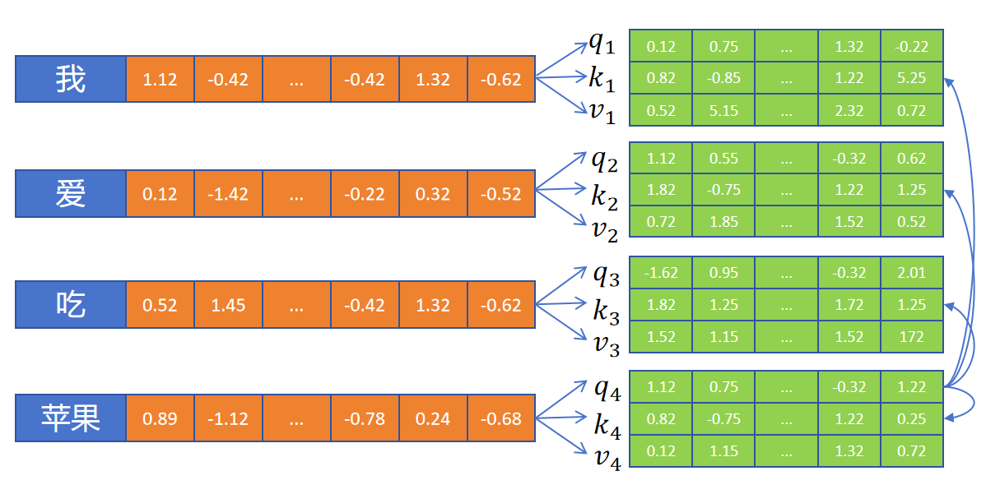
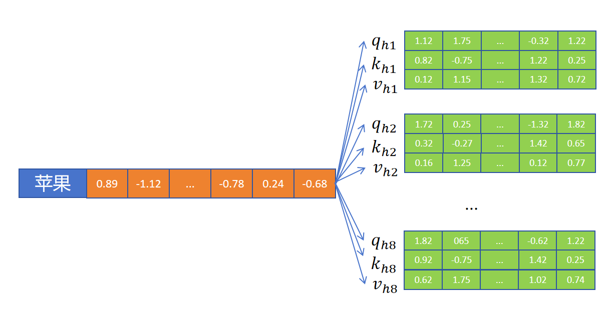
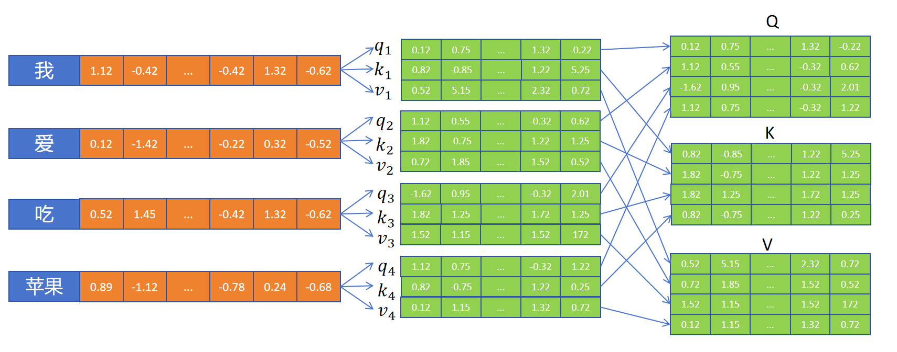
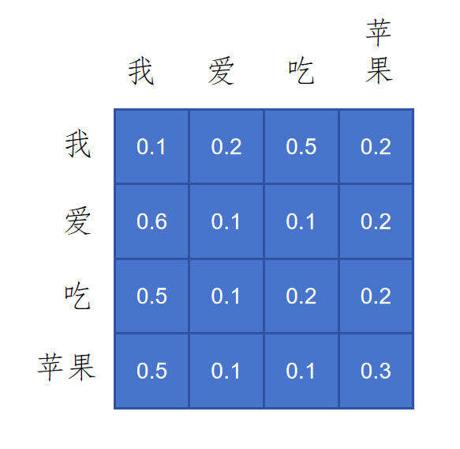
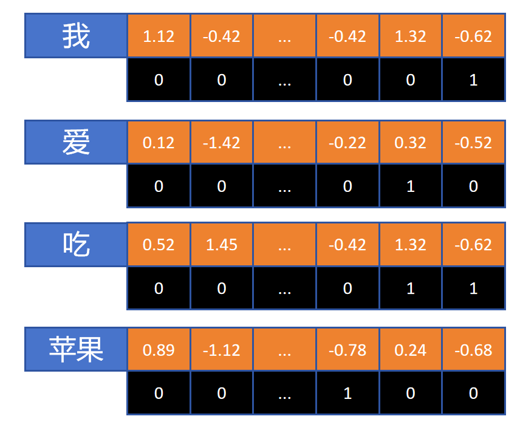
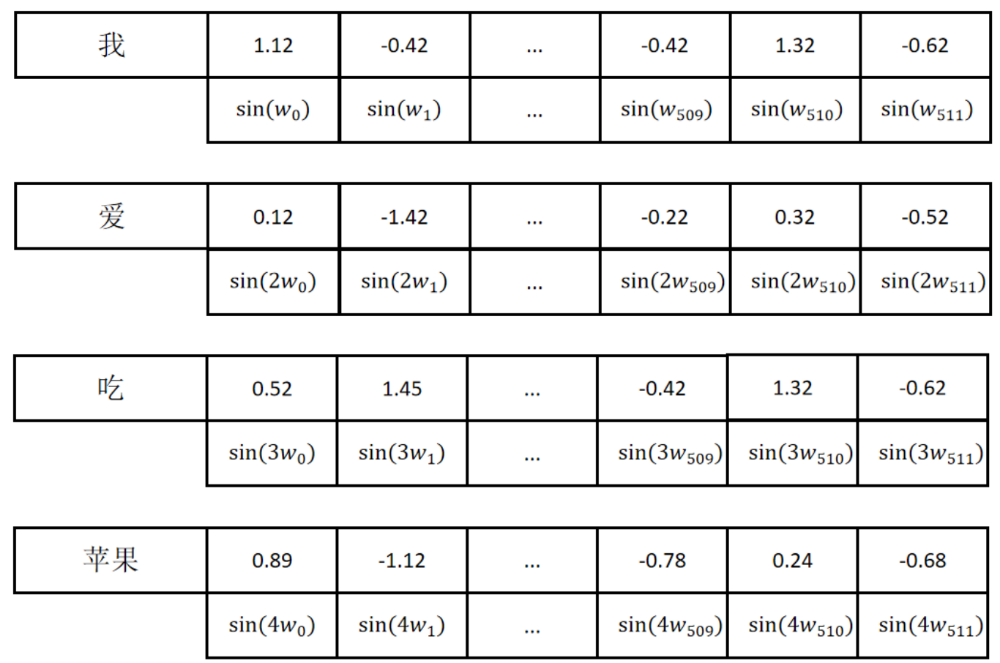
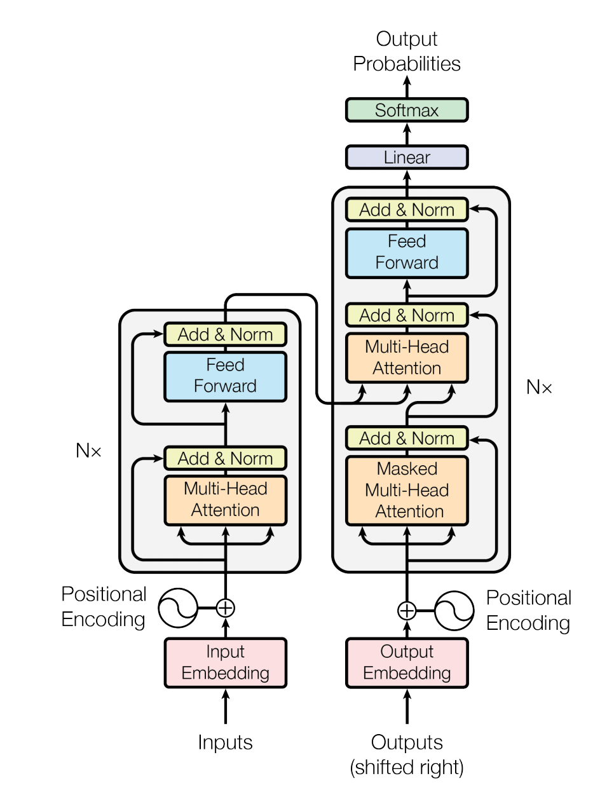
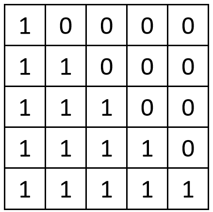

## 1. 组件
### 1.1 attention
- `Decoder` 当前时间步输入的隐状态 => `Q`
	- 隐状态去匹配原文里哪些信息需要拿来用
- `RNN` 中 `Encoder` 每个时间步输出的隐状态 => `K`
	- `Encoder` 将英文逐词编码，产生一组隐状态
	- 每个隐状态都作为候选，等待 `Q` 来匹配打分
- `RNN` 中拿到的 `K` 不经过处理直接进行使用，因此 `K` 等价于 `V`

#### 1.1.1 self-attention



- 定义 $3$ 个 `FC` 层，为每个 `token` 生成 `Q，K，V` 向量
- 以 “苹果” 为例，通过自己的 `Q` 向量和所有的 `K` 向量 (包括自身) 进行点积：

$$
A=[q_4\cdot k_1,q_4\cdot k_2,q_4\cdot k_3,q_4\cdot k_4]
$$

- 然后应用 `softmax` 转为注意力权重：$\ce{softmax}(A)=[0.1, 0.1, 0.3, 0.5]$
- 利用权重更新 “苹果” 的 `embedding`：$v_4=0.1v_1 + 0.1v_2 + 0.3v_3 + 0.5v_4$

#### 1.1.2 multihead self-attention



- 定义多个 `attn`，每个 `attn` 叫做一个头，这个头负责 `token` 里的某种特性
- 每个头中的 `Q, K, V` 各自负责这个特性的计算
- 每个头计算自己的注意力权重，对 `V` 进行加权求和，最后将各个头的输出进行拼接

### 1.2 矩阵运算加速



- 以一个头的 `attn` 为例，`Q，K，V` 的大小都是 `hidden_size`
- 将序列内所有的 `Q` 向量，`K` 向量，`V` 向量分别合并到一起，形成三个大小为 `[seq_len, hidden_size]` 的矩阵
- 通过 $\ce{softmax}(\ce{QK}^\top)$ 得到注意力权重矩阵：



第 $n$ 行表示第 $n$ 个 `token` 和其他每个 `token` 的注意力权重的值

- 注意力权重矩阵与 `V` 相乘得到 `attn` 的输出，也就是对序列所有 `token` 根据上下文，应用注意力机制更新后的 `embedding`：

$$
\ce{Attention}(\ce{Q,K,V})=\ce{softmax}(\ce{QK}^\top)\ce{V}
$$

在这个式子的基础上稍作修改：

$$
\ce{Attention}(\ce{Q,K,V})=\ce{softmax}(\frac{\ce{QK}^\top}{\sqrt{d_k}})\ce{V}
$$

式中的 $d_k$ 是特征维度 `hidden_size`，为何这里要做除法？
1. `Q, K` 都服从高斯分布，点积求和后的方差为 $d_k$
2. 点积过大会使得 `softmax` 的输出更尖锐，注意力只集中在几个 `token` 上
3. 通过除法将整体分布重新拉回到高斯分布
- 对每个注意力头进行矩阵运算后，将所有结果拼接起来：

$$
\ce{Attention}(\ce{Q,K,V})=\ce{concat}(\ce{Attention}(\ce{Q}_{h_1},\ce{K}_{h_1},\ce{V}_{h_1}), 
\ce{Attention}(\ce{Q}_{h_2},\ce{K}_{h_2},\ce{V}_{h_2}),\ldots)
$$

### 1.3 层归一化
- 序列归一化的问题：
	- 序列很长时，`batch size` 会变小，不同 `batch` 间的均值和方差差别很大
	- 句子长度不一样，填充了 `<pad>` 的特征会影响正常 `token` 均值和方差的计算
- 层归一化：
	- 按每个 `token` 来分别统计每个 `token` 所有特征的均值和方差，在 `token` 的每个维度都定义两个可学习参数 $\beta,\gamma$ 来进行线性变化
	- 通过层归一化保证每个 `token` 的特征大致服从高斯分布，保证后续点积计算的稳定性	
	- 若一个 `token` 的编码维度为 `512` 维，对这 `512` 个特征数字计算均值和方差，所有 `token` 共享这 `512` 个 $\beta,\gamma$。
	
$$
y=\frac{x-\ce{E}[x]}{\ce{Std}[x]+\epsilon}*\gamma + \beta
$$

### 1.4 位置编码

#### 1.4.1 绝对位置编码



为每个 `token` 设计一个和 `embedding` 一样维度的 `position embedding`。“我爱吃苹果”这句话包含 $4$ 个 `token`，编码从 $001$ 至 $100$，然后将 `embedding` 和 `position embedding` 相加使得词嵌入中包含位置信息。绝对位置编码的缺点：训练时序列长度固定，每个维度的数值只能是 $0$ 或 $1$

#### 1.4.2 sin 函数位置编码

对于函数 $\ce{sin}(ax)$，$a$ 越大周期越长，位置编码低的用波长短的 $\ce{si}n$ 函数，值的变化快，高维度用波长长的 $\ce{sin}$ 函数。对于一个 $d$ 维的位置编码，我们通过 $\ce{sin}(\omega_0),\ldots,\ce{sin}(\omega_{d-1})$ ，对位置 $i$ 处的 `token` 使用 $\ce{sin}(i\omega_0)$ 来编码，以 $512$ 维的位置编码为例：

 

而 `Transformer` 中使用 `sin` 和 `cos` 交替进行编码

$$
\begin{align} \text{PE}(i, 2k) &= \sin\left(i \cdot \frac{1}{10000^{2k/d}}\right) \tag{14} \\ \text{PE}(i, 2k+1) &= \cos\left(i \cdot \frac{1}{10000^{2k/d}}\right) \tag{15} \end{align}
$$

&emsp;假设对 $t$ 位置和 $t + \Delta t$ 位置的两个位置编码进行点积:

$$
\begin{align*} &(\sin(w_i t), \cos(w_i t)) \cdot (\sin(w_i(t+\Delta t)), \cos(w_i(t+\Delta t))) \\ &= \sin(w_i t)\sin(w_i(t+\Delta t)) + \cos(w_i t)\cos(w_i(t+\Delta t)) \\ &= \cos\left(w_i\left(t - (t+\Delta t)\right)\right) \\ &= \cos(w_i \Delta t) \end{align*}
$$

最终计算结果只和相对位置 $\Delta t$ 有关，而与词的绝对位置无关

## 2. 代码实现



### 2.1 encoder

`encoder` 的输入是一个 `batch` 的 `token` 的 `id` 列表，还有这个 `batch` 的 `token` 列表对应的 `mask`，`mask` 用来标志哪些 `token` 是填充的 `<pad>`。`<pad>` 在进行注意力计算时将被忽略

首先通过 `embedding` 模块根据每个 `token` 的 `id`，转化为 `token` 的 `embedding`，原本是 $1$ 维的 `id`，扩展到了 `embedding` 大小的维度，然后加上每个 `token` 的位置编码信息。输出的大小为 `[batch_size,seq_len,d_k]`。其中 `d_k` 是 `embedding` 的维度，标准 `Transformer` 里取 $512$

接着进入 `N` 个 `encoder block`，标准的 `Transformer` 中 `N = 6`，在 `encoder block` 内部通过自注意模块和全连接模块的 `embedding` 进行更新，保持维度不变，每个子层还要经过残差连接和 `Layer Norm`

#### 2.1.1 位置编码

```python
class PositionalEncoding(nn.Module):

    def __init__(self, d_model: int, seq_len: int, dropout: float) -> None:
        super().__init__()
        self.d_model = d_model
        self.seq_len = seq_len
        self.dropout = nn.Dropout(dropout)
        # 创建一个空的tensor
		# 输入大小是 (batch_size, seq_len, d_model), 同一 batch 共用一个位置编码，直接进行广播
        pe = torch.zeros(seq_len, d_model)  # (seq_len, d_model)
        # 创建一个位置向量
		# 通过 squeeze 将 pos 变成 [seq_len, 1]，与分母进行计算
        position = torch.arange(0, seq_len, dtype=torch.float).unsqueeze(1)
        # 计算分母
		# sin cos 各占 1/2，因此 arange 的步长取 2
        div_term = torch.pow(10000.0, -torch.arange(0, d_model, 2, dtype=torch.float) / d_model)  # (d_model / 2)
        # 偶数位调用sin
        pe[:, 0::2] = torch.sin(position * div_term) # 偶数位填充 sin，大小是 (seq_len, d_model/2)
        # 奇数为调用cos，填充完后得到 (seq_len, d_model)
        pe[:, 1::2] = torch.cos(position * div_term) 
        # 增加batch维度
		# embedding 的输出大小是 (batch_size, seq_len, d_model)，在最前面扩展一个维度实现相加
        pe = pe.unsqueeze(0)  # (1, seq_len, d_model)
        # 注册位置编码为一个buffer，这个tensor不会参与训练，但是会随同模型一起被保存或者迁移到GPU。
        self.register_buffer('pe', pe)

    def forward(self, x):
		# 位置编码构造器里的 seq_len 是预分配的最大空间
		# x 是 embedding 的输出，第 1 维是 seq_len，对 x 在这一维度上进行切片，取到实际长度 seq_len
        x = x + (self.pe[:, :x.shape[1], :]).requires_grad_(False) 
        return self.dropout(x)
```

#### 2.1.2 自注意力模块

```python
class MultiHeadAttentionBlock(nn.Module):

    def __init__(self, d_model: int, h: int, dropout: float) -> None:
        super().__init__()
        self.d_model = d_model  # embedding 特征大小
        self.h = h  # 头的个数
        # 确保 d_model 可以被 h 整除
        assert d_model % h == 0, # d_model 不能被 h 整除

        self.d_k = d_model // h  # 每个头特征大小
		# 公式中的输入 H ∈ d * d, 定义Wq, Wk,.. 输入对应 H 的第二个维度 d, 输出大小也是 d
		# 定义成 nn.Linear 方便学习
        self.w_q = nn.Linear(d_model, d_model, bias=False)  # Wq
        self.w_k = nn.Linear(d_model, d_model, bias=False)  # Wk
        self.w_v = nn.Linear(d_model, d_model, bias=False)  # Wv
        self.w_o = nn.Linear(d_model, d_model, bias=False)  # Wo
        self.dropout = nn.Dropout(dropout)

    @staticmethod
    def attention(query, key, value, mask, dropout: nn.Dropout):
        # 获取 d_k 的值。
        d_k = query.shape[-1]
        # Q 乘以 K 的转置，除以根号下d_k。
		# 在 forward 中通过 view 将 q k v 的大小都变成了 4 维 
        # (batch, h, seq_len, d_k) --> 乘法在后两个维度进行 --> (batch, h, seq_len, seq_len)
        attention_scores = (query @ key.transpose(-2, -1)) / math.sqrt(d_k)
        if mask is not None:
            # 给 mask 为 0 的位置填入一个很大的负值，再进行 softmax，注意力就为 0
			# mask 是大小为 (batch, 1, seq_len, seq_len) 的 tensor, 传入到 forward 方法中
            attention_scores.masked_fill_(mask == 0, -1e9)
        # 进行softmax，归一化。得到注意力权重
        # (batch, h, seq_len, seq_len) 中第一个 seq_len 是之前 q 的长度，在这里要对 k 进行归一化，因此 dim=-1
        attention_scores = attention_scores.softmax(dim=-1)
        if dropout is not None:
            attention_scores = dropout(attention_scores)
        # 注意力权重乘以V，得到更新后的 embedding
        # (batch, h, seq_len, seq_len) --> (batch, h, seq_len, d_k)
        return (attention_scores @ value), attention_scores

    def forward(self, q, k, v, mask):
        # 通过 3 个全连接层，获取 Q、K、V 矩阵
        query = self.w_q(q)  # (batch, seq_len, d_model) --> (batch, seq_len, d_model)
        key = self.w_k(k)
        value = self.w_v(v)

        # 对多头进行拆分
        # (batch, seq_len, d_model) --> (batch, seq_len, h, d_k) --> (batch, h, seq_len, d_k)
		# 第 0 维 (batch) 和 第 1 维 (seq_len) 不变，把第 2 维拆成 h, d_k
		# 把 h 升到第 1 维，在这个维度上进行拆分 
        query = query.view(query.shape[0], query.shape[1], self.h, self.d_k).transpose(1, 2)
        key = key.view(key.shape[0], key.shape[1], self.h, self.d_k).transpose(1, 2)
        value = value.view(value.shape[0], value.shape[1], self.h, self.d_k).transpose(1, 2)

        # 计算注意力
        x, self.attention_scores = MultiHeadAttentionBlock.attention(query, key, value, mask, self.dropout)

        # 多个头合并
        # (batch, h, seq_len, d_k) --> (batch, seq_len, h, d_k) --> (batch, seq_len, d_model)
		# contiguous 将数据放在连续内存中，从而进行 view
        x = x.transpose(1, 2).contiguous().view(x.shape[0], -1, self.h * self.d_k)

        # 乘以输出层
        return self.w_o(x)
```

#### 2.1.3 FFN

`FFN` 里定义 $2$ 个层，将 `embedding` 从 $512$ 扩展到 $2048$，通过 `ReLU` 激活后进行 `dropout`，第二层从 $2048$ 降维到 $512$

```python
class FeedForwardBlock(nn.Module):

    def __init__(self, d_model: int, d_ff: int, dropout: float) -> None:
        super().__init__()
		# 先把维度放大到 d_ff，学习到更复杂的特征
        self.linear_1 = nn.Linear(d_model, d_ff)
        self.dropout = nn.Dropout(dropout)
		# 经过 relu 激活后再降维
        self.linear_2 = nn.Linear(d_ff, d_model)

    def forward(self, x):
        # (batch, seq_len, d_model) --> (batch, seq_len, d_ff) --> (batch, seq_len, d_model)
        return self.linear_2(self.dropout(torch.relu(self.linear_1(x))))
```

#### 2.1.4 Add & Norm

```python
class LayerNormalization(nn.Module):

    def __init__(self, features: int, eps: float = 10 ** -6) -> None:
        super().__init__()
        self.eps = eps
        # 可学习权重
		# Parameter() 的构造器将 tensor 包装成模型可学习的参数
        self.alpha = nn.Parameter(torch.ones(features))
        # 可学习偏差
        self.bias = nn.Parameter(torch.zeros(features))

    def forward(self, x):
        # x: (batch, seq_len, hidden_size)
        # 保留维度来进行广播
        mean = x.mean(dim=-1, keepdim=True)  # (batch, seq_len, 1)
        std = x.std(dim=-1, keepdim=True)  # (batch, seq_len, 1)
        # eps 是为了防止除 0 设置的很小的值
        return self.alpha * (x - mean) / (std + self.eps) + self.bias

class ResidualConnection(nn.Module):

    def __init__(self, features: int, dropout: float) -> None:
        super().__init__()
        self.dropout = nn.Dropout(dropout)
        self.norm = LayerNormalization(features)

    def forward(self, x, sublayer):
		# 残差计算
        return x + self.dropout(sublayer(self.norm(x)))
```

#### 2.1.5 搭建 encoder

```python
class EncoderBlock(nn.Module):

    def __init__(self, features: int, self_attention_block: MultiHeadAttentionBlock,
                 feed_forward_block: FeedForwardBlock, dropout: float) -> None:
        super().__init__()
        # 定义多头自注意力模块
        self.self_attention_block = self_attention_block
        # 定义全连接模块
        self.feed_forward_block = feed_forward_block
        # 定义两个Add & Norm模块
        self.residual_connections = nn.ModuleList([ResidualConnection(features, dropout) for _ in range(2)])

    def forward(self, x, src_mask):
        # 第一个残差连接，跳过多头注意力模块
		# self.self_attention_block(x, x, x, src_mask) 调用自注意力类的 forward(self, q, k, v, mask), 自注意力的 qkv 均来自 x 自身，因此传入 3 个 x
		# 残差类的 forward(self, x, sublayer): self.dropout(sublayer(self.norm(x)))，通过 lambda 包装成函数传给 sublayer，进行自注意力计算
        x = self.residual_connections[0](x, lambda x: self.self_attention_block(x, x, x, src_mask))
        # 第二个残差连接，跳过全连接模块
        x = self.residual_connections[1](x, self.feed_forward_block)
        return x


class Encoder(nn.Module):

    def __init__(self, features: int, layers: nn.ModuleList) -> None:
        super().__init__()
        # 传入的6个EncoderBlock
        self.layers = layers
        self.norm = LayerNormalization(features)

    def forward(self, x, mask):
        # 依次调用6个EncoderBlock
        for layer in self.layers:
            x = layer(x, mask)
        # 输出前进行Layer Norm
        return self.norm(x)
```

### 2.2 decoder

`decoder` 输入包括：

- `encoder` 的输出，$512$ 大小的英文序列每个 `token` 的 `embedding`
- 已经翻译出来的 `token` 序列：`Transformer` 编码器可以一次性输入完整的英文 `token` 序列，但在模型进行实际翻译时，需要解码器逐个生成对应的中文 `token` 序列。`<bos>` 是 `decoder` 的初始输入

#### 2.2.1 带掩码的多头注意力

`Transformer` 模型在推理时，`decoder` 是逐个生成中文 `token` 的。但是在训练时，因为我们已经知道英文对应的中文 `token` 序列，所以我们可以通过带掩码的多头注意力机制`（MMHA）`来实现并行化训练，以中文 `token` 序列 `<bos>` | 我 | 爱 | 吃 | 苹果 这 $5$ 个 `token` 为例：



`mask` 矩阵每行表示当前 `token` 可以看到的 `token`，第一行只有一个 $1$，代表 `<bos>` 只能看到它自己，以此类推。在计算注意力时传入 `mask` 矩阵，让每个 `token` 只关注自己和自己之前的 `token`

`encoder` 中传入的 `mask` 用于忽略 `<pad>` 的 `token`，`decoder` 中传入的 `mask` 忽略 `<pad>` `token` 和当前 `token` 后边的 `token`

`mask` 的创建：

```python
def create_mask(src, tgt, pad_idx):
    # mask <pad> token for encoder.
	# 扩展到 4 维与注意力对齐
    src_mask = (src != pad_idx).unsqueeze(1).unsqueeze(2)  # (batch, 1, 1, src_len)
    # mask <pad> token for decoder.
    tgt_pad_mask = (tgt != pad_idx).unsqueeze(1).unsqueeze(2)  # (batch, 1, 1, tgt_len)

    tgt_len = tgt.size(1)
    # decoder mask 当前token后边的token
	# torch.tril(input, diagonal=0)，传入一个矩阵，返回它的下三角矩阵
    tgt_sub_mask = torch.tril(torch.ones((tgt_len, tgt_len), device=tgt.device)).bool()  # (tgt_len, tgt_len)
    # decoder 同时mask <pad> token, 以及当前token后边的token。
    tgt_mask = tgt_pad_mask & tgt_sub_mask  # (batch, 1, tgt_len, tgt_len)
    return src_mask, tgt_mask
```

#### 2.2.2 交叉注意力

从模型图中可以看出，交叉注意力模块的 `K` 和 `V` 矩阵来自编码器的输出，`Q` 矩阵来自解码器部分。所以解码器根据当前翻译的需要提出查询向量 `q`，和所有编码器输出的 `k` 进行匹配，计算注意力，最终得到编码器输出的 `v` 的注意力加权值

`decoder` 最终接一个线性分类头，输入大小是 $512$，输出维度是字典的大小。线性层的输出再经过 `softmax()` 之后，就是字典里每个 `token` 作为输出下一个 `token` 的概率值

#### 2.2.3 搭建 decoder

```python
class DecoderBlock(nn.Module):

    def __init__(self, features: int, self_attention_block: MultiHeadAttentionBlock,
                 cross_attention_block: MultiHeadAttentionBlock, feed_forward_block: FeedForwardBlock,
                 dropout: float) -> None:
        super().__init__()
        self.self_attention_block = self_attention_block
        self.cross_attention_block = cross_attention_block
        self.feed_forward_block = feed_forward_block
        self.residual_connections = nn.ModuleList([ResidualConnection(features, dropout) for _ in range(3)])

    def forward(self, x, encoder_output, src_mask, tgt_mask):
        x = self.residual_connections[0](x, lambda x: self.self_attention_block(x, x, x, tgt_mask))
        # 交叉注意力模块的 Q 矩阵来自 Decoder，K,V 矩阵来自 Encoder 的输出
        x = self.residual_connections[1](x, lambda x: self.cross_attention_block(x, encoder_output,encoder_output, src_mask))
        x = self.residual_connections[2](x, self.feed_forward_block)
        return x

class Decoder(nn.Module):

    def __init__(self, features: int, layers: nn.ModuleList) -> None:
        super().__init__()
        self.layers = layers
        self.norm = LayerNormalization(features)

    def forward(self, x, encoder_output, src_mask, tgt_mask):
        for layer in self.layers:
            x = layer(x, encoder_output, src_mask, tgt_mask)
        return self.norm(x)
```

