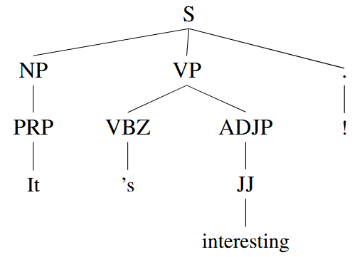
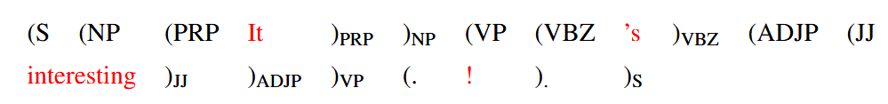
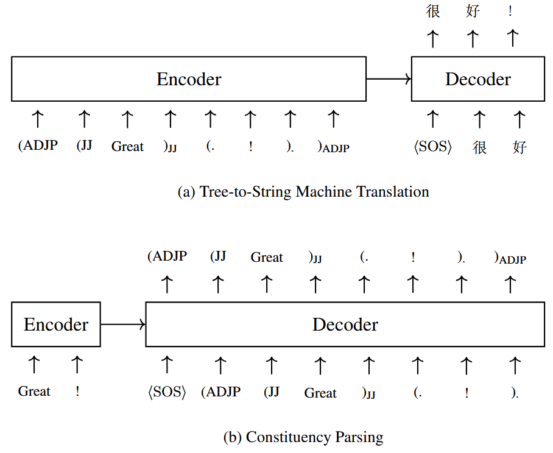
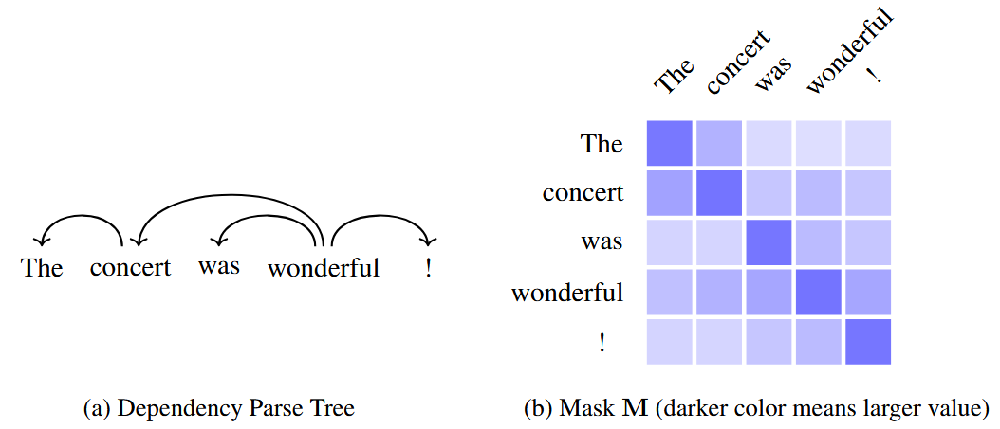
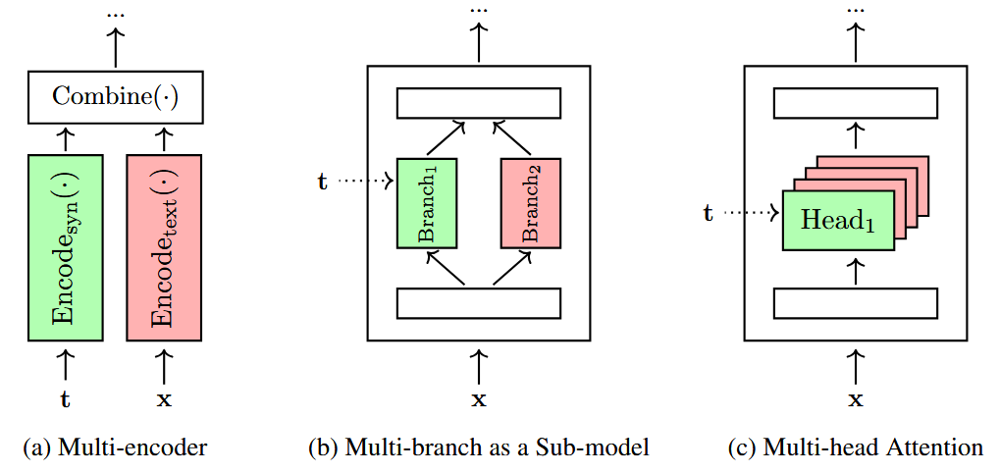
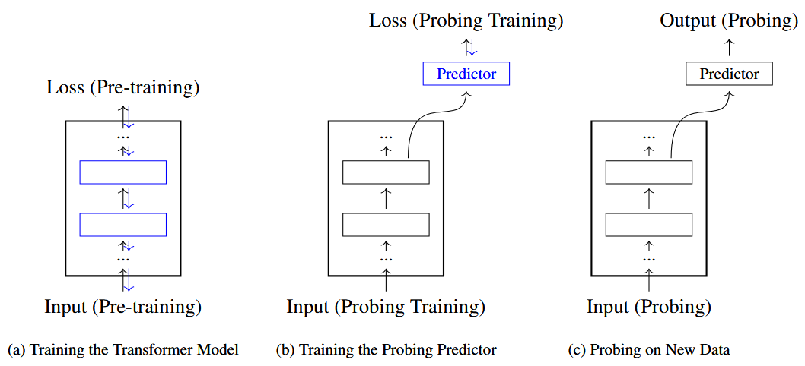

`Transformer` 作为深度学习模型，并未显式利用语言学结构或相关先验假设，但我们仍有必要将先验知识融入这类模型。究其原因，`NLP` 领域的研究者一直认为，想要构建理想的自然语言处理系统，需要对数据进行更高层级的抽象表示，目前也已有大量模型引入了结构先验。本节主要讨论如何将语言学结构融入 `Transformer` 模型，对 `encoder` 进行改进。

## 1. Syntax-aware Input and Output

向自然语言处理模型引入结构信息，最简单的方式之一就是修改输入序列，模型主体保持不变。例如，考虑一个句子：其中每个词 $x_j$ 都分配了 $\kappa$ 个句法标签 $\{\ce{tag^1_j},\ldots, \ce{tag^\kappa_j} \}$ (例如词性标签，依赖标签)，再将这些符号拼接定义一个新词：

$$
x_j/\ce{tag^1_j}/\ldots/\ce{tag^\kappa_j}
$$

那么这个词的 `embedding` 可以表示为：

$$
\mathbf{e}_j = e(x_j/\ce{tag^1_j}/\ldots/\ce{tag^\kappa_j})+\ce{PE}(j)\tag{1}
$$

其中 $e(x_j/\ce{tag^1_j}/\ldots/\ce{tag^\kappa_j})\in \mathbb{R}$ 是 $x_j/\ce{tag^1_j}/\ldots/\ce{tag^\kappa_j}$ 的 `embedding`。由于 $x_j/\ce{tag^1_j}/\ldots/\ce{tag^\kappa_j}$ 是一个复合符号，我们可以将其学习问题分解成更简单的子问题。例如通过 $\kappa$ 个嵌入模型，每个分别处理一个给定的 `tag`。之后我们可以将 $e(x_j/\ce{tag^1_j}/\ldots/\ce{tag^\kappa_j})$ 写作是词嵌入和标签嵌入的和：

$$
e(x_j/\ce{tag^1_j}/\ldots/\ce{tag^\kappa_j}) = \mathbf{x}_j + e(\ce{tag^1_j}) + \ldots + e(\ce{tag^\kappa_j})\tag{2}
$$

其中 $\{e(\ce{tag^1_j}) , \ldots , e(\ce{tag^\kappa_j})\}$ 是 `tag` 的 `embedding`。或者也可以通过神经网络将这些 `embedding` 进行组合：

$$
e(x_j/\ce{tag^1_j}/\ldots/\ce{tag^\kappa_j}) = \ce{FFN}_{\ce{embed}} (\mathbf{x}_j,  e(\ce{tag^1_j}), \ldots, e(\ce{tag^\kappa_j}))\tag{3}
$$

其中 $\ce{FFN}_{\ce{embed}} (\cdot)$ 是一层或两层的前向反馈神经网络。

我们也可以将同样的技巧用于 `decoder` 端，将 $y_j/\ce{tag^1_j}/\ldots/\ce{tag^\kappa_j}$ 看作是融合句法信息的目标词。但这种做法会大幅扩大目标端词表规模，给模型训练与推理都带来计算压力。

另一个常用的做法是通过句法树来表示句子。在序列建模中，利用不同语法体系的通用思路是<b>树线性化 (<i>tree linearization</i>)</b>，考虑下面这个标注了短语结构句法树的例子：

图中的标注来自宾夕法尼亚大学树库 `(PTB)`，包含 $45$ 个标准标签，`S` 是根节点，`NP` 是名词短语，`VP` 是动词短语，`ADJP` 是形容词短语，`PRP` 是人称代词，`VBZ` 是动词现在时单三，`JJ` 是形容词。

我们可借助树遍历算法，将该句法树转换为由单词、句法标签与括号组成的序列:

该句法符号序列可直接作为编码器的输入。具体来说，每个符号由词嵌入与位置编码相加得到融合向量，该向量即作为编码器的标准输入。树线性化的典型应用之一是树到字符串机器翻译，即将一种语言的句法树翻译为另一种语言的文本序列，也可用于树结构生成<b> (图 1)</b>。

## 2. Syntax-aware Attention Models

对于 `Transformer` 模型而言，利用句法树引导序列表示学习也是一种合理思路。我们在编码器的自注意力机制中引入加法掩码，对位置间的注意力分布施加结构约束：

$$
\text{AttSyn}_\text{self}(\mathbf{H}) = \text{Softmax}\left( \frac{\mathbf{H}^q (\mathbf{H}^k)^\top}{\sqrt{d}} + \mathbf{M} \right) \mathbf{H}^v\tag{4}
$$

或者也可以选择乘法掩码

$$
\text{AttSyn}_\text{self}(\mathbf{H}) = \left[ \text{Softmax}\left( \frac{\mathbf{H}^q (\mathbf{H}^k)^\top}{\sqrt{d}} \right) \odot \mathbf{M} \right] \mathbf{H}\tag{5}
$$

其中 $\mathbf{M} \in \mathbb{R}^{m \times m}$ 是掩码变量矩阵，$M(i,j)$ 的值越大表示 $i$ 和 $j$ 位置之间的句法关联越强

设计矩阵 $\mathbf{M}$ 的一种通用方式，是将输入句法树的结构关系映射为序列上的约束。这里我们以短语结构树和依存句法树为例进行说明，通常采用两种掩码方式：

**0-1 掩码**：若 $i$ 位置和 $j$ 位置上的词存在句法关联，则 $M(i,j) = 1$，否则为 $0$。为刻画句法树中词语间的关系，可依据对应节点的距离进行建模，最简形式如下：

$$
M(i,j) = \begin{cases} 1 & \omega(i,j) \leq \omega_{\max} \\ 0 & \text{otherwise} \end{cases}\tag{6}
$$

其中 $\omega(i,j)$ 是位置 $i$ 和 $j$ 处词语对应节点间的最短路径长度。例如，在依存句法树中，$\omega(i,j)$ 是两词路径上的依存边数；在成分句法树中，所有词语均为叶节点，因此 $\omega(i,j)$ 表示同一分支内两个叶节点间的树距离。$\omega_{\ce{max}}$ 用于控制存在句法关联的节点间的最大距离。例如若依存句法树中 $\omega_{\ce{max}}=1$，则上式会施加约束，仅当位置 $i$ 和 $j$ 存在直接的父子依存关系时才计算二者的注意力分数。

**软掩码**：不将 $\mathbf{M}$ 看作是硬约束，而是将其作为软约束，根据 $i$ 和 $j$ 处相应词的句法关联程度来缩放它们之间的注意力权重。一种常见思路是：句法距离 $\omega(i,j)$ 越大，注意力权重就越小。一个简单的实现方法：对 $\omega(i,j)$ 变换，使得 $M(i,j)$ 与 $\omega(i,j)$ 负相关，范围落在区间 $[0,1]$ 内：

$$
M(i,j) = \ce{DNorm}(\omega{i,j})\tag{7}
$$

$\ce{DNorm}(\cdot)$ 存在多种设计方案：可对 $-\omega(i,j)$ 做归一化处理 (减去均值并除以标准差)；也可在整个序列上对 $1/\omega(i,j)$ 做归一化。若句法分析器能直接输出位置 $i$ 和 $j$ 之间的关联得分，此时可不依赖 $\omega(i,j)$，直接用该得分计算 $M(i,j)$。例如，依存句法分析器可输出位置 $i$ 的单词作为位置 $j$ 单词父节点的概率，此时 $M(i,j)$ 可定义为：

$$
M(i,j) = \ce{Pr}_{\text{parent}}(i \mid j)\tag{8}
$$

或者也可定义为

$$
M(i,j) = \max\left\{ \ce{Pr}_{\text{parent}}(i \mid j), \ce{Pr}_{\text{parent}}(j \mid i) \right\}\tag{9}
$$

其中 $\ce{Pr}_{\text{parent}}(i \mid j)$ 和 $\ce{Pr}_{\text{parent}}(j \mid i)$ 是分析器输出的概率。<b>图 2</b> 展示了如何从依存句法树中推导出软掩码变量的示例。

## 3. Multi-branch Models

将句法信息融入自然语言处理系统面临几大挑战：部分原因是自动句法分析得到的句法树可能存在错误；另一部分原因是，引入句法会对句子的底层结构做出较强的先验假设。

与其将句法信息与词汇信息整合到单一整体模型中，不如分别构建模型：一个编码句法信息，另一个编码词序列，这种方式会更加灵活且效果更佳。具体可采用多分支神经网络（也称作<b>分支</b>或<b>通路</b>），每个分支单独处理一类输入。再将各分支的输出融合，得到最终结果。

一个常用方法是使用两个不同的 `encoder`，一个用来编码句法输入 $\mathbf{t}$，另一个用来编码标准文本输入 $\mathbf{x}$。<b>图 3(a) </b>展示了这种多 `encoder` 架构。其中句法 `encoder` 基于之前提到的模型，文本 `encoder` 是标准的 `Transformer encoder`。这些 `encoder` 产生的表示作为输入进入组合模型后结合得到一个混合表示，由下式给出:

$$
\begin{align} 
\mathbf{H}_{\text{hybrid}} &= \text{Combine}(\mathbf{H}_{\text{syn}}, \mathbf{H}_{\text{text}}) \notag \\ &= \text{Combine}\bigl( \text{Encode}_{\text{syn}}(\mathbf{t}), \text{Encode}_{\text{text}}(\mathbf{x}) \bigr) \tag{10}
\end{align}
$$

$\text{Combine}(\cdot)$ 有多种设计方式，基于 `encoder` 所应用的任务。例如，若目标是构建文本分类器，$\text{Combine}(\cdot)$ 可以是一个简单的池化网络；而对于机器翻译这类更复杂的任务，$\text{Combine}(\cdot)$ 也可以是一个 `Transformer` 编码器，通过在拼接后的 $[\mathbf{H}_{\ce{syn}},\mathbf{H}_{\ce{text}}]$ 上执行自注意力，实现不同来源信息的融合。

虽然本节主要聚焦于句法模型，但这种通用的多 `encoder` 架构，也可用于许多需要额外来源输入的任务中。例如，可使用一个 `encoder` 表示当前句子，另一个 `encoder` 表示同一文档中的上一句；融合两个 `encoder` 的输出即可得到具备上下文感知能力的模型。`encoder` 的架构也不必局限于 `Transformer`，可根据不同分支选择不同模型。

`Transformer` 的子模块也可以采用多分支神经网络的形式。<b>图 3(b) </b>展示了包含两个自注意力分支的示例：一个是标准自注意力网络 $\ce{Att_{self}}(\mathbf{H})$，另一个是句法感知自注意力网络 $\ce{AttSyn_{self}}(\mathbf{H})$。自注意力模型的输出是这两个分支的线性组合：

$$
\mathbf{H}_{\ce{self}} = \alpha \cdot \ce{Att_{self}}(\mathbf{H}) + (1 - \alpha) \cdot \ce{AttSyn_{self}}(\mathbf{H}) \tag{11}
$$

其中 $\alpha$ 是组合系数。$\mathbf{H}_{\ce{self}}$ 可以按常规方式进行 `LN` 和残差连接，整体架构与标准 `Transformer` 保持一致。

多头注意力网络同样可看作一种多分支模型。因此，我们可以仅对部分注意力头引入句法引导，其余注意力头保持原有形式不变。<b>图 3(c) </b>展示了该方案：在自注意力子层中，仅单个注意力头依托句法树计算注意力权重。

## 4. Multi-scale Models

在语言学中，句法研究句子如何由更小的语言成分构成。这些成分按不同层级形成的层级结构，称为<b>句法层级</b>。因此，我们可以借助不同层级的句法成分来解析同一个句子。

多尺度 `Transformer` 利用数据中不同抽象层级的信息，通过多尺度特征表征句子。一种常用思路是将句子转换为多种表达形式，再借助多分支网络对其进行融合。以如下句子为例：

$$
\ce{The oldest beer-making facility was discovered in China}.
$$

我们将这个句子进行分词，得到词序列：

$$
\mathbf{x}_{\ce{words}} = \ce{The oldest beer-making facility was discovered in China .}
$$

或者，我们也可通过句法分析器将其转换为短语序列：

$$
\mathbf{x}_{\ce{phrases}} = \ce{[The oldest beer-making facility]_{NP} [was discovered in China]_{VP}}[.]
$$

&emsp;构建多尺度模型最简单的方式，是使用两个独立的 `Transformer` 编码器分别对 $\mathbf{x}_{\ce{words}}$ 和 $\mathbf{x}_{\ce{phrases}}$ 进行编码。它们的输出再以某种方法进行组合，可以看作是多 `encoder` 架构的一种实现。

$\mathbf{x}_{\ce{words}}$ 和 $\mathbf{x}_{\ce{phrases}}$ 都可看作是 `token` 序列。然而枚举所有可能的短语会导致词表规模急剧膨胀，因此需要一种高效的方式将每个短语转化为向量表示。将短语嵌入视作序列建模问题，便可借助前文介绍的序列模型 (`RNN`, `LSTM` 等) 学习子序列表征。整体形成两阶段学习流程：第一阶段，利用独立模型学习不同粒度输入单元的嵌入；第二阶段，通过多分支模型完成多尺度序列编码。

进一步而言，在多尺度表征学习中，不必局限于具备语言学意义的语言单元。例如，可从数据中学习子词切分规则，将输入句子表示为子词序列，进而形成句子的层级表征（如子词 → 单词 → 短语）。这类习得的子词虽无语言学含义，却能为单词、短语建模提供新思路，同时新增一类特征粒度。

此外，多尺度建模也并非一定要搭建多个独立 `encoder`，另一种思路是将不同尺度的表征直接融入多头自注意力模块，更便于建模各尺度之间的关联。

但上述方法存在一个问题：不同尺度学习得到的表征（或注意力权重矩阵）维度并不一致。此时可以对短语级表征做上采样，也可对单词级表征做下采样。

## 5. Transformers as Syntax Learners

至此，我们探讨了将句法树作为编码过程的约束或先验，从而在神经网络训练中融入语言学表征。那么神经模型能否脱离人工标注的语言信息，直接从数据中习得语言结构知识呢？

探究 `Transformer` 模型中隐含语言结构的一种方式是构建<b>句法层级</b>，以此判断模型是否以及在多大程度上捕捉到依存关系、词性等语言特征。通用探测方法的思路是提取模型的内部表征，进而检验其中包含的语言现象。针对 `Transformer`，通常通过分析注意力图与注意力层输出实现这一目的。随后搭建<b>探测预测器</b>（或称探测分类器），将上述内部表征作为输入，预测对应的语言特征。探测预测器可采用简单规则实现，也可使用针对探测任务专门优化的参数化模型。

<b>图 4</b> 展示了完整探测流程：给定一个 `Transformer` 模型，我们首先在无标注数据上优化模型参数。随后，我们构建一个预测器，它以 `Transformer` 模型隐藏层的状态作为输入，并为探测任务生成输出。预测器采用常规方式训练 ——仅更新预测器自身参数，`Transformer` 模型参数保持固定。最后，联合使用 `Transformer` 模型和预测器，对新数据进行预测以完成探测。

近年来，研究者采用了多种探测方法来分析和解读神经 `encoder` 的学习内容。下文介绍其中几种主流方法。

**句法树探测**。对于训练完成的 `Transformer` 编码器，只需计算两个单词间的注意力权重，就能判断二者存在语言关联的概率。我们可基于该权重定义指标，衡量位置 $i$ 与位置 $j$ 处两个单词间的句法距离:

$$
d_S(i,j) = 1 - \alpha(i,j)\tag{12}
$$

借助该指标，便可为句子构建最小生成树：将所有单词相连，形成总距离最小的树结构。这一树结构可看作神经网络推导得到的句子隐式树表征。这类近似依存树的结构虽能为下游任务提供模型习得的句法信息，却难以反映模型真实的句法认知。

若要让编码器表征与语言学结构对齐，可训练模型生成和人工标注一致的句法树。为此，需要基于树标注数据训练探测预测器。假设句子带有人工标注的依存树，统计任意两个单词之间的边数，即可得到二者的距离 $\omega(i,j)$。随后基于编码器的内部表征学习距离度量，去拟合 $\omega(i,j)$。最常用的度量是欧氏距离，设参数矩阵是 $\mathbf{A} \in \mathbb{R}^{d \times k_S}$，则平方欧氏距离定义如下：

$$
d_s^2(i, j) = \left\| (\mathbf{h}_i - \mathbf{h}_j) \mathbf{A} \right\|_2^2\tag{13}
$$

其中 $\mathbf{h}_i$ 和 $\mathbf{h}_j$ 是编码层在 $i$ 和 $j$ 处产生的表示。给定一组带句法树标注的句子集合 $S$，我们可以通过以下方式优化模型：

$$
\hat{\mathbf{A}} = \arg\max_{\mathbf{A}} \sum_{s \in S} \frac{1}{|s|^2} \sum_{i \in s, j \in s} \left| \omega(i, j) - d_s^2(i, j) \right| \tag{14}
$$

其中 $|s|$ 是句子 $s$ 的长度，$(i,j)$ 是 $s$ 中的一对词。优化后的模型随后通过最小生成树算法解析测试句子，我们可以将生成的句法树与人工标注的句法树进行对比。

**句法与语义标签探测**。许多句法和语义分析任务，都可以被定义为 “给定句子或其片段，预测语言学标签” 的问题。最典型的例子就是词性标注：为句子中的每个单词分配对应的词类标签。词性标注的探测模型，就是一个每次接收单词表征 $\mathbf{h}_j$，输出对应词类的分类器。针对这类任务，一种通用的探测方法是边探测。给定一个句子，带标签的边定义为一个元组:

$$
\ce{(span1,span2,label)}
$$

其中 $\ce{span1}$ 是一个文本片段 $[i_1,j_1]$，$\ce{span2}$ 是第二个可选片段 $[i_2,j_2]$，$\ce{label}$ 是对应的语言学标签。我们的目标是学习一个探测模型，根据 $\ce{span1}$ 和 $\ce{span2}$ 预测 $\ce{label}$。例如对于对于词性标注任务，$\ce{span1}$ 是每个位置 $j$ 对应的单元片段 $[j,j]$，$\ce{span2}$ 是空片段，$\ce{label}$ 是句子中第 $j$ 个单词的词性标签。

**词汇与句子表层形式探测**。探测任务也可用于检验模型表征是否编码了句子或单词的表层信息。句子层面的典型探测任务是<b>句子长度预测</b>：先将整句压缩为单个向量 $\mathbf{h}$ 再构建分类器，依据 $\mathbf{h}$ 判断句子所属的长度区间。

**完形填空探测**。探测任务也可用于句法、词法之外的能力检验。大规模预训练 `Transformer` 模型可被视作存储现实世界常识的知识库，因此研究者尝试借助探测手段检验模型的事实知识掌握情况。一种简单方式是让探测模型补全句子中的缺失内容，典型应用就是完形填空任务。

在自然语言处理领域，探测技术与大语言模型的预训练联系紧密。通常可将探测任务视作预训练模型的下游应用，不过它更多作为分析工具，用来快速检验模型能力。如果探测网络本身结构复杂、训练充分，就很难判定任务效果究竟来自表征中蕴含的有效信息，还是探测网络自身强大的建模能力。为区分二者的作用，常用做法是设置合理基线模型进行对比，或是设计对照实验加以验证。

