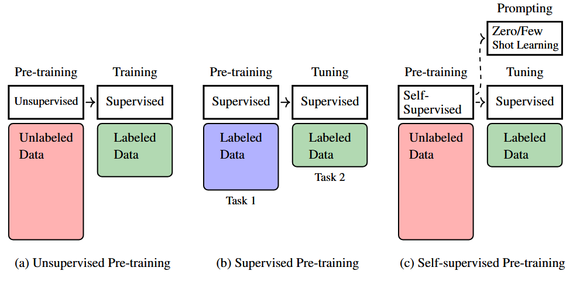
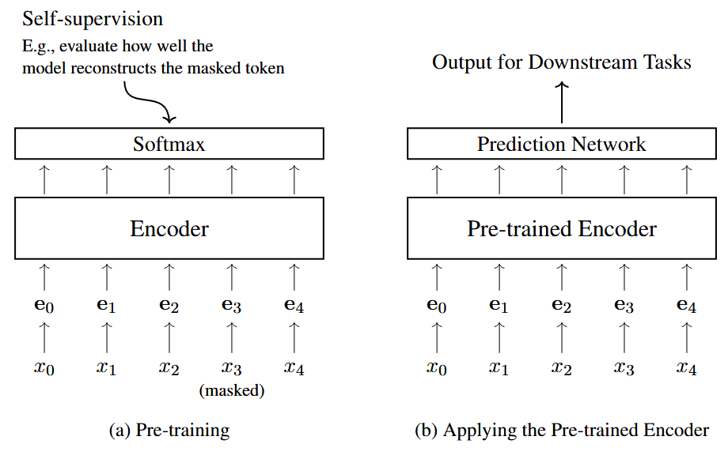
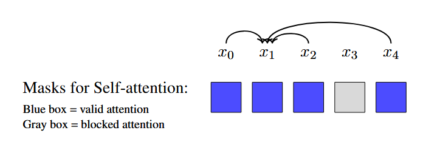
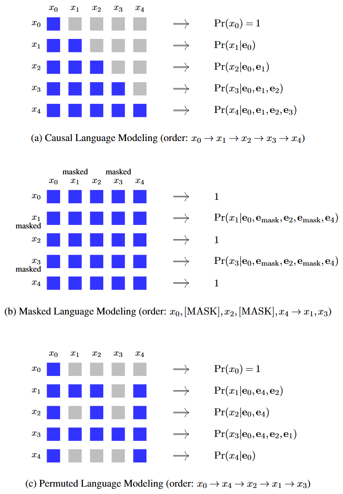
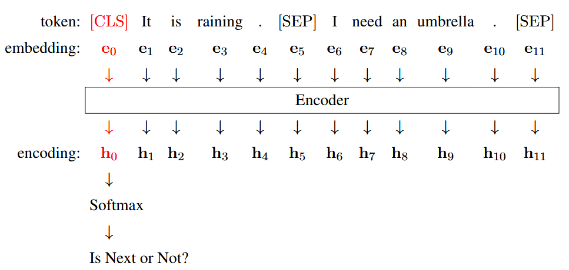
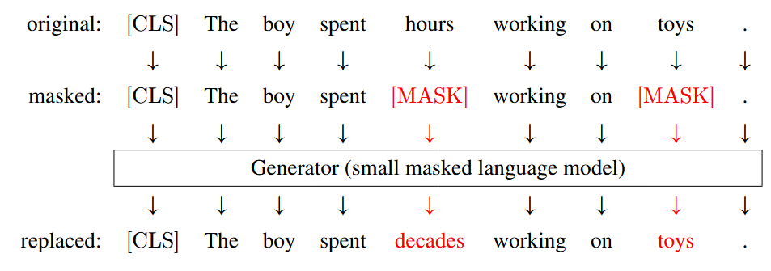
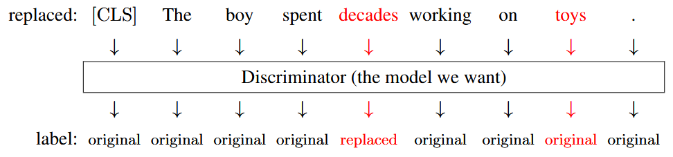
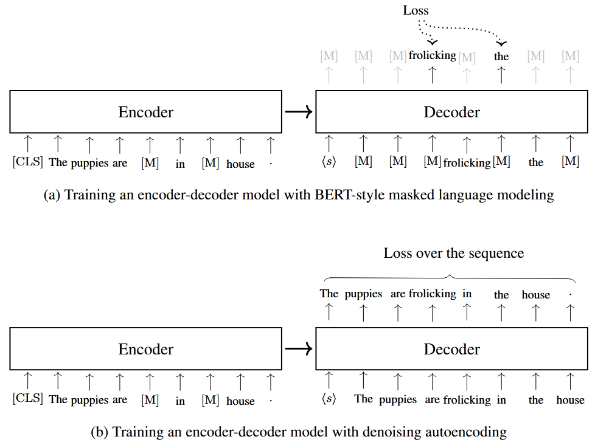
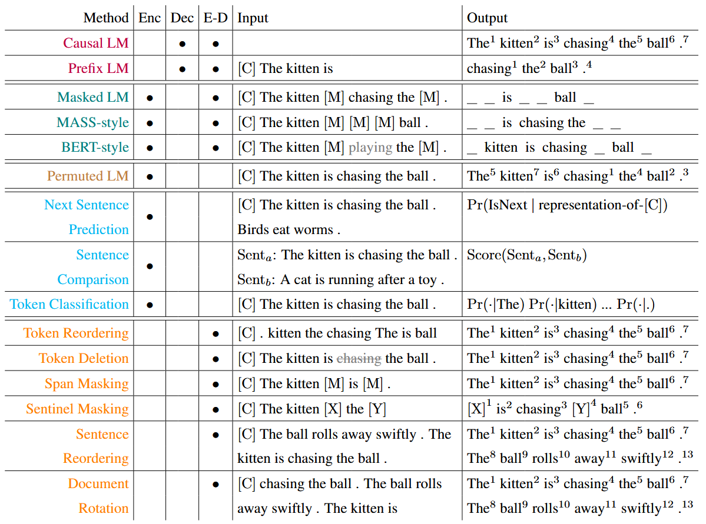

以 `Transformer` 为代表的神经序列模型不断迭代，以及大规模自监督学习技术的进步，为通用语言理解与生成任务的落地创造了条件。这一进展主要依托预训练技术实现：从各类神经网络架构中提炼通用基础模块，依托海量无标注数据开展自监督预训练。

经过预训练得到的基座模型，可通过微调或提示学习快速适配各类下游任务，由此彻底重构了自然语言处理的研究范式。多数场景下，不再需要针对具体任务从零开展大规模有监督训练，仅需对预训练基座模型做适配优化即可。

`NLP` 领域的大规模预训练研究，起步于基于自监督学习的语言模型，代表性模型包括 `BERT`、`GPT`。这类模型的核心思路一致：依托海量文本，通过预测掩码词或下文词完成训练，从而习得通用的语言理解与生成能力。该预训练方式原理简洁，却能让模型在无专项训练的前提下自动学习语言结构。

## 1 Pre-training in NLP

`NLP` 中的预训练包括两种任务：序列建模和序列生成，它们的形式不同，为了简便起见，我们用一个简单的模型来统一定义：

$$
\begin{align*}
\mathbf o &= g(x_0,x_1,\ldots,x_m;\theta) \\
&= g_{\theta}(x_0,x_1,\ldots,x_m) \tag{1}
\end{align*}
$$

其中 $\{x_0,x_1,\ldots,x_m\}$ 表示输入 `token` 的序列，$x_0$ 是序列开头的特殊标记 ($\langle\text{s}\rangle$ 或 $[\text{CLS}]$)。$g(\cdot;\theta)$ 代表参数为 $\theta$ 的神经网络，$\mathbf o$ 为网络输出。对于 `token` 预测类任务，$\mathbf o$ 是词表空间上的概率分布；对于序列编码类任务，$\mathbf o$ 为输入序列的特征表示。

这里我们考虑两个基本问题：
- 优化预训练任务中的 $\theta$。与 `NLP` 中标准的学习问题不同，预训练不绑定具体下游任务，目标是训练具备跨任务泛化能力的通用模型。
- 将预训练模型 $g_{\hat\theta}(\cdot)$ 迁移至下游任务：利用标注数据微调参数 $\hat\theta$，或是借助任务提示词实现模型适配。

### 1.1 Unsupervised, Supervised and Self-supervised Pre-training

在深度学习中，预训练指神经网络在微调并落地下游任务前的参数优化过程。该方法依托一个核心假设：在某一任务上完成预训练的模型，能够高效迁移适配其他任务。因此在标注数据稀缺的场景下，无需从零训练深层复杂网络，可利用更容易获取监督信息的数据完成预训练。此举降低模型对人工标注的依赖，便于训练不受单一任务约束的通用模型。

早期预训练研究大多围绕<b>无监督学习</b>展开。这类方法采用和下游目标任务无直接关联的优化准则更新网络参数。无监督预训练一般作为有监督训练的前置步骤：有助于寻得更优的局部最优解、充当训练正则项，让后续有监督训练更平稳、易收敛。

第二种方案是基于<b>有监督学习</b>任务开展网络预训练。以用于序列向量化编码的序列模型为例：预训练阶段在模型后拼接分类层，依托情感分析等有监督任务完成训练。迁移至下游任务时，替换原有分类层，使用目标任务标注数据微调整体参数，最终用微调后的模型完成新样本预测。有监督预训练优势是贴合传统监督学习框架；缺点在于模型参数量越大，所需标注数据越多，缺少大规模标注数据集时难以落地。

第三种方式为<b>自监督学习</b>：该范式不从人工标注获取监督信息，而是从原始数据自身构造监督信号，常见做法是基于无标注数据构造任务。自监督学习现已成为 `NLP` 主流预训练方案，其思想与早年自训练等机器学习思路相近，但 `NLP` 自监督预训练和传统自训练不同：无需初始模型生成离散伪标签，直接从文本原生构造监督信号、从零完整训练模型。典型代表为掩码词预测任务：遮蔽文本部分 `token`，利用上下文还原被掩内容。

<b>图 1 </b>展示了三种预训练的方法，自监督预训练效果突出，当前绝大多数 `SoTA` 的 `NLP` 模型均采用该范式。后续内容将重点围绕自监督预训练展开，介绍序列模型的自监督预训练流程与预训练模型的落地使用方法。

### 1.2 Adapting Pre-trained Models

刚才提到，`NLP` 预训练广泛使用的模型主要有两种：
- **序列编码模型**。给定一个词序列或 `token` 序列，序列编码模型会将其转换为单个实数向量或一组向量，以此得到该序列的表征。这类表征通常会作为句子分类等下游模型的输入。
- **序列生成模型**。`NLP` 中的序列生成通常指基于给定上下文来生成 `token` 序列的问题，不同应用中上下文的定义不同。例如在语言模型中指之前的 `token`，在机器翻译中指源语言序列。

预训练完成后，我们需要采用不同的技术将这些模型应用于下游任务。这里我们重点关注以下两种方法：

#### 1.2.1 Fine-tuning of Pre-trained Models

在序列编码预训练中，微调是适配预训练模型的常用方式。设参数为 $\theta$ 的编码器为 $\text{Encode}_\theta(\cdot)$（例如标准 `Transformer encoder`）。完成预训练并得到最优参数 $\hat\theta$ 后，即可使用该编码器对输入序列进行编码:

$$
\mathbf H = \ce{Encode}_{\hat\theta}(\mathbf x) \tag{2}
$$

其中 $\mathbf x$ 是输入序列 $\{x_0, \dots, x_m\}$，$\mathbf H$ 是输出表征，由一组实向量 $\{\mathbf h_0, \mathbf h_1, \dots, \mathbf h_m\}$ 组成。`encoder` 一般不单独作为 `NLP` 系统使用，而是作为组件嵌入更大的模型体系。以文本情感分类任务为例，可在 `encoder` 后对接分类器搭建完整模型。设参数为 $\omega$ 的分类网络为 $\text{Classify}_\omega(\cdot)$，则文本分类模型可表示为如下形式：

$$ 
\begin{align*}
\ce{Pr}_{\omega,\hat{\theta}} (\cdot|\mathbf{x}) &= \text{Classify}_\omega(\mathbf{H}) \\ &= \text{Classify}_\omega(\text{Encode}_{\hat{\theta}}(\mathbf{x})) \tag{3}
\end{align*} 
$$

其中 $\Pr_{\omega,\hat{\theta}}(\cdot|\mathbf{x})$ 是标签集合 $\{\text{positive}, \text{negative}, \text{neutral}\}$ 上的概率分布，模型选择该分布中概率最高的标签作为输出。为简化记号，下文将使用 $F_{\omega,\hat{\theta}}(\cdot)$ 表示 $\text{Classify}_\omega(\text{Encode}_{\hat{\theta}}(\cdot))$。

由于参数 $\omega$ 与 $\hat\theta$ 并未针对目标分类任务显式优化，该组合模型无法直接使用，需针对任务进行适配调整。主流方案为利用下游任务标注数据对模型微调：将 $F_{\omega,\hat\theta}(\cdot)$ 作为标准监督学习任务，在标注数据集上训练，得到进一步优化的参数 $\tilde\omega$ 与 $\tilde\theta$。也可选择固定 `encoder` 参数 $\hat\theta$ 以保留预训练状态，仅优化分类器参数 $\omega$，使分类器高效适配预训练编码器的输出特征。

完成微调后，即可使用优化后的模型对新文本进行分类。以旅游网站的一条用户评论为例：

$$
\ce{I love the food here. It’s amazing!}
$$

首先将文本分词为 `token`，再将 `token` 序列 $\mathbf x_{\text{new}}$ 输入微调后的模型 $F_{\tilde\omega,\tilde\theta}(\cdot)$。模型通过以下方式生成类别上的概率分布：

$$ 
F_{\tilde{\omega},\tilde{\theta}}(\mathbf{x}_{\text{new}}) = \left[ \Pr(\text{positive}|\mathbf{x}_{\text{new}}) \quad \Pr(\text{negative}|\mathbf{x}_{\text{new}}) \quad \Pr(\text{neutral}|\mathbf{x}_{\text{new}}) \right] \tag{4} 
$$

最后再选择概率最高的类别输出，也就是 $\ce{positive}$。

一般来说，微调阶段使用的标注数据量远小于预训练数据量，因此微调的计算成本更低。这使得预训练模型的适配在实际应用中非常高效：只需为预训练模型和下游任务收集少量标注数据，并基于这些数据小幅调整模型参数即可。

#### 1.2.2 Prompting of Pre-trained Models

与序列编码模型不同，序列生成模型序列通常可独立用于问答、机器翻译等文本生成任务，无需额外组件。因此，可直接将这类模型作为完整系统在下游任务上进行微调。例如，可基于双语数据对预训练的 `encoder-decoder` 多语言模型开展微调，提升其在特定翻译任务上的表现。

在各类序列生成模型中，大语言模型是极具代表性的一类，它们依托海量数据完成训练。这类模型的训练目标很简单：根据前文 `token` 预测下一个 `token`。借助提示词，众多 `NLP` 任务都可转化为文本生成问题，前文提到的文本分类任务便是一例。

$$
\ce{I love the food here. It’s amazing! I'm \_\_\_\_\_\_}
$$

这里的 $\_\_\_$ 表示我们想要预测的词或短语 (也叫做补全内容)。若模型预测出正向词汇，便可将该文本判定为正面情感。

大语言模型具备强大的语言理解与生成能力，借助提示词可引导其完成更复杂的任务。下面举例说明如何让大语言模型执行情感极性分类：

> 假设文本情感极性分为三类：`positive`、`negative`、`neutral`，判断下述输入文本的情感极性
> 输入：`I love the food here. It’s amazing!`
> 极性：`_____`

前两句为任务说明，输入和极性分别用于标识输入内容与输出结果。我们期望模型补全文本并输出正确的情感极性标签。借助指令式提示词，无需额外训练，就能让大语言模型适配各类 `NLP` 任务。

该示例同时体现了大语言模型的零样本 `(zero-shot)` 学习能力，即模型可完成训练阶段从未接触过的任务。另一种挖掘神经网络新能力的方式是少样本学习，其主流实现形式为<b>上下文学习 (<i>in-context learning</i>)</b>。具体做法是加入若干输入与输出对应的样例，这类示范样例用于引导大语言模型完成指定任务。以下为附带示范样例的示例:

> 假设文本情感极性分为三类：`positive`、`negative`、`neutral`，判断下述输入文本的情感极性
> 输入：`The traffic is terrible during rush hours, making it difficult to reach the airport on time.`
> 极性：`Negative`
> 输入：`The weather here is wonderful.`
> 极性：`Positive`
> 输入：`I love the food here. It’s amazing!`
> 极性：`_____`

提示学习与上下文学习是近年大语言模型快速发展的关键技术，相关内容将在后续展开详述。需要注意的是，尽管提示学习能高效适配大模型，但仍需辅以一定调优工作，保证模型精准遵循指令。

## 2 Self-supervised Pre-training Tasks

接下来介绍适用于不同神经网络架构的自监督预训练方法，涵盖 `decoder-only`、`encoder-only` 以及 `encoder-decoder` 三类架构。`NLP` 领域的多数预训练模型均基于 `Transformer` 构建，因此仅围绕该模型展开讨论。

### 2.1 Decoder-only Pre-training

`decoder-only` 架构已被广泛用于构建语言模型。例如，只需移除 `Transformer decoder` 的交叉注意力子层，便可将其用作语言模型。与传统语言建模一致，训练该模型的标准方式是在词元序列数据集上最小化损失函数。

设 $\text{Decoder}_\theta(\cdot)$ 表示参数为 $\theta$ 的 `decoder`。在位置 $i$ 处，解码器依据前文上下文 $\{x_0,\dots,x_i\}$ 输出下一个 `token` 的概率分布，记作 $\text{Pr}_\theta(\cdot|x_0,\dots,x_i)$（简写为 $\mathbf p_{i+1}^\theta$）。设该位置真实目标分布为 $\mathbf p_{i+1}^{\ce{gold}}$。在语言建模任务中，$\mathbf p_{i+1}^{\ce{gold}}$ 可看作下一个正确单词的独热编码。我们定义损失函数 $\mathcal L(\mathbf p_{i+1}^\theta, \mathbf p_{i+1}^{\ce{gold}})$ 来衡量模型预测分布与目标分布之间的差异，自然语言处理领域一般使用交叉熵损失。

$$
\begin{align*} 
\operatorname{Loss}_\theta(x_0, \dots, x_m) &= \sum_{i=0}^{m-1} \mathcal{L}\left( \mathbf{p}_{i+1}^\theta, \mathbf{p}_{i+1}^{\text{gold}} \right) \\ 
&= \sum_{i=0}^{m-1} \operatorname{CrossEntropy}\left( \mathbf{p}_{i+1}^\theta, \mathbf{p}_{i+1}^{\text{gold}} \right)
\end{align*} \tag{5}
$$

式中的 $\ce{CrossEntropy}(\cdot)$ 表示标准的交叉熵损失，$\mathbf p_{i+1}^{\ce{gold}}$ 是 $x_{i+1}$ 的独热表示。

该损失函数可扩展至序列集合 $\mathcal D$。此时，预训练的目标是找到能最小化 $\mathcal D$ 上损失的最优参数

$$
\hat{\theta} = \arg\min_{\theta} \sum_{\mathbf{x} \in \mathcal{D}} \operatorname{Loss}_{\theta}(\mathbf{x}) \tag{6}
$$

注意到这个目标函数在数学上等价于最大似然估计，可以重新表达为：

$$
\begin{align*} 
\hat{\theta} &= \arg\max_{\theta} \sum_{\mathbf{x} \in \mathcal{D}} \log \Pr_{\theta}(\mathbf{x}) \\ 
&= \arg\max_{\theta} \sum_{\mathbf{x} \in \mathcal{D}} \sum_{i=0}^{|\mathbf{x}|-2} \log \Pr_{\theta}(x_{i+1} \mid x_0, \dots, x_i) \tag{7}
\end{align*}
$$

> 预测的最后一个词是 $x_{|\mathbf x|-1}$，$i$ 的最大值取 $|\mathbf x|-2$

使用优化得到的参数 $\hat{\theta}$，我们便可调用预训练语言模型 $\text{Decoder}_{\hat{\theta}}(\cdot)$，计算给定序列每个位置上 $\Pr_{\hat{\theta}}(x_{i+1}\mid x_0,\dots,x_i)$ 的概率。

### 2.2 Encoder-only Pre-training

`encoder` $\text{Encode}_\theta(\cdot)$ 接收 `token` 序列 $\mathbf x = \{x_0,\dots,x_m\}$，输出向量序列 $\mathbf H = \{\mathbf h_0,\dots,\mathbf h_m\}$。`encoder` 预训练的主流思路是：为 `encoder` 搭配面向特定任务的输出层，以此获取可用监督信号。<b>图 2 </b>展示了 `Transformer encoder` 的常用预训练架构，即在 `encoder` 顶端增设 `Softmax` 层。该架构与基于 `encoder` 的语言模型大体一致，最终输出一组概率分布:

$$
\begin{bmatrix} \mathbf p_{1}^{\mathbf{W},\theta} \\ \vdots \\ \mathbf p_{m}^{\mathbf{W},\theta} \end{bmatrix} = \operatorname{Softmax}_{\mathbf{W}}\left( \operatorname{Encode}_{\theta}(\mathbf{x}) \right) \tag{8}
$$

这里的 $\mathbf p_i^{\mathbf{W},\theta}$ 是第 $i$ 个位置的输出分布 $\Pr(\cdot|\mathbf{x})$。我们用 $\operatorname{Softmax}_{\mathbf{W}}(\cdot)$ 表示 `Softmax` 层由参数 $\mathbf{W}$ 定义，即 $\operatorname{Softmax}_{\mathbf{W}}(\mathbf{H}) = \operatorname{Softmax}(\mathbf{H} \cdot \mathbf{W})$。

该模型与标准语言模型的区别在于，在 `encoder` 预训练和语言建模中，输出 $\mathbf p_i$ 的含义不同。在语言建模中，$\mathbf p_i$ 是预测下一个 `token` 的概率分布，遵循自回归解码过程：语言模型仅能观测到位置 $i$ 之前的词，并预测下一个词。相比之下，在 `encoder` 预训练中，模型会一次性观测整个序列，因此当模型已经见过某个 `token` 时，直接预测它会变得毫无意义。

#### 2.2.1 Masked Language Modeling

`encoder` 预训练最主流的方法之一是<b>掩码语言建模 (<i>Masked Language Modeling, MLM</i>)</b>，它也是 `BERT` 模型的核心基础。掩码语言建模的核心思路是：通过随机遮蔽输入序列中的部分 `token`，让模型学习预测这些被遮蔽的 `token`，以此构建训练任务。从这个角度来说，传统语言建模可以视为掩码语言建模的特例：在每个位置上，遮蔽其右侧上下文的所有 `token`，仅使用左侧上下文来预测当前 `token`。在掩码语言建模中，模型会利用所有未被遮蔽的 `token` 来预测目标 `token`，因此能够构建一个同时基于左右上下文信息进行预测的双向模型。

更正式地说，对于输入序列 $\mathbf x = x_0 \cdots x_m$，假设我们遮蔽位置集合 $\mathcal A(x) = \{i_1, \dots, i_u\}$ 上的 `token`，由此得到遮蔽后的 `token` 序列 $\mathbf{\bar{x}}$，其中 $\mathcal A(x)$ 中每个位置的 `token`都被替换为特殊符号 `[MASK]`。例如，对于以下序列：

$$
\ce{The early bird catches the worm}
$$

我们也许会获取一个类似这样的掩码 `token` 序列:

$$
\ce{The [MASK] bird catches the [MASK]}
$$

在这里我们掩盖了 `token early` 和 `worm`

现在我们有了两个序列 $\mathbf x$ 和 $\mathbf{\bar{x}}$。接下来对模型进行优化，使其能够基于 $\mathbf{\bar{x}}$ 正确预测 $\mathbf x$。注意到 $x$ 与 $\bar{x}$ 之间存在逐位置的简单对齐关系，由此可得到简化的训练目标，即仅最大化被遮蔽词元的预测概率。我们可以用最大似然估计的形式表示该目标：

$$
(\widehat{\mathbf{W}}, \hat{\theta}) = \arg\max_{\mathbf{W},\theta} \sum_{\mathbf{x} \in \mathcal{D}} \sum_{i \in \mathcal{A}(\mathbf{x})} \log \ce{Pr}_{i}^{\mathbf{W},\theta}(x_i \mid \bar{\mathbf{x}}) \tag{9}
$$

或者用交叉熵损失表示：

$$
(\widehat{\mathbf{W}}, \hat{\theta}) = \arg\min_{\mathbf{W},\theta} \sum_{\mathbf{x} \in \mathcal{D}} \sum_{i \in \mathcal{A}(\mathbf{x})} \operatorname{CrossEntropy}\left(\mathbf p_{i}^{\mathbf{W},\theta}, \mathbf p_{i}^{\text{gold}}\right) \tag{10}
$$

其中 $\Pr_{k}^{\mathbf{W},\theta}(x_k \mid \bar{\mathbf{x}})$ 是在给定掩码输入 $\bar{\mathbf{x}}$ 时，位置 $k$ 上真实 `token` $x_k$ 的概率；而 $\mathbf p_{k}^{\mathbf{W},\theta}$ 则是给定掩码输入 $\bar{\mathbf{x}}$ 时，位置 $k$ 上的概率分布。为了说明这一点，以上述句子 `"the early bird catches the worm"` 为例，此时的目标就是最大化对数概率之和

$$
\begin{align*} 
\text{Loss} &= \log \Pr\bigl(x_2 = \text{early} \mid \bar{\mathbf{x}} = [\text{CLS}] \; \text{The} \; \underbrace{[\text{MASK}]}_{\bar{x}_2} \; \text{bird} \; \text{catches} \; \text{the} \; \underbrace{[\text{MASK}]}_{\bar{x}_6}\bigr) \\ 
&\quad + \log \Pr\bigl(x_6 = \text{worm} \mid \bar{\mathbf{x}} = [\text{CLS}] \; \text{The} \; \underbrace{[\text{MASK}]}_{\bar{x}_2} \; \text{bird} \; \text{catches} \; \text{the} \; \underbrace{[\text{MASK}]}_{\bar{x}_6}\bigr) \tag{11}
\end{align*}
$$

在得到优化后的参数 $\hat{\mathbf{W}}$ 与 $\hat{\theta}$ 后，我们可以丢弃 $\hat{\mathbf{W}}$，随后可对预训练的 $\text{Encode}_{\hat{\theta}}(\cdot)$ 进行微调，或直接将其应用于下游任务。

#### 2.2.2 Permuted Language Modeling

尽管掩码语言建模简单且应用广泛，但它也带来了新的问题。其中一个缺陷是特殊标记 `[MASK]` 的使用：该标记仅在训练过程中出现，而在测试阶段并不存在，这就导致了训练与推断之间的分布差异。此外，这种自编码过程忽略了被遮蔽 `token` 之间的依赖关系。

这个问题可以通过<b>排列语言建模 (<i>Permuted Language Modeling</i>)</b> 方法进行预训练来解决。和因果语言建模类似，该方法同样按顺序预测 `token`，但不同于后者遵循文本原生顺序，它支持任意预测顺序。具体做法很直观：先设定 `token` 的预测次序，再按照标准语言建模方式训练模型。需要注意，文本本身的 `token` 排列保持不变，仅预测顺序与传统语言建模不同。

举个例子，设有 $5$ 个词元的序列 $x_0x_1x_2x_3x_4$，$e_i$ 代表 $x_i$ 的 `embedding`。传统语言建模会按 $x_0 \to x_1 \to x_2 \to x_3 \to x_4$ 的顺序生成序列，并通过生成过程对序列概率建模:

$$
\begin{align*}
\Pr(\mathbf{x}) \ = \ &\Pr(x_0) \cdot \Pr(x_1 \mid x_0) \cdot \Pr(x_2 \mid x_0, x_1) \cdot \Pr(x_3 \mid x_0, x_1, x_2) \cdot \\  
&\Pr(x_4 \mid x_0, x_1, x_2, x_3) \tag{12}
\end{align*}
$$

模型通常对 `token` 的 `embedding` 进行条件建模而非 `token` 本身。因此可以将上式改写为：

$$
\begin{align*}
\Pr(\mathbf{x}) \ = \ &\Pr(x_0) \cdot \Pr(x_1 \mid \mathbf e_0) \cdot \Pr(x_2 \mid \mathbf e_0, \mathbf e_1) \cdot \Pr(x_3 \mid \mathbf e_0, \mathbf e_1, \mathbf e_2) \cdot \\  
&\Pr(x_4 \mid \mathbf e_0, \mathbf e_1, \mathbf e_2, \mathbf e_3) \tag{13}
\end{align*}
$$

现在，让我们考虑一个不同的 `token` 预测顺序 $x_0 \to x_4 \to x_2 \to x_1 \to x_3$，对应的序列生成过程可以表示为：

$$
\begin{align*}
\Pr(\mathbf{x}) \ = \ &\Pr(x_0) \cdot \Pr(x_4 \mid \mathbf e_0) \cdot \Pr(x_2 \mid \mathbf e_0, \mathbf e_4) \cdot \Pr(x_1 \mid \mathbf e_0, \mathbf e_4, \mathbf e_2) \cdot \\  
&\Pr(x_3 \mid \mathbf e_0, \mathbf e_4, \mathbf e_2, \mathbf e_1) \tag{14}
\end{align*}
$$

这种新的预测顺序允许部分 `token` 基于更广泛的上下文生成，而非像标准语言模型那样仅依赖前文词元。嵌入 $\mathbf e_0, \mathbf e_4, \mathbf e_2, \mathbf e_1$ 包含了 $x_0, x_1, x_2, x_4$ 的位置信息，保留了词元的原始顺序。

排列语言模型在 `Transformer` 上的实现相对简单。由于自注意力本身具有排列不变性，且位置信息通过位置嵌入单独编码，我们可以通过为自注意力设置合适的掩码来实现排列。例如，在计算 $\Pr(x_1 \mid \mathbf e_0, \mathbf e_4, \mathbf e_2)$ 这一步时，我们可以保持 $x_0, x_1, x_2, x_3, x_4$ 的原始位置不变，只需在自注意力计算中阻止 $x_1$ 关注 $x_3$ 即可，如下图所示。

为了更清晰地说明，我们在<b> 图 3 </b>中对比了因果语言建模、掩码语言建模和排列语言建模的自注意力掩码结果。

#### 2.2.3 Pre-training Encoders as Classifiers

另一种常用的训练 `encoder`方式是借使用分类任务。自监督学习中，一般会从无标注文本里构建分类任务，相关设计形式十分多样。下面介绍两种主流任务。

`BERT` 原始论文中提出了一种简单方法——<b>下一句预测 (<i>Next Sentence Prediction, NSP</i>)</b>。该任务基于这样一个设想：优质的文本 `encoder` 应当能捕捉句子间的关联。为建模这种关联，`NSP` 利用 `encoder` 对连续两个句子 $\ce{Sent_A}$ 和 $\ce{Sent_B}$ 的输出，判断 $\ce{Sent_B}$ 是否为 $\ce{Sent_A}$ 的下一句。举例：$\ce{Sent_A}=\text{'It is raining'}$，$\ce{Sent_B}=\text{'I need an umbrella'}$，`encoder` 的输出可能是

$$
\ce{[CLS] It is raining}\ .\ \ce{[SEP] I need an umbrella}\ .\ \ce{[SEP]}
$$

其中 `[CLS]` 是 `encoder` 预训练常用的起始符（即 $x_0$），`[SEP]` 则用于分隔两个句子。该序列按照标准 `Transformer` 编码流程处理：先将每个词元 $x_i$ 转为对应嵌入 $\mathbf e_i$，再把嵌入序列 $\{\mathbf e_0, \dots, \mathbf e_m\}$ 输入 `encoder`，得到输出序列 $\{\mathbf h_0, \dots, \mathbf h_m\}$。$\mathbf h_0$ 通常视作整个序列的全局表征，在其上方叠加一层`Softmax`，即可构建二分类模型。具体过程如下所示：

训练样本从文本语料库中抽取句子对构建。正样本由文本里实际连续的两个句子组成；负样本则是将一个句子，与语料库中随机挑选的另一个句子拼接而成。该任务的训练方式和普通分类器一致。通常，`NSP` 会作为掩码语言建模之外的额外损失函数，联合参与预训练。

另一种基于分类任务训练 `Transformer encoder` 的方式，是在 `token` 级别引入分类监督信号。例如 `ELECTRA` 模型中提出：训练 `encoder` 判断输入里每个 `token`，是和原文一致，还是被修改过。该方法第一步：基于原有 `token` 序列生成新序列，随机改动部分 `token`。具体依靠一个小型掩码语言模型（生成器）实现：随机遮蔽部分 `token`，让生成器预测被遮蔽位置的内容。对每个样本，生成器会在遮蔽位置输出新 `token`，这些 `token` 可能和原文不同。与此同时，再训练另一个 `Transformer encoder`（判别器），逐个判断每个位置的 `token` 是否被篡改。简单来说，先由生成器得到部分 `token` 被替换后的序列，具体示例如下文:

然后我们使用判别器来逐个判定这些 `token` 是否被修改过，具体过程如下：

训练时，生成器采用最大似然估计，按掩码语言建模的目标优化；判别器则依靠分类损失进行优化。`ELECTRA` 将这两类损失结合，对生成器与判别器开展联合训练。

### 2.3 Encoder-Decoder Pre-training

在自然语言处理领域，`encoder-decoder` 架构常被用于建模 `seq2seq` 任务，例如机器翻译、问答系统。除了这类经典任务外，该架构还可拓展应用至更多场景。一个简单思路是：将文本同时作为任务的输入与输出，即可直接使用 `encoder-decoder`。举个例子，输入一段文本，让模型生成描述其情感倾向的内容（如积极、消极、中性）。

基于该思路，我们可以构建统一的文本到文本系统来解决各类 `NLP` 任务，将不同任务统一转化为文本转文本的形式。首先通过自监督方式训练 `encoder-decoder`，使其习得通用语言知识；再利用对应文本转文本任务数据，对模型做微调以适配具体下游任务。

#### 2.3.1 Masked Encoder-Decoder Pre-training

`Raffel` 等人提出的 `T5` 模型，将各类任务统一为文本到文本任务。`T5` 中所有样本都遵循如下格式：

$$
\ce{Source Text} \rightarrow \ce{Target Text}
$$
这里的 $\rightarrow$ 将包含任务描述和系统输入的源文本于目标文本分割开，考虑下面这中文翻译为英文的例子：

$$
\ce{[CLS] \ Translate from Chinese to English: 你好!} \ \rightarrow \ \langle s \rangle \ce{\ Hello!}
$$

其中 $\ce{[CLS]}$ 和 $\langle s \rangle$ 分别是源端和目标端的开始标记。

同样，我们可以以相同的方式表达其它任务。例如

$$
\begin{align*}
&\ce{[CLS] Answer:when was Albert Einstein born?} \\
\rightarrow \ \  & \langle s \rangle\  \ce{He was born on March} 14, 1879.\\ \\
&\ce{[CLS] Simplify:the professor, who has published numerous papers in his field,\\
& will be giving a lecture on the topic next week}. \\
\rightarrow \ \  & \langle s \rangle\  \ce{The experienced professor will give a lecture next week}.\\ \\
&\ce{[CLS] Score the translation from English to Chinese}. \ \ce{English: when in Rome, do as} \\
& \ce{the Romans do}. \ce{Chinese: 人 在 罗马 就 像 罗马 人 一样 做事 。} \\
\rightarrow \ \  & \langle s \rangle\  0.81
\end{align*}
$$

最后一个例子将连续评分问题转化为文本生成任务：模型需要生成代表数值 $0.81$ 的文本字符串，而非直接输出连续数值。

上述方法构建了一套通用语言理解与生成新框架。任务指令和输入内容均以文本形式输入模型，模型按照指令完成对应任务。该方式将各类任务统一整合，优势在于只需训练单个模型，就能同时胜任多项任务。

通常，想要让预训练模型适配特定下游任务，就必须进行微调。微调时，可以用不同方式向模型传递任务信息，比如在输入序列前添加任务简称作为前缀，或是给出详细的任务说明。由于任务指令以文本形式呈现，并作为输入的一部分参与运算，模型能在预训练阶段习得通用的指令遵循能力，这也极大助力了零样本学习。举例来说，即便遇到训练过程中从未见过的新任务及对应指令，预训练模型往往也能举一反三、完成任务。

针对 `Transformer encoder` 或 `decoder`，目前已有多种成熟的自监督学习方法。将这些方法用于预训练 `encoder-decoder` 模型，实现起来相对简单。一种常用思路是把 `encoder-decoder` 模型当作语言模型来训练：`encoder` 一次性处理前缀序列，`decoder` 再沿用因果语言建模的方式逐个预测后续 `token`。更准确地说，这属于<b>前缀语言建模</b>：模型依据作为上下文的已知前缀，预测后续序列。

考虑下述例子：

$$
\underbrace{\ce{[CLS] The puppies are frolicking}}_{\text{Prefix}} \;\rightarrow\; \underbrace{\langle s\rangle\ \text{outside the house.}}_{\text{Subsequent Sequence}} 
$$

我们可以直接使用这类样例训练 `encoder-decoder` 模型。`encoder` 学习理解前缀内容，`decoder` 则基于 `encoder` 的理解续写文本。针对大规模预训练，从无标注文本中批量构建训练样本也十分简便。

预训练 `encoder-decoder` 模型的第二种方法是掩码语言建模。如前所述，该方法会随机将序列中的部分 `token` 替换为掩码符号，再让模型根据被掩码处理后的序列，预测出原本被遮挡的 `token`。

考虑下面句子的掩码与还原任务

$$
\ce{The puppies are frolicking outside the house}.
$$

通过掩盖两个 `token`，我们可以获得 `BERT` 风格的输出和输入：

$$
\begin{align*}
&\ce{[CLS] The puppies are [MASK] outside [MASK] house}. \\
\rightarrow \ \  & \langle s \rangle\  \ce{\_\_ \_\_ \_\_ frolicking \_\_ the \_\_ \_\_}
\end{align*}
$$

这里的 $\_\_$ 代表不进行 `token` 预测的掩码位置。通过调整文本中被掩码 `token` 的占比，该方法可适配类 `BERT` 训练模式或语言建模训练模式。例如，若将所有 `token` 全部掩码，模型就需要学习生成完整序列。

$$
\begin{align*}
&\ce{[CLS] [MASK] [MASK] [MASK] [MASK] [MASK] [MASK] [MASK] [MASK]} \\
\rightarrow \ \  & \langle s \rangle\  \ce{The puppies are frolicking outside the house}.
\end{align*}
$$

这种情况下我们将 `decoder` 作为语言模型训练。

在 `encoder-decoder` 架构中，可由 `encoder` 读取经过掩码处理的序列，再由 `decoder` 还原出原始序列。该训练目标本质上就是降噪自编码器：`encoder` 将受损的输入转化为隐层表征，`decoder` 再基于这份表征重构出完整原始输入。以下是降噪训练的输入与输出示例。

$$
\begin{align*}
&\ce{[CLS] The puppies are [MASK] outside [MASK] house}. \\
\rightarrow \ \  & \langle s \rangle\  \ce{The puppies are frolicking outside the house}.
\end{align*}
$$

模型学习将被破坏的序列还原为原始序列，以此让 `encoder` 习得文本理解能力，`decoder` 习得文本生成能力。<b>图 4 </b>展示了 `encoder-decoder` 模型分别基于类 `BERT` 目标与降噪自编码目标开展训练的过程。

我们在随机对 `token` 进行掩码时，可以对连续的 `token` 进行掩码：

$$
\begin{align*}
&\ce{[CLS] The puppies are [MASK] outside [MASK] [MASK]}. \\
\rightarrow \ \  & \langle s \rangle\  \ce{The puppies are frolicking outside the house}.
\end{align*}
$$

这种连续的掩码 `token` 可以表示为掩码片段，用 $\ce{[X],[Y],[Z]}$ 来表示一个或多个连续的掩码 `token`:

$$
\begin{align*}
&\ce{[CLS] The puppies are [X] outside [Y]}. \\
\rightarrow \ \  & \langle s \rangle\  \ce{[X] frolicking [Y] the house [Z]}
\end{align*}
$$

该思路是将受损序列转换为带有占位符的序列，模型的训练任务就是结合上下文，在占位符处填充原本的 `token`。这种方式的优势在于训练序列长度更短，能提升训练效率。

#### 2.3.2 Denoising Training

若将 `encoder-decoder` 预训练视作降噪自编码任务，可采用多种方式对输入序列做破坏处理。例如，除随机掩码 `token` 外，还可以替换 `token`、调整 `token` 顺序。

假设我们有一个 `encoder-decoder` 模型，将输入序列 $\mathbf x$ 映射成输出序列 $\mathbf y$

$$
\begin{align*}
\mathbf y &= \ce{Decode}_\omega(\ce{Encode_\theta}(\mathbf x)) \\
&= \ce{Model}_{\theta,\omega}(\mathbf x) \tag{15}
\end{align*}
$$

其中 $\theta$ 和 $\omega$ 分别为 `encoder` 与 `decoder` 的参数。在降噪自编码任务中，我们对原始输入 $\mathbf x$ 加入噪声，得到被破坏的带噪输入 $\mathbf x_\text{noise}$。将 $\mathbf x_\text{noise}$ 送入 `encoder` 后，训练 `decoder` 以还原出原始输入。该训练目标可定义为：

$$ 
(\hat{\theta}, \hat{\omega}) = \underset{\theta, \omega}{\arg\min} \text{Loss}\left(\text{Model}_{\theta, \omega}(\mathbf x_{\text{noise}}), \mathbf x\right) \tag{16}
$$

此处损失函数 $\text{Loss}(\text{Model}_{\theta,\omega}(\mathbf x_\text{noise}), \mathbf x)$ 用于衡量模型 $\text{Model}_{\theta,\omega}(\mathbf x_\text{noise})$ 对原始输入 $\mathbf x$ 的重构效果，通常可选用交叉熵损失。

在确定模型结构与训练框架后，剩余问题是如何对输入进行噪声破坏。`Lewis` 等人在其 `BART` 模型中提出了多种破坏输入序列的方法:
- **token 掩码**：该方式与掩码语言建模所用方法一致，随机选取部分词元并将其替换为 `[MASK]`
- **token 删除**：该方法与 `token` 掩码类似，但它不会将选中的词元替换为特殊标记 `[MASK]`，而是直接从序列中移除这些词元
- **片段掩码**：在序列中随机抽取互不重叠的连续片段，并将每个片段统一替换为 `[MASK]`。该方法也支持长度为 $0$ 的片段，此时会直接在序列对应位置插入 `[MASK]`
- **句子重排**：随机打乱句子顺序，让模型学习还原文档内的句子语序
- **文档旋转**：该任务的目标是让模型识别序列的起始位置。首先从序列中随机选取一个 `token`，再对整个序列做循环移位，将选中 `token` 置于序列首位

在预训练过程中，可组合多种噪声破坏方法以训练鲁棒性更强的模型，例如为每个训练样本随机选择一种破坏方式。实际应用中，`encoder-decoder` 模型的预训练效果高度依赖所采用的输入噪声破坏方法，因此通常需要通过大量实验来选择合适的训练目标。

最后我们通过<b>图 5 </b>来对各种预训练任务进行对比：包括语言建模，掩码语言建模，排列语言建模，判别式训练和降噪自编码:
- **语言建模**：该方法一般指代自回归序列生成过程。模型每一步仅依据前文上下文，预测下一个词元
- **掩码语言建模**：遵循通用的掩码预测框架。随机遮蔽序列中的部分 `token`，结合整段带掩码的序列预测被遮蔽的内容
- **排列语言建模**：与掩码语言建模思路相近，但打破了从左至右的固定预测顺序，重新调整分解预测的次序。输入序列保持不变，仅打乱预测顺序，每一步预测均基于随机选取的上下文 `token`
- **判别式训练**：以分类任务构建监督信号。将预训练模型接入分类器，与分类器其余模块联合训练，提升分类效果
- **降噪自编码**：多用于 `encoder-decoder` 模型的预训练。输入为经过掩码、删词、重排等加噪处理的受损序列，训练模型还原出原始文本

