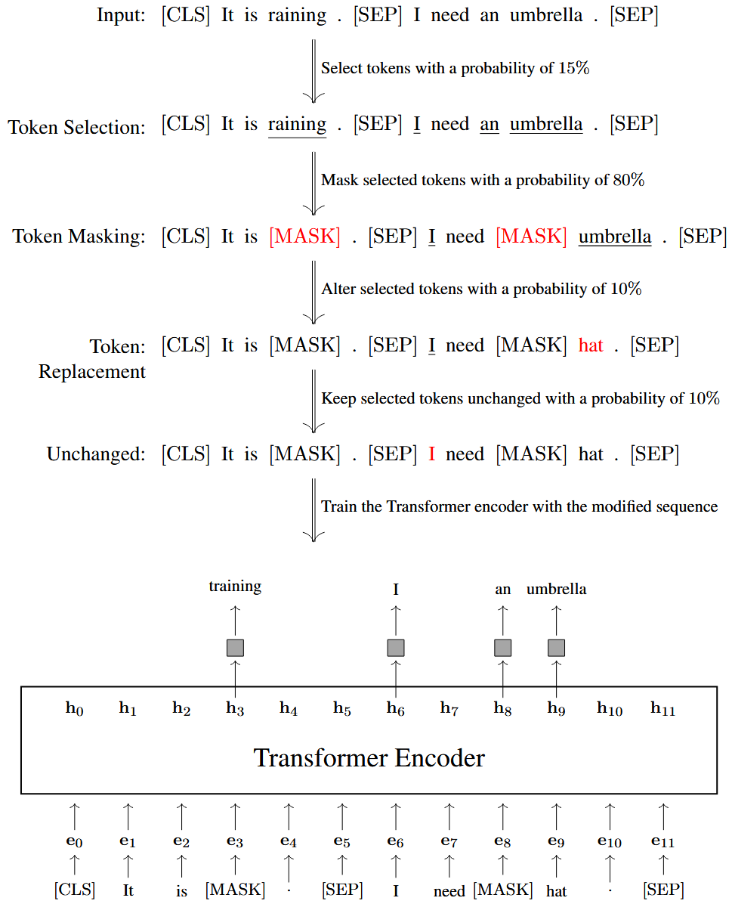
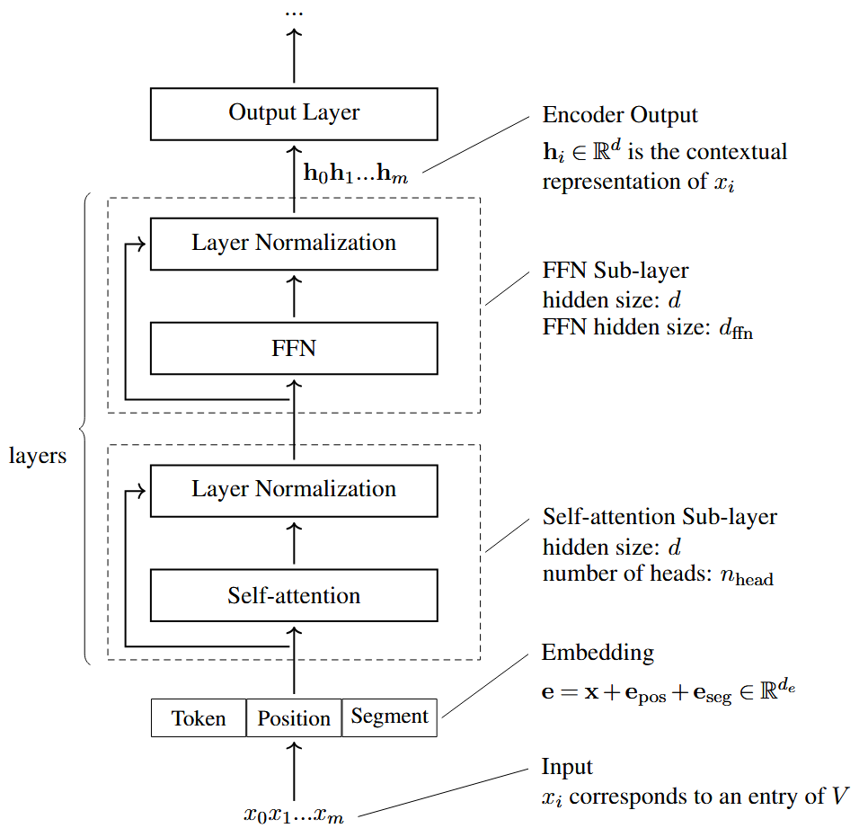
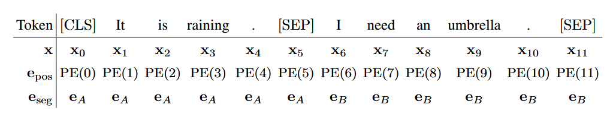
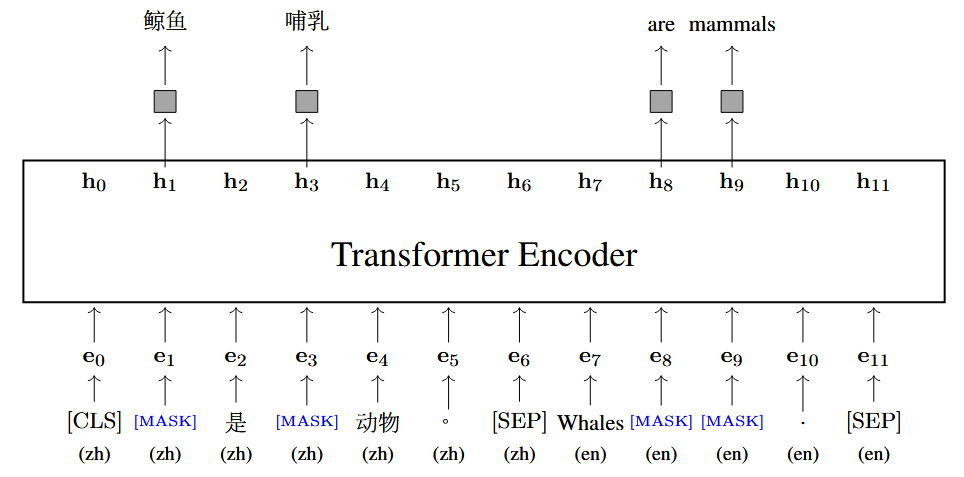
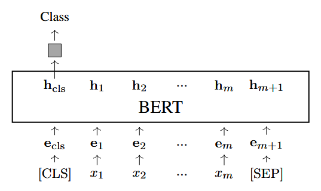
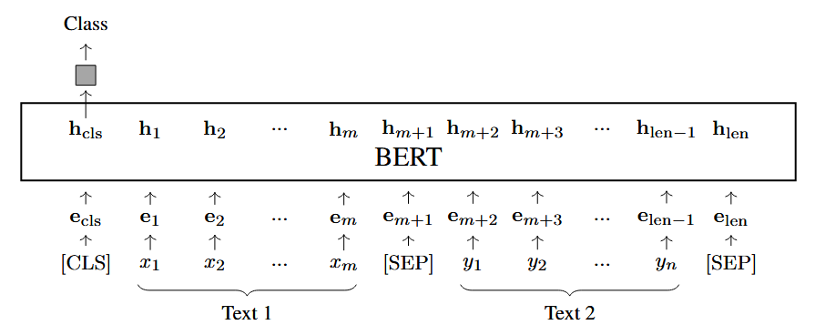
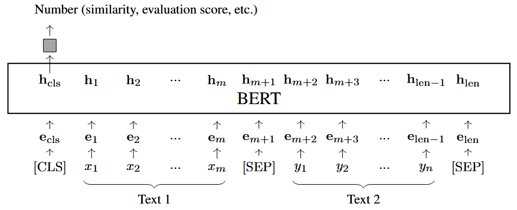
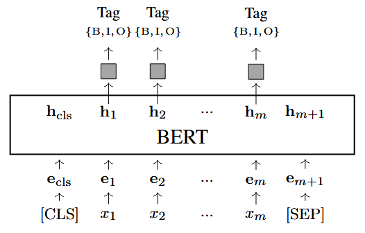
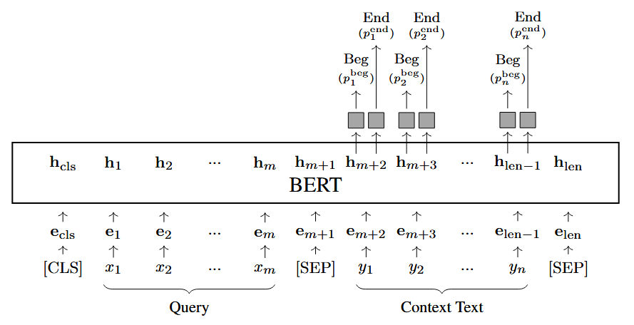
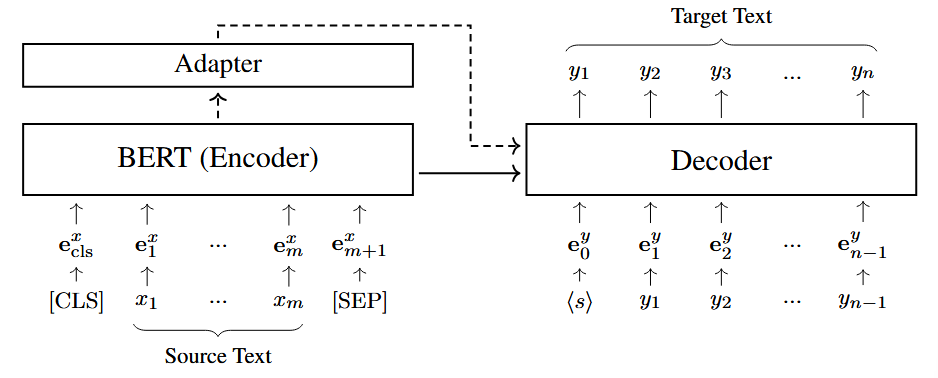

## 1 The Standard Model
标准的 BERT 模型是一个双向 `Transformer encoder`，通过两个自监督任务进行训练：掩码语言模型和下一句预测。整体的训练损失是这两个任务损失的和：

$$
\ce{Loss}_{\ce{BERT}}=\ce{Loss}_{\ce{mlm}}+\ce{Loss}_{\ce{nsp}} \tag{1}
$$

与标准的深度学习相同，我们通过最小化这个损失来优化模型参数。从文本语料库中抽取小批量样本，逐批计算 `BERT` 损失值，并借助梯度下降算法或其变体迭代更新模型参数。该过程持续循环，直至满足停止条件，例如训练损失收敛，或是迭代步数达到预设上限。

### 1.1 Loss Functions

`BERT` 模型通常用来表示单个句子或一对句子，这里我们假设输入表示是一个含有两个句子 $\ce{Sent}_A$ 和 $\ce{Sent}_B$ 的序列：

$$
\ce{[CLS]} \ \ce{Sent}_A \ \ce{[SEP]} \ \ce{Sent}_B \ \ce{[SEP]}
$$

其中 `[SEP]` 是分隔符。

我们通过这个序列来分别得到 $\ce{Loss}_{\ce{mlm}}$ 和 $\ce{Loss}_{\ce{nsp}}$。对掩码语言模型来说，`token` 的一个子集 (通常为 $15\%$) 会被随机选择用于预测，之后通过三种方式对序列进行修改：
- `token` 掩码：$80\%$ 选择的 `token` 会被掩码，用 `[MASK]` 进行替换
- 随机替换：$10\%$ 选择的 `token` 会随机替换成另一个 `token`
- 不改变：$10\%$ 选择的 `token` 不进行任何改变

我们令 $\mathcal A(\mathbf x)$ 表示 `token` 序列 $\mathbf x$ 中被选中的位置集合，$\mathbf{\bar{x}}$ 表示 $\mathbf x$ 经过处理后的序列。`MLM` 的损失函数如下：

$$
\ce{Loss}_{\ce{mlm}} = -\sum_{i \in \mathcal{A}(\mathbf{x})} \log \ce{Pr}_i(x_i \mid \bar{\mathbf{x}}) \tag{2}
$$

式中的 $\log \ce{Pr}_i(x_i \mid \bar{\mathbf{x}})$ 是给定 $\bar{\mathbf{x}}$ 时，模型预测位置 $i$ 处的原始 `token` 为 $x_i$ 的概率。计算流程如<b>图 1 </b>所示：

对于下一句预测，每个训练样本会从集合 $\{\ce{IsNext,NotNext}\}$ 中分配一个标签：

$$
\begin{align*}
\ce{Sequence}: \ \ \ \ &\ce{[CLS] It is raining}. \ \ce{[SEP] I need an umbrella}. \ce{[SEP]}\\
\ce{Label}: \ \ \ \  &\ce{IsNext} \\ \\
\ce{Sequence}: \ \ \ \ &\ce{[CLS] The cat sleeps on the windowsill}. \ \ce{[SEP] Apples grow on trees}. \ce{[SEP]} \\
\ce{Label}: \ \ \ \  &\ce{NotNext}
\end{align*}
$$

`encoder` 的输出中，首个 `token` `[CLS]` 对应的向量被视作整个序列的表示，记为 $\mathbf h_{\text{cls}}$（或 $\mathbf h_0$）。在 $\mathbf h_{\text{cls}}$ 之上搭建分类器，即可计算给定 $\mathbf h_{\text{cls}}$ 时标签 $c$ 的概率，即 $\Pr(c \mid \mathbf h_{\text{cls}})$。分类任务可选用多种损失函数，例如在最大似然训练中，我们可将 $\text{Loss}_{\text{nsp}}$ 定义为：

$$
\text{Loss}_{\text{nsp}} = -\log \Pr(c_{\text{gold}} \mid \mathbf h_{\text{cls}}) \tag{3}
$$

$c_{\text{gold}}$ 是这个样本的正确标签。

### 1.2 Model Setup

如<b>图 2 </b>所示，`BERT` 模型基于标准 `Transformer` 的 `encoder`，该模型的输入是词嵌入的序列，其中每个元素是 `token` 嵌入，位置嵌入和段嵌入的和：

$$
\mathbf e = \mathbf x + \mathbf e_{\ce{pos}} + \mathbf e_{\ce{seg}} \tag{4}
$$

`token` 的嵌入和位置嵌入均与原始的 `Transformer` 相同，段嵌入是一个新的加和项用于指示一个 `token` 属于 $\ce{Sent}_A$ 还是 $\ce{Sent}_B$:

`BERT` 模型的主要部分是一个多层 `Transformer` 网络。一个 `Transformer` 层包含一个自注意力子层和一个 `FFN` 子层。所有子层都是 `post-LN` 结构：$\ce{output}=\ce{LNorm}(F(\ce{input})+\ce{input})$，其中 $F(\cdot)$ 是子层的函数，$\ce{LNorm}(\cdot)$ 是层归一化单元。对于序列中的每一个位置，最终输出表征均由最顶层网络生成的实向量表示。

在构建 `BERT` 模型时，可从多个维度进行考量：
- **词表大小（$|V|$）**：在 `Transformer` 架构中，每个 `token` 都对应词表 $V$ 中的一个条目。更大的词表能够覆盖更多单词的表层形态变体，但也会带来存储开销的增加。
- **嵌入维度（$d_e$）**：每个 `token` 都会被表示为 $d_e$ 维实向量。该向量由 `token` 嵌入、位置嵌入与段嵌入相加得到，且这三类嵌入均为 $d_e$ 维实向量。
- **隐藏层维度（$d$）**：子层的输入与输出均为 $d$ 维向量，同时子层中的大部分隐状态也都是 $d$ 维向量。通常可将 $d$ 近似看作网络的宽度。
- **注意力头数（$n_{\text{head}}$）**：自注意力子层中，需要指定多头自注意力的头数量。更多的注意力头能让模型同时关注更多表征子空间的信息。在实际应用中，通常设置 $n_{\text{head}} \ge4$。
- **FFN 隐藏层维度（$d_{\text{ffn}}$）**：`Transformer` 中 `FFN` 的隐藏层维度通常大于 $d$。常见配置为 $d_{\text{ffn}}=4d$。
- **模型深度（$L$）**：加深网络层数是提升 `Transformer` 表达能力的有效方式。`BERT` 模型的层数通常设为 $12$ 层或 $24$ 层，采用更深的网络同样可行，还能进一步提升模型效果。

`BERT` 的两个常用配置是 $\ce{BERT}_{\ce{base}}$ 和 $\ce{BERT}_{\ce{large}}$：
- $\ce{BERT}_{\ce{base}}:d=768,L=12,n_{\ce{head}}=12$，总参数量 $=111\ce{M}$
- $\ce{BERT}_{\ce{large}}:d=1,024,L=24,n_{\ce{head}}=16$，总参数量 $=340\ce{M}$

`BERT` 模型的训练遵循 `Transformer` 的标准流程。训练 $\ce{BERT}_{\ce{large}}$ 这类更大的模型，需要投入更多算力与时间。这是预训练过程中的普遍问题，当训练数据体量极大时尤为突出。实际应用中，训练效率往往是重点考量因素。一种常用方案是：先使用较短序列完成大量迭代训练，再切换为完整长度的序列完成剩余迭代。

## 2 More Training and Larger Models

`BERT` 是自然语言处理领域的里程碑，也催生了大量后续研究。其中一个研究方向是扩大预训练规模，主要包含两种思路：扩充训练数据量、增加模型参数量。

`RoBERTa` 是标准 `BERT` 模型的扩展，它提出了两大核心改进：第一，仅通过增加训练数据与计算资源，无需改动模型架构，就能显著提升 `BERT` 性能；第二，移除下一句预测损失后，只要训练规模足够大，下游任务性能不会下降。这些发现指明了预训练的一个重要方向：通过在简单预训练任务上持续扩大训练规模，可不断提升模型效果。

优化 `BERT` 模型的第二种思路是增加模型参数量。但扩大 `BERT` 及其他预训练模型的规模会带来新的训练难题：超大模型训练往往稳定性差、难以收敛。这使得相关工作变得更为复杂。

## 3 More Efficient Models

`BERT` 在问世时已属于规模较大的模型。模型体量增大会带来更高的内存占用与更慢的推理速度。研发轻量化、高推理速度的 `BERT` 模型，是构建高效 `Transformer` 架构的重要方向。接下来介绍几种 `BERT` 的高效变体模型。

打造高效 `BERT` 模型有多个主流研究方向。首先是知识蒸馏：利用训练完备的教师模型输出结果来训练学生模型，可从大模型中迁移知识，进而得到结构更精简的模型。由于 `BERT` 是包含多种层结构的多层网络，知识蒸馏可作用于不同表征层级。如今，知识蒸馏已成为训练小型预训练模型最常用的技术之一。

其次，传统模型压缩方法可直接应用于 `BERT`。常用方式是对 `Transformer encoder` 采用通用剪枝算法，主要包括移除完整网络层或删减网络中一定比例的参数。剪枝同样适用于多头注意力模块，删减部分注意力头不会明显降低 `BERT` 性能，还能加快推理速度。量化是另一种 `BERT` 压缩手段，该方法将参数用低精度数值表示，大幅压缩模型体积。

第三，鉴于 `BERT` 网络层数多、参数量大，还有研究采用动态网络来提升推理效率。该思路的一种实现方式是为 `token` 动态选择处理层：比如深度自适应模型会在最优层级提前退出，跳过后续网络层。此外也可构建长度自适应模型，动态调整输入序列长度，跳过部分不重要的 `token` 以减少计算量，进一步提升整体效率。

第四，还可通过层间参数共享来缩减 `BERT` 模型体积。一种简单做法是让堆叠的 `Transformer` 层共用同一套参数。该方式不仅能减少参数量，还可在多层 `Transformer` 中复用单层结构，有效降低推理时的内存占用。

## 4 Multilingual Models

初代 `BERT` 模型主要针对英文设计，问世后很快被拓展至多语言场景。一种简单思路是为每种语言单独构建模型；而当下大语言模型领域更主流的方式，是直接使用多语种数据训练多语言模型。<b>多语言 BERT (mBERT)</b> 便是基于 $104$ 种语言的文本训练得到。它与单语言 `BERT` 的核心区别在于采用更大的词表以容纳多语种 `token`，将不同语言的 `token` 表征映射至同一向量空间，从而实现跨语言知识共享。

多语言预训练模型最重要的应用之一是跨语言迁移学习。在零样本跨语言场景中，模型利用源语言数据完成任务微调后，无需目标语言训练数据，便可直接应用于目标语言的同一项任务。

针对 `mBERT` 这类多语言预训练模型，一种优化方向是在预训练阶段引入双语数据。区别于仅使用各语种单语数据训练，双语训练会显式建模两种语言 `token` 间的关联，让模型具备跨语言迁移能力，更易适配不同语种。 `Lample` 与 `Conneau` 提出了<b>跨语言语言模型（XLMs）</b>的预训练方法，该模型可采用因果语言建模或掩码语言建模进行训练。其中掩码语言建模将模型作为 `encoder`，训练目标与 `BERT` 一致。若预训练融入双语数据，每次会采样一组对齐句对，再将两句拼接为单个序列用于训练，例如英中双语句对:

$$
鲸鱼\ 是\ 哺乳\ 动物\ 。\leftrightarrow \ce{Whales are mammals}.
$$

我们将它们打包成一个序列：

$$
\ce{[CLS]}\  鲸鱼\ 是\ 哺乳\ 动物\ 。\ce{[SEP]} \ \ce{Whales are mammals}.\ \ce{[SEP]}
$$

接下来选择特定百分比的 `token` 替换为 `[MASK]`:

$$
\ce{[CLS]}\  \ce{[MASK]}\ 是\ \ce{[MASK]}\ 动物\ 。\ce{[SEP]} \ \ce{Whales [MASK] [MASK]}.\ \ce{[SEP]}
$$

预训练的目标是基于上述拼接序列，最大化所有掩码 `token` 的联合概率。通过这种训练方式，模型既能学习英、汉两种语言的序列表征，也能捕捉两种语言 `token` 间的对应关系。对齐两种语言的表征，本质上让模型具备了翻译能力，因此该训练目标也被称作翻译语言建模。<b>图 3 </b>为该方法的示意图。

多语言预训练模型的一大优势是天然具备处理语码转换的能力。在 NLP 与语言学领域，语码转换指文本中出现多种语言交替使用的现象。例如下面这段文本就同时包含中文与英文：

$$
周末\ 我们\ 打算\ 去\ 做\ \ce{hiking}\ ,\ 你\ 想\ 一起\ 来\ 吗 ?
$$

对于多语言预训练模型，无需区分 `token` 属于中文还是英文，所有 `token` 统一归入共享词表。这相当于构建出一种囊括所有待处理语种的“新语言”。

多语言预训练的效果受多重因素影响。在模型架构固定的前提下，需要设定共享词表大小、各语种样本数量及占比、模型规模等参数。但固定容量的模型训练过多语种时，会出现多语言诅咒（也称容量干扰）：语种持续增加会引发参数竞争，反而降低高资源语种的效果。因此在实际应用中，支持语种数量与模型容量之间需要做出权衡。

## 5 Applying BERT Models

当 BERT 模型经过预训练后，在用于下游任务前，还需要经过额外的微调。首先，需要搭建预测模块，将模型输出适配目标任务。设 $\text{BERT}_{\hat{\theta}}(\cdot)$ 为参数 $\hat{\theta}$ 已预训练完成的 `BERT` 模型，$\text{Predict}_{\omega}(\cdot)$ 是参数为 $\omega$ 的预测网络。将预测网络对接 `BERT` 模型的输出，即可构建出用于处理下游任务的完整模型，该模型表达式如下：

$$
\mathbf y = \text{Predict}_{\omega}(\text{BERT}_{\hat{\theta}}(x)) \tag{5}
$$

$\mathbf x$ 是输入，$\mathbf y$ 是任务的输出，对于分类问题来说，模型产生的是标签上的概率分布。

接着我们收集标签样本集合 $\mathcal D$，通过下式对模型进行微调：

$$
(\tilde{\omega}, \tilde{\theta}) = \arg\min_{\omega, \hat{\theta}^+} \sum_{(x, y_{\text{gold}}) \in \mathcal{D}} \text{Loss}(\mathbf y_{\omega, \hat{\theta}^+}, \mathbf y_{\text{gold}}) \tag{6}
$$

其中 $(\mathbf y_{\omega, \hat{\theta}^+}, \mathbf y_{\text{gold}})$ 是输入和相应输出的元组。我们通过最小化训练数据上的损失来优化模型，最终得到优化后的参数 $\tilde{\omega}$ 和 $\tilde{\theta}$。优化过程从预训练参数 $\hat{\theta}$ 开始，$\hat{\theta}^+$ 表示参数通过 $\hat{\theta}$ 进行初始化，用 $\mathbf y_{\omega,\hat{\theta}^+}$ 表示使用参数 $\omega$ 和 $\hat{\theta}^+$ 计算得到的模型输出。

下游任务的形式决定了模型输入和输出的形式，以及预测网络的架构，下面列出了一些适用于 `BERT` 的一些任务：
- **分类**(单条文本)。`BERT` 最常用的应用是文本分类，在这个任务中，`BERT` 模型接受 `token` 序列，编码成一个向量序列。第一个输出向量 $\mathbf h_{\text{cls}}$ 通常被用于整个文本的表示。预测网络将 $\mathbf h_{\text{cls}}$ 作为输入，产生一个标签的分布。假设输入序列是 $\ce{[CLS]}x_1x_2\cdots x_m$，一个文本分类的例子如下图所示：

	

	图中的灰色矩形表示预测网络。许多 `NLP` 问题可以归属于文本分类任务，学界也推出了多项评测预训练模型的文本分类基准。预测网络可以选用深度神经网络、传统分类模型等任意分类结构，整体模型按照标准分类模型的方式训练与微调。实际应用中，预测网络常直接采用 `Softmax` 层，通过最大化正确标签的概率来优化模型参数。

- **分类**(文本对)。分类任务也可对文本对进行。假设我们有两句文本 $x_1 \cdots x_m$ 和 $y_1 \cdots y_m$，将它们拼接起来形成长度为 $\ce{len}$ 的一个序列，接着基于 $\mathbf h_{\text{cls}}$ 对这个组合文本进行预测得到一个标签：

	

	其中 $\ce{len} = n + m + 2$。文本对分类包含多种任务：语义等价判断、文本蕴含判断、基于场景的常识推理以及问答推理。

- **回归**。预测网络也可输出实数值分数，而非标签分布。例如在预测网络中添加 `Sigmoid` 层，模型便能计算两个句子的相似度。该架构与基于 `BERT` 的分类模型基本一致，仅需改动输出层即可。

	

- **序列标注**。序列标注为输入序列里的每一个 `token` 分配标签，再依据标签序列完成语言标注。一个例子是词性标注`（POS）`，即为句子中每个词语标注对应词性；命名实体识别`（NER）`也属于此类任务，通过给词语打上实体标签来识别命名实体。下面是命名实体识别的模型架构：

	

	这里的 $\{\ce{B,I,O}\}$ 是 `NER` 的标签集合，例如 `B-ORG` 表示组织实体的起始位置，`I-ORG` 该词在组织实体中，`O` 则表示该词元不属于任何命名实体。该 `NER` 模型会在每个位置输出标签集合上的概率分布，记为 $\mathbf p_i$。模型的训练或微调可以基于这些分布 $\{\mathbf p_1, \dots, \mathbf p_m\}$ 进行。假设 $p_i(\text{tag}_i)$ 是第 $i$ 个位置对应正确标签的概率，则训练损失可定义为负对数似然：

	$$
	\text{Loss} = -\frac{1}{m}\sum_{i=1}^{m} \log p_i(\text{tag}_i) \tag{7}
	$$

	在训练好的 `NER` 模型中求解最优标签序列，是 `NLP` 领域的经典研究问题。

- **区间预测**。部分 `NLP` 任务需要预测文本中的连续区间，阅读理解就是典型代表。该任务会给出查询语句 $x_1 \cdots x_m$ 与上下文文本 $y_1 \cdots y_n$，目标是从上下文里找出一段连续区间作为答案。该任务可类比序列标注：为每个 `token` $y_j$ 预测标签，标记区间的起始与结束。在 `BERT` 输出层之上增设两个分支网络：一个输出词元 $y_j$ 作为区间起点的概率 $p_j^{\text{beg}}$，另一个输出其作为区间终点的概率 $p_j^{\text{end}}$。对应的模型结构如下所示:

	

	我们将查询和上下文文本打包生成输入序列。预测网络仅作用于上下文文本的输出，在每个位置分别生成起点概率 $p_j^{\text{beg}}$ 和终点概率 $p_j^{\text{end}}$。整体损失为上下文所有位置上，两个预测分支负对数似然的总和：

	$$
	\text{Loss} = -\frac{1}{n}\sum_{j=1}^{m}(\log p_j^\ce{beg} + \log p_j^\ce{end}) \tag{8}
	$$

	在测试时通过下式寻找最优的区间：

	$$
	(\hat{j}_1, \hat{j}_2) = \underset{1 \le j_1 \le j_2 \le n}{\arg\max} \left( \log p_{j_1}^{\text{beg}} + \log p_{j_2}^{\text{end}} \right) \tag{9}
	$$

- **Encoder-Decoder 模型的编码**。所有需要对文本进行编码的场景均可使用 `BERT`。文本生成是其重要拓展方向，包含机器翻译、文本摘要、问答、对话生成等任务，这类任务一般被建模为 `Seq2Seq` 问题：由 `encoder` 对源文本做表征，再通过 `decoder` 生成目标文本。将 `BERT` 用作 `encoder` 是最直接的应用方式：微调前，使用预训练 `BERT` 的参数初始化 `encoder`；随后按常规方式，基于文本对对整套 `encoder-decoder` 模型完成微调。下图为以 `BERT` 作为源端 `encoder` 的神经机器翻译模型架构。

	

	其中 $x_1 \cdots x_m$ 是源端序列，$y_1 \cdots y_n$ 是目标序列，$\mathbf e_1^x \cdots \mathbf e_m^x$ 是序列 $x_1 \cdots x_m$ 的词嵌入，$\mathbf e_1^y \cdots \mathbf e_n^y$ 是 $y_1 \cdots y_n$ 的词嵌入。`adapter` 是可选项，可以将 `BERT` 模型的输出映射成更适配解码器的形式。

微调 `BERT` 是一项复杂的工程工作，效果受微调数据量、模型规模、优化器选择等诸多因素影响。我们通常希望充分微调模型，使其在下游任务上表现优异，但针对特定任务微调 `BERT` 容易引发过拟合，进而削弱模型在其他任务上的泛化能力。实际场景中，缓解灾难性遗忘的常用办法是在微调数据中混入部分旧数据，依靠更多样的样本训练模型。也可采用针对性算法，比如经验回放、弹性权重整合。