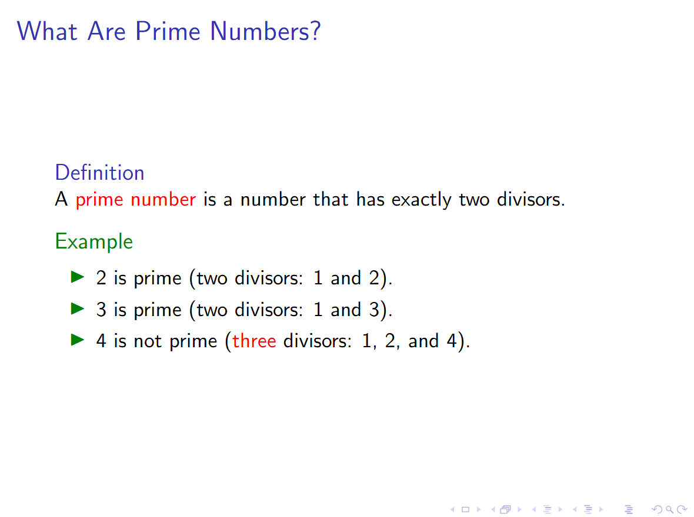
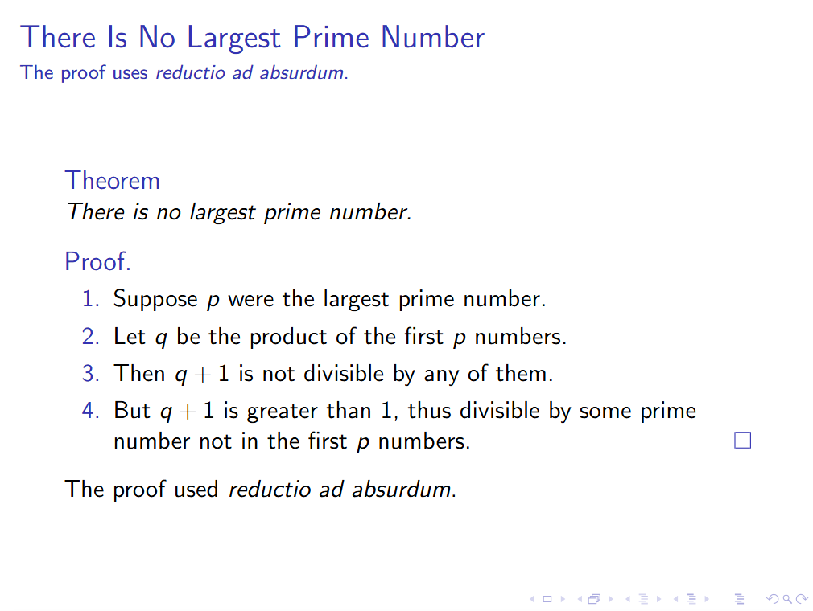
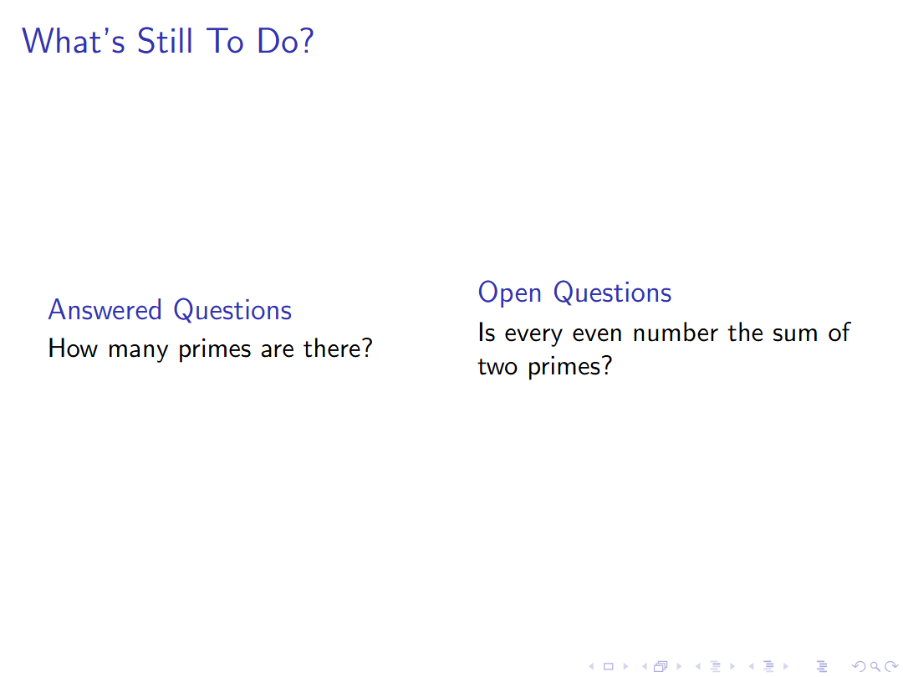
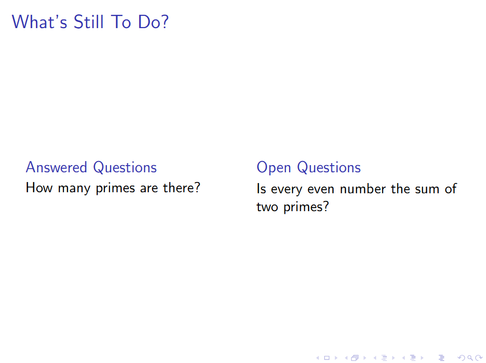
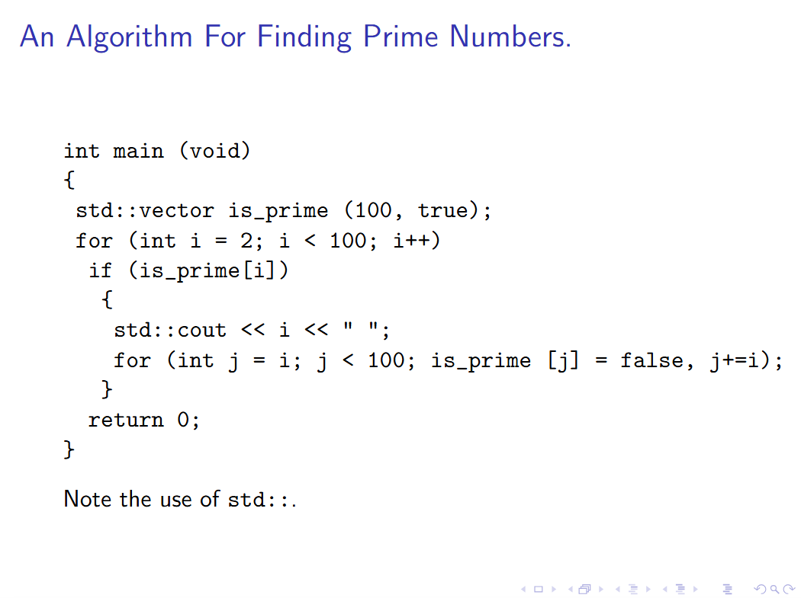
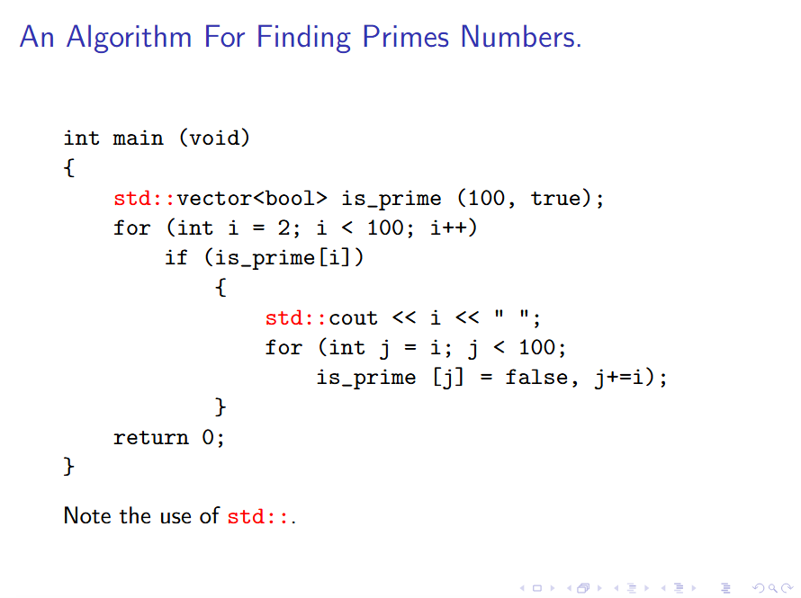

本节介绍 `Beamer` 的一些常用功能，教程来自官方文档:

### 1 问题描述

我们需要协助亚历山大大学的欧几里得教授制作 `ppt`，内容围绕他的最新发现：素数有无穷多个。欧几里得就此撰写的论文已被第 $27$ 届国际素数研讨会录用。他计划使用 `Beamer` 文档类为本次会议制作 `ppt`，会议页面显示，他的报告（含问答环节）总时长为 $20$ 分钟。

### 2 解决方案模板

欧几里得第一件应该做的事是为 `ppt` 寻找一个解决方案模板，他创建了一个 `main.tex` 文件，用编辑器打开后，文件的开头内容是：

```tex
\documentclass{beamer}
\mode<presentation>
```

这行代码他无法理解。鉴于文件中还有不少看不懂的内容，他决定暂且置之不理，默认这些代码都有相应作用。

### 3 标题材料

接下来顺理成章要修改的是 `\title` 标题命令。他将其替换为：

```tex
\title{There Is No Largest Prime Number}
```

这正是他论文的标题。他注意到 `\title` 命令还支持方括号内的可选短标题参数，该参数会在版面空间有限时显示，但他认为当前标题长度适中，无需额外设置。

随后他依次修改作者与日期信息：

```tex
\author{Euclid of Alexandria}
\date[ISPN ’80]{27th International Symposium of Prime Numbers}
```

然后他又补充了邮箱地址，将作者字段修改为：

```tex
\author[Euclid]{Euclid of Alexandria \\ \texttt{euclid@alexandria.edu}}
```

欧几里得发现 `Beamer` 并没有专门的 `\email` 命令，对此稍感不便。他打算等演示文稿制作完成后，再写信向 `Beamer` 开发者建议新增该命令。

文中还有 `\subtitle` 和 `\institute` 两个命令，他虽未曾使用，但能猜出用途并完成设置。文中无需用到 `\and` 与 `\inst`：前者用于分隔多位作者，后者用于将内容设为上标。

### 4 标题页帧

文档中 `\begin{document}` 之后，首个创建帧的部分引起了他的注意：

```tex
\begin{document}: 
\begin{frame} 
	\titlepage 
\end{frame}
```

在 `Beamer` 中，`ppt` 由多个帧组成。单个帧又可包含多张 `slide`（多张时称作 `overlays`）。默认情况下，`\begin{frame}` 与 `\end{frame}` 之间的所有内容都会展示在同一张 `slide` 上，且不会自动分页。因此欧几里得判断，第一个帧用于展示标题页，这一设计十分合理。

### 5 目录

下一帧包含一个目录：

```tex
\begin{frame} 
	\frametitle{Outline} 
	\tableofcontents 
\end{frame}
```

这一帧含有一个独立标题 `Outline`。帧内的注释提示欧几里得可以尝试添加 `[pausesections]` 选项。于是他修改代码如下：

```tex
\begin{frame} 
	\frametitle{Outline} 
	\tableofcontents[pausesections] 
\end{frame}
```

在重新编译后，他发现原本单页的目录页变成了两张 `slide`。第一张仅显示第一个章节，第二张则展示全部两个章节（翻阅文档后，他也确认文中确实用 `\section` 定义了这两个章节）。`pausesections` 的作用是分步展示目录：首先只显示第一个 `section`，每点击或按一次方向键，后续 `section` 会分步出现。

### 6 章节与子章节

欧几里得接下来看到的命令是

```tex
\section{Motivation} 
\subsection{The Basic Problem That We Studied}
```

这些命令是在帧之外定义的。因此欧几里得推断，它们在被调用时不会产生直接的页面效果，只会在目录中生成条目。他觉得设置一个 `Motivation` 章节很合理，但修改了 `\subsection` 的标题。

在查看 `ppt` 时，他发现自己的假设并不完全正确：每个 `\subsection` 命令似乎都会在文稿中插入一个带目录的帧。回头查找后，他找到了导致这一现象的命令：`\AtBeginSubsection`，它会在每个子章节的开头插入一个仅高亮显示当前子章节的目录页。如果欧几里得不喜欢这个效果，只需删除整个 `\AtBeginSubsection` 相关代码，子章节开头的目录页就会消失。

### 7 创建一个简单的帧

欧几里得开始修改下一帧，这一帧是 `ppt` 的第一个正式内容页面：

```tex
\begin{frame} 
	\frametitle{What Are Prime Numbers?} 
	A prime number is a number that has exactly two divisors. 
\end{frame}
```

修改后达到了预期效果。他想对定义的主体（素数）加以强调，先是尝试了 `\emph` 命令，但觉得突出效果不够明显。`Beamer` 还提供了 `\alert` 命令，用法和 `\emph` 一致，默认会将内容显示为亮红色。

接下来，为了让读者更清晰地看出这是一段定义内容，欧几里得使用 `definition` 环境将文本包裹起来:

```tex
\begin{frame} 
	\frametitle{What Are Prime Numbers?} 
	\begin{definition} 
		A \alert{prime number} is a number that has exactly two divisors. 
	\end{definition} 
\end{frame}
```

`Beamer` 中还预定义了其它环境如 `theorem, lemma, proof, example` 等，补充示例内容总能让讲解更易懂，于是欧几里得决定添加一个例子：

```tex
\begin{frame}
	\frametitle{What Are Prime Numbers?}
	\begin{definition}
		A \alert{prime number} is a number that has exactly two divisors.
	\end{definition}
	\begin{example} 
		\begin{itemize} 
		\item 2 is prime (two divisors: 1 and 2). 
		\item 3 is prime (two divisors: 1 and 3). 
		\item 4 is not prime (\alert{three} divisors: 1, 2, and 4). 
		\end{itemize} 
	\end{example}
\end{frame}
```



### 8 创建简单的 overlays

这一帧页面整体效果已经不错，只是色彩略显丰富。欧几里得希望三条内容逐行依次显示，而非一次性全部出现。于是他在第一条和第二条内容后分别添加了 `\pause` 命令。

```tex
\begin{itemize} 
	\item 2 is prime (two divisors: 1 and 2). 
		\pause
	\item 3 is prime (two divisors: 1 and 3). 
		\pause
	\item 4 is not prime (\alert{three} divisors: 1, 2, and 4). 
\end{itemize} 
```

采用逐行显示的方式，他希望能将观众的注意力集中在当下讲解的内容上。但转念一想，他又删掉了所有 `\pause` 命令，因为这类简单内容使用分步显示反倒多此一举。欧几里得也意识到，优秀的 `ppt` 只会在特定场景下使用这种分步展示效果。

### 9 使用 overlay 规范

下一帧用于展示核心论证内容，被放在结论章节下。欧几里得想为这一帧设置更复杂的分步显示效果：页面包含四条有序列表，他希望逐条展示前三项，而第四条和第一条同时出现。这种设计是为了演示反证法这一证明思路：先提出错误假设，再通过若干中间推导，最终推出矛盾。为此，他使用了 `overlay` 规范来实现该效果:

```tex
\begin{frame}
	\frametitle{There Is No Largest Prime Number}
	\framesubtitle{The proof uses \textit{reductio ad absurdum}.}
	
	\begin{theorem}
		There is no largest prime number.
	\end{theorem}
	\begin{proof}
		\begin{enumerate}
		\item<1-> Suppose $p$ were the largest prime number. 
		\item<2-> Let $q$ be the product of the first $p$ numbers. 
		\item<3-> Then $q + 1$ is not divisible by any of them. 
		\item<1-> But $q + 1$ is greater than $1$, thus divisible by some prime number not in the first $p$ numbers.\qedhere
		\end{enumerate} 
	\end{proof}
	\uncover<4->{The proof used \textit{reductio ad absurdum}.}
\end{frame}
```

`overlay` 规范写在尖括号内。`<1->` 表示从第 $1$ 屏开始一直显示。因此，列表第一项和第四项会在本帧的第 $1$ 屏就出现，另外两项则暂时隐藏；第二项从第 $2$ 屏起才会显示。`Beamer` 会自动计算每一帧需要拆分出多少个页面。拓展来说，`overlay` 规范可以由单个数字、数字区间组合而成，区间的起点或终点也可以省略。例如 `-3,5-6,8-` 的含义是：除第 $4,7$ 屏外，其余所有页面均显示。

`\qedhere` 用于将证毕符号 □ 放置在有序列表的行尾。默认情况下，证毕符号会自动出现在 `proof` 环境的末尾，但若直接使用，符号会孤零零落在空行上，观感不佳。



并非只有 `\item` 命令可以搭 `overlay` 规范，`\uncover` 也是常用指令。它仅在 `overlay` 指定的页面中显示内容，其余页面里内容会被隐藏，但仍然占据原有排版空间:

```tex
\only<4->{The proof used \textit{reductio ad absurdum}.}
```

还有一个用法相近的 `\only` 命令，在未指定的页面上，`\only` 会直接移除对应内容，且内容不占用任何版面空间。这会导致不同页面的文本高度不一致；如果页面是垂直居中排版，文字就会出现上下晃动的情况，这种场景下建议使用 `\uncover`。但如果你确实需要让内容完全消失，`\only` 就很适用。

此外还有一种解决办法：给文档类加全局选项 `[t]`，让所有帧的内容顶部对齐，如此一来文本高度不同也不会出现晃动。也可以单独为某一帧设置顶部对齐，只需在 `frame` 环境后添加可选参数 `[t]`。

```tex
\begin{frame}[t]
	\frametitle{There Is No Largest Prime Number}
	...
\end{frame}
```

事实上，包括前文出现的 `theorem` 环境和 `proof` 环境在内，部分环境同样支持 `overlay` 规范。添加该指令后，整个定理或证明内容就只会在指定页面中显示。

### 10 帧的结构划分

在下一帧中，欧几里得想要对比素数领域里已解决问题与未解难题。由于 `Beamer` 没有类似 `theorem` 的专属 “已解决问题” 环境，他选择使用 `block` 环境，该环境可以自定义标题:

```tex
\begin{frame} 
	\frametitle{What’s Still To Do?} 
	\begin{block}{Answered Questions} 
		How many primes are there? 
	\end{block} 
	\begin{block}{Open Questions} 
		Is every even number the sum of two primes? 
	\end{block} 
\end{frame}
```

他也可以在导言区添加以下代码，自定义一个和 `theorem` 风格一致的专属环境。

```tex
\newtheorem{answeredquestions}[theorem]{Answered Questions}
\newtheorem{openquestions}[theorem]{Open Questions}
```

可选参数 `[theorem]` 能让新定义的环境，沿用与 `theorem` 环境完全一致的编号规则。由于幻灯片里本就不会展示这类编号，加不加这个参数实际影响不大，但这是规范的书写习惯，说不定后续使用时还会用到编号功能。

一个可选方案是嵌套的 `itemize`：

```tex
\begin{frame}
	\frametitle{What’s Still To Do?}
	\begin{itemize}
	\item Answered Questions
		\begin{itemize}
		\item How many primes are there?
		\end{itemize}
	\item Open Questions
		\begin{itemize}
		\item Is every even number the sum of two primes?
		\end{itemize}
	\end{itemize}
\end{frame}
```

进一步思考后，欧几里得打算把已解答问题放在左侧、未解问题放在右侧，以此形成更鲜明的视觉对比。他使用 `columns` 环境 实现该效果，在这个环境中，通过 `\column` 命令来划分不同栏目。

```tex
\begin{frame} 
	\frametitle{What’s Still To Do?} 
	\begin{columns} 
		\column{.5\textwidth} 
			\begin{block}{Answered Questions} 
				How many primes are there? 
			\end{block}

		\column{.5\textwidth} 
			\begin{block}{Open Questions} 
				Is every even number the sum of two primes?
			\end{block} 
	\end{columns} 
\end{frame}
```



尝试分栏后，效果不尽如人意：左右两个区块的高度不一致。他希望让区块顶部对齐，于是给 `columns` 环境添加了 `[t]` 选项。欧几里得还发现一个实用技巧：在左栏末尾添加 `\pause`，就能让右栏内容在本帧第二屏才显示，实现分栏内容分步展示。



### 11 添加参考文献

欧几里得打算在未解问题列表中插入一条引用，将这个问题归功于他的老友克里斯蒂安。他留意到代码里出现了 `<presentation>` 这类 `overlay` 规范，虽然觉得有些陌生，但看起来不会影响正常使用，想必也有对应的实际作用。最终他的参考文献代码如下：

```tex
\begin{thebibliography}{10} 
\bibitem{Goldbach1742}[Goldbach, 1742] 
	Christian Goldbach. 
	\newblock A problem we should try to solve before the ISPN ’43 deadline, 
	\newblock \emph{Letter to Leonhard Euler}, 1742. 
\end{thebibliography}
```

随后他就可以在正文里插入引用标注了：

```tex
\begin{block}{Open Questions} 
	Is every even number the sum of two primes? 
	\cite{Goldbach1742} 
\end{block}
```

### 12 原样文本

在另一帧中，欧几里得想要展示好友埃拉托斯特尼分享的一段算法代码。他平时会用 `verbatim` 环境，或是 `lstlisting` 这类代码排版环境来罗列代码。在 `Beamer` 中也可以使用它们，但必须给 `frame` 环境加上 `fragile` 选项:

```tex
\begin{frame}[fragile] 
\frametitle{An Algorithm For Finding Prime Numbers.} 

\begin{verbatim} 
int main (void) 
{ 
	std::vector is_prime (100, true); 
	for (int i = 2; i < 100; i++) 
		if (is_prime[i]) 
			{ 
				std::cout << i << " "; 
				for (int j = i; j < 100; is_prime [j] = false, j+=i); 
			} 
		return 0; 
} 
\end{verbatim} 

	\begin{uncoverenv}<2> 
		Note the use of \verb|std::|. 
	\end{uncoverenv} 
\end{frame}
```



转念一想，欧几里得希望分步展示算法代码，同时对部分代码行/代码片段进行高亮强调。虽然可以借助 `alltt` 宏包实现该需求，但对于简单场景，`Beamer` 自带的 `semiverbatim` 环境会更加便捷。它的表现和 `verbatim` 基本一致，区别在于：反斜杠 \、大括号 { } 仍保留命令功能。接下来欧几里得用这个环境重新排版算法代码：

```tex
\begin{frame}[fragile]
\frametitle{An Algorithm For Finding Primes Numbers.}

\begin{semiverbatim}
% \alert<0> 表示始终禁止高亮
% \uncover<1-> \alert<1> 表示 1 屏起显示，1 屏开始高亮
\uncover<1->{\alert<0>{int main (void)}}
\uncover<1->{\alert<0>{\{}}
\uncover<1->{\alert<1>{    \alert<4>{std::}vector<bool> is_prime (100, true);}}
\uncover<1->{\alert<1>{    for (int i = 2; i < 100; i++)}}
\uncover<2->{\alert<2>{        if (is_prime[i])}}
\uncover<2->{\alert<0>{            \{}}
\uncover<3->{\alert<3>{                \alert<4>{std::}cout << i << " ";}}
\uncover<3->{\alert<3>{                for (int j = i; j < 100;}}
\uncover<3->{\alert<3>{                    is_prime [j] = false, j+=i);}}
\uncover<2->{\alert<0>{            \}}}
\uncover<1->{\alert<0>{    return 0;}}
\uncover<1->{\alert<0>{\}}}
\end{semiverbatim}

	\visible<4->{Note the use of \alert{\texttt{std::}}.}
\end{frame}
```

`\visible` 命令的作用和 `\uncover` 几乎一致，但二者存在一处关键区别：如果提前使用 `\setbeamercovered{transparent}` 指令，将被隐藏内容设置为半透明效果，此时未指定页面上的 `\uncover` 内容会变为半透明。



### 13 改变主题

整套演示文稿的内容已经定稿，欧几里得开始整体审阅排版与视觉效果。他回到文档开头，看到了这一行代码：

```tex
\usetheme{Warsaw}
```

更换不同城市名称对应的主题后，演示文稿的整体外观就会随之改变。欧几里得发现，这些以城市命名的主题大多和理论计算机科学相关的学术会议、研讨会渊源颇深，也常有同一位学者发表报告、参会或主讲分享。他最终选定了 `Frankfurt` 主题，但觉得该主题明暗对比过于强烈，于是补充了相关设置进行调整:

```tex
\usecolortheme{seahorse}
\usecolortheme{rose}
```

欧几里得认为页面标题所用字体风格不够复古典雅（在亚历山大城，古典字体正是当下流行的风格），于是添加代码更换字体:

```tex
\usefonttheme[onlylarge]{structuresmallcapsserif}
```

欧几里得发现导航栏里的小字字体偏纤细，阅读起来有些吃力，添加下面这段代码就能优化显示效果:

```tex
\usefonttheme[onlysmall]{structurebold}
```

欧几里得希望演讲文稿尽善尽美，他打算将标题字体单独设置为衬线斜体。仅修改标题字体，可使用以下命令实现：

```tex
\setbeamerfont{title}{shape=\itshape,family=\rmfamily}
```

他发现标题字体字号依旧偏大，但疑惑自己并未单独设置字号，为何会出现这种情况。原因：`\setbeamerfont` 指令会叠加生效，此前字体主题已经默认把标题字号设为 `\large`。使用带星号的 `\setbeamerfont*` 可以重置字体样式，清空之前的所有设置。之后他还打算把标题改为亮眼的红色，并混入少许黑色调柔和色彩，对应的设置命令如下：

```tex
\setbeamercolor{title}{fg=red!80!black}
```

终于，欧几里得对这份演示文稿十分满意，并在会议上完成了一场精彩的分享，还结识了不少新朋友。