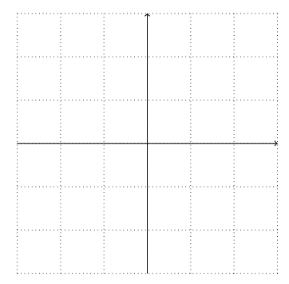
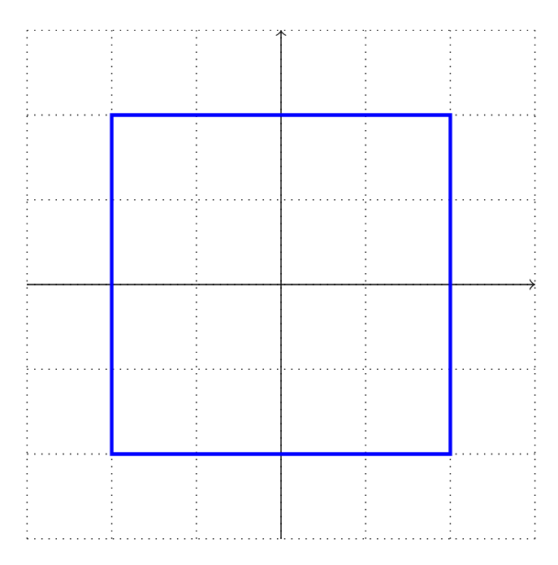
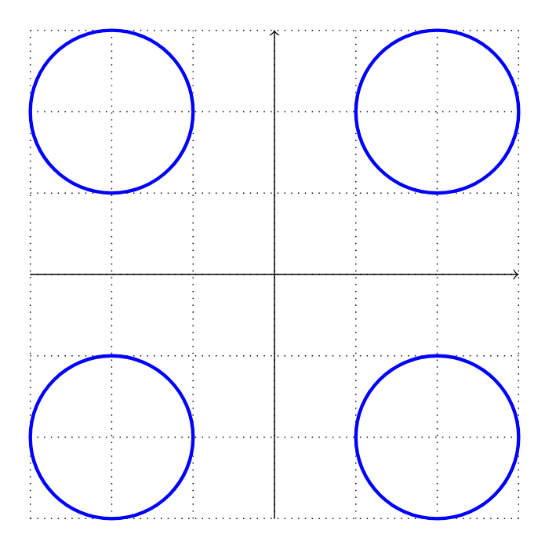
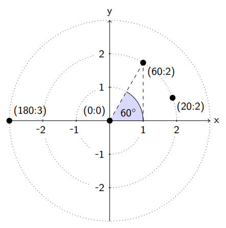
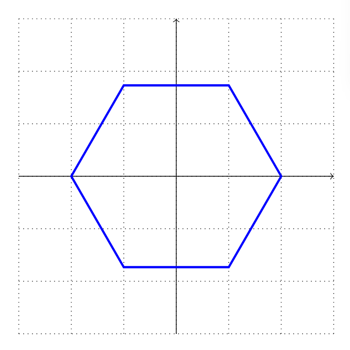
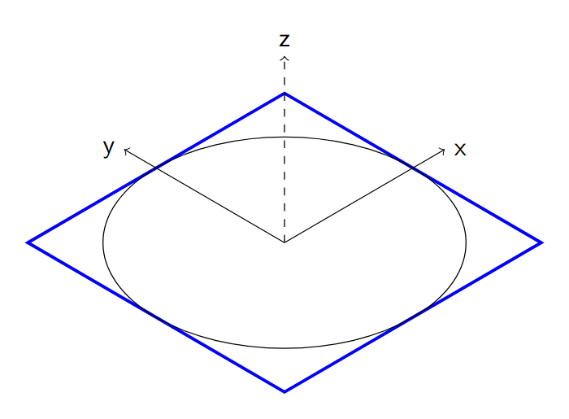
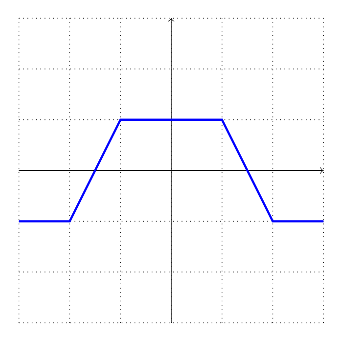
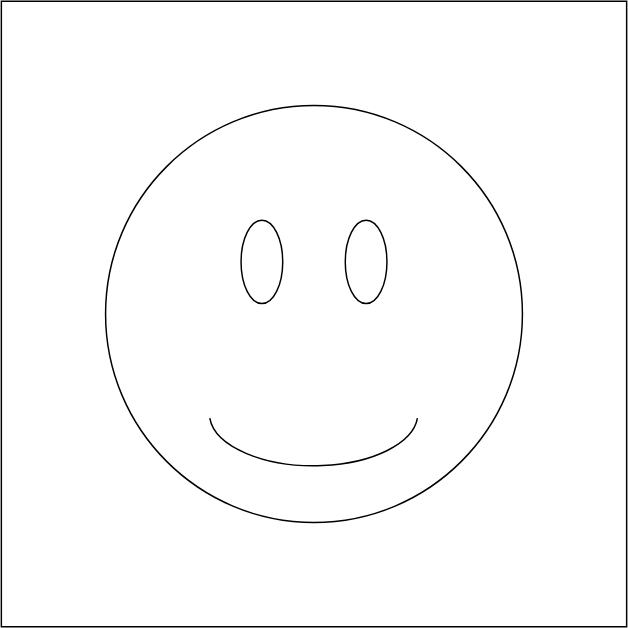
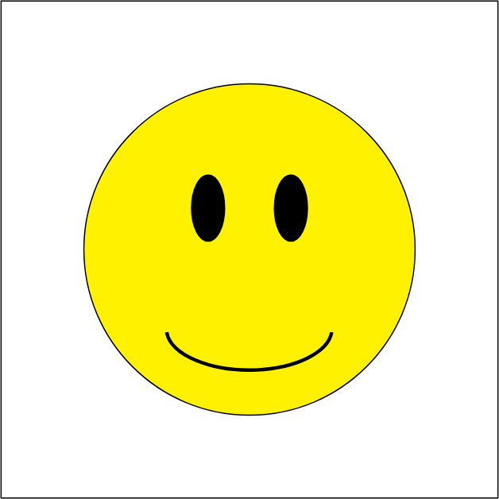
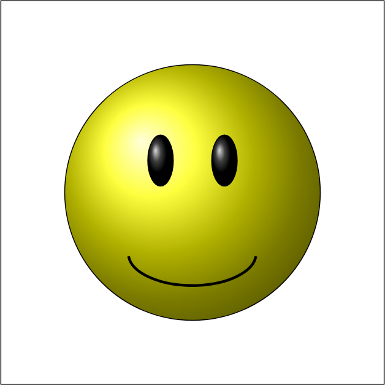

本节开始我们来学习如何在 $\LaTeX$ 中通过 `TikZ` 包来绘图，所参考的教材是 `Packt` 出版的《<i>LATEX Graphics with TikZ</i>》。

## 使用 tikzpicture 环境

在绘制我们的第一幅 `TikZ` 图像前，首先绘制一个带有点线的坐标系，这样可以帮助我们后续定位图像。在绘制完成后再将坐标系去掉。

```tex
% 通过 standalone 生成单张绘图的文档，并会根据实际内容裁剪 PDF 页面，不会出现 a4 纸边距过大的问题
% border=10pt 给图像加上 10pt 的边距
% tikz 和 border 都是 standalone 环境的参数，这样就不需要再使用 \usepackage{tikz}
\documentclass[tikz,border=10pt]{standalone}

\begin{document}
\begin{tikzpicture}

% 添加参数 thin,dotted 规定绘图需要的线条
% 起点在 (-3,-3)，终点在 (3,3)
% grid 是矩形元素，左下角为起点，右上角为终点
\draw[thin,dotted] (-3,-3) grid (3,3);

% \draw 用于生成一条带有坐标和图形元素的路径，该命令会持续生效，直至以分号 `;` 结束
% \draw[<style>] <coordinate> <picture element> <coordinate> ...;
% 默认的坐标间距是 1，可以添加 step=n 来调整
\draw[->] (-3,0) -- (3,0);
\draw[->] (0,-3) -- (0,3);
\end{tikzpicture}
\end{document}
```



## 使用坐标系

### 在笛卡尔坐标系中绘图

我们在坐标中间绘制元素，`--` 代表直线，下述命令在 `(2,-2)` 和 `(2,2)` 间绘制一条直线：

```tex
\draw (2,-2) -- (2,2);
```

可以再加入更多的线来绘制一个正方形：

```tex  
% circle 将 path 闭合，让最后一段线段返回起点
\draw[very thick, blue] (-2,-2) -- (-2,2) -- (2,2) -- (2,-2) -- cycle; 
```



也可绘制圆：

```tex

% circle 前是圆心，circle 后是半径
\draw[very thick, blue] (-2,-2) circle (1) (-2,2)   circle (1) (2,2) circle (1) (2,-2) circle (1);
```



### 在极坐标系中绘图

在极坐标系中，我们通过到原点的距离和与 $x$ 轴的夹角来定义一个点：



如图，我们在坐标 `(60:2)` 处有一个点，它与原点的距离是 $2$，与 $x$ 轴成 $60^\circ$ 角。`TikZ` 通过 `:` 来分辨极坐标，也就是 `(angle:distance)`。

定义了极坐标后，我们绘制一个正六边形就简单了：

```tex
\draw[very thick, blue] (0:2) -- (60:2) -- (120:2) -- (180:2) --(240:2) -- (300:2) -- cycle;
```



### 绘制三维坐标

如果我们想要绘制立方体、正方形或空间图形，可以在绘图平面上使用投影。其中最常用的是<font color="#ff0080"><b>等轴测投影 (<i>isometric projection</i>)</b></font>。下面给出一个完整的例子：

```tex
\documentclass[tikz,border=10pt]{standalone}
\begin{document}
% 设置无衬线字体
\sffamily

% 规定向右 0.86cm，向上 0.5cm 对应 x 轴上一个单位, y, z 轴同理
\begin{tikzpicture}[x={(0.86cm,0.5cm)}, y={(-0.86cm,0.5cm)}, z={(0cm,1cm)}]


\draw[very thick, blue] (-2,-2,0) -- (-2,2,0) -- (2,2,0) -- (2,-2,0) -- cycle;

% 坐标轴
% 坐标轴文字是一个 node，right 参数表示放在元素右边
\draw[->] (0,0,0) -- (2.5,0,0) node [right] {x}; 
\draw[->] (0,0,0) -- (0,2.5,0) node [left] {y};
\draw[->,dashed] (0,0,0) -- (0,0,2.5) node [above] {z};

% 左面没坐标，则圆心是当前点即原点
\draw circle (2); 
\end{tikzpicture} 
\end{document}
```



### 使用相对坐标

我们可以使用 `+ (4,2)` 来表示坐标在 $x$ 轴前进 $4$ 个单位，在 $y$ 轴上前进 $2$ 个单位。通过下面的代码来绘制<font color="#034ea9"><b> 图 7</b></font>：

```tex
\draw[very thick, blue] (-3,-1) -- +(1,0) -- +(2,2) -- +(4,2) -- +(5,0) -- +(6,0);
```



可以看出，所有的坐标都是相对于最开始的那个点的。幸运的是，`TikZ` 提供了另一种语法，通过 `++` 将相对坐标的参考坐标改为上一个坐标:

```tex
\draw[very thick, blue] (-3,-1) -- ++(1,0) -- ++(1,2) -- ++(2,0) -- ++(1,-2) -- ++(1,0);
```

## 绘制几何图形

在进阶到高级绘图前，首先对基础绘图规则做一个精简总结：
- **直线**：`-- (x,y)` 从当前坐标画一条线到 `(x,y)`
- **矩形**：`rectangle (x,y)` 绘制一个矩形，当前坐标为一个角，对角是 `(x,y)`
- **网格**：与 `rectangle` 类似，只是内部填充了线条
- **圆**：`circle (r)` 也可写作 `circle[radius=r]`
- **椭圆**：`ellipse [x radius = rx, y radius = ry]` 绘制一个水平半径为 `rx`，垂直半径为 `ry` 的椭圆，简写为 `ellipse (rx and ry)`
- **弧**：`arc[start angle=a, end angle=b, radius=r]` 以当前点为圆心、半径为 $r$，从角度 $a$ 画至角度 $b$。其简写形式为 `arc(a:b:r)`；<br>`arc[start angle=a, end angle=b, x radius=rx, y radius=ry]` 用于绘制一段椭圆弧：以当前点为中心，横轴半径为 `rx`、纵轴半径为 `ry`，从角度 `a` 画至角度 `b`。对应的简写语法为 `arc(a:b:rx and ry)`

下面来画一个笑脸图像：

```tex
\draw (0,0) circle [radius=2];
\draw (-0.5,0.5,0) ellipse [x radius=0.2, y radius=0.4];
\draw (0.5,0.5) ellipse [x radius=0.2, y radius=0.4];
\draw (-1,-1) arc [start angle=185, end angle=355, x radius=1, y radius=0.5];
\draw (-3,-3) rectangle (3,3);
```



## 填充颜色

我们可以通过 `fill=` 来填充颜色：

```tex
\draw[fill=yellow] (0,0) circle [radius=2];
\draw[fill=black] (-0.5,0.5,0) ellipse [x radius=0.2, y radius=0.4];
\draw[fill=black] (0.5,0.5) ellipse [x radius=0.2, y radius=0.4];
\draw[very thick] (-1,-1) arc [start angle=185, end angle=355, x radius=1, y radius=0.5];
\draw (-3,-3) rectangle (3,3);
```



`TikZ` 还有一种填充方式称为渐变着色。它不再使用单一纯色填充，而是让区域内的颜色平滑过渡。我们绘制笑脸图形时，选用预设的球形渐变样式来营造立体效果：

```tex
\draw[shading=ball, ball color=yellow] (0,0) circle [radius=2];
\draw[shading=ball, ball color=black] (-0.5,0.5,0) ellipse [x radius=0.2, y radius=0.4];
\draw[shading=ball, ball color=black] (0.5,0.5) ellipse [x radius=0.2, y radius=0.4];
\draw[very thick] (-1,-1) arc [start angle=185, end angle=355, x radius=1, y radius=0.5];
\draw (-3,-3) rectangle (3,3);
```


