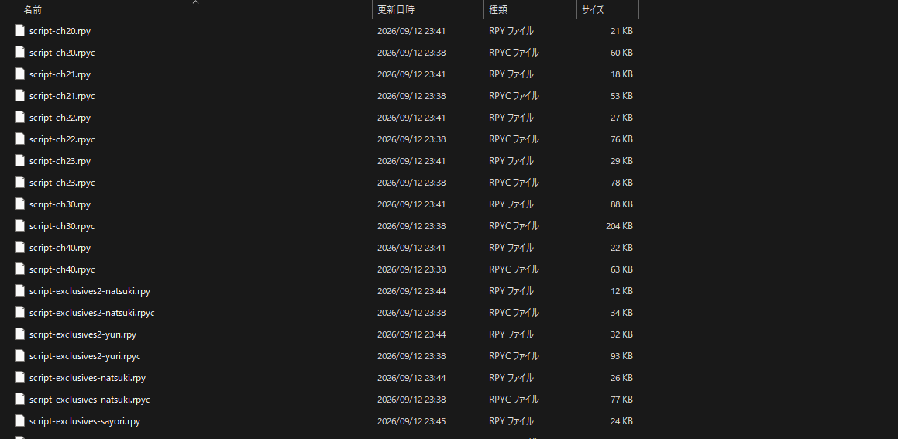
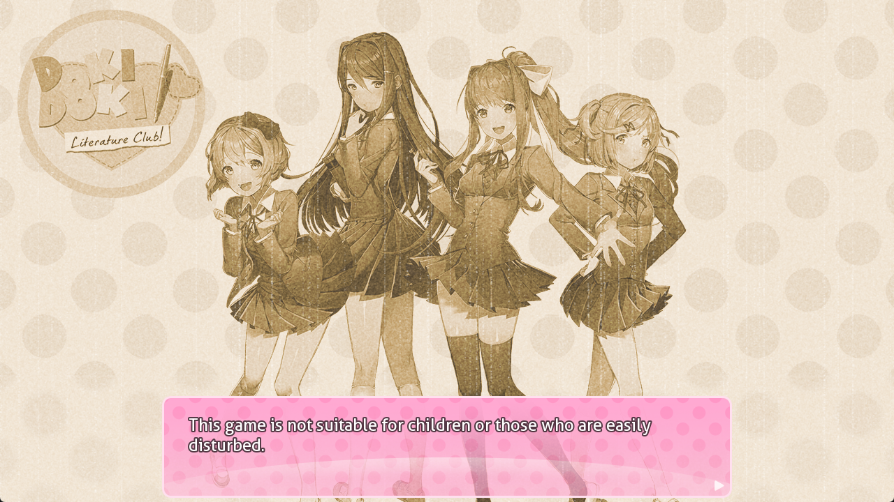
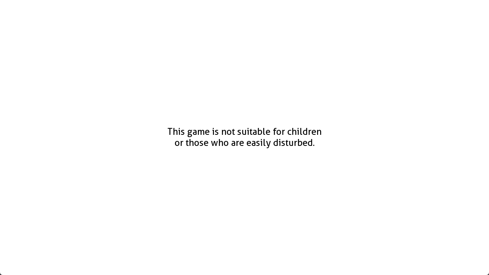

## 1 简介

第一次接触这个游戏是在 2019 年，当时对 `meta` 的实现方式很感兴趣，但是当时并不会编程，而且写日记环节的各种生僻英文词也是给我劝退了。后来买了 `plus` 版一直在吃灰，直到昨天花费一整天时间拿下 `plus` 版全成就后，又想再来看看 `meta` 的实现机制，现在有了编程基础和豆姐的加持就很容易实现了。

# 2 预备知识
### 2.1 什么是 Ren'Py
`Ren'Py (Renai + Python)` 是基于 `Python` 和 `Pygame` 的制作视觉小说和恋爱模拟类游戏的开源游戏引擎，常见的文件格式有：
- `.rpy`: 源代码
- `.rpyc`: `.rpy` 文件会被 `Ren'Py` 编译成 `.rpyc` 格式的二进制文件
- `.rpa`: `Ren'Py` 专用的压缩包格式，用于打包资源
### 2.2 文件结构与解包
未解包前的目录结构：

```
DDLC/ 
├── DDLC.exe         # 游戏主启动程序 
├── lib/             # 运行库
├── renpy/           # Ren'Py 引擎核心 
└── game/            # 游戏核心资源文件夹
	├── scripts.rpa  # 脚本包：rpyc编译脚本、poemword.txt诗歌词表、特效代码 
	├── images.rpa   # 所有立绘、CG、背景图、UI图片
	├── audio.rpa    # BGM、音效 
	├── fonts.rpa    # 字体文件 
	├── firstrun/    # 首次启动警告页面 
	└── characters/  # 四个角色的 .chr 文件
```

进入游戏目录，通过 `pip` 安装 `unrpa` 后进入 `game` 目录下解压 `scripts.rpa` 和 `images.rpa`：

```sh
# 将当前目录下的 scripts.rpa 解压到上级目录下的 ddlc_out 中
unrpa -mp ../ddlc_out ../scripts.rpa
# 同理将图片解压到 ddlc_image_out 中
unrpa -mp ../ddlc_image_out ../iamges.rpa
```

此时解压出的源代码是编译后的 `.rpyc` 文件，需要通过 `unrpyc` 工具反编译：

```sh
# 下载 unrpyc 工具
git clone https://github.com/CensoredUsername/unrpyc.git
# 进入 unrpyc 目录
cd unrpyc
# 反编译
python unrpyc.py path/to/your/.rpyc
```

最终效果类似下图：



## 3 代码逻辑
`meta` 元素涉及到游戏启动动画，主菜单，立绘等，因此对整个流程进行分析，只基于目前周目下会触发的逻辑，而非整体全部的逻辑
### 3.1 启动动画
`Ren'Py` 启动后，会扫描并执行所有的 `init` 块，例如启动动画对应的脚本 `splash.rpy` 中定义了启动时显示的文字：

```python
# splash.rpy
init python:
    menu_trans_time = 1
    splash_message_default = "This game is not suitable for children\nor those who are easily disturbed."
	
    splash_messages = [
	"You are my sunshine,\nMy only sunshine",
    "I missed you.",
	...]
```

同时也会初始化 `image`, `transform` 等：

```python
# splash.rpy
image tos = "bg/warning.png"
image tos2 = "bg/warning2.png"
```

当游戏启动后，会自动执行 `label splashscreen` 中的语句 (类似函数)，第一次运行时会显示警告：



```python
# splash.rpy
label splashscreen:
	# 第一次运行时 persistent.first_run 返回 False
	if not persistent.first_run:
        python:
			# 检查 chr 文件是否存在，不存在则恢复 (definitions.rpy 下)
			restore_all_characters()
        $ quick_menu = False
		# 纯白界面 0.5s 后切换到 tos
        scene white
        pause 0.5
		# 上面定义的图片
        scene tos
		# 1s 的淡入
        with Dissolve(1.0)
        pause 1.0
		# 警告语句
        "This game is not suitable for children or those who are easily disturbed."
        "Individuals suffering from anxiety or depression may not have a safe experience playing this game. For content warnings, please visit: http://ddlc.moe/warning.html"
        menu:
            "By playing Doki Doki Literature Club, you agree that you are at least 13 years of age, and you consent to your exposure of highly disturbing content."
			# "我同意" 的按钮
            "I agree.":
                pass
		# 将 persistent.first_run 设置为 True，下次运行就不会显示了
        $ persistent.first_run = True
        scene tos2
        with Dissolve(1.5)
        pause 1.0
        scene white
```

进入游戏，我们会看到厂商的 `logo` (对应 `intro` 动画) 和 “此游戏不适宜儿童 ...” 的警告 (对应 `splash_warning`)：




```python
label splashscreen:
	...
	show white
	# 不显示二周目彩蛋菜单
    $ persistent.ghost_menu = False
	# 定义 splash_message：之前定义的默认语句，而不是随机诗句
    $ splash_message = splash_message_default
	# 播放 bgm
    $ config.main_menu_music = audio.t1
    $ renpy.music.play(config.main_menu_music)

    $ starttime = datetime.datetime.now()
	# 展示 intro 动画
	'''
	image intro:
	    truecenter
	    "white"
	    0.5
	    "bg/splash.png" with Dissolve(0.5, alpha=True)
	    2.5
	    "white" with Dissolve(0.5, alpha=True)
	    0.5
	'''
    show intro with Dissolve(0.5, alpha=True)
	# 只有在三周目才会从 splash_messages 中随机一个诗句
    if persistent.playthrough == 2 and renpy.random.randint(0, 3) == 0:
        $ splash_message = renpy.random.choice(splash_messages)
	# 默认警告文本
    show splash_warning "[splash_message]" with Dissolve(max(0, 4.0 - (datetime.datetime.now() - starttime).total_seconds()), alpha=True)
    $ pause(6.0 - (datetime.datetime.now() - starttime).total_seconds())
    hide splash_warning with Dissolve(max(0, 6.5 - (datetime.datetime.now() - starttime).total_seconds()), alpha=True)
    $ pause(6.5 - (datetime.datetime.now() - starttime).total_seconds())
    $ config.allow_skipping = True
	# 返回后显示开始菜单
    return
```

### 3.2 开始菜单
来到开始菜单，它的定义在 `screen.rpy` 中，人物立绘的定义在之前的 `splash.rpy` 中：

```python
# 立绘位置，动画效果以及缩放等
image menu_bg:
    topleft
    "gui/menu_bg.png"
    menu_bg_move

image menu_art_y:
    subpixel True
    "gui/menu_art_y.png"
    xcenter 600
    ycenter 335
    zoom 0.60
    menu_art_move(0.54, 600, 0.60)

image menu_art_n:
    subpixel True
    "gui/menu_art_n.png"
    xcenter 750
    ycenter 385
    zoom 0.58
    menu_art_move(0.58, 750, 0.58)
```

```python
# screen.rpy
screen main_menu():
    tag menu
    style_prefix "main_menu"
	# 是否为二周目彩蛋界面
    if persistent.ghost_menu:
        add "white"
        add "menu_art_y_ghost"
        add "menu_art_n_ghost"
    else:
		# 第一次走这里
        add "menu_bg"
		# yuri 和 natsuki 的立绘
        add "menu_art_y"
        add "menu_art_n"
		# 开始游戏等按钮的背景框
        frame
		# use 在当前 screen 中插入另一个 screen：
        use navigation
		...
```

进入解包后的图片文件夹中可以看到三个 `image` 对应的图片:


`navigation` 用于插入开始游戏，设置等按钮，不是 `main_menu` 时表示是在游戏对话界面，此时插入保存，快进等按钮

```python
# screen.rpy
screen navigation():
    vbox:
		# 样式设置
        style_prefix "navigation"
        xpos gui.navigation_xpos
        yalign 0.8
        spacing gui.navigation_spacing
		# 第一次进入游戏 if autoload 会返回 False
        if not persistent.autoload or not main_menu:
			# 当前处于开始菜单
            if main_menu:
				# 二周目显示乱码开始按钮
                if persistent.playthrough == 1:
                    textbutton _("ŔŗñĮ¼»ŧþŀÂŻŕěōì«") action If(persistent.playername, true=Start(), false=Show(screen="name_input", message="Please enter your name", ok_action=Function(FinishEnterName)))
                else:
					# 一周目正常显示开始游戏的按钮，点击后判断是否有用户名，false 时会提示输入名字，然后通过 true=Start() 调用 script.rpy 中的 start
                    textbutton _("New Game") action If(persistent.playername, true=Start(), false=Show(screen="name_input", message="Please enter your name", ok_action=Function(FinishEnterName)))
					
            else:
				# 不是在主菜单中，添加历史，保存等按钮
                textbutton _("History") action [ShowMenu("history"), SensitiveIf(renpy.get_screen("history") == None)]

                textbutton _("Save Game") action [ShowMenu("save"), SensitiveIf(renpy.get_screen("save") == None)]

            textbutton _("Load Game") action [ShowMenu("load"), SensitiveIf(renpy.get_screen("load") == None)]
```


