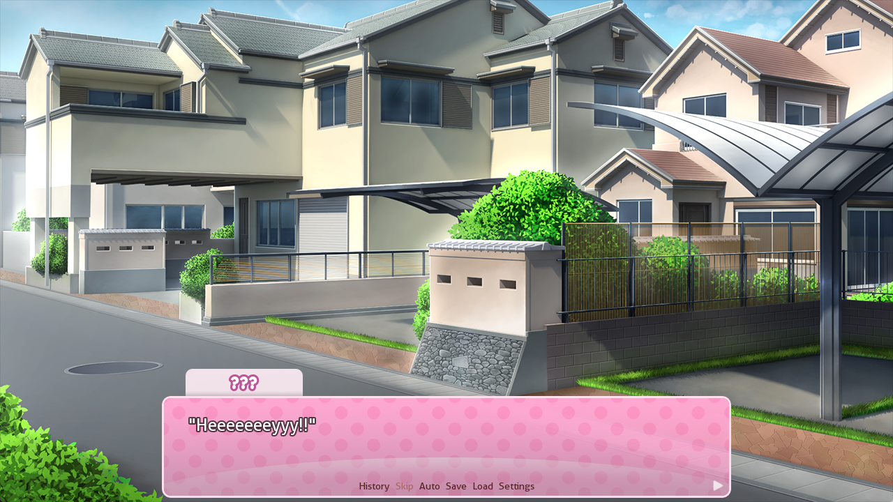
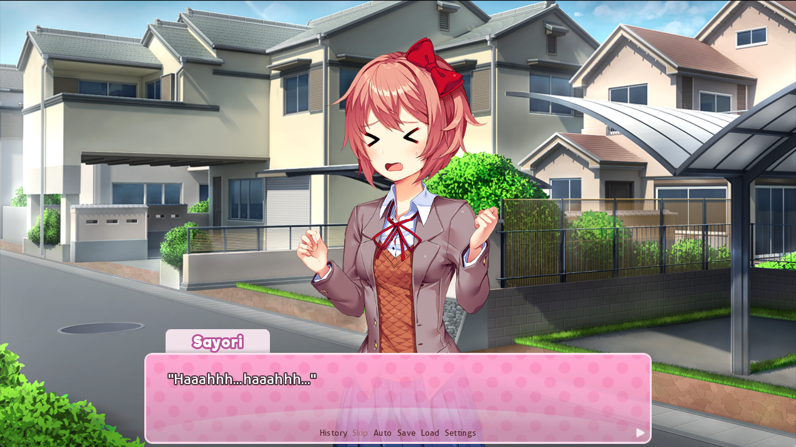
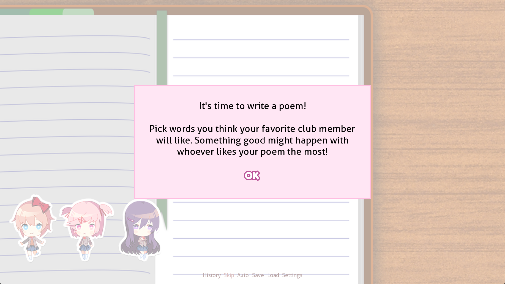
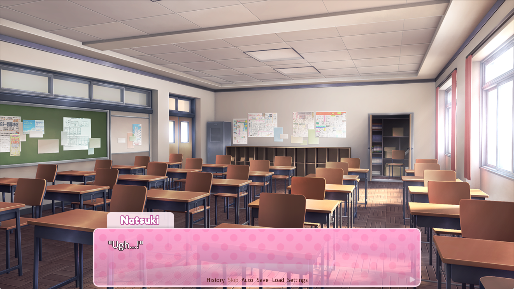
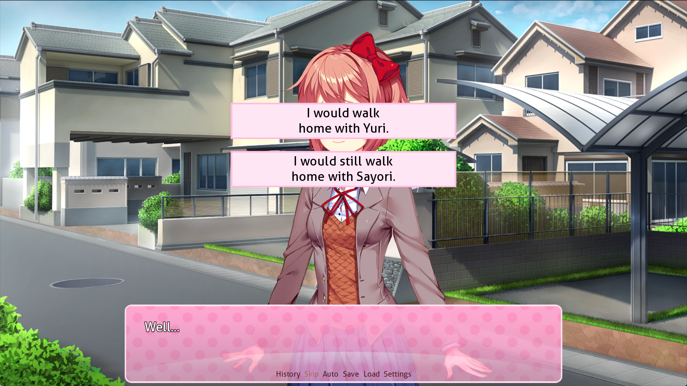

## 1 整体逻辑

点击新游戏，首先会触发 `screen.rpy` 中的 `navigation`:

```python
# 输入名字后进入游戏
textbutton _("New Game") action If(persistent.playername, true=Start(), false=Show(screen="name_input", message="Please enter your name", ok_action=Function(FinishEnterName)))
```

`ddlc` 的核心脚本是 `scripts.rpy`, 进入一周目，执行 `scripts.rpy` 的 `start`:

```python
label start:
	# 作弊检测会触发彩蛋，后面再说
    $ anticheat = persistent.anticheat
	# 当前位于 ch0, 每次写诗后切下一章
    $ chapter = 0
	# 角色名，在不同周目会赋不同的值
    $ s_name = "???"
    $ m_name = "Girl 3"
    $ n_name = "Girl 2"
    $ y_name = "Girl 1"
	# 是否在晴天娃娃场景
    $ in_sayori_kill = None
	# 允许跳过初始值为 True
    $ allow_skipping = True
    $ config.allow_skipping = True

	# 一周目
    if persistent.playthrough == 0:
        $ chapter = 0
		# 调 ch0_main
        call ch0_main
		# 写诗
        call poem

        $ chapter = 1
        call ch1_main
		# 改变好感度
        call poemresponse_start
        call ch1_end
        call poem

        $ chapter = 2
        call ch2_main
        call poemresponse_start
        call ch2_end
        call poem
		
        $ chapter = 3
        call ch3_main
        call poemresponse_start
        call ch3_end
		
        $ chapter = 4
        call ch4_main

        python:
			# 检查 hxppy thxughts.png 是否存在，否则自动生成
            try: renpy.file(config.basedir + "/hxppy thxughts.png")
            except: open(config.basedir + "/hxppy thxughts.png", "wb").write(renpy.file("hxppy thxughts.png").read())

        $ chapter = 5
        call ch5_main
        call endgame
        return

	# 其他周目
	elif ...
```

## 2 章节实现
### 2.1 ch0
#### 2.1.1 日常

`script-ch0.rpy` 中定义了 `label ch0_main`：

```python
label ch0_main:
	# 加载场景和 bgm
    stop music fadeout 2.0
	# definitions.rpy 中定义了 residential_day 的路径
	# image bg residential_day = "bg/residential.png"
    scene bg residential_day
    with dissolve_scene_full
    play music t2

	$ restore_all_characters()
	# 开始对话
	# s 是人物变量名，在 definitions.rpy 中定义：
	# define s = DynamicCharacter('s_name', image='sayori', what_prefix='"', what_suffix='"', ctc="ctc", ctc_position="fixed")
    s "Heeeeeeeyyy!!"
	...
    "However, I just sigh and idle in front of the crosswalk and let Sayori catch up to me."
	# 将之前的 s_name 赋值
    $ s_name = "Sayori"
	# 这里的 sayori 对应 DynamicCharacter('s_name', image='sayori'...) 指定的图像名
	# 加载 sayori 的 4p 图片
	# 定义在 definitions.rpy 中：
	# image sayori 4p = im.Composite((960, 960), (0, 0), "sayori/2l.png", (0, 0), "sayori/2r.png", (0, 0), "sayori/p.png")
    show sayori 4p zorder 2 at t11
	s "I overslept again!"
    s "But I caught you this time!"
	# mc 是玩家对应的变量
    mc "Maybe, but only because I decided to stop and wait for you."
	...
```

`Sayori` 刚出场的名字是 `???`:



登场后名字改变，加载立绘：



部分人物立绘是通过 `l, r` 以及面部表情组合得到的：


```python
label ch0_main:
	...
	# 切换到下一个场景
	scene bg class_day
	...
	# 后续切场景，人物立绘逻辑相似，return 后进入写诗环节
	...
	"I'll just need to make the most of my circumstances, and I'm sure good fortune will find me."
    "And I guess that starts with writing a poem tonight..."
	return
```

#### 2.1.2 写诗

写诗的脚本定义在 `script-poemgame.rpy` 中，先来看它初始化做了什么：

```python
# script-poemgame.rpy
init python:
    import random

	# 定义 PoemWord 类，每个词对应 3 个角色有不同的分数，glitch 决定是否要乱码
    class PoemWord:
        def __init__(self, word, sPoint, nPoint, yPoint, glitch=False):
            self.word = word
            self.sPoint = sPoint
            self.nPoint = nPoint
            self.yPoint = yPoint
            self.glitch = glitch

	# 将所有分数加起来后与阈值比较，来改变角色好感度
	POEM_DISLIKE_THRESHOLD = 29
    POEM_LIKE_THRESHOLD = 45

	# 读取 poemwords.txt 来创建 PoemWord 对象加到 full_wordlist 列表中
	full_wordlist = []
    with renpy.file('poemwords.txt') as wordfile:
        for line in wordfile:
            line = line.strip()
            if line == '' or line[0] == '#': continue
            x = line.split(',')
            full_wordlist.append(PoemWord(x[0], float(x[1]), float(x[2]), float(x[3])))

	# 写诗时左下角 Q 版人物的运动
	def randomPauseSayori/Yuri/Monika...(trans, st, at):
		...
	def randomMoveSayori/Yuri...(trans, st, at):
		...
```

`scripts.rpy` 调用 `call poem`，执行 `label poem` 中的语句：

```python
# script-poemgame.rpy
label poem(transition=True):
    stop music fadeout 2.0
	if persistent.playthrough == 3:
        ...
    else:
		# 加载一周目写诗界面
		# image bg notebook = "bg/notebook.png"(definitions.rpy)
		scene bg notebook
	# 保存，设置等按钮菜单
    show screen quick_menu
	if persistent.playthrough == 3:
		...
	else:
		if persistent.playthrough == 0:
			# sayori 的 q 版小人
			# 定义在 script-poemgame.rpy 中
			# image s_sticker:
			#    "gui/poemgame/s_sticker_1.png"
            show s_sticker at sticker_left
		# natsuki 的小人
        show n_sticker at sticker_mid
		if persistent.playthrough == 2 and chapter == 2:
            ...
        else:
			# yuri 的小人
            show y_sticker at sticker_right
		...
	if persistent.playthrough == 0 and chapter == 0:
		# 第一次进入写诗环节的对话框
        call screen dialog("It's time to write a poem!\n\nPick words you think your favorite club member\nwill like. Something good might happen with\nwhoever likes your poem the most!", ok_action=Return())
```



```python
# script-poemgame.rpy
label poem(transition=True):
	...
	# 根据周目不同计算分数
    python:
		# 当前词
		progress = 1
        numWords = 20
        sPointTotal = 0
        nPointTotal = 0
        yPointTotal = 0
        wordlist = list(full_wordlist)

		 while True:
            if persistent.playthrough == 2 and chapter == 2:
                ...
            else:
				# 一周目，计数位置的 1/20, 2/20...
                pstring = str(progress)
            ui.text(pstring + "/" + str(numWords), style="poemgame_text", xpos=810, ypos=80, color='#000')
			# 两列候选词
			for j in range(2):
                if j == 0: x = 440
                else: x = 680
                ui.vbox()
				# 五行
                for i in range(5):
                    if persistent.playthrough == 3:
                        ...
                    elif persistent.playthrough == 2 and not poemgame_glitch and chapter >= 1 and progress < numWords and random.randint(0, 400) == 0:
                        ...
					# 一周目
                    else:
					    # 从刚才的 wordlist 随机选单词
                        word = random.choice(wordlist)
                        wordlist.remove(word)
                    ui.textbutton(word.word, clicked=ui.returns(word), text_style="poemgame_text", xpos=x, ypos=i * 56 + ystart)
                ui.close()

			# t 是用户当前点击的词
			t = ui.interact()
	            if not poemgame_glitch:
					if t.glitch:
						...
					elif persistent.playthrough != 3:
						renpy.play(gui.activate_sound)
						# 一周目 3 分词触发小人跳跃
	                    if persistent.playthrough == 0:
	                        if t.sPoint >= 3:
	                            renpy.show("s_sticker hop")
	                        if t.nPoint >= 3:
	                            renpy.show("n_sticker hop")
	                        if t.yPoint >= 3:
	                            renpy.show("y_sticker hop")
	                    else: ...
				
				# 计算总分
				sPointTotal += t.sPoint
	            nPointTotal += t.nPoint
	            yPointTotal += t.yPoint
	            progress += 1
				# 选择完后 break
	            if progress > numWords:
	                break

		if persistent.playthrough == 0:
			if chapter == 1: ...
			unsorted_pointlist = {"sayori": sPointTotal, "natsuki": nPointTotal, "yuri": yPointTotal}
			# 排序得到得分最高的
            pointlist = sorted(unsorted_pointlist, key=unsorted_pointlist.get)
			poemwinner[chapter] = pointlist[2]
		else: ...

		# 角色首字母与 _appeal 拼接得到的变量值 +=1：例如 s(ayori)__appeal += 1
		exec(poemwinner[chapter][0] + "_appeal += 1")

		# 判断该角色是否喜欢这首诗
		if sPointTotal < POEM_DISLIKE_THRESHOLD: s_poemappeal[chapter] = -1
        elif sPointTotal > POEM_LIKE_THRESHOLD: s_poemappeal[chapter] = 1
        if nPointTotal < POEM_DISLIKE_THRESHOLD: n_poemappeal[chapter] = -1
        elif nPointTotal > POEM_LIKE_THRESHOLD: n_poemappeal[chapter] = 1
        if yPointTotal < POEM_DISLIKE_THRESHOLD: y_poemappeal[chapter] = -1
        elif yPointTotal > POEM_LIKE_THRESHOLD: y_poemappeal[chapter] = 1

	...
	# 返回到 call poem 的位置进行下一章
	return
```

### 2.2 ch1

首先走 `Natsuki` 线普通结局，改变 `chapter` 的值后 `call ch1_main`:

#### 2.2.1 读诗前

```python
# script-ch1.rpy
label ch1_main:
    scene bg club_day
    with dissolve_scene_half
    play music t2
    show monika 5 zorder 2 at t11
	m "Hi again, [player]!"
	...
	"I can't help but notice her intense expression, like she was waiting for this chance."
    "Meanwhile, Natsuki is rummaging around in the closet."

	# 根据上一次写诗的结果调用角色剧情，eval(poemwinner[0][0] + "_appeal") 取出该角色获胜的次数，这里是 natsuki_exclusive_1
	$ nextscene = poemwinner[0] + "_exclusive_" + str(eval(poemwinner[0][0] + "_appeal"))
	# call nextscene
    call expression nextscene
```

`Natsuki` 线第一个剧情定义在 `script-exclusives-natsuki.rpy` 中：



```python
# script-exclusives-natsuki.rpy
label natsuki_exclusive_1:
    scene bg club_day
    with wipeleft_scene
    n "Ugh...!"
	...
	# 返回到 ch1_main 中，ch1_main 对话结束后再 return 到 start 中的 poemresponse_start
	return
```

进入读诗环节，定义在 `script-poemresponses.rpy` 中：

```python
# script-poemresponses.rpy
label poemresponse_start:
	# 读过诗的人数
    $ poemsread = 0
    $ skip_transition = False
	# 播放音乐
    label poemresponse_loop:
        $ skip_poem = False
        if renpy.music.get_playing() and not (renpy.music.get_playing() == audio.t5 or renpy.music.get_playing() == audio.t5c):
            $ renpy.music.play(audio.t5, fadeout=1.0, if_changed=True)
        if skip_transition:
            scene bg club_day
        else:
            scene bg club_day
            with wipeleft_scene
        $ skip_transition = False
        if not renpy.music.get_playing():
            play music t5
	# poemresponse_loop 执行结束后顺序执行 
    label poemresponse_start2:
        $ skip_poem = False
        if persistent.playthrough == 2: ...
        else:
            $ pt = ""
		# 弹出菜单，我要先给谁看诗呢?
        if poemsread == 0:
            $ menutext = "Who should I show my poem to first?"
        else:
			# 接下来给谁看呢？
            $ menutext = "Who should I show my poem to next?"
        menu:
            "[menutext]"
			# 仅在 chapter == 1 时，选择角色时会展示玩家的心里活动
            "Sayori" if not s_readpoem and persistent.playthrough == 0:
                $ s_readpoem = True
                if chapter == 1 and poemsread == 0:
                    "I'm definitely most comfortable sharing it with Sayori first."
                    "She's my good friend, after all."
                call poemresponse_sayori
            "Natsuki" if not n_readpoem:
                $ n_readpoem = True
                if chapter == 1 and poemsread == 0:
                    "I told Natsuki I was interested in her poems yesterday."
                    "It's probably only fair if I shared mine with her first."
                call poemresponse_natsuki

            "Yuri" if not y_readpoem and not y_ranaway:
                $ y_readpoem = True
                if chapter == 1 and poemsread == 0:
                    "Yuri seems the most experienced, so I should start with her."
                    "I can trust her opinion to be fair."
                call poemresponse_yuri
				
            "Monika" if not m_readpoem:
                $ m_readpoem = True
                if chapter == 1 and poemsread == 0:
                    "I should start with Monika."
                    "Yesterday she seemed eager to read my poem, and I want her to know I'm putting in effort."
                call poemresponse_monika

        $ poemsread += 1
		# jump 到 poemresponse_loop 
        if poemsread < 3 or (persistent.playthrough == 0 and poemsread < 4):
            jump poemresponse_loop

	# 重置状态的值
    $ s_readpoem = False
    $ n_readpoem = False
    $ y_readpoem = False
    $ m_readpoem = False
    $ poemsread = 0
    return
```

#### 2.2.2 读诗的反应

以 `Sayori` 为例, `call poemresponse_sayori`，`Yuri` 和 `Natsuki` 逻辑类似

```python
# script-poemresponses.rpy
label poemresponse_sayori:
    scene bg club_day
    show sayori 1a zorder 2 at t11
    with wipeleft_scene
    $ poemopinion = "med"
	# 在计算分数时有 if sPointTotal < POEM_DISLIKE_THRESHOLD: s_poemappeal[chapter] = -1
	# 根据剧情进度看这里进的是 med
    if s_poemappeal[chapter - 1] < 0:
        $ poemopinion = "bad"
    elif s_poemappeal[chapter - 1] > 0:
        $ poemopinion = "good"
	# pt 在上面赋值为空, nextscene 是 ch1_s_med
    $ nextscene = "ch" + pt + str(chapter) + "_s_" + poemopinion
    call expression nextscene
	# 不跳过读诗
    if not skip_poem:
		# ch1_s_end
        $ nextscene = "ch" + pt + str(chapter) + "_s_end"
        call expression nextscene
    return
```

```python
# script-poemresponses.rpy
label ch1_s_med:
    s "..."
    s 2x "This is a good poem, [player]!"
    s "Are you sure it's your first time?"
    mc "Of course..."
    mc "It's not that good."
    mc "Am I the kind of guy who would be writing poems in his spare time?"
    s 2q "Ehehe, I guess you're right~"
    s 1q "But that's why it impressed me!"
    s 1d "Well, to be honest..."
    s "I was afraid that you wouldn't do it seriously..."
    s "Or that you wouldn't write one at all."
    jump ch1_s_shared
```

跳到 `ch1_s_shared`:

```python
label ch1_s_shared:
	s 1a "I'm really happy just that you wrote one."
	s "It just reminds me of how you're really a part of the club now~"
	"(Not to mention the fact that I'm standing in front of you in the clubroom...?)"
	...
	return
```

执行结束后回到 `poemresponse_sayori` 中执行 `ch1_s_end`：

```python
label ch1_s_end:
	# 展示诗
    call showpoem (poem_s1)
    mc "Sayori..."
    mc "This is just a guess, but..."
    ...
    return
```

角色的诗定义在 `poems.rpy` 中：

```python
init python:
    class Poem:
        def __init__(self, author="", title="", text="", yuri_2=False, yuri_3=False):
            self.author = author
            self.title = title
            self.text = text
            self.yuri_2 = yuri_2
            self.yuri_3 = yuri_3

	# 初始化将所有诗创建为 Poem 对象
	poem_y1 = Poem(
    author = "yuri",
    title = "Ghost Under the Light",
    text = """...""")

	poem_y2 = ...

label showpoem(poem=None, music=True, track=None, revert_music=True, img=None, where=i11, paper=None):

	# image paper = "images/bg/poem.jpg"
    if paper:
		# 展示对应的诗
        show screen poem(poem, paper=paper)
    else:
        show screen poem(poem)
	...
    return
```

`Monika` 虽然也有 `poemopinion`，但是逻辑稍有不同：

```python
label poemresponse_monika:
    scene bg club_day
    show monika 1a zorder 2 at t11
    with wipeleft_scene
    if m_poemappeal[chapter - 1] < 0:
        $ poemopinion = "bad"
    elif m_poemappeal[chapter - 1] > 0:
        $ poemopinion = "good"
	# 始终进入 ch1_m_start 和 ch1_m_end
    $ nextscene = "ch" + pt + str(chapter) + "_m_start"
    call expression nextscene
    if not skip_poem:
        $ nextscene = "ch" + pt + str(chapter) + "_m_end"
        call expression nextscene
    return

label ch1_m_start:
    m 1b "Hi, [player]!"
    m "Having a good time so far?"
    mc "Ah...yeah."
	...
	# monika 的评价，根据 poemwinner[0] 进入不同分支
	# label m_natsuki_1
    $ nextscene = "m_" + poemwinner[0] + "_" + str(eval(poemwinner[0][0] + "_appeal"))
    call expression nextscene
    return

label ch1_m_end:
	# 展示 monika 的诗
    call showpoem (poem_m1)
label ch1_m_end2:
    m 1a "So...what do you think?"
    mc "Hmm...it's very...freeform, if that's what you call it."
    mc "Sorry, I'm not really the right person to ask for feedback..."
    ...
    return
```

#### 2.2.3 end

全部角色读完之后 `return` 到 `script.py` 然后 `call ch1_end`:

```python
label ch1_end:
    stop music fadeout 1.0
    scene bg club_day
    with wipeleft_scene
    play music t3
    mc "Phew..."
    "I guess that's everyone."
	...
	# Natsuki 和 Yuri 吵架后弹出选择框
	# 这里选择 natsuki
    menu:
        "So, of course that's going to be...!"
        "Natsuki.":
			# 普通对话跳过
            call ch1_end_natsuki
        "Yuri.":
            call ch1_end_yuri
        "Help me, Sayori!!":
            call ch1_end_sayori

	scene bg club_day
    show monika 4b zorder 2 at t11
    with wipeleft_scene
	
    m "Okay, everyone!"
    m "It's just about time for us to leave."
	...
    return
 
```

进入第二次写诗，这里仍然选择 `Natsuki`，开启下一个章节

### 2.3 ch2

```python
label ch2_main:
    scene bg club_day
    with dissolve_scene_half
    play music t2
	...

	# 进入 natsuki_exclusive_2
	$ nextscene = poemwinner[1] + "_exclusive_" + str(eval(poemwinner[1][0] + "_appeal"))
    call expression nextscene
```

```python
# script-exclusives-natsuki.rpy
label natsuki_exclusive_2:
...
label natsuki_exclusive_2_ch3:
	"I pull the first volume of Parfait Girls out from my bag."
	...
	# definitions.rpy 中定义了 default persistent.clear = [False, False, False, False, False, False, False, False, False, False]
	# 记录解锁了哪个 cg
	$ persistent.clear[1] = True
    $ renpy.save_persistent()
    scene n_cg2_bg
    show n_cg2_base
```

`call poemresponse_start` 的逻辑与之前类似，略过

进入 `ch2_end`:

```python
	stop music fadeout 1.0
    scene bg club_day
    show monika 4b zorder 2 at t32
    with wipeleft_scene
    play music t3
    m "Okay, everyone!"
	...
	# 获取 winner 的值
	$ ch2_winner = poemwinner[1].capitalize()
	# 即使选了 Sayori，这里还是会变成 Yuri
	# 猜测是第二个选项已经是 Sayori 了，所以设置了一个别的值
    if ch2_winner == "Sayori":
        $ ch2_winner = "Yuri"
	... 
	# 选项 与谁一起回家
	menu:
        "Well..."
        "I would walk home with [ch2_winner].":
            if ch2_winner == "Natsuki":
                call ch2_end_natsuki
            else:
                call ch2_end_yuri
        "I would still walk home with Sayori.":
            call ch2_end_sayori
```



```python
label ch2_end_natsuki:
    mc "Walking home with Natsuki, huh..."
    "Why does the thought of that make my heart pound...?"
    mc "I mean..."
    mc "I think I would be afraid of what she'd do to me if I turned her down..."
    s 1x "Isn't she so cute and fun to be around?"
	# 跳转到 end_shared
    jump ch2_end_shared

label ch2_end_shared:
    mc "That has nothing to do with what I just said!"
    s 4s "Ahaha! You admitted it!"
	...
    return
```

进入第三次写诗，选择 `Natsuki`，开启下一个章节

### 2.4 ch3

```python
# script-ch3.rpy
label ch3_main:
    scene bg club_day
    with dissolve_scene_half
    play music t3
    show monika 1g at l31
    m "Aw, man..."
    m "I'm the last one here again!"
	...

	if n_appeal == 0 and y_appeal == 0: ...
    elif n_appeal > 1:
        jump ch3_start_natsuki

label ch3_start_natsuki:
    play music t6 fadeout 1
    show natsuki 3c zorder 2 at t11
    n "Hey, you."
    mc "Eh?"
    "I look up to see Natsuki next to me."
	...

	# label natsuki_exclusive_2:
	#	$ n_exclusivewatched = True
	# 之前看过已经是 True 了，跳转至 ch3_start_none
    if not n_exclusivewatched and poemwinner[2] == "natsuki":
        call natsuki_exclusive_2_ch3
    else:
        jump ch3_start_none
    return

label ch3_start_none:
    if not renpy.music.get_playing(channel='music') == audio.t3:
        stop music fadeout 1.0
    scene bg club_day
    with wipeleft_scene
    "..."
    if not renpy.music.get_playing(channel='music') == audio.t3:
        play music t3
    show monika 4b zorder 2 at t11
	
    m "Okay, everyone!"
    "After some time passes, Monika calls out to the clubroom."
    ...
	# 返回到 script.rpy，进入评分环节
    return

```

选择给 `Sayori` 读诗：

```python
label ch3_s_bad:
    $ currentname = "Yuri"
    if n_poemappeal[2] > y_poemappeal[2]:
        $ currentname = "Natsuki"
    s "..."
    s 1k "...Hm."
    s "It's nice, I guess~"
    mc "Come on, I can already tell you don't like it."
    s 1d "Well..."
    s "You don't need to worry about what I think."
    s 2y "After all, you wrote this for someone else, didn't you?"
    s "Probably [currentname]..."
    mc "Eh??"
    ...
	# 跳过读诗环节
    $ skip_poem = True

    return

# med 和 good 都会跳到 bad
label ch3_s_med:
    jump ch3_s_bad

label ch3_s_good:
    if poemwinner[0] != "sayori" and poemwinner[1] != "sayori":
        jump ch3_s_bad
    s 1d "..."
    s "This is your best one so far."
    ...
    $ skip_poem = True
    return
```

选择给 `Yuri` 读诗：

```python
label ch3_y_bad:
    if y_poemappeal[0] < 0 and y_poemappeal[1] < 0:
        label ch3_y_bad12_shared:
            y 4b "..."
            "Yuri doesn't look too enthusiastic about spending time with me..."
            "I guess if she changes her mind, she'll come to me."
            "But I should leave her be for now."
			# 跳过读诗
            $ skip_poem = True
            return
```

选择给 `Natsuki` 读诗：

```python
label ch3_n_good:
    if n_poemappeal[0] < 0 and n_poemappeal[1] < 0: ...
	# 进入这个分支
    elif n_poemappeal[0] > 0 and n_poemappeal[1] > 0:
        n 1l "Let's see, let's see!"
        mc "You're certainly enthusiastic today."
        ...
        return
# 回到 poemresponse_natsuki 调 ch3_n_end:
label ch3_n_end:
    $ n_read3 = True
    if n_appeal >= 3:
        jump ch3_n_end_special
	...

# 跳转到 ch3_n_end_special
label ch3_n_end_special:
	# 展示诗
    call showpoem (poem_n3b)
	
    n 1q "..."
    n "...Why are you looking at me like that?"
	...
    return
```

`return` 到 `ch3_end`:

```python
label ch3_end:
    stop music fadeout 1.0
    scene bg club_day
    show monika 4b zorder 2 at t32
    with wipeleft_scene
    play music t3
	
    m "...Okay, you three!"
    m "We're all done sharing poems, right?"
	...
    "Everyone looks straight at me."

	# 选择和谁一起去
    menu:
        "But of course, I'm going to go with--"
        "Natsuki.":
            call ch3_end_natsuki
        "Yuri.":
            call ch3_end_yuri
        "Monika.":
            call ch3_end_monika
        "Sayori...":
            call ch3_end_sayori
	...
```

```python
# 进入 natsuki end
label ch3_end_natsuki:
	# 设定 ch4_scene 的值
    $ ch4_scene = "natsuki"
	mc "Well, baking sounds like it could be fun..."
    mc "And you guys made it sound like a lot of work, so it could probably use two people."

	...
	# 向上 return 到 ch3_end 继续执行
	return
	
```

```python
label ch3_end:
	scene bg residential_day
    with wipeleft_scene
    $ ch4_name = ch4_scene.capitalize()
    "I can't believe this!"
    "[ch4_name] is going to be coming to my house on Sunday...?"
	# 只有 sayori 结局这里才为 True
	if help_sayori: ...
	else:
		"My anxiety shoots through the roof."...
	# 向上 return，开启 ch4
	return
```

### 2.5 ch4

```python
# script-ch4.rpy
label ch4_main:
	stop music fadeout 2.0
    scene bg residential_day
    with dissolve_scene_full
    play music t6
    "It's already Sunday."
	
	# 要么是 natsuki 要么是 yuri
	if ch4_scene == "natsuki": ...
	else: ...

	# 与 sayori 见面
	stop music fadeout 2.0
    scene bg house
    with wipeleft_scene
    "I decide to visit Sayori before [ch4_name] comes over."
	...
	"I shouldn't be worrying too much, and we're definitely going to have a great time tomorrow."
    "I should just focus on what's ahead of me!"

	# 进入 ch4_exclusive_natsuki
    call expression "ch4_exclusive_" + ch4_scene
    call ch4_end
    return
```

```python
# script-ch4.rpy
label ch4_exclusive_natsuki:
    play music t6 fadeout 2.0
    scene bg house with wipeleft_scene

    "I spend only a few minutes back at home anxiously awaiting Natsuki's arrival."
    "Before I know it, she texts me to let me know she's outside the front door."
    ...

	# 将 clear 数组的元素置为 True
    $ persistent.clear[4] = True
    $ renpy.save_persistent()

	# 显示 cg
    scene n_cg3_base
    show n_cg3_exp1
    show n_cg3_cake
	...
    show n_cg3_cake at cgfade

    hide n_cg3_cake

    "I take Natsuki's finger and put it in my mouth, licking off the icing."

    show n_cg3_exp1 at cgfade

    show n_cg3_exp2 at cgfade

    hide n_cg3_exp1

    ...
	# 返回后进入 ch4_end
    return
```

```python
label ch4_end:
	play music t10 fadeout 2.0
    show sayori 1ba zorder 2 at t11
    mc "Sayori--"

	...
	# 背景变为黑色
	show black zorder 4 with dissolve_cg
	# 弹出选择框：我爱你/你永远是我最好的朋友
	menu:
        mc "Sayori..."
        "I love you.":
            $ sayori_confess = True
            hide black with dissolve_cg
            call ch4_end_yes

        "You'll always be my dearest friend.":
            $ sayori_confess = False
            hide black with dissolve_cg
            call ch4_end_no
    return

# 进入 ch4_end_no 分支，返回进入 ch5
```

### 2.6 ch5

```python
# script-ch5.rpy
label ch5_main:
    stop music fadeout 2.0
    scene bg residential_day
    with dissolve_scene_full

    "It's the day of the festival."
    "Of all days, I expected this to be the one where I'd be walking to school with Sayori."
	...

	# 根据路线显示不同对话
	if ch4_scene == "natsuki":
        "I managed to carry all the cupcakes myself by carefully stacking two trays."
        "Natsuki is already texting up a storm, but I can't respond, thanks to my hands being full."
    else:
        "The banner Yuri and I painted is dry, and I gently rolled it up to take with me."
        "She sent me a pleasant text reminding me not to forget anything, and I reassured her."
		...

	scene bg club_day with wipeleft_scene
    show monika 5 zorder 2 at t11

	# 之前选择 I love you 后 sayori_confess 才是 True
	if sayori_confess:
        "That we're...a couple now?"
        "I didn't really plan on bringing it up with anyone yet..."
    else:
        "About how I basically turned down her confession?"
        "That makes me really seem like the bad guy here..."
        "But I'm the one who knows what's best for her, right?"
		...
	...
	# 滚出我的脑袋
	call showpoem (poem_s3, music=False)

	# 站在 sayori 房间门前
	if sayori_confess:
        "That really is something that a boyfriend would do, isn't it?"
    else:
        "Isn't that more like something a boyfriend would do?"
	...
	"I gently open the door."
    mc "{cps=30}.......Sayo--{/cps}{nw}"
	# 进入二周目
	$ persistent.playthrough = 1
	$ renpy.save_persistent()
	# 删除角色
	# definitions.rpy，通过 os.remove 删除文件
	$ delete_character("sayori")
	$ in_sayori_kill = True
	# 播放杂音
	play music td
	# sayori 房间背景
    show s_kill_bg2
	# 晴天娃娃 cg
	show s_kill2
	# 画面扭曲等效果
	...
	# 噪音图片
	show noise zorder 3:
        alpha 0.0
        linear 3.0 alpha 0.25
	# glitch 和 glitch2
	show splash_glitch zorder 2
	...
	show splash_glitch2 zorder 2
	# 角色立绘的 glitch 版本：
	# script-ch5.rpy 中定义，使用 gui/menu_art_m.png 正常图片，但是加上了缩放，平移等效果
	show splash_glitch_m zorder 2
    show splash_glitch_n zorder 2
    show splash_glitch_y zorder 2
	...

	"..."
	# image exception_bg = "#dadada"
	# image fake_exception = Text("An exception has occurred.", size=40, style="_default")
	# image fake_exception2 = Text("File \"game/script-ch5.rpy\", line 307\nSee traceback.txt for details.", size=20, style="_default")
    hide fake_exception
    hide fake_exception2
    hide exception_bg
    "What the hell...?"
	...

	if sayori_confess:
        "Confessing to her..."
        "I shouldn't have confessed to her."
        ...
    else:
        "Turning down her confession..."
        "That has to have been what pushed her over the edge."
        ...
	...
	
	if sayori_confess:
        "And remained friends with her, like it always has been..."
    else:
        "And gave her what I know she wanted out of our relationship..."

	 "...Then I could have prevented this."
	 ...

	 # 复位
	 $ in_sayori_kill = False
	return
```


`return` 到 `script.rpy` 后进入 `endgame`:

```python
label endgame(pause_length=4.0):
    $ quick_menu = False
    stop music fadeout 2.0
    scene black
	# 显示 "gui/end.png"
    show end
    with dissolve_scene_full
    pause pause_length
    $ quick_menu = True
	# 向上返回到 start，再 return 回主界面
    return
```


