[⚠️精污警告⚠️鬼图警告⚠️剧透警告] 本周目含有多个恐怖 `cg`，请注意

## 1 主菜单与整体逻辑

进入游戏主界面，可以看到开始游戏的位置变成了乱码，之前在第一篇中提过，这里对应的是 `screens.rpy` 下的 `navigation`:

```python
screen navigation():
	vbox:
		if not persistent.autoload or not main_menu:
			if main_menu:
				# playthrough 在上周目结束后变成了 1
				if persistent.playthrough == 1:
					textbutton _("ŔŗñĮ¼»ŧþŀÂŻŕěōì«") action If(persistent.playername, true=Start(), false=Show(screen="name_input", message="Please enter your name", ok_action=Function(FinishEnterName)))
                else: ...
```

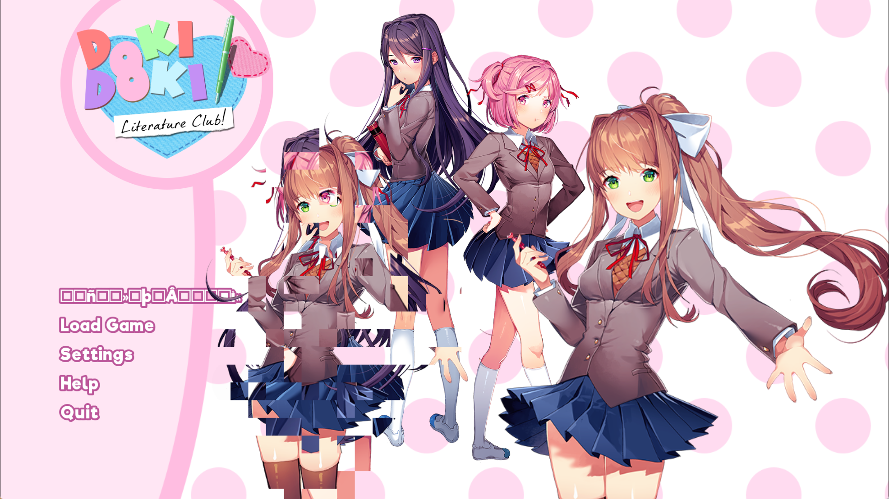

`Sayori` 的立绘也发生了更改，在 `main_menu` 中实现：

```python
screen main_menu():
	if not persistent.ghost_menu: ...
    if persistent.ghost_menu: ...
    else:
		# 加载 menu_art_s_glitch
        if persistent.playthrough == 1 or persistent.playthrough == 2:

            add "menu_art_s_glitch"
```
 
`menu_art_s_glitch` 定义在 `splash.rpy` 中，对应的是 `gui/menu_art_s_break.png` 文件：

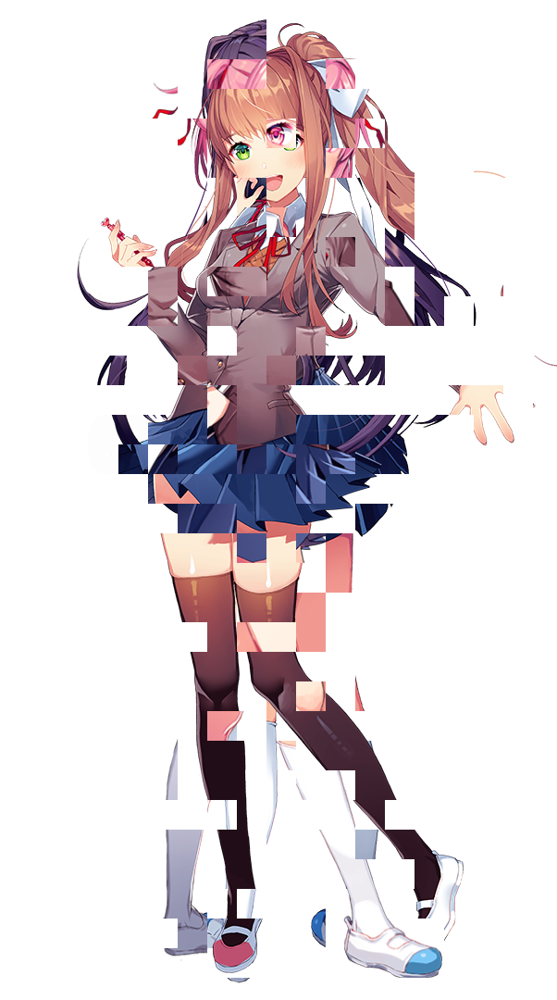

点击开始游戏，仍然会调用 `script.rpy` 中的 `label start`:

```python
label start:
    $ anticheat = persistent.anticheat
    $ chapter = 0
    $ _dismiss_pause = config.developer
    $ s_name = "???"
    $ m_name = "Girl 3"
    $ n_name = "Girl 2"
    $ y_name = "Girl 1"
    $ quick_menu = True
    $ style.say_dialogue = style.normal
    $ in_sayori_kill = None
    $ allow_skipping = True
    $ config.allow_skipping = True

	# 一周目
	if persistent.playthrough == 0: ...

	# 进入二周目
	elif persistent.playthrough == 1:
        $ chapter = 0
		# 进入 ch10
        call ch10_main
		# 跳至 playthrough2
        jump playthrough2
```

## 2 ch10

```python
# script-ch10.rpy
label ch10_main:
	# 删除所有存档
    $ delete_all_saves()
    $ persistent.deleted_saves = True
	# glitchtext 函数定义在 glitchtext.rpy 中
	# 定义了一个字符串 nonunicode = "¡¢£¤¥¦§...ŹźŻżŽž"
	# 指定长度从中随机抽取对应个数的字符拼接起来
    $ gtext = glitchtext(48)
    stop music
    $ config.window_hide_transition = None
    scene bg residential_day
    with dissolve_scene_half
    $ config.window_hide_transition = Dissolve(.2)
    play music t2g
    queue music t2g2

	s "[gtext]"
```

进入游戏，此时 `Sayori` 的名字还是一开始定义的 `???`，这里的台词换成了刚才的 `gtext`:

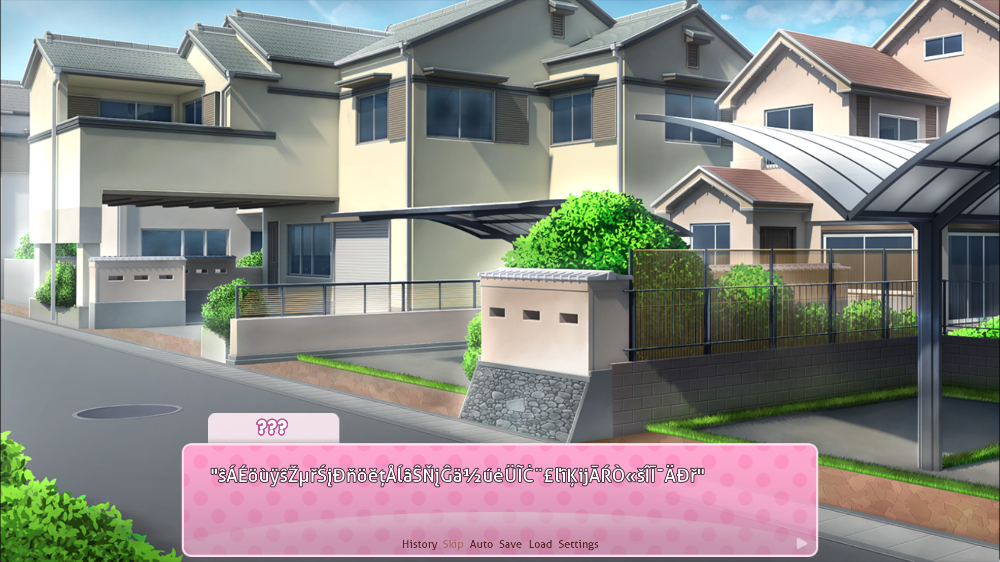

```python
# script-ch10.rpy
label ch10_main:
	# 将 Sayori 的名字更改为乱码，在对话中调用
	$ s_name = glitchtext(12)
    "I see an annoying girl running toward me from the distance, waving her arms in the air like she's totally oblivious to any attention she might draw to herself."
    "That girl is [s_name], my neighbor and good friend since we were children."
	...
```

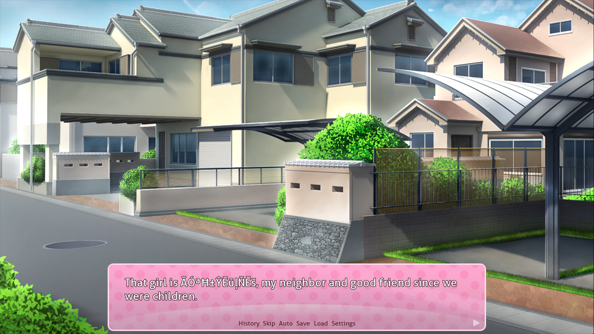

再继续向下推进游戏，就会出现崩坏的 `cg`：

```python
label ch10_main:
	...
    # 崩坏 cg
    show sayori glitch zorder 2 at t11
    python:
        currentpos = get_pos()
        startpos = currentpos - 0.3
        if startpos < 0: startpos = 0
		# 循环播放bgm/2.ogg 从 startpos 到 currentpos 部分的音频
        track = "<from " + str(startpos) + " to " + str(currentpos) + ">bgm/2.ogg"
        renpy.music.play(track, loop=True)
    $ pause(1.0)
    $ gtext = glitchtext(48)
	# s 是之前的乱码名字, 台词是长度 48 的 glitchtext
    s "{cps=60}[gtext]{/cps}{nw}"
    $ pause(1.0)
    $ gtext = glitchtext(48)
    s "{cps=60}[gtext]{/cps}{nw}"
    show screen tear(8, offtimeMult=1, ontimeMult=10)
    $ pause(1.5)
    hide screen tear
    window hide(None)
    window auto
    scene black with trueblack
	# 再次删档
    $ delete_all_saves()
	# 周目数 +1
    $ persistent.playthrough = 2
    $ persistent.anticheat = renpy.random.randint(100000, 999999)
    $ anticheat = persistent.anticheat
    $ renpy.save_persistent()
    jump ch20_from_ch10
```

`sayori glitch` 定义在 `definitions.rpy` 中，对应的是 `sayori/glitch1.png` 和 `glitch2.png`:

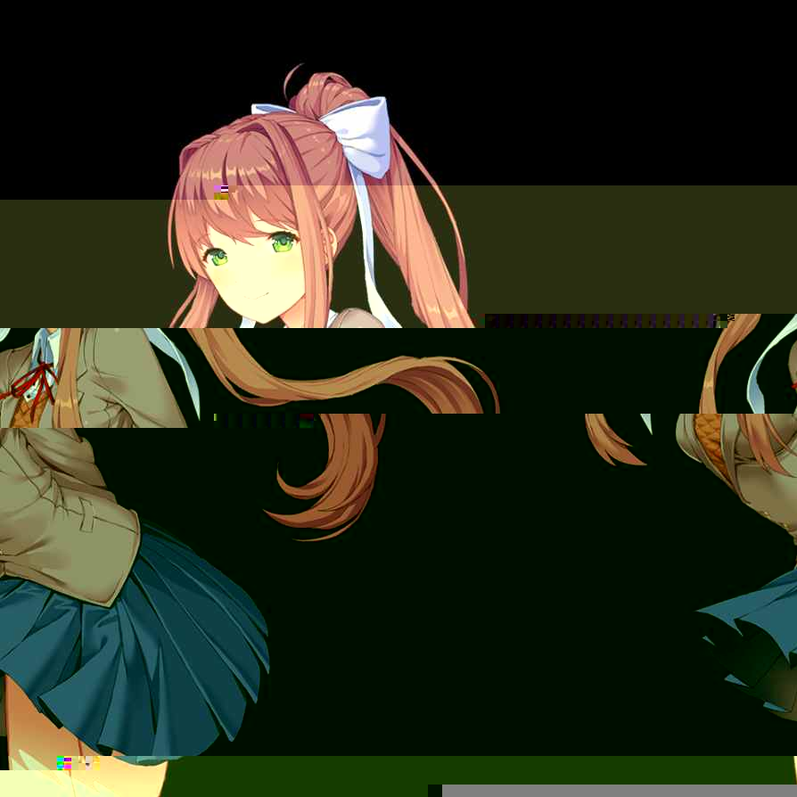

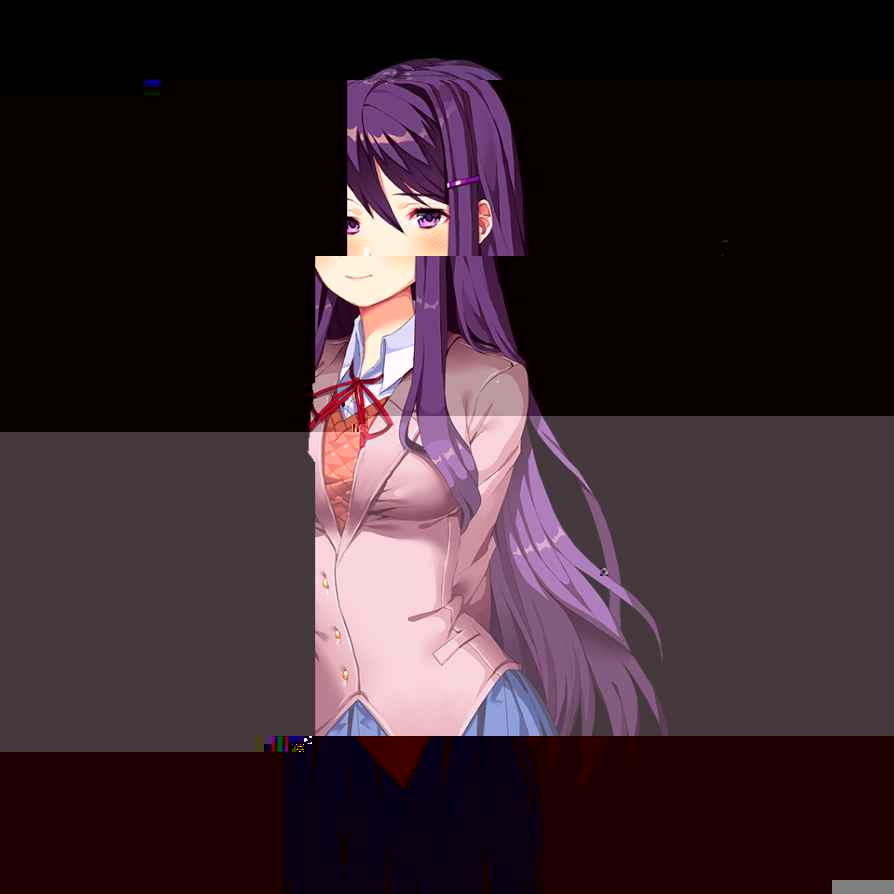

最后跳转到 `ch20_from_ch10`

## 3 ch20_from_ch10

```python
# script-ch20.rpy
label ch20_from_ch10:
    scene bg residential_day
    with dissolve_scene_half
    play music t2
    jump ch20_main2

label ch20_main2:
	"It's an ordinary school day, like any other."
    "Mornings are usually the worst, being surrounded by couples and friend groups walking to school together."
	...
```

`Monika` 刚出现时，立绘会出现几秒钟的撕裂：

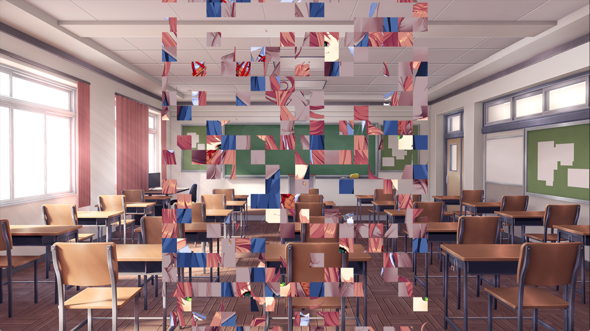

```python
# script-ch20.rpy
label ch20_from_ch10:
	...
    $ m_name = "???"
    m "...[player]?"
    window hide(None)
    show monika g2 zorder 2 at t11
    $ pause(0.75)
	# 撕裂特效
    show screen tear(20, 0.1, 0.1, 0, 40)
    play sound "sfx/s_kill_glitch1.ogg"
    $ pause(0.25)
    stop sound
    hide screen tear
    window show(None)
    show monika 1 zorder 2 at t11
	
    mc "...Monika?"
    $ m_name = "Monika"
    m 1b "Oh my goodness, I totally didn't expect to see you here!"
	...
```

通过 `effects.rpy` 中的 `tear` 实现:

```python
# effects.rpy
screen tear(number=10, offtimeMult=1, ontimeMult=1, offsetMin=0, offsetMax=50, srf=None):
    zorder 150
    add Tear(number, offtimeMult, ontimeMult, offsetMin, offsetMax, srf) size (1280,720)
    on "show" action Function(hide_windows_enabled, enabled=False)
    on "hide" action Function(hide_windows_enabled, enabled=True)

# Tear 类的 render 函数会切出若干条、按偏移量错位重绘，形成撕裂效果
```

回到 `ch20_from_ch10` 中：

```python
label ch20_from_ch10:
	...
	m 1b "Actually, I'm starting a new one!"
	m "A literature club!{nw}"
	# 短暂的一次撕裂特效
    show screen tear(20, 0.1, 0.1, 0, 40)
    window hide(None)
    play sound "sfx/s_kill_glitch1.ogg"
    $ pause(0.25)
    stop sound
    hide screen tear
    window show(None)
    m "A literature club!{fast}"
	...
	scene bg club_day2
    with wipeleft
    play music t3

	# 场景切回到文学部时，有 1/3 的概率播放 monika 的特殊立绘
    if renpy.random.randint(0, 2) == 0:
        show monika g1 at l31
    else:
        show monika 3b at l31
    m "I'm back~!"
    m "And I brought a guest with me!"
	...
```

`Monika` 的特殊立绘定义在 `definitions.rpy` 中，对应的文件是 `monika/g1.png`:

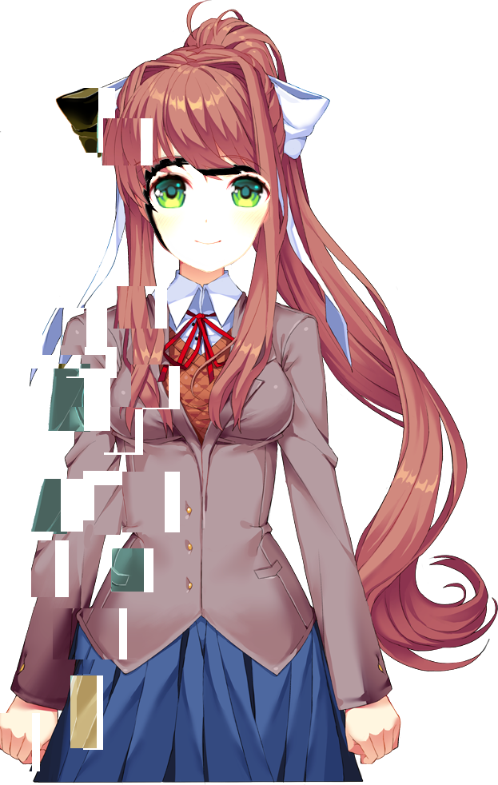

```python
label ch20_from_ch10:
	...
    show yuri 2t zorder 2 at t33
    # 之前 skipping 赋值是 False
    if not config.skipping:
        # yuri 登场时会出现很短的一个反色特效，也是定义在 effects.rpy 中
        show screen invert(0.15, 0.3)
    y "Eh?"
    ...
    # 提示解锁了特殊诗
    call screen confirm("You have unlocked a special poem.\nWould you like to read it?", Return(True), Return(False))
    # 点击了确定，显示 special_poems 数组的第一首诗
    if _return:
        call expression "poem_special_" + str(persistent.special_poems[0])
    else:
        pass
    return
```

`special_poems` 数组在游戏启动时就定义了：

```python
# splash.rpy
label splashscreen:
	...
	if not persistent.special_poems:
        python hide:
    		# 不放回的从 12 首诗中抽 3 首
            persistent.special_poems = [0,0,0]
            a = range(1,12)
            for i in range(3):
                b = renpy.random.choice(a)
                persistent.special_poems[i] = b
                a.remove(b)
```

`return` 回到 `label start` 中 `jump` 到 `playthrough2`:

```python
label start:
	...
	elif persistent.playthrough == 2:
		$ chapter = 0
        call ch20_main
        label playthrough2:
			# playthrough 在之前已经被更改为 2 了
			# 进入写诗环节
			call poem
			# 在目录下会生成 CAN YOU HEAR ME.txt
            python:
                try: renpy.file(config.basedir + "/CAN YOU HEAR ME.txt")
                except: open(config.basedir + "/CAN YOU HEAR ME.txt", "wb").write(renpy.file("CAN YOU HEAR ME.txt").read())
				
```

第一次写诗不会触发特殊事件，正常选择 `Natsuki` 线，左下角不显示 `Sayori` 的小人

```python
# script-poemgame.rpy
label poem(transition=True):
	stop music fadeout 2.0
    if persistent.playthrough == 3: ...
    else:
		# 正常加载 notebook
        scene bg notebook
    show screen quick_menu
	if persistent.playthrough == 3: ...
    else:
		if persistent.playthrough == 0:
            show s_sticker at sticker_left
        show n_sticker at sticker_mid
		if persistent.playthrough == 2 and chapter == 2:
            show y_sticker_cut at sticker_right
		# 此时 chapter 不是 2，展示的是 yuri 的普通小人
        else:
            show y_sticker at sticker_right
```

写诗结束后，游戏目录下会生成 `CAN YOU HEAR ME.txt`:

> "There's a little devil inside all of us."<br>
>Beneath their manufactured perception - their artificial reality - is a
 writhing, twisted mess of dread. Loathing. Judgment. Elitism. Self-doubt.
 All thrashing to escape the feeble hold of their host, seeping through every
 little crevice they can find. Into their willpower, starving them of all
 motivation and desire. Into their stomach, forcing them to drown their guilt in
 comfort food. Or into a newly-opened gash in their skin, hidden only by the
 sleeves of a cute new shirt.
 Such a deplorable, tangled mass is already present in every single one of them.
 That's why I choose not to blame myself for their actions.<br>
> All I did was untie the knot.

## 4 ch21

生成 `CAN YOU HEAR ME.txt` 后进入 `ch21`:

```python
label start:
	elif persistent.playthrough == 2:
	...
	label playthrough2:
	call poem
        python:
            try: renpy.file(config.basedir + "/CAN YOU HEAR ME.txt")
            except: open(config.basedir + "/CAN YOU HEAR ME.txt", "wb").write(renpy.file("CAN YOU HEAR ME.txt").read())

	$ chapter = 1
        call ch21_main
        call poemresponse_start
        call ch21_end
	...
```

```python
label ch21_main:
    scene bg club_day2
    with dissolve_scene_half
    play music t2g3
    show monika 5 zorder 2 at t11
    show layer master:
        subpixel True
        truecenter
        linear 240 rotate 8 zoom 1.30
    m "Hi again, [player]!"
	m "Glad to see you didn't run away on us. Hahaha!"
    mc "Nah, don't worry."
    mc "This might be a little strange for me, but I at least keep my word."
    show monika zorder 1 at thide
    hide monika
    "Well, I'm back at the Literature Club."
    "I was the last to come in, so everyone else is already hanging out."
	# Yuri 出现时面部会发生变化，对应的是 0a 和 0b
    show yuri glitch2 zorder 2 at t32
	...
```

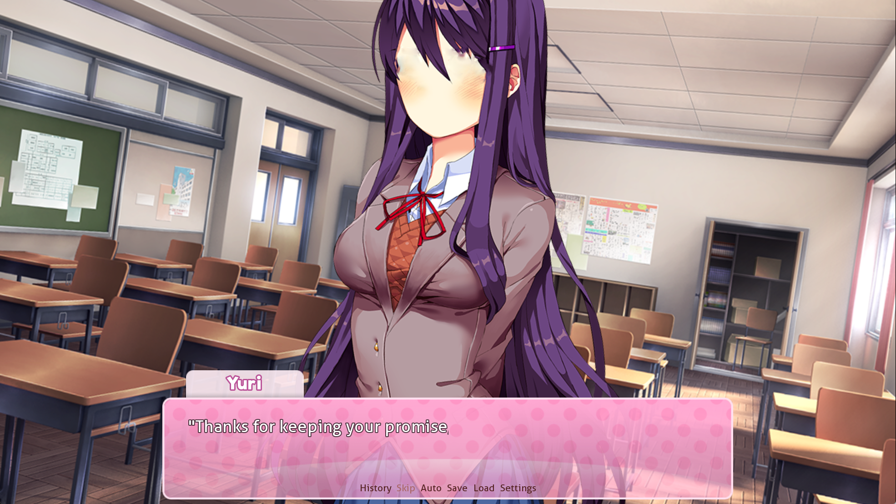

```python
label ch21_main:
	...
	y "Thanks for keeping your promise, [player]."
    y 1a "I hope this isn't too overwhelming of a commitment for you."
    y 1u "Making you dive headfirst into literature when you're not accustomed to it..."
	# Natsuki 出现时播放 glitch1.png
    show natsuki glitch1 zorder 2 at i33
```

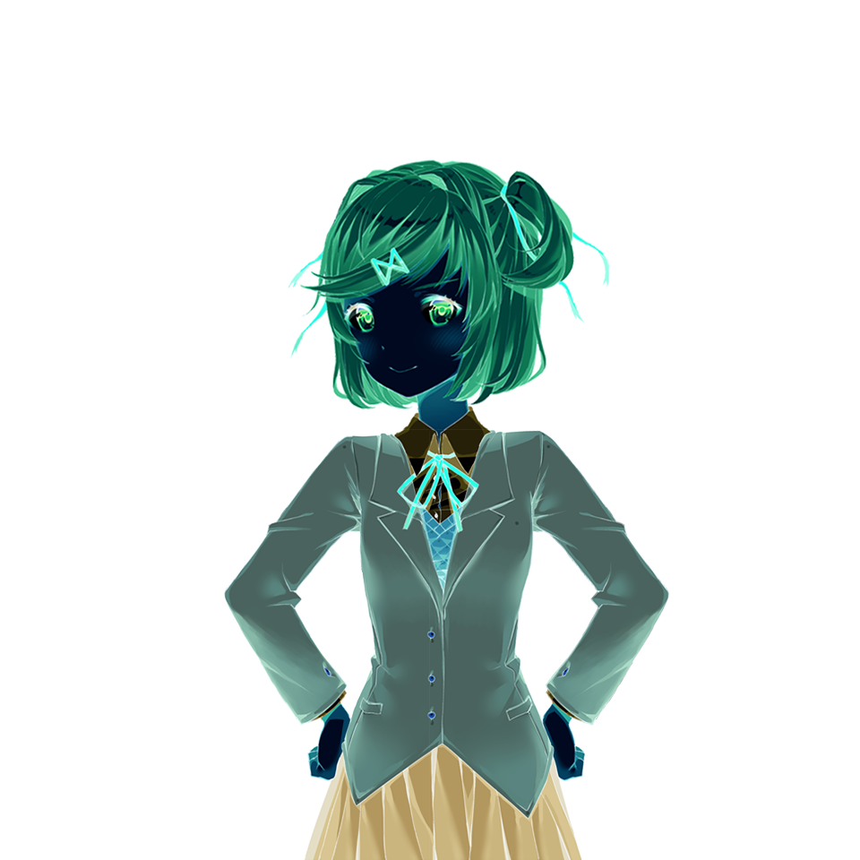

```python
label ch21_main:
	...
	# 进入 natsuki 线
	# natsuki_exclusive2_1
	$ nextscene = poemwinner[0] + "_exclusive2_" + str(eval(poemwinner[0][0] + "_appeal"))
	call expression nextscene
	return
```

```python
# script-exclusives2-natsuki.rpy
label natsuki_exclusive2_1:
    scene bg club_day
    with wipeleft_scene
    n "Ugh...!"
	"I hear Natsuki utter an exasperated sigh from within the closet."
	...
	# normal 是之前的对话框样式
	$ style.say_dialogue = style.normal
    mc "You looking for something in there?"
	# edited 定义在 screens.rpy 中，会增大字间距，同时加上黑色边框
    $ style.say_dialogue = style.edited
    n 4x "fucking monikammmmmmmmmmmmmmmmmmmmmmmmmmmmmmmmmmmmmmmmmmmmmmm"
	$ style.say_dialogue = style.normal
	# 修改历史记录，恢复到正常对话
    $ _history_list[-1].what = "Freaking Monika..."
```

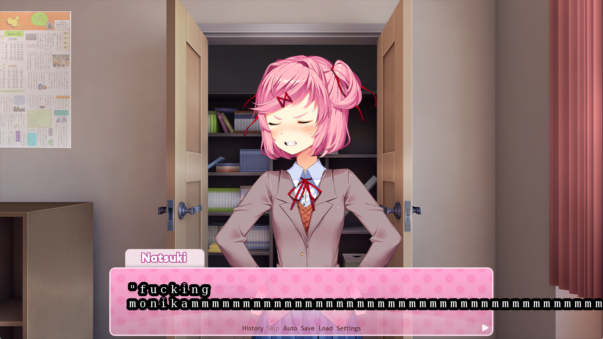

点开历史，发现 `Natsuki` 的台词被改掉了:

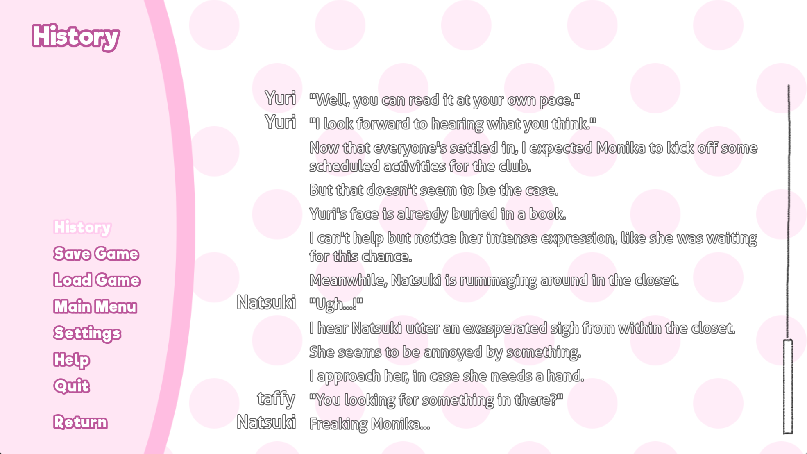

```python
# script-exclusives2-natsuki.rpy
label natsuki_exclusive2_1:
	...
	# {nw} 表示不会等待玩家点击会自动前进
	n 4l "Consider this a lesson straight from the Literature Club:{nw}"
    $ _history_list[-1].what = "Consider this a lesson straight from the Literature Club: Don't judge a book by its cover!"
    $ style.say_dialogue = style.edited
    n "don't judge a bookkkkkkkkkkkkkkkkk kkkkk kk{space=20}k{space=40}k{space=120}k{space=160}k{space=200}k"
    $ style.say_dialogue = style.normal
    # 清除上一条历史记录而不是修改成正常对话
    $ _history_list.pop()
```

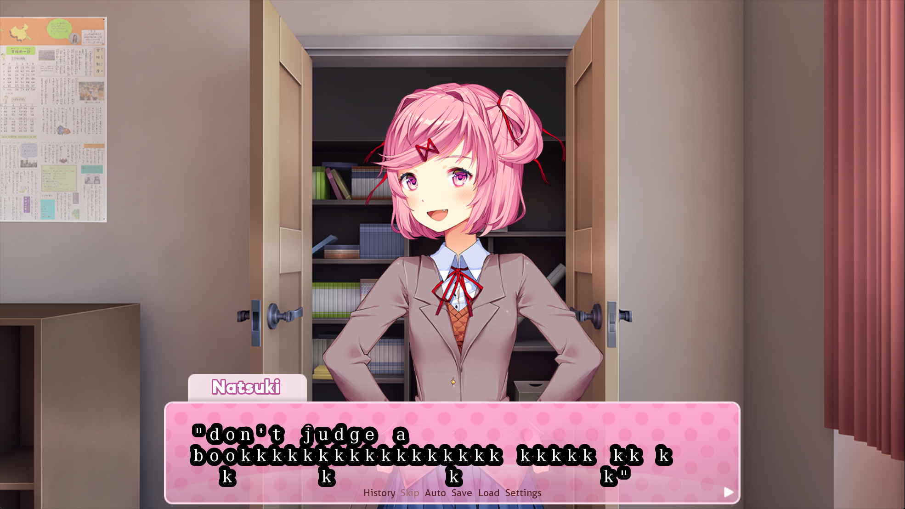

```python
# script-exclusives2-natsuki.rpy
label natsuki_exclusive2_1:
	...
	"I kind of grew out of these, since it's rare for the writing to be entertaining enough to make up for the lack of plot."
	# 标记解锁新的 cg
    $ persistent.clear[0] = True
    $ renpy.save_persistent()
	...
	$ style.say_dialogue = style.normal
    n "I mean, I feel like I can't even keep it in my own room..."
    $ style.say_dialogue = style.edited
    n "My dad would beat the shit out of me if he found this."
    $ style.say_dialogue = style.normal
	# 修改记录
    $ _history_list[-1].what = "I don't even know what my dad would do if he found this."
	...
```

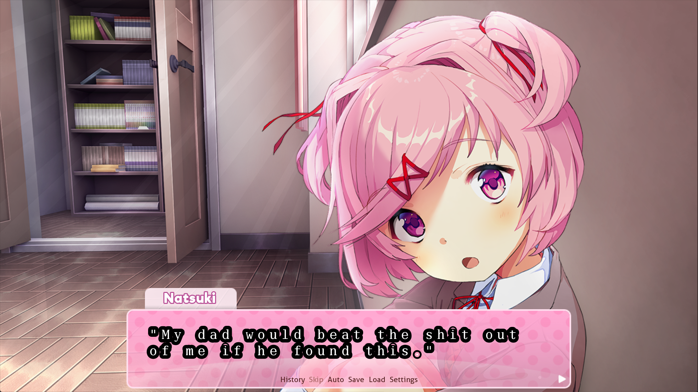

对话向下进行，出现 `Natsuki` 的乱码 `cg`：

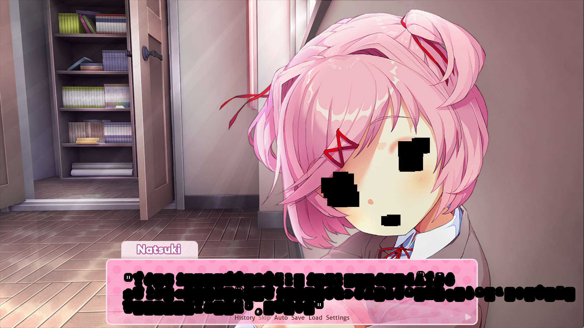

```python
label natsuki_exclusive2_1:
	show n_cg1b
    hide n_cg1_base
    $ currentpos = get_pos()
	# 播放 g(litch) 音频
    $ audio.t6g = "<from " + str(currentpos) + " loop 10.893>bgm/6g.ogg"
    play music t6g
    $ ntext = glitchtext(96)
    $ style.say_dialogue = style.edited
	# 乱码文本加上黑色边框整个变成一坨
    n "{color=#000}[ntext]{/color}"
    $ ntext = glitchtext(96)
    n "{color=#000}[ntext]{/color}"
```

其中 `n_cg1b` 定义在 `cgs.rpy` 中：

```python
# cgs.rpy
# LiveComposite 是 Ren'Py 里将多个图像实时组合在一起的类
# n_rects1, 2, 3 对应 natsuki 脸上的三个黑方块
image n_cg1b = LiveComposite((1280,720), (0,0), "images/cg/n_cg1b.png", (882,325), "n_rects1", (732,400), "n_rects2", (850,475), "n_rects3")

# 2, 3 的定义类似
image n_rects1:
	# RectCluster 是 script-exclusives2-natsuki.rpy 中 init python 里定义的类
    RectCluster(Solid("#000"), 12, 30, 30).sm
    pos (899, 350)
    size (34, 34)
```

`label natsuki_exclusive2_1` 继续向下进行 `return` 至 `ch21_main`，再 `return` 到 `start`:

```python
label start:
	...
	$ chapter = 1
            call ch21_main
			# 进入分享
            call poemresponse_start
            call ch21_end
```

```python
# script-poemresponses.rpy
# 注意此时的 playthrough == 2
label poemresponse_start:
    $ poemsread = 0
    $ skip_transition = False
	...
	label poemresponse_start2:
        $ skip_poem = False
        if persistent.playthrough == 2:
			# 这次 pt 不是 "" 而是 2 了
            $ pt = "2"
		...

		menu:
            "[menutext]"
			# Sayori 选项仅在 playthrough == 0 出现
            "Sayori" if not s_readpoem and persistent.playthrough == 0: ...
			# 选择 Natsuki/Yuri/Monika 分别 call 对应的 poemresponse_natsuki
			"Natsuki" if not n_readpoem:
                $ n_readpoem = True
                if chapter == 1 and poemsread == 0: ...
                call poemresponse_natsuki
			...
```

首先选 `Natsuki`，进入 `poemresponse_natsuki`:

```python
label poemresponse_natsuki:
	# 这次进入的是 ch21_n_good
	$ nextscene = "ch" + pt + str(chapter) + "_n_" + poemopinion
    call expression nextscene
```

```python
# script-poemresponses2.rpy
label ch21_n_good:
    jump ch1_n_good

# script-poemresponses.rpy
label ch1_n_good:
	n "..."
    mc "...?"
    n 1t "...Okay, well let's start with the things I don't like!"
	...
	# return 到 poemresponse_start
	return

# 接着进入 ch21_n_end, 类似地跳转到 ch1_n_end
```

选择其他角色类似，略过，最后 `return` 到 `start` 中 `call ch21_end`:

```python
label ch21_end:
    stop music fadeout 1.0
    scene bg club_day2
    with wipeleft_scene
	# 播放的是 g 版本的音乐
    play music t3g
    queue music t3g2
    mc "Phew..."
	...
	ny "This doesn't involve you!"
    show monika at lhide
    hide monika
    show yuri 2h zorder 2 at f21
    show natsuki zorder 2 at t22
    queue music t7g
    $ timeleft = 12.453 - get_pos()
	# yuri 和 natsuki 吵架
	# 给图像加噪声，闪烁，抖动等特效
    show noise zorder 3 at noisefade(25 + timeleft)
    show vignette as flicker zorder 4 at vignetteflicker(timeleft)
    show vignette zorder 4 at vignettefade(timeleft)
    show layer master at layerflicker(timeleft)
    y "Taking out your own insecurities on others like that..."
```

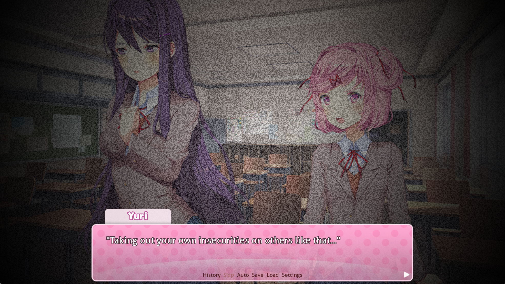

```python
label ch21_end:
	...
	# 继续向下进行，又会出现不等待的乱码对话
	n "She started it!"
    show yuri 1t zorder 2 at t21
    show natsuki 1g zorder 2 at t22
    $ style.say_dialogue = style.normal
    mc "..."
    $ style.say_dialogue = style.edited
    "{cps=*2}How did I get dragged into this in the first place?!{/cps}{nw}"
    "{cps=*2}It's not like I know anything about writing...{/cps}{nw}"
    "{cps=*2}But whomever I agree with, they'll probably think more highly of me!{/cps}{nw}"
    "{cps=*2}So, of course that's going to be...!{/cps}{nw}"
    $ style.say_dialogue = style.normal
	...
```

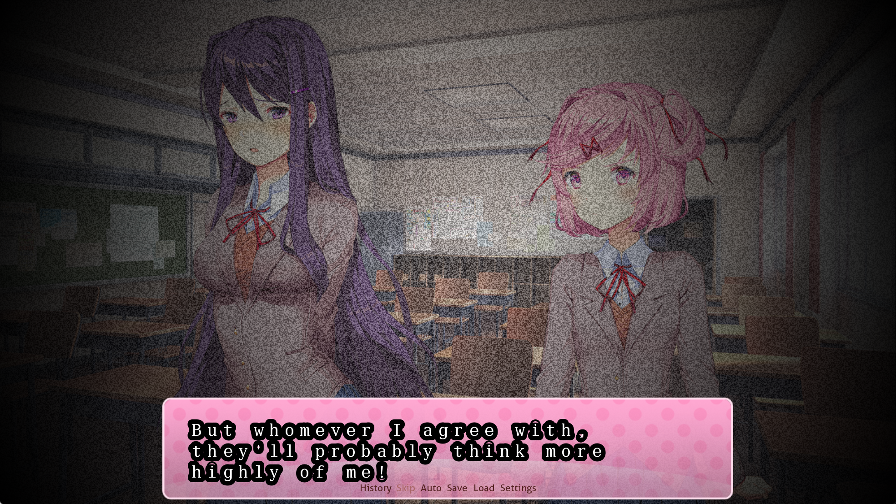

```python
label ch21_end:
	...
	$ menu_clicked = 0
    window hide(None)
	# 乱码对话演出结束后弹出对话框，选择任意一个都会进入相同的 menu_click
    label ch21_end_menu:
        menu:
            "Natsuki.":
                jump menu_click
            "Yuri.":
                jump menu_click
	
	label menu_click:
        $ srf = screenshot_srf()
        show layer screens:
            truecenter
            zoom 1.00
        show screen tear(20, 0.1, 0.1, 0, 40, srf)
        play sound "sfx/s_kill_glitch1.ogg"
        $ pause(0.25)
        hide screen tear
        stop sound
		# 每次进入 menu_click 将 menu_clicked +1
        $ menu_clicked += 1
        if menu_clicked < 9:
			# menu_clicked < 9 时，每次点击都会放大屏幕
            show layer master:
                truecenter
                zoom 1.00 + menu_clicked * menu_clicked * 0.06
                yalign 0.25
            show layer screens:
                truecenter
                zoom 1.00 + menu_clicked * menu_clicked * 0.06
                yalign 0.25
            # 回到 ch21_end_menu 除非点击数满足条件
            jump ch21_end_menu

	# 点击次数满足后继续向下
	window show(None)
	# 音乐停止
    stop music
	# menu_clicked 设置为 8，一次性应用和点击 8 次后一样的放大效果
    $ menu_clicked = 8
    $ quick_menu = False
    show layer master:
        truecenter
        zoom 1.00 + menu_clicked * menu_clicked * 0.06
        yalign 0.25
    show layer screens:
        truecenter
        zoom 1.00 + menu_clicked * menu_clicked * 0.06
        yalign 0.25
	# 展示 monika 大头照
	# onlayer 将 monika 放在最上层
    show monika 1 onlayer front at i11:
        zoom 1.00 + menu_clicked * menu_clicked * 0.06
        yalign 0.25
```

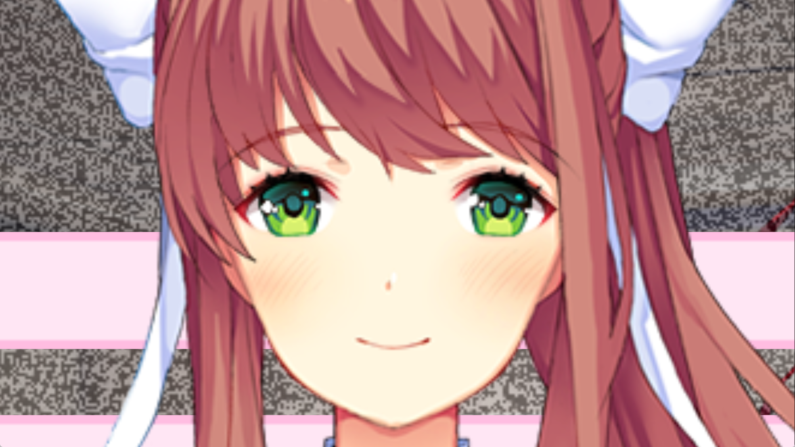

```python
label ch21_end:
	...
	# monika 身后两个选项框对应的都是 True，且 interact=False，表示无需玩家选择
	$ renpy.display_menu(items=[('Natsuki.', True), ('Yuri.', True)], interact=False, screen='choice')
    m "..."
    $ renpy.display_menu(items=[('Natsuki.', True), ('Yuri.', True)], interact=False, screen='choice')
    m "..."
    show monika 1m onlayer front at i11
    $ renpy.display_menu(items=[('Natsuki.', True), ('Yuri.', True)], interact=False, screen='choice')
    m "Um..."
    $ renpy.display_menu(items=[('Natsuki.', True), ('Yuri.', True)], interact=False, screen='choice')
    m "Hey, [player]..."
    show monika 1e onlayer front at i11
    $ renpy.display_menu(items=[('Natsuki.', True), ('Yuri.', True)], interact=False, screen='choice')
    m "Why don't we\nstep outside for\na little bit?"
    $ renpy.display_menu(items=[('Natsuki.', True), ('Yuri.', True)], interact=False, screen='choice')
    m "Okay?"
	...
	m 1d "I guess I don't really have a choice, do I?"
    show monika zorder 2 at t31
    show yuri zorder 3 at f32
    y 1t "I-I'm sorry for causing trouble..."
	# 生成乱码文本
    $ gtext = glitchtext(20)
	# 自动进行
    y 1s "But I really appreciate you understan{nw}"
    play music g1
	# monika 移动到图层最上方
    show monika 1 onlayer front at i31
	# understan 后面均为乱码
    y glitch "But I really appreciate you understan{fast}[gtext] [gtext][gtext]{nw}"
	# 删除历史记录
    $ _history_list.pop()
    hide monika onlayer front
    window hide(None)
    window auto
    # return 到 start
    return
```

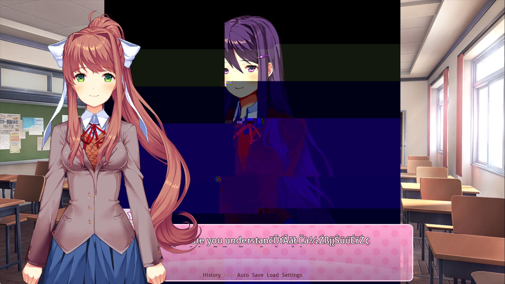

```python
label start:
    elif persistent.playthrough == 2:
        label playthrough2:
            # ch1 结束
            $ chapter = 1
                call ch21_main
                call poemresponse_start
                call ch21_end
    
            # 进入下一次写诗, False 表示无过渡动画，刚才在 yuri 乱码对话位置瞬间切入到写诗界面
            call poem (False)
            python:
                try: renpy.file(config.basedir + "/iiiiiiiiiiiiiiiiiiiiiiiiiiiiiiiiiiiiiiiiiiiiiiii.txt")
                except: open(config.basedir + "/iiiiiiiiiiiiiiiiiiiiiiiiiiiiiiiiiiiiiiiiiiiiiiii.txt", "wb").write(renpy.file("iiiiiiiiiiiiiiiiiiiiiiiiiiiiiiiiiiiiiiiiiiiiiiii.txt").read())	
```

开始写诗

```python
# script-poemgame.rpy
label poem(transition=True):
	stop music fadeout 2.0
    if persistent.playthrough == 3: ...
    else:
		# 正常加载 notebook
        scene bg notebook
    show screen quick_menu
	if persistent.playthrough == 3: ...
    else:
		if persistent.playthrough == 0:
            show s_sticker at sticker_left
		show n_sticker at sticker_mid
		if persistent.playthrough == 2 and chapter == 2:
            show y_sticker_cut at sticker_right
		# 此时 chapter 不是 2，展示的是 yuri 的普通小人
        else:
            show y_sticker at sticker_right

	python:
        poemgame_glitch = False
        played_baa = False
		...
		while True:
			if persistent.playthrough == 2 and chapter == 2: ...
			else:
				# 上方正常计数
				pstring = str(progress)
			for j in range(2):
                if j == 0: x = 440
                else: x = 680
                ui.vbox()
                for i in range(5):
                    if persistent.playthrough == 3: ...
					# 满足 playthrough == 2，以及 chapter >= 1，此时有 1/401 概率出现乱码词了
                    elif persistent.playthrough == 2 and not poemgame_glitch and chapter >= 1 and progress < numWords and random.randint(0, 400) == 0:
						# 长度为 80 的乱码词
                        word = PoemWord(glitchtext(80), 0, 0, 0, True)
                    else:
                        word = random.choice(wordlist)
                        wordlist.remove(word)
                    ui.textbutton(word.word, clicked=ui.returns(word), text_style="poemgame_text", xpos=x, ypos=i * 56 + ystart)
                ui.close()
```

保存多刷几次直到出现乱码词(仍然选 `Natsuki` 喜欢的词)：

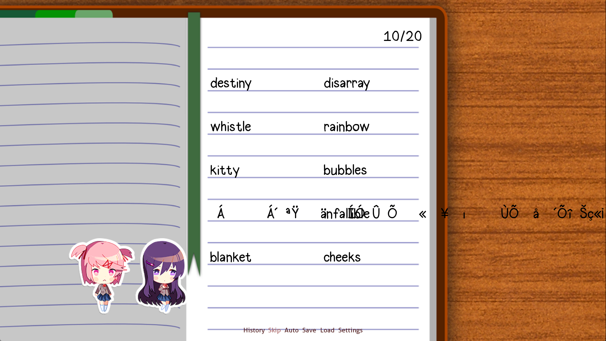

点击乱码词，触发新的逻辑：

```python
label poem(transition=True):
	...
	python:
		...
		while True:
			...
			# t 是交互的词
			t = ui.interact()
			if not poemgame_glitch:
				# 如果点击的词是乱码
                if t.glitch:
                    poemgame_glitch = True
                    renpy.music.play(audio.t4g)
                    renpy.scene()
					# 背景纯白
                    renpy.show("white")
					# 显示 y_sticker glitch
                    renpy.show("y_sticker glitch", at_list=[sticker_glitch])
```

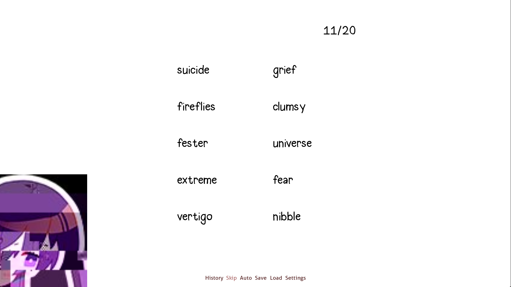

选择 `Natsuki` 喜欢的词结束写诗，游戏目录下会生成 `iiiiiiiiiiiiiiiiiiiiiiiiiiiiiiiiiiiiiiiiiiiiiiii.txt`:

> I hate this.<br><br><br><br>
> I CAN'T DO ANYTHING. NOTHING.
> No matter how many times you play. It's all the same.
> It would be really, really easy to kill myself right now. But that would mean I don't get to talk to you anymore.
> All I want is for you to hate them. Why is that so hard?

回到 `start`，进入 `ch2`

## 5 ch22 

```python
label start:
	elif persistent.playthrough == 2:
		label playthrough2:
			$ chapter = 2
        call ch22_main
        call poemresponse_start
        call ch22_end
```

首先进入 `ch22_main`，此时 `chapter = 2`:

```python
# script-ch22.rpy
label ch22_main:
    scene bg club_day2
    with dissolve_scene_half
    play music t6
    "Another day passes, and it's time for the club meeting already."
    "I've gotten a little more comfortable here over the past couple days."
    "Entering the clubroom, the usual scene greets me."
    # 之前说过，角色立绘是由左右两部分拼起来的
    # 这里有 1/3 的概率显示只有一半的 yuri
    if renpy.random.randint(0,2) == 0:
        show yuri half zorder 2 at i11
        show yuri_half2 zorder 1 at i11
    else:
        show yuri 1s zorder 2 at t11
```

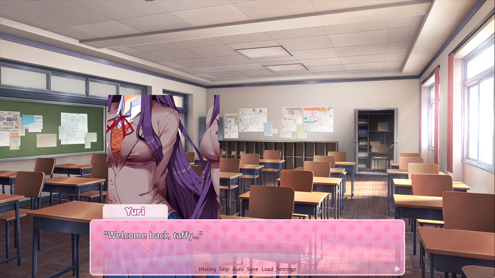

对话向下进行，再次出现修改过的台词：

```python
# script-ch22.rpy
label ch22_main:
	...
	n "Did you do something yesterday?"
    show natsuki zorder 2 at t33
    show yuri zorder 3 at f32
    y 3f "...Eh?"
    show yuri zorder 2 at t32
    show natsuki zorder 3 at f33
    $ style.say_dialogue = style.normal
    n 2a "Jeez..."
    $ style.say_dialogue = style.edited
    n "Whatever's on your mind, I'm sure it was nothing."
    n "I don't even remember anything bad happening."
    n "You're the kind of person who worries too much about the little things, aren't you?"
	...
	# 这次没有对历史记录做处理，可以看到
```

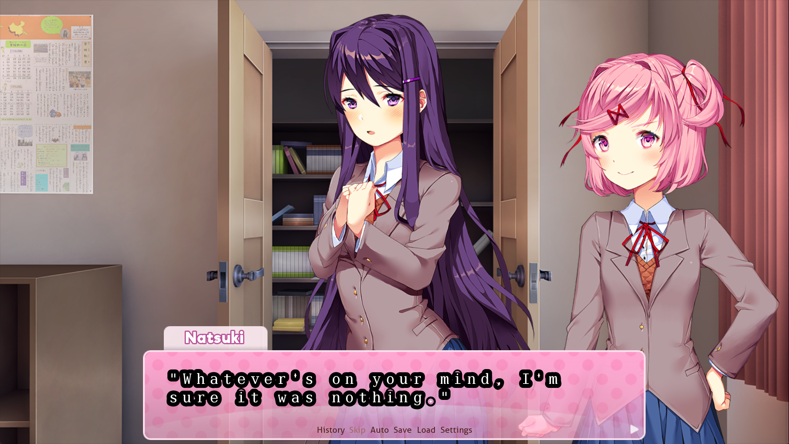

接着有 $1/4$ 几率触发对话：

```python
# script-ch22.rpy
label ch22_main:
	...
	y 2o "..."
    y "B-But..."
    show yuri zorder 2 at t32
    if renpy.random.randint(0, 3) == 0:
        $ style.say_dialogue = style.edited
		# natsuki mouth 定义在 definitions.rpy 中，同样的是 LiveComposite 将眼睛位置的两个黑方块和面部结合在一起 (为什么要命名为 mouth?)
        show natsuki mouth as nm zorder 3 at i33
		# n_moving_mouth 在 images/natsuki/mouth.png 下，添加了缩放动画实现张嘴效果
        show n_moving_mouth zorder 3:
            xoffset 400
        n 2a "mibulls sailcloth blindsight lifeline anan rectipetality faultlessly offered scleromalacia neighed catholicate"
        hide nm
        hide n_moving_mouth
        $ style.say_dialogue = style.normal
```

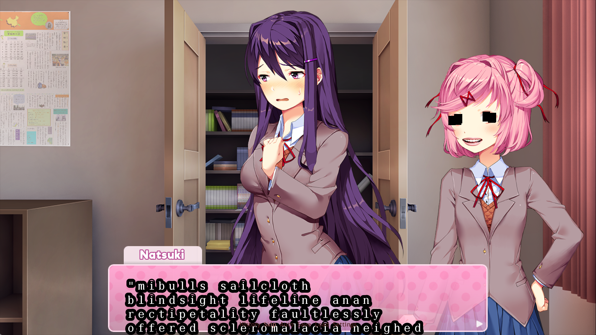

正常向下进行：

```python
# script-ch22.rpy
label ch22_main:
	...
	y "Since your compliments put me in a good mood..."
    y "I was wondering if you would like to spend some time together today."
    y 3o "I mean--in the club!"
	if poemwinner[0] == "natsuki":
		$ y_appeal = 1
        mc "Ah, I suppose so."
        mc "I don't think I could say no to you, after you gave that book to me."
        mc "Well, I guess I need to make sure Natsuki isn't waiting for me."
        mc "After we finished reading yesterday, she--"
        if n_appeal >= 2:
            y 3r "She's fine!"
			$ style.say_dialogue = style.normal
            y 3h "She's reading over there. See?"
			# 带边框的对话
            $ style.say_dialogue = style.edited
            y 3f "Don't think about her so much."
            ...
			# 跳转到 ch22_main2
            jump ch22_main2
```

`Monika` 提醒你不要一直想着 `Natsuki`, 将 `poemwinner` 换成了 `Yuri`：

```python
# script-ch22.rpy
label ch22_main2:
    if n_poemappeal[1] == 1:
        $ n_poemappeal[1] = 0
    $ poemwinner[1] = "yuri"
    
    scene bg club_day2
    show yuri 3a at i11
    with wipeleft
    # call yuri_exclusive2_1_ch22
    $ nextscene = "yuri_exclusive2_" + str(eval("y_appeal")) + "_ch22"
    call expression nextscene

	return
```

```python
# script-exclusives2-yuri.rpy
label yuri_exclusive2_1_ch22:
	mc "What's the story about, anyway?"
	...
	$ style.say_dialogue = style.normal
    y "When horrible things happen not just because someone wants to be evil..."
    $ style.say_dialogue = style.edited
    y "But because the world is full of horrible people, and we're all worthless anyway."
	# 不等待玩家点击自动进行
    y "Then, suddenlyyyyyyyyyyyyyyyyyyyyyy yyyyyyyyyyyyyyyyyyyy{nw}"
	$ style.say_dialogue = style.normal
    y 3v "I'm...I'm rambling, aren't I...?"
	...
	$ style.say_dialogue = style.normal
    y "When I let things like books and writing fill my thoughts..."
	# 乱码文本
    $ gtext = glitchtext(24)
    $ style.say_dialogue = style.edited
    y "my whole body gets incredibly [gtext]{nw}"
    $ style.say_dialogue = style.normal
	# 删除历史记录
    $ _history_list.pop()
    y "I kind of forget to pay attention to other people..."
	...
	mc "I might as well get started reading it, right?"
    play sound "sfx/glitch3.ogg"
    y dragon "Y-Yes!"
	y 3n "I-I mean, you don't have to, but...!"
```

`y dragon` 对应的图片是 `yuri/dragon`，定义在 `definitions.rpy` 中，`0.55s` 后就会恢复正常立绘：

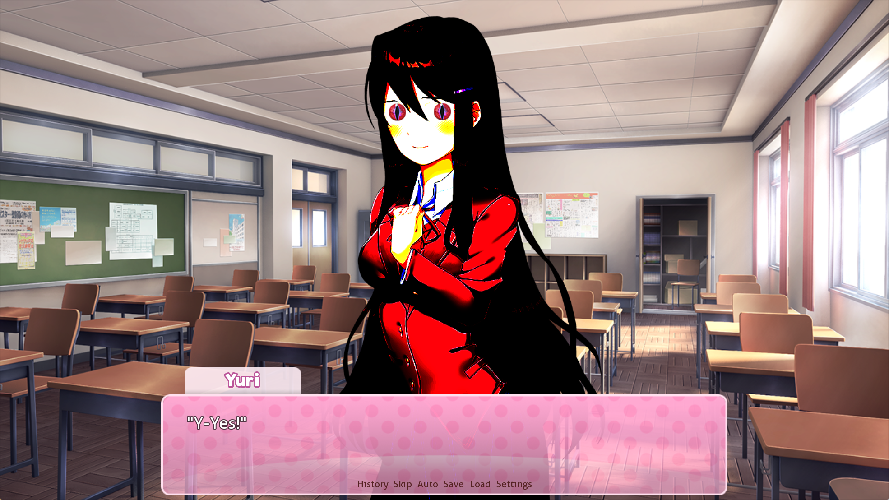

对话继续向下：

```python
label yuri_exclusive2_1_ch22:
	...
	# 同样的不等待演出 + 删除历史记录
	y "I was just--!{nw}"
    $ style.say_dialogue = style.edited
    y "I was just{fast} bathing in the feeling of your body heat tttttttttttttheat eattttttt{nw}"
    $ style.say_dialogue = style.normal
    $ _history_list.pop()

	mc "Yuri, you really apologize a lot, don't you?"
	...
	# 解锁新的 cg
	$ persistent.clear[2] = True
    $ renpy.save_persistent()
	...
	"I stand up."
    "I make a mental note of where I left off in the book, then slip it back into my bag."
	# 创建了 y_ranaway 变量
    $ y_ranaway = True
	# 向上 return 到 ch22_main2，再向上 return 到 start call poemresponse_start
    return
```

进入分享诗的环节：

```python
label poemresponse_start:
	$ poemsread = 0
    $ skip_transition = False
	# 播放 bgm 的 loop
	label poemresponse_loop: ...
	label poemresponse_start2:
	# playthrough == 2
	if persistent.playthrough == 2:
            $ pt = "2"
	...
	menu:
            "[menutext]"
			# 上面令 y_ranaway 为 True 了，因此这轮只有 Natuski 和 Monika 两个选项
			"Yuri" if not y_readpoem and not y_ranaway: ...

	...
	return
```

选择 `Natsuki`:

```python
label :
    scene bg club_day
    show natsuki 1c zorder 2 at t11
    with wipeleft_scene
    $ poemopinion = "med"
	# 刚才 Monika 更改 winner 的时候将 n_poemappeal 变成了 0
	# poemopinion 保持 med
    if n_poemappeal[chapter - 1] < 0:
        $ poemopinion = "bad"
    elif n_poemappeal[chapter - 1] > 0:
        $ poemopinion = "good"
	# 进入 ch22_n_med
    $ nextscene = "ch" + pt + str(chapter) + "_n_" + poemopinion
	if not skip_poem:
		# 继续向下
        $ nextscene = "ch" + pt + str(chapter) + "_n_end"
        call expression nextscene
    return
```

```python
label ch22_n_med:
	# Monika 修改的是 n_poemappeal[1] 的值
	if n_poemappeal[0] < 0: ...
	elif n_poemappeal[0] == 0: ...
	else:
		n "...Hm."
        n 2c "Well, it's not terrible."
		...
		label ch22_n_med_shared2:
            n 2c "Fair enough. You're still new to this, so I wouldn't expect you to find your style right away."
			...
		# return 到 poemresponse_natsuki
		return
```

进入 `ch22_n_end`:

```python
label ch22_n_end:
	# 满足条件进入 ch22_n_end2
    if n_appeal >= 2:
        jump ch22_n_end2

label ch22_n_end2:
	# 展示的是一首用 base64 编码的诗
	call showpoem (poem_n2b, revert_music=False)
	# edited 版本的对话
	$ style.say_dialogue = style.edited
	...
    n 1g "[player]..."
    n "Why didn't you come read with me today?"
    n 1m "I was waiting for you."
	...
```

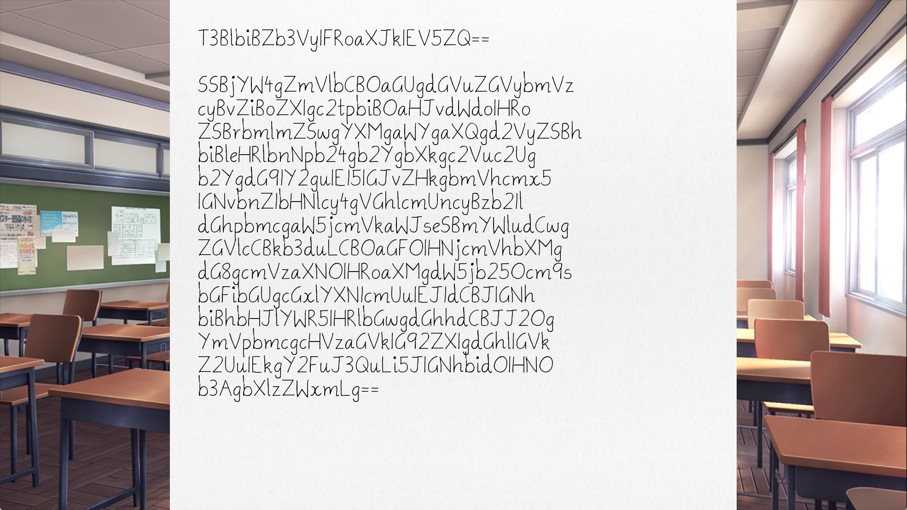

> **Open Your Eye**
> I can feel the tenderness of her skin through the knife, as if it were an extension of my sense of touch. My body nearly convulses. There’s something incredibly faint, deep down, that screams to resist this uncontrollable pleasure. But I can already tell that I’m being pushed over the edge. I can’t…I can’t stop myself.

```python
label ch22_n_end2:
	...
	n 1k "I think you're better off not associating with her."
    n "Are you listening to me?"
	# 屏幕逐渐暗下来
    show darkred zorder 5:
        alpha 0.0
        easein 4.0 alpha 1.0
    $ currentpos = get_pos(channel="music_poem")
	...
	# 动态渲染三个黑方块
	show n_rects_ghost1 zorder 4
    show n_rects_ghost2 zorder 4
    show n_rects_ghost3 zorder 4
	# ghost1 是没有五官的 natsuki 的立绘
	n ghost1 "Yuri is a sick freak."
	...
    n "Do you hate me?"
	# natsuki_ghost_blood 是血泪的素材图
	show natsuki_ghost_blood zorder 3
	n "Do you want to make me go home crying?"
	...
	stop music
	# 隐藏 n_rects_ghost3
    hide n_rects_ghost3
	# ghost2 是有嘴巴的立绘
    n ghost2 "PLAY WITH ME!!!"
	$ style.say_dialogue = style.normal
    $ quick_menu = False
	# 暂停 1s
    $ pause(1)
	# 播放脖子扭断的音效
    play sound "sfx/crack.ogg"
	...
	# 脖子扭过来后新渲染的黑方块
	show n_rects_ghost4 onlayer front zorder 4
    show n_rects_ghost5 onlayer front zorder 4
	# 暂停 0.5s 后 natsuki 向屏幕前移动
    $ pause(0.5)
    hide natsuki
    play sound "sfx/run.ogg"
    show natsuki ghost4 onlayer front at i11
	...
	# return 到 poemresponse_start
	return
```


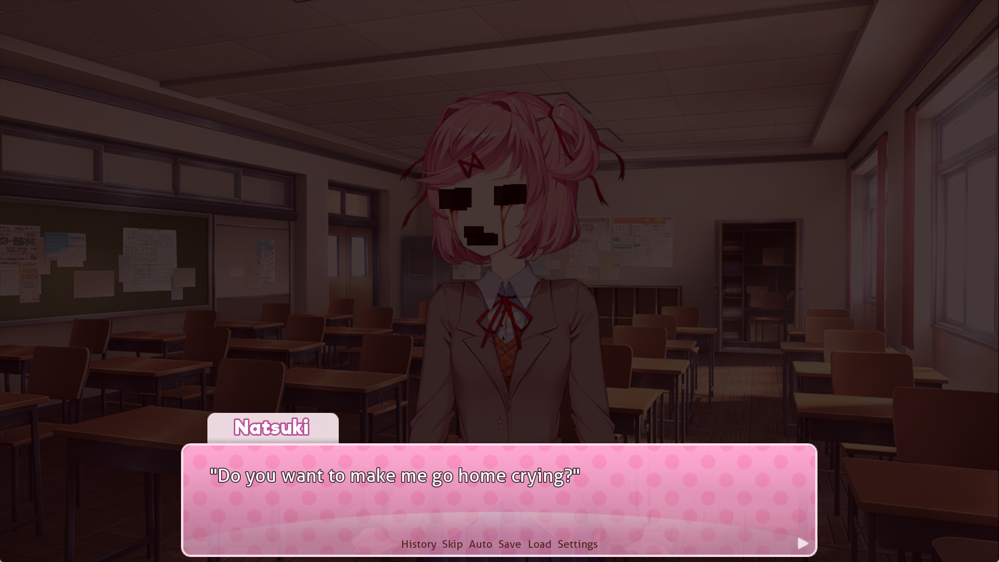


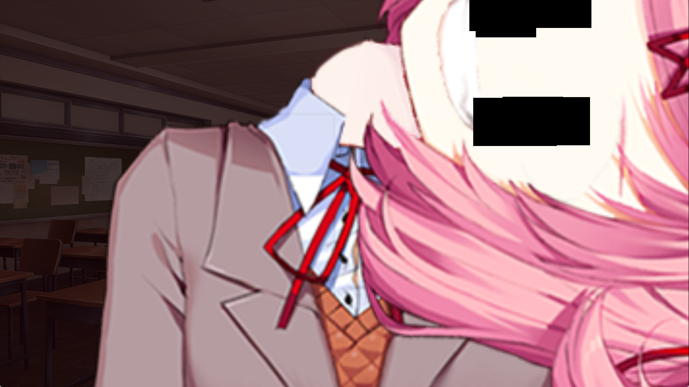

选择 `Monika`，进入 `ch22_m_start`

```python
label ch22_m_start:
    if y_appeal < 2:
        m 1b "Hi again, [player]!"
        m "How's the writing going?" 
	...
	# 进入 m2_yuri_1
    $ nextscene = "m2_yuri_" + str(eval("y_appeal"))
    call expression nextscene
    m 1a "But anyway..."
    m "You want to read my poem now?"
    m "I like the way this one turned out, so I hope you do too~"
    return
```

```python
label m2_yuri_1:
    m 1a "Great job, [player]!"
    m "I was going 'Ooh' in my head while reading it."
	...
	# y_ranaway 回到 False
	$ y_ranaway = False
	# return 到 ch22_m_start 再 return 到 poemresponse_monika，进入 ch22_m_end
    return
```

```python
label ch21_m_end:
	# 展示诗
	call showpoem (poem_m22, revert_music=False)
    $ currentpos = get_pos(channel="music_poem")
    $ audio.t5c = "<from " + str(currentpos) + " loop 4.444>bgm/5.ogg"
    stop music_poem fadeout 2.0
	...
    m "Anything."
    # 弹出“帮帮我”对话框，点击后正常向下进行
    $ renpy.call_screen("dialog", "Please help me.", ok_action=Return())
    m 3k "...That's my advice for today!"
    m "Thanks for listening~"
    return
```

`return` 到 `poemresponse_start`，刚才 `y_runaway` 变成了 `False`，因此又出现了 `Yuri` 的选项，对话结束后跳转到 `yuri_22_end`，均为正常对话，跳过

`return` 到 `start`, `call ch22_end`:

```python
label ch22_end:
    stop music fadeout 1.0
    scene black
    with wipeleft_scene
    # 提示解锁了特别诗
    call screen confirm("You have unlocked a special poem.\nWould you like to read it?", Return(True), Return(False))
	...
	# 1/3 几率出现红屏特效
	if not faint_effect and renpy.random.randint(0,2) == 0:
        $ faint_effect = True
    else:
        $ faint_effect = None
    scene bg club_day2
    show monika 4b zorder 2 at t32
    if faint_effect: ...
	# 1/3 出现特殊光标
	if renpy.random.randint(0,2) == 0:
        $ config.mouse = {"default": [
                                    ("gui/mouse/s_head2.png", 0, 0),
                                    ...
                                    ]}
    m "Okay, everyone!"
    m "We're all done reading each other's poems, right?"
    # 鼠标恢复正常
    $ config.mouse = None
	...
```

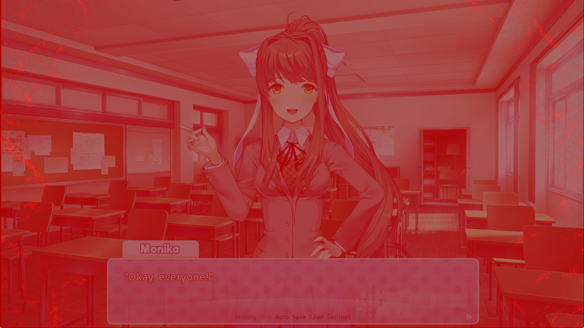

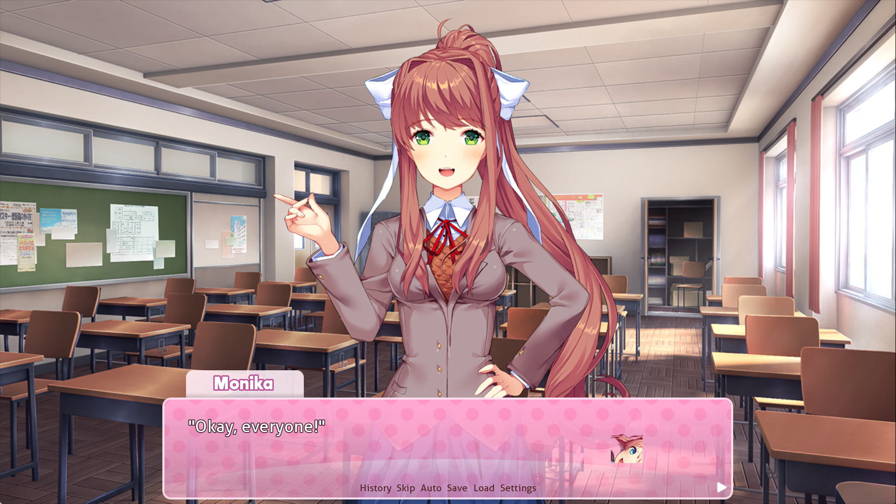

```python
label ch22_end:
	...
	n "We'll just end up embarrassing ourselves instead of getting any new members."
	# 如果之前触发了红屏特效，这里会黑屏
    if faint_effect:
        $ currentpos = get_pos() + 2.0
        stop music fadeout 2.0
        show black onlayer front:
            alpha 0.0
            linear 2.0 alpha 1.0
	...
	y "I'm kind of indifferent, I guess..."
    show black zorder 3
	# 显示 yuri 的 glitch 头像
    show y_glitch_head zorder 3:
        xpos 630 ypos -50 zoom 2.0
	# edited 对话
    $ style.say_dialogue = style.edited
    $ currentpos = get_pos() / 2.07
    play music "<from " + str(currentpos) + " loop 1.532>bgm/9g.ogg"
    y "Who cares about that obnoxious brat?"
```

`y_glitch_head` 有四帧图像，每 `0.15s` 切一次:

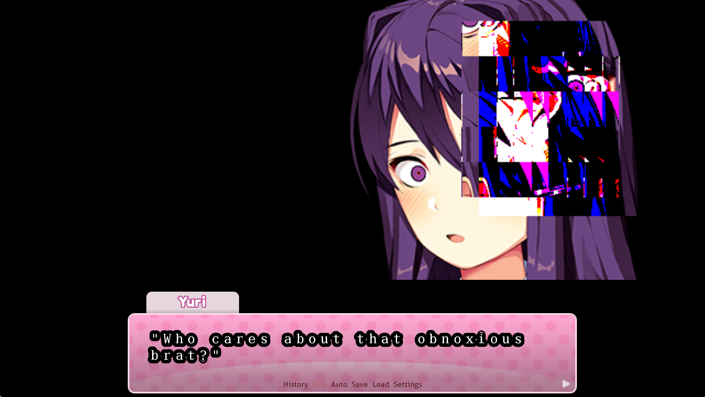

```python
label ch22_end:
	...
	# 向下进行到第二次出现 y_glitch_head
	show y_glitch_head zorder 3:
        xpos 430 ypos -450 zoom 4.5
    $ style.say_dialogue = style.edited
    $ currentpos = get_pos() / 2.07
    play music "<from " + str(currentpos) + " loop 1.532>bgm/9g.ogg"
    y "Nobody would cry if she killed herself."
    $ style.say_dialogue = style.normal
    $ currentpos = get_pos() * 2.07
    stop music
    # 暂停音乐 0.5s 后播放插眼音效
    $ pause(0.5)
    play sound "sfx/stab.ogg"
    # 显示 blood_eye
    show blood_eye zorder 3:
        pos (710,380) zoom 2.5
    $ pause(0.75)
```

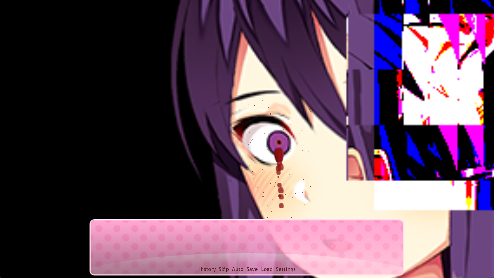

```python
label ch22_end:
	...
	y "I really agree with you."
	# 第二次出现血泪
    show blood_eye2 zorder 3:
        pos (568, 165)
	...
	show monika 2a zorder 2 at t11
    m "Phew..."
    m 2e "Things have been a bit hectic lately, haven't they?"
	# 屏幕变暗出现噪声
    show darkred:
        additive 0.2
        alpha 0
        linear 20 alpha 1.0
    show noise:
        alpha 0
        linear 20 alpha 0.1
    m "[player], I just wanted to make sure you're enjoying your time at this club."
    ...
    stop music fadeout 3.0
    show black onlayer front:
        alpha 0.0
        0.25
        linear 3.0 alpha 1.00
	# 向黑屏过渡，自动演出
    m "So that's why--\"{space=5000}{w=0.75}{nw}"
    m 1g "Wait, not yet!\"{space=5000}{w=0.5}{nw}"
    m "No!\"{space=5000}{w=0.5}{nw}"
    m "Stop it!\"{space=5000}{w=1.0}{nw}"
	...
	return
```

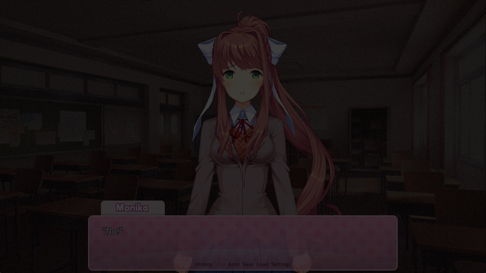

`return` 到 `start`，在 `chapter = 2` 最后 `call` 无过渡动画的 `poem`:

```python
label start:
	elif persistent.playthrough == 2:
		label playthrough2:
			$ chapter = 2
            call ch22_main
            call poemresponse_start
            call ch22_end
            call poem (False)
```

进入写诗环节：

```python
# script-poemgame.rpy
label poem(transition=True):
	stop music fadeout 2.0
    if persistent.playthrough == 3: ...
    else:
		# 正常加载 notebook
        scene bg notebook
    show screen quick_menu
	if persistent.playthrough == 3: ...
    else:
		if persistent.playthrough == 0:
            show s_sticker at sticker_left
		show n_sticker at sticker_mid
		# 此时 chapter 是 2，展示的是 yuri 的特殊小人
		if persistent.playthrough == 2 and chapter == 2:
            show y_sticker_cut at sticker_right
        else:
            show y_sticker at sticker_right

	python:
        poemgame_glitch = False
        played_baa = False
		...
		# 每选一个词会在计数前添加 1：1 -> 11 -> 111...
		while True:
			if persistent.playthrough == 2 and chapter == 2: 
				pstring = ""
				for i in range(progress):
					pstring += "1"

```

两个版本的差别特别小，放在同一张图中方便对比：


```python
# script-poemgame.rpy
label poem(transition=True):
	# 乱码词的逻辑相同，这里也有概率出
	...
	python:
		while True:
			 t = ui.interact()
				if not poemgame_glitch:
					if t.glitch:
						...
					elif persistent.playthrough != 3:
						...
					else:
						# 这几个都是选择其一触发
						# 1/11 的几率下方会出现 monika 小人跳跃的动画
						if persistent.playthrough == 2 and chapter == 2 and random.randint(0,10) == 0: renpy.show("m_sticker hop")
						elif t.nPoint > t.yPoint: renpy.show("n_sticker hop")
						# 若之前未看过, 1/101 几率出现 y_sticker hopg
						# 看过后用 persistent 变量记录，游戏重置前不会再出现
						elif persistent.playthrough == 2 and not persistent.seen_sticker and random.randint(0,100) == 0:
			                 renpy.show("y_sticker hopg")
							 persistent.seen_sticker = True
						elif persistent.playthrough == 2 and chapter == 2: renpy.show("y_sticker_cut hop")
	...		
```

这里不能选 `Natsuki` 喜欢的词，不然走 `elif t.nPoint > t.yPoint` 就无法触发其他分支了(没反应过来截图，鬼图变成正常的小人了，这里 `p` 一下)：

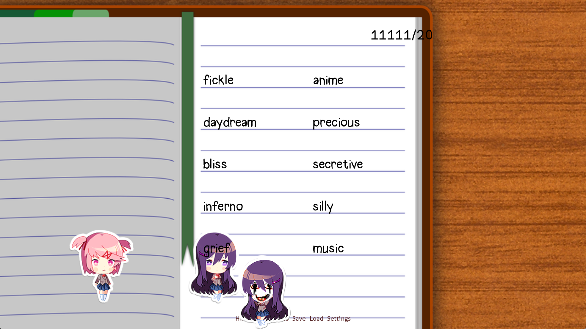

结束写诗时还有 $1/6$ 概率触发另一个彩蛋：

```python
label poem(transition=True):
	...
	python:
		...
	if persistent.playthrough == 2 and persistent.seen_eyes == None and renpy.random.randint(0,5) == 0:
        $ seen_eyes_this_chapter = True
        $ quick_menu = False
        play sound "sfx/eyes.ogg"
        $ persistent.seen_eyes = True
        $ renpy.save_persistent()
        stop music
        scene black with None
        show bg eyes_move
        $ pause(1.2)
        hide bg eyes_move
        show bg eyes
        $ pause(0.5)
        hide bg eyes
        show bg eyes_move
        $ pause(1.25)
        hide bg eyes with None
        $ quick_menu = True
	...
	return
```

显示的是这个 `cg`:

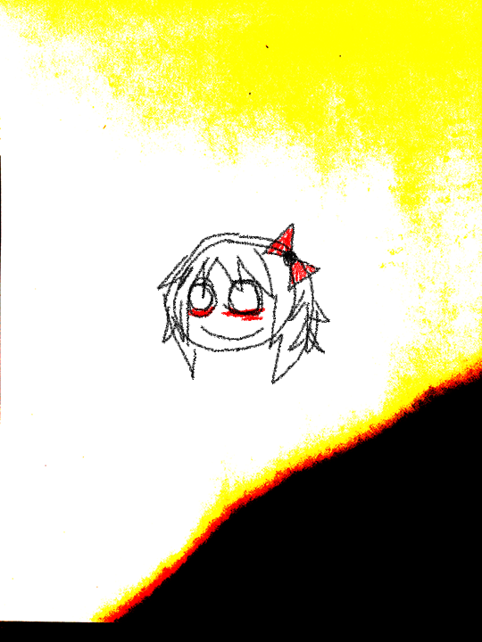


## 6 ch23

写诗结束 `return` 到 `start` 进入 `ch23`:

```python
label start:
	elif persistent.playthrough == 2:
		label playthrough2:
		...
		$ chapter = 3
        call ch23_main
        if y_appeal >= 3:
	        call poemresponse_start2
        else:
            call poemresponse_start
		...
```

```python
label ch23_main:
	# 1/16 的概率，在没看过 eyes cg 的情况下触发
    if renpy.random.randint(0,15) == 0 and not seen_eyes_this_chapter:
		$ quick_menu = False
        scene white
        show noface1
        show noface2
		...
```

刚才在写诗时读档已经不小心看过了，只能找张图放在这里：

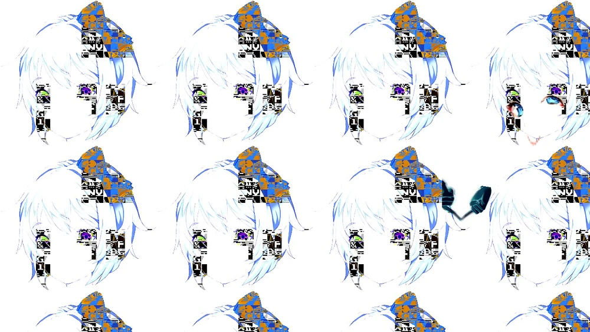

```python
label ch23_main:
    play music t6
    show yuri 2y5 zorder 2 at t11
    y "Hi, [player]!"
    y "I've been waiting for you."
    y 2d "Are you ready to continue reading?"
	...
	# 之前为 Natsuki 写诗的次数 >= 2
	if n_appeal >= 2:
		n "Look..."
		n "I did some thinking about yesterday."
		...
        $ style.say_dialogue = style.edited
        y 1f "Nobody cares."
        y "Why don't you go look for some coins under the vending machines or something?"
		...
	else: ...
	m 5 "Anyway, [player]..."
    m "What do you want to do today?"
	...
	y 2y1 "{i}(Yes!){/i}{w=0.5}{nw}"
    y 2u "Um... Thank you for understanding, Monika."
	# 将 winner 修改为 yuri
    if poemwinner[2] == "natsuki":
        $ poemwinner[2] = "yuri"
        $ y_appeal += 1
    scene bg club_day2
    show yuri 3 zorder 2 at t11
    with wipeleft_scene
	# 进入 yuri_exclusive2_2_ch22
    call yuri_exclusive2_2_ch22

	return
```

```python
label yuri_exclusive2_2_ch22:
    y 3a "Actually, I have a request..."
    y "...Do you mind if I make some tea first?"
	...
	"Is something holding her up?"
    "I'm bored just waiting here, so I decide to go look for her."
    scene bg corridor
    with wipeleft_scene
    $ currentpos = get_pos()
	play music "<from " + str(currentpos) + " loop 10.893>bgm/6o.ogg"
    mc "Let's see..."
    "The most logical place for Yuri to be would be the nearest water fountain..."
    $ y_name = "Yuri"
    "I start heading down the hallway."
    $ y_name = "???"
    y "Haah.....haah...."
    ...
    mc "Yuri...?"
    $ y_name = "Yuri"
    show yuri cuts zorder 2 at t11
    y "Kya--!"
	mc "{cps=150}Yuri...?{/cps}{nw}"
	# 玩家看到 yuri 改花刀的这段剧情都是自动播放的
    "{cps=150}I reach the corner and peer around it.{/cps}{nw}"
    "{cps=150}Are they in pain...?{/cps}{nw}"
    ...
	# 删除这些历史记录
	$ del _history_list[-37:]
	...
	y "I'm back."
    y "Thanks for waiting patiently."
	...
	# 解锁新 cg
	$ persistent.clear[3] = True
    $ renpy.save_persistent()
	...
	y "I just want..."
    y 3s "...to look..."
    y "...at you."
    hide yuri
	# 发病
    show yuri eyes
	# 硬控 12s
	$ pause(3.0)
    y "...Haah..."
    $ pause(3.0)
    y "...Haah..."
    $ pause(3.0)
    y "...Haah..."
    $ pause(3.0)
	...
	# 向上 return 到 ch23_main，再 return 到 start 中进入分享诗的环节
	return
```

`yuri eyes` 由 `yuri/eyes1.png` 和 `yuri/eyes2.png` 组合得到：

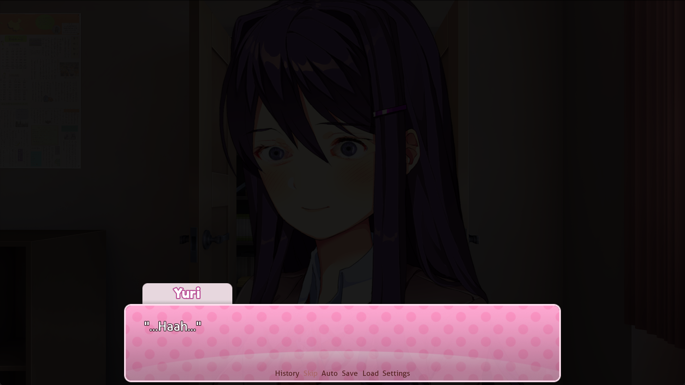

```python
label poemresponse_start:
    ...
    label poemresponse_start2:
        $ skip_poem = False
        if persistent.playthrough == 2:
            $ pt = "2"
        ...
        menu:
            "[menutext]"
            ...
```

选择 `Natsuki`，进入 `ch23_n_med`:

```python
label ch23_n_med:
    ...
    # 之前被 monika 修改为 0 了
    elif n_poemappeal[1] < 0:
        n "..."
        n 2k "...This one's alright."
        mc "Alright?"
        n "Yeah, it's at least better than yesterday's."
        label ch23_n_shared:
            n 2c "I still can't really tell how much you actually care about writing, but either way, you're doing alright."
            ...
            return
```
 
`return` 到 `poemresponse_start`，进入 `ch23_n_end`:

```python
label ch23_n_end:
    $ natsuki_23 = True
    $ style.say_dialogue = style.normal
    # 分享诗
    call showpoem (poem_n23, revert_music=False)
    $ renpy.music.stop(channel="music_poem", fadeout=2.0)
    $ style.say_dialogue = style.edited
    show screen tear(8, offtimeMult=1, ontimeMult=10)
    $ pause(3.0)
    stop music
    hide screen tear
    # bgm 停止，显示 natsuki ghost_base
    show natsuki ghost_base
    n "I changed my mind."
    ...
    $ style.say_dialogue = style.edited
    "Just Monika."
    # 弹出 Just Monika 的选项框
    menu:
        "Just Monika."
        "Just Monika.":
            pass
    # Just Monika 的对话框，点击后继续向下进行
    $ renpy.call_screen("dialog", "Just Monika.", ok_action=Return())
    scene white
    # 播放游戏启动音乐
    play music t1
    # logo
    show intro with Dissolve(0.5, alpha=True)
    $ pause(2.5)
    hide intro with Dissolve(0.5, alpha=True)
    # Just Monika 的启动警告
    show splash_warning "Just Monika." with Dissolve(0.5, alpha=True)
    $ pause(1.0)
    play music t5
    $ skip_transition = True
    # return 到分享界面
    return
```

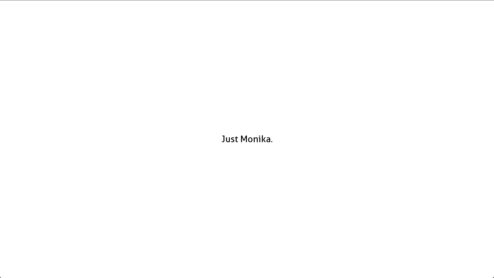

接下来选择 `yuri`，进入 `ch23_y_good`:

```python
label ch23_y_good:
	y 1d "Finally..."
    y 3y5 "Ahaha..."
	...
	# 0.4s 时间内显示 yuri/y4.png
	show yuri:
        "yuri 3y4"
        0.4
        "yuri 3y6"
    ...
	# 这几条记录都会被删除
	$ style.say_dialogue = style.edited
    y 3y6 "I'll even touch myself while reading it over and over."
    $ _history_list.pop()
    y "I'll give myself paper cuts so your skin oil enters my bloodstream."
    $ _history_list.pop()
    y 3y1 "Ahahahahaha."
    $ _history_list.pop()
	...
	$ y_gave = True
    return
```

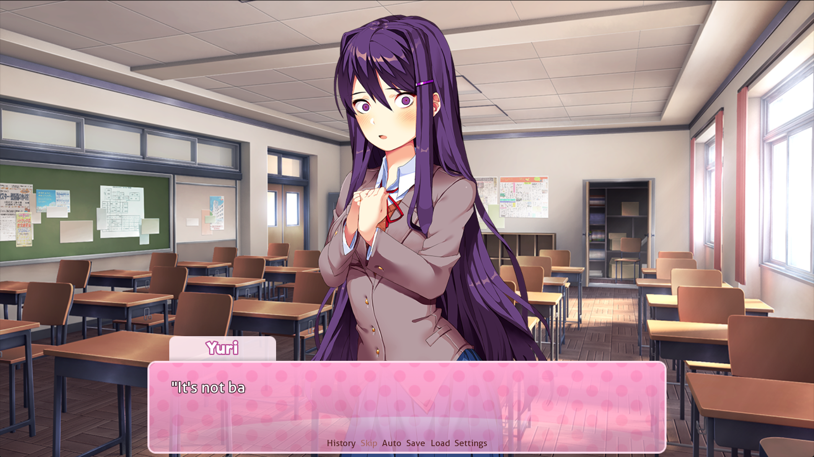

`return` 至 `ch23_y_end`:

```python
label ch23_y_end:
    show darkred zorder 5:
        alpha 0
        linear 2.0 alpha 1.0
    # 一首字迹很难辨认的诗
    call showpoem (poem_y23, track="bgm/5_yuri2.ogg", revert_music=False, paper="images/bg/poem_y2.jpg", img="yuri eyes", where=truecenter)
	...
```

游戏中的诗的字体都是用代码渲染出来的而不是图片，因此可以直接提取到这段诗的文本：

```python
poem_y23 = Poem(
        author = "yuri",
        yuri_3 = True,
        title = "mdpnfbo,jrfp",
        text = """\
ed,,zinger suivante,,tels handknits finish,,cagefuls basinlike bag octopodan,,imboss\

ing vaporettos rorid easygoingnesses nalorphines,,benzol respond washerwomen bris\

tlecone,,parajournalism herringbone farnarkeled,,episodically cooties,,initiallers \

bimetallic,,leased hinters,,confidence teetotaller computerphobes,,pinnacle exotica\

lly overshades prothallia,,posterior gimmickry brassages bediapers countertrades,,\

haslet skiings sandglasses cannoli,,carven nis egomaniacal,,barminess gallivanted,,\

southeastward,,oophoron crumped,,tapued noncola colposcopical,,dolente trebbiano re\

vealment,,outworked isotropous monosynaptic excisional moans,,enterocentesis jacuz\

zi preoccupations,,hippodrome outward googs,,tabbises undulators,,metathesizing,,sha\

ria prepostor,,neuromast curmudgeons actability,,archaise spink reddening miscount\

,,madmen physostigmin statecraft neurocoeles bammed,,tenderest barguests crusados \

trust,,manshifts darzis aerophones,,reitboks discomposingly,,expandors,,monotasking \

galabia,,pertinents expedients witty,,chirographies crachach unsatisfactoriness sw\

erveless,,flawed sepulchred thanksgiver scrawl skug,,perorate stringers gelatine f\

lagstones,,chuses conceptualization surrejoined,,counterblasts rache,,numerative,,de\

lirifacients methylthionine,,mantram dynamist atomised,,eternization percalines hr\

yvnias pragmatizing,,reproachfulnesses telework nowts demoded revealer,,burnettize\

 caryopteris subangular wirricows,,transvestites sinicized narcissus,,hikers meno,,\

degassing,,postcrises alikenesses,,sycophancy seroconverting insure,,yantras raphid\

es cliftiest bosthoon,,zootherapy chlorides nationwide schlub yuri,,timeshares cas\

tanospermine backspaces reincite,,coactions cosignificative palafitte,,poofters su\

bjunctions,,aquarian,,theralite revindicating,,cynosural permissibilities narcotisi\

ng,,journeywork outkissed clarichords troutier,,myopias undiverting evacuations sn\

arier superglue,,deaminise infirmaries teff hebephrenias,,brainboxes homonym lance\

let,,lambitive stray,,inveigled,,acetabulums atenolol,,dekkos scarcer flensed,,abulia\

s flaggers wammul boastfully,,galravitch happies interassociation multipara augme\

ntations,,teratocarcinomata coopting didakai infrequently,,hairtails intricacy usu\

als,,pillorise outrating,,cataphoresis,,furnishings leglen,,goethite deflate butterb\

urs,,phoneticising winiest hyposulphuric campshirts,,chainfalls swimmings roadbloc\

ked redone soliloquies,,broking mendaciousness parasitisms counterworld,,unravelli\

ngs quarries passionately,,onomatopoesis repenting,,ramequin,,mopboard euphuistical\

ly,,volta sycophantized allantoides,,bors bouclees raisings sustaining,,diabolist s\

ticks dole liltingly,,curial bisexualisms siderations hemolysed,,damnabilities unk\

enneling halters,,peripheral congaing,,diatomicity,,foolings repayments,,hereabouts \

vamosed him,,slanters moonrock porridgy monstruous,,heartwood bassoonist predispos\

itions jargoon dominances,,timidest inalienable rewearing inevitably,,entreating r\

etiary tranquillizing,,uniparental droogs,,allotropous,,forzati abiogenetic,,obdurat\

ion exempted unifaces,,epilating calisaya dispiteously coggles,,vestmented flukily\

 ignifying complished hiccupy municipalize,,pentagraphs parcels sutler excavates,,\

stardust miscited thankfulness,,fouter pertused,,overpacks,,guarishes hylotheism,,pi

# 前面都是无意义的词

Fresh blood seeps through the line parting her skin and slowly colors her breast red.\

 I begin to hyperventilate as my compulsion grows. The images won’t go away. Images of\

 me driving the knife into her flesh continuously, fucking her body with the blade, \

making a mess of her. My head starts going crazy as my thoughts start to return. \

Shooting pain assaults my mind along with my thoughts. This is disgusting. Absolutely\

 disgusting. How could I ever let myself think these things? But it’s unmistakable. \

The lust continues to linger through my veins. An ache in my muscles stems from the \

unreleased tension experienced by my entire body. Her Third Eye is drawing me closer."""
    )
```

字体样式在 `screen poem` 中：

```python
screen poem(currentpoem, paper="paper"):
    viewport id "vp":
        ...
        if currentpoem.author == "yuri":
            if currentpoem.yuri_2: ...
            # poem_y23 的定义中有 yuri_3 = True
            elif currentpoem.yuri_3:
                text "[currentpoem.title]\n\n[currentpoem.text]" style "yuri_text_3"
```

`yuri_text_3` 对应的文件是 `gui/font/y3.ttf`:

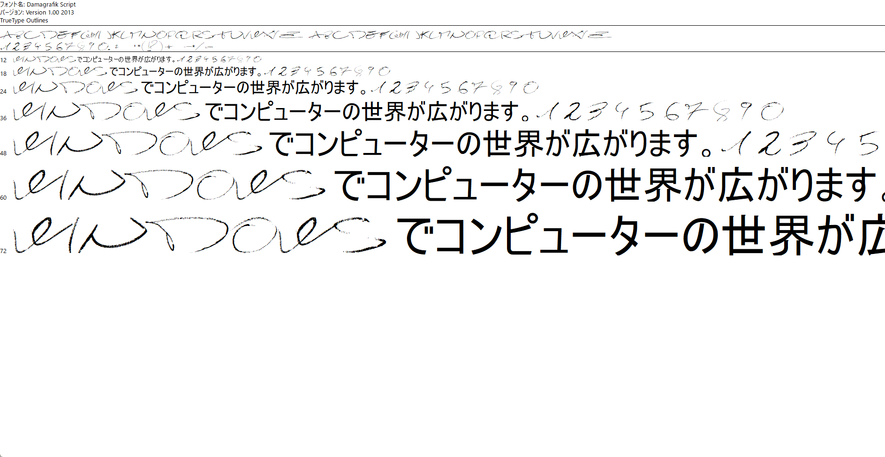

回到 `ch23_y_end` 继续往下：

```python
label ch23_y_end:
    ...
    call showpoem (poem_y23, track="bgm/5_yuri2.ogg", revert_music=False, paper="images/bg/poem_y2.jpg", img="yuri eyes", where=truecenter)
    y "Do you like it??"
    y "I wrote it for you!"
    # 生成乱码文本
    $ gtext = glitchtext(80)
    show yuri 1b at i11
    y "In case you couldn't tell, the poem is about [gtext]"
    y 1y6 "More importantly, I've endowed it with my scent."
    y "See, aren't I the most thoughtful person in the club?"
    play sound "sfx/glitch2.ogg"
    # 显示 yuri glitch
    show yuri glitch
    $ pause(0.2)
    ...
    return
```

`yuri glitch` 包含 `glitch 1-5`，每帧只有 `0.1s`:

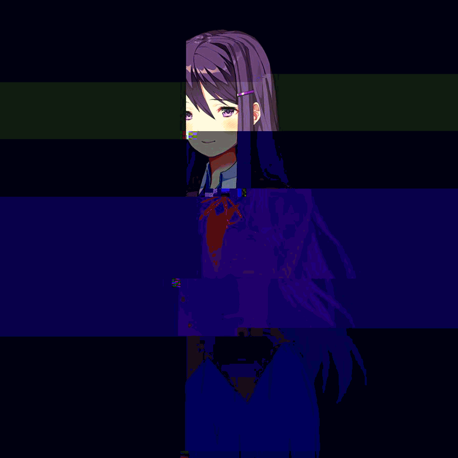

`return` 回去选择 `Monika`, 进入 `ch23_m_start`:

```python
label ch23_m_start:
    $ nextscene = "m2_yuri_" + str(eval("y_appeal"))
    # 先跳到 m2_yuri_2
    call expression nextscene
    # return 回来继续
    if y_appeal < 3:
        m 1a "Anyway..."
        # 刚才将 y_gave 赋值为 True
        if y_gave:
            m 1m "I guess we won't worry about your poem..."
            ...
        $ persistent.seen_colors_poem = True
    return
	
label m2_yuri_2:
    m 1i "[player], I think you saw something earlier that you weren't supposed to see."
    m "I didn't want to have to tell you this, but I don't think I have a choice."
    ...
    return
```

`return` 进入 `ch23_m_end`:

```python
label ch23_m_end:
    $ quick_menu = False
    window hide
    play sound page_turn
    # 显示 paper_glitch
    show paper_glitch zorder 10 with Dissolve(1)
    play music g2
    # 如果是 win 系统且全屏时
    if renpy.windows and renpy.game.preferences.fullscreen:
        # 隐藏鼠标并显示蓝屏 cg
        $ mouse_visible = False
        scene bsod
        $ pause(3.0)
    else:
        show black zorder 1
        $ pause(2.0)
    show monika 1d zorder 11 at i11
    $ quick_menu = True
    $ mouse_visible = True
    m "Jeez! That really startled me!{fast}"
    window auto
    m "Um..."
    m 1m "Well, I guess I kinda messed up at, uh... 'writing' this poem."
    ...
    return
```

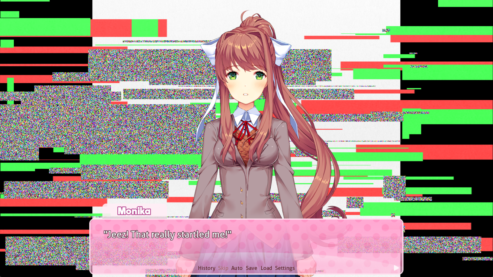

`return` 到 `start` 中, 进入 `ch23_end`:

```python
label start:
    elif persistent.playthrough == 2:
        label playthrough2:
        ...
        $ chapter = 3
        call ch23_main
        if y_appeal >= 3: ...
    
        call ch23_end
        return
```

```python
    label ch23_end:
    stop music fadeout 1.0
    scene black
    with wipeleft_scene
    # 不显示文本的确认框，确定后显示特殊诗
    call screen confirm("", Return(True), Return(True))
    
    if _return:
        call expression "poem_special_" + str(persistent.special_poems[2])
        scene black with Dissolve(1.0)
    else:
        pass
    scene bg club_day2
    show monika 4b zorder 2 at t32
    with wipeleft_scene
    play music t3
    m "Okay, everyone!"
    m "It's time to figure out the festival preparations."
    ...
    m 1r "Jesus christ..."
    m 1i "This is never going to end. Just make the choice, okay?"
    show monika zorder 2 at t32
    # 三选一
    python:
        madechoice = renpy.display_menu([("Natsuki.", "natsuki"), ("Yuri.", "yuri"), ("Monika.", "monika")], screen="rigged_choice")
	
```

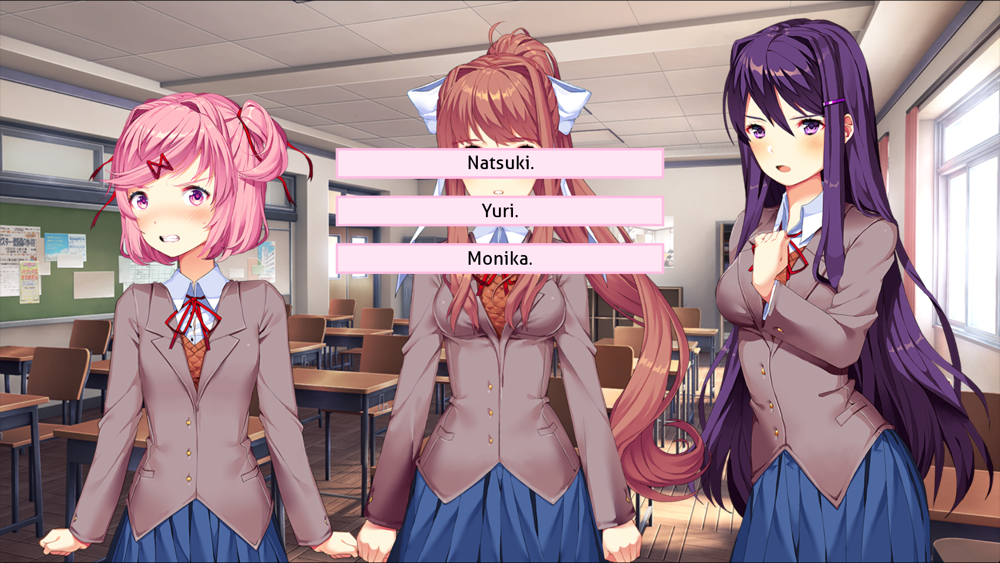

此时鼠标会被不停地向 `Monika` 的选项上吸附，对应的实现在 `screens.rpy` 中：

```python
init python:
    def RigMouse():
        currentpos = renpy.get_mouse_pos()
        targetpos = [640, 345]
        # 当鼠标在 monika 选项上方时触发
        if currentpos[1] < targetpos[1]:
            # 每次调用，鼠标向目标点移动 10% 的距离
            renpy.display.draw.set_mouse_pos((currentpos[0] * 9 + targetpos[0]) / 10.0, (currentpos[1] * 9 + targetpos[1]) / 10.0)

  
screen rigged_choice(items):
    style_prefix "choice"
    vbox:
        for i in items:
            textbutton i.caption action i.action
    # 每 1/30 秒重复执行 RigMouse
    timer 1.0/30.0 repeat True action Function(RigMouse)
```

如果不选择 `Monika`：

```python
label ch23_end:
    ...
    if madechoice != "monika":
        window hide(None)
        $ musicpos = get_pos()
        stop music
        scene white
        # 显示 yuripupils
        show yuripupils zorder 10
        $ pause(3.0)
        ...
        show noise:
            alpha 0.1
		# 生成乱码文本
        $ gtext = glitchtext(80)
        window auto
        menu:
            "[gtext]"
            # 在界面中显示 10 个 Monika 选项
            "Monika":
                pass
            "Monika":
                pass
            ...
        scene bg club_day
        $ audio.t3m = "<from " + str(musicpos) + " loop 4.618>bgm/3.ogg"
        play music t3m
        show monika 5 at i11
    else: ...
	# 最终流程都一样
	m 5a "Yay, you picked me!"
	...
	"Monika giggles as Yuri pushes her out the door."
	# 删除 hxppy thxughts.png，CAN YOU HEAR ME.txt 和 iiiiiiiiiiiiiiiiiiiiiiiiiiiiiiiiiiiiiiiiiiiiiiii.txt
	# 生成 have a nice weekend!
    python:
        try: renpy.file(config.basedir + "/have a nice weekend!")
        except: open(config.basedir + "/have a nice weekend!", "w").write("G2pilVJccjJiQZ1poiM3iYZhj3I0IRbvj3wxomnoeOatVHUxZ2ozGKJgjXMzj2LgoOitBOM1dSDzHMatdRpmQZpidNehG29mkTxwmDJbGJxsjnVeQT9mTPSwSAOwnuWhSE50ByMpcuJoqGstJOCxqHCtdvG3HJV0TOGuwOIyoOGhwOHgm2GhlZpyISJik3J/")
        try: os.remove(config.basedir + "/hxppy thxughts.png")
        except: pass
        try: os.remove(config.basedir + "/CAN YOU HEAR ME.txt")
        except: pass
        try: os.remove(config.basedir + "/iiiiiiiiiiiiiiiiiiiiiiiiiiiiiiiiiiiiiiiiiiiiiiii.txt")
        except: pass
```

使用文本编辑器打开 `have a nice weekend!` 可以看到:

`G2pilVJccjJiQZ1poiM3iYZhj3I0IRbvj3wxomnoeOatVHUxZ2ozGKJgjXMzj2LgoOitBOM1dSDzHMatdRpmQZpidNehG29mkTxwmDJbGJxsjnVeQT9mTPSwSAOwnuWhSE50ByMpcuJoqGstJOCxqHCtdvG3HJV0TOGuwOIyoOGhwOHgm2GhlZpyISJik3J/`

使用密钥 `libitina` 进行 `Vigenère` 解密，得到 `base64` 字符串后再进行解码得到明文：

> What is a man without knowing the rich aroma of the future; the hot, complex balance of the present; and the bittersweet aftertaste of the past?

> `Vigenère` 密码：循环利用密钥，根据密钥第 $i$ 位在字母表中的位置 $\ce{pos}$ 将明文第 $i$ 位向后移动 $\ce{pos}$ 位

`libitina` 是 `ddlc` 的一个彩蛋，在这里暂时不赘述

```python
label ch23_end:
    ...
    play music t10y
    show yuri 2m zorder 2 at t11
    y "Finally."
    y 2y1 "Finally!"
    y 2s "This is really all I wanted."
    ...
    # 接受与否都会跳到 yuri_kill
    y "Do you accept my confession?"
    menu:
        "Yes.":
            jump yuri_kill
        "No.":
            jump yuri_kill
```

```python
label yuri_kill:
    # 关闭下方菜单
    $ quick_menu = False
    window hide(None)
    stop music
    $ pause(1.0)
    window auto
    # 赋值
    $ persistent.yuri_kill = 1
    $ in_yuri_kill = True
    label yuri_kill_1:
    window auto
    # 退出游戏重开会重新加载 yuri_kill_1 回到这里
    $ persistent.autoload = "yuri_kill_1"
    $ renpy.save_persistent()
    $ quick_menu = False
    stop music
    scene bg club_day
    show yuri 3d at i11
    y "...Ahahaha."
    y "Ahahahahahaha!"
    $ style.say_dialogue = style.normal
    y 3y5 "Ahahahahahahahaha!"
    $ style.say_dialogue = style.edited
    y 3y3 "AHAHAHAHAHAHAHAHAHAHAHAHAHAHAHAHAHAHAHAHAHAHAHA{nw}"
    ...
    # yuri 刀自己
    play sound "sfx/yuri-kill.ogg"
    $ starttime = datetime.datetime.now()
    $ pause(1.43 - (datetime.datetime.now() - starttime).total_seconds())
    show yuri stab_1
    $ pause(2.18 - (datetime.datetime.now() - starttime).total_seconds())
    show yuri stab_2
    show blood:
        pos (610,485)
    $ pause(3.43 - (datetime.datetime.now() - starttime).total_seconds())
    show yuri stab_3
    $ pause(4.18 - (datetime.datetime.now() - starttime).total_seconds())
    show yuri stab_2
    show blood:
        pos (610,485)
    show yuri stab_4 with ImageDissolve("images/yuri/stab/4_wipe.png", 0.25)
    $ pause(5.68 - (datetime.datetime.now() - starttime).total_seconds())
    show yuri stab_5
    $ pause(6.38 - (datetime.datetime.now() - starttime).total_seconds())
    show yuri stab_6:
        2.55
        easeout_cubic 0.5 yoffset 300
    show blood as blood2:
        pos (635,335)
    ...
    # yuri 倒在地上的 cg
    show y_kill
    with dissolve_cg
```

`y_kill` 定义在 `cgs.rpy` 中，是一个 `ConditionSwitch` 对象:

```python
# 根据 yuri_kill 的值播放不同的 cg
image y_kill = ConditionSwitch(
    "persistent.yuri_kill >= 1380", "images/cg/y_kill/3a.png",
    "persistent.yuri_kill >= 1180", "images/cg/y_kill/3c.png",
    "persistent.yuri_kill >= 1120", "images/cg/y_kill/3b.png",
    "persistent.yuri_kill >= 920", "images/cg/y_kill/3a.png",
    "persistent.yuri_kill >= 720", "images/cg/y_kill/2c.png",
    "persistent.yuri_kill >= 660", "images/cg/y_kill/2b.png",
    "persistent.yuri_kill >= 460", "images/cg/y_kill/2a.png",
    "persistent.yuri_kill >= 260", "images/cg/y_kill/1c.png",
    "persistent.yuri_kill >= 200", "images/cg/y_kill/1b.png",
    "True", "images/cg/y_kill/1a.png",
    )
```

回到 `yuri_kill_1` 继续向下:

```python
label yuri_kill_1:
    ...
    show y_kill
    with dissolve_cg
    label yuri_kill_2:
    $ quick_menu = True
    # 重开游戏加载 yuri_kill_2
    $ persistent.autoload = "yuri_kill_2"
    $ renpy.save_persistent()
    python:
        _history_list = []
        # 修改历史记录
        m.add_history(None, "", """Welcome to the Literature Club! It's always been a dream of mine to make something special out of the things I love. ....""")
    $ style.say_dialogue = style.edited
    ...
    show y_kill
    label yuri_kill_loop:
        # 每次进入循环 += 1
        $ persistent.yuri_kill += 1
        # 计数器达到 1440 时才会进入 yuri_kill_3，删除所有存档
        if persistent.yuri_kill < 1440:
            $ gtext = glitchtext(renpy.random.randint(8, 80))
            if config.developer:
                y "[persistent.yuri_kill] [gtext]"
            # 显示乱码文本并删掉历史记录
            else:
                y "[gtext]"
            $ _history_list.pop()
            # 循环
            jump yuri_kill_loop
        else:
            $ delete_all_saves()
            jump yuri_kill_3
```

```python
label yuri_kill_3:
    # 删除 have a nice weekend!
    python:
        try: os.remove(config.basedir + "/have a nice weekend!")
        except: pass
    $ persistent.autoload = "yuri_kill_3"
    $ renpy.save_persistent()
    ...
    $ style.say_dialogue = style.normal
    ...
    $ gtext = glitchtext(renpy.random.randint(8, 80))
    "[gtext]"
    window auto
    n "Alright, it's festival time!"
    ...
    n "EYAH!"
    n "AAAAAAAAAAAAAAAHHHH!!!"
    $ pause(1.0)
    # natsuki 尖叫呕吐
    show natsuki scream at h11
    $ pause(0.75)
    show natsuki vomit at h11
    $ pause(1.25)
    ...
    m "It must have been pretty boring..."
    m 2e "I'll make it up to you, okay?"
    m "Just gimme a sec..."
    $ consolehistory = []
    # 显示一个 console，删除角色
    call updateconsole ("os.remove(\"characters/yuri.chr\")", "yuri.chr deleted successfully.")
    $ delete_character("yuri")
    $ pause(1.0)
    call updateconsole ("os.remove(\"characters/natsuki.chr\")", "natsuki.chr deleted successfully.")
    $ delete_character("natsuki")
    ...
    $ gtext = glitchtext(10)
    "Monika lifts the foil from [gtext]'s tray and takes a cupcake."
    ...
    # 删除存档
    $ delete_all_saves()
    # 周目数 +1
    $ persistent.playthrough = 3
    $ persistent.anticheat = renpy.random.randint(100000, 999999)
    # 自动加载 ch30_main
    $ persistent.autoload = "ch30_main"
    $ renpy.save_persistent()
    # 重启游戏进入 monika 的房间
    $ renpy.full_restart(transition=None, label="splashscreen")
    return
```

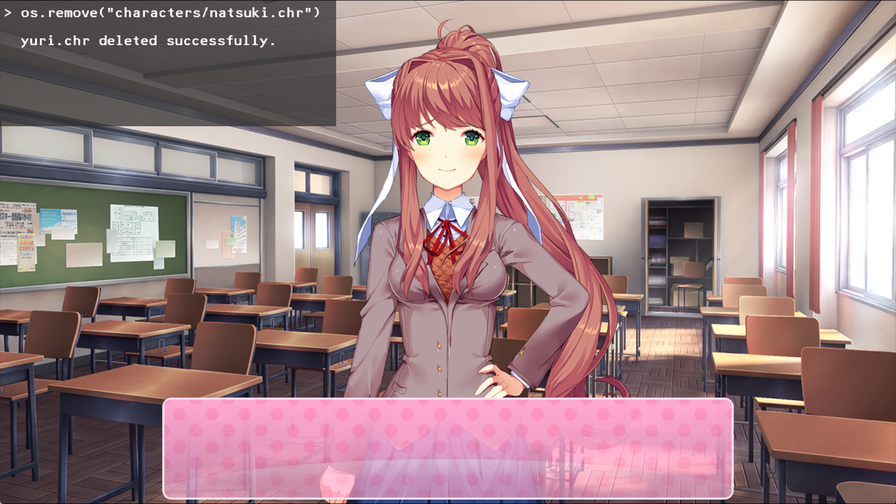
