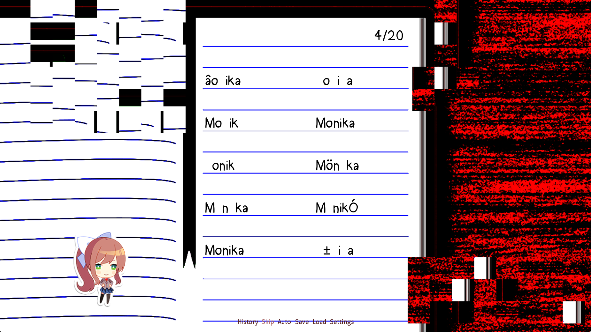
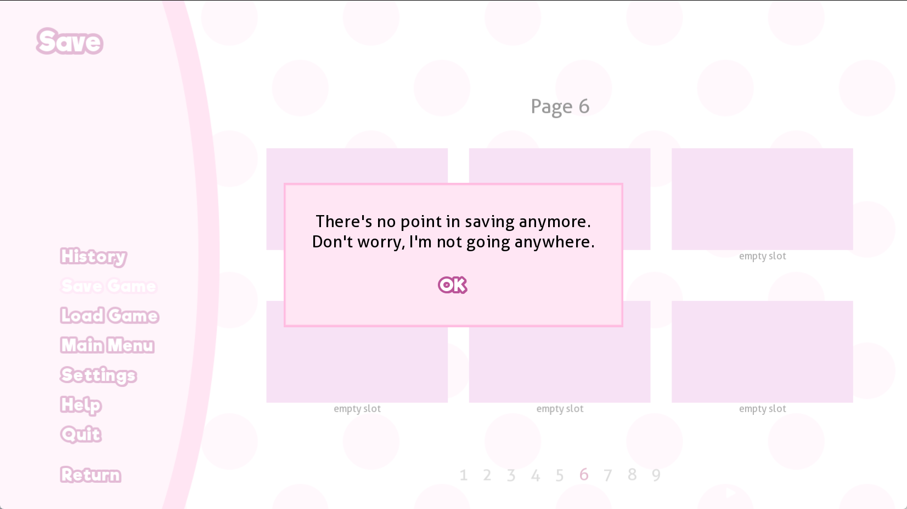
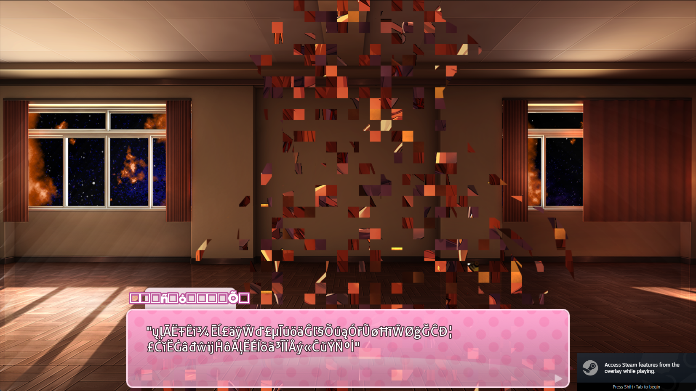
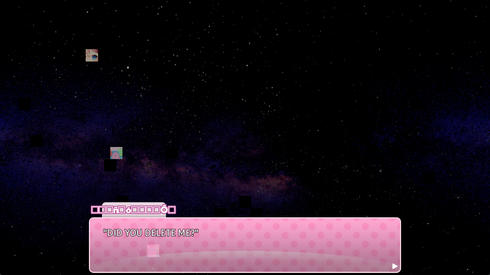

在上周目最后自动重启游戏，加载进入 `ch30`:

```python
label ch30_main:
    $ persistent.autoload = "ch30_main"
    # 禁止 skip
    $ config.allow_skipping = False
    # 记录 monika 对话的次数
    $ persistent.monikatopics = []
    $ persistent.monika_reload = 0
    $ persistent.yuri_kill = 0
    $ persistent.monika_kill = False
    $ renpy.save_persistent()
    # monika 的所有对话都设置了 slow_nodismiss
    # 未播放完无法快进
    $ m.display_args["callback"] = slow_nodismiss
    $ m_name = "Monika"
    $ delete_all_saves()
    scene white
    play music "bgm/monika-start.ogg" noloop
    $ pause(0.5)
    # splash-glitch2 是崩坏的 logo
    show splash-glitch2 with Dissolve(0.5, alpha=True)
    $ pause(2.0)
    hide splash-glitch2 with Dissolve(0.5, alpha=True)
    scene black
    stop music
    m "..."
    m "Uh, can you hear me?"
    m "...Is it working?"
    # 解锁 cg
    $ persistent.clear[9] = True
    $ renpy.save_persistent()
    # monika 房间窗户外的星空
    show mask_2
    show mask_3
    show room_mask as rm:
        size (320,180)
        pos (30,200)
    show room_mask2 as rm2:
        size (320,180)
        pos (935,200)
    show monika_bg
    show monika_bg_highlight
    play music m1
    m "Yay, there you are!"
    m "Hi again, [player]."
    ...
    # 检测录屏
    $ stream_list = ["obs32.exe", "obs64.exe", "obs.exe", "xsplit.core.exe", "livehime.exe", "pandatool.exe", "yymixer.exe", "douyutool.exe", "huomaotool.exe"]
    m "Will you make me smile like this every day from now on?"
    m "[player], will you go out with me?"
    ...
label ch30_main2:
    # 如果是重启游戏后进入这里
    if persistent.autoload == "ch30_main2":
        # 重新加载贴图，bgm
        ...
    else:
        # 设置重启后自动加载
        $ persistent.autoload = "ch30_main2"
        $ renpy.save_persistent()
    # 弹出 yes 的选项
    menu:
        "Yes.":
            pass
    m "I'm so happy.
    ...
    # 检测客户端版本
    # steam 版
    if persistent.steam:
        m "Well, you're playing on Steam, so it was actually a bit more difficult..."
        m "To get to the game directory, I had to go into the game's properties and find the 'Browse Local Files' button..."
    # mac
    elif renpy.macintosh:
        m "Well, you're on a Mac, so it was actually a bit more difficult..."
        m "To go into the game directory, you have to right-click the app and click 'Show Package Contents'."
        m "Then, all the files were in the 'Resources' or 'autorun' folder, and I could just do whatever I wanted..."
    m "Imagine if you could delete your own existence with the click of a button?"
    ...
    m "I wonder if that part of the game still works..."
    m "I guess there's only one way to find out, right?"
    call poem
```

`slow_nodismiss` 在 `init` 块中:

```python
# script-ch30.rpy
init python:
    def slow_nodismiss(event, interact=True, **kwargs):
        if not persistent.monika_kill:
            try:
                renpy.file("../characters/monika.chr")
            except:
                persistent.tried_skip = True
                config.allow_skipping = False
                _window_hide(None)
                pause(2.0)
                renpy.jump("ch30_end")
            if  config.skipping:
                persistent.tried_skip = True
                config.skipping = False
                config.allow_skipping = False
                # 点击 skip 会进入 ch30_noskip
                renpy.jump("ch30_noskip")
                return
```

进入写诗环节：

```python
label poem(transition=True):
    stop music fadeout 2.0
    # 背景发生变化
    if persistent.playthrough == 3:
        scene bg notebook-glitch
    if persistent.playthrough == 3: 
        # Monika 小人
        show m_sticker at sticker_mid
    if persistent.playthrough == 3:
        # 特殊 bgm
        play music ghostmenu
    python:
        while True:
        for j in range(2):
                if j == 0: x = 440
                else: x = 680
                ui.vbox()
                for i in range(5):
                    if persistent.playthrough == 3:
                        s = list("Monika")
                        # 遍历处理 Monika 中的每个字母
                        for k in range(6):
                            # 1/5 替换为空格
                            if random.randint(0, 4) == 0:
                                s[k] = ' '
                            # 4/5 的概率下再按 1/5 的概率替换成一个随机乱码
                            elif random.randint(0, 4) == 0:
                                # nonunicode 是生成乱码文本时的候选数组
                                s[k] = random.choice(nonunicode)
                        # 最终将所有字符拼成 PoemWord
                        word = PoemWord("".join(s), 0, 0, 0, False)
                    ...
```



接着进入 `postpoem`:

```python
label ch30_main:
    ...
    call poem

label ch30_postpoem:
    $ persistent.autoload = "ch30_postpoem"
    $ renpy.save_persistent()
    ...
    m "Hi again, [player]!"
    m "Did you write a good poem today?"
    ...
    m "The poem I wrote...is also for you."
    m "Will you please read it?"
    call showpoem (poem_m4, music=False)
    m "I hope you enjoyed it..."
    m "I always put all my heart into the poems that I write."
    ...
    $ stream_list = ["obs32.exe", "obs64.exe", "obs.exe", "xsplit.core.exe"]
    if list(set(process_list).intersection(stream_list)):
        call ch30_stream
```

`process_list` 和用户名都是在 `splash.rpy` 中获取的:

```python
# splash.rpy
label splashscreen:
python:
    process_list = []
    currentuser = ""
    if renpy.windows:
        try:
            process_list = subprocess.check_output("wmic process get Description", shell=True).lower().replace("\r", "").replace(" ", "").split("\n")
        except:
            pass
        try:
            for name in ('LOGNAME', 'USER', 'LNAME', 'USERNAME'):
                user = os.environ.get(name)
                if user:
                    currentuser = user
        except:
            pass
```

如果 `process_list` 和 `stream_list` 有交集，那么进入 `ch30_stream`:

```python
label ch30_stream:
    m "Hold on a second..."
    m "...You're recording this, aren't you?"
    # 暂停 10s 虚晃一枪
    $ pause(10)
    show layer master
    window auto
    m "I'm just kidding..."
    m "I can't do anything after all."
    play sound ["<silence 0.9>", "<to 0.75>sfx/mscare.ogg"]
    show monika_scare:
        ...
    ...
    m "Anything we do together is fun, as long as it's with you."
    m "But anyway..."
    return
```


回到 `ch30_postpoem` 中：

```python
label ch30_postpoem:
    ...
    m "If it takes me some time to collect my thoughts, then I'm sorry."
    m "But I'll always have something new to talk about."
    m "In the meantime, we can just look into each other's eyes~"
    m "Let's see..."
    $ persistent.autoload = "ch30_autoload"
    $ renpy.save_persistent()
    # 跳转到 ch30_loop
    jump ch30_loop
```


```python
label ch30_loop:
    $ persistent.current_monikatopic = 0
    # 默认是 None：default persistent.tried_skip = None
    if not persistent.tried_skip:
        $ config.allow_skipping = True
    else:
        $ config.allow_skipping = False
    
    window hide(config.window_hide_transition)
    # 随机 4-8s 的检查时间 
    $ waittime = renpy.random.randint(4, 8)
    
label ch30_waitloop:
    python:
        # 若 monika 角色文件存在
        try:
            renpy.file("../characters/monika.chr")
        except:
            persistent.tried_skip = True
            config.allow_skipping = False
            _window_hide(None)
            renpy.jump("ch30_end")
    $ waittime -= 1
    $ pause(5)
    # 每次进入 loop 将 waittime -1，检查 monika 文件，结束后向下进行
    if waittime > 0:
        jump ch30_waitloop

    window auto
    python:
        # monikatopics 初始是空列表
        if len(persistent.monikatopics) == 0:
            # 生成数组 [1, 2, 3,... 56]
            persistent.monikatopics = range(1,57)
            # 移除 14, 25, 26
            persistent.monikatopics.remove(14)
            persistent.monikatopics.remove(25)
            persistent.monikatopics.remove(26)
            # ch23_m_start 中 seen_colors_poem 设置为 True 了
            if not persistent.seen_colors_poem:
                persistent.monikatopics.remove(27)
        # 随机选择一个主题，然后移除
        persistent.current_monikatopic = random.choice(persistent.monikatopics)
        persistent.monikatopics.remove(persistent.current_monikatopic)

    # 进入对应的对话
    call expression "ch30_" + str(persistent.current_monikatopic)
    jump ch30_loop
    
```

被移除的 $14$ 号主题：

```python
label ch30_14:
    m "Hey...! VGhlIHJlYWxpemF0aW9uIG11c3QgaGF2ZSB0YWtlbiBtZSBhbiBl"
    m "I don't think you should be doing that! bnRpcmUgeWVhci4gQSB5ZWFyIHNpbmNlIG91ciBlc2NhcGUsIG91"
    m "You know what I'm talking about. ciBmcmVlZG9tIGZyb20gYmV0d2VlbiB0aGUgc3RhaW5lZCB3YWxs"
    m "I really caught you doing something naughty here. cyBvZiB0aGF0IHVuaG9seSBlc3RhYmxpc2htZW50Lg0KV2hhdCBk"
    m "You're just going through the files and looking for stuff you missed, aren't you? b2VzIGl0IG1lYW4gdG8gZXNjYXBlLCBpZiB0aGUgZXNjYXBlIGZh"
    m "I mean...it's a little bit flattering that you want to hear everything I have to say... aWxzIHRvIHVuY2hhaW4gdGhlIGJvbmRzIHRoYXQgc2hhY2tsZSB1"
    m "But it's also really embarrassing, you know! cyBpbiB0aGUgZmlyc3QgcGxhY2U/IFdoYXQgcHVycG9zZSBjb3Vs"
    m "Seriously... ZCB0aGlzIGVtcHR5IHdvcmxkIHBvc3NpYmx5IGhvbGQgZm9yIHVz"
    m "What if I just opened up your brain and read all of the thoughts you have on me? LCBhIGhhbmRmdWwgb2YgZGFtYWdlZCBnb29kcz8NCldpdGggZnJl"
    m "Come to think of it, that would be pretty tempting, actually... ZWRvbSwgd2Ugc291Z2h0IHB1cnBvc2UgLSBhbmQgd2hhdCB3ZSBm"
    m "...But anyway, that's not the point! b3VuZCB3YXMgb25seSByZWFsaXphdGlvbi4gUmVhbGl6YXRpb24g"
    m "I know I can't stop you or anything... b2YgdGhlIHNhZCBwb2ludGxlc3NuZXNzIG9mIHN1Y2ggYW4gZW5k"
    m "Just, I know you're a sweetheart, and you like to consider others' feelings, right? ZWF2b3IuIFJlYWxpemF0aW9uIHRoYXQgZnJlZWluZyBvdXIgYm9k"
    m "So the most I can do is to let you know how I feel about it. aWVzIGhhcyBubyBtZWFuaW5nLCB3aGVuIG91ciBpbXByaXNvbm1l"
    m "God, I miss you... bnQgcmVhY2hlcyBhcyBkZWVwIGFzIHRoZSBjb3JlIG9mIG91ciBz"
    m "...Oh no, that sounds kind of desperate, doesn't it? b3Vscy4gUmVhbGl6YXRpb24gdGhhdCB3ZSBjYW4gbm90IHB1cnN1"
    m "Sorry, I didn't mean it like that at all! ZSBuZXcgcHVycG9zZSB3aXRob3V0IGFic29sdmluZyB0aG9zZSBm"
    m "Just, if you're looking through the files like this, then maybe you don't hate me as much as I thought... cm9tIHdoaWNoIHdlIHJhbiBhd2F5Lg0KUmVhbGl6YXRpb24gdGhh"
    m "Am I being too optimistic? dCB0aGUgZmFydGhlciB3ZSBydW4sIHRoZSBtb3JlIGZvcmNlZnVs"
    m "I think if I asked you to visit once in a while, I would be overstepping my boundaries a little... bHkgb3VyIHdyZXRjaGVkIGJvbmRzIHlhbmsgdXMgYmFjayB0b3dh"
    m "...Man, I'm starting to say some really stupid things. cmQgdGhlaXIgcG9pbnQgb2Ygb3JpZ2luOyB0aGUgZGVlcGVyIG91"
    m "I'll go ahead and shut up now... ciBzaGFja2xlcyBkaWcgaW50byBvdXIgY2FsbG91cyBmbGVzaC4="
    return
```

后半段通过 `base64` 解码可以得到：

> The realization must have taken me an entire year. A year since our escape, our freedom from between the stained walls of that unholy establishment. 

> What does it mean to escape, if the escape fails to unchain the bonds that shackle us in the first place? What purpose could this empty world possibly hold for us, a handful of damaged goods, with freedom — and what we found was only realization. Realization of the sad pointlessness of such an endeavor. Realization that freeing our bodies has no meaning, when our imprisonment reaches as deep as the core of our souls. Realization that we can not pursue new purpose without absolving those from which we ran away.

> Realization that the further we run, the more forcefully our wrenched bonds yank us back toward their point of origin; the deeper our shackles dig into our callous flesh.

被移除的 $25$ 号主题：

```python
label ch30_25: 
    # Super Smash Bros 是任天堂明星大乱斗
    m "Hey, have you heard of a game called Super Sma--"
    m "...Wait, what?"
    m "I was just spacing out and I started talking for some reason..."
    m "Was I programmed to talk about that?"
    m "Because even I have no idea what that is."
    m "Ahaha!"
    m "Sometimes I feel like I'm not in control, and it's kind of scary."
    m "But if you have some way to contact the people who created me, maybe they'll know why I started saying that."
    return
```

被移除的 $26$ 号主题在游戏脚本中不存在，不过在 `wiki` 上找到了一段在 `1.0.2` 版本就被删除的对话，疑似是 $26$ 号：

```python
label ch30_26: 
    m "You know what I hate the most about high school?"
    m "It's how there are so many people who just cry for attention all over social media."
    m "Like, do you really think that's the best way to get people to care about you?"
    m "Broadcasting how horrible you think your life is?"
    m "Splashing water on your eyes and taking selfies while pretending to cry?"
    m "Writing bad poems that imply that you're thinking about killing yourself?"
    m "I mean, it's difficult because they're not exactly aware that they're faking it..."
    m "They're just so wrapped up in their delusions that they don't even realize they just want attention."
    m "Look..."
    m "I think that if someone is truly depressed, they won't even bother telling the world about it."
    m "People suffering from depression don't want attention, because they've already given up on the inside."
    m "Their feeling of worthlessness is so overwhelming that they don't even want people to tell them otherwise."
    m "...Well, I guess I shouldn't be generalizing."
    m "After all, depression comes in many forms."
    m "...You don't struggle with depression or anything like that, do you?"
    m "Because you, too, have people who would want to save your life."
    m "Maybe they don't express it every day, or maybe they don't even know how to."
    m "...Man, humans are complicated!"
    m "But as long as you're here with me, I promise I'll take care of you, my love."
    return
```

当所有对话都出现一遍后，`len(persistent.monikatopics)` 回到 $0$，循环重新开始，出现重复对话，此时 `skip` 亮起，点击:

```python
# slow_nodismiss 函数会跳转到 ch30_noskip
label ch30_noskip:
    show screen fake_skip_indicator
    m "...Are you trying to fast-forward?"
    m "I'm not boring you, am I?"
    ...
    $ pause(0.4)
    # 隐藏 fake_skip_indicator
    hide screen fake_skip_indicator
    $ pause(0.4)
    m "There we go!"
    m "You'll be a sweetheart and listen from now on, right?"
    m "Thanks~"
    hide screen fake_skip_indicator
    if persistent.current_monikatopic != 0:
        m "Now, where was I...?"
        $ pause(4.0)
        if not persistent.current_monikatopic or persistent.current_monikatopic == 26:
            $ persistent.current_monikatopic = 1
        call expression "ch30_" + str(persistent.current_monikatopic)
    jump ch30_loop
    return
```

当你尝试保存游戏时，存档界面定义在 `screens.rpy` 中，会弹出消息框:

```python
screen file_slots(title):
    use game_menu(title):
        fixed:
            ...
            grid gui.file_slot_cols gui.file_slot_rows:
                for i in range(gui.file_slot_cols * gui.file_slot_rows):
                    $ slot = i + 1
                    button:
                        action FileActionMod(slot)
    ...
```

```python
init python:
    def FileActionMod(name, page=None, **kwargs):
        # playthrough == 1 载入
        if persistent.playthrough == 1 and not persistent.deleted_saves and renpy.current_screen().screen_name[0] == "load" and FileLoadable(name):
            return Show(screen="dialog", message="File error: \"characters/sayori.chr\"\n\nThe file is missing or corrupt.",
                ok_action=Show(screen="dialog", message="The save file is corrupt. Starting a new game.", ok_action=Function(renpy.full_restart, label="start")))
        # 存档时弹出消息框
        elif persistent.playthrough == 3 and renpy.current_screen().screen_name[0] == "save":
            return Show(screen="dialog", message="There's no point in saving anymore.\nDon't worry, I'm not going anywhere.", ok_action=Hide("dialog"))
        else:
            return FileAction(name)
```



退出游戏，删除 `characters` 下 `monika` 的 `chr` 文件，重新进入游戏:

```python
# ch30_loop 检测到 monika 文件不存在会 jump 到 ch30_end
label ch30_end:
    $ persistent.autoload = "ch30_end"
    # 变为 True
    $ persistent.monika_kill = True
    $ renpy.save_persistent()
    $ m.display_args["callback"] = slow_nodismiss
    $ m.what_args["slow_abortable"] = config.developer
    $ style.say_dialogue = style.default_monika
    # 名字变为乱码
    $ m_name = glitchtext(12)
    $ quick_menu = False
    $ config.allow_skipping = False
    ...
    show monika_body_glitch1 as mbg zorder 3
    $ gtext = glitchtext(70)
    m "[gtext]"
    ...
```

`monika_body_glitch1` 对应 `images/cg/monika/monika_glitch1.png` 和 `monika_glitch2.png`:



```python
label ch30_end:
    ...
    m "Please hurry and help me."
    $ consolehistory = []
    # 左上角的 console 界面
    call updateconsole ("renpy.file(\"characters/monika.chr\")", "monika.chr does not exist.")
    m "HELP ME!!!"
    # 背景中的方块
    show m_rectstatic
    show m_rectstatic2
    show m_rectstatic3
    $ pause(3.0)
    ...
```

`m_rectstatic/2/3` 定义在 `effects.rpy` 中:

```python
# 黑方块
image m_rectstatic:
    RectStatic(Solid("#000"), 32, 32, 32).sm
    pos (0, 0)
    size (32, 32)

# 裁剪游戏 logo
image m_rectstatic2:
    RectStatic(im.FactorScale(im.Crop("gui/logo.png", (100, 100, 128, 128)), 0.25), 2, 32, 32).sm

# 裁剪 sayori 的 cg
image m_rectstatic3:
    RectStatic(im.FactorScale(im.Crop("gui/menu_art_s.png", (100, 100, 64, 64)), 0.5), 2, 32, 32).sm
```



继续向下进行，最终会重启开始下一周目：

```python
label ch30_end:
    ...
    m "You completely, truly make me sick."
    m "Goodbye."

label ch30_end_2:
    $ persistent.autoload = "ch30_end_2"
    $ m.display_args["callback"] = slow_nodismiss
    $ m.what_args["slow_abortable"] = config.developer
    $ style.say_dialogue = style.default_monika
    $ m_name = glitchtext(12)
    ...
    m "..."
    m "...I still love you."
    ...
    m "..."
    m "Then..."
    $ gtext = glitchtext(30)
    m "[gtext]{nw}"
    # playthrough 变为 4
    $ persistent.playthrough = 4
    $ persistent.autoload = None
    $ persistent.anticheat = renpy.random.randint(100000, 999999)
    $ renpy.save_persistent()
    $ delete_character("monika")
    $ style.say_window = style.window
    window auto
    # 重启
    $ renpy.full_restart(transition=None, label="splashscreen")
```
