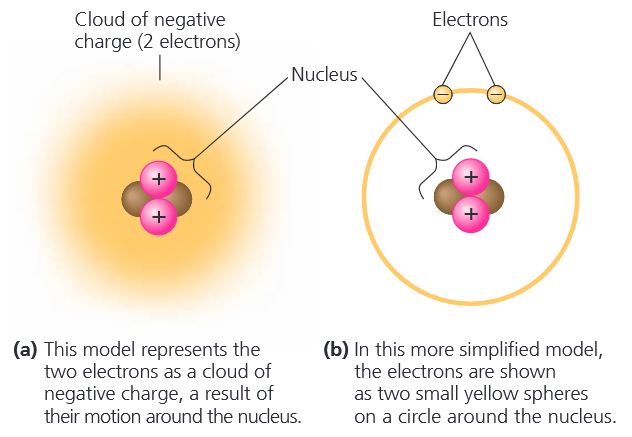
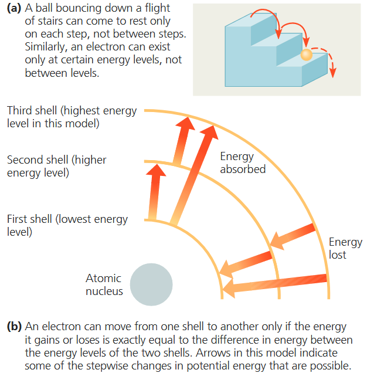
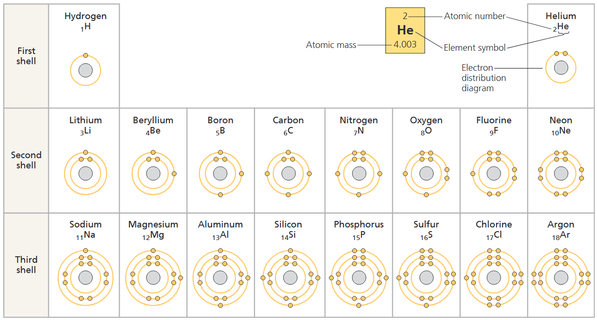
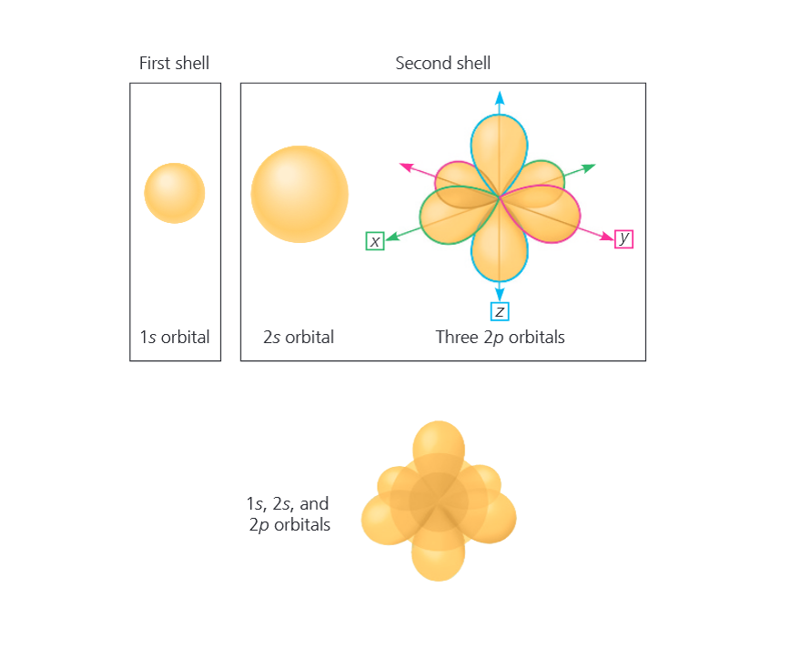
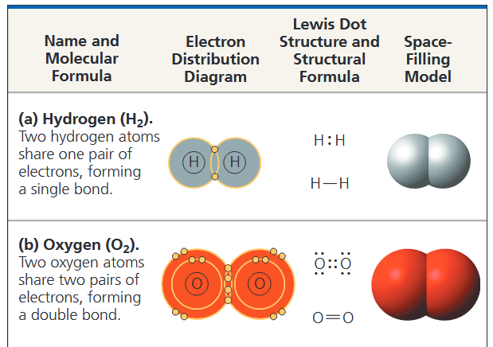
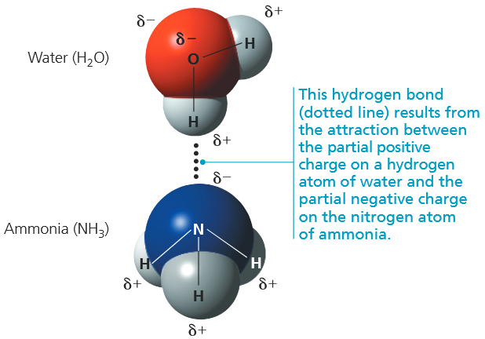
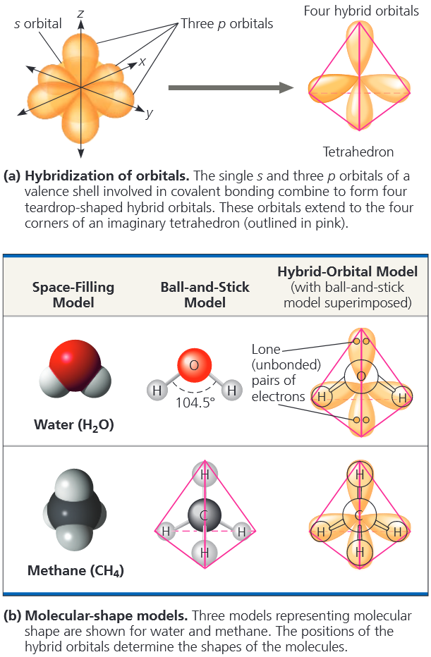
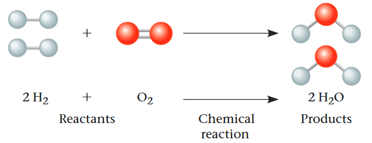

### CONCEPT 2.1 Matter consists of chemical elements in pure form and in combinations called compounds
生物体由物质构成，<b>物质</b>是指一切占据空间且具有质量的事物。物质以多种形态存在。岩石、金属、油脂、气体以及生物有机体，仅是无穷多样物质中的部分实例。
#### Elements and Compounds
物质由元素组成。<b>元素</b>无法通过化学反应分解为其他物质。目前，化学家已确认自然界存在 92 种天然元素，每种元素都有专属符号，通常取自其名称的首字母或前两个字母。部分元素符号源自拉丁语或德语，例如钠的元素符号 Na 来源于拉丁语 *natrium*。

<b>化合物</b>是由两种或两种以上不同元素以固定比例结合而成的物质。例如食盐，即氯化钠 (NaCl），是由钠元素与氯元素按 1:1 的比例构成的化合物。
#### The Elements of Life
在 92 种天然元素中，约 20% 至 25% 为<b>必需元素 (<i>essential elements</i>)</b>，是生物维持健康生命与繁衍所必需的物质。不同生物的必需元素大体相近，但仍存在一定差异。

O、C、H、N 四种元素，约占生物体物质总量的 96%。Ca、P (*phosphorus*)、K (*potassium*)、S 等少量元素，构成生物体剩余约 4% 的质量。<b>微量元素 (<i>trace elements</i>)</b>是生物体需求量极少的元素。Fe 等部分微量元素为所有生命所必需，另一些则仅为特定物种所需。
### CONCEPT 2.2 An element’s properties depend on the structure of its atoms
每种元素都由特定类型的原子构成，不同元素的原子各不相同。<b>原子</b>是保持元素化学性质的最小物质单元。原子的符号与其对应元素的缩写一致，例如符号 C 即代表碳元素也代表一个碳原子。
#### Subatomic Particles
尽管原子是保持元素性质的最小单位，但这种微小物质仍由更小的亚原子粒子 (<i>subatomic particles</i>)构成。物理学家借助高能碰撞，从原子中分离出上百种粒子，本章仅涉及三种：<b>中子</b>、<b>质子</b>与<b>电子</b>。质子和电子带有电荷：每个质子带一个单位正电荷，每个电子带一个单位负电荷。顾名思义，中子呈电中性。

质子与中子紧密聚集在原子中心致密的核心，即<b>原子核</b>内；质子使原子核带正电。高速运动的电子在原子核外围形成带负电的电子云，正负电荷间的相互吸引，使电子维持在原子核周围。<b>图 2.4</b> 以氦原子为例，展示了两种常用的原子结构模型。

中子和质子的质量几乎相等，约为 $1.7\times 10^{-24}$ 克。我们通常不用克来描述这类极小的微观物质，而是使用<b>道尔顿 (<i>dalton</i>)</b>，该单位为纪念 1800 年前后建立原子理论的英国科学家约翰・道尔顿而命名 (道尔顿等同于原子质量单位 (<i>atomic mass unit, amu</i>))。
#### Atomic Number and Atomic Mass
不同元素的原子，其亚原子粒子数量各不相同。同一元素的所有原子，原子核内质子数完全相同。这种专属某一元素的质子数量，称为<b>原子序数</b>，标注在元素符号的左下角。例如 $_2\text{He}$ 表示 He 元素的一个原子的原子核中有两个质子。除非另有说明，原子整体呈电中性，即质子数与电子数相等。因此，原子序数既可表示质子数，也能确定电子数。

我们可通过质量数推算中子数，<b>质量数</b>为原子核内质子数与中子数之和。质量数标注于元素符号左上角。例如，氦原子可简写为 $_2^4\text{He}$。由于原子序数代表质子数，用质量数减去原子序数，即可得出中子数。

由于电子的质量微乎其微，原子的绝大部分质量都集中在原子核内。中子与质子的质量均接近 1 道尔顿，因此质量数与原子的总质量（即原子量）相近，但并不完全相等。例如钠原子 $_{11}^{23}\text{Na}$ 的质量数为 23，但其原子量为 22.9898 道尔顿，二者差异的原因将在下文中解释。
#### Isotopes
同一元素的所有原子质子数相同，但部分原子的中子数更多、质量更大。同种元素的这类不同原子形态，称为该元素的<b>同位素</b>。自然界中，一种元素往往以多种同位素的混合形式存在。以原子序数为 6 的碳元素为例，它有三种天然同位素。最常见的是 $_6^{12}\text{C}$，约占自然界碳总量的 99%，含有 6 个中子。剩余约 1% 的碳主要为 $^{13}_6\text{C}$，含 7 个中子。第三种更为稀有的 $_6^{14}\text{C}$ 则含有 8 个中子。同种元素的同位素质量略有差异，但化学性质完全一致。

若一种元素存在多种天然同位素，其原子量为各同位素按天然丰度加权计算的平均值，因此碳的原子量为 12.01 道尔顿。

$^{12}\text{C}$ 和 $^{13}\text{C}$ 都是稳定的同位素，其原子核不会自发丢失亚原子粒子，该过程称为衰变。而 $^{14}\text{C}$ 同位素性质不稳定，具有放射性。<b>放射性同位素</b>的原子核会自发衰变，释放粒子与能量。若放射性衰变导致质子数发生改变，该原子便会转化为另一种元素的原子。
##### *Radioactive Tracers*
放射性同位素常被用作医学诊断工具。细胞利用放射性原子的方式，与利用同种元素非放射性同位素的方式完全相同。放射性同位素可整合至生物活性分子中，作为示踪剂 (<i>tracer</i>)，用以追踪生物代谢过程中的原子去向。
##### *Radiometric Dating*
研究者们通过化石中的放射性衰减来测量这些遗物的年龄。母体同位素以一个固定的比例衰减为其子体同位素，这个比例称为<b>半衰期</b>，也就是母体同位素衰减百分之五十所需的时间。科学家们使用放射性定年法 (<i>radiometric dating</i>) 来测定不同同位素的比例，计算生物变成化石或岩石经历了多少个半衰期。
#### The Energy Levels of Electrons
原子中电子所具备的能量各不相同。<b>能量</b>被定义为引发变化的能力，例如通过做功实现。<b>势能</b>是物质因其位置或结构而拥有的能量。例如山间水库中的水体因海拔高度而具备势能。当水坝闸门开启、水流顺坡而下时，这份能量可用来做功。

物质天然倾向于趋向势能最低的状态，正如水流自发向下流淌。若要恢复水库的蓄水势能，就必须克服重力做功，将水体抬升。

原子的电子因与原子核存在距离而具备势能<b>(图 2.6)</b>。带负电的电子会被带正电的原子核吸引。将电子移至远离原子核的位置需要消耗能量，因此电子离原子核越远，其势能越高。与水流连续向下流动不同，电子的势能变化只能以固定的能量单位分级发生。

具有特定能量的电子，类似于阶梯上的小球。小球所处台阶不同，势能大小也不同，且无法长时间停留在台阶之间。同理，电子的势能由其能级决定，只能存在于特定能级之上，不能处于能级间隙。

电子的能级与其到原子核的平均距离密切相关。电子分布在不同的<b>电子层</b>中，每层都有固定的平均距离与能级。示意图里的电子层常用同心圆表示，如图 2.6b 所示。第一层电子层离原子核最近，其中的电子势能最低；第二层电子能量更高，第三层电子的能量则进一步升高。

电子可以在不同电子层之间跃迁，但必须吸收或释放特定能量，数值等于两层间的势能差。电子吸收能量后，会跃迁至离原子核更远的外层。当电子释放能量时，会回落至靠近原子核的内层，散失的能量通常以可见光或紫外线的形式向外辐射。
#### Electron Distribution and Chemical Properties
原子的化学性质，由电子层中的电子排布方式决定。以结构最简单的氢原子为起点，我们可以设想，其他元素的原子都是依次增加一个质子、一个电子，并搭配相应数量的中子逐步构成。

以元素周期表的前三行<b>(图 2.7)</b>为例，每一行表示一个周期，行数对应原子所含的电子层数。每一周期内，元素从左至右排列，对应质子数与电子数的依次递增。

氢的 1 个电子与氦的 2 个电子均位于第一层电子层。和所有物质一样，电子倾向于处在势能最低的稳定状态，在原子中，这一最低能级即为第一层电子层。但第一层最多只能容纳 2 个电子，因此周期表第一行仅有氢和氦两种元素。电子数多于 2 个的原子，剩余电子只能排布在更高的电子层，因内层已被填满。

下一个元素锂含有 3 个电子：2 个电子填满第一层，余下 1 个电子排布在第二层。第二层电子层最多容纳 8 个电子。位于第二周期末尾的氖，第二层拥有 8 个电子，核外电子总数为 10。

原子的化学性质主要取决于**最外层**电子的数量。这些外层电子被称为<b>价电子 (<i>valence electrons</i>)</b>，最外层电子层则称为<b>价层</b>。价电子数目相同的元素，化学性质相似。价层被电子填满的原子化学性质稳定，不易与其他原子发生反应。元素周期表最右侧的氦、氖、氩，是图 2.7 中仅有的三种价层已满的元素，这类元素属于惰性 (<i>inert</i>) 气体，化学性质不活泼。
#### Electron Orbitals
图 2.7 中描绘的同心圆仅代表该层电子与原子核的**平均距离**，并不能还原原子的真实结构。我们无法确定电子的精确位置，只能描述电子大概率出现的空间范围。电子有 90% 概率出现的三维空间区域，被称为<b>原子轨道</b>。

每个电子层都有着固定层级的电子，分布在特定形状和不同方向的轨道上<b>(图 2.8)</b>，可以将轨道视为电子层的一部分。

可将轨道理解为电子层的组成单元。第一电子层仅有 1 个球形 *s* 轨道（即1*s*）；第二层包含四个轨道：1 个更大的球形 *s* 轨道（2*s*），以及 3 个哑铃形 *p* 轨道（2*p*轨道）。第三层及更高电子层，除 *s*、*p* 轨道外，还含有结构更复杂的轨道。一个轨道只能容纳 2 个电子，第一个电子层的 _s_ 轨道可以容纳 2 个电子 ，第二层的 4 个轨道最多可以容纳 8 个电子。
### CONCEPT 2.3 The formation and function of molecules and ionic compounds depend on chemical bonding between atoms
价层未填满的原子能够与特定原子发生相互作用，通过共用或转移价电子，使双方的价层达到稳定饱和状态。这种相互作用会让原子紧密结合，依靠<b>化学键</b>相互维系。化学键中强度最高的两类，分别是构成分子的共价键，以及干燥离子化合物中的离子键。
#### Covalent Bonds
<b>共价键</b>是两个原子共用一对价电子所形成的化学键。以两个氢原子相互靠近为例：氢原子的第一层仅有 1 个价电子，而该电子层最多可容纳 2 个电子。当两个氢原子距离近到足以使 1*s* 轨道发生重叠时，二者便可共用电子。此时每个氢原子都拥有 2 个电子，价层达到饱和稳定结构。由共价键结合的两个或多个原子构成<b>分子</b>，上述结合产物即为氢分子。

<b>图 2.10a</b> 展示了氢分子的多种表示方式。其**分子式**，$\text{H}_2$ 简明表示该分子由两个氢原子构成。电子共用关系可通过电子排布图或路易斯电子式 (<i>Lewis dot structure</i>)呈现，即在元素符号周围用黑点表示价电子，如 $\text{H}:\text{H}$。也可使用**结构式**，$\text{H}-\text{H}$，短线代表<b>单键</b>，即一对共用电子。**空间填充模型**最贴近分子的实际形态。

氧原子的第二层含有 6 个价电子，还需 2 个电子即可填满价层。两个氧原子通过共用两对价电子形成分子<b>(图 2.10b)</b>，这种结合方式称为双键，写作 $\text{O}=\text{O}$。

每种能够共用价电子的原子都具有一定的成键能力，即该原子可形成的共价键数目。成键后，原子的最外层电子层将达到满电子的稳定结构。这种成键能力被称作原子的<b>化合价 (<i>valence</i>)</b>，其数值通常等于填满最外层价电子层所需的电子数。

分子中的原子对共用成键电子的吸引能力因元素种类而异。原子在共价键中吸引共用电子的能力，称为<b>电负性 (<i>electronegativity</i>)</b>。原子的电负性越强，对共用电子的吸引力就越大。

同种元素的原子形成共价键时，二者电负性相同，电子被平均共用，电子争夺达到平衡，这类化学键为<b>非极性 (<i>nonpolar</i>) 共价键</b>。例如 $\text{H}_2$ 中的单键与 $\text{O}_2$ 中的双键均属于非极性共价键。但若成键两原子电负性存在差异，共用电子会偏向电负性更强的一方，电子无法均等分配，由此形成<b>极性共价键</b>。键的极性强弱，取决于两个原子的电负性差值。

氧是电负性最强的元素之一，对共用电子的吸引力远大于氢。在氧、氢形成的共价键中，电子出现在氧原子核附近的时间远多于氢原子核附近。由于电子带负电，水分子中共用电子偏向氧原子，使氧原子带有部分负电荷 (用 $\delta^-$ 表示)，氢原子带部分正电荷 ($\delta^+$)。
#### Ionic Bonds
在某些情况下，两个原子对电子的吸引力差距过大，使得其中一方完全失去电子，形成两个带相反电荷的原子，称作<b>离子</b>。带正电的离子叫<b>阳离子 (<i>cation</i>)</b>，带负电的离子叫<b>阴离子 (<i>anion</i>)</b>。由于所带电荷相反，它们之间产生的吸引力叫做<b>离子键</b>。

通过离子键组成的化合物称为<b>离子化合物</b>，或者<b>盐</b>。自然界中发现的盐通常是大小和形状不同的结晶。每个盐都是被电吸引力结合在一起，排列在三维晶格中的大量阴阳离子的聚合体。

离子这一概念同样适用于整体带电的分子。以氯化铵 $\text{NH}_4\text{Cl}$ 为例，其阴离子为单个氯离子 $\text{Cl}^-$，而阳离子是 $\text{NH}_4^+$，由一个氮原子与四个氢原子以共价键结合形成。整个铵根离子带有 1+ 单位正电荷，因其失去了一个电子，核外电子总数相较中性状态少一。

环境会影响离子键的强弱。在干燥的盐晶体中，离子键作用力极强，需借助工具破坏大量化学键才能将晶体敲裂。但当盐晶体溶于水后，离子键会大幅减弱，原因是水分子会与离子相互作用，对离子形成静电屏蔽。
#### Weak Chemical Interactions
除强化学键外，分子内部与分子之间的弱相互作用同样不可或缺，对生命的涌现特性至关重要。许多大型生物分子依靠弱相互作用维持其功能构象。此外，细胞内两个分子相互接触时，可借助弱作用力短暂结合。弱相互作用具备可逆性，这一特性极具优势：分子能够短暂结合、相互作用，随后再彼此分离。
##### *Hydrogen Bonds*
当氢原子以共价键与电负性较强的原子结合时，氢原子会带有部分正电荷，进而吸引附近带有部分负电荷的其他高电负性原子。这种氢原子与电负性原子之间的非共价作用力，即为<b>氢键 (<i>Hydrogen Bonds</i>)</b>。活细胞中，参与形成氢键的电负性原子多为氧或氮。<b>图 2.14</b> 展示了水分子 $\text{H}_2\text{O}$ 与氨分子 $\text{NH}_3$ 之间的氢键作用。

##### *Van der Waals Interactions*
即便是含非极性共价键的分子，也可存在正负电荷区域。电子并非始终均匀分布；任意瞬间，电子可能随机聚集在分子的某一处。由此产生瞬息变化的正负电荷区，使所有原子与分子之间产生相互吸附的作用。这类<b>范德华力 (<i>Van der Waals Interactions</i>)</b> 单独作用时十分微弱，且仅在原子、分子距离极近时才会产生。但大量范德华力共同作用时，便能形成可观的作用力。

范德华力、氢键、水溶液中的离子键及其他弱相互作用，既可以作用于分子之间，也能在蛋白质、核酸等大分子的内部片段之间形成。弱相互作用的叠加效应，能够稳固大分子的三维空间结构。

#### Molecular Shape and Function
分子具有特定的大小与空间构型，这是其在活细胞中行使功能的关键。由两个原子构成的分子均为直线形，而绝大多数多原子分子拥有更为复杂的立体结构。分子的空间形状由原子轨道的排布方式决定<b>(图 2.15)</b>。原子形成共价键时，价层轨道会发生重新杂化排布。

对于价电子同时分布在 *s* 轨道与 *p* 轨道的原子，1 个 *s* 轨道与 3 个 *p* 轨道会重组形成四个全新的杂化轨道 (<i>hybrid orbital</i>)。这些轨道形态一致，呈泪滴状，自原子核区域向外伸展，如图 2.15a 所示。若将泪滴轨道的大端依次连线，便会构成一个四面体。

水分子中，氧原子价层的四条杂化轨道里，两条与氢原子共用成键；剩余两条被孤电子对占据（图 2.15b）。最终水分子呈 V 形结构，两个共价键的键角为 104.5°。

分子的空间构型至关重要：它决定了生物分子如何特异性识别并相互作用。生物分子常通过弱相互作用短暂结合，而前提是二者结构互补。

以鸦片类物质为例，吗啡、海洛因等衍生物能够止痛、改变情绪，原理是与脑细胞表面特定受体微弱结合。这些物质与由垂体分泌的内啡肽 (<i>endorphin</i>) 结构类似，能够竞争性结合大脑内的内啡肽受体，最终产生相同生理效应，缓解疼痛并产生愉悦感。
### CONCEPT 2.4 Chemical reactions make and break chemical bonds
化学键的断裂与形成，会造成物质组成的改变，这类过程称为<b>化学反应</b>。氢气与氧气化合生成水的反应即为典型实例：

书写化学反应方程式时，箭头用以表示<b>反应物</b>向<b>生成物</b>的转化。系数代表参与反应的分子数量，例如 $\text{H}_2\text{O}$ 前的系数 2，代表反应消耗两个氢分子。化学反应遵循质量守恒：反应不会创造或消灭原子，仅重新排布原子间的电子与化学键，反应物中的全部原子都会保留在生成物中。

影响反应速率的因子之一是反应物的浓度。反应物分子的浓度越高，它们彼此碰撞的频率就更高，有机会反应产生产物。这点对产物也适用，当产物的浓度越来越高，导致逆向反应的频率也越来越高。最终正向反应和逆向反应的速率相同，反应物和产物的相对浓度也不再改变，这时就达到了<b>化学平衡</b>的状态。

化学平衡是一个动态平衡，反应仍在双向进行，只是不会影响彼此的浓度；也不意味着反应物和产物的浓度不变，只是彼此的浓度固定在一个恒定的比例。