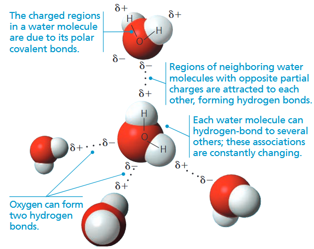
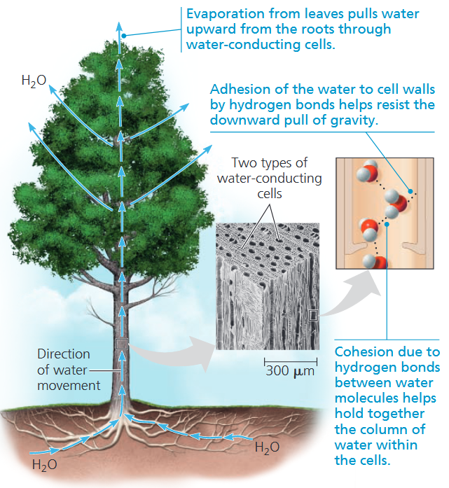
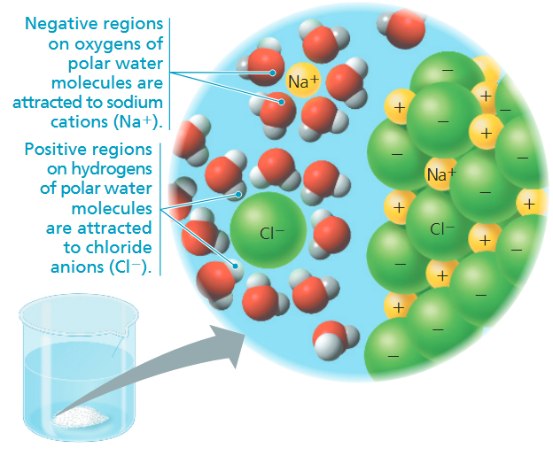
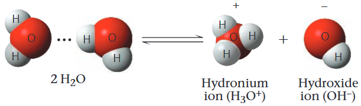

### CONCEPT 3.1 Polar covalent bonds in water molecules result in hydrogen bonding

水分子的结构看似简单。整体呈宽 V 形，两个氢原子以极性共价单键与氧原子相连。氧的电负性强于氢，成键电子更偏向氧原子一侧。电子的不均等共用，加之 V 形空间结构，使水成为<b>极性分子</b>，整体电荷分布不均匀。水分子中，氧原子带部分负电荷 ($\delta^-$)，氢原子带部分正电荷 ($\delta^+$)。

水分子的各项特性，源自不同水分子间异种电荷原子的相互吸引：一个水分子中带部分正电荷的氢原子，会吸引邻近水分子中带部分负电荷的氧原子，由此以氢键将两个分子结合<b>(图 3.2)</b>。

液态水中的氢键十分微弱，强度仅约为共价键的 $1/20$。氢键不断快速断裂、重组，单个氢键的存续时间仅有数万亿分之一秒，但水分子会持续与周边分子形成新的氢键。因此在任意时刻，绝大多数水分子都与相邻分子以氢键相连。水的独特理化性质，正是源于这种氢键作用，它让水分子形成更高层次的有序结构。
### CONCEPT 3.2 Four emergent properties of water contribute to Earth’s suitability for life
#### Cohesion of Water Molecules
氢键使水分子彼此紧密聚集。液态水的分子排布时刻动态变化，但任意时刻，大量水分子都会通过多重氢键相互连接。这种联结让水的有序程度远高于多数液体。大量氢键共同作用、维系水体聚集的现象，称为<b>内聚 (<i>cohesion</i>)</b>。

氢键产生的内聚会带来高<b>表面张力</b>，即液体表面被拉伸或破坏的难易程度。在气水界面处，水分子规则排列，彼此及下层水分子以氢键相连，却无法与上方空气形成作用。这种不对称作用，使水拥有极强的表面张力，表层如同覆盖一层无形薄膜。

内聚还助力植物逆重力运输水分与可溶性养分<b>(图 3.4)</b>。根系吸收的水分，经由输水细胞网络输送至叶片。叶片水分蒸发时，氢键会使脱离叶脉的水分子牵拉下方相连的水分子，这份向上的拉力沿水传导细胞一路传导至根部。<b>附着力 (<i>adhesion</i>)</b>，即不同物质间的吸附作用，同样至关重要。水分子借助氢键吸附于细胞壁，有效抗衡重力的向下牵引。

#### Moderation of Temperature by Water
水能调节气温：从高温空气中吸收热量，并向低温空气释放储存的热能。水是优良的储热介质，可吸收或释放大量热量，自身温度却仅有小幅波动。要理解这一特性，首先需要区分温度与热量。
##### *Temperature and Heat*
一切运动的物体都具有<b>动能</b>，即运动的能量。原子与分子始终处于无规则运动中，因此具备动能。分子运动速率越快，动能越大。原子、分子随机热运动所具备的动能，称为<b>热能 (<i>thermal energy</i>)</b>。

热能与温度密切相关，但并不等同。<b>温度</b>代表物质内部分子的**平均**动能，与体积无关；热能则是分子**总**动能，由物质体积决定。

当两个温度不同的物体相互接触时，热能会从高温物体传递至低温物体，直至二者温度达到平衡。物体之间传递的热能称为<b>热量</b>。常用热量单位为卡路里 (cal)：1 卡路里指使 1 克水升温 1℃ 所需的热量；反之，1 克水降温 1℃ 也会释放 1 卡路里热量。千卡 (kcal) 等于 1000 卡路里，指 1 千克水升温 1℃所需热量。另一能量单位为焦耳 (J）：$1\text{ J}=0.239\text{ cal}$。 
##### *Water’s High Specific Heat*
水之所以能够稳定温度，源于其高比热容。<b>比热容 (<i>specific heat</i>)</b> 的定义：1 克物质温度升降 1℃ 所吸收或释放的热量。根据卡路里的定义，水的比热容为 $1\ \mathrm{cal/(g\cdot^\circ C)}$。相较于多数物质，水的比热容极高。

和水的诸多特性一样，水的高比热容同样源于氢键。断裂氢键需要吸收热量，而氢键形成时则会释放热量。1 卡路里的热量只能让水温小幅变化，因为大部分热能会先用于破坏水分子间的氢键，之后分子运动速率才会加快。
##### *Evaporative Cooling*
一切液体的分子因相互吸引而紧密靠拢。运动速度足以克服分子间引力的分子，会脱离液相，以气态形式扩散至空气中。这种液态向气态的转变，称为汽化。即便低温环境下，运动最快的分子仍可逃逸至空气。任何温度下都会发生微量蒸发，例如室温下的清水终将完全蒸发。对液体加热时，分子平均动能提升，蒸发速率随之加快。

<b>蒸发热 (<i>heat of vaporization</i>)</b> 指 1 克液体完全汽化为气体所需吸收的热量。与高比热容的成因一致，凭借氢键作用，水的汽化热远高于多数液体。在 25℃ 下，蒸发 1 克水约需吸收 580 卡路里，近乎乙醇、氨等物质的两倍。

液体蒸发时，剩余液体的表面温度会下降，该现象称为<b>蒸发冷却 (<i>evaporative cooling</i>)</b>。原因是：动能最大、运动最剧烈的高能分子最容易脱离液面汽化逸出。如同群体中速度最快的个体离开后，剩余个体的平均运动水平随之降低，液体整体平均动能下降，温度便随之降低。
#### Floating of Ice on Liquid Water
水是少数固态密度小于液态的物质，因此冰可浮于水面。多数物质凝固时收缩、密度增大，水却反常膨胀，该特殊性质仍由氢键决定。

水温高于 4℃ 时，水与普通液体规律一致：受热膨胀、遇冷收缩。温度由 4℃ 降至 0℃ 的过程中，水分子运动放缓，氢键难以断裂，逐步趋向结冰。0℃ 时，水分子固定形成规整晶格结构，每个水分子通过氢键与四个相邻水分子结合，结构疏松、体积增大，密度降低。

#### Water: The Solvent of Life
由两种及以上物质组成的均匀液态混合物称为<b>溶液</b>。起溶解作用的物质为<b>溶剂 (<i>solvent</i>)</b>，被溶解的物质为<b>溶质 (<i>solute</i>)</b>。以水作为溶剂形成的溶液，叫作<b>水溶液 (<i>aqueous solution</i>)</b>。

水是用途极广的优良溶剂，根源在于水分子的极性。以食盐为例：食盐晶体表面的钠离子与氯离子直接接触水分子<b>(图 3.8)</b>。依靠异种电荷相互吸引，水分子带部分负电的氧端吸引钠离子，带部分正电的氢端吸引氯离子。水分子包裹游离的阴、阳离子，将其隔开并稳定分散，这层水分子包裹层称为<b>水合层 (<i>hydration shell</i>)</b>。水分子由晶体表层逐步向内作用，最终完全解离离子。最终形成由钠离子、氯离子与水构成的均匀水溶液。

化合物不需要是离子的才能在水中溶解，许多由非离子极性键分子组成的化合物，例如糖，也可以在水中溶解。这些化合物在溶解时，水分子会包裹溶质分子，与它们形成氢键。即使是蛋白质这种大分子也可以在水中溶解，只要它们表面有离子且极性的区域。
##### *Hydrophilic and Hydrophobic Substances*
任何与水有亲和力物质叫做<b>亲水的 (<i>hydrophilic shell</i>)</b>，而那些没有亲和力的，非离子非极性，不能形成氢键的物质被认为是<b>疏水的 (<i>hydrophobic</i>)</b>。
##### *Solute Concentration in Aqueous Solutions*
大部分化学反应牵扯到水中溶解的溶质，为了理解这些反应，我们需要知道溶剂中溶质的浓度。在进行实验时，首先要计算<b>分子质量</b>，也就是分子中所有原子的质量和。由于无法直接称量微量分子，在化学中使用 mol 作为计量单位：1 <b>mol</b> 表示固定数目的微观粒子集合：$6.02\times10^{23}$，叫做阿伏伽德罗常数 (<i>Avogadro’s number</i>)。根据定义：$1\text{g}=6.02\times10^{23}\text{ dalton}$，因此物质摩尔质量数值与分子质量相等、单位为克。

在配制溶液时，生物领域水溶液最常用的浓度单位是<b>摩尔浓度 (<i>molarity</i>)</b>，指每升溶液中所含溶质的摩尔数。
### CONCEPT 3.3 Acidic and basic conditions affect living organisms
水分子间形成氢键时，偶尔会发生氢原子的转移。该氢原子会留存电子，实际发生转移的是氢离子 ($\text{H}^+$)，即带 1 个正电荷的质子，失去一个质子的水分子成为<b>氢氧根离子 (<i>hydroxide ion</i>)</b>($\text{OH}^-$)，质子与另一个水分子成键，使得它成为<b>水合氢离子 (<i>hydronium ion</i>)</b> ($\text{H}_3\text{O}^+$)，这个过程如下:

方便起见，我们用 $\text{H}^+$ 代表 $\text{H}_3\text{O}^+$，尽管 $\text{H}^+$ 不会单独存在，但它总是会与水分子结合形成 $\text{H}_3\text{O}^+$。双箭头说明这个反应是可逆的，最终会达到化学平衡。25°C 纯水中 $\text{H}^+$ 和 $\text{OH}^-$ 的浓度都是 $10^{-7}M$，但是添加特殊的溶质，称为酸和碱，就可以破坏这个平衡。生物学家使用 pH 值来描述溶液的酸性和碱性。
#### Acids and Bases
当酸在水中溶解时，它们会向溶液中提供额外的 $\text{H}^+$。<b>酸</b>是可以增大溶液中 $\text{H}^+$ 浓度的物质，而<b>碱</b>是减小溶液中 $\text{H}^+$ 浓度的物质。一些碱通过直接与氢离子反应来减少其浓度，以氨为例：

    $\text{NH}_3+\text{H}^+\leftrightharpoons\text{NH}_4^+$

其他的碱通过分解出氢氧根与氢离子结合生成水来间接降低 $\text{H}^+$ 浓度：

    $\text{NaOH}\rightarrow\text{Na}^++\text{OH}^-$

氢氧根离子浓度高于氢离子浓度的溶液称为碱性溶液；氢离子与氢氧根离子浓度相等的溶液，则为中性溶液。

盐酸、氢氧化钠的反应式使用单向箭头，因为二者在水中可完全解离：盐酸属于强酸，氢氧化钠为强碱。与之相对，氨水是弱碱。其反应式中的双向箭头表明：氢离子的结合与释放为可逆反应，平衡状态下，铵根离子与氨分子的比值恒定。而弱酸可逆地释放并结合氢离子，如碳酸：

    $\text{H}_2\text{CO}_3\leftrightharpoons\text{H}^++\text{HCO}_3^-$

#### The pH Scale
任何水溶液在 25℃ 时，$\text{H}^+$ 和 $\text{OH}^-$ 浓度的乘积等于 $10^{-14}$，即 $\text{[H}^+\text{][OH}^-\text{]}=10^{-14}$。该恒定关系决定了水溶液中酸碱的变化规律。酸会向溶液释放氢离子，同时消耗氢氧根离子；碱则作用相反，提升 $\text{OH}^-$，并通过结合氢离子生成水，降低 $\text{H}^+$ 浓度。

pH 标度是一种表达 $\text{H}^+$ 浓度范围的简便的数值方法。溶液的氢离子浓度差异可达百万亿倍甚至更高。pH 标度借助对数运算压缩浓度跨度，无需直接使用摩尔每升进行表述。溶液的 pH 值定义为 $\text{H}^+$ 浓度以 10 为底的负对数：

    $\text{pH}=-\text{log[H}^+\text{]}$

#### Buffers
大多数活细胞的内部 pH 值接近 7。即便 pH 发生微小波动，也可能造成损害，因为细胞内的化学反应对氢离子与氢氧根离子的浓度高度敏感。人体血液的 pH 稳定在 7.4 左右，呈弱碱性。若血液 pH 降至 7 或升至 7.8，人体仅能维持数分钟生命；血液中存在一套化学缓冲系统，用以维持酸碱平衡稳定。

缓冲物质的存在，能让生物体液在加入酸或碱时，依旧维持相对稳定的 pH。<b>缓冲物质</b>可最大限度削弱溶液中氢离子与氢氧根离子的浓度变化：氢离子过量时，缓冲物质会结合氢离子；氢离子不足时，则释放氢离子。多数缓冲溶液由弱酸及其共轭碱组成，二者均可与氢离子发生可逆结合。
