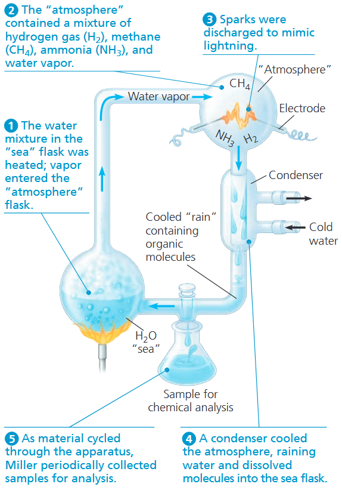
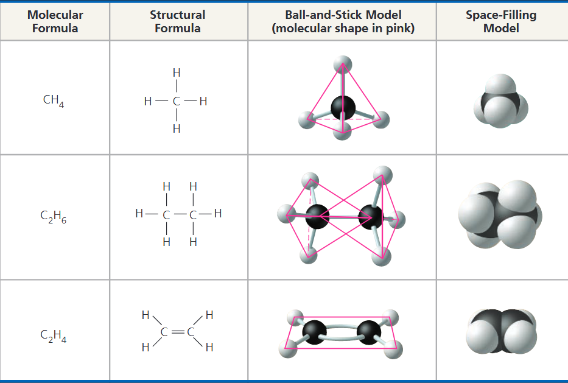
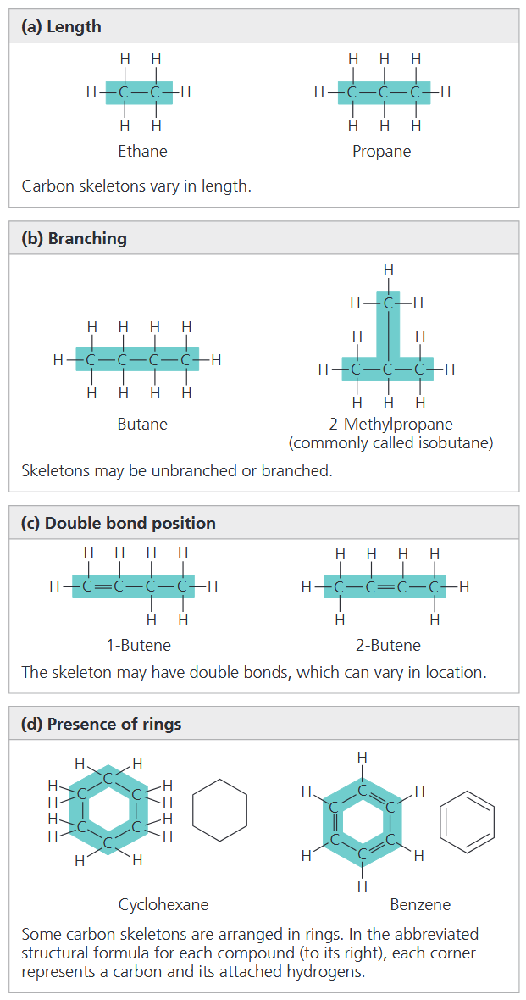
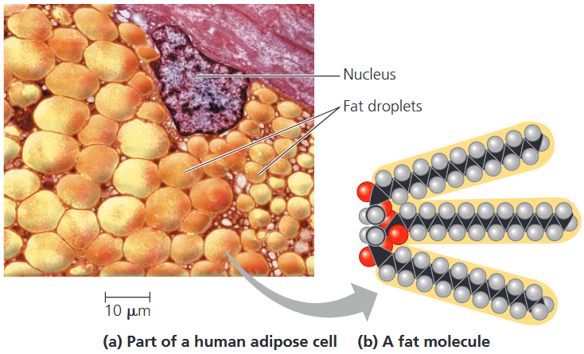
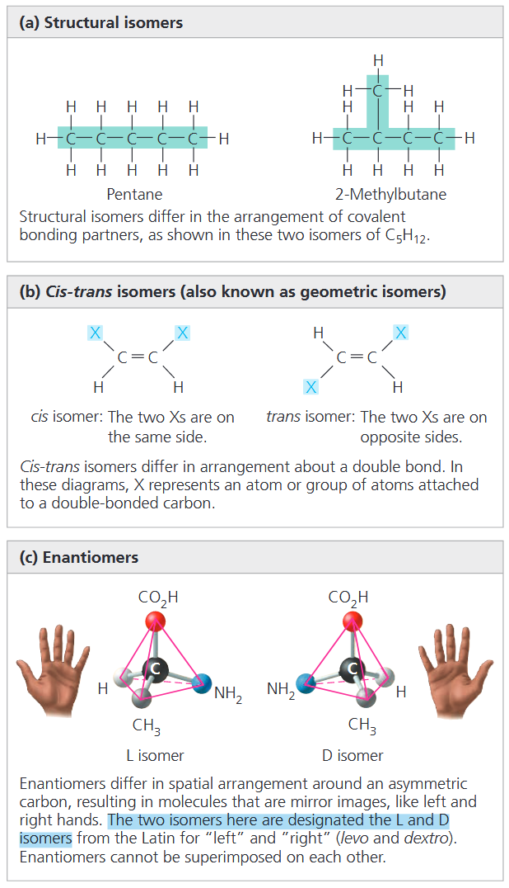
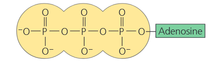

### CONCEPT 4.1 Organic chemistry is key to the origin of life
由于历史原因，含碳化合物被称为有机物，对其开展的研究即为<b>有机化学</b>。有机物种类繁多，结构跨度极大：既有甲烷这类简单分子，也包含由数千个原子构成的蛋白质等巨型大分子。

1953年，Stanley Miller 设计了一个非生物合成有机化合物的实验<b>(图 4.2)</b>，以研究生命的起源。他用一个烧瓶中的水来模拟原始海 (<i>primeval sea</i>)，这些水被加热后蒸发移动到第二个，包含着 "大气层" 的烧瓶——包含氢气，甲烷，氨以及水蒸气。通过火花放电来模拟闪电。用冷凝器冷却大气层，将水和溶解的分子落到海洋烧瓶中。当物质在这套设备中循环时，Miller 周期地收集样本来分析。最后得出结论，复杂的有机分子可以在当时认为存在于早期地球的条件下自发产生。

### CONCEPT 4.2 Carbon atoms can form diverse molecules by bonding to four other atoms
原子的化学性质关键取决于电子排布。电子排布决定了一个原子能与其他原子形成化学键的类型与数量。需要注意的是，只有位于最外层的价电子，才可参与原子间的成键作用。

#### The Formation of Bonds with Carbon
在有机分子中，碳一般形成单键或双键。每个碳原子可作为连接支点，向四个方向延伸出化学键。这一特性使碳能够构建庞大且结构复杂的有机分子。

当碳原子形成四个共价键，它的杂化轨道的排列使得使得化合键向一个假想的四面体的角倾斜。甲烷中的键角是109.5°<b>(图 4.3a)</b>，任何有四个单键的碳原子的形状都类似。以乙烷为例，它的形状像两个重合的四面体<b>(图 4.3b)</b>。两个碳原子形成双键时，比如乙烯，所有的键都在同一平面<b>(图 4.3c)</b>。

原子填满价电子层所需的电子数，通常等于该原子的<b>化合价</b>，也就是该原子能够形成的共价键数目。
#### Molecular Diversity Arising from Variation in Carbon Skeletons
碳链构成了绝大多数有机分子的基本骨架。碳骨架长度各异，可呈直链、支链或闭合环状结构<b>(图 4.5)</b>。部分碳链含有数量、位置各不相同的双键。碳链的多样变化，是生物体内分子结构复杂且种类繁多的重要原因。此外，生物分子的骨架中常包含氧、磷等其他元素，这些原子亦可与碳骨架相连。

##### *Hydrocarbons*
上图所示的分子都是<b>烃类 (<i>hydrocarbon</i>)</b>，只含有碳和氢的有机分子，氢原子会结合在碳骨架上所有可形成共价键的位点。虽然烃类在绝大多数生物体内并不常见，但细胞内部分有机分子，仍含有仅由碳、氢构成的结构区域。例如，被称为脂肪的分子有长的烃尾，附着在非烃成分上<b>(图 4.6)</b>。石油或油脂都不溶于水，因为它们里面大部分的化学键是非极性的碳氢键。

##### *Isomers*
有机分子的结构差异可体现在<b>同分异构体 (<i>isomer</i>)</b> 上：这类化合物所含元素及原子数目完全相同，但结构不同，因而性质各异。同分异构体分为三类：结构异构体、顺反异构体与对映异构体。

<b>结构异构体</b>的原子共价连接方式存在差异。以<b>图 4.7a</b> 中的两种五碳化合物为例：二者分子式均为 $\text{C}_5\text{H}_{12}$，但碳骨架的共价排布不同，一种为直链结构，另一种为支链结构。

在<b>顺反异构体 (<i>cis-trans isomers</i>)</b>中，碳原子的共价连接原子完全相同，但由于双键无法自由旋转，原子的空间排布有所差异。单键可围绕键轴自由旋转，不会改变分子结构；双键则限制旋转。当两个碳原子以双键相连，且每个碳原子均连接两种不同原子或基团时，就会形成两种顺反异构形式。

以双键连接的两个碳原子为例<b>(图 4.7b)</b>，若二者均连有 H 与基团 X：两个 X 位于双键同侧为顺式异构体，位于异侧则为反式异构体。这类异构体细微的空间结构差异，会极大影响有机分子的生物活性。

<b>对映异构体 (<i>enantiomer</i>)</b>互为镜像，其结构差异源于**不对称碳原子**——即连接四种不同原子或基团的碳原子<b>(图 4.7c)</b>。四个基团可在不对称碳周围以两种互为镜像的空间方式排列。对映异构体如同分子的左手与右手构型，无法相互重合。正如右手无法适配左手手套，右旋与左旋分子也不能互换空间结构。通常仅有其中一种异构体具备生物活性，因其可特异性结合生物体内的靶标分子。
### CONCEPT 4.3 A few chemical groups are key to molecular function
#### The Chemical Groups Most Important in the Processes of Life
有机分子的独特性质，不仅取决于碳骨架的排布方式，还与连接在骨架上的各类化学基团密切相关。化学基团会影响分子形状，进而影响其功能；也会直接参与化学反应，这些基团被称为<b>官能团</b>。在生物活动中有七个最重要的基团，烃基 (<i>hydroxyl</i>), 羰基 (<i>carbonyl</i>), 羧基 (<i>carboxyl</i>), 氨基, 巯基 (sulfhydryl), 磷酸基, 和甲基 (<i>methyl</i>)。
#### ATP: An Important Source of Energy for Cellular Processes
有机磷酸化合物——<b>三磷酸腺苷 (ATP)</b>，因其在细胞中至关重要的功能而值得重点关注。ATP 由腺苷与三个相连的磷酸基团结合而成:

当三个磷酸基团依次相连时 (如 ATP），其中一个磷酸基团可通过水解反应脱落，就变成了双磷酸分子 (<i>diphosphate</i>)，也叫做 ADP，并释放出大量能量。

