### CONCEPT 5.1 Macromolecules are polymers, built from monomers
多糖、蛋白质与核酸因分子庞大，被称为<b>大分子</b>；它们均为链状聚合物。<b>聚合物 (<i>polymer</i>)</b>是由大量相似或相同的结构单元以共价键连接形成的长链分子。构成聚合物的重复基本单元，称作<b>单体 (<i>monomer</i>)</b>。部分单体除聚合作用外，自身也具备独立生理功能。
#### The Synthesis and Breakdown of Polymers
尽管各类聚合物的单体各不相同，但生物体内合成与分解生物大分子的化学机制高度相似。细胞中，这类过程由<b>酶 (<i>enzyme</i>)</b> 催化；酶是可加速化学反应的特异性大分子。单体之间或单体与聚合物连接的反应为缩合反应 (<i>condensation reaction</i>)：两分子通过共价键结合，同时脱去一个小分子。若脱去水分子，则该反应称为<b>脱水缩合反应 (<i>dehydration reaction</i>)</b>。

糖类与蛋白质的合成都通过脱水缩合完成。反应中，一分子提供羟基，另一分子提供氢原子<b>(图 5.2a)</b>，共同脱去一份子水。该过程不断重复，单体依次接入长链，使聚合物分子逐步延长。

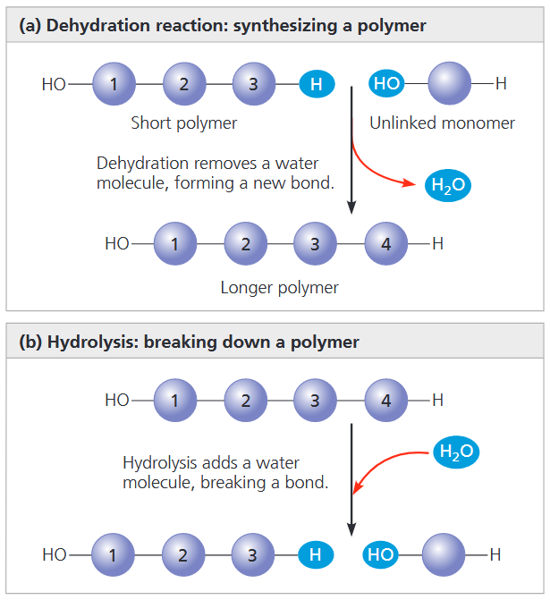

聚合物通过<b>水解反应 (<i>hydrolysis</i>)</b> 分解为单体，该过程与脱水缩合完全相反<b>(图 5.2b)</b>。水解反应依靠水分子断裂单体间的化学键：水分子解离后，氢原子结合一端单体，羟基则结合另一端单体。人体消化作用即为典型的水解过程。食物中的有机物多为大分子聚合物，体积过大无法直接进入细胞。消化道内的多种酶可催化水解反应，将大分子拆解为单体。分解后的单体吸收入血液，输送至全身细胞。细胞再通过脱水缩合，将单体合成全新的特异性聚合物，以满足生理需求。
#### The Diversity of Polymers
一个细胞含有数千种不同的生物大分子，且细胞类型不同，大分子的种类组成也存在差异。近亲之间（如人类同胞）的遗传差异，本质源于聚合物的细微区别，尤以 DNA 与蛋白质为主。无亲缘个体间的分子差异更为显著，物种之间的差距则更大。自然界的生物大分子种类繁多，多样性几乎没有上限。

聚合物的多样性的核心关键是排列顺序：所有生物共用一套基础小分子作为原料，依靠不同的排列组合，形成功能各异的独特大分子。尽管种类纷繁，生物大分子仍可依据结构与功能划分为四大类。每一类大分子都会产生单体不具备的涌现特性。
### CONCEPT 5.2 Carbohydrates serve as fuel and building material
糖类包括单糖及多糖。最简单的糖类为单糖，是构成复杂糖类的单体。二糖由两个单糖通过共价键连接而成。糖类大分子统称为多糖，由大量单糖单元聚合形成。
#### Sugars
<b>单糖 (<i>monosaccharide</i>)</b> 的化学式通常是 $\text{CH}_2\text{O}$ 的整数倍。葡萄糖 ($\text{C}_6\text{H}_{12}\text{O}_6$) 是最常见的单糖，在生命化学中居核心地位。在其结构中我们可以看到单糖的许多特点：一个羰基，多个羟基。基于羰基的位置，一个单糖可以分为醛糖 (<i>aldose</i>) 或酮糖 (<i>ketose</i>)，大部分糖以 *-ose* 结尾。另一个分类标准是碳骨架的大小，其范围是 3-7。

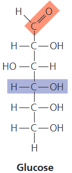

简单糖类的另一多样性来源，是基团在不对称碳原子周围的空间排布方式。（不对称碳原子指连接四种不同原子或基团的碳原子。）例如，葡萄糖与半乳糖仅在某个不对称碳上的基团位置存在差异。这一看似微小的区别，足以使两种糖类形成不同空间结构与结合特性，进而产生截然不同的生理性质。

尽管用线性碳骨架来描绘葡萄糖的结构很方便，但它并不是完全准确的。在水溶液中，葡萄糖分子和其他的大部分五碳糖，六碳糖会成环，因为环形是它们最稳定的形式<b>(图 5.4)</b>。

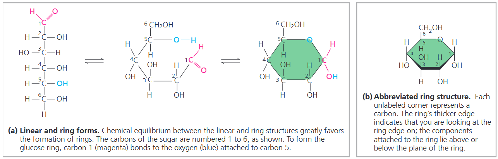

单糖尤其是葡萄糖，是细胞主要的营养物质，它们的碳骨架也可作为合成其他小分子有机物的原材料，例如氨基酸和脂肪酸。

<b>二糖 (<i>disaccharide</i>)</b> 由两个单糖通过糖苷键 (<i>glycosidic linkage</i>) 连接而成。糖苷键是单糖经脱水缩合形成的共价键。例如，麦芽糖由两分子葡萄糖结合而成，常用于啤酒酿造<b>(图 5.5a)</b>。

最常见的二糖是蔗糖，即食用糖，由葡萄糖和果糖构成<b>(图 5.5b)</b>。植物通常以蔗糖形式，将糖类从叶片输送至根部及其他非光合器官。二糖必须被分解成单糖后才能被生物体利用。

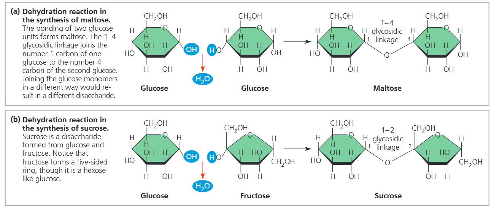

#### Polysaccharides
<b>多糖 (<i>polysaccharide</i>)</b> 属于生物大分子，是由数百至数千个单糖通过糖苷键连接形成的聚合物。部分多糖可作为储能物质，能根据机体需求水解，为细胞供给单糖。
##### *Storage Polysaccharides*
动植物均以储能多糖的形式储存糖类，以供后续利用<b>(图 5.6)</b>。植物合成<b>淀粉 (<i>starch</i>)</b>——一种葡萄糖单体构成的聚合物，以颗粒形式储存于质体中。淀粉可囤积多余葡萄糖；作为细胞主要能源物质，葡萄糖以淀粉形式实现能量储备。植物可通过水解断裂葡萄糖单体间的糖苷键，从这一 “碳水储备库” 中分解获取糖分。包括人类在内的多数动物，都含有水解植物淀粉的酶，从而分解出葡萄糖，为细胞供能。

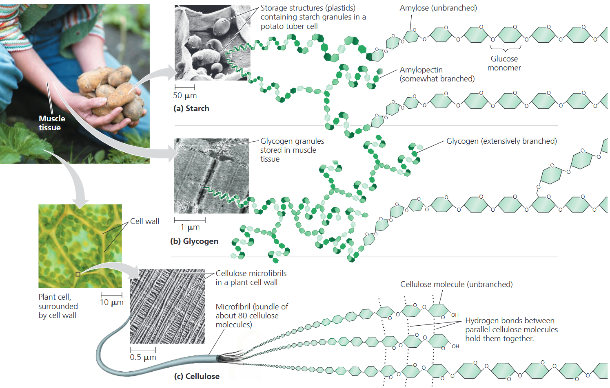

大部分淀粉中的葡萄糖单体通过 1-4 糖苷键相连，与麦芽糖中葡萄糖的连接方式一样。淀粉的最简形式为直链淀粉 (<i>amylose</i>)，无分支结构。结构更复杂的支链淀粉 (<i>amylopectin</i>) 则为分支状聚合物，其分支点通过 1–6 糖苷键连接。

动物存储的多糖叫做<b>糖原 (<i>glycogen</i>)</b>，它也是葡萄糖的聚合物但是分支程度要高于支链淀粉<b>(图 5.6b)</b>。脊椎动物主要在肝细胞和肌细胞中存储糖原，当对能量的需求上升时，这些细胞中的糖原就会分解。然而，这种储备能源无法长期维持动物生命活动。以人类为例，若不通过进食持续补充，体内糖原储备大约一天内就会耗尽。低碳饮食常会引发该问题，进而导致身体虚弱、疲乏无力。
##### *Structural Polysaccharides*
生物体利用结构多糖合成坚韧的机体组织。例如，<b>纤维素 (<i>cellulose</i>)</b> 是植物细胞壁的主要组成成分<b>(图 5.6c)</b>。全球植物每年可产生近 1000 亿吨纤维素，它也是地球上含量最丰富的有机化合物。

与淀粉类似，纤维素也是葡萄糖通过 1-4 糖苷键连接的聚合物，但是这两种聚合物中的连接方式有所区别。这种区别是因为葡萄糖具有两种略微不同的环形结构<b>(图 5.7a)</b>。葡萄糖形成环状结构时，一号碳原子上的羟基，会位于环平面的上方或下方。葡萄糖的这两种环状构型，分别称为$\alpha-$构型与$\beta-$构型。淀粉中所有葡萄糖单体均为$\alpha-$构型<b>(图 5.7b)</b>；而纤维素的葡萄糖单体全部为$\beta-$构型，使得相邻葡萄糖单元彼此反向倒置排列<b>(图 5.7c)</b>。

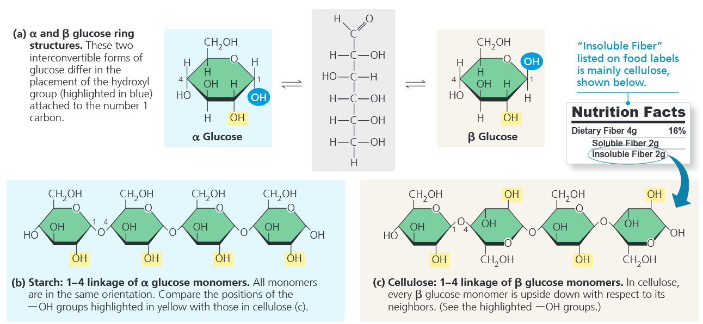

能够水解淀粉的$\alpha-$糖苷键的酶不能水解纤维素中的$\beta-$糖苷键，实际上只有很少部分生物体能够消化纤维素，几乎所有动物都无法消化纤维素。食物中的纤维素会直接经过消化道，最终随粪便排出。过程中，纤维素可摩擦消化道壁，刺激黏膜分泌黏液，助力食物顺畅通行。因此，纤维素虽不能为人体提供营养，却是健康饮食的重要组成部分。

另一个重要的结构多糖是<b>几丁质 (<i>chitin</i>)</b>。节肢动物借助该糖类合成外骨骼，用以包裹保护柔软躯体。外骨骼由几丁质与蛋白质交织构成，质地柔韧；后续可通过蛋白质交联或碳酸钙沉积硬化。几丁质与纤维素结构相似，同样含有$\beta-$糖苷键，区别在于其葡萄糖单体上连有含氮基团。
### CONCEPT 5.3 Lipids are a diverse group of hydrophobic molecules
脂质是唯一不含真正聚合物的生物大分子类别，且通常不足以被称作高分子化合物。<b>脂质 (<i>lipid</i>)</b> 物质因共同特征归为一类：具有疏水性，难以与水相融。该特性由分子结构决定：脂质虽含有少量含氧极性键，但主体为烃类区域，遍布非极性碳氢键。脂质形态与功能多样，包含蜡质与部分色素。生物学重点研究三类核心脂质：脂肪、磷脂与类固醇。
#### Fats
脂肪由一个甘油分子与三个脂肪酸分子结合而成<b>(图 5.9)</b>。甘油属于醇类，三个碳上均有一个羟基。<b>脂肪酸 (<i>fatty acid</i>)</b> 有一个长度为 16-18 的长的碳链，碳链末端通常是一个羧基，碳链其余部分为烃链。脂肪酸烃链中大量非极性碳氢键，是脂肪具备疏水性的根本原因。水分子之间会形成氢键，从而排斥脂肪分子，使二者相互分离。

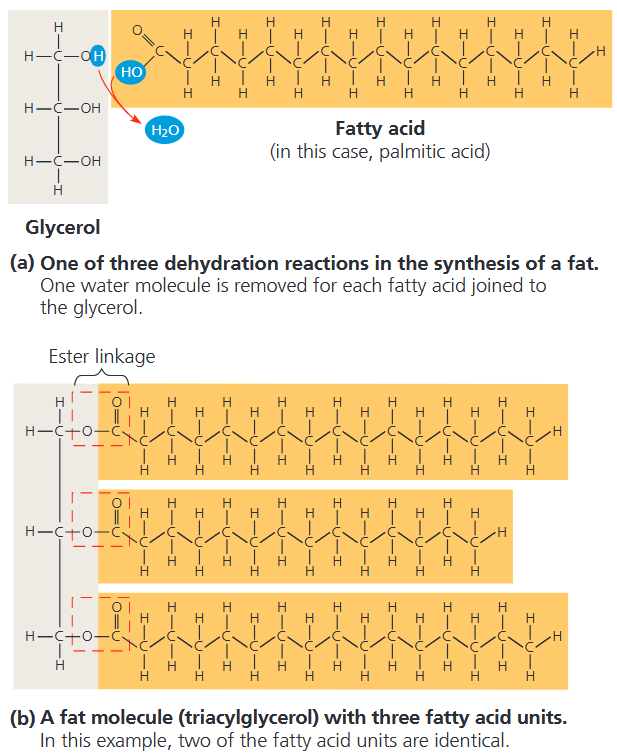

在合成脂肪时，每个脂肪酸分子会通过缩合反应连接到甘油上，形成酯键，即羟基与羧基之间形成的共价键。最终，一分子甘油结合三分子脂肪酸，构成完整的脂肪分子。脂肪中的脂肪酸可以完全相同，也可以是两种或三种不同的类型。

**饱和**脂与**不饱和**脂是营养学常用概念<b>(图 5.10)</b>，二者的差异源于脂肪酸烃链的结构。若碳链碳原子之间无双键，碳骨架便能结合最大限度的氢原子，这类脂肪酸即为<b>饱和脂肪酸</b>。<b>不饱和脂肪酸</b>含有一个或多个碳碳双键，每个双键碳原子会少结合一个氢原子。天然脂肪酸中的双键几乎均为顺式双键，会使烃链产生弯折 (<i>kink</i>)。

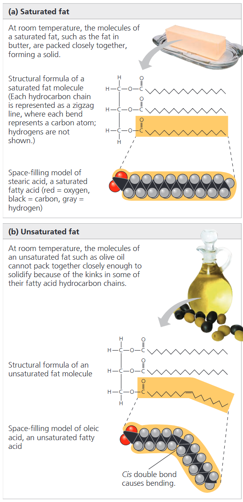

由饱和脂肪酸构成的脂肪称为饱和脂。大多数动物脂肪均为饱和脂肪：其脂肪酸烃链不含双键，分子结构柔软，能够紧密堆叠。猪油、黄油等动物性饱和脂肪在常温下呈固态。相反，植物与鱼类脂肪多为不饱和脂，由一种或多种不饱和脂组成，常温下通常为液态，统称为油脂，例如橄榄油、鱼肝油。顺式双键造成的碳链弯折，阻碍分子紧密排列，使其难以在室温凝固。

长期摄入富含饱和脂的饮食，是诱发动脉粥样硬化 (<i>atherosclerosis</i>) 等心血管疾病的诱因之一。该疾病会使血管内壁形成斑块沉积物，造成血管向内隆起，阻碍血液流动并降低血管弹性。植物油氢化过程除生成饱和脂肪外，还会产生含反式双键的不饱和脂肪。<b>反式脂肪</b>会提升冠心病发病风险。

脂肪的主要功能是储存能量。脂肪中的烃链与汽油分子类似，都含有大量的能量。1g 脂肪存储的能量比 1g 多糖存储能量的 2 倍还要多。 植物活动范围有限，因此可以依靠体积庞大的淀粉来储存能量。而动物需要随时携带自身能量储备，因此脂肪这种高密度、更紧凑的储能物质更具优势。人类及其他哺乳动物，都将长期能量储备储存于脂肪细胞中。
#### Phospholipids
细胞的生存离不开另一类脂质——磷脂。磷脂是细胞膜的主要成分，对细胞至关重要，其结构是分子层面结构与功能相适应的典型范例。如<b>图 5.11</b>，磷脂结构与脂肪相似，但甘油上仅连接两条脂肪酸链，而非三条。甘油的第三个羟基与带负电的磷酸基团相连；磷酸基团通常还会结合一个小型带电或极性分子 (如胆碱 (<i>choline</i>))。不同的附加基团，可形成多种类型各异的磷脂。

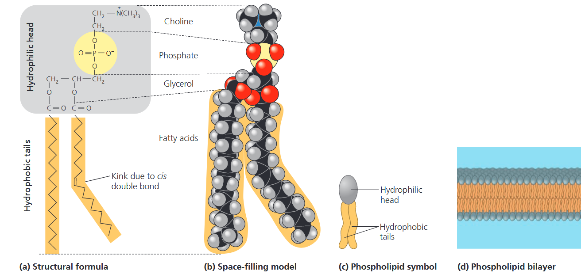

磷脂的两端在遇水时产生不同的表现：两条烃链尾部为疏水性，会排斥水分子；而磷酸基团及其相连基团构成亲水性头部，易与水结合。当磷脂置于水中时，会自发组装形成磷脂双分子层，将疏水脂肪酸尾部隔绝于水环境之外。

在细胞表面，磷脂会排列成类似的双分子层。亲水头处于双层的外部，与细胞中的水溶液环境相接触；疏水尾指向脂双层内部，远离水分子。磷脂双分子层构成细胞与外界的屏障，同时在真核细胞内分隔出不同功能区室。
#### Steroids
<b>类固醇 (<i>steroid</i>) </b>是一类脂质，特征为含有四个稠合环构成的碳骨架。不同类固醇的区别，在于环状结构上连接的官能团各不相同。

<b>胆固醇 (<i>cholesterol</i>) </b>属于类固醇，是动物体内的关键物质<b>(图 5.12)</b>。它是动物细胞膜的重要组分，也是合成性激素等其他类固醇激素的前体分子。脊椎动物的胆固醇主要由肝脏合成，也可从食物中摄取。

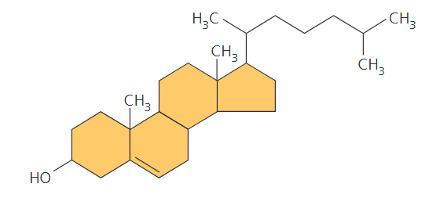

### CONCEPT 5.4 Proteins include a diversity of structures, resulting in a wide range of functions
生物体几乎所有生命活动都依赖蛋白质。在多数细胞中，蛋白质占干重的 50% 以上，广泛参与各项生命进程。部分蛋白质可催化化学反应，还有的承担免疫防御、物质储存、运输、细胞通讯、机体运动及结构支撑等功能。

生命活动离不开酶，大部分酶都是蛋白质。<b>酶蛋白</b>可作为催化剂调控代谢反应，能选择性加快化学反应速率，且反应前后自身不被消耗。酶可反复发挥作用，是维持细胞生命代谢持续运转的核心功能分子。

所有蛋白质均由 20 种氨基酸构成，以无分支的聚合物形式连接。氨基酸之间的化学键称为肽键，氨基酸聚合形成的长链即为<b>多肽 (<i>polypeptide</i>)</b>。<b>蛋白质</b>是具备生理功能的生物分子，由一条或多条多肽链组成，通过折叠、螺旋形成独特的三维空间结构。
#### Amino Acids (Monomers)
所有的氨基酸都有着一个共同的结构。<b>氨基酸</b>是同时含有氨基与羧基的有机分子。氨基酸中心为$\alpha-$碳原子，属于不对称碳原子。该碳原子分别连接四个基团：氨基、羧基、氢原子，以及可变的 R 基 (侧链)。R 基的差异，决定了每种氨基酸的独特性质。R 基的结构可简可繁，最简单仅为一个氢原子，复杂则是带有多种官能团的碳骨架。侧链的理化性质决定每种氨基酸的独有特性，进而影响其在多肽链中的功能作用。

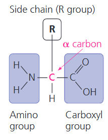

氨基酸依据侧链性质分类。第一类为非极性侧链氨基酸，具有疏水性；第二类为极性侧链氨基酸，具有亲水性。酸性氨基酸的侧链因含羧基，在细胞生理 pH 下解离带负电；碱性氨基酸的侧链含有氨基，通常带正电。此处酸碱性仅指代侧链基团，因为所有氨基酸单体本身都同时含有氨基与羧基。带电的酸性、碱性侧链同样具备亲水性。
#### Polypeptides (Amino Acid Polymers)
现在我们来看氨基酸如何连接形成聚合物<b>(图 5.15)</b>。当两个氨基酸排布得当，使其中一个的羧基与另一个的氨基相邻时，二者可通过脱水反应相连，脱去一分子水。由此形成的共价键称为<b>肽键 (<i>peptide bond</i>)</b>。该过程不断重复，便生成多肽，即大量氨基酸经肽键连接而成的聚合物。

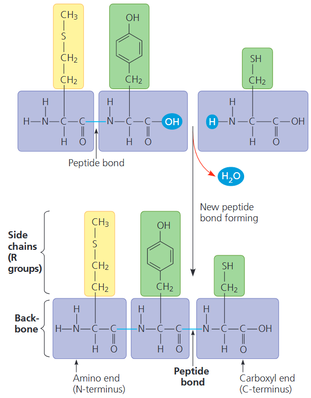

#### Protein Structure and Function
蛋白质的特定功能源自其复杂精巧的三维空间结构，而其最基础的结构层次便是氨基酸序列。
##### *Four Levels of Protein Structure*
尽管蛋白质种类繁多、形态各异，但都具备三层叠加的基础结构：一级结构、二级结构、三级结构。若蛋白质由两条及以上多肽链构成，则会形成第四层结构，即四级结构。

- Primary Structure —— Linear chain of amino acids

蛋白质的<b>一级结构</b>是氨基酸序列，如转甲状腺素蛋白 (transthyretin)，一种转运维生素 A 和甲状腺素的球形血液蛋白。它由四条完全相同的多肽链组成，每条肽链由 127 个氨基酸组成。

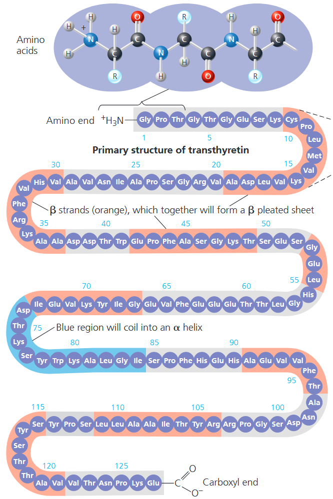

一级结构就如同长单词中字母的排列顺序。若完全随机组合，一条由 127 个氨基酸构成的多肽链，会存在 $20^{127}$ 种排列方式。然而，蛋白质精确的一级结构并非由氨基酸随机连接形成，而是由遗传信息所决定。多肽链上氨基酸的主链与侧链具备特定化学性质，由此，一级结构会进一步决定蛋白质的二级结构和三级结构。

- Secondary Structure —— Regions stabilized by hydrogen bonds between atoms of the polypeptide backbone

大多数蛋白质的多肽链会有部分片段发生规律性的盘绕或折叠，共同塑造蛋白质的整体形态。这类盘绕与折叠统称为<b>二级结构</b>，由多肽主链重复结构单元之间的氢键维系形成，不涉及氨基酸侧链。

在肽链主链中，氧原子带部分负电荷，与氮原子相连的氢原子带部分正电荷，因此二者之间能够形成氢键。单个氢键作用力微弱，但在多肽链较长区段内大量重复分布，足以稳定蛋白质该区域的特定空间构象。

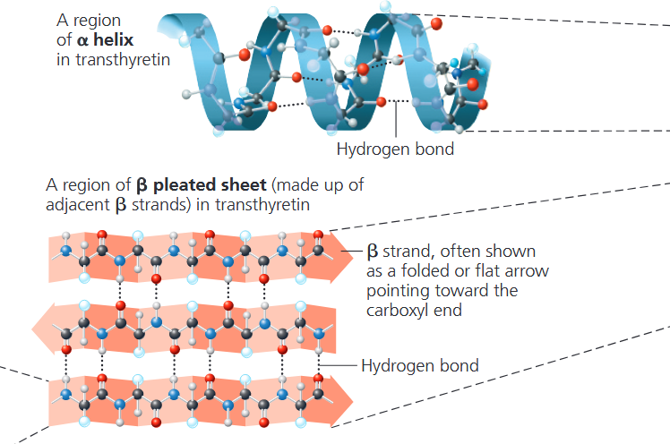

其中一种二级结构是<b>α-螺旋</b>，是一种精巧的螺旋构象，通过每隔四个氨基酸形成氢键来维持稳定。转甲状腺素蛋白的每条多肽链仅含有一段$\alpha-$螺旋区域；而其他球状蛋白拥有多段$\alpha-$螺旋，中间以非螺旋区段间隔。部分纤维蛋白，例如构成毛发的结构蛋白$\alpha-$角蛋白，其整条链的绝大部分都呈$\alpha-$螺旋结构。

另一种二级结构是<b>β-折叠片</b>，两条或多条并排排布的多肽链片段，依靠平行片段之间形成的氢键相互连接。$\beta-$折叠片构成了许多球状蛋白的核心结构，转甲状腺素蛋白便是典型例子；同时也大量存在于部分纤维蛋白中，例如蛛网的丝蛋白。大量氢键协同作用，使蛛丝纤维的强度远超同等粗细的钢丝。

- Tertiary Structure —— Three-dimensional shape stabilized by interactions between side chains

在二级结构的基础之上，蛋白质进一步折叠形成<b>三级结构</b>，如图是转甲状腺素蛋白多肽的带状模型。二级结构仅涉及多肽主链基团间的相互作用，而三级结构是多肽链的整体空间形态，由各类氨基酸侧链之间的相互作用共同决定。

维系三级结构的作用力中有一种叫做<b>疏水作用</b>。当多肽折叠为功能构象时，带有疏水性（非极性）侧链的氨基酸，通常会聚集在蛋白质内部核心，避开水环境。因此，疏水作用本质上是水分子排斥非极性物质所产生的效应。非极性氨基酸侧链相互靠近后，范德华力会将其稳固结合。与此同时，极性侧链之间的氢键、带正负电荷侧链之间的离子键，也共同稳定三级结构。在细胞的水溶液环境中，以上均为弱相互作用，但众多弱作用力叠加，共同赋予蛋白质独一无二的空间构象。

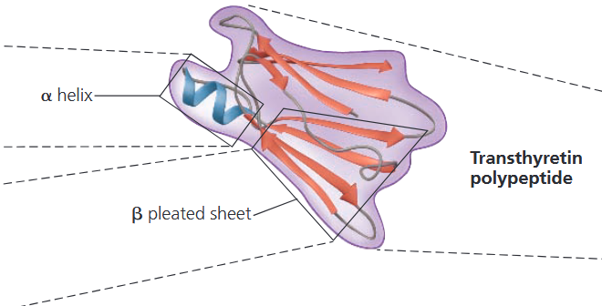

被称为<b>二硫键 (<i>disulfide bridge</i>)</b> 的共价键可进一步加固蛋白质空间构象。半胱氨酸的侧链含有巯基；蛋白质折叠使两个半胱氨酸相互靠近时，便会形成二硫键。两个半胱氨酸的硫原子彼此相连，形成的 **—S—S—** 二硫键能牢牢锁定蛋白质的局部结构。

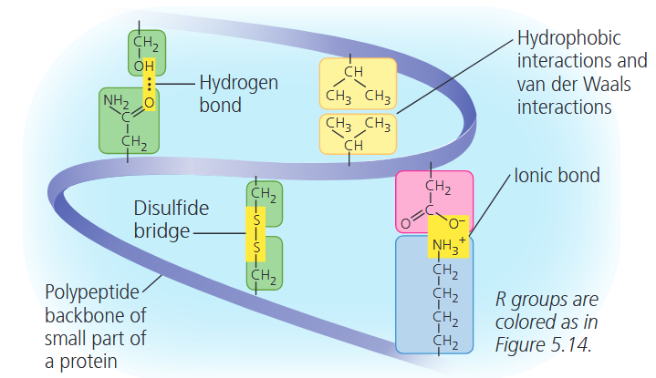

- Quaternary Structure —— Association of two or more polypeptides (some proteins only)

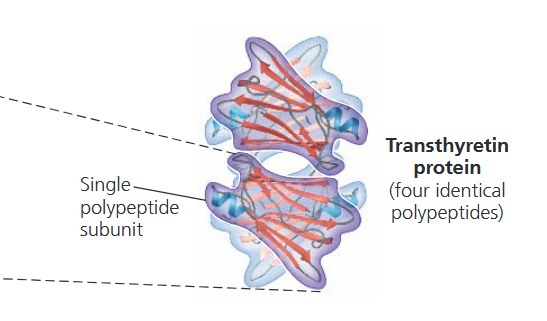

一些含有两条以上多肽链的蛋白质会聚合在一起形成具有特殊功能的大分子。<b>四级结构</b>，即是多个多肽亚基相互聚集所构成的蛋白质整体空间结构。例如之前所述的球状转甲状腺素蛋白，便由四条多肽链组装而成。
##### *Sickle-Cell Disease: A Change in Primary Structure*
即使一级结构的微小变化也会影响蛋白质的形状和功能。例如<b>镰状细胞病</b>，一种血液遗传病，其病因是血红蛋白一级结构中的第六个氨基酸位置的谷氨酸被缬氨酸代替。正常的红细胞是盘状的，但是镰状细胞病使得正常的血红蛋白分子发生聚集，使得细胞变形成镰刀状<b>(图 5.19)</b>。

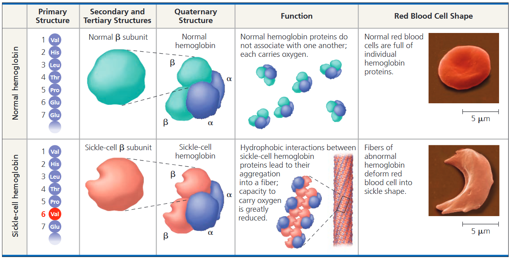

##### *What Determines Protein Structure?*
蛋白质的形状还受到蛋白质的物理环境或化学环境的影响。如果 pH，盐浓度，温度，或者其他环境因素发生变化，蛋白质中的弱化学键和相互作用就会被破坏，使得蛋白质失去原始的形状，这种变化叫做变性<b>(图 5.20)</b>。

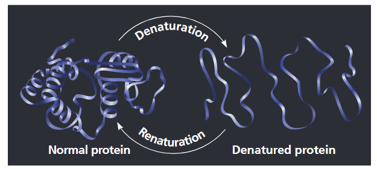

##### *Protein Folding in the Cell*
生物化学家目前已测定约1.6 亿种蛋白质的氨基酸序列，每月新增约 450 至 500 万种，同时解析出约 4 万种蛋白质的三维空间结构。研究人员一直尝试关联多种蛋白质的一级结构与三维结构，以此破译蛋白质的折叠规律。

但遗憾的是，蛋白质折叠过程远比想象复杂。大多数蛋白质在形成稳定构象前，会历经多种中间折叠状态；仅观察最终成熟的空间结构，无法还原其完整的折叠历程。不过，生物化学家现已研发出相关技术，能够追踪蛋白质的各阶段折叠过程，进一步深入探究这一生理关键机制。

最常使用的确定蛋白质的三维结构的方法是 <b>X 射线晶体学</b>，依赖于结晶分子中的原子对 X 射线束的衍射。通过这个方法，科学家们可以建立一个 3D 模型来准确地描述蛋白质分子中每一个原子的位置<b>(图 5.21)</b>。

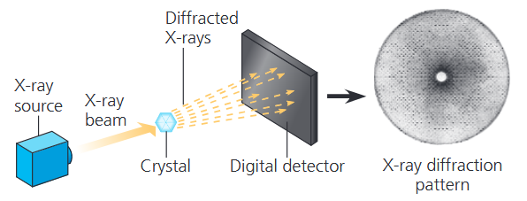

### CONCEPT 5.5 Nucleic acids store, transmit, and help express hereditary information
倘若多肽的一级结构决定蛋白质的空间形态，那么又是什么决定了一级结构？多肽的氨基酸序列，由一种名为<b>基因</b>的独立遗传单位编码调控。基因的本质是 DNA，而 DNA 属于核酸类化合物。<b>核酸</b>是由核苷酸作为单体聚合形成的生物大分子。
#### The Roles of Nucleic Acids
核酸有两种，<b>脱氧核糖核酸</b>和<b>核糖核酸</b>，使生物体能够将其复杂的成分代代相传。DNA 为其自身的复制提供方向，也可以引导 RNA 的合成，通过 RNA 控制蛋白质的合成，这整个过程叫做<b>基因表达</b><b>(图 5.22)</b>。

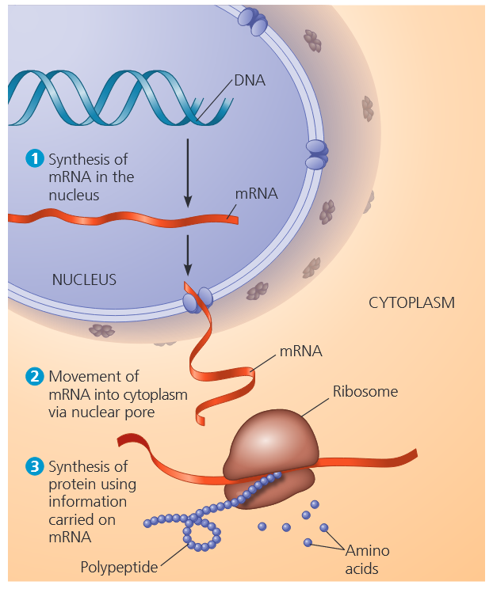

DNA 是生物体从亲代继承而来的遗传物质。每条染色体包含一条长线状 DNA 分子，通常携带数百个及以上的基因。细胞通过分裂增殖时，DNA 会完成复制，并逐代传递给子细胞。调控细胞全部生命活动的遗传信息，都编码在 DNA 的分子结构之中。但 DNA 并不会直接参与细胞的各项生命运作，遗传指令的执行必须依靠蛋白质。

同为核酸的 RNA，如何参与基因表达？DNA 上的特定基因可指导合成 mRNA。mRNA 会与细胞内的蛋白质合成系统结合，调控多肽链的合成，多肽链再经折叠形成完整或部分蛋白质。遗传信息的传递流程可概括为：DNA → RNA → 蛋白质。

蛋白质的合成场所是核糖体 (<i>ribosome</i>)。真核细胞中，核糖体位于细胞质，而 DNA 储存于细胞核内。信使 RNA 负责将合成蛋白质的遗传指令，从细胞核传递至细胞质。原核细胞无成形细胞核，但同样依靠 mRNA，把 DNA 中的遗传信息传递给核糖体与其他细胞结构，进而将遗传密码翻译为氨基酸序列。
#### The Components of Nucleic Acids
核酸以<b>多核苷酸</b>形式的聚合物形式存在<b>(图 5.23a)</b>，其单体叫做<b>多核苷酸</b>。核苷酸由三部分组成：五碳糖，含氮碱基和一到三个磷酸基<b>(图 5.23b)</b>。在形成多核苷酸时，第一个单体通常有三个磷酸基，在缩合反应中会失去两个。不含磷酸基团的核苷酸称为核苷。

含氮碱基<b>(图 5.23c)</b>中有一个或两个含氮的环 (在溶液中氮原子有与 $\text{H}^+$ 反应的倾向，因此称为碱基)，主要分为两类：嘧啶和嘌呤。<b>嘧啶 (<i>pyrimidine</i>) </b>含有一个由碳原子与氮原子构成的六元环。嘧啶类碱基包括：<b>胞嘧啶 (<i>cytosine, C</i>)</b>、<b>胸腺嘧啶 (<i>thymine, T</i>)</b>、<b>尿嘧啶 (<i>uracil, U</i>)</b>。嘌呤由一个五元环和一个六元环组成，包括<b>鸟嘌呤 (<i>guanine, G</i>)</b> 和<b>腺嘌呤 (<i>adenine, A</i>)</b>。DNA 和 RNA 中都含有 A, C, G，而 T 只存在于 DNA 中，U 只存在于 RNA 中。

DNA 中的糖是脱氧核糖，RNA 中的糖是核糖，两者的区别仅在于二号位的碳上是否有氧原子。
#### Nucleotide Polymers
在多核苷酸中，相邻核苷酸间通过磷酸二酯键 (<i>phosphodiester linkage</i>)相连，磷酸基团以共价键衔接两个核苷酸的五碳糖。这种连接方式形成重复的糖–磷酸骨架，含氮碱基并不参与构成骨架。

聚合物的两个游离末端结构截然不同：一端的磷酸基团连接在五碳糖的 5' 碳上，为 **5' 端**；另一端的 3' 碳带有羟基，为 **3' 端**。因此，多核苷酸的糖–磷酸骨架具有固定方向性，沿 5'→3' 延伸，类似单行道。含氮碱基则规律结合在整条骨架外侧。

DNA (或 mRNA) 链上的碱基序列具有基因特异性，为细胞传递高度专一的遗传信息。基因通常包含数百至数千个核苷酸，因此碱基的排列组合近乎无限。基因携带的遗传信息，由四种 DNA 碱基的特定排列方式编码。
#### The Structures of DNA and RNA Molecules
一个 DNA 分子有两个多核苷酸分子，或两条链，沿着一条假想的轴缠绕形成双螺旋<b>(图 5.24a)</b>。两条糖–磷酸骨架的延伸方向相反，均为 5'→3'，该排布方式称为<b>反向平行</b>。糖–磷酸骨架位于螺旋外侧，含氮碱基在螺旋内部两两配对。两条链依靠碱基对之间的氢键维系结合。

碱基在配对时，一条链中的 A 与另一条链中的 T 进行配对，而 C 通常与 G 配对，双螺旋的两条链是互补的，只需读取 DNA 单链的碱基序列，便可依据碱基互补原则推导出互补链的序列。正是该特性，让细胞分裂前的 DNA 精准复制成为可能。细胞分裂时，两套相同 DNA 分别分配至子细胞，使子代细胞与亲代遗传信息完全一致。

相比之下，RNA 分子多为单链结构。但两条 RNA 分子之间，或是同一 RNA 分子的不同核苷酸片段间，仍可发生互补碱基配对。事实上，RNA 链内部的碱基配对，使其折叠形成行使功能所需的特定三维结构<b>(图 5.24b)</b>。

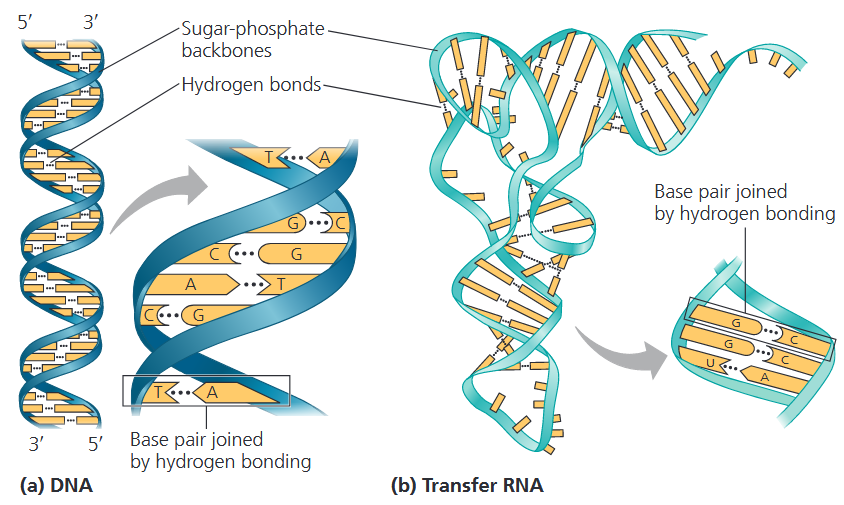
