### CONCEPT 7.1 Cellular membranes are fluid mosaics of lipids and proteins
脂质和蛋白质是生物膜的主要组成成分，糖类同样发挥重要作用。多数生物膜中含量最高的脂质为磷脂，其成膜能力由自身分子结构决定。磷脂属于<b>两亲性</b>分子，同时具有亲水区域与疏水区域。磷脂双分子层可在两个水环境之间形成稳定边界：疏水尾部向内聚拢避开水相，亲水头部朝向两侧水环境排列，以此维持膜结构稳定<b>(图 7.2)</b>。

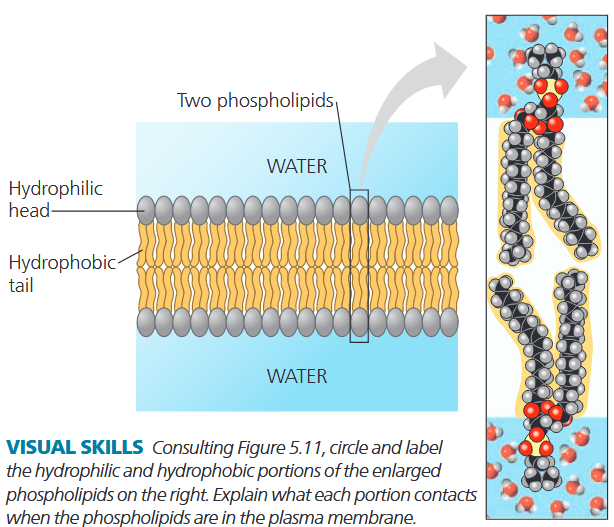

与膜脂质类似，大多数膜蛋白也为两亲性分子。这类蛋白可镶嵌于磷脂双分子层中，亲水区域向外突出。该排布方式既能让亲水部分充分接触细胞质与胞外液体，又能使疏水区段处于无水的环境中。

<b>图 7.3 </b>展示了目前公认的细胞膜分子排布模型。在<b>流动镶嵌模型</b>中，细胞膜由漂浮于流动磷脂双分子层中的多种蛋白质镶嵌构成。但膜上蛋白质并非随机分布。多种蛋白质常稳定聚集，协同执行特定功能。

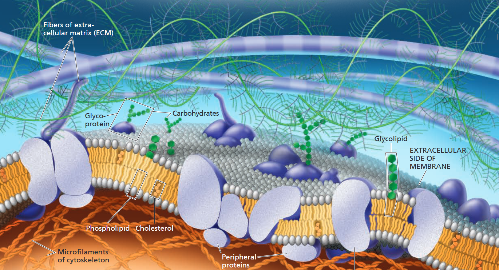

#### The Fluidity of Membranes
细胞膜并非分子固定不动的静态结构。膜的维系主要依靠疏水相互作用，其作用力远弱于共价键。大多数脂质与部分蛋白质可在膜平面内横向流动，如同人群在空间内侧身移动。而磷脂分子在两层膜之间翻转换位的情况则极为罕见。

磷脂分子在膜内的横向移动十分迅速。相邻磷脂每秒换位约 $10^7$ 次，单个磷脂一秒内可移动约 2 μm，相当于典型细菌的细胞长度。蛋白质分子体积远大于脂质，移动速度更缓慢。许多膜蛋白因锚定在细胞骨架或细胞外基质上，几乎固定不动。

膜在温度下降时仍能保持流动性，直到磷脂分子排列紧密、膜发生凝固。膜凝固的温度取决于其所含脂质的类型。在降温过程中，如果膜中富含具有不饱和烃尾的磷脂，它就能在更低的温度下仍保持流动性。由于双键所在的位置使烃尾产生扭曲，不饱和烃尾无法像饱和烃尾那样紧密地堆积在一起，这使得膜具有更高的流动性<b>(图 7.5a)</b>。 

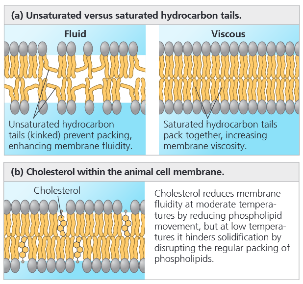

胆固醇是一种存在于动物细胞质膜中的甾醇类物质，嵌入在磷脂分子之间，它在不同温度下对膜流动性的影响也不同<b>(图 7.5b)</b>。在较高温度下——例如人体温度为 37°C 时——胆固醇通过限制磷脂分子的运动来降低膜的流动性。然而，由于胆固醇也能阻碍磷脂分子的紧密堆积，它降低了膜凝固所需要的温度。因此，胆固醇可以被视为膜的“流动性缓冲剂”，能够抵抗温度变化所引起的膜流动性改变。

膜必须保持流动性才能正常发挥功能；膜的流动性既影响其通透性，也影响膜蛋白移动到功能所需位置的能力。然而，流动性过强的膜同样无法支持蛋白质的功能。
#### Membrane Proteins and Their Functions
与马赛克类似，细胞膜是由不同蛋白质拼贴而成的集合体，这些蛋白质通常成群聚集在一起，嵌入在脂质双层的流动基质中。不同类型的细胞含有不同种类的膜蛋白，而且细胞内的各种膜结构各自拥有独特的蛋白质组合。

如<b>图 7.3 </b>中所示，膜蛋白主要分为两大类：整合蛋白和外周蛋白。<b>整合蛋白 (<i>integral protein</i>) </b>穿透脂质双层的疏水内部，其中大多数是<b>跨膜蛋白</b>，横跨整个膜；其他整合蛋白只部分伸入疏水内部。整合蛋白的疏水区域由一段或多段非极性氨基酸组成，通常长度为 20-30 个氨基酸，常卷曲成$\alpha-$螺旋<b>(图 7.6)</b>。蛋白质分子的亲水部分则暴露在膜两侧的水溶液中。有些蛋白质还含有一个或多个亲水通道，允许亲水物质通过膜。<b>外周蛋白 (<i>peripheral protein</i>) </b>则完全不嵌入脂质双层中；它们松散地结合在膜的表面，通常结合在整合蛋白的露出部分上。

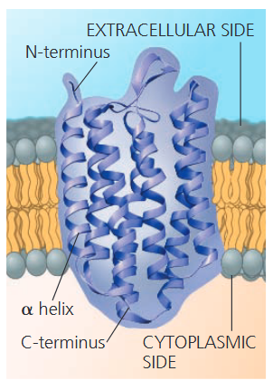

膜蛋白的作用主要有六类：
- **运输**：跨膜蛋白可以提供特定溶质的选择性的亲水通道
- **酶活性**：位于膜中的蛋白质可能是一种酶，其活性位点暴露于相邻溶液中的物质
- **信号传导**：膜蛋白 (受体) 可能具有与化学信使形微丝或细胞骨架的其他组件可能通过非共价键与膜蛋白连接，维持细胞形状，稳定特定膜蛋白的位置
- **细胞间识别**：一些糖蛋白作为识别标记，可以被其他细胞的膜蛋白明确地识别
- **细胞间连接**：相邻细胞间的膜蛋白可能以各种形式连在一起
- **连接到细胞骨架和 ECM**：微丝或细胞骨架的其他组件可能通过非共价键与膜蛋白连接，维持细胞形状，稳定特定膜蛋白的位置

细胞表面的蛋白质在医学领域具有重要意义。例如，免疫细胞表面一种名为 CD4 的蛋白质会帮助 HIV 病毒感染这些细胞，从而导致艾滋病。虽然 CD4 是 HIV 的主要受体，但 HIV 还必须结合作为“辅助受体”的免疫细胞表面蛋白 CCR5 才能感染大多数细胞<b>(图 7.8a)</b>。由于基因变异，抵抗力个体细胞表面缺乏 CCR5，从而阻止了病毒进入细胞<b>(图 7.8b)</b>。这一发现成为开发 HIV 治疗方法的关键。

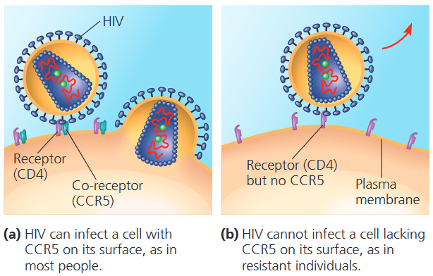

#### The Role of Membrane Carbohydrates in Cell-Cell Recognition
细胞间识别，即细胞区分不同类型邻近细胞的能力，对生物体的功能运作至关重要。细胞通过识别结合质膜细胞外表面上的分子来识别其他细胞。

膜上的糖类通常为短而分支的糖链，长度少于 15 个单糖单位。部分糖类与脂质共价结合，形成<b>糖脂 (<i>glycolipid</i>)</b>；大多数则与蛋白质结合，生成<b>糖蛋白 (<i>glycoprotein</i>)</b>。

细胞膜外侧的糖类具有高度特异性：物种间、同种生物个体间，乃至同一个体的不同细胞类型之间均存在差异。这类分布于细胞表面的糖类可作为细胞识别标记。人类 A、B、AB、O 四种血型，正是由红细胞表面糖蛋白的糖链结构差异所决定。
#### Synthesis and Sidedness of Membranes
细胞膜具有明确的内外不对称性。两层脂质分子的组分存在差异，且每种膜蛋白在膜中都有固定的朝向。细胞膜上蛋白质、脂质及结合糖类的不对称分布，在膜合成过程中就已确定，由此形成细胞膜的极性与内外之分。
### CONCEPT 7.2 Membrane structure results in selective permeability
生物膜具备其组成分子单独不存在的涌现特性：<b>选择透过性 (<i>selective permeability</i>)</b>，即膜对不同物质的通透能力存在差异。调控跨膜物质运输是细胞生存的关键。结构适配功能在此得以体现：流动镶嵌模型可合理解释细胞膜如何管控物质进出、维持细胞内环境稳定。

小分子与离子持续双向跨细胞膜运输。以肌肉细胞与周围组织液的物质交换为例：糖类、氨基酸等营养物质进入细胞，代谢废物排出胞外；细胞摄入呼吸所需的 $\text{O}_2$，排出 $\text{CO}_2$。同时，细胞通过跨膜转运，精准调控 $\text{Na}^+, \text{K}^+, \text{Ca}^{2+}, \text{Cl}^-$ 等无机离子的浓度。
#### The Permeability of the Lipid Bilayer
非极性分子（如烃类、$\text{CO}_2$、$\text{O}_2$）与脂质同为疏水物质，可直接溶于磷脂双分子层，无需膜蛋白协助就能快速跨膜。而离子与极性分子属于亲水物质，会被膜的疏水内层阻挡。葡萄糖等极性糖类穿透脂双层的速度极慢；即便水分子体积微小，作为极性分子，其跨膜效率也远低于非极性分子。带电粒子会结合水分子形成水合外壳，更难穿过疏水膜区。综上，磷脂双分子层是选择透过性的基础，而镶嵌在膜上的蛋白质，是调控物质运输的关键。
#### Transport Proteins
特定离子与多种极性分子无法自行穿透细胞膜。但这类亲水物质可借助跨膜<b>转运蛋白</b>，避开磷脂双分子层的疏水区域完成跨膜。一类转运蛋白为通道蛋白 (<i>channel protein</i>)，内部形成亲水通道，可供特定分子、离子以隧道方式通过。例如<b>水通道蛋白 (<i>aquaporin</i>) </b>能大幅加快水分子运输，该蛋白由四条相同多肽亚基构成，通道内水分子单列通行，每秒可转运海量水分子；若无水通道蛋白，水分子自发跨膜效率极低。另一类是载体蛋白 (<i>carrier protein</i>)，通过结合底物并发生构象改变，将物质转运至膜另一侧。

转运蛋白具有高度特异性，仅运输特定物质或少数同类物质。细胞膜的选择透过性，由磷脂双分子层的屏障作用与特异性转运蛋白共同决定。
### CONCEPT 7.3 Passive transport is diffusion of a substance across a membrane with no energy investment
分子因持续运动而拥有热能，这种运动引发<b>扩散 (<i>diffusion</i>) </b>——物质粒子自发向周围空间分散的现象。单个分子运动随机，但大量分子的扩散会呈现定向趋势。以分隔纯水与染料溶液的人工膜为例<b>(图 7.11a)</b>，染料会扩散至两侧浓度均等，最终达到动态平衡：两侧双向跨膜的染料分子数量相等。

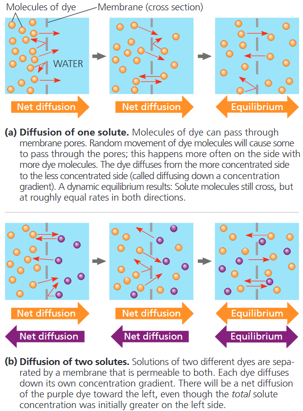

扩散的基本规律：无外力作用时，物质会从高浓度区域向低浓度区域扩散。换言之，物质沿<b>浓度梯度</b>顺浓度方向运输。扩散属于自发过程，无需消耗能量。不同物质各自顺着自身的浓度梯度独立扩散，互不干扰<b>(图 7.11b)</b>。

细胞膜上多数物质运输依靠扩散。当膜两侧存在浓度差时，只要膜对该物质具有通透性，物质就会顺浓度梯度跨膜扩散。

物质跨生物膜的扩散过程称为<b>被动运输</b>，该过程无需消耗能量。浓度梯度本身蕴含势能，为扩散提供动力。细胞膜具有选择透过性，对不同分子的扩散速率影响各异。借助水通道蛋白，水分子跨膜扩散速率大幅提升。水的跨膜运输对细胞生理状态至关重要。
#### Effects of Osmosis on Water Balance
为理解不同溶质浓度溶液的相互作用，设想一个 U 型玻璃管，中间由一层选择透过性人工膜隔开两种蔗糖溶液<b>(图 7.12)</b>。该人工膜孔径较小，蔗糖分子无法通过，但允许水分子穿过。亲水溶质会结合大量水分子，使其无法自由移动。因此，溶质浓度越高，自由水的浓度就越低。水分子会从自由水浓度高一侧，向自由水浓度低的一侧扩散，直至两侧溶质浓度趋于平衡。

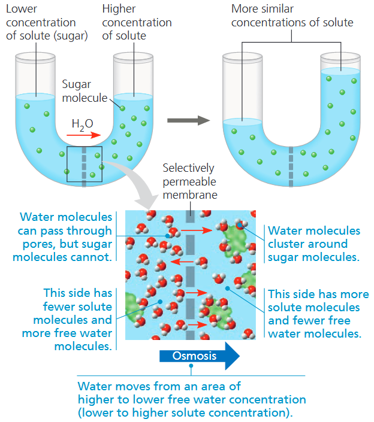

自由水通过选择透过性膜的扩散过程，即为<b>渗透作用 (<i>osmosis</i>)</b>。水的跨膜流动，以及细胞与外界的水平衡，对生物体生存至关重要。
##### *Water Balance of Cells Without Cell Walls*
要解释细胞在溶液中的形态变化，需同时考虑溶质浓度与细胞膜通透性。<b>张力 (<i>tonicity</i>) </b>综合了以上两点，指外界溶液促使细胞吸水或失水的能力。溶液张力主要取决于不可透过性溶质的相对浓度。若外界不可透过性溶质浓度更高，水分会流出细胞；反之，水分进入细胞。

无细胞壁的动物细胞置于<b>等渗溶液 (<i>isotonic</i>) </b>中时，细胞膜两侧无水分**净**移动。水分子双向扩散速率相等，细胞体积保持稳定<b>(图 7.13a)</b>。

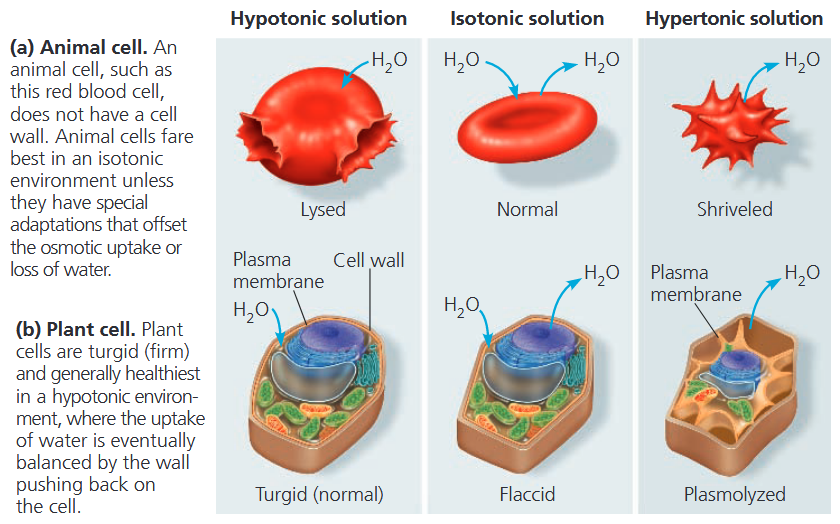

将细胞置于<b>高渗溶液 (<i>hypertonic</i>) </b>中时（高渗指不可透过溶质浓度更高），细胞会失水皱缩，甚至死亡。湖泊盐度升高致使水生动物死亡，正是因为湖水变为高渗环境，细胞大量失水皱缩。

吸水过多同样具有致命危害。若放入<b>低渗溶液 (<i>hypotonic</i>)</b>，水分子进入细胞的速率大于流出速率，细胞持续吸水膨胀，最终破裂裂解。

无坚硬细胞壁的细胞无法耐受过度吸水或失水。生活在等渗环境中，便可自然维持水平衡。而在高渗或低渗环境下，无细胞壁生物必须依靠<b>渗透调节机制 (<i>osmoregulation</i>)</b>，控制溶质浓度与水分平衡。例如草履虫 (<i>Paramecium caudatum</i>) 生活在低渗的淡水中，其细胞膜透水速率较低，只能减缓进水；它依靠伸缩泡主动泵出渗入的水分，避免细胞涨裂。
##### *Water Balance of Cells with Cell Walls*
植物、原核生物、真菌及部分原生生物的细胞均具有细胞壁。当这类细胞处于低渗溶液中时，细胞壁可维持其水平衡。植物细胞经渗透作用吸水后会膨胀<b>(图 7.13b)</b>，但韧性较强的细胞壁会产生膨压 (<i>turgor pressure)</i>，限制细胞进一步吸水膨胀。此时细胞饱满坚挺，即<b>膨胀 (<i>turgid</i>) </b>状态，也是植物细胞的健康常态。草本非木本植物依靠细胞膨压维持形态与支撑。若外界为等渗环境，水分无净进出，细胞<b>松弛 (<i>flaccid</i>)</b>，植株便会萎蔫。

但若处于高渗环境，细胞壁无法发挥作用。此时植物细胞会像动物细胞一样，向外界失水收缩。细胞萎缩时，细胞膜会脱离细胞壁，出现<b>质壁分离 (<i>plasmolysis</i>)</b> 现象，最终导致植株萎蔫甚至死亡。
#### Facilitated Diffusion: Passive Transport Aided by Proteins
大量无法穿透磷脂双分子层的极性分子与离子，可借助跨膜转运蛋白进行被动扩散，该过程称为<b>协助扩散 (<i>facilitated diffusion</i>)</b>。

如上文所述，转运蛋白分为通道蛋白与载体蛋白两类。通道蛋白形成亲水通道，专供特定分子或离子快速跨膜运输<b>(图 7.15a)</b>。其亲水通道可使水分子、小型离子高效完成被动扩散。

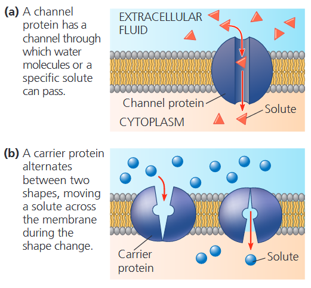

运输离子的通道蛋白称为<b>离子通道</b>。多数离子通道为<b>门控通道</b>，可受特定刺激调控开合。部分门控通道由电信号触发。例如神经细胞中，钾离子通道受电刺激开启，钾离子外流，帮助细胞恢复兴奋传导能力。另一类门控通道响应化学信号，特定配体结合后才会发生开闭。离子通道是神经系统运作的关键结构。

载体蛋白（如葡萄糖转运蛋白）会发生细微构象变化，将溶质结合位点转移至膜另一侧<b>(图 7.15b)</b>。这种形态改变，通常由底物的结合与释放触发。与离子通道相同，协助扩散中的载体蛋白，仅介导物质顺浓度梯度的净运输。
### CONCEPT 7.4 Active transport uses energy to move solutes against their gradients
即便有转运蛋白协助，协助扩散仍属于被动运输。原因在于溶质始终顺浓度梯度移动，无需消耗能量。协助扩散只是加快跨膜运输速率，不会改变物质运输方向。另有一类转运蛋白可利用能量，驱动溶质逆浓度梯度运输，从低浓度一侧转运至高浓度一侧。
#### The Need for Energy in Active Transport
逆浓度梯度跨膜运输溶质需要做功，细胞必须消耗能量，该运输方式称为<b>主动运输</b>。执行主动运输的转运蛋白均为载体蛋白，而非通道蛋白。通道蛋白开放时仅允许溶质顺浓度梯度自由扩散，无法结合物质并完成逆梯度转运。

主动运输能让细胞维持胞内小分子溶质与外界不同的浓度水平。例如，动物细胞内 $\text{K}^+$ 浓度远高于胞外，$\text{Na}^+$ 浓度则远低于胞外。细胞膜通过主动运输将 $\text{Na}^+$ 泵出细胞、$\text{K}^+$ 泵入细胞，以此维持这种悬殊的浓度梯度。

和细胞的其他生命活动一样，大多数主动运输由 ATP 水解供能。ATP 可为主动运输供能，将其末端磷酸基团直接转移至转运蛋白上，诱导蛋白发生构象改变，进而将结合的溶质跨膜转运。<b>钠钾泵</b>便是典型代表，在动物细胞膜上完成 $\text{Na}^+$ 与 $\text{K}^+$ 的逆向交换<b>(图 7.16)</b>。

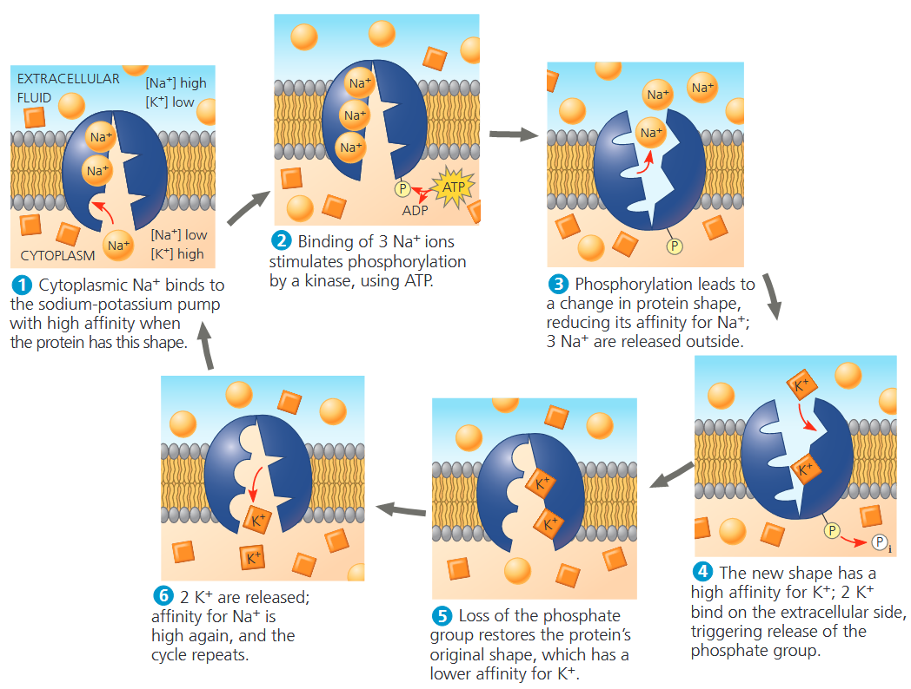

#### How Ion Pumps Maintain Membrane Potential
所有细胞的细胞膜两侧都存在电位差。电压是一种电势能，源于正负电荷的分隔。由于膜两侧阴阳离子分布不均，细胞膜的细胞质一侧相对胞外带负电。这种跨膜电位称为<b>膜电位</b>，范围约为 -50 ~ -20 mV；负号代表胞内电位低于胞外。

膜电位如同电池，作为能量来源，影响所有带电物质的跨膜运输。由于胞内相对胞外带负电，膜电位会促进阳离子被动内流、阴离子被动外流。

离子的跨膜扩散受两种力量驱动：一是化学驱动力，即离子的浓度梯度；二是电驱动力，即膜电位对离子移动的作用。作用于离子的这两种合力，统称为<b>电化学梯度</b>。

针对离子而言，需要完善被动运输的概念：离子并非单纯顺**浓度**梯度扩散，而是精准地顺**电化学**梯度扩散。化学驱动力并非在所有情况下都与电驱动力方向一致。当膜电位产生的电场力阻碍离子顺浓度梯度自发扩散时，就需要依靠主动运输完成转运。电化学梯度与膜电位在神经冲动传导中具有关键作用。

部分主动转运离子的膜蛋白会参与维持膜电位。钠钾泵是典型实例：它并非一对一交换离子，每向内转运 2 个 $\text{K}^+$，会向外泵出 3 个 $\text{Na}^+$。

每一次循环，都会向胞外净转移一个正电荷，以此形成并储存跨膜电位差。这类能够产生跨膜电压的转运蛋白，称为<b>生电泵 (<i>electrogenic pump</i>)</b>。钠钾泵是动物细胞主要的生电泵。植物、真菌和细菌的主要生电泵是<b>质子泵 (<i>proton pump</i>)</b>，它能主动将 $\text{H}^+$ 运出细胞<b>(图 7.18)</b>。氢离子的外运，会将正电荷从细胞质转移至胞外环境。

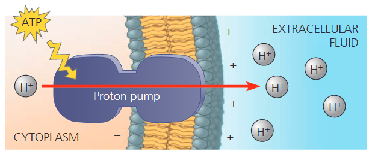

#### Cotransport: Coupled Transport by a Membrane Protein
当膜两侧存在浓度差时，溶质顺浓度梯度下坡扩散可释放能量、做功。在<b>协同运输</b>机制中，协同转运蛋白可以将溶质的“顺浓度梯度”扩散与第二种物质的“逆浓度梯度”转运耦合起来。例如，植物细胞依靠质子泵消耗 ATP 建立的 $\text{H}^+$ 梯度，完成氨基酸、糖类等营养物质的主动吸收。动物体内也存在类似的共转运蛋白，它将 $\text{Na}^+$ 与葡萄糖一起转运进入肠道细胞，此时葡萄糖是顺着自身浓度梯度进入细胞的。
### CONCEPT 7.5 Bulk transport across the plasma membrane occurs by exocytosis and endocytosis
大分子，例如蛋白质和多糖，通常不能通过扩散或转运蛋白穿过细胞膜。相反，它们通常以囊泡包裹的形式，被成批地运入或运出细胞。
#### Exocytosis
细胞通过将囊泡与质膜融合来分泌特定分子，这一过程称为<b>胞吐 (<i>exocytosis</i>)</b>。一个从高尔基体出芽形成的运输囊泡沿着细胞骨架的微管移动到质膜。当囊泡膜与质膜接触时，两种膜上的特定蛋白质会重新排列两个双分子层中的脂质分子，从而使两膜发生融合。囊泡内的物质被释放到细胞外，而囊泡膜则成为质膜的一部分<b>(图 7.20)</b>。

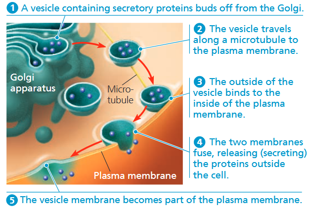

许多分泌细胞利用胞吐作用来输出产物。当植物细胞构建细胞壁时，胞吐作用将一些必需的蛋白质和碳水化合物从高尔基体囊泡输送到细胞外部。
#### Endocytosis
在胞吞作用中，细胞通过从质膜形成新的囊泡来摄取分子和颗粒物质。尽管所涉及的蛋白质不同，但胞吞作用的过程看起来就像是胞吐作用的逆过程。首先，质膜的一小片区域向内凹陷形成一个口袋状结构。然后，随着这个口袋加深，它向内掐断，形成一个含有原本在细胞外物质的囊泡。胞吞作用分为三种类型：吞噬作用、胞饮作用以及受体介导的胞吞作用。

- <b>吞噬作用 (<i>phagocytosis</i>)</b>：细胞通过伸出伪足包裹住一个颗粒，并将其封装在一个称为食物泡的膜性囊泡内，从而将该颗粒吞噬。随后，当食物泡与含有水解酶的溶酶体融合后，该颗粒便会被消化。
- <b>胞饮作用 (<i>pinocytosis</i>)</b>：细胞通过质膜的内陷持续地将细胞外液的小液滴“吞入”微小的囊泡中。通过这种方式，细胞获取了液滴中溶解的分子。由于所有溶质都会被非特异性地摄入细胞，因此胞饮作用对其所转运的物质不具有选择性。
- <b>受体介导的胞吞作用 (<i>receptor-mediated endocytosis</i>)</b>：胞饮作用的一种特化形式，它使细胞能够大量摄取特定的物质。细胞膜上镶嵌有外露受体位点的膜蛋白，特定溶质可与受体特异性结合。随后受体蛋白聚集于有被小窝处，小窝内陷形成囊泡，包裹结合的目标分子及部分胞外液体。胞吞物质在囊泡内释放后，空载的受体可随囊泡循环运回细胞膜，重复利用。

