### CONCEPT 8.1 An organism’s metabolism transforms matter and energy

生物体全部化学反应的总和称为<b>新陈代谢 (<i>integral metabolism</i>)</b>。新陈代谢是生命的一种涌现特性，源于分子间有序的相互作用。
#### Metabolic Pathways
我们可以把细胞的新陈代谢想象成一张布满众多化学反应的精细路线图，这些反应以相互交汇的代谢途径形式排布。在一条<b>代谢途径</b>中，特定分子经由一系列固定步骤发生改变，最终生成某种产物。每一步反应都由特定的**酶**催化——酶是一种能加快化学反应速率的大分子：

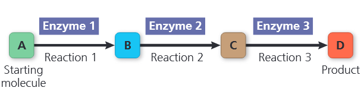

新陈代谢整体负责调配细胞的物质与能量资源。部分代谢途径通过将复杂分子分解为简单化合物来释放能量，这类分解过程称为<b>分解代谢途径 (<i>catabolic pathway</i>)</b>，也称降解途径。细胞呼吸是主要的分解代谢途径之一，它在有氧条件下将葡萄糖及其他有机燃料分解为二氧化碳和水。储存在有机分子中的能量可被释放，用以完成细胞各项生命活动，例如纤毛摆动与跨膜运输。

与之相反，<b>合成代谢途径 (<i>anabolic pathway</i>) </b>消耗能量，将简单物质构建为复杂分子，有时也被称为生物合成途径。例如由简单小分子合成氨基酸、由氨基酸合成蛋白质，都属于合成代谢。
#### Forms of Energy
<b>能量</b>是引起变化的能力。日常生活中能量至关重要，因为某些形式的能量可以用来做功。能量有多种形式，生命活动依赖细胞将能量从一种形式转化为另一种形式。与物体相对运动相关的能量称为<b>动能</b>，运动的物体可通过传递运动对其他物质做功。<b>热能</b>是与原子或分子无规则运动相关的动能；热能在物体间传递时即为<b>热量</b>。光能也是一种可被利用做功的能量，例如为绿色植物的光合作用供能。

物体即便静止也仍可储存能量。非运动形式的能量称为<b>势能</b>，是物质因其位置或结构而具备的能量。例如大坝蓄水因海拔高度拥有势能；分子则因原子间化学键的电子排布而储存能量。生物学家将化学反应中可释放的势能称为<b>化学能</b>。前文提到分解代谢途径通过分解复杂分子释放能量，葡萄糖等复杂有机物便含有较高化学能。在分解代谢反应中，旧化学键断裂、新化学键生成，释放能量并生成能量更低的分解产物。
#### The Laws of Energy Transformation
研究物质体系中能量转化的学科称为<b>热力学</b>。科学家将研究对象的物质称作**系统**，而宇宙中系统之外的其余部分统称为**环境**。**孤立系统**无法与外界环境交换能量和物质。**开放系统**则可以在系统与环境之间进行能量和物质的交换。

生物体属于开放系统：它们吸收能量（如光能、有机物中的化学能），同时向环境释放热能以及二氧化碳等代谢废物。热力学两大定律支配着生物体及所有物质体系的能量转化过程。
##### *The First Law of Thermodynamics*
根据<b>热力学第一定律</b>，宇宙的能量总量恒定：**能量可以转移和转化，但既不能被创造，也不能被消灭**。该定律也被称为**能量守恒定律**。如<b>图 8.3a</b> 中的棕熊，在进行生命活动时，会将食物有机物中的化学能转化为动能及其他形式的能量。

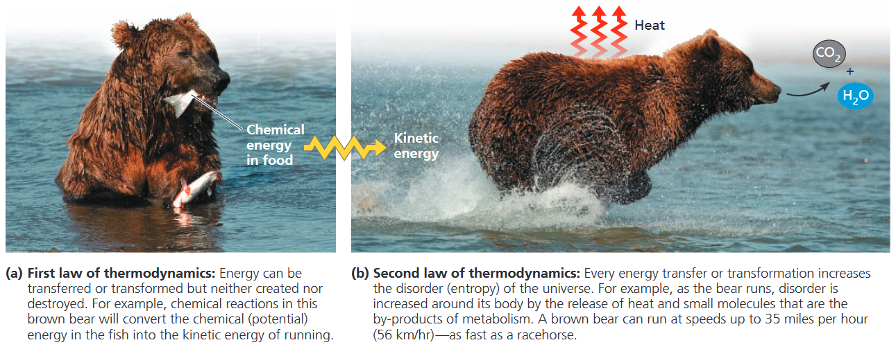

##### *The Second Law of Thermodynamics*
每一次能量转移或转化过程中，都会有一部分能量转变为热能并以热量形式散失，无法再用来做功。<b>图 8.3a</b> 中食物所含的化学能，只有少部分转化为<b>图 8.3b</b> 中棕熊运动的能量；大部分能量都以热能形式散失，并迅速扩散到周围环境中。

系统只有在存在温差、热能可以以热量形式从高温处流向低温处时，才能将热能用来做功。若温度均匀（活细胞内部便是如此），化学反应产生的热量只会单纯使生物体等物质整体升温。

可用能量以热能形式散失到环境中，带来的结果是：每一次能量转移或转化，都会让宇宙的无序度增加。科学家用<b>熵</b>这一物理量，来衡量分子的无序度或混乱度。物质排布越杂乱无序，其熵值就越高。由此可表述<b>热力学第二定律</b>：**一切能量转移或转化过程，都会增加宇宙的总熵**。局部范围内可以形成有序结构，但宇宙整体，有着不可逆转的趋向混乱、趋于无序的演化趋势。

熵的概念有助于我们理解为何有些过程在能量上自发有利、能够自行发生。若一个过程自身会导致熵增加，该过程无需外界输入能量即可自发进行，这类过程称为<b>自发过程</b>。“自发”并不代表反应速率快，仅表示该过程在能量层面具备自发进行的趋势。若一个过程单独发生会使熵减少，则称为非自发过程，这类过程必须外界供能才能进行。
##### *Biological Order and Disorder*
细胞是如何从无序程度更高的原料中，构建出高度有序的结构的？既然宇宙的熵必然持续增加，这样的有序构建又何以成为可能？这种有序度的提升，是通过生物体从外界环境摄取高度有序的物质与能量，并向外界排放无序度更高的物质来实现平衡的。单个系统（如生物体）的熵完全可以降低，只要系统加环境构成的整个宇宙总熵保持增加即可。
### CONCEPT 8.2 The free-energy change of a reaction tells us whether or not the reaction occurs spontaneously
我们想知道哪些生命的化学反应可以自发进行，哪些需要外界输入能量。但我们不可能为每一个反应都去评估整个宇宙的能量和熵变，那又该如何判断反应能否自发进行呢？
#### Free-Energy Change, $\Delta G$
宇宙实际上等价于系统与环境之和。1878 年 J. Willard Gibbs 定义了一个极具实用价值的物理量——系统的吉布斯自由能（无需考虑外界环境），用字母 $G$ 表示，后文简称为自由能。<b>自由能</b>是系统总能量中，在恒温恒压条件下（活细胞即为此状态）能够用于做功的那部分能量。

化学反应中自由能的变化，$\Delta\text{G}$，可以用下式来计算：

    $\Delta G = \Delta H - T\Delta S$

该公式仅使用系统的自身性质：$\Delta H$ 代表焓变，$\Delta S$ 为系统的熵变，$T$ 是热力学绝对温度。

借助化学方法，我们可以测定任意反应的自由能变化 $\Delta G$（其数值取决于 pH、温度、反应物与生成物浓度等条件）。只要获知一个过程的 $\Delta G$，就能判断它是否自发——即能量上是否有利、无需外界供能即可自行发生。实验证明，只有 $\Delta G$ 为负值的过程才是自发过程。
#### Free Energy, Stability, and Equilibrium
$\Delta G$ 代表终态自由能与初态自由能的差值：$\Delta G=G_{\text{final state}}-G_{\text{initial state}}$，一个反应若要拥有负的自由能变 $\Delta G$，系统从初态转变到终态的过程中必须损失自由能。由于终态所含自由能更低，系统发生变化的趋势更小，因此相比初态会更加稳定。

我们可以将自由能视作衡量系统不稳定性的指标，也就是系统趋向转变为更稳定状态的趋势。不稳定的系统（自由能 $G$ 较高）会自发向更稳定的状态（自由能 $G$ 较低）转变。

描述最大稳定状态的另一个术语是**平衡**：达到平衡时，正、逆反应速率相等，反应物与生成物的相对浓度不再发生净变化。处于平衡状态的系统，其自由能 $G$ 降至该系统所能达到的最低值。若通过移除部分生成物等方式打破平衡、改变产物与反应物的相对浓度，反应会偏离平衡状态，系统自由能随之升高。可以把平衡状态想象成自由能谷底。偏离平衡位置的任何变化，其 $\Delta G$ 均为正值，无法自发进行。因此，系统永远不会自发脱离平衡状态。处于平衡的系统无法自发发生变化，也就不能做功。**只有向着平衡状态进行的过程，才具有自发性，并且能够对外做功**。
#### Free Energy and Metabolism
##### *Exergonic and Endergonic Reactions in Metabolism*
根据自由能变化，化学反应可分为放能反应（能量向外释放）和吸能反应（能量向内吸收）。
<b>放能反应 (<i>exergonic reaction</i>) </b>会净释放自由能<b> (图 8.6a)</b>。由于反应体系总自由能减少，放能反应的 $\Delta G$ 为负值，因此放能反应是自发反应，$\Delta G$ 的绝对值代表该反应所能做功的最大量。

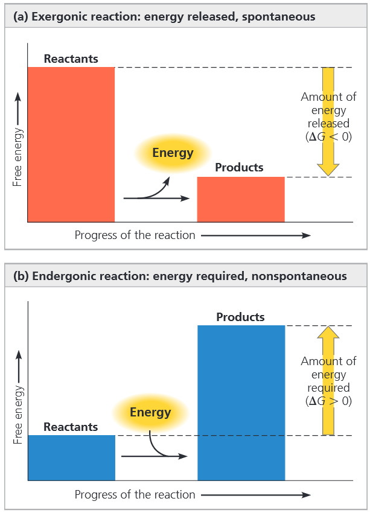

以细胞呼吸的总反应方程为例：

$\text{C}_6\text{H}_{12}\text{O}_6+6\text{O}_2\rightarrow6\text{ C}\text{O}_2+6\text{ H}_2\text{O}$

$\Delta G = -686\text{ kacl/mol (-2,870kJ/mol)}$

在标准条件下（各反应物与产物浓度 1 $M$、25℃、pH 值为 7），每分解 1 mol 葡萄糖，呼吸作用可释放 686 千卡可用于生命活动的能量。由于能量守恒，呼吸作用的生成物每摩尔所含的自由能，比反应物少 686 千卡。

<b>吸能反应 (<i>endergonic reaction</i>) </b>是从周围环境中吸收自由能的化学反应<b> (图 8.6b)</b>。由于这类反应本质上是将自由能**储存**在分子中 ($G$ 增大)，因此 $\Delta G$ 大于 0。吸能反应属于非自发反应，$\Delta G$ 的数值大小，就是驱动该反应进行所需的能量。

若一个化学反应是放能反应、正向释放能量，那么其逆反应必然是吸能反应、需要消耗能量。可逆反应不可能在两个方向上都自发下坡。

##### *Equilibrium and Metabolism*
孤立系统中的化学反应最终都会达到化学平衡，此后便无法再做功。代谢中的化学反应大多可逆，倘若在试管这种孤立环境中进行，同样也会达到平衡。由于处于平衡状态的系统吉布斯自由能 $G$ 最低，且不再具备做功能力，一旦细胞达到代谢平衡，便意味着死亡。而**生命体的整体代谢永远不会处于平衡状态，这也是生命的核心特征之一**。

和绝大多数系统一样，活细胞永远不会处于平衡状态。物质不断进出细胞，使代谢途径始终无法达到平衡，细胞在整个生命过程中都能持续做功。这一原理可用<b> 图 8.8a</b> 中开放的水力发电系统加以说明。

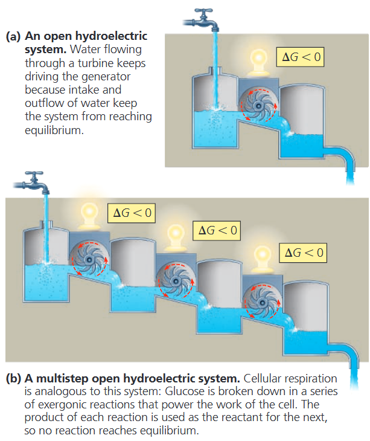

与这种简单的单步系统不同，细胞内的分解代谢途径是通过一连串连续反应逐步释放自由能的，细胞呼吸便是典型例子，其类比示意如<b> 图 8.8b</b>。呼吸作用中部分可逆反应会被持续 “拉动” 向单一方向进行，始终偏离平衡状态。维持这种非平衡状态的关键在于：前一步反应的产物不会堆积，而是直接作为下一步反应的反应物；最终代谢废物还会被排出细胞。只要细胞能持续获得葡萄糖或其他能源物质、氧气，同时不断向外界排出代谢废物，其代谢途径就永远不会达到平衡，从而持续维持生命活动所需的各项生理过程。
### CONCEPT 8.3 ATP powers cellular work by coupling exergonic reactions to endergonic reactions
细胞主要进行三类生命做功：
- 化学做功：推动原本无法自发进行的吸能反应，例如由单体合成生物大分子聚合物
- 运输做功：逆物质自发扩散的方向，将物质跨膜主动转运
- 机械做功：如纤毛摆动、肌肉细胞收缩

细胞调控能量以完成各项生命活动的核心机制是<b>能量偶联</b>：即利用放能过程驱动吸能过程的进行。细胞内绝大多数能量偶联都由 ATP 介导，且在多数情况下，ATP 是驱动细胞生命活动的直接能源物质。
### The Structure and Hydrolysis of ATP
ATP (三磷酸腺苷) 由核糖，腺苷和三个磷酸基组成<b> (图 8.9a)</b>，除参与能量偶联外，ATP 也是合成 RNA 所需的三磷酸核苷之一。

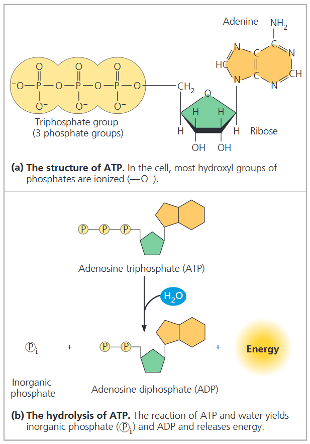

ATP 的磷酸基团间的键可以通过水解断开，当末端的磷酸基团水解下来，形成一分子无机磷酸后，剩下的部分成为 ADP<b> (图 8.9b)</b>。这个反应是放能的，每 mol ATP 水解可释放 7.3 kcal 的能量。

$\text{ATP} + \text{H}_2\text{O} \rightarrow \text{ADP} + \text{P}_i$

$Delta G = -7.3\text{ kacl/mol (-30.5kJ/mol)}$

这是标准条件下测得的自由能变化。细胞内的环境并不符合标准条件，主要原因是反应物和生成物的浓度并非 1 $M$。

由于水解过程会释放能量，ATP 中的磷酸键有时被称作高能磷酸键。ATP 的磷酸键并不像 “高能” 字面暗示的那样属于异常稳定的强化学键；真正的原因是：反应物本身的自由能远高于生成物。ATP 水解释放能量，源于整个化学反应系统转向自由能更低的状态，并非来自磷酸键本身的断裂。

ATP 对细胞至关重要，原因在于它脱去一个磷酸基团时释放的能量，远超大多数其他分子所能提供的能量。观察 ATP 分子结构可以发现：三个磷酸基团均带负电荷。同种电荷相互聚集、拥挤排布，彼此间的静电排斥作用使 ATP 的这一结构区域极不稳定。
#### How ATP Provides Energy That Performs Work
若在试管中进行 ATP 水解，释放的自由能只会单纯以热能形式加热周围的水。而在生物体内，细胞中的蛋白质会以多种方式利用 ATP 水解释放的能量。

在特定酶的协助下，细胞可利用 ATP 的高自由能，驱动那些本身属于吸能过程的化学反应。若某一吸能反应的自由能变化小于 ATP 水解释放的能量，这两个反应便可发生能量偶联，使整体耦合反应变为放能反应。该过程通常涉及磷酸化：即磷酸基团从 ATP 转移至其他分子（如反应底物）。接受磷酸基团并以共价键与之结合的分子，称为<b>磷酸化中间产物</b>。

放能反应与吸能反应实现偶联的关键，正是这类磷酸化中间产物的生成；相较于未磷酸化的原始分子，它反应活性更高、稳定性更低、所含自由能更高<b> (图 8.10)</b>。

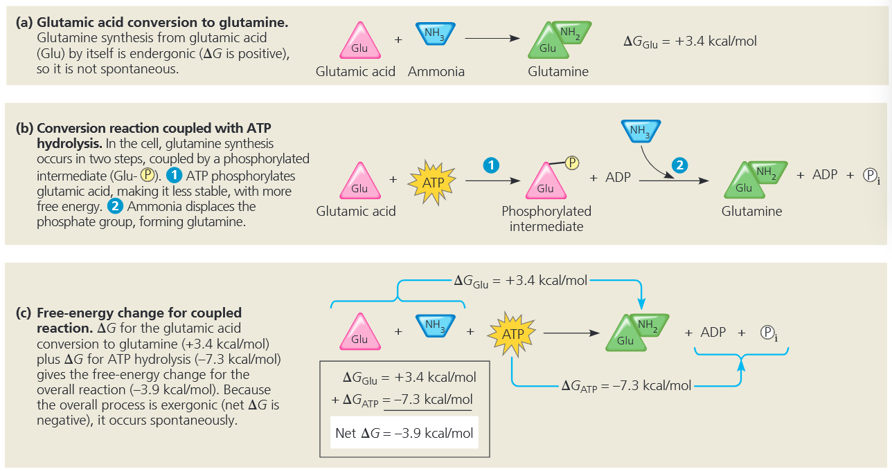

细胞的运输做功与机械做功也几乎都由 ATP 水解供能。在这类过程中，ATP 水解会引发蛋白质空间构象改变，并常使其结合其他分子的能力发生变化。有时该过程会经由磷酸化中间产物完成，如<b>图 8.11a </b>中的转运蛋白所示。

多数涉及马达蛋白沿细胞骨架行走的机械做功过程<b> (图 8.11b)</b>，会循环进行：首先 ATP 以非共价键结合在马达蛋白上；随后 ATP 发生水解，释放 ADP 和无机磷酸；之后新的 ATP 分子再进行结合。在每一步循环中，马达蛋白的构象及其与细胞骨架的结合能力都会发生改变，从而使马达蛋白沿着细胞骨架轨道产生位移。在许多其他重要细胞生命活动中，磷酸化与去磷酸化同样会驱动蛋白质发生关键的构象变化。

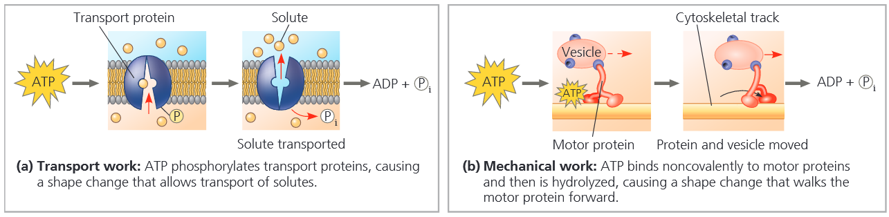

#### The Regeneration of ATP
生命机体在生命活动中会持续消耗 ATP，但 ATP 属于可再生能源：通过向 ADP 分子上重新连接磷酸基团，即可完成 ATP 的再生<b> (图 8.12)</b>。

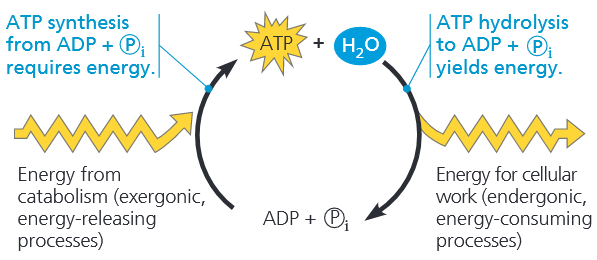

使 ADP 发生磷酸化所需的自由能，来自细胞内放能性的分解代谢反应。这种无机磷酸与能量的循环转运过程，称为 ATP 循环；它将细胞产能的放能过程与耗能的吸能过程紧密偶联起来。

可逆反应无法在两个方向上同时自发放能，因此由 ADP 和无机磷酸合成 ATP 的过程必然是吸能反应：

$ \text{ADP} + \text{P}_i \rightarrow \text{ATP} + \text{H}_2\text{O}$

$\Delta G = +7.3\text{ kacl/mol (+30.5kJ/mol)}$

由于 ADP 与无机磷酸合成 ATP 无法自发进行，必须消耗自由能才能驱动反应发生。分解代谢（放能）途径，尤其是细胞呼吸，可为 ATP 合成这一吸能过程提供能量。植物还可利用光能生成 ATP。因此，ATP 循环是生物能量代谢的核心环节，如同一个旋转通道：能量从分解代谢途径转出，经由该循环流入合成代谢途径。

### CONCEPT 8.4 Enzymes speed up metabolic reactions by lowering energy barriers
热力学定律只能判定特定条件下反应能否自发发生，却无法说明反应进行的速率快慢。自发化学反应不需要外界供能就能发生，但反应速率可能极其缓慢，几乎难以察觉。例如，蔗糖水解生成葡萄糖和果糖属于放能自发反应，可释放自由能 ($\Delta G = -7\text{ kcal/mol}$)，但将蔗糖溶于无菌水中，在室温下静置数年，也几乎观察不到水解现象。然而若向溶液中加入少量蔗糖酶，所有蔗糖可在数秒内完全水解：

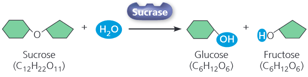

<b>酶</b>是具有催化剂功能的生物大分子；催化剂可以加快化学反应速率，且自身不会在反应中被消耗。倘若没有酶的调控，代谢途径中的化学反应流程会严重阻滞——许多反应的自发进行都极其缓慢。
#### The Activation Energy Barrier
分子间的每一个化学反应，都同时包含化学键的断裂与形成。将一种分子转变为另一种分子时，反应物分子通常先要发生形变，进入一种极不稳定的过渡状态，反应才能继续进行。

反应物分子要进入这种可发生键重排的形变状态，必须从外界吸收能量。当生成物分子形成新化学键时，能量会以热能形式释放，分子也回归比形变状态能量更低、结构更稳定的构型。

启动化学反应所需投入的初始能量——使反应物分子发生形变、进而让化学键得以断裂所需的能量——被称为活化自由能，也称<b>活化能</b>，简写为 $\text{E}_{\text{A}}$。可以把活化能理解为：将反应物推至能量壁垒顶端、爬上“上坡”所需的能量，此后反应便可进入自发“下坡”释放能量的阶段。

活化能通常由热能提供，反应物从环境中吸收热量。吸收热能后，反应物分子运动加剧，碰撞更频繁、作用力更强；同时分子内部原子振动加剧，大大提升了化学键断裂的概率。当分子吸收足够能量、化学键具备断裂条件时，反应物便进入一种不稳定的特殊状态，即**过渡态**。

<b>图 8.13 </b>以曲线图展示了一个假想放能反应的能量变化，该反应会使两种反应物分子发生基团互换：$\text{AB}+\text{CD}\rightarrow\text{AC}+\text{B}$

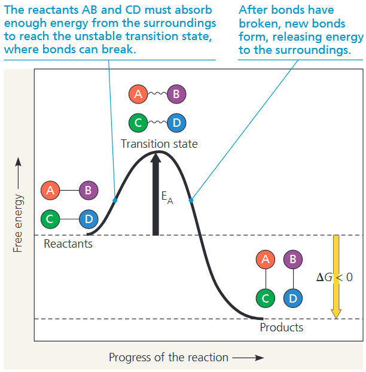

反应物的活化对应图像中上坡段，此过程中反应物分子的自由能逐渐升高。在曲线顶峰，分子吸收了等同于活化能 $\text{E}_{\text{A}}$ 的能量，反应物进入过渡态：分子已被活化，原有化学键具备断裂条件。随后原子重新排布形成更稳定的新化学键，并向环境释放能量，对应曲线的下坡段，体现分子自由能下降。

反应整体自由能降低，意味着活化能投入不仅得到补偿，还有能量盈余；即成键释放的能量，多于断裂旧键所消耗的能量。

<b>图 8.13 </b>的 反应为放能反应，可以自发进行，但活化能构成了一道能量壁垒，决定了反应速率。反应物必须吸收足够能量，翻越活化能壁垒的顶峰，反应才能发生。

有些反应的活化能较低，即便在室温下，也有大量反应物分子凭借热能在短时间内抵达过渡态。但大多数反应的活化能壁垒过高，分子很难达到过渡态，反应几乎无法进行。
#### How Enzymes Speed Up Reactions
酶通过降低活化能能垒来催化反应<b> (图 8.14)</b>，让反应物分子在常温条件下，就能吸收足够能量抵达过渡态。需要注意：酶不会改变反应的 $\Delta G$，也无法把吸能反应变成放能反应，酶只能加快那些原本终究会自发发生的反应。此外，酶对其所催化的反应具有高度专一性，这也决定了细胞在任一时刻会进行哪些生化过程。

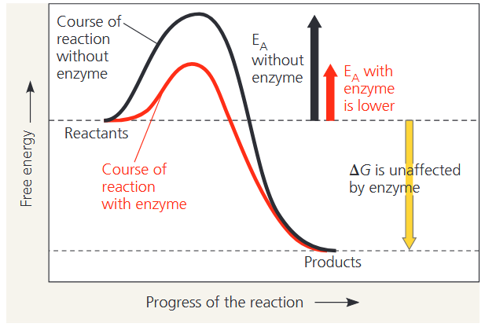

#### Substrate Specificity of Enzymes
酶所作用的反应物，称为该酶的<b>底物 (<i>substrate</i>) </b>。酶与其底物结合，形成酶-底物复合物。在酶与底物结合期间，通过酶的催化作用，底物被转化为反应产物。整个过程可概括如下：

$\text{Enzyme}+\text{Substrate(s)}\rightleftharpoons\text{Enzyme-substrate complex}\rightleftharpoons\text{Enzyme}+\text{Product(s)}$

酶分子上只有特定局部区域能与底物结合。这一区域称为<b>活性部位</b>，通常是酶分子表面的口袋或凹陷结构，也是催化作用发生的位置<b> (图 8.15a)</b>。活性中心一般仅由酶分子中少数几个氨基酸构成，蛋白质其余部分则充当骨架，决定活性中心的空间构象。酶的专一性，正是源于活性中心与底物分子在空间结构上的互补契合。

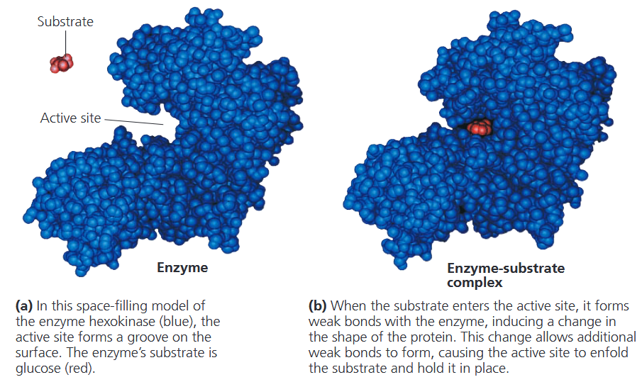

酶并不是被固定在某种形态上的刚性结构。事实上，酶会在几种细微构象之间动态平衡中不断 “变换形态”，每一种构象的自由能都略有差异。与底物契合度最佳的构象，未必是能量最低的构象；但在酶短暂呈现该构象的瞬间，其活性中心便可与底物结合。

活性中心本身也并非容纳底物的刚性容器。如<b>图 8.15b </b>所示，当底物进入活性中心时，底物的化学基团与构成活性中心的氨基酸侧链基团发生相互作用，会使酶产生轻微构象变化。这种形变让活性中心与底物贴合得更加紧密。

底物初步结合后、结构进一步收紧契合的现象，称为<b>诱导契合 (<i>induced fit</i>) </b>，如同双手相握时自然紧扣。诱导契合能让活性中心的各类化学基团排布到最优位置，从而大幅提升催化反应的能力。
#### Catalysis in the Enzyme’s Active Site
在大多数酶促反应中，底物依靠弱相互作用固定在活性中心，例如氢键与离子键。构成活性中心的少数氨基酸侧链催化底物转变为产物，随后产物离开活性中心。酶便可再次结合新的底物分子。整个循环速率极快：单个酶分子每秒通常可催化约 1000 个底物分子，部分酶效率甚至更高。和其他催化剂一样，酶在反应结束后恢复原有结构。因此只需极少量酶，便可通过反复参与催化循环，对代谢过程产生巨大影响。<b>图 8.16 </b>展示了包含双底物、双产物的酶催化循环过程。

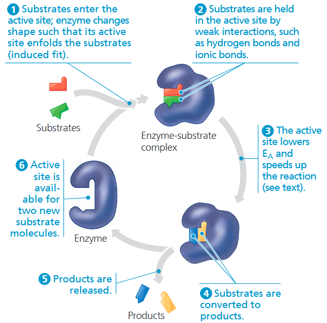

酶可通过多种机制降低活化能、加快反应速率：
- 对于两种及以上反应物参与的反应，活性中心可充当模板，使底物以适宜的空间取向相互靠近，利于发生反应。
- 当酶的活性中心结合并包裹底物时，可牵拉底物分子向过渡态构象转变，使反应中待断裂的关键化学键发生张力与弯折。由于活化能与断键难度正相关，底物构象被扭曲后更易趋近过渡态，从而降低达到过渡态所需吸收的自由能。
- 活性中心还能营造微环境，比无酶的溶液环境更有利于特定反应进行。例如，若活性中心含有带酸性 R 基的氨基酸，可在呈中性的细胞内形成局部低 pH 微区。酸性氨基酸可向底物转移氢离子，成为催化反应的关键步骤。
- 活性中心的氨基酸可直接参与化学反应。有时底物会与酶氨基酸侧链形成短暂共价键；后续反应步骤会使侧链恢复原有状态，保证活性中心反应前后结构不变。

在酶的用量一定时，酶将底物转化为产物的反应速率，与底物初始浓度相关：底物分子越多，与酶活性中心结合的概率就越高。但在酶浓度固定的条件下，单纯增加底物浓度来提升反应速率是有上限的。当底物浓度升高到某一程度，所有酶分子的活性中心都被底物占满。产物一旦离开活性中心，新的底物便立刻结合上去。

此时的底物浓度状态称为酶**饱和**，反应速率仅由活性中心催化底物生成产物的速度决定。当酶达到饱和状态后，若想进一步提高产物生成速率，只能增加酶的数量。细胞通常就是通过合成更多酶分子，来加快生化反应速率。
#### Effects of Local Conditions on Enzyme Activity
酶的活性，即酶的催化效率，会受到温度、pH 等外界环境因素的影响，也可被一些特异性化学物质所调控。
##### *Effects of Temperature and pH*
蛋白质的三维空间结构对环境十分敏感，因此，每种酶都有适宜的作用条件，在最适条件下，酶能维持催化活性最佳的空间构象，发挥最高催化效率。

温度与 pH 是影响酶活性的重要环境因素。在一定范围内，酶促反应速率随温度升高而上升，部分原因是分子运动加快，底物与酶活性中心的碰撞频率增加。但超过临界温度后，酶促反应速率会急剧下降。高温引发的分子热运动，会破坏维持酶活性构象的氢键、离子键及其他弱相互作用，最终导致蛋白质变性。

每种酶都有自己的最适温度，此时反应速率达到峰值。该温度既能保证最大程度的分子碰撞效率，又不会使酶变性，让底物最快转化为产物。

正如每种酶都有最适温度，它们同样拥有最适 pH，在此酸碱度下酶活性最高。大多数酶的最适 pH 集中在 6～8 之间，但也存在特例。例如，人体胃中的消化酶胃蛋白酶，在极低 pH 环境下活性最佳。
##### *Cofactors*
许多酶需要非蛋白质辅助因子才能具备催化活性，这类需求常见于电子转移等化学反应——仅靠蛋白质中的氨基酸难以完成这类反应。这类辅助因子统称为<b>辅因子</b>：有的与酶紧密结合、永久附着；有的则随底物松散可逆地结合。

部分酶的辅因子属于无机物，如锌、铁、铜等金属离子。若辅因子是有机分子，则特称为<b>辅酶</b>。大多数维生素之所以具备重要营养价值，正是因为它们可作为辅酶，或作为合成辅酶的原料。
##### *Enzyme Inhibitors*
某些化学物质能够选择性抑制特定酶的活性。有些抑制剂以共价键与酶结合，这类抑制通常不可逆。但多数酶抑制剂依靠弱相互作用与酶结合，属于可逆抑制。

部分可逆抑制剂结构与正常底物相似，会竞争结合酶的活性中心<b> (图 8.18a, b)</b>。这类模拟底物的物质称为<b>竞争性抑制剂</b>，通过封堵活性中心、阻碍底物结合，从而降低酶的催化效率。通过提高底物浓度可以解除这种抑制：当活性中心空出时，底物分子数量远多于抑制剂，便能抢占活性中心，抵消竞争抑制的作用。

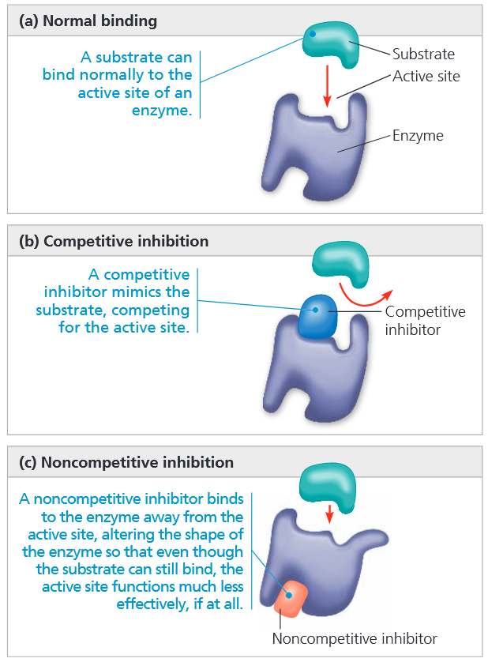

与之相反，非竞争性抑制剂不会与底物直接竞争酶的活性中心结合位点<b> (图 8.18c)</b>。这类抑制剂通过结合酶分子的其他部位来阻碍酶促反应；这种结合会使酶的空间构象发生改变，导致活性中心催化底物转化为产物的效率大幅下降。
### CONCEPT 8.5 Regulation of enzyme activity helps control metabolism
#### Allosteric Regulation of Enzymes
在细胞内，很多天然调控酶活性的分子，作用方式类似可逆非竞争性抑制剂：这类调节分子通过非共价相互作用，结合在酶分子的其他位点，进而改变酶的整体构象与活性中心的功能状态。

蛋白质某一位点的功能，因调节分子结合到另一独立位点而发生改变，这种调控方式统称为<b>别构调节 (<i>allosteric regulation</i>) </b>。别构调节既可以抑制酶活性，也能激活酶活性。
##### *Allosteric Activation and Inhibition*
绝大多数已知受别构调节的酶，都由两个或更多亚基构成；每个亚基各含一条多肽链，并拥有独立的活性中心。整个酶复合物会在两种构象间交替转变：一种具备催化活性，另一种处于无活性状态<b> (图 8.20a)</b>。

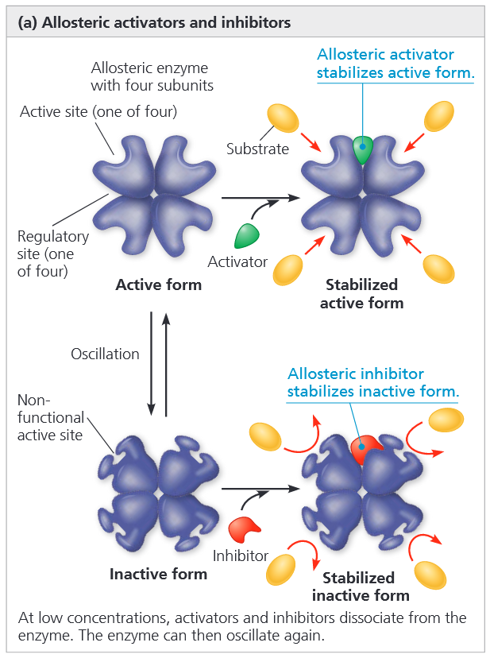

最简单的别构调节模式中，激活剂或抑制剂这类调节分子会结合在调节位点（也称别构位点），该位点常位于各亚基的连接处。激活剂结合调节位点后，能稳定酶具有功能活性中心的构象；而抑制剂结合后，则会稳定酶的无活性构象。别构酶的各亚基彼此嵌合，单个亚基的构象变化会传递至其余所有亚基。借助亚基间的这种协同作用，一个激活剂或抑制剂分子只需结合一处调节位点，便可影响所有亚基上的活性中心。

还有另一种别构激活方式：在多亚基酶中，一个底物分子结合某个活性中心，会触发所有亚基发生构象改变，进而提升其余活性中心的催化活性<b> (图 8.20b)</b>。这种机制称为<b>协同效应</b>，能放大酶对底物的应答效率：一个底物分子率先结合后，可使酶更易于结合并催化更多底物。协同效应也归属于别构调节，因为即便底物结合的是活性中心，其结合行为仍会影响其他活性中心的催化功能。

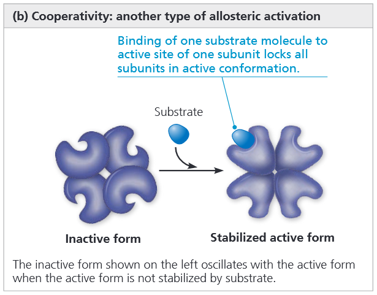

##### *Feedback Inhibition*
在生成 ATP 的代谢通路中，ATP 自身会对通路中的酶产生别构抑制。这是一种十分普遍的代谢调控方式，称为<b>反馈抑制</b>：一条代谢通路的终产物，通过抑制结合通路起始步骤的关键酶，从而终止整条代谢通路的进行。

<b>图 8.21 </b>展示了合成代谢通路中反馈抑制的实例。某些细胞可通过五步反应，由 Thr 合成另一种 Ile。当异亮氨酸不断积累时，它会以别构抑制的方式作用于该通路第一步的关键酶，从而减缓自身的合成。

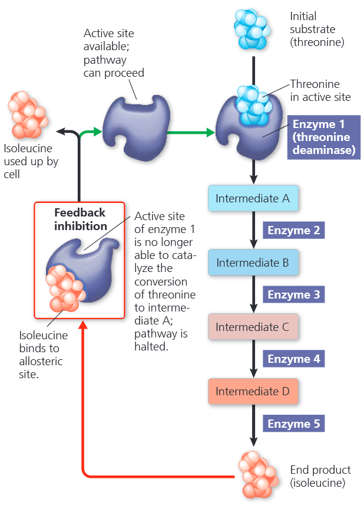

通过反馈抑制，细胞可避免合成过量的异亮氨酸，杜绝物质与能量资源的浪费。
#### Localization of Enzymes Within the Cell
细胞并非只是随机混杂着数千种酶与底物的化学集合体。细胞具有区室化结构，各类细胞结构为代谢通路建立起有序秩序。在部分代谢通路中，催化连续多步反应的一系列酶会组装形成多酶复合物。这种排布方式让反应有序衔接：前一个酶的产物直接作为相邻酶的底物，依次传递，直至终产物生成释放。

有些酶与多酶复合物在细胞内位置固定，成为特定生物膜的结构组成；另一些则游离存在于具膜包被的真核细胞器基质中，每种细胞器都拥有独特的内部化学微环境。

