### CONCEPT 9.1 Catabolic pathways yield energy by oxidizing organic fuels

细胞捕获储存在有机分子中的化学能，并利用其生成 $\text{ATP}$ —— 绝大多数细胞生命活动供能的分子。通过分解复杂有机物释放储能的代谢途径，称为分解代谢途径。电子从葡萄糖等食物分子转移至其他分子，在这类代谢途径中起着关键作用。

#### Catabolic Pathways and Production of ATP

有机化合物因其原子间化学键的电子排布而拥有势能。能够参与放能反应的化合物均可作为能源物质。在酶的作用下，细胞会有序分解富含势能的复杂有机物，将其转化为能量更低的简单代谢产物。化学能释放出的一部分可用于生命活动，其余则以热能形式散失。

<b>发酵 (<i>fermentation</i>) </b>是一种分解代谢过程，它在无氧条件下对糖类及其他有机能源物质进行不完全分解。而效率最高的分解代谢途径是<b>有氧呼吸 (<i>aerobic respiration</i>)</b>，该过程以有机物为底物，同时消耗氧气。绝大多数真核细胞和许多原核生物均可进行有氧呼吸。部分原核生物可利用氧气以外的物质作为反应物，在无氧环境中获取化学能，这一过程称为无氧呼吸 (<i>anaerobic respiration</i>)。严格来说，<b>细胞呼吸</b>包含有氧呼吸和无氧呼吸两类过程，一般情况下细胞呼吸通常特指有氧呼吸。

食物中的糖类、脂肪和蛋白质均可被分解代谢，作为能量底物。动物饮食中碳水化合物的主要来源是淀粉，这种储存性多糖可被分解为葡萄糖（$\text{C}_6\text{H}_{12}\text{O}_6$​）单体。接下来，我们将以葡萄糖的分解过程为主线，学习细胞呼吸的各个阶段:

$$
\text{C}_6\text{H}_{12}\text{O}_6 + 6\text{O}_2 \rightarrow 6\text{CO}_2 + 6\text{H}_2\text{O} + \text{Energy (ATP + heat)}
$$

葡萄糖的分解属于放能反应，每摩尔葡萄糖分解的自由能变化为 $-686 \text{ kcal}$ ($\Delta G=-686\text{ kcal/mol}$)。$\Delta G$ 为负说明生成物储存的能量低于反应物，且反应可自发进行，无需外界输入能量。

分解代谢通过 $\text{ATP}$，与生命活动相偶联，细胞要维持正常生理活动，就必须由 $\text{ADP}$ 和磷酸基团重新合成 $\text{ATP}$。

#### Redox Reactions: Oxidation and Reduction

分解葡萄糖及其他有机能源物质的分解代谢途径是如何产生能量的？答案在于化学反应过程中的电子转移。电子的重新排布会释放有机物中储存的化学能，而这些能量最终被用于合成 $\text{ATP}$。

##### *The Principle of Redox*

在许多化学反应中，一个或多个电子($e^-$)会从一种反应物转移到另一种反应物。这类电子转移反应称为氧化还原反应，简称氧化还原反应 (简称为 <b>redox 反应</b>）。在氧化还原反应中，物质失去电子的过程称为<b>氧化 (<i>oxidation</i>)</b>，物质得到电子的过程称为<b>还原 (<i>reduction</i>)</b>。

我们可以将氧化还原反应进行一般化：

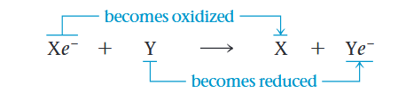

在该通用反应中，电子供体 $\text{X}e^-$ 称为<b>还原剂 (<i>reducing agent</i>)</b>，它将电子给出，还原了接受电子的物质 $\text{Y}$。电子受体 $\text{Y}$ 则为<b>氧化剂 (<i>oxidizing agent</i>)</b>，它夺走 $\text{X}e^-$ 的电子，使其发生氧化。由于电子转移必须同时存在电子供体与电子受体，氧化与还原过程总是相伴发生。

并非所有氧化还原反应都涉及电子的完全转移，有些只是改变了共价键中电子的共用程度。如<b>图 9.2</b> 的甲烷燃烧就是典型例子。甲烷中的共价键电子在成键原子间近乎均等共用，原因是碳和氢对价电子的吸引力相近，电负性大致相等，但甲烷与 $\text{O}_2$ 应生成 $\text{CO}_2$ 时，碳原子和新的成键伙伴 —— 电负性极强的氧原子之间，电子不再均等共用。实际上，碳原子相当于部分失去了共用电子，因此甲烷发生了氧化。

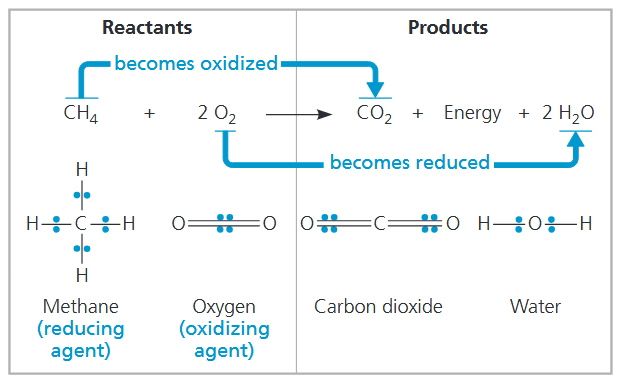

$\text{O}_2$ 中的两个氧原子均等共用电子。但在与甲烷反应后，每个 $\text{O}$ 与两个 $\text{H}$ 结合形成 $\text{ H}_2\text{O}$，这些共价键的电子会更多偏向 $\text{O}$ 一侧，实质上，每个 $\text{O}$ 相当于部分得到了电子，因此 $\text{O}_2$ 发生了还原反应。

##### *Oxidation of Organic Fuel Molecules During Cellular Respiration*

生物学家最为关注的产能氧化还原过程是呼吸作用，即葡萄糖与食物中其他有机物的氧化分解。我们再回看细胞呼吸的总反应式，从氧化还原的角度重新理解这一过程：

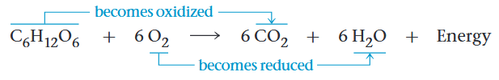

细胞呼吸总反应式表明，氢原子从葡萄糖转移至氧气中的氧原子。呼吸作用中，葡萄糖被氧化，电子降至更低能态，释放的能量可用于合成 $\text{ATP}$。因此从整体规律来看，富含 $\text{C—H}$ 键的能源物质，最终会被氧化为富含 $\text{C—O}$ 的产物。

主要的供能食物 —— 糖类与脂肪，都是与氢结合的电子储能库，多以碳氢键的形式存在。唯有活化能壁垒阻碍着电子自发流向更低能态。若无这一壁垒，葡萄糖等有机物会与氧气瞬间发生反应。而当人体摄入葡萄糖后，细胞内的酶会降低活化能壁垒，使糖类通过多步反应逐步氧化分解。

##### *Stepwise Energy Harvest via NAD⁺ and the Electron Transport Chain*

如果能源物质一次性全部释放能量，就无法被高效利用来完成生命活动。细胞呼吸也不会以一步剧烈反应的方式氧化葡萄糖或其他有机底物。相反，葡萄糖经由一系列分步反应逐步分解，每一步都由特定酶催化。在关键反应节点，电子会从葡萄糖上脱去。与多数氧化反应一样，每个电子都会伴随一个质子一同转移，即以氢原子的形式脱离。

这些氢原子并不会直接转移给氧气，而是先传递给电子载体—— 一种名为烟酰胺腺嘌呤二核苷酸 (<i>nicotinamide adenine dinucleotide</i>) 的辅酶，它由维生素烟酸衍生而来。该辅酶非常适合充当电子载体，因为它能在氧化态 $\text{NAD}^+$ 和还原态 $\text{NADH}$ 之间灵活循环转换。作为电子受体，$\text{NAD}^+$ 在呼吸作用中扮演氧化剂的角色。

$\text{NAD}^+$ 如何捕获葡萄糖及食物中其他有机分子的电子？脱氢酶可从底物 (如葡萄糖) 上脱去一对氢原子（$2$ 个电子和 $2$ 个质子），使底物发生氧化。酶将 $2$ 个电子连同 $1$ 个质子传递给辅酶 $\text{NAD}^+$，生成 $\text{NADH}$，余下 $1$ 个质子以 $\text{H}^+$ 形式释放到周围溶液中：

$$
\text{H}-\underset{|}{\overset{|}{\text{C}}}-\text{OH} + \text{NAD}^+ \xrightarrow{\text{Dehydrogenase}} \underset{|}{\overset{|}{\text{C}}}=\text{O} + \text{NADH} + \text{H}^+
$$

当 $\text{NAD}^+$ 被还原为 $\text{NADH}$ 时，其烟酰胺部分得到 $2$ 个带负电的电子、仅接受 $1$ 个带正电的质子，电荷由此被中和。$\text{NADH}$ 这一名称，正体现了它在反应中所结合的氢原子。$\text{NAD}^+$ 是细胞呼吸中用途最广泛的电子受体，在葡萄糖分解的多个氧化还原步骤中都发挥作用。

电子从葡萄糖转移至 $\text{NAD}^+$ 时，势能损耗极小。呼吸作用中生成的每分子 $\text{NADH}$ 都储存着能量；当电子从 $\text{NADH}$，便可释放能量用于合成 $\text{ATP}$。

我们将细胞呼吸的氧化还原过程与一个简单反应对比：氢气与氧气化合生成水<b>(图 9.4a)</b>。将 $\text{H}_2$ 与 $\text{O}_2$ 混合，再通过火花提供活化能，二者就会剧烈爆炸化合。细胞呼吸同样使氢与氧结合生成水，但存在两处关键区别：第一，呼吸作用中参与反应的氢来源于有机物，而非 $\text{H}_2$；第二，呼吸并非一步剧烈反应，而是借助电子传递链，把电子向氧回落释能的过程拆分为多个分步释能反应<b>(图 9.4b)</b>。

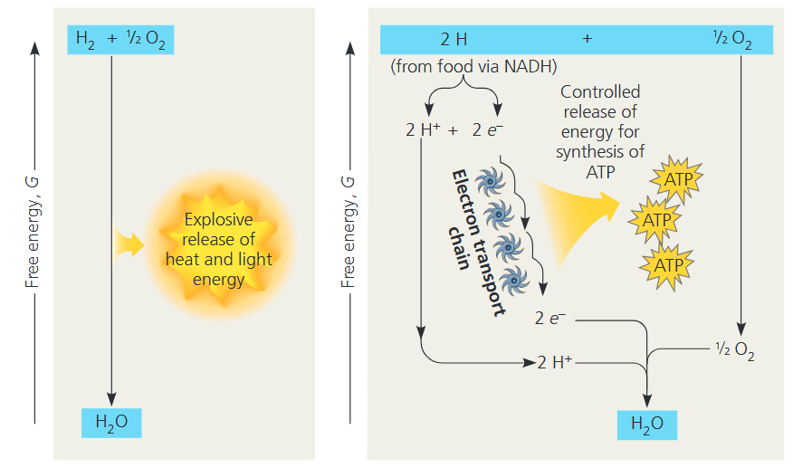

<b>电子传递链 (<i>electron transport chain</i>) </b>由多种分子（大多为蛋白质）组成，镶嵌在真核细胞线粒体内膜上（进行呼吸作用的原核生物则位于细胞膜上）。从葡萄糖脱下的电子由 $\text{NADH}$ 运送至传递链高能顶端，电子逐级传递，最终在低能末端被 $\text{O}_2$ 捕获，并结合质子生成水。（进行无氧呼吸的原核生物，电子传递链末端的电子受体并非氧气。）

从 $\text{NADH}$ 到 $\text{O}_2$ 的电子转移是放能反应，自由能变化为$-53\text{ kcal/mol (} -222\text{ kJ/mol)}$，这些能量并不会在一步剧烈反应中一次性散失浪费，而是让电子沿电子传递链，在一连串氧化还原反应中从一个载体逐级传递至下一个载体。每传递一步就释放少量能量，最终抵达末端电子受体氧气 —— 氧对电子具有极强的亲和力。也就是说，从葡萄糖转移到 $\text{NAD}^+$ 并使其还原为 $\text{NADH}$ 的电子，会顺着电子传递链的能量梯度逐级回落，最终落脚在电负性极强、状态更稳定的氧原子上。

#### The Stages of Cellular Respiration: *A Preview*

如<b>图 9.5</b>，糖酵解、丙酮酸氧化与柠檬酸循环是分解葡萄糖及其他有机能源物质的代谢途径。<b>糖酵解 (<i>glycolysis</i>) </b>发生在细胞质基质中，首先将一分子葡萄糖降解为两分子丙酮酸 (<i>pyruvate</i>)。在真核细胞中，丙酮酸进入线粒体，被氧化生成乙酰辅酶 A (<i>acetyl CoA</i>)，随后进入<b>柠檬酸循环 (<i>citric acid cycle</i>) </b>。至此，葡萄糖被彻底分解为二氧化碳。（原核生物的上述过程均发生在细胞质基质中。）因此，呼吸作用产生的二氧化碳，本质是有机物氧化分解后的碳骨架碎片。

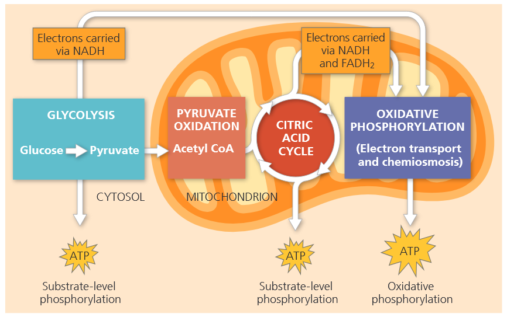

糖酵解与柠檬酸循环中的部分反应属于氧化还原反应，脱氢酶会将底物电子转移至 $\text{NAD}^+$ 或另一电子载体 $\text{FAD}$，生成 $\text{NADH}$ 与 $\text{FADH}_2$。在呼吸作用第三阶段，电子传递链接收前两阶段产生的 $\text{NADH}$、$\text{FADH}_2$ 所携带的电子，并逐级向下传递。传递链末端，电子与 $\text{O}_2$、$\text{H}^+$ 结合生成水。电子传递链每一步释放的能量，会被线粒体（原核生物则为细胞质膜系统）利用，驱动 $\text{ADP}$ 合成 $\text{ATP}$。这种 $\text{ATP}$ 合成方式依赖电子传递链的氧化还原反应供能，因此称作<b>氧化磷酸化 (<i>oxidative phosphorylation</i>) </b>。

在真核细胞中，线粒体内膜是电子传递与**化学渗透**的发生场所，二者共同构成氧化磷酸化。（原核生物中，这些过程发生在细胞膜上。）氧化磷酸化几乎占到呼吸作用 $90\%$ 的 $\text{ATP}$ 生成量。而糖酵解和柠檬酸循环的部分反应，会通过<b>底物水平磷酸化 (<i>substrate-level phosphorylation</i>) </b>直接生成少量 $\text{ATP}$<b>(图 9.6)</b>。这种 $\text{ATP}$ 合成方式的特点是：酶直接将底物分子上的磷酸基团转移给 $\text{ADP}$；不同于氧化磷酸化那种往 $\text{ADP}$ 上结合无机磷酸的方式。此处的 “底物分子”，指葡萄糖分解代谢过程中产生的有机中间产物。

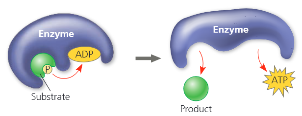

### CONCEPT 9.2 Glycolysis harvests chemical energy by oxidizing glucose to pyruvate

糖酵解字面含义为 “糖分裂解”，这也正是该代谢途径的本质过程。六碳的葡萄糖被裂解为两分子三碳糖；随后这些小分子糖类发生氧化，剩余原子经重排，最终生成两分子丙酮酸。

如 <b>图 9.7</b> 概括所示，糖酵解可分为两个阶段：能量投入阶段与能量收益阶段。在能量投入阶段，细胞会消耗 $\text{ATP}$。这份能量投入会在能量收益阶段连本带利得到回报：此阶段通过底物水平磷酸化生成 $\text{ATP}$，同时葡萄糖氧化释放的电子将 $\text{NAD}^+$ 还原为 $\text{NADH}$。每分子葡萄糖经糖酵解的净能量产出为 $2$ 分子 $\text{ATP}$ 和 $2$ 分子 $\text{NADH}$。糖酵解全过程共十步反应，如<b>图 9.8</b> 所示。

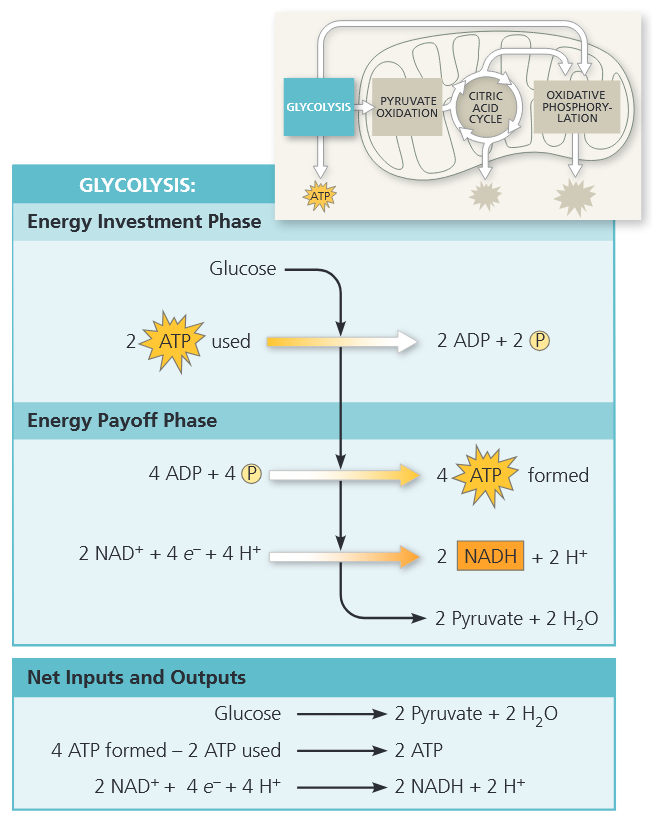

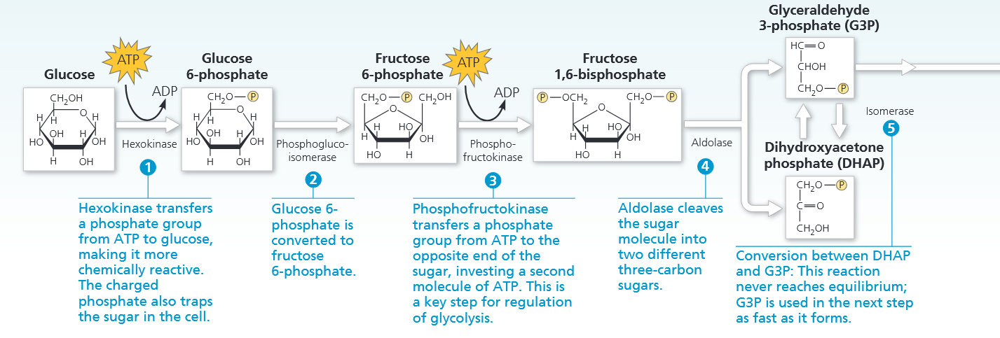
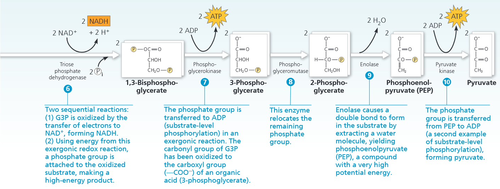

- ① 己糖激酶 (<i>hexokinase</i>)将一个磷酸基团从 $\text{ATP}$ 转移到葡萄糖上，将它活化。带电荷的磷酸基团同时将糖类锁定在细胞内，无法透出。
- ② $6-$磷酸葡糖通过磷酸果糖异构酶 (<i>phosphoglucoisomerase</i>) 转变为 $6-$磷酸果糖。
- ③ 磷酸果糖激酶 (<i>phosphofructokinase</i>) 将一分子 $\text{ATP}$ 的磷酸基团转移至糖分子的另一端，消耗第二分子 $\text{ATP}$。这是糖酵解调控的关键步骤。
- ④ 醛缩酶 (<i>aldose</i>) 将 $1,\text{ 6}-$二磷酸果糖分子裂解为两种不同的三碳糖：3-磷酸甘油醛 (<i>G3P</i>) 和磷酸二羟丙酮 (<i>DHAP</i>)。
- ⑤ $\text{DHAP}$ 与 $\text{G3P}$ 通过磷酸丙糖异构酶相互转化：该反应永远无法达到平衡；$\text{G3P}$ 一经生成便会迅速进入下一步反应被消耗。
- ⑥ 两步连续反应：$\text{G3P}$ 被被氧化，电子转移至 $\text{NAD}^+$ 并生成 $\text{NADH}$；利用该放能氧化还原反应释放的能量，向氧化后的底物连上一个磷酸基团，生成 $1,\text{ 3}-$二磷酸甘油醛。
- ⑦ 磷酸基团自发能反应中转移至 $\text{ADP}$，发生底物水平磷酸化。$\text{G3P}$ 的醛基被氧化为羧基。
- ⑧ 磷酸甘油醛变位酶将 $3-$磷酸甘油酸的磷酸基转移到 $2$ 号位。
- ⑨ 烯醇化酶 (<i>enolase</i>) 通过脱去一分子水，促使底物形成双键，生成磷酸烯醇式丙酮酸（<i>PEP</i>），这是一种势能极高的化合物。
- ⑩ 丙酮酸激酶催化 $\text{PEP}$ 上的磷酸基团转移至 $\text{ADP}$（第二次底物水平磷酸化），最终生成丙酮酸。

葡萄糖中原本所有的碳原子，全部保留在两分子丙酮酸中；糖酵解过程不释放二氧化碳。糖酵解的进行无需氧气参与，有氧、无氧条件下均可发生。但如果有氧气存在，丙酮酸与 $\text{NADH}$ 中储存的化学能，可通过丙酮酸氧化、柠檬酸循环和氧化磷酸化被进一步释放利用。

### CONCEPT 9.3 After pyruvate is oxidized, the citric acid cycle completes the energy-yielding oxidation of organic molecules
#### Oxidation of Pyruvate to Acetyl CoA

丙酮酸经主动运输进入线粒体后，会首先转化为乙酰 $\text{CoA}$<b>(图 9.9)</b>。该步骤衔接糖酵解与柠檬酸循环，由一种多酶复合体催化三步反应：① 丙酮酸的羧基（$\text {-COO}^-$）本就已有一定氧化程度，化学能储量较低，在此步被彻底氧化，以一分子 $\text {CO}_2$ 的形式释放。这是细胞呼吸过程中首次释放 $\text {CO}_2$。② 随后，剩余的二碳片段发生氧化，电子转移至 $\text {NAD}^+$，以 $\text {NADH}$ 的形式储存能量。③ 最后辅酶 $\text{A}$ ($\text {CoA}$）通过自身硫原子与二碳中间产物结合，生成乙酰 $\text {CoA}$。乙酰 $\text {CoA}$ 蕴含很高的势能，可将乙酰基转移至柠檬酸循环中的底物分子上，因此该反应属于高度放能反应。

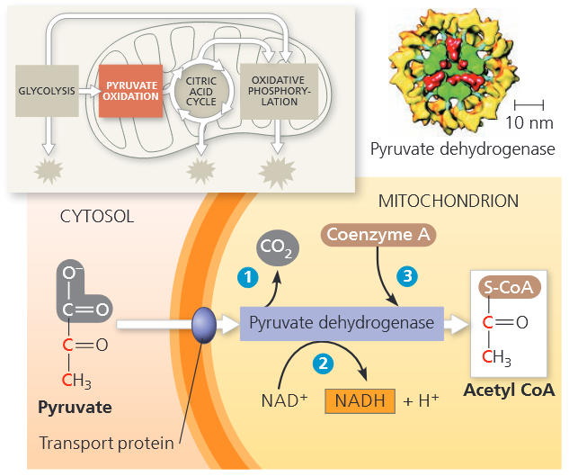

#### The Citric Acid Cycle
柠檬酸循环进一步氧化由丙酮酸衍生而来的有机能源物质。<b>图 9.10 </b>汇总了物质的输入与输出：丙酮酸彻底分解可生成三分子 $\text {CO}_2$，包含丙酮酸转变为乙酰 $\text {CoA}$ 过程中释放的那一分子 $\text {CO}_2$。柠檬酸循环每运转一圈，通过底物水平磷酸化生成 $1$ 分子 $\text{ATP}$；而大部分化学能则在氧化还原反应中转移至 $\text {NAD}^+$与 $\text {FAD}$。还原型辅酶 $\text {NADH}$ 和 $\text {FADH}_2$ 将携带的高能电子运送至电子传递链。柠檬酸循环也被称为三羧酸循环或 Krebs 循环。

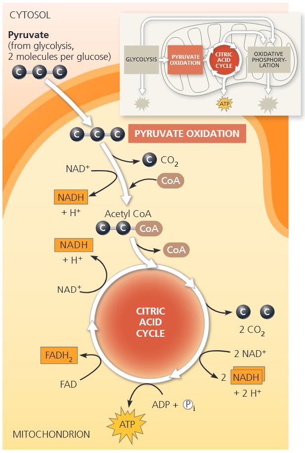

现在我们来细致讲解柠檬酸循环。该循环共有八步，每一步均由特定酶催化。由<b>图 9.11 </b>可见：柠檬酸循环每运转一轮，有两个碳原子以还原程度相对较高的乙酰基形式进入循环 (①)；另有两个不同碳原子以完全氧化的 $\text {CO}_2$ 形式脱离循环 (③, ④)。乙酰 $\text {CoA}$ 中的乙酰基与草酰乙酸 (<i>oxaloacetate</i>) 结合进入循环，生成柠檬酸 (<i>citrate</i>)（①）。柠檬酸是柠檬酸循环名称的由来，后续七步反应将柠檬酸逐步分解，重新生成草酰乙酸。正是草酰乙酸的再生，使该代谢过程形成循环。

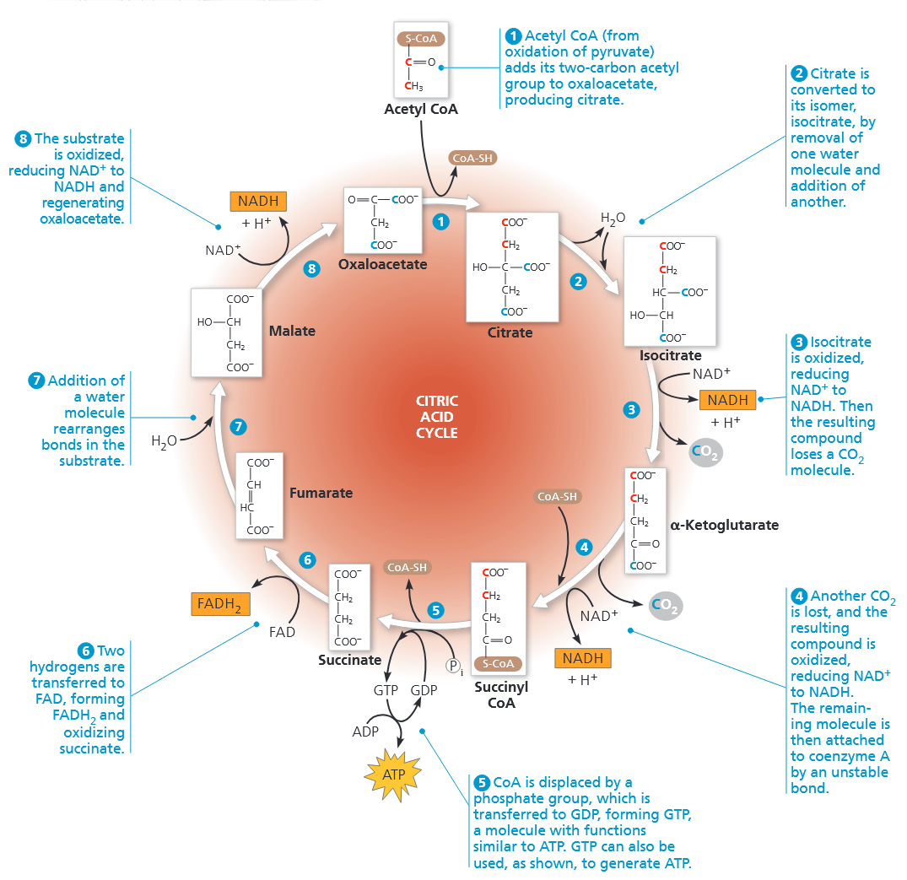

对照图 $9.11$，我们可以统计柠檬酸循环产生的高能分子。每有一个乙酰基进入循环，会有 $3$ 分子 $\text {NAD}^+$ 被还原为 $\text {NADH}$ (③, ④, ⑧)。在 ⑥ 中，电子并未传给 $\text {NAD}^+$，而是转移至 $\text {FAD}$；$\text {FAD}$ 接受 $2$ 个电子和 $2$ 个质子，生成 $\text {FADH}_2​$。在多数动物组织细胞中，⑤ 通过底物水平磷酸化生成一分子 $\text{GTP}$。$\text{GTP}$ 在结构与细胞功能上和 $\text{ATP}$ 相似，既可用来合成 $\text{ATP}$，也能直接为细胞生命活动供能。⑤ 中生成的高能化合物，是柠檬酸循环中唯一产生的 $\text{ATP}$ 等价物。一分子葡萄糖可生成两分子乙酰 $\text {CoA}$ 进入柠檬酸循环。

由于前述数值是以单个乙酰基进入循环计算，因此每分子葡萄糖经柠檬酸循环的总产物翻倍：$6$ 分子 $\text {NADH}$、$2$ 分子 $\text {FADH}_2$ 以及相当于 $2$ 分子 $\text{ATP}$ 的能量。

### CONCEPT 9.4 During oxidative phosphorylation, chemiosmosis couples electron transport to ATP synthesis

从葡萄糖中释放的大部分能量都储存在 $\text {NADH}$ 与 $\text {FADH}_2$ 中。这类电子载体将糖酵解、柠檬酸循环与氧化磷酸化过程关联起来；氧化磷酸化利用电子传递链释放的能量驱动 $\text{ATP}$ 合成。

#### The Pathway of Electron Transport

电子传递链是真核细胞中镶嵌于线粒体内膜上的一组分子集合。（原核生物中，这类分子分布在细胞膜上。）线粒体内膜折叠形成嵴，增大了膜面积，足以容纳电子传递链各组分的数千套拷贝。结构与功能相适配：高度折叠的内膜富集大量电子载体分子，非常适合沿电子传递链依次发生一连串氧化还原反应。

电子传递链的绝大多数组分是蛋白质，以多蛋白复合体形式存在，编号为复合体Ⅰ至 Ⅳ。这些蛋白质上紧密结合着**辅基**——属于非蛋白组分，如辅因子、辅酶等，是部分酶发挥催化功能所必需的物质。

<b>图 9.12 </b>展示了电子传递链中电子载体的排布顺序，以及电子沿传递链传递时自由能的降幅。电子传递过程中，电子载体不断在还原态与氧化态之间交替，依次接收并传递电子。传递链上每一载体从电子亲和力更低的上游载体获得电子后变为还原态；随后将电子传递给电子亲和力更高的下游载体，自身恢复为氧化态。

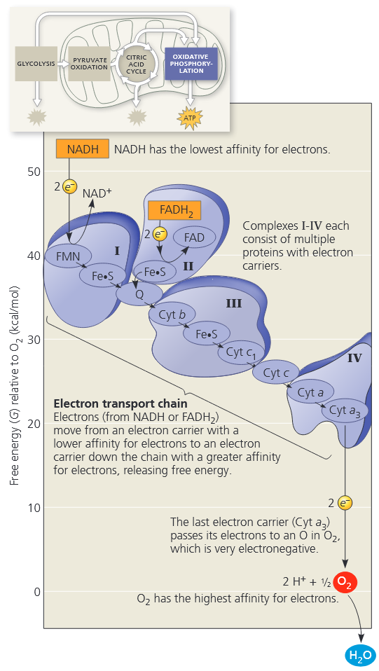

糖酵解与柠檬酸循环中葡萄糖给出的电子被 $\text {NAD}^+$ 捕获，随后由 $\text {NADH}$ 传递给电子传递链复合体Ⅰ的首个分子。该分子属于黄素蛋白，因其含有名为黄素单核苷酸 (<i>FMN</i>）的辅基而得名。

在下一轮氧化还原反应中，黄素蛋白将电子传递给 $\textcolor{#7030a0}{\text{Fe-S}}$ 蛋白，自身恢复为氧化态；$\text{Fe-S}$ 蛋白是一类紧密结合铁、硫原子的蛋白质家族。铁硫蛋白继而把电子传给泛醌（图 $9.12$ 中标记为 $\text{Q}$）。泛醌是小型疏水分子，也是电子传递链中唯一非蛋白类载体。它不固定依附于某个复合体，可在膜内自由移动。

泛醌与氧气之间剩余大部分电子载体均为<b>细胞色素 (<i>cytochrome</i>) </b>类蛋白质。其辅基为血红素 (<i>heme</i>) 基团，所含铁原子可接收并传递电子。（细胞色素的血红素与红细胞血红蛋白的血红素结构相近，区别在于：血红蛋白的铁负责携带氧气，而非电子。）

电子传递链含有多种细胞色素，均以 $\text{cyt}$ 加字母和编号命名，用来区分不同蛋白；它们的血红素载电子能力略有差异。传递链上最后一种细胞色素 $\text{cyt a}_3$ 将电子传递给电负性极强的 $\text{O}_2$。每分子 $\text{O}_2$ 还会从水溶液中结合一对 $\text{H}^+$，中和电子所带的负电荷，最终生成水。

电子传递链主要另一处电子来源为 $\text {FADH}_2$，也是柠檬酸循环产生的另一种还原型产物。由图 $9.12$ 可见：$\text {FADH}_2$ 在复合体Ⅱ处送入电子，起始能级低于 $\text {NADH}$。因此尽管 $\text {NADH}$ 与 $\text {FADH}_2$ 均提供等量电子用于还原氧气，但以 $\text {FADH}_2$ 作为电子供体时，电子传递链可为 $\text{ATP}$ 合成提供的能量，比 $\text {NADH}$ 作为供体时约少三分之一。

电子传递链不直接生成 $\text{ATP}$。它只是让电子从营养物质流向氧气的过程平缓逐级释放，把巨大的自由能降幅拆分为多步小幅释放，使能量可控、分步利用。线粒体（原核生物则为细胞膜）通过化学渗透机制将电子传递与能量释放和 $\text{ATP}$ 合成偶联。

#### Chemiosmosis: The Energy-Coupling Mechanism

线粒体内膜或原核生物细胞膜上，分布着大量 $\textcolor{#7030a0}{\text{ATP}}$ 合酶蛋白复合体，该酶可利用 $\text{ADP}$ 与无机磷酸合成 $\text{ATP}$<b>(图 9.13)</b>。

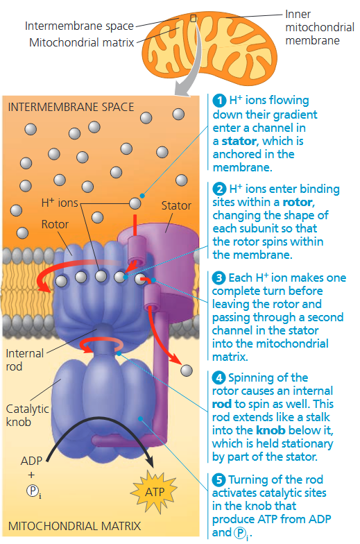

- ① $\text {H}^+$ 顺着浓度梯度流动，进入固定在膜上的**定子 (stator)** 中的通道。
- ② $\text {H}^+$ 顺浓度梯度进入**转子 (rotor)** 的结合位点，改变各个亚基的构象，使转子在膜内发生旋转。
- ③ 每个 $\text {H}^+$ 离子完成一次完整旋转后，离开转子，经由定子上的第二条通道进入线粒体基质。
- ④ 转子转动会带动内部**转轴 (rob)** 一同旋转。该转轴如柄状向下伸入下方固定头部，头部由定子结构维持静止状态。
- ⑤ 转轴的旋转激活催化头部的催化位点，利用 $\text{ADP}$ 与无机磷酸 $\text{P}_i$ 合成 $\text{ATP}$

$\text{ATP}$ 合酶的作用如同反向运转的离子泵。普通离子泵通常消耗 $\text{ATP}$ 供能，逆浓度梯度转运离子。酶可依据反应的自由能变化 $\Delta G$ 双向催化反应，而 $\Delta G$ 受反应物与生成物局部浓度影响。在细胞呼吸的生理条件下，$\text{ATP}$ 合酶并不水解 $\text{ATP}$ 逆浓度梯度泵送质子，而是利用已建立的离子浓度梯度势能驱动 $\text{ATP}$ 合成。其能量来源是线粒体内膜两侧的 $\text {H}^+$ 浓度差，即 $\text{pH}$ 差值。这种借助跨膜氢离子梯度中储存的能量，驱动 $\text{ATP}$ 合成等生命活动的过程，称为<b>化学渗透 (<i>chemiosmosis</i>)</b>。渗透一词此前用于水分运输，此处专指 $\text {H}^+$ 跨膜流动。

通过研究 $\text{ATP}$ 合酶的结构，科学家阐明了 $\text {H}^+$ 流经该酶驱动 $\text{ATP}$ 生成的机制。$\text{ATP}$ 合酶是由多个亚基构成的复合体，包含四个主要结构部分，每部分均由多条多肽链组成。质子依次嵌入转子的结合位点，带动转子旋转，进而催化 $\text{ADP}$ 与无机磷酸合成 $\text{ATP}$。$\text{ATP}$ 合酶也是自然界已知最小的分子旋转马达。

线粒体内膜（或原核生物细胞膜）通过电子传递链建立并维持驱动 $\text{ATP}$ 合酶合成 $\text{ATP}$ 的 $\text {H}^+$ 浓度梯度，电子传递链在线粒体中的分布如<b>图 9.14 </b>所示。

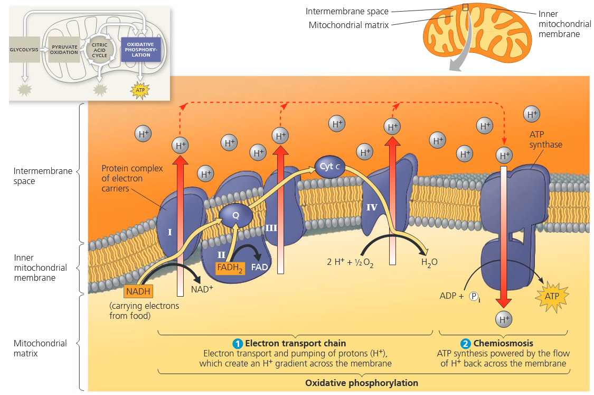

电子传递链相当于能量转换器，利用 $\text {NADH}$ 与 $\text {FADH}_2$ 释放电子的放能过程，将 $\text {H}^+$ 跨膜泵送：从线粒体基质转运至膜间隙。$\text {H}^+$ 有顺浓度梯度跨膜扩散回流的趋势，而 $\text{ATP}$ 合酶是唯一可供 $\text {H}^+$ 穿透内膜的通道。如前文所述，$\text {H}^+$ 顺浓度梯度流经 $\text{ATP}$ 合酶时，借助质子回流的放能势能驱动 $\text{ADP}$ 发生磷酸化生成 $\text{ATP}$。因此，跨膜氢离子梯度所储存的能量，将电子传递链的氧化还原反应与 $\text{ATP}$ 合成过程偶联在了一起。

研究发现，电子传递链中的部分组分在传递电子的同时，还会接收并释放质子。在传递链的某些反应节点，电子的转移会伴随 $\text {H}^+$ 的摄取，并将其释放到周边介质中。真核细胞里，内膜上的电子载体在空间上有序排布：从线粒体基质摄取 $\text {H}^+$，再将其释放到膜间隙。由此形成的 $\text {H}^+$ 浓度梯度称为<b>质子驱动力 (<i>proton-motive force</i>)</b>，凸显该梯度具备做功的能量潜力。

从广义上来说，**化学渗透是一种能量偶联机制：利用跨膜质子梯度中储存的能量，驱动各类生命活动**。在线粒体中，形成质子梯度的能量来自电子传递链上放能的氧化还原反应，所驱动的生命过程即为 $\text{ATP}$ 的合成。但化学渗透也存在于其他场所，且形式略有不同。叶绿体在光合作用中依靠化学渗透生成 $\text{ATP}$；在这类细胞器中，光能而非化学能，驱动电子沿传递链流动，并建立 $\text {H}^+$ 梯度。

#### An Accounting of ATP Production by Cellular Respiration
呼吸作用中，能量主要按以下顺序流动：葡萄糖 → $\text {NADH}$ → 电子传递链 → 质子驱动力 → $\text{ATP}$。我们可以通过能量核算，计算一分子葡萄糖彻底氧化分解为六分子二氧化碳时生成的 $\text{ATP}$ 总量。细胞呼吸代谢过程分为三大阶段：糖酵解、丙酮酸氧化与柠檬酸循环，以及驱动氧化磷酸化的电子传递链。<b>图 9.15 </b>详细列出了每分子葡萄糖氧化后的 $\text{ATP}$ 生成量。总量包含：糖酵解和柠檬酸循环中底物水平磷酸化直接产生的 $4$ 分子 $\text{ATP}$，再加上氧化磷酸化生成的大量 $\text{ATP}$。每分子 $\text {NADH}$ 将一对电子从葡萄糖传入电子传递链，所提供的质子驱动力最多可生成约 $3$ 分子 $\text{ATP}$。

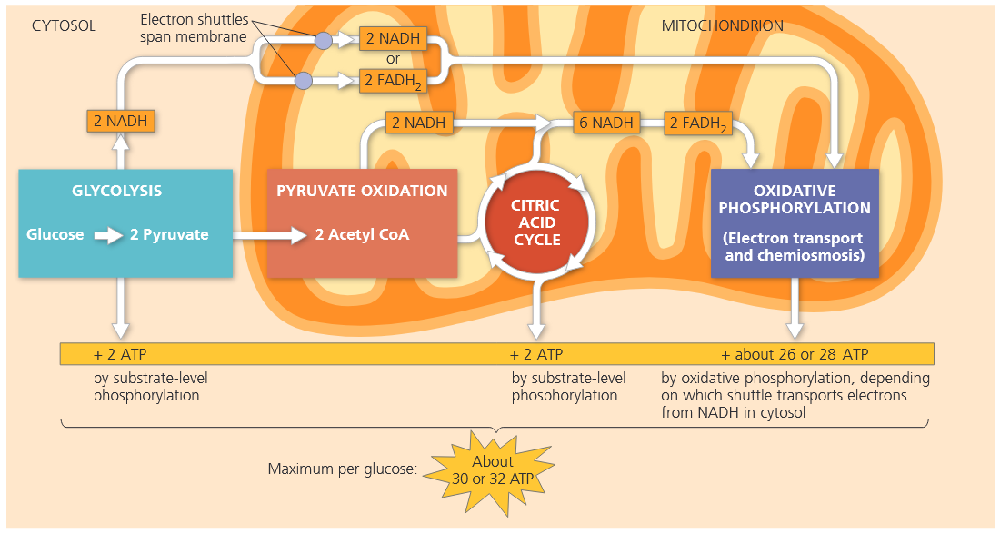

图 $9.15$ 中的 $\text{ATP}$ 数值并非精确整数，主要有三个原因：第一，磷酸化反应与氧化还原反应并非直接偶联，因此 $\text {NADH}$ 与 $\text{ATP}$ 的数量比值并非整数。已知 $1$ 分子 $\text {NADH}$ 可向线粒体内膜外侧转运 $10$ 个 $\text {H}^+$，生成 $1$ 分子 $\text{ATP}$ 需要经 $\text{ATP}$ 合酶回流进入线粒体基质的 $\text {H}^+$ 确切数量最公认的数量是：合成 $1$ 分子 $\text{ATP}$ 需 $4$ 个 $\text {H}^+$。据此计算，$1$ 分子 $\text {NADH}$ 产生的质子驱动力可合成 $2.5$ 分子 $\text{ATP}$。柠檬酸循环还通过 $\text {FADH}_2$ 向电子传递链提供电子，但因其电子进入传递链的位置更靠后，每分子 $\text {FADH}_2$ 转运的 $\text {H}^+$ 仅能支撑合成 $1.5$ 分子 $\text{ATP}$。

第二，$\text{ATP}$ 的生成量会随胞质电子进入线粒体所借助的穿梭系统类型而略有差异。线粒体内膜无法通透 $\text {NADH}$，因此细胞质中的 $\text {NADH}$ 无法直接接触氧化磷酸化的反应体系。糖酵解产生的 $\text {NADH}$ 所携带的两个电子，必须通过特定电子穿梭系统转运进入线粒体。不同细胞所使用的穿梭系统不同，电子会分别传递给线粒体基质中的 $\text {NAD}^+$ 或 $\text {FAD}$。若电子传给 $\text {FAD}$，胞质中每分子 $\text {NADH}$ 仅能生成约 $1.5$ 分子 $\text{ATP}$；若电子传给线粒体的 $\text {NAD}^+$，每分子 $\text {NADH}$ 可生成约 $2.5$ 分子 $\text{ATP}$。

第三个导致 $\text{ATP}$ 实际生成量偏低的影响因素是：呼吸作用氧化还原反应产生的质子驱动力，会被用于驱动其他生理过程，并非全部用来合成 $\text{ATP}$。倘若电子传递链产生的质子驱动力全部专一用于 $\text{ATP}$ 合成：一分子葡萄糖经氧化磷酸化最多可生成 $28$ 分子 $\text{ATP}$，再加上底物水平磷酸化净生成的 $4$ 分子 $\text{ATP}$，总量约 $32$ 分子 $\text{ATP}$；若采用效率较低的电子穿梭系统，则总生成量仅约 $30$ 分子 $\text{ATP}$。

最后粗略估算一下呼吸作用的能量转化效率，即葡萄糖中的化学能有多大比例转移到了 $\text{ATP}$ 中。标准状况下，$1 \text{ mol}$ 葡萄糖彻底氧化可释放 $686\text{ kcal}$ 能量。每摩尔 $\text{ADP}$ 磷酸化生成 $\text{ATP}$，可储存至少 $7.3\text{ kcal }$能量。据此计算呼吸效率：每摩尔 $\text{ATP}$ 储能 $7.3\text{ kcal}$，$1$ 分子葡萄糖最多生成 $32$ 分子 $\text{ATP}$，除以葡萄糖总放能 $686\text{ kcal}$，结果约为 $0.34$。也就是说，葡萄糖中约 $34\%$ 的潜在化学能转化储存到 $\text{ATP}$ 中；实际比例会随细胞生理状态下自由能 $\Delta G$ 的变化而波动。

### CONCEPT 9.5 Fermentation and anaerobic respiration enable cells to produce ATP without the use of oxygen

由于细胞呼吸产生的大部分 $\text{ATP}$ 都来自氧化磷酸化过程，因此有氧呼吸的 $\text{ATP}$ 生成量，依赖于细胞充足的 $\text{O}_2$ 供应。但部分细胞可通过两种途径，在无氧条件下氧化有机物并生成 $\text{ATP}$：无氧呼吸与发酵。二者的核心区别是：无氧呼吸仍利用电子传递链，而发酵不使用电子传递链。

作为有机物营养物质呼吸氧化的替代途径，发酵是糖酵解的延伸，能够通过糖酵解的底物水平磷酸化持续生成 ATP。要维持这一过程，必须有充足的 $\text {NAD}^+$，在糖酵解的氧化步骤中接受电子。若没有相应机制将 $\text {NADH}$ 再生为 $\text {NAD}^+$，糖酵解会很快耗尽细胞内的 $\text {NAD}^+$ 储备，使其全部被还原为 $\text {NADH}$，最终因缺乏氧化剂而停止进行。

有氧条件下，$\text {NAD}^+$ 通过将 $\text {NADH}$ 的电子传递至电子传递链而得以再生。无氧条件下则存在另一种方式：将 $\text {NADH}$ 中的电子转移给糖酵解的终产物丙酮酸。

#### Types of Fermentation

发酵由糖酵解，以及能再生 $\text {NAD}^+$ 的后续反应共同组成：将电子从 $\text {NADH}$ 转移给丙酮酸或丙酮酸衍生物，从而重新生成 $\text {NAD}^+$。再生出的 $\text {NAD}^+$ 可再次参与糖酵解氧化糖类，经由底物水平磷酸化净生成两分子 $\text{ATP}$。发酵有多种类型，差异在于丙酮酸代谢生成的终产物不同。其中最主要的两类为酒精发酵与乳酸发酵，二者均被人类应用于食品加工与工业生产中。

在酒精发酵中<b>(图 9.16a)</b>，丙酮酸通过两步反应转变为乙醇。第一步，丙酮酸脱去 $\text {CO}_2$，生成二碳化合物乙醛。第二步，乙醛被 $\text {NADH}$ 还原为乙醇，同时重新生成 $\text {NAD}^+$，维持糖酵解持续进行。许多细菌可在无氧条件下进行酒精发酵。酵母菌属于真菌，除有氧呼吸外，也能进行酒精发酵。

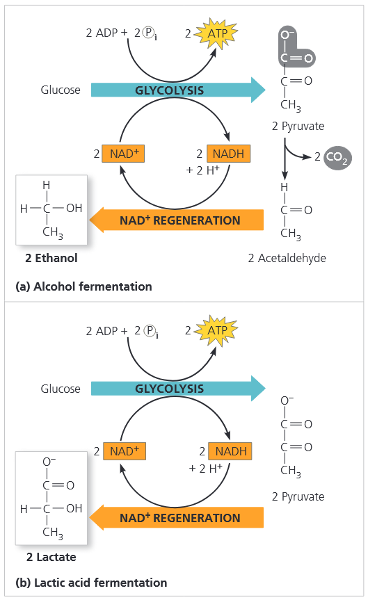

在乳酸发酵过程中<b>(图 9.16b)</b>，丙酮酸直接被 $\text {NADH}$ 还原，生成终产物乳酸盐，同时再生 $\text {NAD}^+$，全程不释放 $\text {CO}_2$。部分真菌与细菌的乳酸发酵被应用于乳制品工业，用以制作奶酪和酸奶。

人体的乳酸生成又是怎样的情况呢？过去认为，人体肌肉细胞只在氧气不足时才产生乳酸。但近几十年研究表明，至少在哺乳动物体内，乳酸代谢机制远比想象复杂。

骨骼肌纤维分为两类：红肌纤维倾向将葡萄糖彻底氧化分解为 $\text {CO}_2$；白肌纤维即便在有氧条件下，也会把糖酵解生成的丙酮酸大量转化为乳酸，能快速生成 $\text{ATP}$，但能量利用效率较低。生成的乳酸大部分被周边红肌纤维氧化利用，剩余部分转运至肝脏、肾脏，重新合成葡萄糖。

#### Comparing Fermentation with Anaerobic and Aerobic Respiration

发酵、无氧呼吸与有氧呼吸，是细胞通过摄取食物化学能以生成 $\text{ATP}$ 的三条替代代谢途径。三者均通过糖酵解，将葡萄糖及其他有机物氧化为丙酮酸，并经底物水平磷酸化净产生 $2$ 分子 $\text{ATP}$。且在三条途径中，$\text {NAD}^+$ 都是糖酵解过程中接受有机物电子的氧化剂。

核心差异在于将 $\text {NADH}$ 重新氧化为 $\text {NAD}^+$ 的机制不同，而这一步是维持糖酵解持续进行的必需环节。在发酵过程中，最终电子受体是丙酮酸这类有机物（乳酸发酵）或乙醛（酒精发酵）。与之相对，细胞呼吸中 $\text {NADH}$ 携带的电子会传入电子传递链，借此再生糖酵解所需的 $\text {NAD}^+$。

另一主要区别在于 $\text{ATP}$ 的生成总量。发酵仅通过底物水平磷酸化产生 $2$ 分子 $\text{ATP}$。由于没有电子传递链，丙酮酸中储存的能量无法被利用。而在细胞呼吸中，丙酮酸会被彻底氧化；过程中释放的电子由 $\text {NADH}$ 和 $\text {FADH}_2$ 携带，送入电子传递链。电子经由一系列氧化还原反应逐级传递，最终交给末端电子受体。电子的逐级传递驱动氧化磷酸化，大量生成 $\text{ATP}$。因此细胞呼吸从每分子糖类中捕获的能量远高于发酵。

有些生物属于<b>专性厌氧菌 (<i>obligate anaerobe</i>)</b>，只能进行发酵或无氧呼吸。这类生物无法在有氧环境中存活，若细胞缺乏防护系统，部分形态的氧气甚至会产生毒性。另有包括酵母菌和多种细菌在内的生物，既可通过发酵、也可通过细胞呼吸合成足量 $\text{ATP}$ 维持生命，这类物种称为<b>兼性厌氧菌 (<i>facultative anaerobe</i>)</b>。

以酵母菌为例，丙酮酸是代谢通路的分叉点，可走向两条不同的分解代谢途径<b>(图 9.17)</b>。有氧条件下，丙酮酸转变为乙酰辅酶 $\text{A}$，经由柠檬酸循环继续进行有氧氧化。无氧条件下，则启动乳酸发酵；丙酮酸不再进入柠檬酸循环，转而作为电子受体，实现 $\text {NAD}^+$ 的再生。

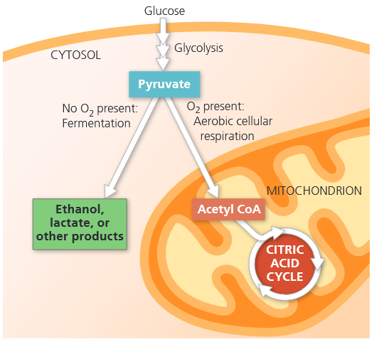

### CONCEPT 9.6 Glycolysis and the citric acid cycle connect to many other metabolic pathways

糖酵解与柠檬酸循环，是细胞分解代谢与合成代谢通路的重要交汇节点。

#### The Versatility of Catabolism

人体所需大部分热量来自脂肪、蛋白质，以及蔗糖等双糖和淀粉等多糖类碳水化合物。食物中所有这些有机物，均可通过细胞呼吸途径生成 $\text{ATP}$<b>(图 9.18)</b>。

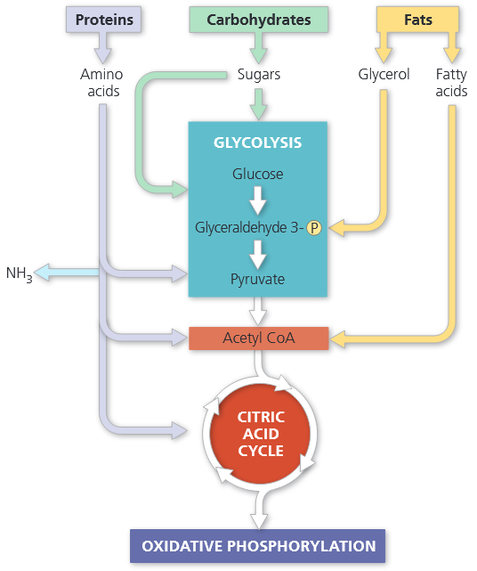

糖酵解可承接多种碳水化合物进入分解代谢。消化道内的淀粉可水解为葡萄糖，再在细胞内经由糖酵解与柠檬酸循环分解供能。糖原是人类及多数动物储存在肝脏和肌细胞中的多糖，两餐之间可水解为葡萄糖，作为呼吸作用的底物。蔗糖等双糖经消化分解，也会生成葡萄糖及其他单糖，为细胞呼吸提供能量来源。

蛋白质也可用来生成 $\text {ATP}$，但首先必须消化分解为组成氨基酸。大部分氨基酸会被生物体用于合成新的蛋白质。多余的氨基酸在酶的作用下，转化为糖酵解和柠檬酸循环的中间产物。氨基酸进入糖酵解或柠檬酸循环之前，必须脱去氨基，该过程称为脱氨基作用。含氮代谢废物以 $\text {NH}_3$、尿素或其他代谢产物的形式排出动物体外。

分解代谢还能利用从食物或体内脂肪细胞中获取的脂肪所储存的能量。脂肪被消化分解为甘油和脂肪酸后，甘油会转化为糖酵解的中间产物磷酸甘油醛。脂肪中的大部分能量储存在脂肪酸中。名为 $\textcolor{#ff0080}{\boldsymbol {\beta-}}$<b>氧化</b>的代谢序列可将脂肪酸分解为二碳片段，以乙酰辅酶 $\text{A}$ 的形式进入柠檬酸循环。$\beta-$氧化过程中还会生成 $\text {NADH}$ 和 $\text {FADH}_2$，二者可进入电子传递链，进一步生成 $\text {ATP}$。

#### Biosynthesis (Anabolic Pathways)
细胞既需要能量，也需要物质。食物中的有机物并非都会被氧化供能以生成 $\text {ATP}$。除提供热量外，食物还需供给细胞合成自身物质所需的碳骨架。

部分消化得到的有机单体可被直接利用。例如前文所述，食物蛋白质水解产生的氨基酸，可直接用于合成机体自身蛋白质。但人体所需的部分特定物质无法从食物中直接获取，这时糖酵解与柠檬酸循环的中间产物，会分流进入合成代谢途径，作为前体物质，供细胞合成所需各类分子。

人体所需 $20$ 种蛋白质氨基酸中，约有一半可由柠檬酸循环的中间产物修饰转化而来；其余为必需氨基酸，只能从膳食中摄取。

#### Regulation of Cellular Respiration via Feedback Mechanisms

供求平衡的基本原理调控着细胞的代谢稳态。细胞不会浪费能量去合成超出自身需求的物质。例如，当某种氨基酸富余时，利用柠檬酸循环中间产物合成该氨基酸的合成代谢途径就会被关闭。这种调控最常见的机制是反馈抑制：合成代谢途径的终产物，会抑制通路早期关键步骤的催化酶。这一机制避免关键代谢中间产物被无谓分流，保障更急需的生理过程优先利用物质与能量。

细胞同时也会调控自身分解代谢。当细胞代谢活动旺盛、$\text {ATP}$ 浓度下降时，细胞呼吸会随之加快；当 $\text {ATP}$ 储备充足、足以满足需求时，呼吸作用便会放缓，将宝贵的有机物留存下来供给其他生理功能。这种调控主要通过调节分解代谢通路关键位点的酶活性实现。如<b>图 9.19 </b> 所示，磷酸果糖激酶 (<i>phosphofructokinase</i>) 是重要的代谢开关，它催化糖酵解第三步反应。这一步是底物不可逆进入糖酵解通路的关键步骤。细胞通过调控该步骤的反应速率，即可加快或减慢整个分解代谢进程。因此磷酸果糖激酶被视作细胞呼吸的关键调控酶。

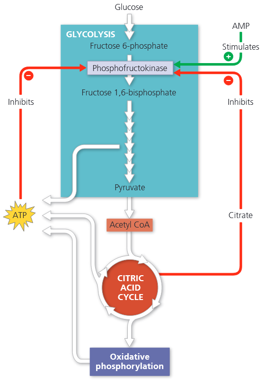

酸果糖激酶是一种别构酶，带有可结合特定抑制剂与激活剂的调节位点。该酶受 $\text {ATP}$ 抑制、受 $\text {AMP}$（一磷酸腺苷）激活，$\text {AMP}$ 由细胞内的 $\text {ADP}$ 转化而来。当 $\text {ATP}$ 大量积累时，酶被抑制，糖酵解速率随之降低；当细胞生命活动消耗 $\text {ATP}$、使其分解为 $\text {ADP}$ 和 $\text {AMP}$ 的速率超过 $\text {ATP}$ 合成再生速率时，该酶便重新恢复活性。

磷酸果糖激酶还对柠檬酸循环的第一个产物——柠檬酸十分敏感。若线粒体内柠檬酸堆积，一部分柠檬酸会扩散至细胞质，进而抑制磷酸果糖激酶。这一机制能够协同调控糖酵解与柠檬酸循环的反应速率：柠檬酸蓄积时，糖酵解放缓，丙酮酸生成减少，进入柠檬酸循环的乙酰基也随之减少；当机体需要更多 $\text {ATP}$，或是合成代谢消耗大量柠檬酸循环中间产物，导致柠檬酸消耗加快时，糖酵解便会提速，及时补足代谢需求。糖酵解和柠檬酸循环其他关键步骤的酶也会受到调控，共同维持代谢平衡。

