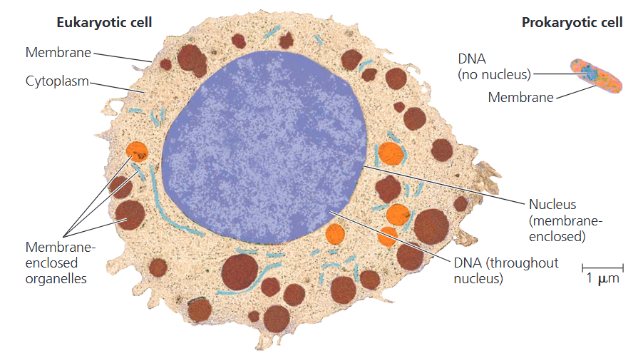
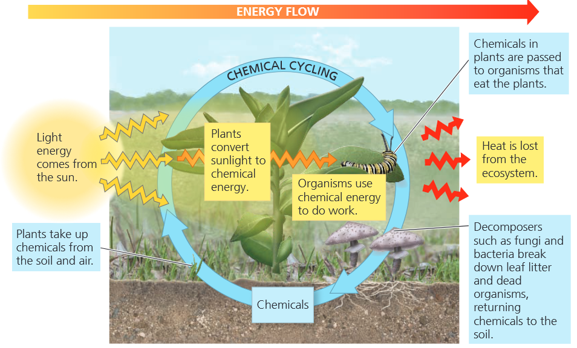
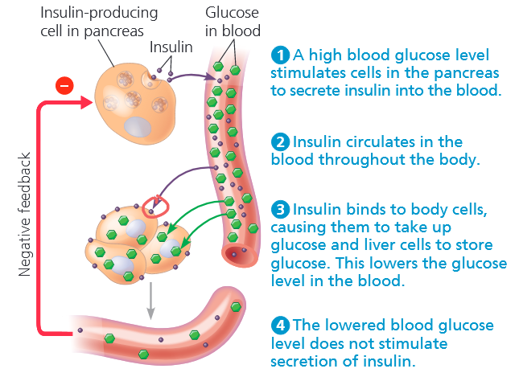
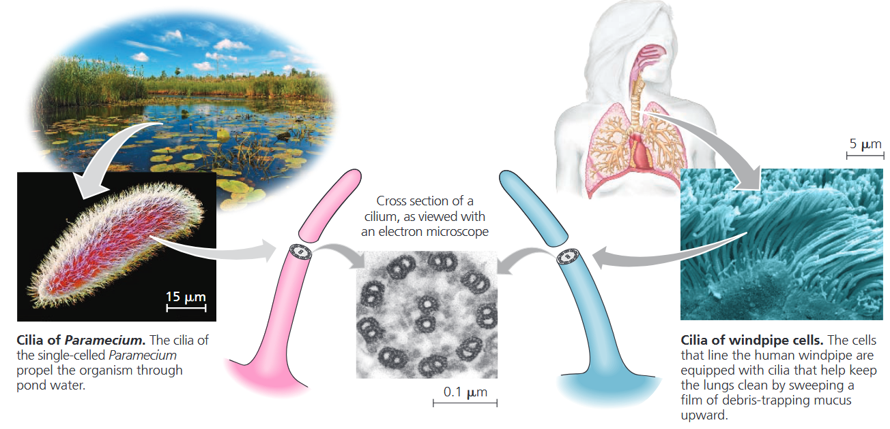
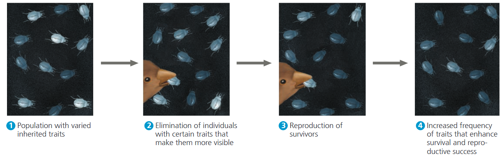

### Concept 1.1 The study of life reveals unifying themes
我们通过生物的行为来识别它们，例如生物的演变，繁殖，对环境的响应等。<b>生物学</b>，即对生命进行的科学研究，是一门范围极其广阔的学科，而且每天都有令人振奋的生物学新发现问世。在学习生物学的过程中，可以通过专注于以下五个同一主题来将知识梳理成一个易于理解的体系：
- 组织
- 信息
- 能量和物质
- 相互作用
- 演变
#### Theme: New Properties Emerge at Successive Levels of Biological Organization
还原论 (<i>reductionism</i>) 是一种将复杂的系统还原成更易理解的部分来进行研究的方法，我们通过还原论将生物组织层次分为十个层级：
- 1. 生物圈：<b>生物圈</b>包含着地球上所有的生物以及有生命存在的所有地方：大部分陆地、大部分水域、延伸至数千米高空的大气层，甚至包括远在海床之下的沉积物。
- 2. 生态系统：<b>生态系统</b>由某一特定区域内的所有生物，以及环境中所有与生命发生相互作用的非生物成分组成，例如土壤、水、大气气体和光照。
- 3. 群落 (community): 栖息在特定生态系统中的一系列生物被称为生物<b>群落</b>。
- 4. 种群 (population): 一个<b>种群</b>包括特定范围内独立的互相交配的种族个体。
- 5. 生物体: 独立的生物称为<b>生物体</b>。
- 6. 器官: <b>器官</b>由多个组织组成并且有着特殊功能，是生物体的一部分。
- 7. 组织: 每一个<b>组织</b>都是一组共同协作的细胞，具有特殊的功能。
- 8. 细胞: <b>细胞</b>是生命结构和功能的基本单位，单细胞生物只需要单个细胞就可以完成生命所需的全部功能；多细胞生物的不同细胞之间会进行分工合作。
- 9. 细胞器 (organelle): <b>细胞器</b>是细胞中有着不同功能的组成部分。
- 10. 分子: 层次结构的最后一层停留在<b>分子</b>水平，分子由两个及两个以上的原子组成。
##### *Emergent Properties*
我们从分子水平开始，逐步向上分析，可以看到在每个层级上都会出现前一层级所不具备的新特性。这些<b>涌现特性 (<i>emergent properties</i>)</b> 源于组分的排列与相互作用，随复杂度的提升而产生。例如，光合作用虽能在完整的叶绿体中进行，但如果将叶绿素及其他叶绿体分子简单混合在试管中，光合作用则无法发生。
##### *Structure and Function*
在生命组织层次的每一个层级上，我们都可以看到结构和功能的相关性。例如叶片的平坦结构可以最大化叶绿体吸收阳光的能力。正是由于生命中普遍存在的结构和功能的关联性，使得我们可以通过研究结构来分析其功能。
##### *The Cell: An Organism’s Basic Unit of Structure and Function*
生物体的所有行为都基于细胞活动，并且所有的细胞都共享着特定的特征。例如每个细胞都由膜包裹，这层膜负责调节细胞与周围环境之间的物质进出。

细胞主要分为两类，<b>原核细胞 (<i>prokaryotic</i>)</b> 和<b>真核细胞 (<i>eukaryotic</i>)</b>。真核细胞内包含着由膜封闭的细胞器，而原核细胞内缺少细胞核或膜封闭的细胞器，原核细胞通常比真核细胞小<b>(图 1.4)</b>

#### Theme: Life’s Processes Involve the Expression and Transmission of Genetic Information
细胞中的染色体里面含有以 <b>DNA (<i>deoxyribonucleic acid</i>)</b> 形式存储的遗传物质。
##### *DNA, the Genetic Material*
每个染色体都包含一个特别长的 DNA 分子以及成百上千的<b>基因</b>，每个都是染色体 DNA 的一部分。基因作为遗传的单元，从父辈传给后代。他们将合成细胞内分子所需的信息进行编码，从而实现细胞的功能和特性。

DNA 的分子结构使得其可以存储信息：一个 DNA 分子由两条双螺旋链 (*strand*) 组成。每条链都由四种核苷酸 (<i>nucleotide</i>) 组成，缩写为 A, T, C, G, 这四种核苷酸的排列明确了基因中的信息。

对许多基因来说，核苷酸序列提供了产生蛋白质的蓝图，蛋白质编码基因通过 RNA 来间接控制蛋白质的合成。基因中的核苷酸序列被转译为 mRNA，之后会被翻译成一系列关联的构筑蛋白质的叫做氨基酸的单元。一旦完成，氨基酸链就可以组成一个特定的蛋白质，这整个产生细胞产物的过程称为<b>基因表达</b>。
##### *Genomics: Large-Scale Analysis of DNA Sequences*
生物体继承的全部遗传指令“库”称为它的<b>基因组 (<i>genome</i>)</b>。科学家们并不只研究单个基因，而是一个或多个物种的整个基因的集合，这种研究方式称为<b>基因组学 (<i>genomics</i>)</b>。与之类似，<b>蛋白质组学 (<i>proteome</i>)</b> 就是研究整个蛋白质以及它们的属性。
#### Theme: Life Requires the Transfer and Transformation of Energy and Matter
生命需要能量和物质的传输和转换<b>(图 1.9)</b>。当植物的叶子在光合作用过程中吸收阳光时，叶子内的分子将阳光的能量转化为食物的化学能。然后，食物分子中的化学能从植物和其他光合生物<b>生产者</b>）传递给消费者。<b>消费者</b>是以其他生物体或其遗体为食的生物体。

当生物体使用化学能来做功时，例如肌肉的收缩或细胞分裂，有一些能量会以热能的形式散失。因此能量在生态系统中以一个方向进行*流动*，通常以光能形式进入，以热能形式散失。与之相比，化学物质在生态系统中*循环*流动，被利用后会再次回收利用。
#### Theme: From Molecules to Ecosystems, Interactions Are Important in Biological Systems
##### *Molecules: Interactions Within Organisms*
在生命结构层次的较低层级，构成生物体的各组分 (器官、组织、细胞和分子) 之间的相互作用，对其正常运转至关重要。许多生命过程能够通过一种名为反馈调节的机制实现自我调控。

在<b>反馈调节</b>中，一个过程的输出或者产物回调节过程本身。生命系统中最常见的调节形式是*负反馈*，一种反应会减少初始刺激的循环。

以胰岛素 (<i>insulin</i>) 信号<b>(图 1.10)</b>为例，饭后人体血液中的葡萄糖含量会上升，刺激胰腺 (<i>pancreas</i>) 细胞分泌胰岛素，胰岛素在血液中进行运输，与体内的细胞相结合，使他们开始吸收葡萄糖，并使肝细胞存储葡萄糖，从而降低血糖浓度。降低的血糖浓度会负反馈给胰腺，使其不再分泌胰岛素。

##### *Ecosystems: An Organism’s Interactions with Other Organisms and the Physical Environment*
在生态系统层面，每种生物都会与其他生物相互作用。例如，金合欢树 (<i>acacia tree</i>) 会与根部相关的土壤微生物、栖息其上的昆虫，以及以其叶片和果实为食的动物产生相互作用。生物之间的相互作用包括互利共生，以及一方受益、另一方受害的关系。有时双方都会受到损害。
### Concept 1.2 The Core Theme: Evolution accounts for the unity and diversity of life
对进化的理解，有助于我们弄清楚关于地球生命的一切已知知识。对生物体多样性和统一性的科学解释是<b>进化</b>：这是一种生物演变过程，随着时间推移，物种在适应不同环境的过程中，会逐渐积累与其祖先不同的特征。因此，我们可以用这样的观点来解释两个物种间的差异 (多样性）：在这两个物种从共同祖先分化之后，出现了某些可遗传的变异。而它们之所以拥有共同特征 (统一性），也仅仅是因为二者源自同一个祖先。
#### Classifying the Diversity of Life
多样性是生命的一大特征。生物学家迄今已鉴定并命名了约 180 万个物种。每个物种都有一个双名：第一部分是该物种所属的属 (<i>genus</i>)，第二部分是该属内此物种独有的名称。
##### *The Three Domains of Life*
生物学家们将所有的生物体分为三组称为域，细菌域 (<i>Domain Bacteria</i>)，古菌域 (<i>Domain Archaea</i>) 和真核生物域 (<i>Domain Eukarya</i>)。其中细菌域和古菌域只包含原核生物体，所有的真核生物属于真核生物域。它又可以分成四个界，植物界 (<i>kindom Plantae</i>)，真菌界 (<i>kindom Fungi</i>)，哺乳动物界 (<i>kindom Animalia</i>) 以及原生生物 (<i>protist</i>)。三个界由他们的营养方式来区分，植物通过光合作用自己生产糖和食物分子，真菌吸收溶解在环境里的养分，动物通过食用消化其他的有机体来获取食物。最大且多样的真核生物是原生生物，现在也被分为了多个界。
##### *Unity in the Diversity of Life*
尽管生命多种多样，但不同生命形态之间也存在着显著的统一性。比如不同动物相似的骨骼结构，以及 DNA 通用的遗传语言。事实上，生物体间的相似性在生物层级的各个层面都清晰可见。例如，纤毛 (<i>cilium</i>) 存在于从草履虫到人类等多种多样的真核生物中。即便差异如此巨大
，其细胞结构的许多特征也体现出明显的统一性<b>(图 1.14)</b>。

#### Charles Darwin and the Theory of Natural Selection
1859年11月，查尔斯・达尔文发表了史上最重要、最具影响力的著作之一 ——《物种起源》(*On the Origin of Species by Means of Natural Selection*)，生命的进化观点由此清晰确立。《物种起源》阐述了两个核心观点。第一，随着物种长期适应不同环境，会逐渐积累与其祖先不同的特征，达尔文将这一过程称为后代渐变 (<i>descent with modification</i>)。这一富有洞见的表述概括了生命的统一性与多样性双重属性：统一性源于拥有共同祖先的物种之间的亲缘关系，多样性则来自物种从共同祖先分化后演化出的不同性状。达尔文的第二个核心观点是，自然选择是后代渐变的主要驱动力。

达尔文将这种进化适应的机制称为<b>自然选择</b>，因为自然环境会在种群中天然存在的各种变异性状里，持续“选择”某些性状并使其得以繁衍。<b>图 1.18</b> 中的例子展示了自然选择如何 “筛选” 昆虫种群中可遗传的体色变异。

