### CONCEPT 6.1 Biologists use microscopes and biochemistry to study cells
#### Microscopy
延伸人类感知的仪器发展，推动了细胞的发现与早期研究。显微镜发明于 1590 年，并在 17 世纪持续改良。1665 年，罗伯特・胡克首次在橡树树皮的死细胞中观察到细胞壁；数年后，安东尼・范・列文虎克观测到了活细胞。

文艺复兴时期科学家最初使用的显微镜，以及实验室常用的显微镜，均为<b>光学显微镜 (<i>LM</i>)</b>。其原理是：可见光穿透标本，再穿过玻璃透镜。透镜通过折射光线，放大标本影像，将其投射至人眼或成像设备中。

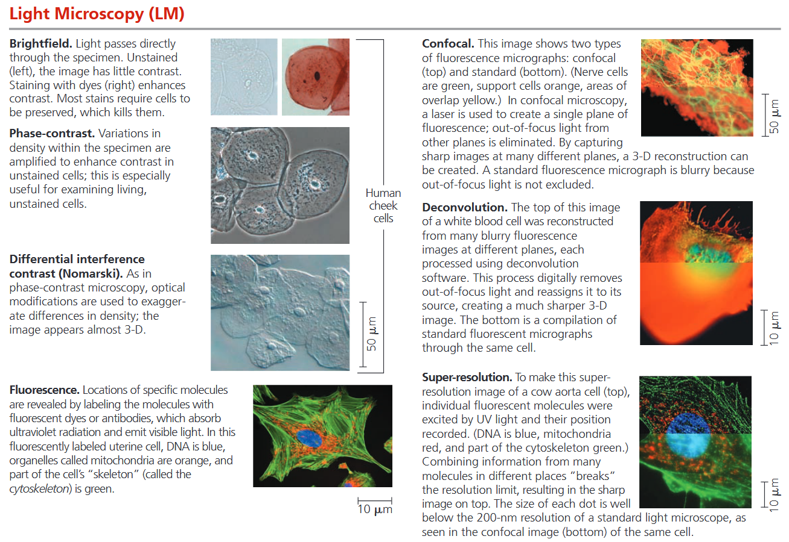

显微技术有三项核心指标：放大倍数、分辨率、对比度。**放大倍数**指物象大小与物体实际尺寸的比值。**分辨率**代表成像的清晰程度，定义为两点能被区分开的最小间距。**对比度**指图像明暗区域的亮度差异。染色、细胞组分特异性标记等手段，均可提升对比度，使结构更易观测。

20 世纪 50 年代，电子显微镜正式应用于生物学研究。<b>电子显微镜 (<i>EM</i>) </b>不再聚焦光线，而是利用电子束穿透标本或扫射标本表面。

分辨率与成像所用光波的波长成反比，电子束的波长远短于可见光。现代电子显微镜理论分辨率可达约 0.002 纳米，实际观测分辨极限约 2 纳米。即便如此，其分辨能力仍是普通光学显微镜的百倍。

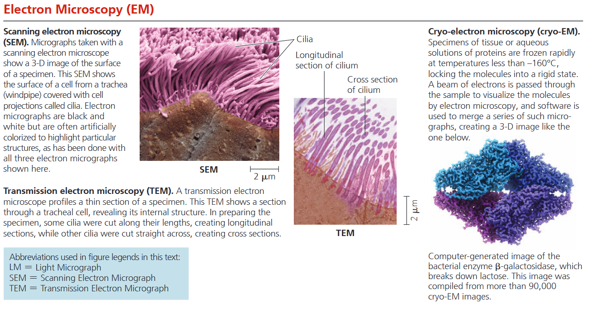

<b>扫描电子显微镜 (<i>SEM</i>) </b>尤其适用于观察标本的表面形貌结构。电子束扫描通常镀有薄金膜的样品表面，激发产生二次电子。检测器捕捉二次电子信号，将其转化为电信号并传输至显示屏，最终生成具有立体视觉效果的标本表面影像。

<b>透射电子显微镜 (<i>TEM</i>) </b>用于观察细胞内部结构。它将电子束穿透极薄的标本切片，原理类似光学显微镜用光透过载玻片上的样品。透射电镜标本需经重金属原子染色，重金属会附着在特定细胞结构上，使不同区域电子密度产生差异。致密区域会更多散射电子，导致透过的电子变少；最终影像依据穿透标本的电子分布形成。扫描电镜与透射电镜均不使用玻璃透镜，而是以电磁透镜偏转电子轨迹，将成像聚焦于显示器以供观测。

<b>新型冷冻电镜 (<i>cryo-EM</i>) </b>可将标本超低温保存，无需传统固定剂，能够还原生物结构在原生细胞环境中的真实状态。该技术常与 X 射线晶体学互补，解析蛋白质复合物、核糖体等亚细胞结构，甚至可观测单个蛋白质。
#### Cell Fractionation
<b>细胞分馏 (<i>Cell Fractionation</i>) </b>是研究细胞结构与功能的重要技术<b>(图 6.4)</b>，该方法可破碎细胞，并将各类细胞器与亚细胞结构逐一分离。实验核心仪器为离心机 (<i>centrifuge</i>)：将破碎细胞的混合液置于离心管中，以逐级递增的转速离心，该操作称为**差速离心**。

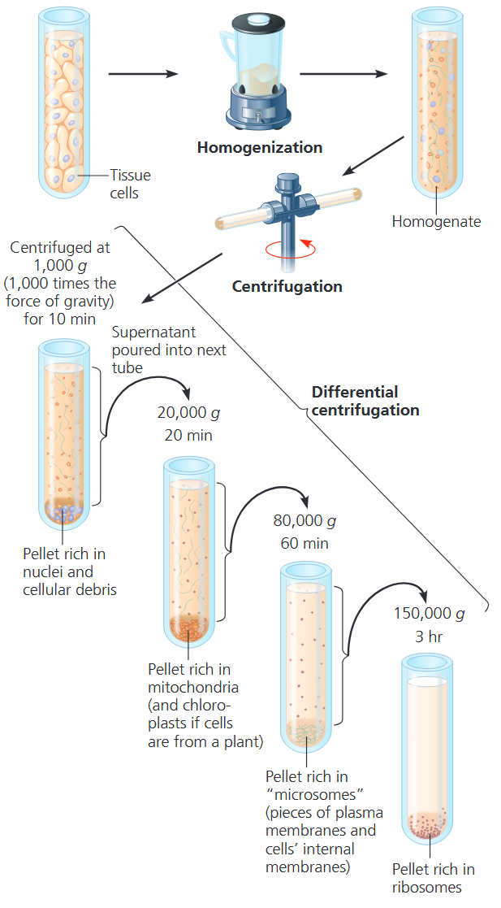

不同转速产生的离心力，会使特定大小的细胞组分沉降至管底，形成沉淀团 (<i>pellet</i>)。低速离心时，体积较大的结构率先沉降；提高转速后，更小的细胞组分随之沉淀析出。
### CONCEPT 6.2 Eukaryotic cells have internal membranes that compartmentalize their functions
细胞——每个生命体基本的结构和功能单位——可以分为两种：原核和真核。细菌域与古菌域的生物均由原核细胞构成。真核域生物，包括原生生物、真菌、动物和植物，皆为真核细胞。
#### Comparing Prokaryotic and Eukaryotic Cells
所有细胞都具备共同的基础特征：均被一层选择性屏障——质膜所包裹；细胞内部充满半流体、胶状的<b>细胞质基质 (<i>cytosol</i>)</b>，各类亚细胞结构悬浮其中；所有细胞都含有携带 DNA 遗传基因的**染色体**；且普遍拥有核糖体，这类微小复合体可依据基因指令合成蛋白质。

原核和真核细胞的一个主要区别是 DNA 的位置。在<b>真核细胞</b>中，大部分的 DNA 位于一个叫做细胞核 (<i>nucleus</i>) 的细胞器中，由双层膜所包裹。在<b>原核细胞</b>中，DNA 集中于无膜结构包围的区域，该区域称为<b>拟核 (<i>nucleoid</i>)</b><b>(图 6.5)</b>。

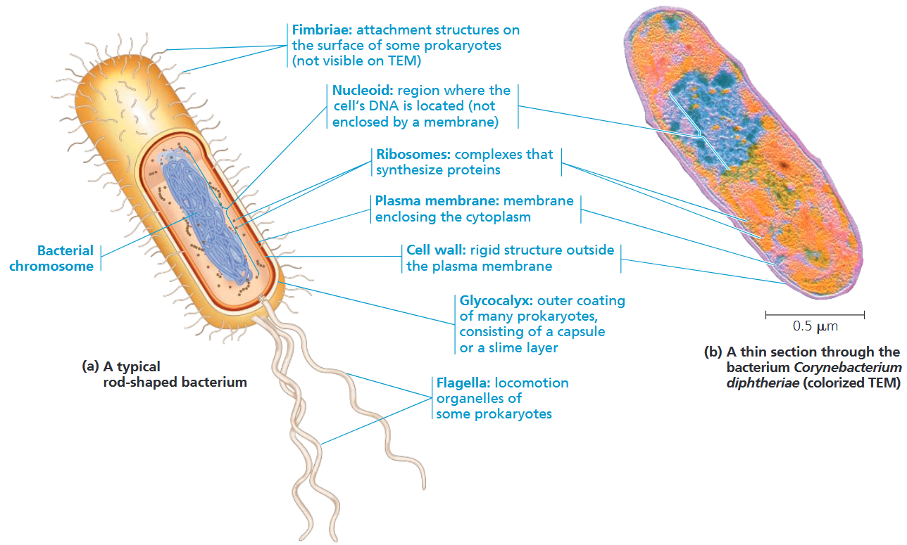

两类细胞的内部区域统称为<b>细胞质 (<i>cytoplasm</i>)</b>；在真核细胞中，该概念特指细胞核与细胞膜之间的区域。真核细胞的细胞质基质中，悬浮着多种形态与功能高度特化的细胞器。这类具膜结构几乎不存在于绝大多数原核细胞中，这也是原核与真核细胞的重要区别。

真核细胞普遍远大于原核细胞。细胞尺寸是与其功能密切相关的结构性特征，细胞代谢的生理需求限制了细胞的大小范围。代谢需求同时划定了单细胞体积的理论上限。<b>细胞膜 (<i>plasma membrane</i>) </b>作为选择性屏障，负责氧气、营养物质与代谢废物的跨膜运输，以维持整体生命活动<b>(图 6.6)</b>。单位膜面积的物质运输效率有限，因此表面积与体积比至关重要。

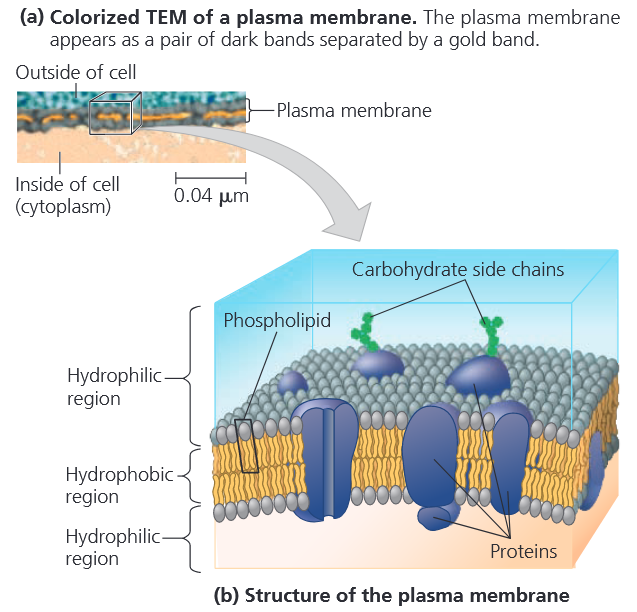

细胞体积增大时，表面积的增长速率远低于体积：表面积与线性尺寸的平方成正比，体积则与线性尺寸的立方成正比。因此，体积越小的细胞，表面积与体积之比越大。
### CONCEPT 6.3 The eukaryotic cell’s genetic instructions are housed in the nucleus and carried out by the ribosomes
#### The Nucleus: Information Central
<b>细胞核</b>中包含真核细胞中大部分的基因 (还有一些在叶绿体和线粒体中)。细胞核被<b>核膜 (<i>nuclear envelope</i>)</b>包裹<b>(图 6.9)</b>，将核内与胞质隔开。

核被膜为**双层**膜结构。两层膜均为结合蛋白质的磷脂双分子层，中间间隔 20 至 40 nm。核被膜上遍布直径约 100 nm 的核孔。核孔边缘处，核被膜的内膜与外膜相互连通。

每个核孔内侧都附有精密的核孔复合体 (<i>pore complex</i>)，可调控蛋白质、RNA 及大分子复合物的进出，在物质转运中发挥关键作用。除核孔区域外，核被膜内侧覆有<b>核纤层 (<i>nuclear lamina</i>)</b>，由网状蛋白纤维（动物细胞中为中间纤维）构成，通过机械支撑维持细胞核形态。另有证据表明细胞核内部存在核基质 (<i>nuclear matrix</i>)，是贯穿核内的蛋白纤维骨架。核纤层与核基质共同规整遗传物质排布，保障其高效行使功能。

细胞核内的 DNA 组织成独立的<b>染色体 (<i>chromosome</i>)</b>，负责承载遗传信息。每条染色体包含一条长线状 DNA 与多种结合蛋白，其中包括碱性小分子组蛋白 (<i>histone</i>)。部分蛋白协助 DNA 缠绕折叠，压缩长度，使其能够容纳于细胞核内。

DNA 与蛋白质共同构成的复合物质称为<b>染色质 (<i>chromatin</i>)</b>。细胞不分裂时，染色质在显微视野中呈弥散状，即便存在独立染色体，也无法彼此区分。细胞即将分裂时，染色体进一步盘绕、高度浓缩，结构加粗，可在显微镜下被清晰分辨。

非分裂期的细胞核内最显著的结构是<b>核仁 (<i>nucleolus</i>)</b>。在电镜下，核仁由致密的颗粒与纤维构成，毗邻部分染色质。

核仁可依据 DNA 中的基因序列合成 rRNA；同时，从细胞质转运入核的蛋白质会在此处与 rRNA 结合，组装为核糖体的大小亚基。这些亚基经由核孔进入细胞质，最终结合形成完整核糖体。

细胞核内可存在一至多个核仁，数量因物种及细胞周期阶段而异。此外，核仁还参与调控细胞分裂与细胞寿命。

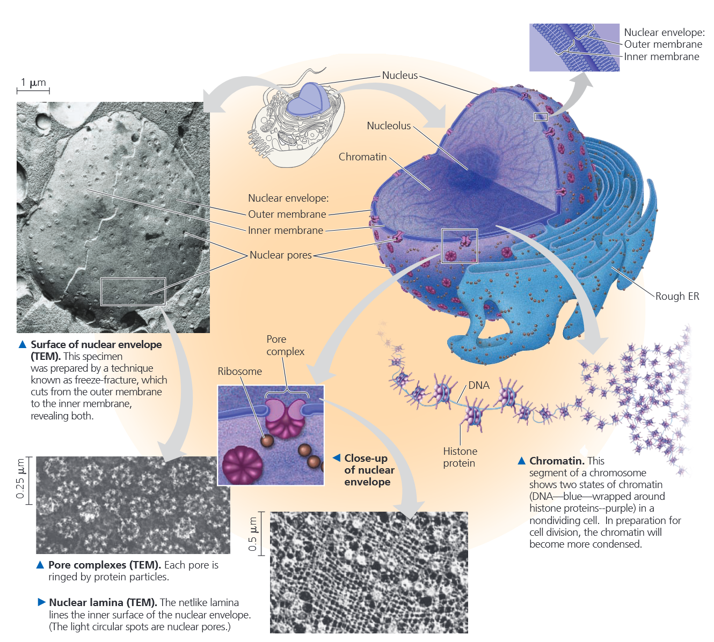

#### Ribosomes: Protein Factories
<b>核糖体 (<i>ribosome</i>) </b>是由 rRNA 和蛋白质组装成的复合体，负责蛋白质的合成<b>(图 6.10)</b>。

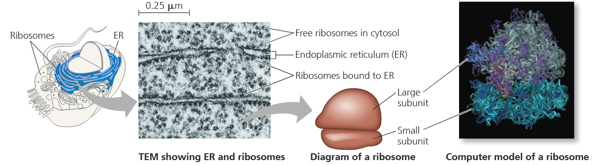

核糖体在细胞质的两个区域合成蛋白质：**游离核糖体**悬浮于细胞质基质中，**附着核糖体**结合在内质网或核被膜表面。二者结构完全相同，且可相互转化。

游离核糖体合成的蛋白质大多在细胞质基质内发挥作用，例如参与糖类初步分解的酶。附着核糖体主要合成三类蛋白：膜整合蛋白、溶酶体等细胞器的驻留蛋白，以及分泌蛋白。以分泌功能为主的细胞，如分泌消化酶的胰腺细胞，通常含有大量附着核糖体。
### CONCEPT 6.4 The endomembrane system regulates protein traffic and performs metabolic functions
真核细胞中许多不同的具膜细胞器都是<b>内膜系统 (<i>endomembrane system</i>) </b>的一部分，包含核被膜、内质网、高尔基体、溶酶体、各类囊泡、液泡及细胞膜。

该系统承担多项生命活动：蛋白质合成、蛋白转运（入膜、入细胞器或分泌至胞外）、脂质代谢与转运、毒素解毒。内膜系统的膜结构之间，或直接相连，或通过<b>囊泡 (<i>vesicle</i>) </b>完成膜片段的转移。

各组分的膜在结构与功能上并不完全相同；膜的厚度、分子组成及生化反应类型并非固定，会在生命周期中发生多次修饰与改变。
#### The Endoplasmic Reticulum: Biosynthetic Factory
<b>内质网 (<i>ER</i>) </b>是庞大的膜结构网络，在多数真核细胞中，其膜面积占细胞总膜面积的一半以上。

内质网由膜性管道与扁平囊泡——潴泡 (<i>cisternae</i>) 交织而成。内质网膜将内部腔室，即内质网腔 (<i>ER lumen</i>)，与细胞质基质分隔开。内质网膜与核膜相互连通，因此核膜双层膜之间的间隙与内质网腔彼此贯通<b>(图 6.11)</b>。

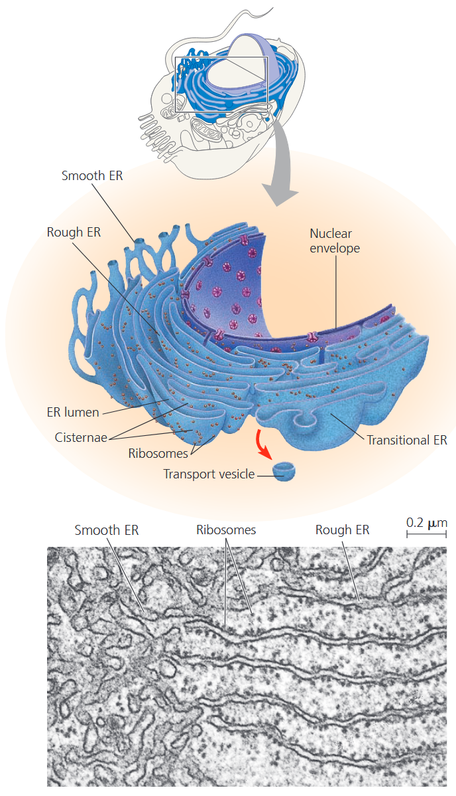

内质网分为结构与功能截然不同但相互连通的两个区域：<b>光面内质网</b>与<b>粗面内质网</b>。光面内质网因表面无核糖体而得名；粗面内质网膜外密布核糖体，电镜下外观粗糙。核被膜外层与粗面内质网相连，其胞质侧同样附着核糖体。
##### *Functions of Smooth ER*
光面内质网参与多种代谢过程，功能随细胞类型而异。光面内质网所含酶类可合成油脂、类固醇及膜磷脂等脂质。动物细胞中，光面内质网合成类固醇，涵盖脊椎动物性激素与肾上腺皮质激素。睾丸、卵巢等合成分泌类固醇激素的细胞，富含光面内质网，结构与功能高度适配。

光面内质网的另一类酶可执行解毒作用，该过程在肝细胞中尤为突出。解毒机制通常为向药物分子添加羟基，增强水溶性，便于代谢排出。

光面内质网还具备钙离子储存功能。以肌细胞为例，光面内质网膜可将细胞质基质中的钙离子泵入内质网腔储存。当神经冲动刺激肌细胞时，钙离子顺浓度梯度快速释放至细胞质基质，触发肌肉收缩。
##### *Functions of Rough ER*
许多细胞分泌的蛋白质由附着于粗面内质网的核糖体合成。例如，胰腺细胞在内质网中合成胰岛素，并将其分泌至血液。

附着核糖体合成多肽链时，肽链会穿过内质网膜上蛋白复合体形成的通道，进入内质网腔。新生多肽在腔内折叠为具有生物活性的空间结构。多数分泌蛋白属于<b>糖蛋白 (<i>glycoprotein</i>)</b>，即共价结合糖类的蛋白质；糖链由内质网膜上的酶催化，在腔内连接至蛋白质上。

分泌蛋白合成后，内质网膜将其与游离核糖体合成的胞质蛋白分隔开。分泌蛋白会被包裹在囊泡中，从过渡内质网出芽脱离内质网。这类在胞内转运物质的囊泡，称为<b>转运囊泡 (<i>transport vesicle</i>)</b>。

粗面内质网除合成分泌蛋白外，还是细胞的膜合成工厂，可通过整合膜蛋白与磷脂实现自身膜的生长。膜蛋白类多肽在核糖体合成时，会直接嵌入内质网膜，并借助疏水区段固定。

与光面内质网相同，粗面内质网也能合成膜磷脂，其膜上酶可利用胞质前体物质组装磷脂分子。内质网膜不断扩增，并以转运囊泡的形式，将部分膜结构转运至内膜系统的其他细胞器。
#### The Golgi Apparatus: Shipping and Receiving Center
在离开 ER 后，许多转运囊泡会来到<b>高尔基体 (<i>Golgi apparatus</i>)</b>。高尔基体如同细胞的加工仓储中心，负责接收、分拣、运输，还可完成部分加工合成。内质网合成的蛋白质等物质在此修饰、储存，再被输送至指定位置。因此，分泌功能旺盛的细胞，高尔基体尤为发达。

高尔基体由一系列堆叠排列的扁平膜囊——潴泡组成，形似叠放的面饼<b>(图 6.12)</b>。单个细胞可含有多个甚至上百组潴泡堆叠结构。每层潴泡的膜都将其内部腔室与细胞质基质分隔。高尔基体周围聚集大量囊泡，负责在高尔基体各区间及其他细胞器之间转运物质。

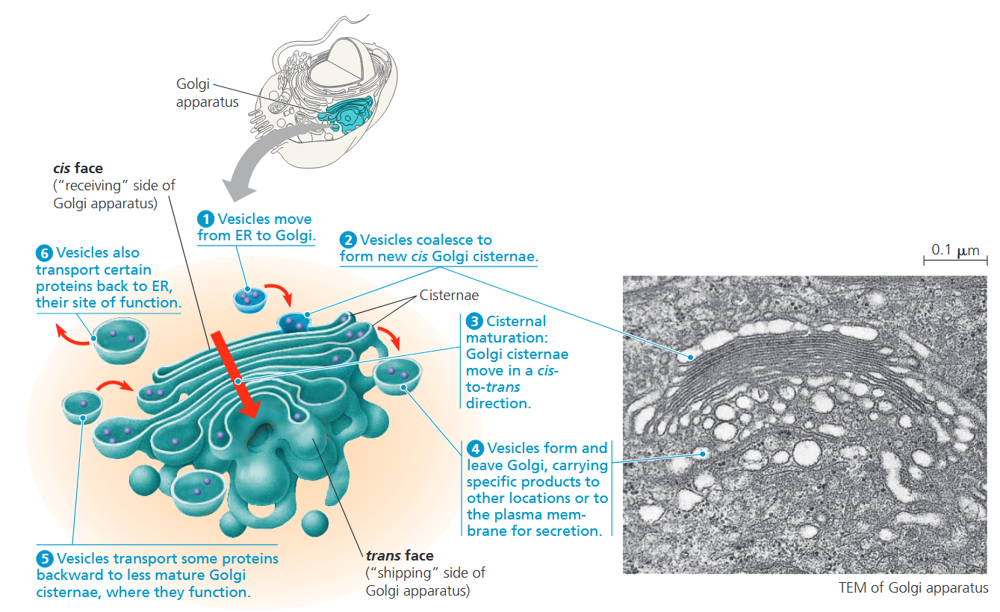

高尔基体堆叠结构具有明显极性，两侧潴泡膜的厚度与分子组成存在差异，分为顺面与反面，分别承担接收与转运功能。

顺面多靠近内质网，接收来自内质网的转运囊泡；囊泡与顺面膜融合，将膜结构及内含物送入高尔基体。反面位于另一侧，可出芽形成囊泡，将加工完成的物质运送至胞内其他结构或分泌至胞外。

内质网合成的产物在从高尔基体顺面转运至反面的过程中，通常会被进一步修饰。例如，内质网形成的糖蛋白，其糖链会先在内质网初步加工，再于高尔基体中继续改造。高尔基体可切除部分单糖并替换其他糖类，形成多样的糖链结构。膜磷脂同样可在高尔基体内发生修饰与改造。

高尔基体除修饰加工外，还能合成部分大分子。细胞分泌的多种多糖由高尔基体合成。例如，植物细胞的果胶 (<i>pectin</i>) 与非纤维素类多糖在高尔基体内生成，与纤维素共同构成细胞壁。

同分泌蛋白一致，高尔基体合成的非蛋白类分泌物，从反面以转运囊泡形式运出；囊泡最终与细胞膜融合，释放内容物，囊泡膜整合入细胞膜，增加膜表面积。

高尔基体反面出芽形成囊泡释放产物前，会对物质进行分拣，定向输送至细胞不同部位。高尔基体可给产物添加磷酸基团等分子识别标签，辅助精准分选。从高尔基体脱落的转运囊泡，膜表面带有特异识别分子，可结合特定细胞器或细胞膜上的锚定位点，实现靶向运输。
#### Lysosomes: Digestive Compartments
<b>溶酶体 (<i>lysosome</i>) </b>是内含水解酶的膜性囊泡，可水解分解生物大分子。溶酶体酶在酸性环境中活性最佳。溶酶体破损渗漏时，因细胞质基质呈近中性，外泄酶活性大幅降低；但若大量溶酶体破裂，会引发细胞自溶，造成细胞损毁。

水解酶与溶酶体膜均由粗面内质网合成，随后转运至高尔基体进一步加工。部分溶酶体由高尔基体反面出芽形成。

溶酶体内膜蛋白与水解酶可避免被降解：其特殊空间构象能保护敏感化学键，不被水解酶分解。

溶酶体可在多种情况下执行细胞内消化。变形虫等单细胞原生生物通过<b>吞噬作用 (<i>phagocytosis</i>) </b>包裹食物颗粒或微小生物。由此形成的食物泡会与溶酶体融合，水解酶将内容物分解<b>(图 6.13a)</b>。消化产生的单糖、氨基酸等小分子进入细胞质基质，为细胞供能。

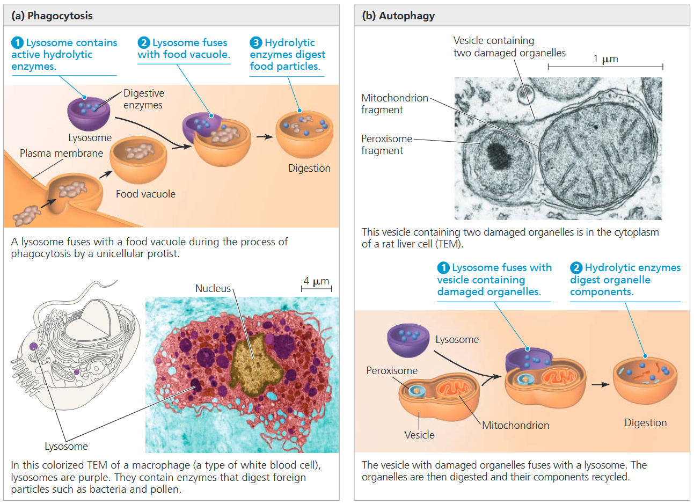

溶酶体借助水解酶回收细胞自身有机物，该过程称为自噬 (<i>autophagy</i>)。自噬发生时，受损细胞器或部分细胞质会被双层膜包裹，随后溶酶体与该囊泡外膜融合<b>(图 6.13b)</b>。溶酶体酶降解内膜及内部组分，分解产生的小分子有机物释放至细胞质基质循环利用。
#### Vacuoles: Diverse Maintenance Compartments
<b>液泡 (<i>vacuole</i>) </b>是源自内质网与高尔基体的大型囊泡，属于细胞内膜系统的重要组成部分。液泡膜与其他细胞膜一样，对溶质具有选择透过性，因此液泡内的液体成分与细胞质基质存在差异。

液泡在不同细胞中功能各异。上文已描述过由吞噬作用形成的<b>食物液泡</b>。淡水单细胞原生生物具有<b>伸缩液泡</b>，可排出胞内多余水分，维持胞内溶质浓度稳定。

成熟植物细胞普遍含有大型<b>中央液泡</b><b>(图 6.14)</b>，由多个小型液泡融合形成。其内部液体为细胞液，是 $\text{K}^+$、$\text{Cl}^-$ 等无机离子的主要储存场所。中央液泡主导植物细胞生长：通过吸水膨胀使细胞体积增大，无需大量合成细胞质。细胞质基质仅紧贴细胞膜形成薄层，即便细胞体积庞大，仍能维持充足的膜表面积与胞质体积比，保障物质交换效率。

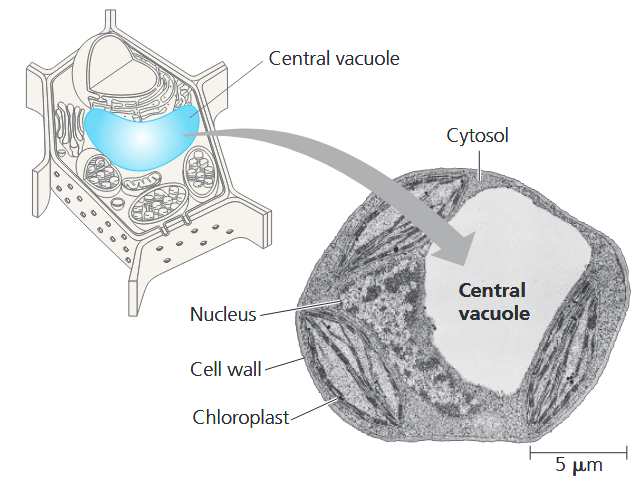

#### The Endomembrane System: *A Review*

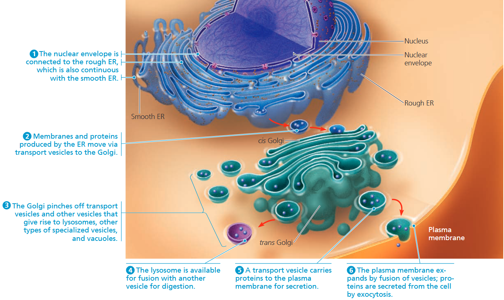

### CONCEPT 6.5 Mitochondria and chloroplasts change energy from one form to another
生物体从环境中转移它们所需要的能量。在真核细胞中，负责能量转换的细胞器是线粒体和叶绿体。<b>线粒体 (<i>mitochondria</i>) </b>是细胞呼吸的场所，细胞呼吸是一种消耗氧气，使用糖，脂肪和其他燃料来合成 ATP 的代谢过程。<b>叶绿体 (<i>chloroplast</i>) </b>是光合作用的场所，将太阳能转换成化学能，驱动有机物的合成。
#### The Evolutionary Origins of Mitochondria and Chloroplasts
线粒体和叶绿体与细菌存在诸多相似特征，由此催生了<b>内共生学说 (<i>endosymbiont theory</i>)</b><b>(图 6.16)</b>。该学说认为：早期真核祖先宿主细胞吞噬了一种耗氧、无光合作用能力的原核生物。被吞噬的细胞与宿主形成共生关系，成为内共生体。漫长演化中，二者融合为一体，被吞噬原核生物最终演化为线粒体。此后，部分含线粒体的真核细胞进一步吞噬光合原核生物，逐步演化出拥有叶绿体的光合真核细胞。

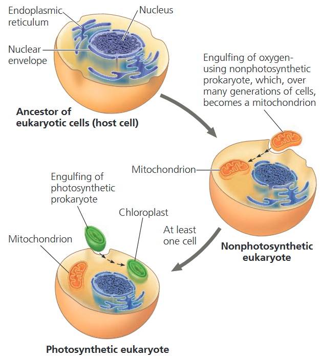

#### Mitochondria: Chemical Energy Conversion
线粒体几乎存在于所有真核细胞中，包括植物、动物、真菌及多数原生生物细胞。部分细胞仅有一个大型线粒体，但多数细胞含有数百乃至数千个线粒体，其数量与细胞代谢强度正相关。

线粒体的双层膜均为磷脂双分子层，并镶嵌有特异性蛋白质。外膜平滑，内膜高度折叠形成<b>嵴 (<i>cristae</i>)</b><b>(图 6.17a)</b>。内膜将线粒体分隔为两个腔室：内外膜之间的膜间隙，以及内膜包裹的<b>线粒体基质</b>。基质内含多种呼吸酶、线粒体 DNA 与核糖体，可催化细胞呼吸的部分反应。参与呼吸作用的其他蛋白镶嵌于内膜。嵴极大扩增了内膜表面积，提升有氧呼吸效率，体现结构与功能的适应性。

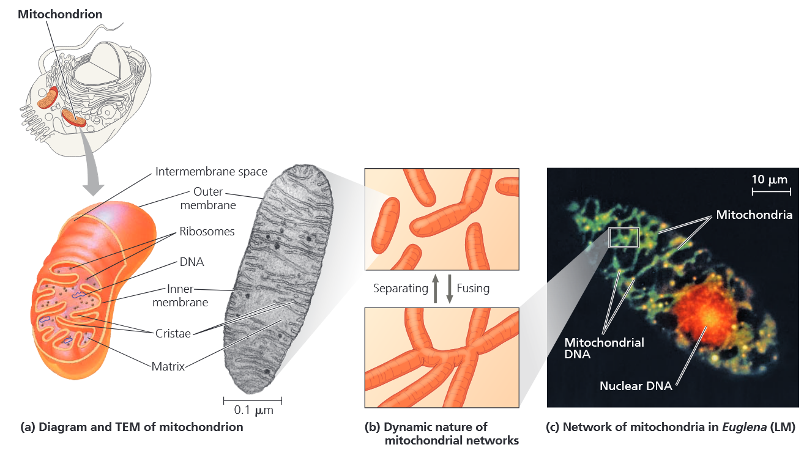

线粒体长度通常为 1–10 微米。活细胞延时成像显示，线粒体会移动、变形、融合或分裂，并非示意图与电镜照片中静止的结构。活细胞内的线粒体交织成分支管状网络，处于动态变化中<b>(图 6.17b, c)</b>。
#### Chloroplasts: Capture of Light Energy
叶绿体含有绿色色素叶绿素，以及参与光合产糖的酶与各类功能分子。这类透镜状细胞器长约 3–6 微米，分布于植物叶片及其他绿色器官、藻类细胞中<b>(图 6.18)</b>。

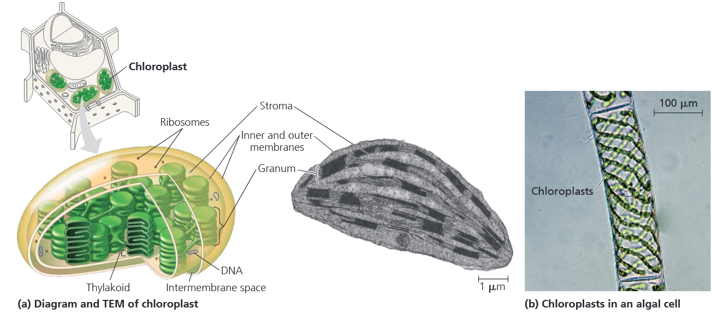

叶绿体由双层膜构成包膜，与细胞质基质隔开，两层膜之间为狭窄的膜间隙。叶绿体内存在由扁平囊状结构组成的膜系统，即<b>类囊体 (<i>thylakoid</i>)</b>。类囊体常堆叠形成<b>基粒 (<i>granum</i>)</b>。类囊体外侧的液态基质为<b>叶绿体基质 (<i>stroma</i>)</b>，内含叶绿体 DNA、核糖体及多种酶。

叶绿体膜结构将其内部划分为三个区室：膜间隙、叶绿体基质与类囊体腔。这种分区结构为光合作用中光能向化学能的转化提供了结构基础。

与线粒体类似，显微图像及模式图中叶绿体的静态形态，无法反映其在活细胞内的动态特征。叶绿体形态可变，可自主生长并通过分裂增殖。它能够自主移动，与线粒体等细胞器一同沿细胞骨架轨道在胞内转运。

叶绿体属于<b>质体 (<i>plastid</i>) </b>家族的特化细胞器。质体的一种——淀粉体 (<i>amyloplast</i>) 无色，主要在根、块茎中储存淀粉；另一种色质体 (<i>chromoplast</i>) 富含色素，赋予果实、花朵橙黄等色彩。
#### Peroxisomes: Oxidation
<b>过氧化物酶体 (<i>peroxisome</i>) </b>是由单层膜包裹的特化代谢区室<b>(图 6.19)</b>。其内含多种酶，可从底物中脱去氢原子并转移至氧气，生成副产物过氧化氢，该细胞器也因此得名。

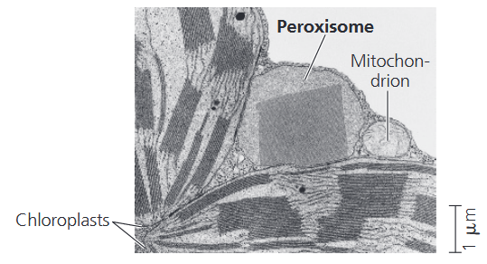

部分过氧化物酶体氧化分解脂肪酸，将其降解为小分子，输送至线粒体供细胞呼吸利用。肝脏中的过氧化物酶体可转移有害物质的氢原子，完成酒精等毒素的解毒。过氧化氢具有毒性，但过氧化物酶体同时含有分解它的酶，可将其转化为水。这种区室化隔离，避免有毒代谢中间产物损伤胞内其他结构，充分体现细胞分区结构对生理功能的关键作用。

植物种子的储能组织中存在特化的过氧化物酶体——乙醛酸循环体 (<i>glyoxysome</i>)。该细胞器所含酶可启动脂肪酸向糖类的转化，为破土幼苗提供碳源与能量，直至其通过光合作用自主合成有机物。
### CONCEPT 6.6 The cytoskeleton is a network of fibers that organizes structures and activities in the cell
电子显微镜发展早期，生物学家曾认为真核细胞器在细胞质基质中自由漂浮。随着显微技术进步，<b>细胞骨架 (<i>cytoskeleton</i>) </b>被发现，它是遍布细胞质的纤维网络。细菌也拥有同源蛋白构成的骨架纤维。真核细胞骨架承担细胞结构排布与生命活动调控的核心作用。
#### Roles of the Cytoskeleton: Support and Motility
细胞骨架最直观的功能是为细胞提供机械支撑并维持形态，这对无细胞壁的动物细胞尤为关键。细胞骨架整体兼具韧性与弹性，得益于其特殊结构：如同穹顶帐篷，依靠不同组分间的作用力平衡维持稳定。它可锚定多种细胞器与胞质酶，固定胞内结构位置。不同于动物骨骼，细胞骨架高度动态，可在局部快速解聚、重新组装，以此改变细胞形态。

部分细胞运动同样依赖细胞骨架。**细胞运动**既包括细胞整体位移，也涵盖胞内结构的局部活动，通常需要细胞骨架与<b>马达蛋白</b>协同作用。

有许多协同作用的例子：细胞骨架、马达蛋白与细胞膜组分配合，可驱动细胞沿胞外纤维迁移。在细胞内，囊泡与细胞器能借助马达蛋白，沿细胞骨架轨道定向运输。例如，含神经递质的囊泡借此转运至轴突末梢，释放信号分子以完成神经传导<b>(图 6.21)</b>。细胞骨架还可牵拉细胞膜内陷，形成食物泡或吞噬囊泡。

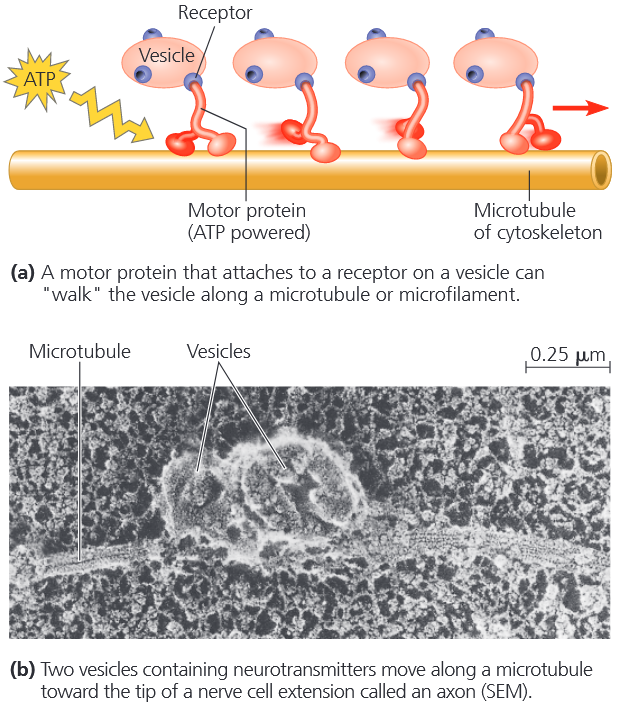
#### Components of the Cytoskeleton
组成细胞骨架的纤维主要分为三类：微管直径最大；微丝最细；中间纤维的直径介于两者之间。

##### *Microtubules*
所有真核细胞均含有<b>微管 (<i>microtubule</i>)</b>。它是由球状微管蛋白 (<i>tubulin</i>) 组装而成的中空管状结构。微管蛋白为二聚体，由$\alpha-$微管蛋白与$\beta-$微管蛋白两种多肽亚基构成。微管通过结合微管蛋白二聚体实现延长，也可解聚拆解，释放的亚基可在胞内别处重新组装。

由于亚基排列具有极性，微管两端结构不对称。其中正极的亚基结合与解离速率远高于另一端，可快速伸长或缩短，以此动态响应细胞活动。

微管可塑造并支撑细胞形态，同时作为轨道，供结合马达蛋白的细胞器定向移动。微管引导囊泡从内质网运输至高尔基体，以及从高尔基体转运至细胞膜。此外，微管参与细胞分裂过程中的染色体分离。

**Centrosomes and Centrioles** 动物细胞中，微管从<b>中心体 (<i>centrosome</i>) </b>向外延伸，该结构多位于细胞核附近。微管如同抗压支架，维持细胞骨架力学稳定。中心体内含一对<b>中心粒 (<i>centriole</i>)</b>，每个中心粒由 9 组三联体微管环状排列构成<b>(图 6.22)</b>。含中心粒的中心体可调控动物细胞微管组装，但多数真核细胞无此结构，依靠其他方式组织微管。

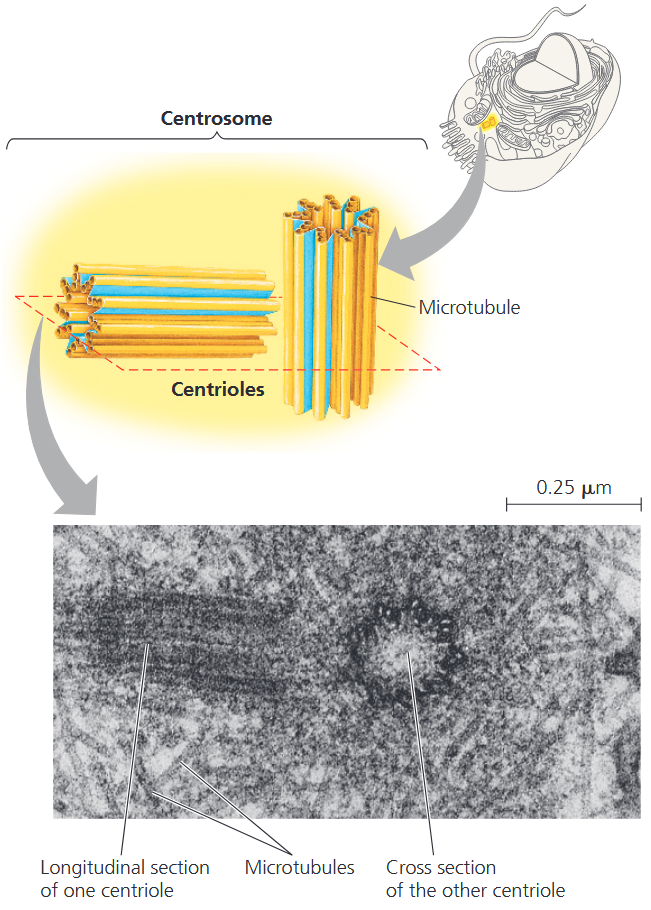

**Cilia and Flagella** 部分真核细胞具有<b>鞭毛 (<i>flagella</i>) </b>与<b>纤毛 (<i>cilia</i>) </b>，二者为含微管的细胞突起，其微管的特殊排列方式使其能够摆动。细菌鞭毛结构与之完全不同。

许多单细胞原生生物依靠纤毛或鞭毛在水中游动；动物、藻类及部分植物的精子具有鞭毛。在紧密连接的上皮组织中，纤毛可推动组织表面液体流动。例如，气管纤毛清扫含异物的黏液；输卵管纤毛协助卵细胞向子宫移动。

运动型纤毛通常大量分布于细胞表面。鞭毛一般每个细胞仅有一条或少数几条，且长度更长。二者摆动方式不同：鞭毛呈鱼尾巴般的波浪式起伏运动；纤毛具有交替的动力冲程和恢复冲程，像划桨一样<b>(图 6.23)</b>。

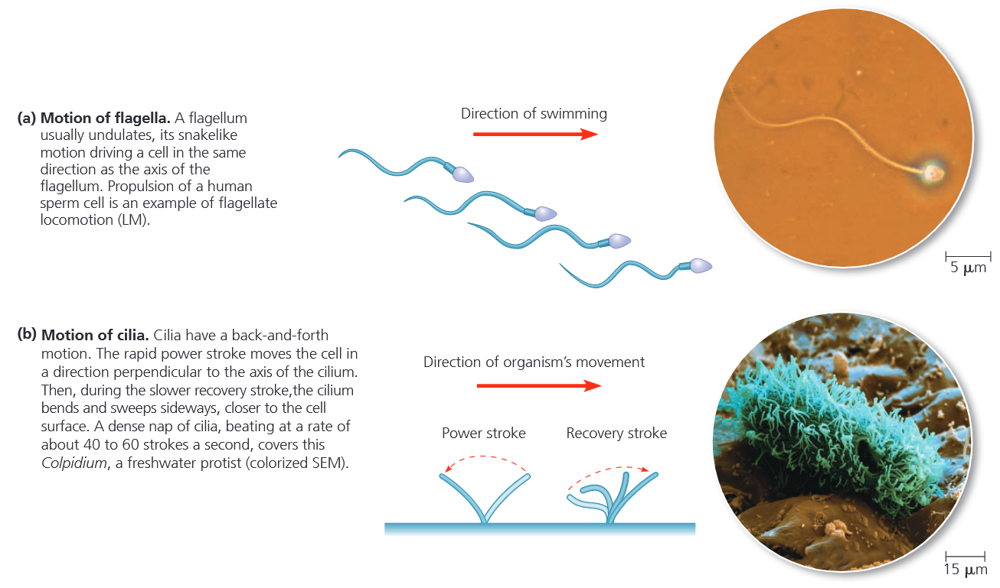

尽管长度，数量和摆动规律都不同，鞭毛和运动型纤毛有着共同的结构。二者均为细胞膜延伸包裹的微管束结构<b>(图 6.24a)</b>，内部呈 9+2 排布：9 组二联微管环绕外围，中央含有 2 根单独微管<b>(图 6.24b)</b>，该模式普遍存在于真核生物运动纤毛与鞭毛中 (非运动的初级纤毛为 9+0 结构，无中央微管对)。

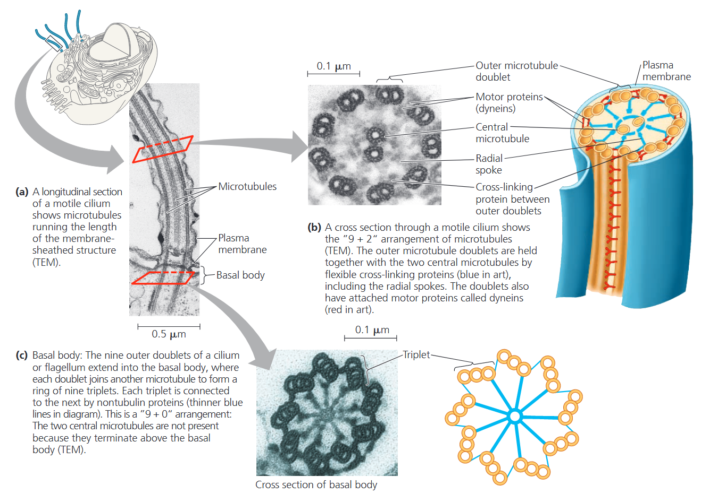

纤毛和鞭毛的微管结构通过<b>基体 (<i>basal body</i>) </b>锚定在细胞内。基体结构与中心粒高度相似，呈 9+0 三联微管排列<b>(图 6.24c)</b>。事实上，包括人类在内的多数动物中，受精精子鞭毛的基体进入卵细胞后，会转变为中心粒。

微管组装借助<b>动力蛋白 (<i>dynein</i>) </b>实现鞭毛与纤毛的弯曲运动。外周每组二联微管上均附着大量动力蛋白，该马达蛋白以 ATP 供能，依靠两个 “足部” 沿相邻微管二联束分步滑动：一足保持附着，另一足解离、前移并重新结合。

柔性交联蛋白将外周二联微管与中央微管相互固定，限制微管自由滑动；动力蛋白的定向分步运动被协同调控，仅单侧依次发力。若缺乏交联束缚，微管会相互错位滑动；正因交联结构的牵拉约束，动力蛋白的作用力最终转化为微管整体弯折，进而带动纤毛、鞭毛产生摆动。
##### *Microfilaments (Actin Filaments)*
<b>微丝 (<i>microfilament</i>) </b>为纤细的实心纤维，又称肌动蛋白丝，由球状肌动蛋白 (<i>actin</i>) 聚合而成，呈两条肌动蛋白亚基缠绕的双链结构。微丝除线性排布外，可借助结合蛋白形成分支，构建网状结构。与微管相同，微丝普遍存在于所有真核细胞中。

与承担抗压作用的微管不同，微丝在细胞骨架中主要负责承受张力。细胞膜内侧的微丝构成三维网状皮质骨架，维持细胞外形，使细胞外层的<b>皮质 (<i>cortex</i>) </b>细胞质呈凝胶状，与内部液态细胞质形成区别。在肠道吸收细胞等动物细胞中，微丝束构成微绒毛的核心结构，借此扩大细胞膜表面积<b>(图 6.25)</b>。

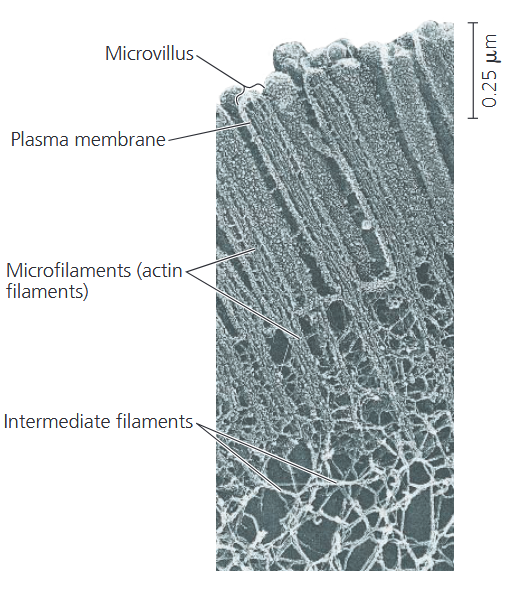

微丝因参与细胞运动而尤为重要。大量肌动蛋白丝与更粗的肌球蛋白丝相互作用，引发肌肉细胞收缩<b>(图 6.26a)</b>。在变形虫及部分白细胞中，肌动蛋白与肌球蛋白介导的局部收缩，实现变形虫式爬行运动：细胞伸出<b>伪足 (<i>pseudopodia</i>) </b>并向其方向移动，完成匍匐行进<b>(图 6.26b)</b>。植物细胞内，肌动蛋白相关作用驱动<b>胞质环流 (<i>cytoplasmic streaming</i>)</b>，即细胞质的定向循环流动<b>(图 6.26c)</b>。该现象在大型植物细胞中十分普遍，可加快胞内细胞器转运与物质分配效率。

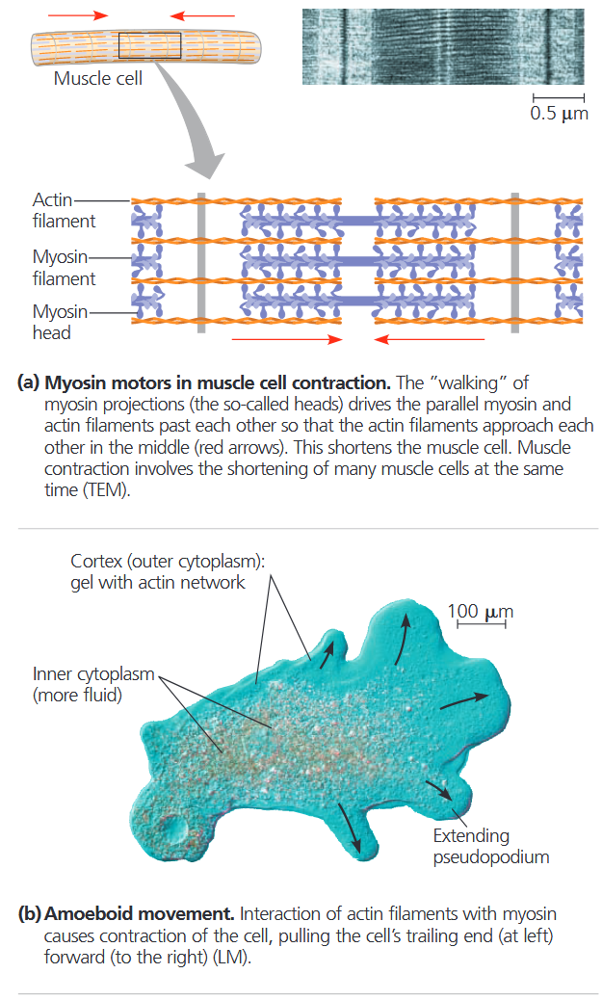
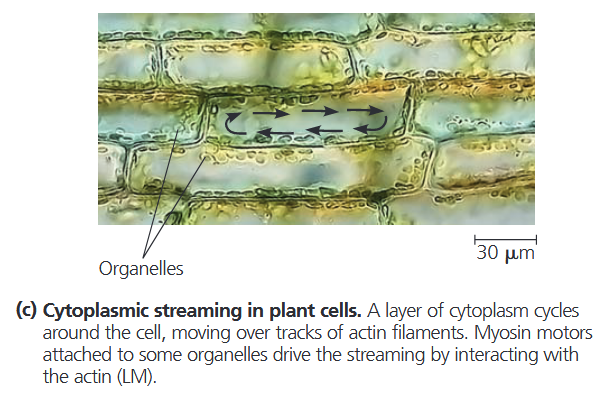

##### *Intermediate Filaments*
<b>中间纤维 (<i>intermediate filament</i>) </b>因直径介于微丝与微管之间而得名。微管和微丝存在于所有真核细胞中，而中间纤维仅见于部分动物细胞。和微丝一样，中间纤维主要功能是承受张力，组分类型多样，由角蛋白等不同特异亚基组装而成。反观微管与微丝，其直径与分子组成在各类真核细胞中高度统一。

相较于可频繁解聚、重组的微丝与微管，中间纤维是细胞内更为稳定的永久结构。即便细胞死亡，中间纤维网络仍可留存，例如人体表层死皮细胞中富含角蛋白纤维。

中间纤维结构坚韧，用以稳固细胞形态、固定细胞器位置。细胞核被中间纤维形成的网架包裹，核膜内侧的核纤层也由中间纤维构成。总体而言，各类中间纤维共同构成细胞持久稳定的支撑骨架。
### CONCEPT 6.7 Extracellular components and connections between cells help coordinate cellular activities
细胞膜通常被视作活细胞的边界，但大多数细胞会合成并分泌物质至胞外。这类胞外物质及其形成的结构虽位于细胞外部，却对细胞生命活动至关重要，是细胞生物学的重要研究内容。
#### Cell Walls of Plants
<b>细胞壁</b>是植物细胞的胞外结构<b>(图 6.27)</b>，也是植物细胞区别于动物细胞的特征之一。细胞壁可保护植物细胞、维持细胞形态，并防止细胞吸水过度膨胀。从植株整体来看，特化细胞的坚硬细胞壁能够支撑植株，抵御重力作用。原核生物、部分原生生物以及真菌同样具有细胞壁。

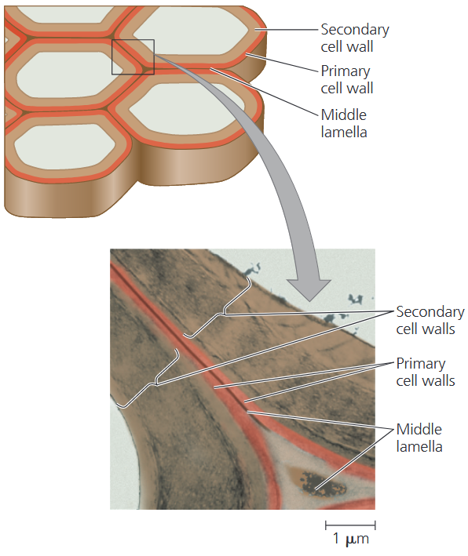

植物细胞壁远厚于细胞膜，厚度介于 0.1 μm 至数 μm 之间。不同物种、甚至同一植株的不同细胞，细胞壁化学成分存在差异，但基本结构模式高度统一。多糖纤维素构成的微纤丝，由纤维素合酶合成并分泌至胞外，镶嵌于其他多糖与蛋白质组成的基质中。

新生植物细胞首先分泌一层薄而柔韧的<b>初生细胞壁</b>。相邻细胞的初生细胞壁之间存在<b>胞间层 (<i>middle lamella</i>) </b>，这是富含果胶的薄层黏性多糖结构，用以粘连相邻细胞。

细胞成熟停止生长后，细胞壁会进一步加固：部分细胞直接向初生壁中分泌硬化物质；另一些细胞则在细胞膜与初生壁之间，沉积<b>初生细胞壁</b>。次生壁常分层堆叠，质地坚固耐久，为细胞提供保护与支撑。木材的主要成分即为次生细胞壁。
#### The Extracellular Matrix (ECM) of Animal Cells
动物细胞没有类似植物的细胞壁，但拥有结构复杂的<b>胞外基质 (<i>extracellular matrix, ECM</i>)</b>。细胞外基质主要成分为细胞分泌的糖蛋白及其他含糖复合物。动物细胞胞外基质中含量最高的糖蛋白是<b>胶原蛋白 (<i>collagen</i>)</b>，可在胞外形成坚韧纤维，约占人体总蛋白含量的 40%。

胶原纤维镶嵌于<b>蛋白聚糖 (<i>proteoglycan</i>)</b> 交织构成的网状基质中<b>(图 6.28)</b>。蛋白聚糖以核心蛋白为骨架，共价连接大量糖链，碳水化合物占比可达 95%；大量蛋白聚糖可结合在长链多糖上，形成巨型复合物。

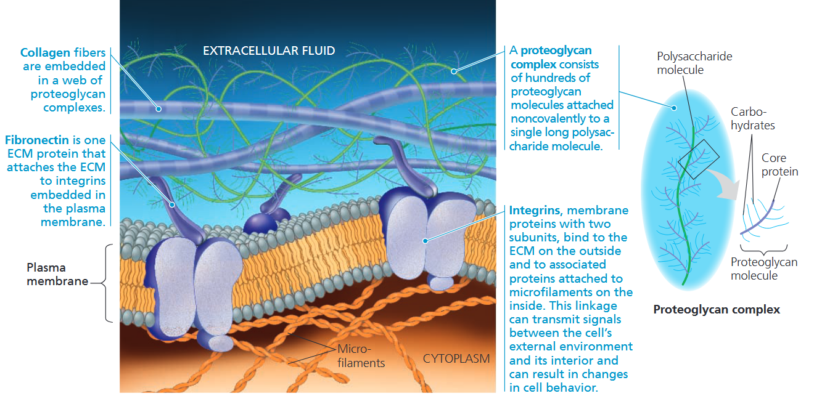

部分细胞通过 <b>纤连蛋白 (<i>fibronectin</i>) </b>等胞外基质糖蛋白锚定在 ECM 上。这类基质蛋白会结合细胞膜表面的<b>整联蛋白 (<i>integrin</i>)</b>。整合素跨越细胞膜并在其胞质侧与相关分子结合整联蛋白可双向传递信号，连通细胞外基质与细胞骨架，整合胞内外的环境变化与生理活动。

目前针对纤连蛋白、其他 ECM 分子与整联蛋白的研究表明，细胞外基质对细胞生命活动影响深远。胞外基质通过整联蛋白与细胞通讯，调控细胞行为。细胞周围的 ECM 还能调控细胞核内的基因表达。
#### Cell Junctions
动植物细胞会有序构成组织、器官与器官系统。相邻细胞常通过直接接触的特化结构，实现黏附、相互作用与信息交流。
##### *Plasmodesmata in Plant Cells*
植物的细胞壁虽为无生命结构，看似会隔绝细胞，实则多数细胞壁上遍布<b>胞间连丝 (<i>plasmodesmata</i>) </b>这类连通通道<b>(图 6.29)</b>。相邻细胞的细胞膜沿胞间连丝相互衔接、彼此连通，通道内充盈细胞质，使细胞共享胞内化学环境。胞间连丝将植株大部分细胞连成一个整体的生命连续体系。

水分与小分子溶质可在细胞间自由流通；研究证实，特定条件下蛋白质与 RNA 等大分子也能借此转运。这类大分子通常沿细胞骨架纤维移动，抵达并通过胞间连丝进入相邻细胞。

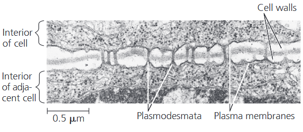

##### *Tight Junctions, Desmosomes, and Gap Junctions in Animal Cells*
动物细胞主要有三种细胞连接：紧密连接、桥粒与间隙连接。间隙连接功能与植物胞间连丝最为相近，但其通道无细胞膜包裹，由两侧细胞膜伸出的蛋白组装形成连通孔道。三类连接广泛分布于覆盖机体内外表面的上皮组织中<b>(图 6.30)</b>。

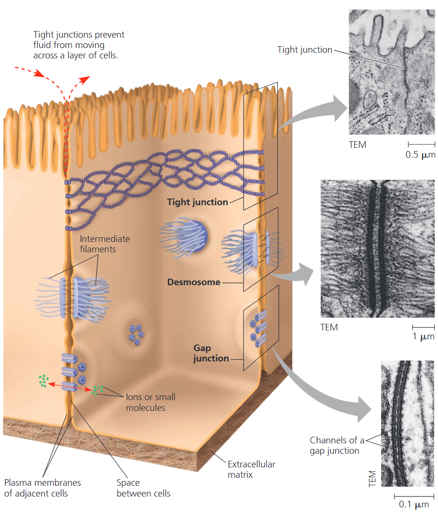

<b>紧密连接 (<i>tight junction</i>) </b>处，相邻细胞的细胞膜紧密贴合，由特定蛋白质相互铆合。紧密连接在细胞四周形成连续封闭结构，构成屏障，阻止胞外液体穿透上皮细胞层发生渗漏。例如，皮肤细胞间的紧密连接，使人体具备防水屏障作用。

<b>桥粒 (<i>desmosome</i>) </b>是锚定连接的一种，它如同铆钉一样将细胞牢固铆合，形成坚韧的细胞片层。由坚韧角蛋白构成的中间纤维，在细胞质内固定桥粒结构。桥粒可连接肌肉细胞；部分肌肉拉伤，本质就是桥粒发生断裂。

<b>间隙连接 (<i>gap junction</i>) </b>可在相邻细胞间建立细胞质通道，功能类似植物的胞间连丝。间隙连接由两侧细胞膜的跨膜蛋白组装而成，形成亲水孔道，允许离子、糖类、氨基酸等小分子物质互通。心肌、动物胚胎等多种组织的细胞间信号交流，高度依赖间隙连接。
