### Attributes of Living Organisms

#### Composition and Structure

生物体的一切生命活动均起源于细胞这一微小结构单位。细胞由细胞质（胶状液态物质）构成，外层包裹着极薄的细胞膜。所有活细胞都含有调控自身生长发育与生命活动的遗传物质。绝大多数生物细胞中，这类名为 $\text{DNA}$ 的遗传物质储存于悬浮在细胞质内的细胞核中。但细菌细胞并无成形细胞核，其 $\text{DNA}$ 直接分散存在于细胞质内。植物、藻类、真菌以及诸多低等生物的细胞，在细胞膜外侧还具有细胞壁，可起到支撑与维持细胞形态的作用。

#### Growth

有人将<b>生长</b>简单定义为生物体质量的增加，通常还伴随着体积增大。植物生长大多源于新细胞的生成，且会在遗传物质与外界环境的共同作用下形成形态差异。若将两个不同品种的郁金香栽种在一起并给予相同培育条件，二者仍会在株型、花色等性状上存在差异，这是由遗传基因不同所决定的。反之，即使栽种同一品种的郁金香种球，若培育方式不同、生长环境存在差别，植株长势也会各不相同。

#### Reproduction

$1.6$ 亿年前恐龙数量繁多，如今却已彻底绝迹。如今数百种哺乳动物、鸟类、爬行动物、植物及其他生物均被列为濒危或易危物种，其中许多物种或将在我们有生之年走向灭绝。

这些已然消亡或濒临灭绝的生物有着共同特征：繁衍后代变得困难甚至无法繁衍。繁殖是生物与生俱来的本能，我们向来习以为常，直至这一能力彻底丧失。

#### Response to Stimuli

对外界刺激作出应答是所有生物的主要特征。或许你会觉得，用针扎室内盆栽植物时毫无动静，明明确定它是活的，却看不到反应。其实植物确实产生了应答，只是反应方式与人类截然不同。植物与动物对刺激的应答形式存在本质差异。若针刺损伤了植物的输导营养组织，受损细胞会迅速合成一种名为<b>胼胝质 (<i>callose</i>) </b>的封堵物质，相关研究表明，植物受伤后最快 $5$ 秒内便可形成胼胝质。此外，伤口处还会慢慢长出愈伤组织。

#### Metabolism

新陈代谢是生物体内全部生化反应的总称。所有生物都会进行代谢活动，包括合成新细胞质、修复受损组织以及维持细胞正常机能。其中核心代谢过程有：<b>呼吸作用</b>，一切生物共有的释能过程；<b>光合作用</b>，绿色细胞捕获并储存能量的生理过程；<b>消化作用</b>，即食物分子的分解过程；还有<b>同化作用</b>，将营养物质转化为细胞质及其他细胞组分。

#### Movement

植物通常不会整体迁移位置，但这并不代表植物不具备运动能力，而运动是生物共有的基本特征。含羞草 (<i>Mimosa pudica</i>) 的叶片受到触碰或外界环境骤变时，数秒内便会闭合；狸藻 (<i>Utricularia</i>) 生长在水下的微型捕虫囊，能在百分之一秒内迅速闭合。不过相较于动物，绝大多数植物的运动缓慢且不易察觉，大多与生长活动相关，只有通过实验观测或延时摄影才能清晰显现。延时摄影常能直观展现植物各类运动形式与运动方向，幼嫩器官的运动表现尤为明显。

植物运动不仅体现在植株整体层面，也存在于细胞内部。活细胞内的细胞质如同水流般持续流动，这种流动现象被称为胞质环流 (<i>cyclosis</i>)。胞质环流多沿细胞内壁顺时针或逆时针运转，但其运动形式并不局限于环形流动。

#### Complexity of Organization

生物体细胞由海量<b>分子</b>构成，分子是元素与化合物的最小基本单位。即便是结构最复杂的非生命体，其所含分子种类也远少于最简单的生物。单个细胞内通常含有超万亿个分子。细菌拥有已知最简单的细胞结构，但每个细菌细胞至少含有 $600$ 种不同蛋白质及数百种其他物质，各类组分各司其职，保障细胞正常运作。而被子植物 (<i>flowering plant</i>) 等高等生物，其体内结构错综复杂，所含分子种类更是多达数百万种。

### Chemical and Physical Bases of Life

#### The Elements: Units of Matter

构成宇宙万物的基本物质存在固态、液态、气态三种形态。简单来说，物质具备以下基本特征：
1. 占据一定空间；
2. 具有质量，日常中常以重量衡量；
3. 由化学元素组成。

地球上天然存在的元素有 $98$ 种，人工合成的元素至少已有 $20$ 余种。天然元素中仅有少数以单质形态存在，如氮、氧、金、银、铜等，其余大多以各类化合态形式存在。每种元素都有专属元素符号，大多源自其拉丁名称。例如铜的符号为 $\ce{Cu}$，钠的符号为 $\ce{Na}$。

元素能够稳定存在的最小基本单元称为<b>原子</b>。原子由多种亚原子粒子构成。原子中心有体积微小的<b>原子核</b>，原子核内包含带正电的<b>质子</b>与不带电的<b>中子</b>。质子和中子均具有一定质量，且都由夸克构成。

原子的质量几乎全部集中在原子核内。倘若把原子核放大至沙滩球大小，那么绝大部分空间为空的整个原子，体积会远超一座专业足球场<b> (图 2.1)</b>。

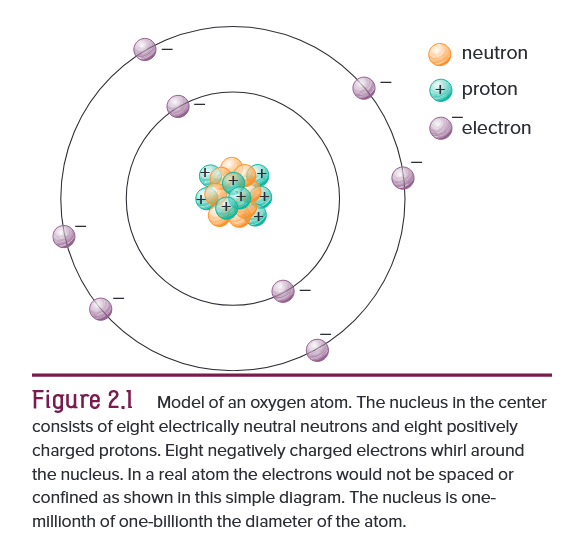

同种元素的原子核内质子数固定：最轻的氢元素仅有 $1$ 个质子，自然界最重的铀元素则含有 $92$ 个质子，这一质子数即为<b>原子序数</b>。原子序数通常标注在元素符号左下角，例如原子核含 $7$ 个质子的氮元素，写作 $\ce{_7N}$。单个原子内质子数与中子数之和称作*原子质量数*，一般标注在元素符号左上角。如氮原子含 $7$ 个质子、$7$ 个中子，质量数为 $14$，同时标注原子序数与质量数时写作 $\ce{_7^{14}N}$。

<b>电子</b>本质上带有负电荷，围绕原子核高速运转。电子质量约为质子、中子的 $\text{1/1840}$，体量极小，通常可忽略不计。由于异种电荷相互吸引，质子所带正电荷会束缚带负电的电子，进而决定电子绕核运动的轨迹。

电子在原子核外占据的空间区域称为<b>原子轨道</b>。轨道存在假想轴线，形态近似云雾状，并无明确边界，因此无法精准确定电子某一时刻在轨道内的具体位置。故而原子轨道被定义为：电子出现概率达 $\textcolor{#e36c09}{90\%}$ 的空间范围。

电子可分布在原子的一个或多个能级上，其与原子核的距离由所处能级决定，每一能级通常称作电子层。原子最外层电子层，决定了该原子能否以及如何与其他原子发生化学反应。离核最近、能级最低的第一层轨道最多仅容纳 $2$ 个电子，该轨道大致呈球形，因距离原子核极近，原子结构示意图中常省略不画。其余多数轨道多呈纺锤形，占据空间更大。第二层能级最多容纳 $8$ 个电子；第三、四层能级虽可容纳更多电子，但电子数超过 $8$ 个时原子结构易趋于不稳定。

轨道内的电子获得能量后，可跃迁至离核更远的轨道；反之，电子释放能量，便会回落至离核更近的能级。不同轨道上的电子之间存在排斥作用，使得同一原子内所有轨道的排布轴线尽量相互远离。轨道的直径通常是原子核直径的数千倍<b> (图 2.2)</b>。

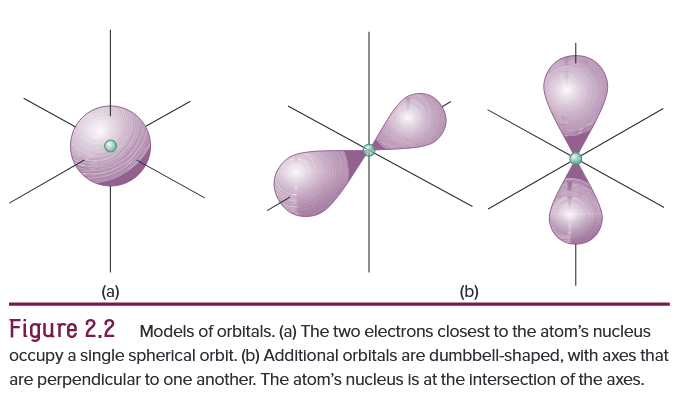

由于原子内电子数通常与质子数相等，电子所带负电荷与质子所带正电荷相互抵消，使原子呈电中性。
同种元素的原子所含中子数可存在微小差异，由此形成质量不同、但化学性质完全一致的同种元素变体，这类变体称为<b>同位素</b>。目前已知氧元素共有七种同位素。例如一种氧同位素原子核内含 $8$ 个质子与 $8$ 个中子，另一种则含有 $8$ 个质子和 $10$ 个中子<b> (图 2.3)</b>。

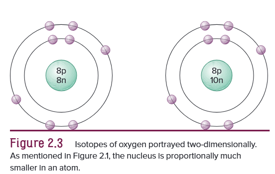

若某元素同位素的中子数与该元素原子平均中子数相差过大，该同位素结构便会不稳定，会分裂成更小微粒并释放大量能量，这类同位素即为放射性同位素。

#### Molecules: Combinations of Elements

大多数元素的原子能够与同种或异种原子相结合，事实上绝大多数元素都无法以单原子形式独立存在。两种及以上元素通过化学键按固定比例结合形成的物质，称为<b>化合物</b>。例如食盐就是由钠原子与氯原子以 $1:1$ 的比例结合而成的化合物。

<b>分子</b>由两个或多个原子相互结合构成，是单质或化合物能够独立存在的最小微粒。例如自然界中的 $\ce{O2}$、$\ce{H2}$，分别由两个氧原子和两个氢原子构成，$\ce{H2O}$ 则由两个氢原子和一个氧原子组成<b> (图 2.4)</b>。分子始终处于不停运动之中，温度升高运动加快，温度降低运动减缓。分子运动越剧烈，相互碰撞的概率越大；且分子随机碰撞的几率，与分子密度（单位空间内的分子数量）成正比。

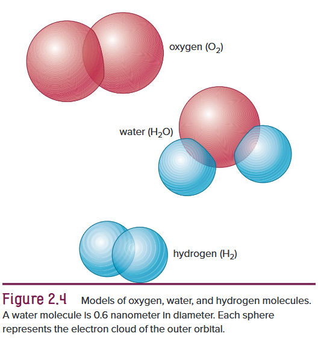

能够共用电子的分子间发生随机碰撞，是一切化学反应发生的基础，这类反应通常会生成新的分子。细胞内的各类化学反应大多在水溶液中进行，且由特定酶调控。酶属于有机催化剂，催化剂可加快化学反应速率，且反应前后自身不会被消耗。

水分子由两个氢原子与一个氧原子结合而成，三种原子共用电子，并在原子核外形成电子云，使水分子呈现不对称结构。尽管分子内正负电荷总量持平，但氢氧原子间电子分布不均、分子结构不对称，让水分子一端带微弱正电，另一端带微弱负电，这类分子称为极性分子。由于异种电荷相互吸引，分子的极性会影响分子间的排布方式。

水分子中略带正电的氢原子，会与其他水分子中略带负电的氧原子相互吸引，进而形成具有内聚力的水分子网络<b> (图 2.5)</b>。水分子间的这种内聚力，是水分能够在毛细管中流动的重要原因，树木木质部中将水分从根部输送至叶片的导管便属于此类细管。水分子中的氢原子还可与纤维等带负电的其他分子产生引力，形成附着力，这也是水能够浸润各类物质的原理。

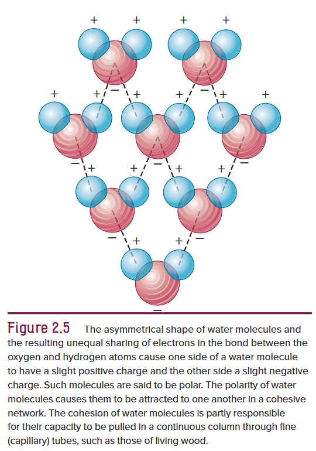

#### Valence

一种元素与其他元素结合的能力由电子数决定，这种能力称为<b>化合价</b>。例如钙元素原子化合价为二价，氯元素原子化合价为一价。两种元素原子相结合时，得失电子数目必须守恒，即化合价需相互平衡。一个钙原子需要结合两个氯原子，二者化合形成氯化钙。

#### Bonds and Ions

化学键是依靠引力将原子聚拢结合、构成分子的作用力，其形成方式分为多种。原子最外层电子数，决定了它能够形成的化学键数量。若原子最外层电子数不足 $8$ 个，便会通过失去、得到或共用电子的方式，使最外层电子数达到饱和状态。对生命体而言，有三类化学键尤为重要：

1. 两个原子通过共用最外层轨道上的一对电子，填满各自最外层电子层，由此形成<b>共价键</b>。共用电子将两个或多个原子核维系在一起，并在其间运动，使原子保持稳定间距。例如氢原子仅有一个电子，其唯一轨道会吸引另一个氢原子的电子，两个氢原子共用电子，形成含有两个电子的共用轨道，进而构成 $\ce{H2}$。共价键常用单横线表示，$\ce{H2}$ 可表示为 $\ce{H-H}$。

	氢与氦仅有一层轨道，其余元素每个能级最多还可多出四条轨道。以碳原子为例，它共含六个电子，内层轨道排布两个，第二层四条外层轨道各排布一个，可通过共价键共用四个电子。一个碳原子与四个氢原子结合，便形成甲烷分子 $\ce{CH4}$。

	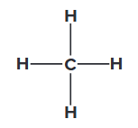

	共用一对电子形成单键，共用两对电子形成双键，共用三对电子则形成三键。结构式中双键用双线表示（如 $\ce{C=C}$)，三键用三线表示 (如 $\ce{C#N}$)。

	像 $\text{H}_2$ 这类电子均等共用形成的共价键，称为非极性共价键；而水分子中电子偏向一方、共用不均等，形成极性共价键。电子不均等共用会使分子局部带上微弱电荷，不再呈电中性。在三类化学键中，共价键键能最强，也是构成诸多重要生物分子的主要结合作用力<b> (图 2.6)</b>。

	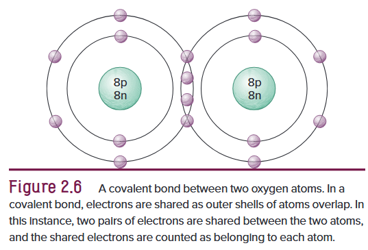

2. <b>离子键</b>。自然界中，部分原子最外层电子并非相互共用，而是直接由一个原子转移至另一个原子，这种情况多见于极易得失电子的元素之间。原子得失电子后形成带电微粒，即离子，失电子带正电，得电子带负电。原子间发生电子转移，阴阳离子依靠异种电荷相互吸引，便形成离子键。离子所带电荷标注在元素符号右上角。例如食盐由 $\ce{Na+}$ 和 $\ce{Cl-}$ 通过离子键结合而成。

	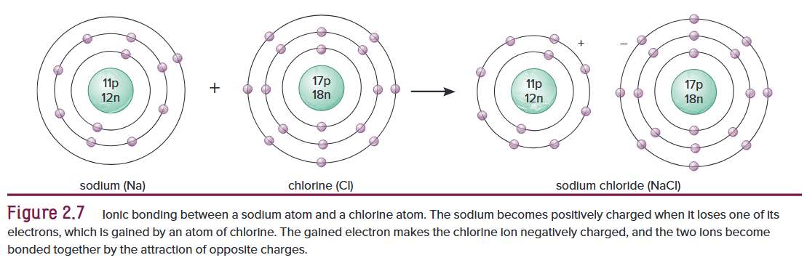

3. 极性分子中带正电的氢原子，与其他极性分子中带负电的原子相互吸引，进而形成<b>氢键</b>。一个分子内带负电的氧原子或氮原子，可吸引其他分子中带微弱正电的氢原子，由此形成一种弱作用力。氢键在自然界分布广泛，大量存在于各类重要生物分子中，作用至关重要，但其键能仅为共价键的 $7\% \sim 10\%$。氢键能够维持酶等蛋白质的空间结构，助力各类物质精准结合完成化学反应，以此保障细胞生命活动正常进行。

#### Acids, Bases, and Salts

水分子依靠较弱的氢键相互结合。纯水中部分水分子会发生解离，生成等量的 $\ce{H+}$ 和 $\ce{OH-}$。<b>酸</b>溶于水会释放 $\ce{H+}$，使溶液中 $\ce{H+}$ 数量多于 $\ce{OH-}$。$\ce{H2CO3}$ 这类物质解离出的氢离子较少，属于弱酸；$\ce{H2SO4}$ 等强酸则几乎能完全解离为 $\ce{H+}$ 与 $\ce{SO_4^2-}$。<b>碱</b>溶于水可释放 $\ce{OH-}$，也可定义为能够结合 $\ce{H+}$ 的化合物。

#### The pH Scale
$\ce{H+}$ 可用于 $\ce{pH}$ 值衡量酸碱度，该数值范围为 $0$ 至 $14$，每相差一个单位，$\ce{H+}$ 便相差十倍。纯水的 $\ce{pH}$ 值为 $7$，此时 $\ce{H+}$ 与 $\ce{OH-}$ 数量相等，呈中性。数值小于 $7$，酸性越强；数值大于 $7$，碱性越强。

酸与碱混合时，酸中的 $\ce{H+}$ 会与碱中的 $\ce{OH-}$ 结合生成 $\ce{H2O}$，剩余离子相互结合形成盐。例如 $\ce{HCl}$ 与 $\ce{NaOH}$ 反应，会生成 $\ce{H2O}$ 和 $\ce{NaCl}$ 这种盐，即酸碱中和反应生成盐和水。该反应可用化学方程式表示如下。

$$
\ce{HCl} + \ce{NaOH} \rightarrow \ce{H2O} + \ce{NaCl}
$$

#### Energy

能量是做功或引发变化的能力，生命的生长、繁殖、运动、修复及各类生命活动都离不开能量。地球上所有生命活动的最终能量来源是太阳。热力学研究能量及其形式间的相互转化，包含两大基本定律。*热力学第一定律*指出，能量总量守恒，既不能凭空产生也不会凭空消失，仅能从一种形式转化为另一种形式，生命活动所需的化学能、电能、热能、光能等均可相互转化。热力学第二定律表明，在封闭体系内发生能量转化时，能量只会从高能状态自发流向低能状态。

能量分为动能与势能。势能是物质凭借自身位置或状态所具备的做功能力。例如滑雪者从山坡滑下时，势能便转化为动能。部分化学反应释放能量，另一些则需要吸收能量。所有电子的质量与电荷量均相同，但所含势能存在差异。势能最低的电子位于离原子核最近的轨道，势能最高的电子则处于最外层轨道<b> (图 2.9)</b>。

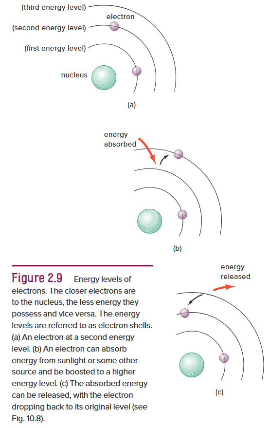

#### Chemical Components of Cells

细胞的生命物质由细胞质及其内部各类结构组成。细胞质及其内含结构中，约 $\ce{96\%}$ 由碳、氢、氧、氮四种元素构成，$3\%$ 由磷、钾、硫组成，剩余 $1\%$ 包含钙、铁、镁、钠、氯、铜、锰、钴、锌以及其他微量元素。

植物可通过新陈代谢，利用简单小分子合成庞大复杂的大分子。这类以碳原子为骨架的大分子统称为有机物，生物体内绝大多数化学反应都依托有机物进行。不含碳元素的物质称为无机物，二氧化碳、碳酸氢钠属于该划分下的特例。

#### Monomers and Polymers

多数细胞组分由大分子即高分子<b>聚合物</b>构成。多个<b>单体</b>小分子相互结合即可形成聚合物。单体结合时，一个单体脱去 $\ce{H+}$，另一个脱去 $\ce{OH-}$，依靠静电引力相互连接。该结合过程脱去了水的组成成分，因此被称为脱水缩合，此反应由酶催化完成。简言之，脱水缩合会脱去水分子，且需要消耗能量。

水解作用与脱水缩合过程恰好相反。水分子解离出的 $\ce{H+}$ 与 $\ce{OH-}$ 分别结合到两个单体上，使大分子化学键断裂。水解断键过程会释放能量，这些能量可暂时储存，也可用于合成与更新细胞组成物质。简言之，水解反应依靠引入水分子分解物质，同时释放能量。

##### *Carbohy drates*

糖类是自然界中含量最丰富的有机物，包含糖类与淀粉，由 $\ce{C}$、$\ce{H}$、$\ce{O}$ 三种元素组成，元素比例大致为 $1:2:1$，最简式为 $\ce{CHO}$。糖类所含结构单元数量不等，最少三个，最多可达数千个。糖类主要分为三类：
1. 单糖为结构简单的糖类，碳骨架含三至七个碳原子。葡萄糖与果糖是最常见的单糖，二者互为同分异构体。同分异构体指原子种类和数目完全相同，但空间结构存在差异的分子。存在于水果中的果糖分子式同样为 $\ce{C6H12O6}$，原子排布不同使其性质有别，甜度更高。绿色植物细胞通过光合作用合成葡萄糖，它是所有生物细胞最主要的能量来源<b> (图 2.10)</b>。

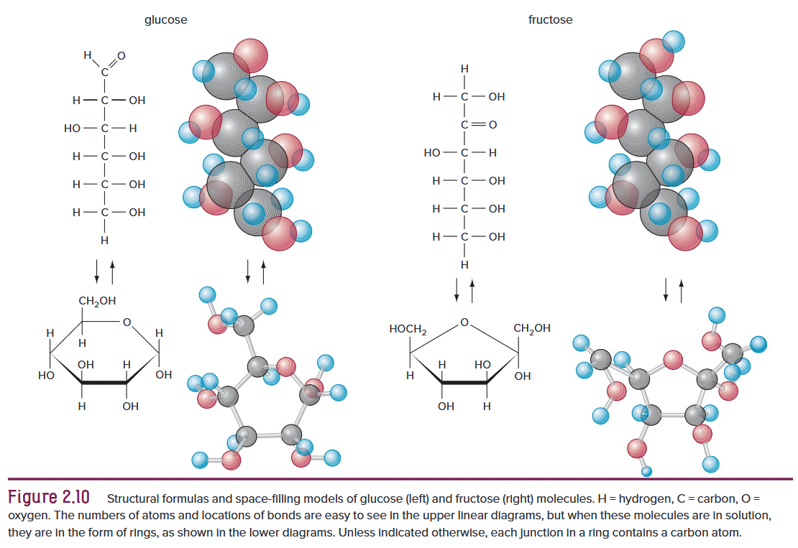

2. 两分子单糖经脱水缩合结合形成二糖。日常食用的<b>蔗糖</b>是典型二糖，由一分子葡萄糖与一分子果糖脱去一分子水化合而成。小分子聚合形成大分子并脱去水分子的反应称为缩合反应。蔗糖是植物体内糖分主要运输形式，也是甜菜根部与甘蔗茎秆中糖分的主要储存形态。
3. 多个单糖相互结合即可形成多糖。多糖聚合物常由数千个单糖连接而成，形成直链、支链或螺旋状长链结构。淀粉是植物主要的储能糖类，由数百至数千个葡萄糖单元构成。葡萄糖聚合形成淀粉时会脱去水分子，淀粉通式为 $\ce{(C6H10O5)}_{n}$，$n$ 代表葡萄糖单元数目。淀粉需经水解作用分解为葡萄糖才能被细胞利用，该过程消耗水分并释放能量。

淀粉是全球人类摄取糖类的主要来源。温带地区主要淀粉作物有马铃薯、小麦、水稻与玉米，热带地区则以木薯、甘薯、芋头为主。

纤维素是植物细胞壁主要结构多糖，由 $3000$ 至 $10,000$ 个葡萄糖分子连成无分支长链。纤维素在自然界分布极广，但其葡萄糖连接方式与淀粉不同，多数动物难以消化。白蚁肠道原生动物、部分真菌可合成特殊酶，断裂纤维素分子间化学键，分解出葡萄糖以供自身利用。

##### *Lipids*

脂质是油脂类物质，因无极性基团大多不溶于水。同等质量的脂质储能约为糖类的两倍，是细胞长期储能物质，也参与构成细胞结构。脂质同样由碳、氢、氧组成，但其氧元素占比远低于糖类。常温下呈固态的为<b>脂肪</b>，液态的为<b>油</b><b>(图 2.11)</b>。一分子甘油与三分子脂肪酸结合可生成油脂分子，甘油是含三个 $\ce{-OH}$ 的三碳化合物；脂肪酸一端带有 $\ce{-COOH}$，碳骨架碳原子数通常为偶数。

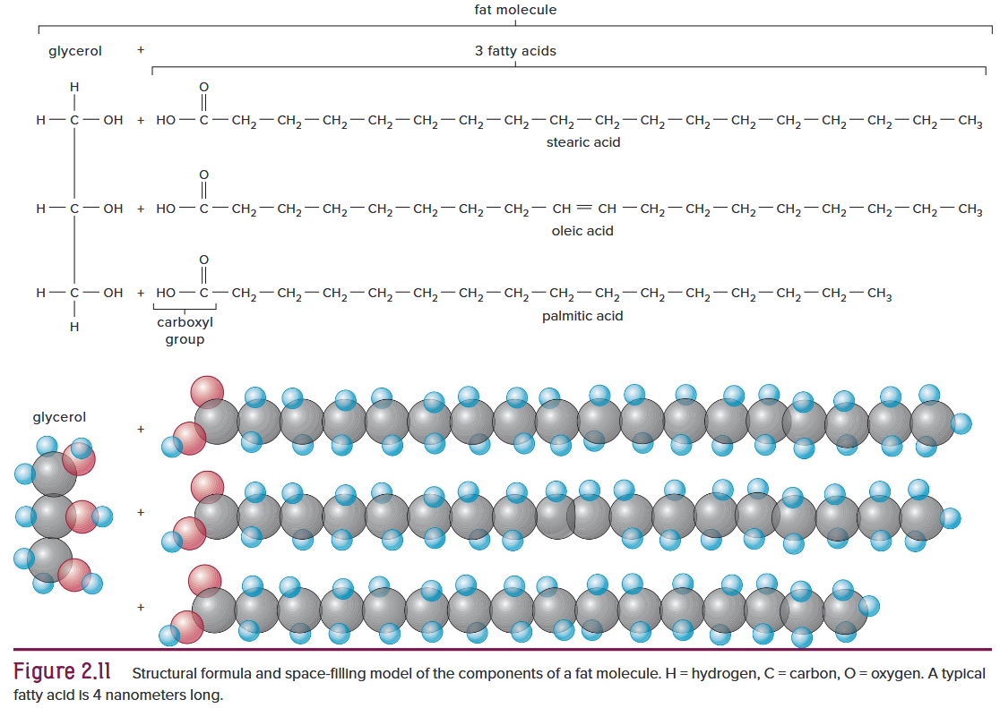

绝大多数脂肪酸分子含有 $16$ 至 $18$ 个碳原子。若脂肪酸碳原子的所有价键均与氢原子结合，如黄油、肉类中的动物脂肪，这类脂肪称为饱和脂肪。若碳链中存在至少一处碳碳双键、氢原子数量偏少，则为不饱和脂肪。

蜡质也属于脂质，由长链脂肪酸与非甘油类长链醇结合形成，常温下为固态，多分布于植物茎叶表面。蜡质常镶嵌于角质 (<i>cutin</i>) 与木栓质 (<i>suberin</i>) 中，二者同为不溶于水的脂质聚合物。蜡质搭配角质或木栓质，能够起到隔水保水、抵御微生物与小型虫害的作用。

磷脂结构与脂肪相近，其三分子脂肪酸中，通常有一分子被磷酸基团取代，使分子形成极性离子。磷脂置于水中可形成类似膜结构的双层薄片，是生物体内各类生物膜的重要组成成分。

##### *Proteins, Polypeptides, and Amino Acids*

生物细胞内含有数百乃至上万种不同<b>蛋白质</b>，在植物细胞干重占比中，蛋白质含量仅次于纤维素。每种生物都拥有独特的蛋白质组合，以此形成自身独有特征。蛋白质由碳、氢、氧、氮构成，部分还含有硫元素。它可调控细胞内化学反应，也是除去水分外原生质的主要组成物质。蛋白质分子通常体积庞大，由一条或多条多肽链构成，部分还会结合糖类等小分子物质。

<b>多肽</b>由氨基酸连接而成。自然界共有 $20$ 种氨基酸，每个蛋白质分子由 $50$ 至 $50000$ 个及以上<b>氨基酸</b>以不同方式组合构成。每种氨基酸均包含 $\ce{-NH2}$、$\ce{-COOH}$ 以及侧链 $\ce{R}$ 基。$\ce{R}$ 基结构各异，既可以是单个氢原子，也可为复杂环状结构，有极性与非极性之分，是区分 $20$ 种氨基酸的核心特征。甘氨酸是氨基酸典型代表<b>(图 2.12)</b>。氨基酸依靠<b>肽键</b>相连，该共价键由脱水缩合反应形成，即一个氨基酸的羧基碳与另一个氨基酸的氨基氮相互结合而成。

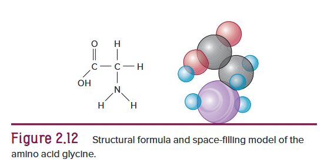

多肽链在蛋白质内部会以特定方式盘绕、弯折与折叠，蛋白质一般具有三级结构，部分还存在四级结构<b>(图 2.13)</b>。

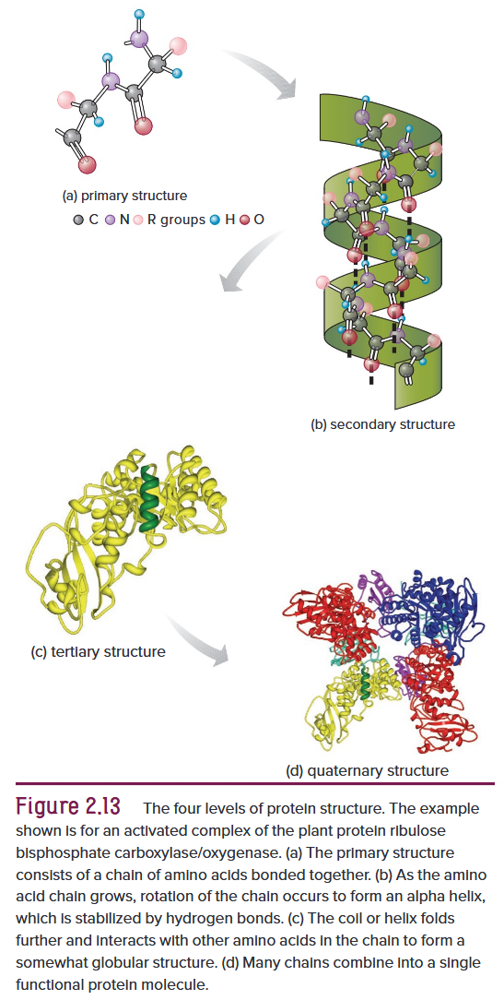

1. 氨基酸通过肽键依次连接形成的线性排列顺序，即为蛋白质的一级结构。
2. 不同肽链中羧基的氧原子与氨基的氢原子之间形成氢键，使多肽链盘绕成阶梯状螺旋结构，即 $\ce{\alpha}-$螺旋，这是蛋白质二级结构的一种类型。另一种二级结构为 $\ce{\beta}-$折叠片，多肽链折返弯折，相邻肽链片段之间形成氢键连接而成。
3. 多肽链进一步盘绕折叠形成三级结构，依靠氨基酸侧链基团之间的相互作用与化学键维持其空间形态。
4. 若蛋白质由多种多肽链构成，多肽链相互结合便会形成四级结构。

蛋白质的空间结构在溶液中具备一定柔性，但凡破坏其分子内部正常成键方式，都会造成蛋白质变性。变性会改变其原有盘曲折叠形态，致使功能与理化性质受损。部分变性过程可逆，但若由高温、强腐蚀性化学物质引发，往往会造成细胞损伤。

##### *Storage Proteins*

马铃薯块茎、洋葱鳞茎等植物贮藏器官，除大量糖类外，还会储存少量蛋白质。而种子除糖类外，蛋白质占比通常更高，是人与动物重要的营养来源。种子中的蛋白质可在萌发及幼苗生长阶段供给营养。豆类种子蛋白质含量可达四成以上，但缺少蛋氨酸等部分必需氨基酸，因此以豆类为主食时，需搭配糙米等其他食物，补足全部必需氨基酸。

##### Enzymes

酶大多是结构复杂的大分子蛋白质，可在适宜酸碱度与温度条件下充当生物催化剂。它能断裂旧化学键、促成新键生成，即便浓度极低也可高效推动细胞内化学反应，是生命活动不可或缺的物质。

细胞内 $2,000$ 余种生化反应，都需要专属酶参与才能正常进行。酶可将反应速率提升数十亿倍，若无酶催化，体内反应速率过慢，生命将无法维系。酶在催化过程中性质稳定，可反复发挥作用，自身一般不会被消耗分解。

酶的名称通常以 $\text{-ase}$ 结尾。被酶催化分解的物质称为底物。麦芽糖是常见二糖，由两分子葡萄糖构成，麦芽糖酶可催化底物麦芽糖水解生成葡萄糖。酶通过降低活化能发挥作用，活化能是物质发生反应所需的最低能量。酶会借助自身表面位点暂时结合反应物，反应物嵌入活性位点形成短暂复合物，反应迅速进行。反应结束后复合物解离，生成物脱离，酶本身结构不变，可反复催化反应<b>(图 2.14)</b>。

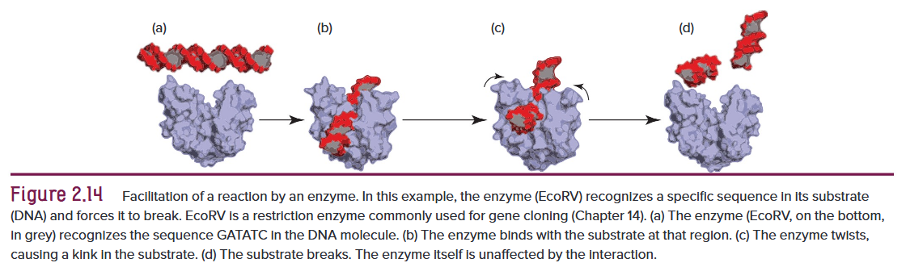

##### *Nucleic Acids*

*核酸*是体量极大、结构复杂的高分子聚合物，最初认为仅存在于细胞核内，如今发现也分布在细胞其他部位。它对所有活细胞的信息传递与正常生理运作至关重要。核酸分为 $\ce{DNA}$ 和 $\ce{RNA}$ 两类。

$\ce{DNA}$ 分子由<b>核苷酸</b>重复单元盘绕形成双螺旋结构。每个核苷酸由三部分组成：含氮碱基、五碳糖与磷酸分子。一个核苷酸的磷酸基团连接下一个核苷酸的五碳糖<b>(图 2.15)</b>。$\ce{DNA}$ 含有四种碱基各不相同的核苷酸，其内部以<b>基因</b>为单位储存遗传编码信息，精准决定细胞内各类物质的种类、占比，以及生物体最终的形态与构造。$\ce{DNA}$ 可精准自我复制，细胞分裂时，新细胞所含遗传信息与母体完全一致，能够代代稳定遗传，仅在发生基因突变时才会出现改变。

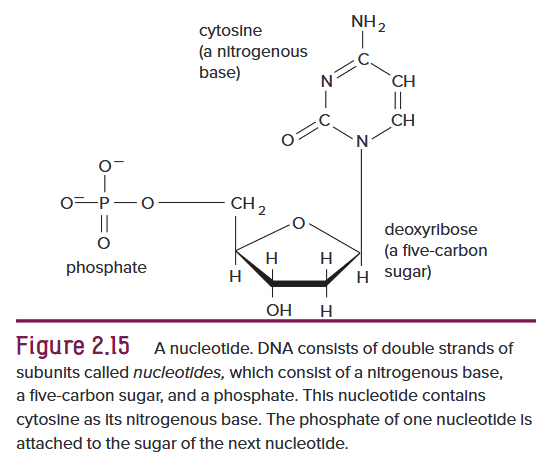

$\ce{RNA}$ 与 $\ce{DNA}$ 结构相似，但所含五碳糖及一种核苷酸组分不同，通常为单链结构。不同类型的 $\ce{RNA}$ 参与蛋白质的合成过程。