### Cells

#### History

$1831$ 年，英国植物学家罗伯特・布朗发现所有细胞内都存在一种体积较大的结构，并将其命名为细胞核。细胞核发现不久后，德国植物学家施莱登又在细胞核内观察到更小的结构，称之为核仁。

施莱登与德国动物学家施旺并非最早意识到细胞重要性的人，但二人对细胞的阐释更为透彻深刻。学界普遍认为，二人于 $1838$ 至 $1839$ 年发表相关论著，正式创立<b>细胞学说</b>。该学说核心内容为：一切生物体均由细胞构成，细胞是生物统一的基本结构单位。

#### Modern Microscopes

各类显微镜可将细胞与组织放大数百乃至数千倍，极大助力生命科学研究。对观察样本进行不同方式制片，也能帮助人们更好地探究细胞结构与功能。和胡克当年所用原理相近的<b>光学显微镜</b>，仅能观测细胞基本构造与部分胞内结构；而<b>电子显微镜</b>问世后，细胞内各类细微结构的精细样貌才得以清晰呈现。

光学显微镜主要分为两类：复式显微镜 (<i>compound microscope</i>) 与解剖显微镜 (<i>dissecting microscope</i>)。复式显微镜需将观察材料切成薄片以便透光观察；解剖显微镜可直接观察不透明样本，呈现立体影像。普通光学显微镜仅能分辨直径 $2$ 微米及以上的细胞器。相差 (<i>phase-contrast</i>)、荧光显微术 (<i>fluorescence microscopy</i>) 可利用光线与标本的作用，清晰显现样本表层结构与特定物质。$20$ 世纪 $80$ 年代中期，共聚焦扫描显微术 (<i>confocal scanning microscopy</i>) 问世，融合激光与微电子技术，大幅提升成像对比度与分辨率。

借助光学显微镜常可观察到细胞壁、细胞核、核仁、细胞质、叶绿体、液泡等结构。在未来很长一段时间内，光学显微镜仍极具实用价值<b> (图 3.2)</b>，尤其适用于活体细胞观测。

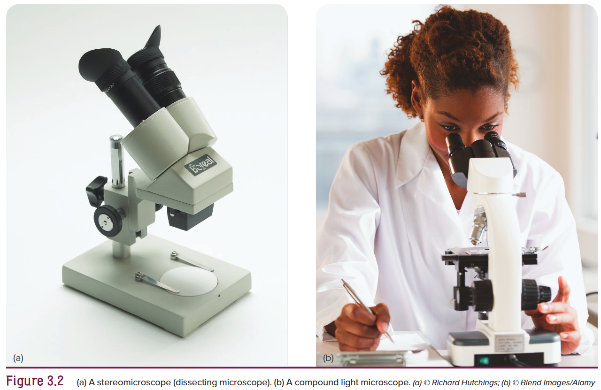

电子显微镜同样分为两大类。透射电子显微镜<b> (图 3.3a)</b> 放大倍数可达二十万倍以上，但观测样本必须切至极薄，且需置于真空环境中，因此无法观察活体生物。扫描电子显微镜<b> (图 3.3b)</b>放大倍数通常较低，一般在 $30$ 至 $10000$ 倍之间，但其可观测厚实样本的表面形貌，通过扫描装置将影像呈现在阴极射线显示屏上。

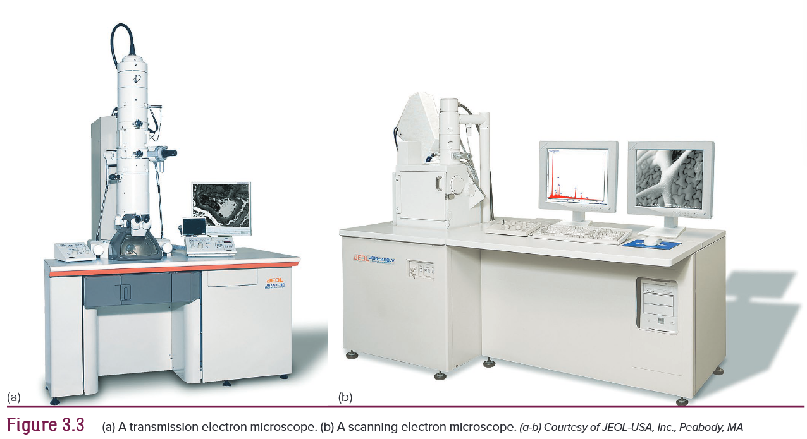

$\ce{IBM}$ 的两位科学家于 $1982$ 年研制出扫描隧道显微镜。该仪器依靠极细探针在样本表面形成电子隧穿效应，探针移动时不断调整高度以维持电子流量稳定，记录高度变化即可绘制出样本表面形貌。它观测时不会损伤样本，放大倍率极高，甚至能够清晰分辨原子。

### Eukaryotic versus Prokaryotic Cells

绝大多数高等动植物细胞都具备本章所述各类结构特征，而细菌等原始简单生物的细胞则缺少细胞核、质体等结构。无成形细胞核的细胞称为<b>原核细胞</b>，与之相对，拥有完整细胞核的即为<b>真核细胞</b>。依据<b>内共生学说</b>，叶绿体与线粒体这类细胞器，起源于大型真核细胞吞噬独立原核生物后逐渐演化形成。

原核生物与真核生物均可具备<b>细胞壁</b>，但只有真核细胞拥有具膜结构、各司其职的<b>细胞器</b>。

### Cell Structure and Communication

植物细胞<b>原生质 (<i>protoplasm</i>) </b>外通常包裹着细胞壁，原生质包含细胞全部生命物质。原生质外层由细胞膜包裹。细胞膜与细胞核之间的全部物质统称为<b>细胞质 (<i>cytoplasm</i>) </b>。细胞质内充盈着液态的细胞溶胶，各类细胞器分散其中。细胞器形态大小各异、功能专一，大多具有膜结构。

#### Cell Size

绝大多数动植物细胞体积极小，肉眼无法看见。高等植物细胞长度大多在 $10$ 至 $100$ 微米之间。细胞为何普遍体积微小？细胞体积增大时，体积增速远大于表面积增速。物质均通过细胞膜进出细胞，体积过大不利于物质交换。同时细胞核统筹细胞各项生命活动，细胞体积越大，核内调控信号传递至细胞表层耗时越久。体积较小的细胞拥有更大的表面积与体积比，物质交换高效，细胞内部信息传递也更为迅速顺畅。

#### The Cell Wall

$1665$ 年罗伯特・胡克最先发现的细胞结构便是细胞壁，它也是植物细胞中最易观察到的结构，决定着细胞外形。不同物种乃至同种生物体内的细胞壁形态各异，映射出细胞独特的结构与功能。遍布植物体表的表皮 (<i>epidermal</i>) 细胞形态大小多样，部分特化为腺毛，可分泌物质抵御动物啃食。叶片表皮内侧的薄壁细胞专司光合作用，木质部厚壁细胞则能在输水过程中维持形态、不易塌陷。

细胞壁主要组成成分为纤维素，它由 $100$ 至 $15000$ 个葡萄糖单体连接成长链，是地球上储量最丰富的天然聚合物。它是食草动物的主要食物来源，几乎所有生物都间接依赖它生存，地球上多数生命活动都直接或间接依托细胞壁维系。

除纤维素外，细胞壁还含有半纤维素、果胶与糖蛋白。半纤维素如同黏合剂，粘连纤维素微丝；果胶可赋予果冻凝固质感；糖蛋白则是结合糖类分子的复合蛋白质。

新生细胞壁形成时，最先生成由果胶构成的<b>胞间层 (<i>middle lamella</i>)</b>。胞间层为相邻两细胞共有，质地极薄，未经特殊染色难以在普通光学显微镜下观测到。胞间层两侧逐步形成质地柔韧的初生壁，由纤维素、半纤维素、果胶与糖蛋白交织构成<b> (图 3.6a)</b>。

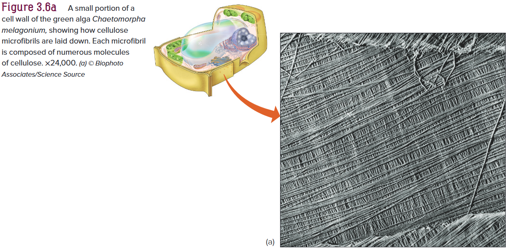

细胞生长过程中，细胞壁会通过物质重组、合成新组分实现形态调整。在初生壁内侧进一步沉积加厚，并掺入木质素这种复杂聚合物，最终形成次生壁。植物次生壁的纤维素含量达 $40\%$ 至 $80\%$，远高于初生壁。随着细胞老化，细胞壁厚度差异极大，占细胞体积比例可低至 $5\%$，最高超 $95\%$<b> (图 3.6b)</b>。

#### Communication between Cells

合成、加工与储存营养物质的细胞细胞壁较薄，起支撑作用的细胞细胞壁通常厚实。活细胞虽可独立完成各类生命活动，但生物体内所有细胞必须依靠信息交流协同运作。相邻细胞间可通过<b>胞间连丝 (<i>plasmodesmata</i>) </b>互通物质，它是穿过细胞壁微孔、连通彼此细胞质的细丝，糖分、氨基酸、离子等物质均可借此运输。胞间层与多数细胞壁本身也具备通透性，能让水分与溶质在细胞间缓慢流通。

### Cellular Components

细胞内绝大多数化学反应都在原生质中进行，一系列动态生命活动共同维系植物生命体。原生质内各类细胞器各司其职，代谢产物在细胞器间流转，以此维持生命活动稳态。

#### The Plasma Membrane

<b>细胞膜</b>是细胞生命结构的外层边界，厚度约为八百万分之一毫米。这层精致的半透膜是调控物质进出细胞的关键结构，既能阻挡部分物质通行，也可允许部分物质自由扩散，还能主动管控特定物质跨膜运输，使得细胞内外的化学成分与浓度差异显著。此外，细胞膜还参与细胞壁纤维素的合成与组装过程。

$20$ 世纪 $70$ 年代初以来的研究证实，细胞膜及其他生物膜均由双层磷脂分子构成骨架，其间镶嵌分布各类蛋白质<b> (图 3.7)</b>，即流动镶嵌模型。该模型表明生物膜结构具有流动性，多种组分可移动并相互作用。细胞膜外侧的糖类可通过共价键与脂质、蛋白质相结合。部分蛋白质贯穿整个膜层，其余则嵌入膜内，或是松散附着于膜表面。

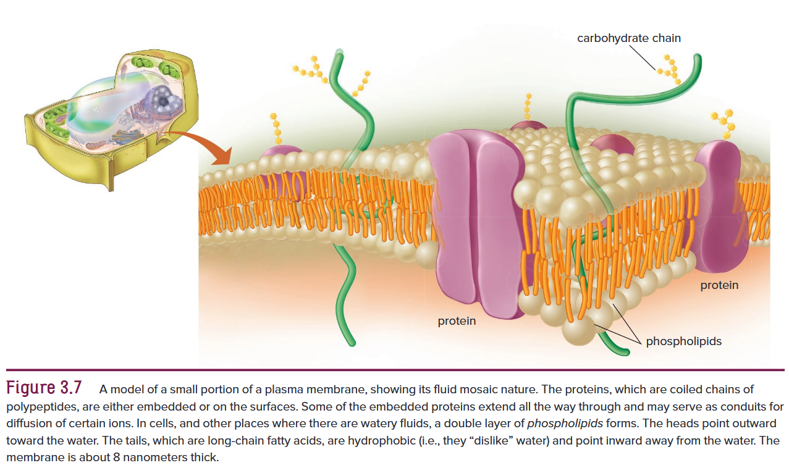

由于渗透压作用，细胞内物质会将细胞膜紧贴细胞壁。细胞膜柔韧性强，易向内凹陷折叠，进而形成囊泡游离在细胞质中。实验表明，洗涤剂可破坏分散完整的细胞膜，清除洗涤剂后细胞膜能部分重建。细胞膜可暂时与细胞壁分离，一旦破裂，细胞很快就会死亡。

#### The Nucleus

细胞核是细胞的控制中枢。从某种意义上来说，它兼具程序指令与调度中枢的功能，将核内 $\ce{DNA}$ 携带的遗传编码信息，以遗传蓝图的形式输送至细胞各处。简言之，细胞核内的 $\ce{DNA}$ 储存着维持细胞正常生命活动所需的原始遗传信息。这些信息调控细胞生长、分化，统筹细胞内部繁杂的生命代谢活动。同时细胞核还承载遗传物质，能在细胞增殖过程中将遗传信息逐代传递。

细胞核通常是活细胞中最显眼的结构，不过在含叶绿素的绿色细胞中，叶绿体常会将其遮挡。细胞核形态不一、大小悬殊，直径一般在 $2$ 至 $15$ 微米及以上。

细胞核由双层核膜包裹构成<b>核被膜</b>，膜上分布着结构精密的核孔，孔间距约 $50$ 至 $75$ 纳米，总面积可占核被膜表面积的三分之一<b> (图 3.8)</b>。核孔内嵌有通道蛋白，可选择性管控物质进出，只允许特定分子通行，如蛋白质进入细胞核、$\ce{RNA}$ 转运至细胞质。

细胞核内充满颗粒状的核质 (<i>nucleoplasm</i>)，其中密布直径约 $10$ 纳米的短纤维，还悬浮着多种体积较大的结构。核内最显眼的结构是一个或多个<b>核仁</b>，主要由核糖核酸与相关蛋白质构成。

还有一类重要结构为<b>染色质</b>，不经染色或细胞未处于分裂期时，无法在光学显微镜下观察到。细胞分裂时，染色质高度螺旋化，缩短变粗，形成<b>染色体</b>。染色质由蛋白质与脱氧核糖核酸组成。同一动植物物种的体细胞，染色体数目与组成固定；生殖细胞的染色体数量为体细胞的一半。

#### The Endoplasmic Reticulum

细胞核外膜与<b>内质网</b>相连且彼此连通。内质网利于细胞间信息交流与物质运输，多种重要生命活动都在此进行，包括合成各类细胞器膜、对胞内合成的蛋白质进行加工修饰，相关过程发生在内质网表面或其腔隙之中。

内质网（常简称为 <b>ER</b>）是由扁平囊与管状结构交织而成的密闭网状通道，遍布整个细胞质，其数量和形态在不同细胞中差异极大。经透射电镜观察切片可见，内质网呈平行膜状，形似细长管道或囊腔，在细胞内划分出多个独立腔室。

内质网外侧可附着核糖体，这类附着核糖体的内质网称为粗面内质网，主要负责蛋白质的合成、分泌与储存。表面几乎无核糖体附着的为滑面内质网，主要参与脂质合成与分泌<b> (图 3.9)</b>。同一细胞内可同时存在两种内质网，且能随细胞生理需求相互转化。参与细胞呼吸的多种酶在内质网表面合成，合成后直接转运至线粒体等细胞器，不经过内质网腔。此外，内质网也是细胞内生物膜合成的主要场所。

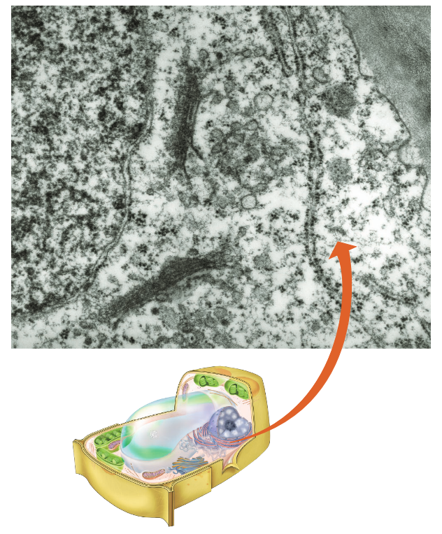

#### Ribosomes

<b>核糖体</b>是仅能借助电子显微镜观察到的微小结构，整体多呈椭球形，表面结构繁复多样。每个核糖体由大小两个亚基组成，组分包含核糖核酸与蛋白质，两亚基中间存在明显缝隙可区分。植物细胞中核糖体平均直径仅约 $20$ 纳米。游离核糖体常以五至百个聚集形成多聚核糖体，主要负责串联氨基酸，合成构成生命体基础的大分子蛋白质。

核糖体亚基在核仁内组装成型后释放出来，与特定 $\ce{RNA}$ 结合，启动蛋白质合成过程。成熟核糖体既可附着在内质网表面，也能游离分布于细胞质、叶绿体及其他细胞器中。

#### Dictyosomes

细胞质中散布着由扁平囊泡堆叠而成的<b>网体 (<i>dictyosome</i>)</b>。其外围常连有源自内质网的分支管状结构，但二者并不直接相连<b> (图 3.10)</b>。普通植物细胞一般含有 $5$ 至 $8$ 个网体，结构简单的生物细胞内数量可达 $30$ 个甚至更多。多个网体聚集在一起便构成高尔基体，多见于动物泌蛋白细胞以及少数功能相近的植物细胞。

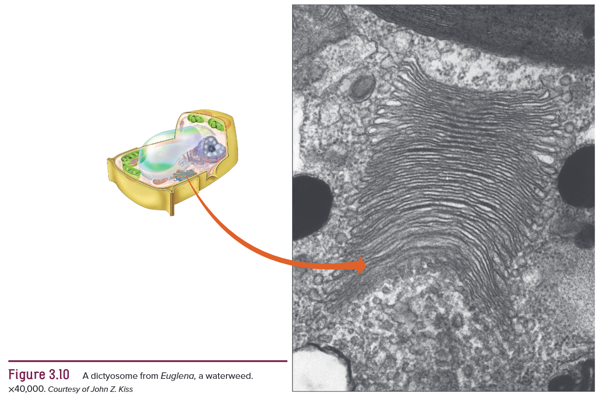

高尔基体参与修饰内质网合成并加工的糖蛋白中的糖类物质，还可合成复合多糖。这些物质聚集在从囊体边缘脱落形成的小囊泡内，囊泡移动至细胞膜并与之融合，将内含物分泌到细胞外，分泌物包含细胞壁多糖、花蜜及草本植物精油等。

用于蛋白质分选包装的酶由内质网合成，再经高尔基体进一步加工修饰。高尔基体如同细胞内的集散分拣与运输中枢，堪称细胞里的 “物流邮局”。

#### Plastids

绝大多数活的植物细胞都含有数类<b>质体</b>，其中<b>叶绿体</b>最为显眼<b> (图 3.11a)</b>。叶绿体形态大小各异，如水绵 (<i>Spirogyra</i>) 细胞中呈优美螺旋带状，丝藻 (<i>Ulothrix</i>) 等绿藻体内则呈手环状。而高等植物的叶绿体外形近似两个飞盘沿边缘贴合而成，纵切后轮廓形似橄榄球。

叶绿体内部存在大量由膜结构构成的<b>基粒</b>，形似双层膜堆叠而成的硬币垛。每个叶绿体中一般有 $40$ 至 $60$ 个基粒，彼此通过基质片层相连；单个基粒由两三片至上百个<b>类囊体</b>堆叠而成。类囊体实则是贯穿相连、相互连通的膜系统，悬浮于叶绿体液态基质中<b> (图 3.11b)</b>。类囊体膜上分布着<b>叶绿素</b>及各类光合色素。这些堆叠结构意义重大，光合作用的初步反应便发生在类囊体上。绿色植物借此利用光能，将水与二氧化碳转化为有机物，人类与各类动物的生存皆依赖于此。

叶绿体内的无色液态物质为<b>基质</b>，内含多种光合相关酶。叶绿体大部分生命活动受细胞核基因调控，但其自身也含有小型环状 $\ce{DNA}$，可编码合成部分光合相关蛋白；同时还具备 $\ce{RNA}$ 与核糖体，能自主合成部分蛋白质。

部分质体可储存蛋白质，烟草细胞便是典型例子。叶绿体基质中通常存有四五枚淀粉粒，此外还分布着油滴与各类酶。

<b>有色体 (<i>chromoplast</i>) </b>是高等植物部分细胞中含有的另一类质体。它与叶绿体大小相近，但形态差异较大，大多呈棱角状，部分可由叶绿体转变而来，转变过程中叶绿素逐渐消失。有色体因富含类胡萝卜素，呈现黄、橙、红等色泽，多见于成熟番茄、胡萝卜、红辣椒等植物有色器官中<b> (图 3.12)</b>。

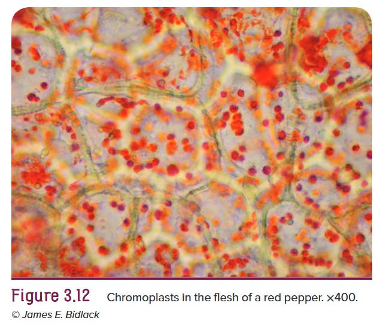

<b>白色体 (<i>leucoplast</i>) </b>是高等植物体内普遍存在的无色质体，包含合成淀粉的造粉体与合成油脂的造油体。部分白色体见光可转化为叶绿体，叶绿体也能逆向转变为白色体。

#### Mitochondria

<b>线粒体</b>常被称作细胞的动力车间，细胞通过呼吸作用在线粒体内分解有机物释放能量，以此维持细胞乃至整株植物的生命活动。线粒体还可重组碳骨架与脂肪酸链，合成多种有机物质。

线粒体形态多样，具有双层膜结构<b> (图 3.13)</b>，内膜向内折叠形成嵴，大幅增大内膜表面积，便于基质中的酶发挥作用。嵴的数量与线粒体总数可随细胞代谢状态发生改变。线粒体基质内含有 $\ce{DNA}$、$\ce{RNA}$、核糖体、蛋白质及各类可溶性物质。

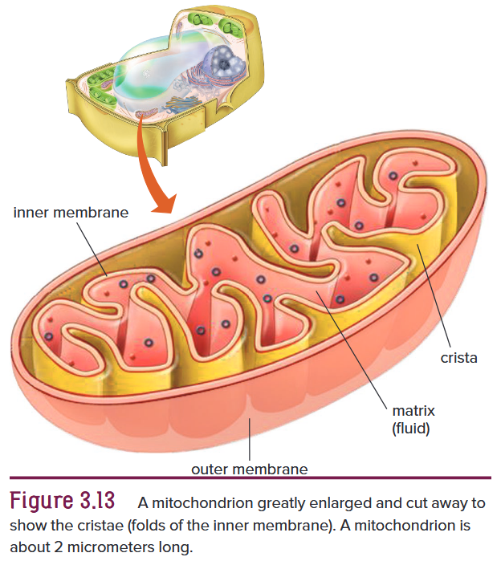

#### Microbodies

细胞质中遍布各类微小结构，使其整体呈颗粒状。其中包含一类单层膜包裹的球形细胞器——<b>微体</b>，内部含有特异性酶类。<b>过氧化物酶体</b>所含酶类可帮助部分植物在高温环境下进行光呼吸以维持生存；<b>乙醛酸循环体</b>则能在油料种子萌发时，助力脂肪转化为糖类。过氧化物酶体常与叶绿体相伴分布，乙醛酸循环体多聚集在线粒体附近。在植物生长发育的特定阶段，二者数量会随生理需求相应增多。

#### Vacuoles

成熟的植物活细胞中，九成及以上的细胞体积被一至两个大型中央<b>液泡</b>占据，液泡由<b>液泡膜</b>包裹而成。作为细胞原生质内层边界，液泡膜在结构与功能上均与细胞膜相近。

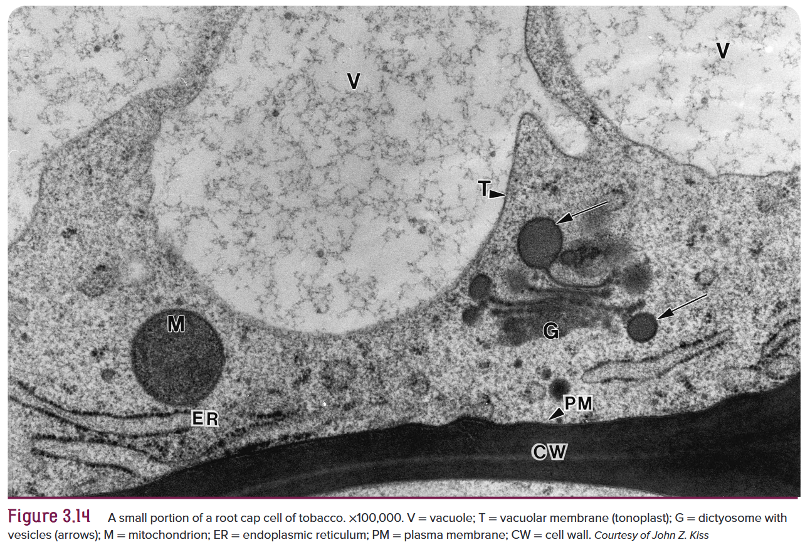

液泡功能繁多，可维持细胞膨压、调节 $\ce{pH}$，还能储存各类代谢物质与代谢废物。液泡内部充盈着呈弱酸性至中酸性的<b>细胞液</b>，内含无机盐、糖类、有机酸、少量可溶性蛋白等溶质，能够维持细胞渗透压。

细胞液中离子富集后，还常会析出大型代谢废物结晶。新生细胞内的液泡数量多、体积小，随着细胞逐渐成熟，小液泡相互融合、体积不断增大。除储存各类物质与离子外，液泡还参与胞内物质循环利用，亦可分解消化叶绿体、线粒体等衰老细胞器。

#### The Cytoskeleton

<b>细胞骨架</b>参与细胞内部物质运输与细胞形态构建，是由微管和微丝两种纤维构成的精密网状结构。

微管可调控细胞壁纤维素的沉积<b> (图 3.15)</b>，还参与细胞分裂、胞内细胞器移动，调控携带着高尔基体合成的细胞壁成分的囊泡运输，同时支配部分细胞鞭毛与纤毛的摆动运动。

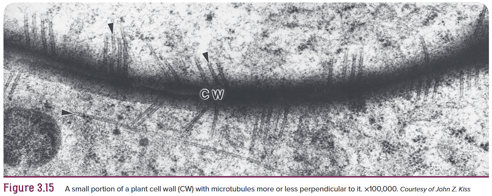

微管为无分支的中空细管状结构，形似细吸管，由微管蛋白构成，长短不一，直径多在 $15$ 至 $25$ 纳米之间，大多分布于细胞膜内侧。细胞分裂时形成的纺锤体与成膜体中也存在微管。

<b>微丝</b>几乎遍布所有细胞，在多细胞动物体内主要负责细胞收缩与运动。其粗细仅为微管的三到四倍，由细长蛋白质丝组成，平均直径 $6$ 纳米，常聚集成束。微丝参与所有活细胞的胞质环流。显微镜下可观察到细胞器随细胞质流动而移动，该过程利于胞内物质交换，也助力细胞间物质转运。

### Cellular Reproduction

#### The Cell Cycle

细胞分裂会经历一系列有序的生命进程，即<b>细胞周期</b>。该周期主要分为<b>间期</b>与<b>有丝分裂期</b>，其中有丝分裂又可细分为四个阶段<b> (图 3.16)</b>。细胞周期时长会因生物种类、细胞类型以及温度等环境条件产生差异。绝大多数情况下，细胞间期所占时长可达整个周期的九成及以上。由于实际分裂耗时很短，显微镜下观察到的细胞大多处于间期，处于分裂阶段的细胞反而不易发现。

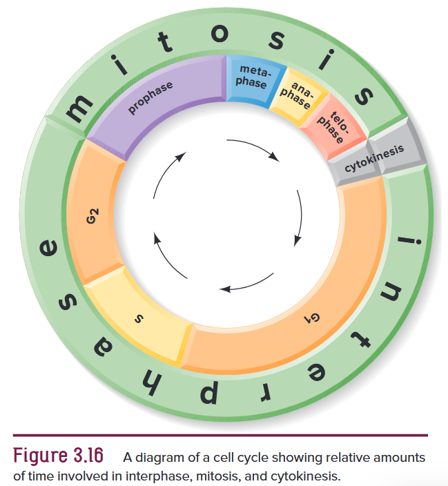 

#### Interphase
暂不进行分裂的活细胞处于间期，此阶段光学显微镜下无法观察到染色体，前文所介绍的细胞均处于该时期。间期是细胞周期中历时最久的阶段，也是多数细胞执行生理功能的主要时期。

过去人们认为未分裂的未成熟细胞处于静止状态，如今研究证实，间期会接连发生三段生命活动旺盛的时期，依次为 $\ce{G1}$ 期、$\ce{S}$ 期与 $\ce{G2}$ 期。

$\ce{G1}$ 期时长较长，紧随细胞核分裂结束后开启。此阶段细胞体积增大，同时合成核糖体、核糖核酸，以及调控后续 $\ce{S}$ 期启动或暂停的各类物质。$\ce{S}$ 期进行特有的 $\ce{DNA}$ 复制，$\ce{G2}$ 期内线粒体等细胞器完成分裂，合成微管等有丝分裂相关物质，染色体也在此阶段开始螺旋化、高度凝缩。

#### Mitosis

所有生物最初都由单个细胞发育而来。这个细胞很快进行分裂，形成两个新细胞，新细胞继续一分为二，这一过程即为有丝分裂，贯穿生物整个生命历程。有丝分裂能保证分裂形成的两个子细胞，均分间期完成复制的 $\ce{DNA}$ 及各类物质。严格来说，有丝分裂仅指细胞核分裂；除藻类、真菌等少数特例之外，<b>胞质分裂</b>通常伴随或紧随核分裂发生。

被子植物、裸子植物等高等植物的有丝分裂，集中发生在分生组织 (<i>meristem</i>)中。分生组织分布于根尖、茎尖，还有部分根茎表层内侧的维管形成层 (<i>vascular cambium</i>)；草本植物及多数木本植物中，维管形成层与外皮之间还存在木栓形成层 (<i>cork cambium</i>)。

进行有丝分裂时，无论细胞核内染色体数量多少，分裂流程均保持一致。经有丝分裂产生的子细胞，其染色体数目与 $\ce{DNA}$ 排布方式和亲代细胞完全相同。有丝分裂是连续的生理过程，全程历时短则五分钟，长可达数小时，常规时长为半小时至两三小时。分裂启动时，细胞膜内侧会形成环状的微管早前期带 (<i>preprophase band</i>)。

##### *Prophase*
<b>前期</b>主要特征<b> (图 3.17a)</b>: (1) 染色体不断缩短变粗，显现出由两条染色单体构成的形态; (2) 核膜逐渐解体，核仁随之消失。

前期耗时约等于其余三个分裂时期时长总和。前期开始前，细胞膜内侧由微管与微丝组成的早前期带，会环绕细胞核形成窄束结构。细胞核内最先出现细丝状染色体，标志着前期正式开启。染色体逐步螺旋折叠，愈发粗短，每条染色体的两条<b>姐妹染色单体</b>清晰可辨，二者结构一致且各自螺旋缠绕。染色质持续高度浓缩，最终形成短粗的杆状染色体，成对染色单体依靠<b>着丝粒</b>相连。

着丝粒位于染色体的缢缩部位<b> (图 3.18)</b>。每个着丝粒外侧都存在由蛋白质复合体构成的致密结构——<b>动粒</b>，纺锤丝会附着于动粒之上。着丝粒在染色体上位置不定，大多居于中部。部分染色体一端还会出现额外缢缩，形成球状突起，即随体 (<i>satellite</i>)。随体基部的缢缩暂无明确生理功能，但随体可作为特征，用于区分细胞核内不同类型的染色体。

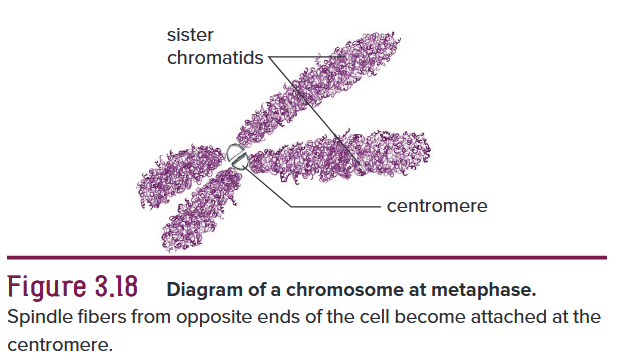

随着前期推进，核仁逐渐模糊直至彻底消失。前期末期，由微管构成的<b>纺锤丝</b>形成，呈弧形伸向细胞两极，纺锤丝末端固定于两极。另有纺锤丝从两极伸向细胞中央，附着在染色体着丝粒上。前期结束时，核膜完全解体，并融入内质网结构中。

真菌、藻类等低等生物以及动物细胞中，细胞核外侧的细胞质内存在一对桶状微小结构，即中心粒。中心粒外围辐射分布着微管，将周边胞质物质排布成星状射线，整体合称为星体。分裂前期伊始，星体一分为二，一半留在原位，另一半沿核膜移向细胞对侧。绝大多数高等植物细胞内均未发现中心粒。

##### *Metaphase*

<b>中期</b>的主要特征<b> (图 3.17b)</b>：染色体排列在细胞两极正中位置，环绕纺锤体排布于同一平面，该平面与早前期带所处位置一致。这个无形的环状平面垂直于纺锤体中轴线，类似地球赤道。

核膜解体后，原本细胞核所在区域出现纺锤丝，整体构成<b>纺锤体</b>。染色体有序排布，使所有着丝粒都处于细胞中央的赤道面上。中期结束时，连接姐妹染色单体的着丝粒纵向一分为二。

##### *Anaphase*

<b>后期</b>是分裂周期中历时最短的时期<b> (图 3.17c)</b>，此阶段每条染色体的姐妹染色单体彼此分离，并分别向细胞两极移动。

中期结束前，姐妹染色单体始终借着丝粒相连。进入后期，全部姐妹染色单体同步分开并向两极移动。着丝粒分裂后的染色单体改称<b>子染色体</b>，随着纺锤丝不断缩短，子染色体被牵引移向两极。纺锤丝从靠近细胞两极的一端持续解体，进而实现长度缩减。移动过程中着丝粒在前，染色体整体呈 $\ce{V}$ 字形在细胞质中行进。

所有染色体同步完成分离与迁移。实验证实，切断染色体附着的纺锤丝，染色体便无法向两极移动；而即便不存在纺锤体，染色单体依旧能够相互分开，只是无法完成定向迁移。

##### *Telophase*

<b>末期</b>五大主要特征<b> (图 3.17d)</b>: (1) 每一组子染色体外围重新形成核膜；(2) 子染色体逐渐伸长变细，最终恢复为弥散状态，难以分辨；(3) 核仁重新出现；(4) 大部分纺锤丝逐渐解体消失；(5) 细胞板开始形成。

后期与末期之间没有清晰界限，当细胞两极的子染色体群周围开始出现新核膜结构时，便标志着末期正式开始。新核膜逐步成型，染色体解旋变回前期起始时松散纤细的丝状形态，核仁也在特定染色体位点上重新形成。

末期阶段，纺锤体微管逐渐解体，在两个子细胞核之间的赤道区域，形成一束由微管构成的短纤维结构，呈桶状，称作成膜体。高尔基体产生内含细胞壁与细胞膜合成原料的囊泡。光学显微镜下这类囊泡形似微小液滴，在残存纺锤丝引导下向纺锤体赤道位置聚集。

微管将高尔基体囊泡聚拢，囊泡相互融合，形成扁平中空的<b>细胞板</b><b> (图 3.19)</b>。囊泡内的糖类物质逐步合成两层初生细胞壁以及胞间层，胞间层为两个新生<b>子细胞</b>所共有。细胞板不断向四周延展，最终与母细胞的细胞膜相连融合。

内质网片段在相互融合的细胞板囊泡之间，进而形成胞间连丝，它是穿过细胞壁、连通相邻细胞原生质的微细细胞质通道。

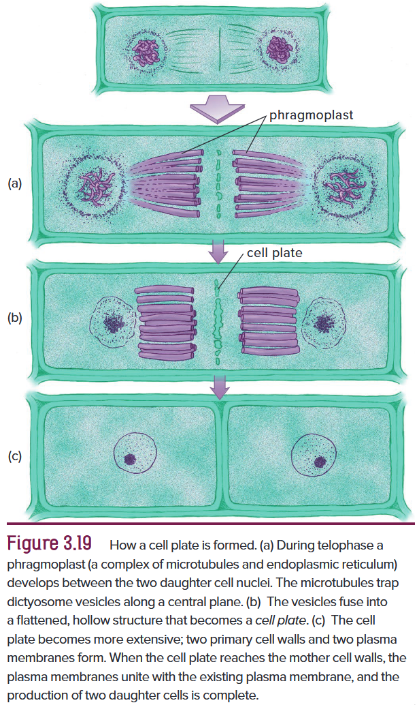

细胞板形成过程中，其两侧逐步生成新细胞膜，胞间层与细胞膜之间不断沉积新的细胞壁物质。新生初生细胞壁质地较为柔韧，直至细胞生长至成熟体积。细胞成熟后，还会继续沉积纤维素等物质，在初生细胞壁内侧形成次生细胞壁。少数情况下，细胞核完成分裂后并不会伴随细胞板的形成。

### Higher Plant Cells versus Animal Cells

所有动物都具备内骨骼、外骨骼或类骨骼结构来支撑机体组织。动物细胞无细胞壁，动物学家多将细胞膜视作细胞的外层边界。高等植物细胞拥有厚薄不一、质地坚硬的细胞壁，其骨架由纤维素纤维构成，还可通过细胞壁微孔形成的胞间连丝连通相邻原生质体。动物细胞不含细胞壁，因此也无胞间连丝。

高等植物细胞进行有丝分裂时，会在分裂末期形成细胞板完成分裂；而动物细胞分裂方式为细胞膜向内凹陷缢裂，不会形成细胞板。

植物细胞普遍具有质体，动物细胞则没有。植物细胞常具备大型液泡，而动物细胞的液泡体积微小，甚至不存在。