大多数植物主要包含三到四类器官：<b>根</b>、<b>茎</b>、<b>叶</b>，部分植物还具有<b>花</b>。这些器官均由组织构成，而组织指功能相近的细胞群。植物的任一器官都可能由多种不同组织组成，组织可依据自身结构、来源或功能进行划分。

## Meristematic Tissues

与动物不同，植物存在<b>分生组织 (<i>meristem</i>) </b>这类永久性生长区域，此处细胞会持续进行分裂<b> (图 4.1)</b>。新生细胞通常呈小型六面箱状结构，细胞核相对较大，多位于细胞中央，液泡微小甚至缺失。细胞成熟后，形态与大小会发生分化，且与其最终功能相匹配；液泡体积不断增大，往往可占据细胞体积的 $90\%$ 以上。

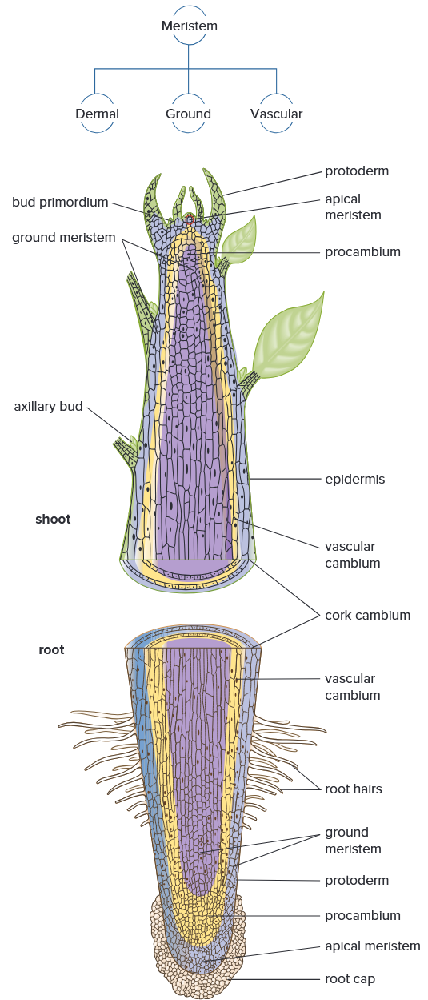

### Apical Meristems

<b>顶端分生组织 (<i>apical meristem</i>) </b>位于根和茎的顶端或近顶端处。该组织不断产生新细胞，使根、茎伸长，这类生长称为初生生长 (<i>primary growth</i>)。顶端分生组织会分化出三种初生分生组织，同时也会形成幼叶与芽。这三类初生分生组织分别是<b>原表皮 (<i>protoderm</i>)</b>、<b>基本分生组织 (<i>ground meristem</i>) </b>和<b>原形成层 (<i>procambium</i>)</b>，它们分化形成的组织统称为<b>初生组织</b>。

### Lateral Meristems

维管形成层 (<i>vascular cambium</i>) 和 木栓形成层 (<i>cork cambium</i>) 属于<b>侧生分生组织</b>，其产生的组织可使根和茎增粗，该生长过程称为次生生长 (<i>secondary growth</i>)。

#### *Vascular Cambium*

<b>维管形成层</b>（常简称为形成层）产生的次生组织主要起支撑与输导作用。在多年生 (<i>perennial</i>) 植物及多数一年生植物中，形成层呈薄壁筒状，细胞多为砖形，沿根、茎全长分布。除顶端区域外，形成层园筒常产生分枝，其所分化的组织是植物茎干、根系增粗的主要原因。形成层中保留分裂能力的细胞称为原始细胞 (<i>initial</i>)，由其分裂产生的子细胞则为衍生细胞 (<i>derivative</i>)。

#### *Cork Cambium*

<b>木栓形成层</b>与维管形成层类似，在木本 (<i>woody</i>) 植物的根和茎中呈薄筒状纵向延伸。它位于维管形成层外侧、树皮 (<i>bark</i>) 内层，树皮便由其分化形成。维管形成层与木栓形成层所产生的组织被称为次生组织，这类组织在初生组织发育成熟后才逐步形成。

#### *Intercalary Meristems*

禾本科 (<i>grass</i>) 及近缘植物既无维管形成层，也无木栓形成层。但它们具备顶端分生组织，且在<b>节 (<i>node</i>)</b>（叶片着生部位）附近存在另一种分生组织 ——居间分生组织。居间分生组织在茎上呈间断分布，和顶端分生组织产生的组织一样，可促使茎秆伸长。

## Tissues Produced by Meristems

植物组织可分为两类：仅由一种细胞构成的简单组织，以及由两种及以上细胞组成的复合组织。

### Simple Tissues
#### *Parenchyma*

<b>薄壁组织 (<i>parenchyma</i>) </b>由薄壁细胞构成<b> (图 4.2)</b>。这类细胞是高等植物中数量最多的细胞类型，几乎遍布植株各个主要部位。薄壁细胞初形成时大致呈球形，当细胞相互挤压，薄而柔韧的细胞壁会在接触处被压扁，因此细胞形态、大小各不相同，多数为十四面体。其液泡体积较大，细胞内常含有淀粉粒、油脂、单宁（鞣质或染色物质）、晶体及各类分泌物。

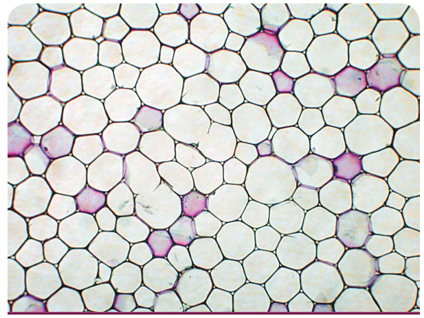

薄壁细胞之间通常存在间隙。睡莲 (<i>water lily</i>) 等水生植物的胞间隙十分发达，在植株内部连成网状。这类具有大量连通气腔的薄壁组织，称为通气组织 (<i>aerenchyma</i>) 。

含有大量叶绿体的薄壁细胞统称为<b>同化组织 (<i>chlorenchyma</i>) </b>。同化组织主要执行光合作用，而不含叶绿体的薄壁组织大多负责储存养分与水分。例如，多数果蔬柔软可食用的部分，主要由薄壁细胞构成。

部分薄壁细胞的内壁会形成不规则突起，大幅增加质膜表面积。这类细胞称为传递细胞，多见于花的蜜腺以及食虫植物中，主要负责在相邻细胞间转运可溶性物质。

薄壁细胞成熟后，即便脱离分生组织已久，仍具备分裂能力。扦插茎段 (<i>cutting</i>) 生根时，正是薄壁细胞率先分裂并形成新根。植物受损伤时，薄壁细胞的增殖能力对组织修复尤为关键。

#### *Collenchyma*

<b>厚角组织 (<i>collenchyma</i>) </b>细胞<b> (图 4.3) </b>和薄壁细胞一样，具有细胞质，且寿命较长。其细胞壁整体更厚，厚度分布也不均匀。这种不均一性，主要是细胞角隅处初生壁额外加厚所致，部分细胞的内外切向壁 (<i>tangential wall</i>) 以及胞间隙相邻区域也会出现壁加厚现象。

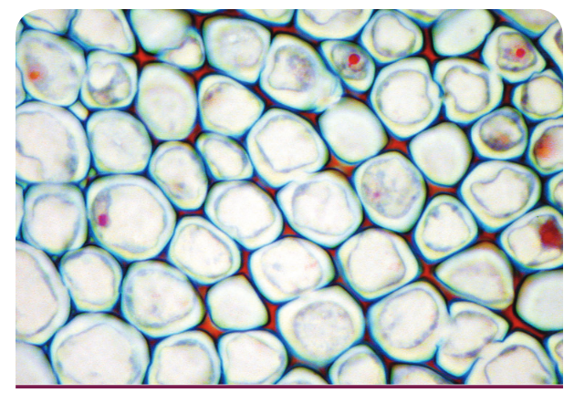

厚角细胞常分布于表皮内侧，细胞形态一般长大于宽，细胞壁兼具韧性与强度。它可为幼嫩器官和成熟器官（如叶片、花部）提供韧性支撑。

#### Sclerenchyma

<b>厚壁组织 (<i>sclerenchyma</i>) </b>细胞具有厚实坚韧的次生壁，壁内通常沉积木质素 (<i>lignin</i>)。这类细胞成熟后大多死亡，主要起支持作用。厚壁组织分为<b>石细胞 (<i>sclereid</i>) </b>和<b>纤维</b>两类。

石细胞<b> (图 4.4) </b>可零散分布于其他组织中。比如梨果肉略带沙质感，就是成团石细胞所致；坚果外壳、桃等核果的果核坚硬，也源于石细胞。石细胞形态近等径，除散生分布外，有时也会集中形成特定区域。

纤维<b> (图 4.5) </b>可与根、茎、叶、果实内多种组织相伴而生。其细胞长径远大于宽径，中央仅有狭小的细胞腔。

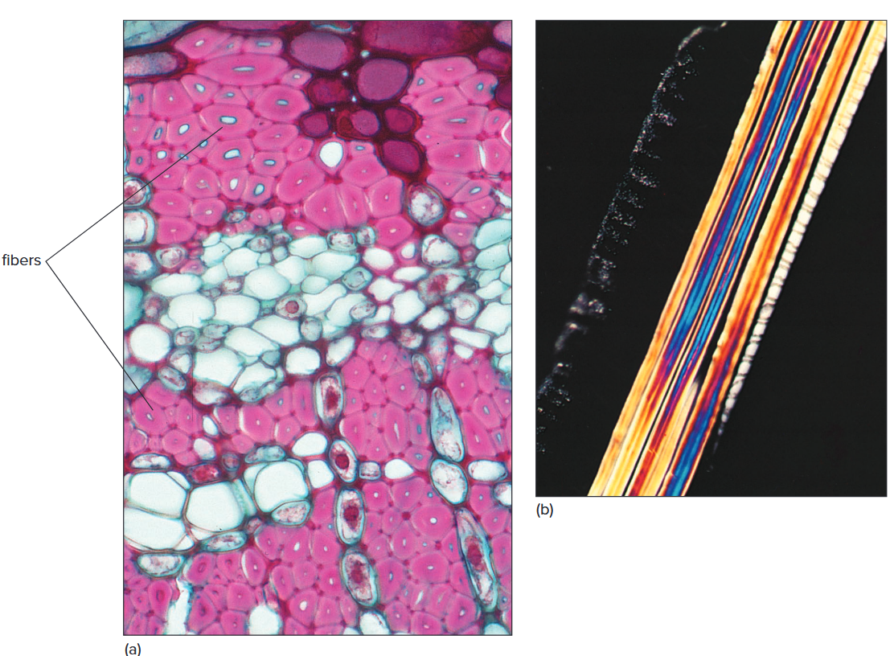

### Complex Tissues

以上介绍的组织大多由单一细胞构成，而少数重要组织始终由两种及以上细胞组成，这类组织称为复合组织。

植物中最主要的两类复合组织为木质部 (<i>xylem</i>) 与韧皮部 (<i>phloem</i>)，主要负责在植株体内运输水分、矿质离子以及可溶性有机物（糖类）。部分复合组织由顶端分生组织分化而来，木本植物的多数复合组织则由维管形成层产生，也常统称维管组织。

表皮 (<i>epidermi</i>) 覆盖植物所有器官，起保护作用，主要由薄壁细胞或类薄壁细胞构成，同时还含有多种特化细胞。周皮 (<i>perderm</i>) 构成木本植物的外层树皮，主要由木栓细胞组成。

#### *Xylem*

<b>木质部</b>因细胞壁较厚，也被称作 “输导型厚壁组织”，是植物输导与贮藏系统的重要组成部分，也是根吸收的水分和矿质元素在各器官间运输的主要组织。木质部由薄壁细胞、纤维、导管、管胞 (<i>tracheid</i>) 和射线细胞共同构成<b> (图 4.6)</b>。

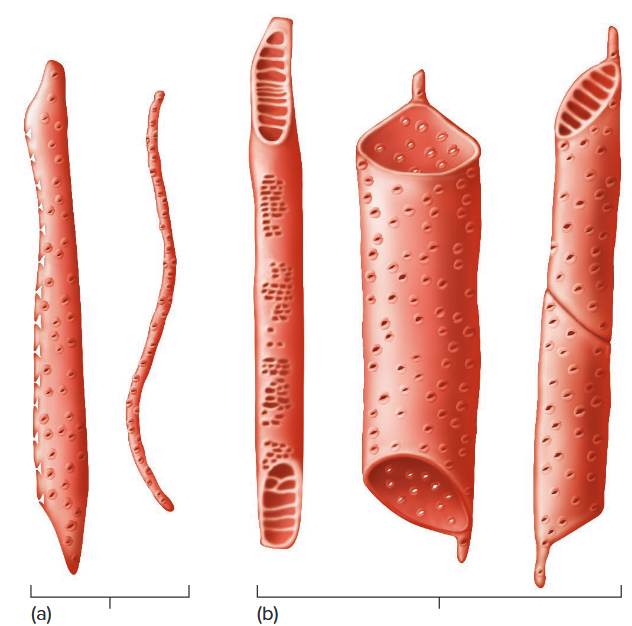

<b>导管</b>是由一个个<b>导管分子</b>首尾相连形成的长管状结构，这类细胞具加厚的次生壁，两端贯通。导管分子的次生壁呈不规则加厚，且会随细胞成熟呈现出不同纹饰。相邻导管分子的端壁形成样式多样的<b>穿孔板</b>。穿孔板不会阻碍导管内的物质运输。

<b>管胞</b>与导管分子相似，成熟后均为死细胞，次生壁较厚，细胞两端渐尖，彼此相互叠生。管胞不像导管那样具有贯通的穿孔，但相邻管胞接触处通常成对分布纹孔 (<i>pit</i>)<b>(图 4.7)</b>。

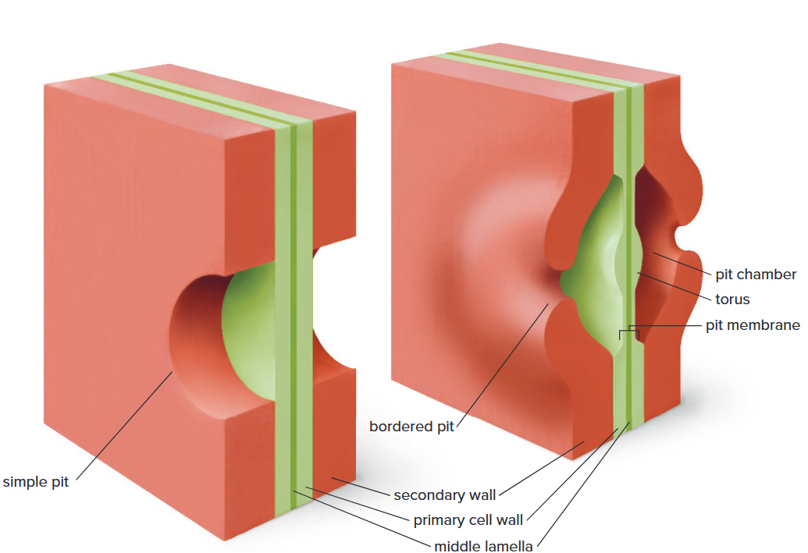

纹孔是未沉积次生壁的区域，水分可经纹孔在细胞间流通。部分植物具有具缘纹孔 (<i>bordered pit</i>)，外观形似圆环，由纹孔膜和加厚的<b>纹孔塞 (<i>torus</i>) </b>构成。<b>图 4.8 </b>展示了部分植物中，纹孔对如何调控相邻细胞间的水分转运。

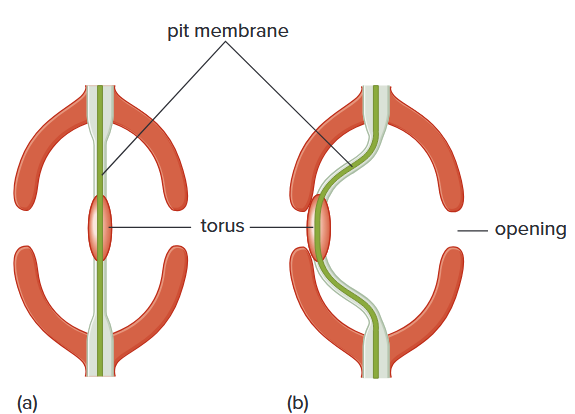

在针叶树 (<i>cone-bearing tree</i>) 及部分非开花植物中，木质部几乎完全由管胞构成。许多管胞以及导管分子的壁上都具有螺旋加厚 (<i>spiral thickening</i>)，这些结构在光学显微镜下很容易观察到<b> (图 4.9)</b>。

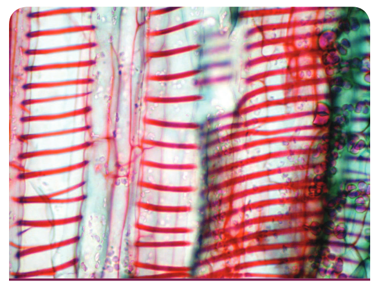

通过木质部的大部分运输是向上的，但也有一部分是侧向的。侧向传导发生在<b>木射线 (<i>ray</i>) </b>中。射线细胞也起储存食物的作用，它们实际上是由维管形成层中的特殊射线原始细胞以水平行形式产生的长寿命薄壁细胞。在木本植物中，木射线从茎和根的中心像车轮辐条一样向外辐射。

#### *Phloem*

<b>韧皮部</b><b> (图 4.10) </b>负责将光合作用制造的可溶性有机物（主要是糖类）运输至植株各处，其组成细胞大多无次生壁。

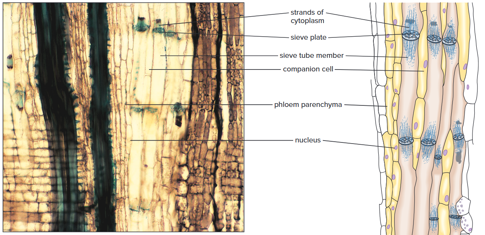

<b>筛管分子 (<i>sieve tube element</i>) </b>体积较大，形态近圆筒状，与之紧密相伴的是形态狭长、两端渐尖的<b>伴胞 (<i>companion cell</i>) </b>。韧皮部与木质部同源，均由形成层原始细胞分化而来，组织内还常含有纤维、薄壁细胞及射线细胞。

筛管分子首尾相连形成<b>筛管</b>。它和导管分子不同，端壁并无大型穿孔，而是布满小孔，细胞质可通过孔洞在细胞间连通，这类多孔结构即为<b>筛板</b>。

筛管分子成熟后细胞核消失，但其细胞质仍活跃地转运植株体内的可溶性有机物。伴胞与相邻筛管分子联系紧密，协助完成有机物的运输。

活的筛管分子内含有胼胝质这种多糖聚合物。细胞内维持正常压力时，胼胝质可保持溶解状态。若蚜虫等昆虫造成细胞损伤，胞内压力下降，胼胝质便会析出。随后胼胝质与韧皮蛋白一同转运至邻近筛板，形成胼胝质塞，阻止筛管内汁液外流。

蕨类植物和针叶树中存在筛胞。它与筛管分子相似，细胞两端相互叠生，并不形成贯通的长管道。筛胞成熟后同样无细胞核，但无伴胞，取而代之的是蛋白细胞 (<i>albuminous cell</i>)，其功能与伴胞一致。

#### *Epidermis*

所有幼嫩植物器官的最外层细胞称为<b>表皮</b>。表皮直接与外界环境接触，常分化出多种特化细胞以适应环境。表皮通常为单层细胞；部分植物的气生根 (<i>aerial root</i>) 表皮为多层细胞，外层细胞形似海绵。

多数表皮细胞会在细胞壁外层及表面分泌脂类物质<b>角质 (<i>cutin</i>)</b>，角质形成保护层<b>角质层</b><b> (图 4.11)</b>。角质层以及表皮分泌于其表面的蜡质，厚度很大程度上决定了细胞壁的水分蒸发量。

叶片表皮细胞的垂周壁形态多样，显微镜下形似拼图碎片。根尖后方的表皮细胞会向外突起形成根毛 (<i>root hair</i>)，大幅增加根系吸收面积。

植物地上部分表皮还生有另一类附属物，即<b>毛状体 (<i>trichome</i>)</b>，由单个或多个细胞构成<b> (图 4.12)</b>。

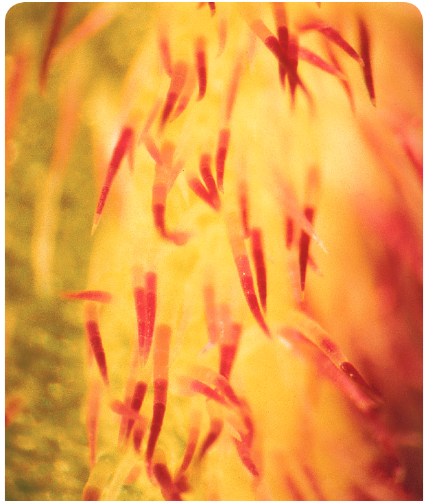

叶片表面分布着大量小孔 ——<b>气孔</b>，其两侧由特化的表皮细胞<b>保卫细胞</b>围成。保卫细胞形态与普通表皮细胞不同，且含有叶绿体。部分表皮细胞可特化为<b>腺细胞</b>，分泌防护类物质；也可分化为表皮毛，用以减少水分散失或驱避植食生物<b> (图 4.13)</b>。

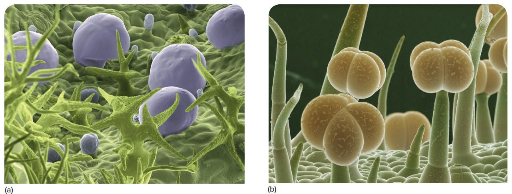

#### *Periderm*

木本植物的茎、根增粗生长时，木栓形成层会产生新组织，原表皮随之脱落，由<b>周皮</b>取而代之。周皮构成树干与根部的外皮（树皮），主要由形态规整、呈方盒状的木栓细胞组成，这类细胞成熟后死亡。

木栓细胞存活阶段会向细胞壁分泌脂类物质<b>木栓质 (<i>suberin</i>)</b>，使细胞具备不透水性，可保护内部韧皮部等组织，抵御失水、机械损伤与低温冻害。

木栓形成层局部会分化出排列疏松、细胞壁不含木栓质的薄壁细胞群，这类组织向外凸起形成<b>皮孔 (<i>lenticel</i>)</b><b>(图 4.14)</b>，是茎内部与外界空气进行气体交换的通道。树木树皮的裂隙底部通常都分布有皮孔。

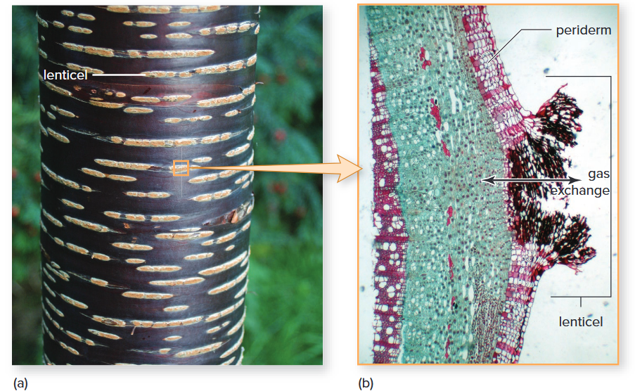

#### *Secretory Cells and Tissues*

所有细胞都会产生部分物质，这类物质若在胞内堆积，会损伤细胞质。它们要么被分隔在细胞特定区域，要么被排出植物体外。

<b>分泌细胞</b>可单独发挥作用，也可构成<b>分泌组织</b>。这类细胞与组织多起源于薄壁组织，在植物体内分布广泛。