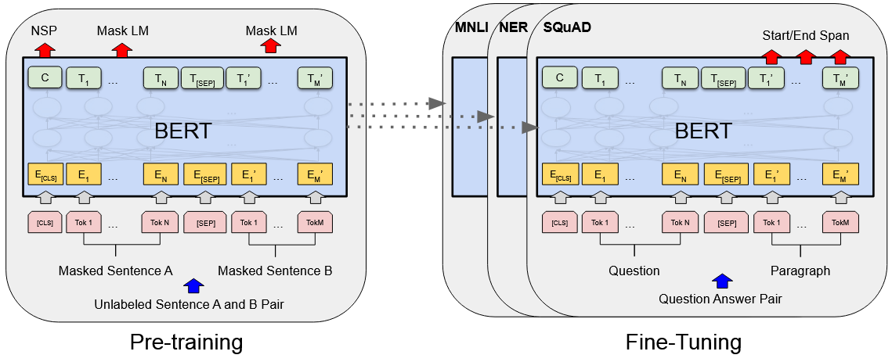
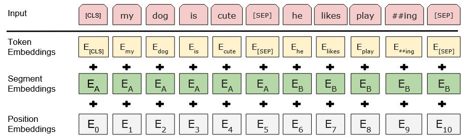
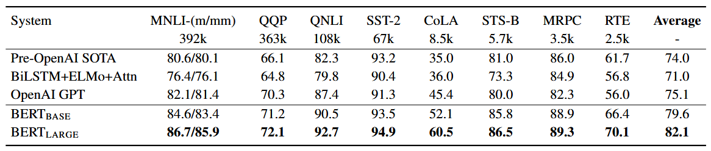
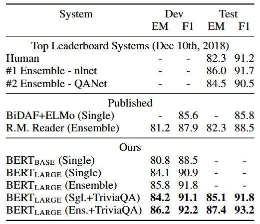
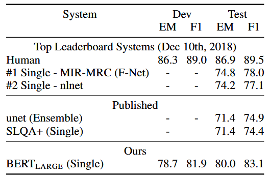
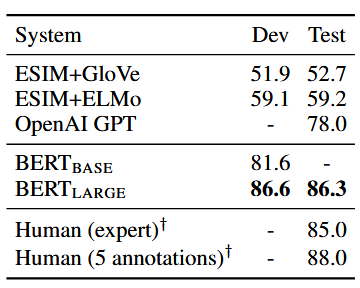
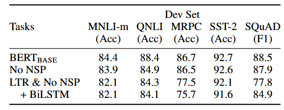
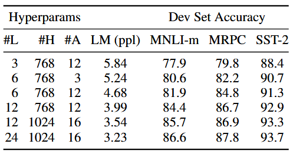

:::note[META]
**DOI**: `10.48550/arXiv.1810.04805` 
**Date**: `2019/05/24`
:::

## 1 问题

语言模型预训练已被证实能够有效提升多项 `NLP` 任务的效果。将预训练语言表征应用于下游任务主要有两种主流方式：*基于特征的方法*与*微调方法*。以 `ELMo` 为代表的特征式方法，会设计专属任务架构，并把预训练表征当作额外特征使用；而以 `GPT` 为代表的微调式方法，仅引入少量任务专属参数，直接对全部预训练参数进行微调以适配下游任务。两种方法的预训练目标一致，均采用单向语言模型学习通用语言表征。

我们认为现有技术未能充分发挥预训练表征的能力，微调方法尤为明显。其主要局限在于传统语言模型均为单向结构，这也限制了预训练阶段可用的模型架构。例如 `GPT` 采用从左至右的架构，在 `Transformer` 自注意力层中，每个词元只能关注前文内容。这种设计对句子级任务效果欠佳，而在问答等 `token` 级任务中更是弊端显著——这类任务必须融合双向上下文信息。

本文提出 <b>BERT (Bidirectional Encoder Representations from Transformers)</b> 模型来提升预训练效果：`BERT` 使用掩码语言模型 `(MLM)` 作为预训练目标，解决了上述单向建模的局限。`MLM` 会随机对输入中的一些 `token` 进行掩码，模型仅依据上下文预测被遮蔽单词原本的词汇 `id`。

不同于从左至右的语言模型预训练，`MLM` 能够融合左右两侧上下文，以此实现 `Transformer` 的深度双向预训练。预训练完成后，仅需额外添加一层输出层并微调，就能在问答、语义推理等各类任务上取得顶尖效果，无需针对任务大幅改动模型结构。

文章的贡献主要有以下几点：
- 证明了语言表征双向预训练的重要性
- 预训练表征可大幅降低对复杂任务专属架构的依赖
- `BERT` 在十一项 `NLP` 任务上刷新了 `SoTA`

## 2 相关工作

`BERT` 的框架包含两步：*预训练*和*微调*。在预训练阶段，模型通过无标签数据在不同的预训练任务上训练。在微调阶段，`BERT` 模型首先通过预训练参数进行初始化，所有的参数在之后通过下游任务的标签数据进行微调。每个下游任务都有着不同的微调模型，尽管它们的初始化参数可能是相同的。

`BERT` 的一大特色是架构可适配各类任务，预训练架构与下游任务所用架构几乎没有差别。

`BERT` 的模型架构是一个多层双向 `Transformer encoder`，本文实现方案与原版基本一致，在之前已有介绍。本文将层数记作 $L$，隐藏层大小为 $H$，自注意力头数是 $A$，主要通过两个大小的模型来得到实验结果：$\mathbf {BERT}_{\mathbf{BASE}}$ ($L=12,H=768,A=12$, 总参数 $110\ce M$) 和 $\mathbf {BERT}_{\mathbf{LARGE}}$ ($L=24,H=1024,A=16$, 总参数 $340\ce M$)。

为让 `BERT` 适配各类下游任务，本文设计的输入表征可在单个 `token` 序列中清晰区分单句与句子对（如问答组合）。本文中“句子”泛指任意连续文本片段，并非严格语言学定义上的句子；“序列”则指输入 `BERT` 的 `token` 序列，可由单句或两句拼接而成。

模型采用 `WordPiece` 嵌入，词汇表包含 $3$ 万个词元。每个序列的首个 `token` 均为特殊分类标记 `[CLS]`，该 `token` 对应的最终隐藏状态将作为分类任务的整体序列表征。句子对会拼接为单个序列，并通过两种方式区分两句内容：一是使用特殊分隔标记 `[SEP]` 进行隔断；二是为每个 `token` 添加可学习嵌入，用以标识其所属句子。如<b>图 1 </b>所示，输入嵌入记作 $E$，特殊标记 `[CLS]` 的最终隐藏向量为 $C \in \mathbb{R}^H$，第 $i$ 个输入 `token` 的最终隐藏向量记作 $T_i \in \mathbb{R}^H$。

对一个给定的输入，它的输入表征由相应的 `token`，`segment` 与位置嵌入三者相加得到，该组合方式如<b>图 2 </b>所示。

### 2.1 BERT 的预训练

本文不使用传统的从左至右或从右至左的预训练方法，而是通过下述两个任务进行：

**任务 1：掩码 LM**。为训练深度双向表征，我们随机遮蔽输入中一定比例的 `token` 并对其进行预测，该方法即 `MLM`，学界也常称其为完形填空任务。模型将掩码 `token` 对应的最终隐藏向量输入词汇表上的 `Softmax` 层完成预测，与传统语言模型做法一致。本实验中，每个序列会随机选取 $15\%$ 的 `WordPiece token` 进行遮蔽。不同于降噪自编码器，该方案仅预测被遮蔽的词汇，而非还原全部输入内容。

该方式虽能实现双向预训练，但会造成预训练与微调阶段的差异——微调过程中并不会出现 `[MASK]` `token`。为缓解这一问题，我们不会将被遮蔽词元统一替换为 `[MASK]`。数据生成时随机选取 $15\%$ 的词元位置作为预测目标，若第 $i$ 个词元被选中，则按如下规则处理：$80\%$ 的概率替换为 `[MASK]`，$10\%$ 的概率替换为随机 `token`，剩余 $10\%$ 则保留原 `token`。然后模型利用 $T_i$，结合交叉熵损失预测原始 `token`。

> 预训练的输入文本中含有 `[MASK]`，而微调时真实输入是正常文本，不含 `[MASK]`

**任务2：下一句预测**。问答`(QA)`、自然语言推理`(NLI)` 等诸多重要下游任务，都需要理解句子间的关联，而单纯的语言建模无法直接学习这类信息。为此，本文增设二分类的下一句预测任务开展预训练，该任务可基于单语语料轻松构建。具体而言，在选取预训练样本的句子 `A` 与句子 `B` 时，有 $50\%$ 的概率 `B` 是 `A` 的真实后续句子（标记为 `IsNext`），另外 $50\%$ 的概率 `B` 为语料中随机抽取的句子（标记为 `NotNext`）。如<b>图 1 </b>所示，模型借助 `[CLS]` 对应的向量 `C` 完成下一句预测任务。

### 2.2 BERT 的微调

微调过程十分简便。得益于 `Transformer` 的自注意力机制，只需调整输入与输出，`BERT` 便可适配各类单文本或文本对下游任务。以往处理文本对时，通常先分别编码两段文本，再引入双向交叉注意力。而 `BERT` 利用自注意力将两个阶段合二为一：对拼接后的文本对做自注意力计算，本身就实现了两句间的双向交叉注意力。

> 以前在处理时将句子 `A `和 `B` 分别编码后使用交叉注意力进行比对
> `BERT` 通过 `[SEP]` 将句子拼接成一整串，通过自注意力实现双向信息交互

针对不同任务，只需为 `BERT` 接入对应输入与输出，并对全部参数进行端到端微调。在输入层面，预训练阶段的句子 `A、B` 可对应多种任务形式：(1) 复述任务`(paraphrasing)` 的句子对、(2) 文本蕴含任务`(entailment)` 的假设-前提对、(3) 问答任务的问题-段落对；而文本分类、序列标注这类任务，则可看作单文本搭配空内容的特殊句子对 `text-∅`。在输出层面，序列标注、问答等 `token` 级任务会使用各词元表征接入输出层；文本蕴含、情感分析等分类任务，则借助 `[CLS]` 表征完成预测。

## 3 结论

### 3.1 GLUE

基于 `GLUE(General Language Understanding Evaluation)` 多任务评测集开展实验，按 `BERT` 标准格式构造单句/句子对输入，取 `[CLS]` 向量作为全局表征；微调仅新增分类层权重，主体模型结构不变。批次大小取 $32$，统一微调 $3$ 轮。结果如<b>表 1</b>:

$\ce{BERT}_{\ce{BASE}}$、$\ce{BERT}_{\ce{LARGE}}$ 全面超越此前最优模型，平均准确率分别提升 $4.5\%$、$7.0\%$。与仅注意力架构不同的 `GPT` 相比，`BERT` 优势显著：以 `MNLI` 任务为例，绝对准确率提升 $4.6\%$。

### 3.2 SQuAD v1.1

`SQuAD(Stanford Question Answering Dataset)` 包含 $10$ 万条众包问答样本。该任务给定一个问题以及一段取自维基百科、内含答案的文本，要求在文本中定位出答案所在的连续片段。<b>表 2 </b>对各个模型的结果进行了对比：

问答任务将问题与文本拼接成一个完整输入序列，微调阶段仅新增两个向量：起始向量 $S \in \mathbb R^{H}$ 和 $E \in \mathbb R^{H}$。第 $i$ 个 `token` 作为答案起始位置的概率，由该词元的输出向量与 $S$ 做点积，再经过整段文本的 `Softmax` 计算得到，终止位置计算与之类似。对于第 `i` 个 `token` 到第 `j` 个 `token` 的答案候选片段，其得分公式为 $S \cdot T_i + E \cdot T_j$，最终选取得分最高的片段作为预测答案。正确起始、终止位置的对数似然损失之和作为训练目标。

本文集成模型的 $\ce F1$ 值比榜单最优模型高出 $1.5$ 个百分点，单模型则高出 $1.3$ 个百分点。

### 3.3 SQuAD v2.0

与 `v1.1` 对比加入无答案样本，此时 `BERT` 除了预测答案起止位置，还要额外判断当前样本是否有答案，难度更高。批次大小 $48$，训练两轮，比较结果如<b>表 3</b>，`F1` 值提高了 $5.1$ 个百分点。

### 3.4 SWAG

`SWAG(Situations With Adversarial Generations)` 包含 $11.3$ 万个句子补全样本，用于评测基于现实场景的常识推理能力。任务形式为：给出一个起始句子，从四个选项中选出逻辑最合理的后续内容。

针对该数据集微调时，我们将原句作为句 `A`、每个候选后续句分别作为句 `B`，拼接生成四组独立输入序列。微调仅新增一个权重向量，将其与 `[CLS]` 对应的向量做点积，得到各选项得分，再通过 `Softmax` 完成分类。训练 $3$ 轮，批次大小为 $16$:

$\ce{BERT}_{\ce{LARGE}}$ 相较原论文基线模型 `ESIM+ELMo` 准确率提升 $27.1\%$，较 `OpenAI GPT` 提升 $8.3\%$。

### 3.5 消融实验
#### 3.5.1 预训练任务的效果
- 保留双向 `MLM` 预训练，删除 `NSP` 任务，涉及句子关系理解的任务（问答推理、文本蕴含、抽取式问答）效果大幅下降;
- 使用传统从左到右单向语言模型训练 + 微调，删除 `NSP` 任务，纯单向 `LTR` 模型整体表现差，尤其问答任务短板明显。即便给单向模型加装 `BiLSTM` 补足双向信息，问答效果略有提升，但通用语言理解任务反而变差，且整体依旧比不上原生双向 `BERT`。

#### 3.5.2 模型大小的效果
训练多组 `BERT` 模型，分别调整网络层数、隐藏单元数与注意力头数，其余超参数和训练流程均与前文保持一致:

模型规模越大，在全部四个数据集上的准确率均稳步提升。本文首次有力证明：只要完成充分预训练，将模型拓展至超大规模，同样能在数据量极少的小型任务上取得明显增益。

