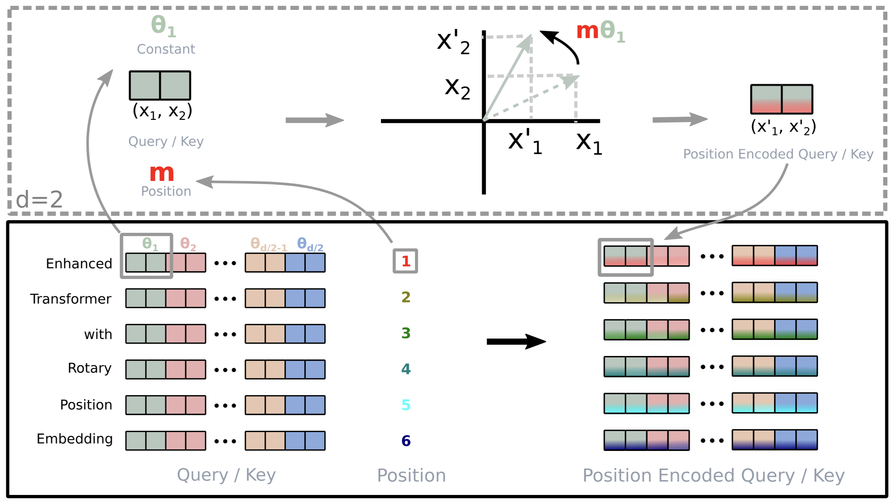

:::note[META]
**DOI**: `10.1016/j.neucom.2023.127063` 
**Date**: `2021/04/20`
:::

## 1 问题

与 `CNN`, `RNN` 不同，预训练语言模型使用自注意力机制来从给定的语料库中来捕获上下文的语义学表示，但是无法天然感知序列词序，因此必须额外引入位置编码。目前的两类主流位置编码包括绝对位置编码和相对位置编码，大多直接将位置信息融合进上下文表征，无法适配线性自注意力结构。

本文提出了一种新的方法——旋转位置编码 (`RoPE`)，将位置信息融入 `PLM` 的学习过程。具体而言，`RoPE` 利用旋转矩阵对绝对位置进行编码，同时在自注意力表达式中显式引入相对位置依赖关系。值得注意的是，所提出的 `RoPE` 相比现有方法具备诸多优良特性：支持任意序列长度、`token` 间依赖随相对距离增大而衰减，并且能够为线性自注意力配备相对位置编码能力。在多个长文本分类基准数据集上的实验结果表明，搭载旋转位置编码的 `Transformer`（`RoFormer`）相比基线模型取得更优性能，验证了 `RoPE` 方法的有效性。

## 2. 符号体系

令 $\ce S_N = \{w_i\}_{i=1}^N$ 为由 $N$ 个输入 `token` 构成的序列，其中 $w_i$ 为第 $i$ 个元素。$\ce S_N$ 对应的嵌入记为 $\ce E_N = \{x_i\}_{i=1}^N$，式中 $x_i \in \mathbb R^d$是 $w_i$ 对应的 $d$ 维嵌入向量，不含位置信息。自注意力机制首先将位置信息融入词嵌入，并将其转换为 `QKV`:

$$ 
\begin{aligned} 
\boldsymbol q_m &= f_q(\boldsymbol x_m, m) \\ 
\boldsymbol k_n &= f_k(\boldsymbol x_n, n) \\ 
\boldsymbol v_n &= f_v(\boldsymbol x_n, n)  
\end{aligned} \tag{1}
$$
式中的 $\mathbf q_m, \mathbf k_n$ 和 $\mathbf v_n$ 分别通过 $f_q, f_k, f_v$ 融入第 $m$ 和第 $n$ 个位置信息，随后利用 `Q` 与 `V` 计算注意力权重，输出结果则为对值表征的加权求和:

$$ 
\begin{aligned} 
a_{m,n} &= \frac{\exp\left(\frac{\boldsymbol{q}_m^\top \boldsymbol{k}_n}{\sqrt{d}}\right)}{\sum_{j=1}^{N}\exp\left(\frac{\boldsymbol{q}_m^\top \boldsymbol{k}_j}{\sqrt{d}}\right)} \\ \boldsymbol{o}_m &= \sum_{n=1}^{N} a_{m,n} \boldsymbol{v}_n 
\end{aligned} \tag{2}
$$

基于 `Transformer` 的语言建模通常借助自注意力机制利用各个 `token` 的位置信息。如 <b>式(2)</b> 所示，$\boldsymbol{q}_m^\top \boldsymbol{k}_n$ 一般用于实现不同位置词元之间的信息传递。为引入相对位置信息，我们通过函数 $g$ 计算 $\boldsymbol{q}_m$ 与 $\boldsymbol{k}_n$ 的内积，该函数仅以词嵌入 $\boldsymbol{x}_m$、$\boldsymbol{x}_n$ 以及二者的相对位置 $m-n$ 作为输入变量。本质上，我们希望该内积仅以相对形式对位置信息进行编码：

$$ 
\left\langle f_q(\boldsymbol x_m, m), f_k(\boldsymbol x_n, n) \right\rangle = g(\boldsymbol x_m, \boldsymbol x_n, m-n) \tag{3}
$$

最终目标是找到一种等价编码机制，求解函数 $f_q(x_m,m)$ 与 $f_k(x_n,n)$ 使其满足上述关系。

## 3 方法
### 3.1 RoPE
#### 3.1.1 2D 场景
首先以简单的 $d=2$ 的场景为例，利用二维平面上向量的几何性质及其复数形式，<b>式(3)</b> 的一组解如下：

$$ 
\begin{aligned} 
f_q(\boldsymbol{x}_m, m) &= (\boldsymbol{W}_q \boldsymbol{x}_m) e^{im\theta} \\ 
f_k(\boldsymbol{x}_n, n) &= (\boldsymbol{W}_k \boldsymbol{x}_n) e^{in\theta} \\ 
g(\boldsymbol{x}_m, \boldsymbol{x}_n, m-n) &= \mathrm{Re}\left[ (\boldsymbol{W}_q \boldsymbol{x}_m)(\boldsymbol{W}_k \boldsymbol{x}_n)^* e^{i(m-n)\theta} \right] 
\end{aligned} \tag{4}
$$

其中 $\ce{Re}[\cdot]$ 是实部，$(\boldsymbol{W}_k \boldsymbol{x}_n)^*$ 是 $(\boldsymbol{W}_k \boldsymbol{x}_n)$ 的共轭复数，$\theta$ 是预设的一个非 $0$ 常量。我们还可以将 $f_{\{q,k\}}$ 写成矩阵乘法形式：

$$ 
f_{\{q,k\}}(\boldsymbol{x}_m, m) = \begin{pmatrix} \cos m\theta & -\sin m\theta \\ 
\sin m\theta & \cos m\theta \end{pmatrix} \begin{pmatrix} W_{\{q,k\}}^{(11)} & W_{\{q,k\}}^{(12)} \\ 
W_{\{q,k\}}^{(21)} & W_{\{q,k\}}^{(22)} \end{pmatrix} \begin{pmatrix} x_m^{(1)} \\ 
x_m^{(2)} \end{pmatrix} \tag{5}
$$

其中 $(x_m^{(1)},x_m^{(2)})$ 为 $\boldsymbol{x}_m$ 在二维坐标系下的表示。同理，$g$ 也可写成矩阵形式。具体来说，引入相对位置嵌入的方式十分简洁：只需将经过仿射变换后的词嵌入向量，按照位置索引对应的角度倍数进行旋转。

> 将词嵌入经过线性层得到的 `Q:` $\boldsymbol{W}_q\boldsymbol{x}_m$、`K:` $\boldsymbol{W}_k\boldsymbol{x}_n$ 看成二维复平面上的复数向量
> 乘上 $e^{im\theta}$ 表示旋转 $m\theta$ 角度
> 做内积时 $(\boldsymbol{W}_q\boldsymbol{x}_m e^{im\theta}) \cdot (\boldsymbol{W}_k\boldsymbol{x}_n e^{in\theta})^* =(\boldsymbol{W}_q\boldsymbol{x}_m)(\boldsymbol{W}_k\boldsymbol{x}_n)^* e^{i(m-n)\theta}$ ，取实部就是点积 $g$

将 <b>式(5)</b> 展开，有：

$$
\boldsymbol{RWx}= \begin{pmatrix} \big(W^{(11)}x_m^{(1)} + W^{(12)}x_m^{(2)}\big)\cos m\theta - \big(W^{(21)}x_m^{(1)} + W^{(22)}x_m^{(2)}\big)\sin m\theta \\ \big(W^{(11)}x_m^{(1)} + W^{(12)}x_m^{(2)}\big)\sin m\theta + \big(W^{(21)}x_m^{(1)} + W^{(22)}x_m^{(2)}\big)\cos m\theta \end{pmatrix}
$$

如果把 $\boldsymbol{v}=W_q x_m$ 看成复数 $v_1 + i v_2$，有：
$$
(v_1+iv_2)\cdot e^{im\theta}=(v_1+iv_2)(\cos m\theta+i\sin m\theta) =(v_1\cos m\theta - v_2\sin m\theta)+i(v_1\sin m\theta + v_2\cos m\theta)
$$

可以看到两种表达形式等价。

#### 3.2 一般形式
将之前的结果从 `2D` 扩展到任意的 $\mathbf x_i \in \mathbb R^d$，把 $d$ 维空间拆分成 $d/2$ 个子空间再组合：

$$
f_{\{q,k\}}(\boldsymbol x_m,m)=\boldsymbol R_{\Theta,m}^d \boldsymbol W_{\{q,k\}} \boldsymbol x_m \tag{6}
$$

其中

$$
\boldsymbol{R}_{\Theta,m}^{d}= \begin{pmatrix} \cos m\theta_1 & -\sin m\theta_1 & 0 & 0 & \dots & 0 & 0 \\ \sin m\theta_1 & \cos m\theta_1 & 0 & 0 & \dots & 0 & 0 \\ 0 & 0 & \cos m\theta_2 & -\sin m\theta_2 & \dots & 0 & 0 \\ 0 & 0 & \sin m\theta_2 & \cos m\theta_2 & \dots & 0 & 0 \\ \vdots & \vdots & \vdots & \vdots & \ddots & \vdots & \vdots \\ 0 & 0 & 0 & 0 & \dots & \cos m\theta_{d/2} & -\sin m\theta_{d/2} \\ 0 & 0 & 0 & 0 & \dots & \sin m\theta_{d/2} & \cos m\theta_{d/2} \end{pmatrix} \tag{7}
$$

> $\theta_i$ 是第 $i$ 个子空间的旋转角，高维向量两两分组独立旋转

是带有预定义参数 $\Theta = \big\{\theta_i = 10000^{-2(i-1)/d},\ i\in\{1,2,\dots,d/2\}\big\}$ 的旋转矩阵，`RoPE` 的一个示意图如下：

将 `RoPE` 带入 <b>式(2)</b> 得：

$$
\boldsymbol q_m^\top k_n = \big(\boldsymbol{R}_{\Theta,m}^{d} \boldsymbol W_q \boldsymbol x_m\big)^\top \big(\boldsymbol{R}_{\Theta,n}^{d} \boldsymbol W_k \boldsymbol x_n\big) = \boldsymbol x_m^\top \boldsymbol W_q^\top R_{\Theta,m-n}^{d} \boldsymbol W_k \boldsymbol x_n \tag{8}
$$

其中 $\boldsymbol{R}_{\Theta,n-m}^{d}=(\boldsymbol{R}_{\Theta,m}^{d})^\top \boldsymbol{R}_{\Theta,n}^{d}$。注意，$\boldsymbol{R}_{\Theta}^{d}$ 是正交矩阵，这保证了位置信息编码过程的数值稳定性。

#### 3.3 RoPE 的属性

**长距离衰减**。设定 $\theta_i = 10000^{-2i/d}$。可以证明，该参数设置具备长距离衰减性质，相对距离很远的一对 `token` 之间关联性应当更弱。

**带 RoPE 的线性注意力**。线性注意力的表达式如下：

$$
\text{Attention}(\mathbf Q, \mathbf K, \mathbf V)_m=\frac{\sum_{n=1}^{N}\phi(\boldsymbol{q}_m)^\top\phi(\boldsymbol{k}_n)\boldsymbol{v}_n}{\sum_{n=1}^{N}\phi(\boldsymbol{q}_m)^\top\phi(\boldsymbol{k}_n)} \tag{9}
$$

其中 $\phi(\cdot)$ 通常是非负函数。`RoPE` 通过旋转注入位置信息，该操作能够保持隐表示的范数不变，因此我们可以将旋转矩阵与非负函数的输出相乘，从而把 `RoPE` 和线性注意力结合起来:

$$
\text{Attention}(\mathbf Q, \mathbf K, \mathbf V)_m=\frac{\sum_{n=1}^{N}\big(\boldsymbol{R}_{\Theta,m}^{d}\phi(\boldsymbol{q}_m)\big)^\top \big(\boldsymbol{R}_{\Theta,n}^{d}\phi(\boldsymbol{k}_n)\big)\boldsymbol{v}_n}{\sum_{n=1}^{N}\phi(\boldsymbol{q}_m)^\top \phi(\boldsymbol{k}_n)} \tag{10}
$$

值得注意的是，分母保持不变，以避免除零风险，同时分子的求和项可以包含负值。

