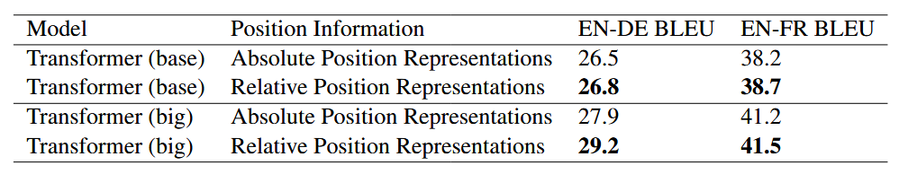
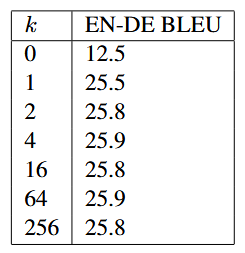
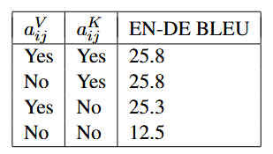

:::note[META]
**DOI**: `10.48550/arXiv.1803.02155` 
**Date**: `2018/04/12`
:::

## 1 问题

非循环模型无法天然按序遍历输入元素，因此需要额外显式编码位置信息，以表征序列先后关系。

`Transformer` 与 `RNN` 和 `CNN` 相比，并没有显式地对相对或绝对信息进行建模，而是需要在输入中加入绝对位置的表示。

本文提出了一个替代方案，对注意力机制进行扩展，从而有效地考虑相对位置，或句子元素间的距离。

## 2 符号体系

每个注意力头在包含 $n$ 个元素的输入 $x = (x_1,\ldots,x_n)$ 上进行运算，其中 $x_i \in \mathbb{R}^{d_x}$，生成大小相同的序列 $z = (z_1,\ldots,z_n)$，其中 $z_i \in \mathbb{R}^{d_z}$。每个输出元素 $z_i$ 由经过线性变换后的输入元素加权求和得到：

$$
z_{i}=\sum_{j=1}^{n}\alpha_{ij}\left(x_{j}W^V\right) \tag{1}
$$

> 教材中将 $x_{j}W^V$ 直接写作 $h_j$

每个权重系数 $\alpha_{ij}$ 由 `softmax` 函数得到：

$$
\alpha_{ij}=\frac{\exp e_{ij}}{\sum_{k=1}^{n}\exp e_{ik}}
$$

&emsp;$e_{ij}$ 由用于比对两个输入单元的匹配函数计算得到：

$$
e_{ij}= \frac{\big(x_i W^Q\big)\big(x_j W^K\big)^\top}{\sqrt{d_z}}\tag{2}
$$

## 3 改进
### 3.1 关系感知自注意力

本文提出一种自注意力拓展方案，用以建模输入单元间的成对关联；在此思路下，将输入数据建模为带标签、有向、全连接图结构。

输入元素 $x_i$ 和 $x_j$ 的边通过向量 $a_{ij}^V, a_{ij}^K \in \mathbb{R}^{d_a}$ 表示。$\boldsymbol a_{ij}^K、\boldsymbol a_{ij}^V$可分别直接用于<b>式(3)(4)</b>，无需额外线性变换；边表征在所有注意力头共享参数，实验取 $d_a=d_z$。

我们对<b>式(1)</b> 进行改写，将边信息传播到子层的输出中：

$$
z_{i}=\sum_{j=1}^{n}\alpha_{ij}\big(x_{j}W^{V}+a_{ij}^{V}\big) \tag{3}
$$

&emsp;该改进对如下任务至关重要：注意力头筛选出的边类型信息可被后续编码器/解码器复用；但实验表明，机器翻译任务中该结构并非必需。

同样对<b>式(2)</b> 进行改写：

$$
e_{ij}=\frac{x_i W^Q \big(x_j W^K + a_{ij}^K\big)^\top}{\sqrt{d_z}} \tag{4}
$$

### 3.2 相对位置表示

对线性序列来说，边可用来建模输入单元间的相对位置差信息，最大相对位置在 $k$ 处进行截断。假设超过指定距离后相对位置信息无建模价值，对最大距离进行截断可以让模型对训练集未出现过的超长序列具备泛化能力。因此考虑 $2k+1$ 个独特的边标签：

$$
\begin{align*}
a_{ij}^K &= w^K_{\ce{clip}(j-i,k)} \\
a_{ij}^V & = w^V_{\ce{clip}(j-i,k)} \\
\ce{clip}(x,k) &= \ce{max}(-k, \ce{min}(k,x))
\end{align*}
$$

&emsp;接下来我们可以学习相对位置表征 $w^K=(w^K_{-k},\ldots,w^K_{k})$ 和 $w^V=(w^V_{-k},\ldots,w^V_{k})$，其中 $w_i^K,w_i^V \in \mathbb R^{d_a}$。

> 即 $w^K\in\mathbb R^{(2k+1)\times d_a}$，从 $2k + 1$ 行中挑出索引为 $\ce{clip}(j-i,k)$ 的一行

### 3.3 高效实现

设序列长度为 $n$、注意力头数 $h$，通过多头共享相对位置表征，相对位置表示的存储复杂度由 $O(hn^2d_a)$ 降至 $O(n^2d_a)$；此外该表征可跨序列共享。因此自注意力整体空间复杂度从 $O(bhnd_z)$ 变为 $O(bhnd_z+n^2d_a)$。在 $d_a=d_z$ 条件下，空间相对增量由 $\frac{n}{bh}$ 决定。

> 序列长度为 $n$，$(i,j)$ 的配对个数为 $n^2$
> 单个 $a_{ij}^K/a_{ij}^V$ 的维度是 $d_a$
> 最后乘上注意力头数得到 $hn^2d_a$，共享后不用乘 $h$
> 注意力复杂度：$batch \times h \times n \times x_iW^Q$ 的维度 $=bhnd_z$
> 相对增量$=n^2d_a/bhnd_z=n/bh$

`Transformer` 利用并行矩阵乘法，高效计算批次内所有序列、注意力头与位置的自注意力。在不使用相对位置表征时，所有 $e_{ij}$ 可通过 $bh$ 次 $n\times d_z$ 与 $d_z\times n$ 矩阵的并行相乘得到。

引入相对位置后，位置配对不同则表征不同，无法通过单次矩阵乘法一次性算出全部 $e_{ij}$，同时也需要**规避相对位置表征的广播运算**。将<b>式(4)</b> 拆分为两项即可解决上述两个问题：

$$
e_{ij}=\frac{x_i W^Q \big(x_j W^K\big)^\top + x_i W^Q \big(a_{ij}^K \big)^\top}{\sqrt{d_z}} \tag{5}
$$

第一项和<b>式(2)</b> 相同，可沿用前述常规矩阵乘法计算。对于含相对位置表征的第二项，通过张量变形，能够执行 $n$ 组并行矩阵乘法（$bh\times d_z$与$d_z\times n$相乘）；单次矩阵乘法可算出单个 `token` 位置、全部批次与注意力头对应的 $e_{ij}$ 增量。再次张量变形后即可合并两项结果，该方法同样适用于<b>式(3)</b> 的高效求解。

> $Q \in \mathbb R^{bh \times n \times d_z}$ 与 $A \in \mathbb R^{n \times n \times d_z}$ 做运算时会进行广播，也就是计算 $x_i W^Q \big(x_j W^K + a_{ij}^K\big)^\top$ 时，括号外的 $i$ 需要同时与括号内的 $i,j$ 进行广播
> 将两项拆开，只需在每个 $i$ 上与 $a_{ij}^K$ 计算即可

## 4 结论
- 数据集：`WMT14` 英德 ($450$ 万句对)、英法 ($3600$ 万句对)，词表 $32768$。单卡单批限制 $4096$ 词，整批源 / 目标端各约 `25k token`
- 训练通用设置：`Adam` 优化器、`4000` 步学习率预热、标签平滑 $0.1$；解码束搜索 $\ce{beam} = 4$、长度惩罚 $0.6$
- 参数：编解码器各 $6$ 层，$d_x=512$，$d_z=64$，$h=8$，$\ce{FNN}=1024$，$\ce{dropout}=0.1$

与采用正弦位置编码的原始 `Transformer` 基线对比：

消融实验：
- 更改 `RPE` 截断距离 $k$，观察 `BLEU` 的变化：$k \ge 2$ 性能基本不变

	
- 分别移除 $a_{ij}^K$​、$a_{ij}^V$​，验证各自贡献：仅保留 $a_{ij}^K$ 就能取得大部分收益

	

