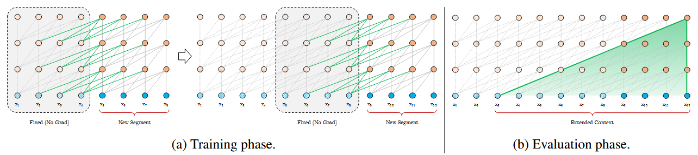
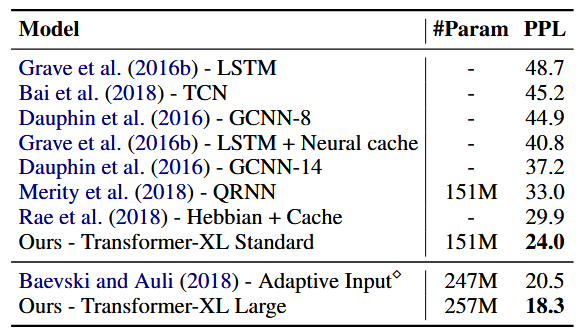
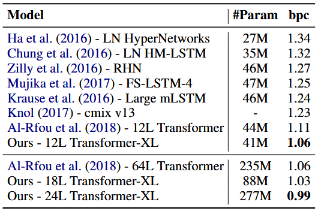
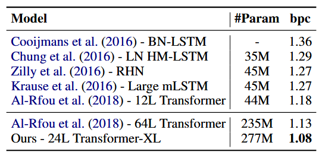
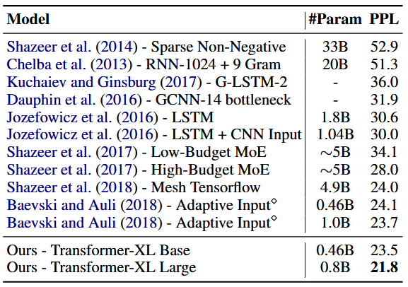
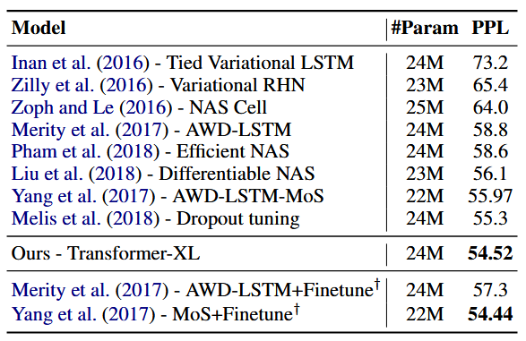
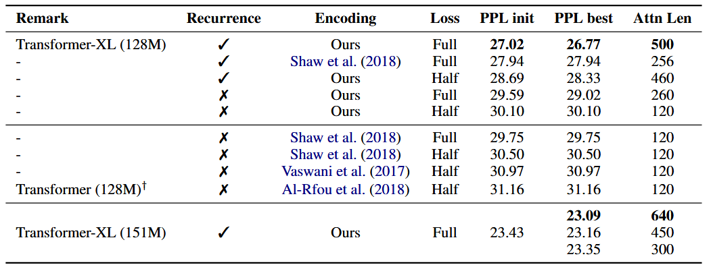
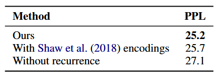
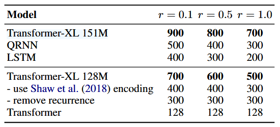

:::note[META]
**DOI**: `10.18653/v1/P19-1285` 
**Date**: `2019/01/01`
:::

## 1 问题

语言建模是需要建模长距离依赖的关键任务之一。`RNN` 尤其是 `LSTM` 曾是语言建模的主流方案，并在多项基准测试上取得优异效果。但是 `RNN` 存在梯度消失和梯度爆炸的问题，因此很难优化。

另一方面，注意力机制内置了远距离单词间的直接连接，可简化优化过程、助力模型学习长距离依赖。`Transformer` 虽具备捕捉长距离依赖的能力，但在语言建模场景中受限于固定上下文窗口长度。

受固定上下文长度制约，模型无法捕获预设窗口之外的超长距离依赖；且定长片段直接截取连续字符，不遵从句子与语义边界。致使片段起始位置的字符缺少前置上下文，难以精准预测，造成优化低效、模型性能变差，该问题称作 `context fragmentation`。

为了解决上述提到的固定上下文长度的限制，提出一个新的结构叫做 `Transformer-XL`。新分段不再从零计算隐状态，而是复用上一分段得到的隐状态；复用的隐状态充当当前分段的记忆，在分段之间构建循环连接。依托该跨段信息传递通路，模型得以建模超长距离依赖，同时消除上下文碎片化问题。 

此外提出一种简洁高效的相对位置编码方案，可泛化适配超出训练时上下文长度的注意力窗口。

## 2 实现
### 2.1 分段级状态复用循环

为解决固定上下文长度带来的缺陷，本文在 `Transformer` 结构中引入循环机制。训练阶段，前一分段计算得到的隐状态序列被固定缓存，处理下一新分段时作为拓展上下文复用（见<b>图 1a</b>)。梯度仍限制在单个分段内部，但额外引入的历史信息让模型能够利用过往文本，既可建模长距离依赖，又能规避上下文碎片化问题。 

定义两段长度均为 $L$ 的连续文本分段 $s_\tau=[x_{\tau,1},\dots,x_{\tau,L}]$ 与 $s_{\tau+1}=[x_{\tau+1,1},\dots,x_{\tau+1,L}]$。记第 $\tau$ 个分段 $s_\tau$ 经过第 $n$ 层输出的隐状态为 $\mathbf h_\tau^n\in\mathbb R^{L\times d}$，$d$ 为隐向量维度。则分段 $s_{\tau+1}$ 第 $n$ 层隐状态的计算方式如下：

$$
\begin{align*} 
\tilde{\mathbf{h}}_{\tau+1}^{n-1} &= \big[\text{SG}(\mathbf{h}_{\tau}^{n-1}) \circ \mathbf{h}_{\tau+1}^{n-1}\big], \\ \mathbf{q}_{\tau+1}^{n},\,\mathbf{k}_{\tau+1}^{n},\,\mathbf{v}_{\tau+1}^{n} &= \mathbf{h}_{\tau+1}^{n-1}\mathbf{W}_q^\top,\,\tilde{\mathbf{h}}_{\tau+1}^{n-1}\mathbf{W}_k^\top,\,\tilde{\mathbf{h}}_{\tau+1}^{n-1}\mathbf{W}_v^\top, \\ \mathbf{h}_{\tau+1}^{n} &= \text{Transformer-Layer}\big(\mathbf{q}_{\tau+1}^{n},\mathbf{k}_{\tau+1}^{n},\mathbf{v}_{\tau+1}^{n}\big)
\end{align*}
$$

其中 $\text{SG}(\cdot)$ 代表梯度截断算子，$[\mathbf h_u\circ \mathbf h_v]$ 表示沿序列长度维度拼接两组隐状态序列，$\mathbf W_\cdot$ 为模型可学习参数。和标准 `Transformer` 相比，核心区别在于：$\mathbf k_{\tau+1}^n$ 与 $\mathbf v_{\tau+1}^n$ 依托拓展上下文 $\tilde{\mathbf h}_{\tau+1}^{n-1}$ 生成，也就是复用了从前一分段缓存的 $\mathbf h_{\tau}^{n-1}$；<b>图 1a</b> 中绿色链路专门标注了该关键结构。

将该循环机制作用于语料所有相邻文本分段后，模型在隐状态层面形成分段级循环连接，实际可用有效上下文长度可远超相邻两个分段。 注意：$\mathbf h_{\tau+1}^n$ 与历史缓存 $\mathbf h_\tau^{n-1}$ 的循环依赖逐层下移，和传统 `RNN` 语言模型同层循环结构不同；模型最大可建模依赖长度与网络层数 $N$、单分段长度 $L$ 呈线性关系 $O(N\times L)$，对应<b>图 1b </b>阴影区域。该机制思想近似截断 `BPTT`，但区别在于：本方案缓存整段隐状态序列而非仅最后时刻隐变量，且必须搭配相对位置编码共同使用。

> `BPTT`: 沿时间反向传播，把循环网络按时间步展开成深层前馈网络，再用链式法则从后往前逐层算梯度、更新参数
> 截断 `BPTT`: 把长文本切分成固定长度小段，只在当前分段内部反向传播梯度。只缓存分段末尾单个隐变量，不存整段隐序列

该循环复用机制并不局限于仅缓存上一个分段。理论上，只要 `GPU` 显存充裕，可缓存多段历史片段，处理当前分段时统一作为扩充上下文使用。因此可预先留存总长 $M$ 的历史隐状态（可跨多个文本分段），记作历史存储器 $\mathbf m_\tau^n\in\mathbb R^{M\times d}$，该设计思路借鉴了记忆增强神经网络相关研究。 本文实验中：训练阶段令缓存长度 $M$ 等于单分段长度；推理阶段将 $M$ 放大数倍。

### 2.2 相对位置编码

标准 `Transformer` 依靠位置编码注入序列时序信息，位置编码矩阵记作 $\mathbf U\in\mathbb R^{L_{\text{max}}\times d}$，第 $i$ 行 $\mathbf U_i$ 代表分段内第 $i$ 个绝对位置，$L_{\text{max}}$ 为模型预设最大序列长度。模型输入由词嵌入与位置编码逐元素相加得到。 倘若直接沿用该绝对位置编码套用到本文的循环复用架构，隐状态的计算形式大致如下：

$$
\begin{align*} 
\mathbf h_{\tau+1} &= f\big(\mathbf h_\tau,\, \mathbf E_{s_{\tau+1}} + \mathbf U_{1:L}\big) \\ \mathbf h_\tau &= f\big(\mathbf h_{\tau-1},\, \mathbf E_{s_\tau} + \mathbf U_{1:L}\big), 
\end{align*}
$$

其中 $\mathbf E_{s_\tau} \in \mathbb R^{L \times d}$ 是 $\mathbf s_\tau$ 的词嵌入，$f$ 是变换函数。$\mathbf E_{s_\tau}$ 与 $\mathbf E_{s_\tau+1}$ 共用同一个位置编码 $\mathbf U_{1:L}$。因此，对任意下标 $j=1,2,\dots,L$，模型无法区分 $x_{\tau,j}$ 和 $x_{\tau+1,j}$ 的实际先后位置，最终造成模型性能大幅衰减。

> 两个来自不同分段、全局时序相隔一整段长度的 `token`，位置编码完全一模一样

为规避上述缺陷，核心思路是仅在隐状态中编码相对位置信息。从原理上看，位置编码的作用是给模型提供时序偏置，指引注意力该关注哪些位置；基于同一目的，不必在输入词嵌入阶段静态叠加位置编码，转而将时序信息嵌入每一层的注意力分值中。

更关键的是，以相对形式定义时序偏置具备更好的直观性与外推泛化能力。例如 $\mathbf q_{\tau,i}$ 和前文 $\mathbf k_{\tau,\le i}$ 做注意力匹配时，无需知晓各个键的绝对下标，仅凭 $\mathbf k_{\tau,j}$ 与自身 $\mathbf q_{\tau,i}$ 的间距 $i-j$ 即可判断先后顺序。

实操中定义相对位置编码矩阵 $\mathbf R\in\mathbb R^{L_{\text{max}}\times d}$，第 $i$ 行 $\mathbf R_i$ 代表两 `token` 间隔为 $i$ 的相对位置表征。将相对距离动态融入注意力得分后，模型依靠间距差异就能区分 $x_{\tau,j}$ 与 $x_{\tau+1,j}$，使跨分段隐状态复用机制成立；同时相对距离可递归还原全局绝对位置，不会丢失时序信息。

本文给出一套新式相对位置编码：该编码既与绝对位置编码存在一一对应的数学等价关系，又拥有更优的长度外推泛化性能。首先，在原始 `Transformer` 中，同分段内 $\mathbf q_i$ 与 $\mathbf k_j$ 的注意力分值可做如下拆解：

$$
\begin{align*}
\mathbf A_{i,j}^{\mathrm{abs}} &=\underbrace{\mathbf E_{x_i}^\top \mathbf W_q^\top \mathbf W_k \mathbf E_{x_j}}_{(a)} +\underbrace{\mathbf E_{x_i}^\top \mathbf W_q^\top \mathbf W_k \mathbf U_j}_{(b)} \\ &\quad+\underbrace{\mathbf U_i^\top \mathbf W_q^\top \mathbf W_k \mathbf E_{x_j}}_{(c)} +\underbrace{\mathbf U_i^\top \ \mathbf W_q^\top \mathbf W_k \mathbf U_j}_{(d)}
\end{align*}
$$

> $\mathbf q_i = (\mathbf E_{x_i} + \mathbf U_i) \mathbf W_q^\top$ 与 $\mathbf k_j = (\mathbf E_{x_j} + \mathbf U_j) \mathbf W_k^\top$ 做点积后展开得到

只依赖于相对位置信息，我们对上式进行改写：

$$
\begin{align*} 
\mathbf A_{i,j}^{\mathrm{rel}} &=\underbrace{\mathbf E_{x_i}^\top \mathbf W_q^\top \mathbf W_{k,E}\mathbf E_{x_j}}_{(a)} +\underbrace{\mathbf E_{x_i}^\top \mathbf W_q^\top \mathbf W_{k,R}\textcolor{#00b9f2}{\mathbf R_{i-j}}}_{(b)} \\ &\quad+\underbrace{\textcolor{red}{u^\top} \mathbf W_{k,E}\mathbf E_{x_j}}_{(c)} +\underbrace{\textcolor{red}{v^\top} \mathbf W_{k,R} \textcolor{#00b9f2}{\mathbf R_{i-j}}}_{(d)}
\end{align*}
$$

- 第一个改进是将`(b)(d)`项中用于键向量计算的全部绝对位置嵌入 $\mathbf U_j$，替换为对应的相对位置表征 $\textcolor{#00b9f2}{\mathbf R_{i-j}}$，本质是引入先验假设：注意力的落点仅由 `token` 间相对间距决定。$\textcolor{#00b9f2}{\mathbf R}$ 沿用 `Transformer` 原版正弦位置编码矩阵。
- 第二点，我们引入可训练参数 $\textcolor{red}{u} \in \mathbb R^d$ 来替换 `(c)` 项中的查询 $\mathbf U_i^\top \mathbf W_q^\top$。等价于所有查询位置共用同一个查询偏置，意味着模型对各个词汇的注意力偏好，不受查询自身所在位置 $i$ 的影响；同理，新增可学习参数 $\textcolor{red}{v} \in \mathbb R^d$，替换`(d)`项里的 $\mathbf U_i^\top \mathbf W_q^\top$。
- 最后，将原单一键权重拆分为 $\mathbf W_{k,E}$、$\mathbf W_{k,R}$ 两个独立权重矩阵，分别用于生成基于语义内容的键向量、基于相对位置的键向量。

在这套全新参数化方案下，四项各自具备清晰物理含义：`(a)`为基于内容的语义寻址项；`(b)`代表依赖查询语义的位置偏置；`(c)`是全局固定的内容偏置；`(d)`编码全局固定的位置偏置。

> `(a)` 仅依靠词向量语义做注意力匹配，和位置无关
> `(b)` 由查询自身语义和两 `token` 相对距离共同决定偏置
> `(c)` 全序列共用固定偏置 $u$，只和键的语义内容相关，不受查询位置、查询本身影响
> `(d)` 全序列共用固定偏置 $v$，只由两 `token` 相对距离决定，和查询，键的词汇内容无关

将前文循环复用机制与本文提出的相对位置编码结合，最终得到 `Transformer‑XL` 整体架构。单层注意力头、$N$ 层堆叠的 `Transformer‑XL`，对于 $n=1,2,\dots,N$，其计算流程如下：

$$
\begin{align*} 
\widetilde{\mathbf h}_\tau^{n-1} &= \big[\,\text{SG}(\mathbf m_\tau^{n-1})\,\circ\, \mathbf h_\tau^{n-1}\,\big] \\ \mathbf q_\tau^n,\,\mathbf k_\tau^n,\,\mathbf v_\tau^n &= \mathbf h_\tau^{n-1}\mathbf W_q^{n\top},\; \widetilde{\mathbf h}_\tau^{n-1}\mathbf W_{k,E}^{n\top},\; \widetilde{\mathbf h}_\tau^{n-1}\mathbf W_v^{n\top} \\ \mathbf A_{\tau,i,j}^n &= \mathbf q_{\tau,i}^{n\top}\mathbf k_{\tau,j}^n +\mathbf q_{\tau,i}^{n\top}\mathbf W_{k,R}^n \mathbf R_{i-j} +\boldsymbol u^\top \mathbf k_{\tau,j}^n +\boldsymbol v^\top \mathbf W_{k,R}^n \mathbf R_{i-j} \\ \mathbf a_\tau^n &= \text{Masked-Softmax}\big(\mathbf A_\tau^n\big)\,\mathbf v_\tau^n \\ \mathbf o_\tau^n &= \text{LayerNorm}\big(\,\text{Linear}(\mathbf a_\tau^n) + \mathbf h_\tau^{n-1}\,\big) \\ \mathbf h_\tau^n &= \text{Positionwise-Feed-Forward}(\mathbf o_\tau^n) 
\end{align*}
$$

## 3 结论

- 数据集：`WikiText-103`、`enwik8`、`text8`、`One Billion Word`、`PTB` 五类语言建模数据集，覆盖词级 / 字符级、长短文本、大小数据场景
- 训练通用设置：`WikiText-103` 训练注意力长度 $384$、测试 $1600$；`enwik8` 大模型训练上下文 $784$、推理 $3800$；采用自适应 `Softmax`，搭配变分 `Dropout`、权重平均等正则

与正弦绝对位置编码原版 `Transformer`、经典 `RNN` 模型基线对比，在全部数据集上刷新 `SoTA`：
- `WikiText-103` 困惑度由 $20.5$ 降至 $18.3$

	
	
- $12$ 层 `Transformer-XL` 参数量仅为 $64$ 层原版 `Transformer的` $17\%$，性能却持平，加深至 $18/24$ 层后刷新 `SoTA`

	
	
- `text8` 复用 `enwik8` 超参即登顶

	

- `One Billion Word` 上的 `PPL` 由 $23.7$ 降到 $21.8$

	

- `PTB` 小数据集无分步微调取得最优

	

设计两组消融实验，用以验证 `Transformer-XL` 中两项核心创新：分段循环复用机制与新型相对位置编码方案的有效性。

- 第一项消融实验基于侧重长依赖建模的 `WikiText‑103` 数据集。`Full`、`Half` 分别代表利用分段全部词元、仅分段后半部分词元计算交叉熵损失。绝对位置编码只有搭配半损失才能取得不错效果，原因是半损失舍弃了训练中注意力覆盖极短的位置，提升泛化能力。循环复用机制与本文提出的位置编码缺一不可，二者共同作用才能实现最优效果

	

- 第二项消融旨在区分模型增益究竟来自消除上下文割裂，还是捕获超长上下文依赖。为此选用本身不存在长距离依赖的数据集，此时循环机制带来的性能提升就完全归因于解决了上下文碎片化问题。实验选用 `One Billion Word`，搭建 $20$ 层、约 $3$ 亿参数的 `Transformer-XL`。实验证明：即便无长依赖需求，启用分段循环仍大幅提升效果

	

提出新指标相对有效上下文长度 `(RECL)`：把长上下文带来的性能提升，换算成相对最优短上下文基线模型的提升幅度，统一参照基准以实现公平对比。其自带的超参 $r=0.1$
时，`Transformer-XL` 平均可建模 $900$ 词的远距离依赖；其 `RECL` 相比循环网络高出 $80\%$、相比原生 `Transformer` 高出 $450\%$

> `ECL` 是 `Khandelwal` 等人提出的评测序列模型的指标，定义为继续扩大上下文跨度仍能带来超阈值性能增益的最大长度。但该指标存在缺陷：若模型依靠短上下文就取得了很低的困惑度，后续再扩充上下文很难继续提效，因此无法在不同模型间公平对比

