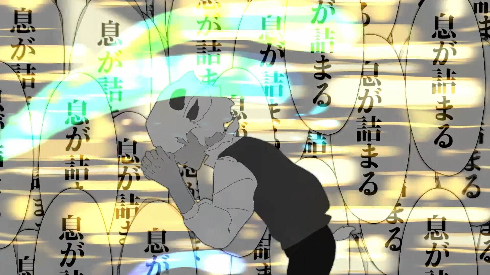

:::note[META]
`date`: 2021年6月2日 
`artist`: ピノキオピー feat. 初音ミク 
`id`: `sm38824626`
:::

<iframe frameborder="no" border="0" marginwidth="0" marginheight="0" width=330 height=86 src="//music.163.com/outchain/player?type=2&id=1849309117&auto=0&height=66"></iframe>

`Lyrics`:

世界中のすべての人間に好かれるなんて気持ち悪いよ

だけど一つになれない教室で　君と二人　手を繋いでいたいの

数の暴力に白旗をあげて　悪感情を殺してハイチーズ

ポストトゥルース[^1]の甘いディープキス　エロく歪んでるラブアンドピース

自己中の光線銃　乱射する　強者のナンセンス

オートクチュール[^2]で作る　殺しのライセンス

分断を<ruby>生<rt>う</ruby>んじゃった椅子取りゲーム　<ruby>無痛<rt>むつう</ruby><ruby>分娩<rt>ぶんべん</ruby>で<ruby>授<rt>さず</ruby>かるベイブ

壮大な内輪ノリを歴史と呼ぶ

生きたいが死ねと言われ　死にたいが生きろと言われ × 2

幸せ自慢はダメ？　不幸嘆いてもダメ？

図々しい言葉を避け　明るい未来のため

さんはい　「この世には息もできない人が沢山いるんですよ」× 2

あちらが立てば　こちらが立たず　譲り　奪い　守り　行き違い

<ruby>地雷原<rt>じらいげん</ruby>で立ち止まり　大人しく犬になるんだワン

ノンブレス　ノンブレス　ノンブレス　ノンブレス・オブリージュ

I love you　息苦しい日々の水面下　ゆらゆらと煙る血の花

ぼくらは　コンプレックス　コンプレックス　コンプレックス

コンプレックスを武器に争う

それぞれの都合と自由のため

息を止めることを強制する

息が詰まる息が詰まる息が詰まる息が詰まる × 4

息が詰まる息が詰まる息が詰まる

生きたいが死ねと言われ　死にたいが生きろと言われ × 2

正当防衛と言ってチェーンソーを振り回す　まともな人たちが怖いよ

<ruby>愛燦燦<rt>あいさんさん</ruby>　春爛漫　日々だんだん大事なものが消えていくよ

さんはい　「この世には愛も知らない人が沢山いるんですよ」× 2

共感　羨望　嫉妬　逆恨み　黒い涙がこぼれ落ち　

醜い感情が吹き出し　真っ白い鳥になるんだな

ノンブレス　ノンブレス　ノンブレス　ノンブレス・オブリージュ

I love you　深海魚と泳ぐ氷点下　見上げている　ザラメの星

ぼくらは　直接　直接　直接　直接　手を下さないまま

想像力を奪う<ruby>液晶<rt>えきしょう</ruby>越しに　息の根を止めて安心する

ノンブレス　ノンブレス　ノンブレス　ノンブレス・オブリージュ

I love you　それぞれの都合と自由のため

息を止めることを強制する

息が詰まる息が詰まる息が詰まる息が詰まる × 4

息が詰まる息が詰まる息が詰まる

息を止める息を止める息を止める息を止める × 4

息を止める息を止める息を止める

ノンブレス　ノンブレス　ノンブレス　ノンブレス・オブリージュ

I love you　それぞれの好きを守るため

君と防空壕で呼吸する

---

> 曲名 `neta` 自 `Noblesse oblige`，这句话本意是身居贵族之位，便要恪守与身份相配的言行操守。

> 这首曲子刻画了年轻人的煎熬：在以社交软件为首的各类通讯工具带来的互相监视、再加上阅历丰富的成年人不断灌输各类 “理应如此” 的说教的环境里，他们只能在狭小的一隅吐露真心话。

[^1]: **ポストトゥルース** (post-truth)：用来描绘“客观事实在形成舆论方面影响较小，而诉诸情感和个人信仰会产生更大影响”的情形

[^2]: **オートクチュール** ([仏] haute couture)：高级定制时装

