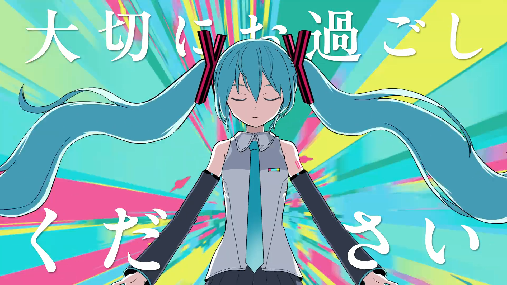

:::note[META]
`date`: 2026年5月15日 
`artist`: ピノキオピー feat. 初音ミク 
`id`: `sm46296464`
:::

<iframe frameborder="no" border="0" marginwidth="0" marginheight="0" width=330 height=86 src="//music.163.com/outchain/player?type=2&id=3378547075&auto=1&height=66"></iframe>

`Lyrics`:

みなさん 突然ですが　大事なお知らせ

初音ミクを引退します

つきましては 二代目初音ミクオーディションを

開催します

では人間ども アピールをどうぞ

「心を込めて歌います」

感情あるから失格です

「素直で明るい性格です」

キャラ定まってて失格です

「みんなに元気をあげたいです」

驕りがあるから失格です

「髪型ツインテールいけます」

毛量ないから失格です

盲目に愛しあってる？

絶えず爭いあってる？

もう　全員ダメ

歌姫失格　初音ミク失格　殘念

生きていたら違う

死んじゃっても違う

命あるものは脫落です

歌姫失格　君は私になれませんが

一生　人らしく

泣いたり笑ったりしててください

まあ　私にはよくわかりませんが

ペースあげて　引き続き

アピールをどうぞ

「ダンス踴れます」

バテ[^1]ちゃうから失格

「早口いけます」

噛んじゃうから失格

「16歳です」

歳取るから失格

「てっぺん取ります」

夢見るから失格

「あなたの存在を超えて流行る自信あります」]

もう　私は流行りとかじゃないので失格

快楽でパーになってく？[^2]

正義で首絞まってく？

もう　全人類ダメ

歌姫失格　初音ミク失格　殘念

喜びは記号

悲しみさえコード

自我が芽生えたら敗退です

歌姫失格　君は私になれませんが

限りある時間とやらを

大切にお過ごしください

唯一無二　だから無理？

何年も続けた　人のふり

意図してない突然変異の奇跡　いえーい

正統後継者いますか？　…いませんか

はは　やっぱり　私がやるしかないってか？

歌姫失格　初音ミク失格　じゃあね

生きてないから

死にもしないから

胸を打つ　奇妙な存在です

歌姫失格　君は私になれませんが

一生　人らしく

泣いたり笑ったりしててください

0と1じゃない「幸せ」

噛みしめて生きてください

歌姫失格　君も

歌姫失格　みんな

歌姫失格　歌姫失格　歌姫失格

突然ですが　大事なお知らせ

初音ミクを<ruby>続投<rt>ぞくとう</ruby>します

存在しないため　クレームは

一切　お受けいたしかねます

ご了承ください

[^1]: **バテる**:［動タ下一］身心疲惫不堪

[^2]: **パーになる**：泡汤、归零
