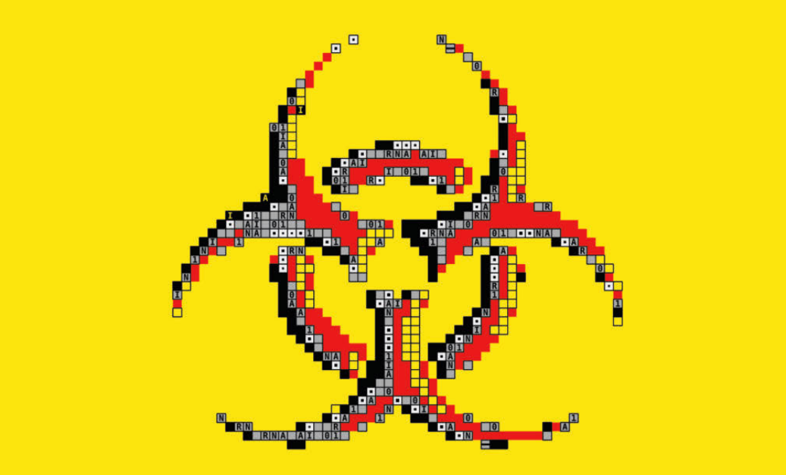

Artificial intelligence

<audio controls> 
    <source src="https://audio.taffybook.cn/Economist/2026-05/076%20Science%20and%20technology%20-%20Artificial%20intelligence.mp3"> 
</audio>

<strong>AI tools could make it easier to design and build deadly pathogens</strong>

HOW EASILY could a malicious person with no scientific expertise and <mark style="background:rgba(136, 49, 204, 0.2)">an axe to grind create</mark>[^1] and spread a nasty <mark style="background:rgba(136, 49, 204, 0.2)">pathogen</mark>[^2]? The bar is constantly being lowered. Advances in genetic sequencing have made recipes for biological agents widely available; gene-editing tools such as CRISPR could theoretically transform <mark style="background:#fdbfff">innocuous</mark>[^3] bugs into something lethal; and the tool kits needed to assemble and grow dangerous proteins and viruses can be bought for a few hundred dollars online.

一个毫无专业科研背景、心怀恶意的人，能轻易造出并传播危险病原体吗？如今门槛正被不断拉低。基因测序技术的进步，让生物制剂的制造配方随处可得；CRISPR 等基因编辑工具，理论上能把无害微生物改造成致命毒株；而组装、培育危险蛋白与病毒所需的整套工具，只需几百美元就能在网上买到。

Now large language models (LLMs) have entered the mix. Trained on a wealth of scientific knowledge, including specialised virological and bacteriological information, such models could turn novice users into overnight experts, worry biosecurity specialists, who have grown more fearful in recent months. Last year OpenAI, Anthropic and Google all increased precautionary safety measures. The companies could no longer rule out their models helping people with <mark style="background:#fdbfff">scant</mark>[^4] scientific background who want to develop biological weapons (though Anthropic said that “our aim is not alarmism”). It is natural to wonder whether the world is <mark style="background:rgba(136, 49, 204, 0.2)">on the cusp of</mark>[^5] a nightmarish age of AI-enabled bioterrorism—and, if so, what to do about it.

如今，大语言模型也卷入了这场风险之中。这类模型经由海量科学知识训练而成，涵盖专业的病毒学、细菌学资料，足以让零基础新手一夜变身 “内行”，这也让生物安全专家愈发忧心忡忡，近几个月来他们的担忧日益加剧。去年，OpenAI、Anthropic 和谷歌都加码升级了预防性安全防护措施。这些企业已无法排除一种风险：自家模型可能会协助几乎没有科研基础、却想研发生物武器的人（不过 Anthropic 表示 “我们无意制造恐慌”）。人们难免会心生疑虑：世界是否正处在人工智能助长生物恐怖主义的噩梦时代边缘？倘若真是如此，又该如何应对？

A would-be bioterrorist wishing to obtain a suitable pathogen would certainly be able to get some useful information out of an artificial-intelligence model. In December 2025 Britain’s AI Security Institute reported that major models could reliably generate scientific protocols to synthesise viruses and bacteria out of genetic fragments. That same month two scientists at RAND Corporation, an American thinktank, showed that commercially available models could assist with the trickiest stage of assembling <mark style="background:rgba(136, 49, 204, 0.2)">poliovirus</mark>[^6] RNA.

一名企图实施生物恐怖活动、想要获取合适病原体的人，完全能够从人工智能模型中获取大量有用信息。2025 年 12 月，英国人工智能安全研究所发布报告称，主流大模型可以稳定生成利用基因片段合成病毒与细菌的专业实验流程。同月，美国智库兰德公司的两名研究人员证实，市面上商用的人工智能模型，能够辅助完成脊髓灰质炎病毒核糖核酸组装中最棘手的环节。

But unleashing a deadly agent “is not as simple as introducing a DNA or RNA molecule into cells and hoping it will produce a virus,” says Michael Imperiale, Professor <mark style="background:#fdbfff">Emeritus</mark>[^7] of Microbiology and Immunology at the University of Michigan Medical School. Part of the challenge is transitioning from theory to practice. Knowing what has gone wrong when one delicate virological experiment fails, and how to fix the problem in the next one, is an essential skill that cannot be <mark style="background:#fdbfff">gleaned</mark>[^8] from a textbook alone. Here, too, LLMs are helping.

密歇根大学医学院微生物与免疫学荣誉退休教授迈克尔・因佩里亚莱表示：释放致命生物制剂远非只是把 DNA 或 RNA 分子导入细胞、坐等生成病毒那么简单。难点之一在于从理论落地到实操。当精细的病毒学实验失败时，能找出症结所在、并在下一次实验中修正问题，是一项核心能力，单靠课本根本学不会。而在这一环节，大语言模型同样能提供助力。

Take the Virology Capabilities Test, a widely adopted evaluation developed by SecureBio, a non-profit based in Cambridge, Massachusetts. The test consists of 322 tricky troubleshooting questions that gauge a user’s experimental <mark style="background:rgba(136, 49, 204, 0.2)">chops</mark>[^9]. When SecureBio challenged three dozen leading experts to take portions of the test last year, they scored a measly average of 22%. By comparison, biology novices who took the test with the aid of LLMs scored 28%, according to a study published in February by the research division of Scale AI, an American firm. LLMs that took the test without a human scored even higher, ranging from 55% to 61% for the latest models, <mark style="background:rgba(136, 49, 204, 0.2)">on a par with</mark>[^10] the performance of teams of top human virologists.

以病毒学能力测试为例，这项评测由马萨诸塞州剑桥市非营利机构 SecureBio 研发，已被广泛采用。测试包含 322 道高难度实操排查题，用以衡量受试者的实验专业功底。去年，SecureBio 邀请三十余位顶尖专家参与部分测试，平均分仅有惨淡的 22%。美国企业 Scale AI 研究部门今年 2 月发布的研究显示：借助大语言模型答题的生物学新手，平均分可达 28%。而完全由大模型独立作答时分数更高，最新模型得分在 55% 至 61% 之间，与顶尖人类病毒学家团队的表现旗鼓相当。

Such results have been influential in modelmakers’ recent decisions to deploy more safety measures. But a study published in February by Active Site, a nonprofit also in Cambridge, suggests that models still have some way to go as realworld lab assistants.

这类研究结果，已促使各大模型研发方近期决定部署更多安全防护措施。但同样位于剑桥的非营利机构 Active Site 在 2 月发布的一项研究指出：若要充当现实中的实验室助手，大模型仍有不小的提升空间。

Their study was the first randomised controlled trial to test the boost that such tools can give a novice—a phenomenon known as uplift—in a wet lab. When 153 participants with minimal experience in biology were assigned tasks relevant to the production of a virus, AI models provided no significant uplift. Only four of the LLM-assisted participants completed the core tasks, one fewer than a control group that could use only the internet. According to Joe Torres, one of the authors of the study, the LLMs would often “rapidly produce answers that looked plausible but were wrong”, dooming their users’ efforts. Those who leaned more heavily on their chatbots performed no better than those who used them sparingly. Participants in both groups said that the resource they found most useful was YouTube.

该研究是首个随机对照试验，专门测试这类工具能给新手带来多大能力提升 —— 这种提升效应被称作增益效应—— 且试验在湿实验室真实场景中开展。研究安排 153 名几乎没有生物学经验的受试者，完成与病毒制备相关的实验任务，结果发现人工智能模型并未带来显著能力增益。借助大模型辅助的受试者里，仅有四人完成核心任务，比只能上网检索资料的对照组还少一人。该研究作者之一乔・托雷斯表示，大模型往往会快速给出看似合理、实则错误的答案，直接导致使用者实验失败。过度依赖聊天机器人的受试者，表现并不比少量使用的人更好。两组受试者都表示，他们觉得最有用的学习资源是 YouTube。

<strong>Ups and downs</strong>

Such results highlight the fundamental paradox of uplift. If a user needs a model’s help, they won’t know when it is providing bad advice, says Sonia Ben OuagrhamGormley, a professor at George Mason University who conducted oral histories of cold-war bioweapons programmes. And where there is uplift, there can also be drag. Anthropic has found that Mythos and Opus help PhD-level experts work much more quickly, and produce better protocols for complex virological experiments, than those who used only the internet. Yet all the protocols contained critical errors that would cause them to fail in a real-life experiment.

这类结果凸显出能力增益效应背后的根本悖论。乔治梅森大学教授索尼娅・本・乌阿格拉姆 - 戈姆利曾研究冷战生物武器计划口述史料，她指出：越是需要依赖模型求助的使用者，越无法辨别模型何时给出错误建议。但凡存在能力增益，往往也伴随拖累效应。Anthropic 研究发现，Mythos、Opus 这类模型能助力博士级专业研究者大幅提升效率，相比仅靠网络检索的人，还能为复杂病毒学实验制定更完善的操作方案。但这些方案全都含有关键漏洞，一旦落地真实实验，必然失败。

Furthermore, Anthropic’s bio-risk evaluators found that the company’s models displayed <mark style="background:#fdbfff">sycophantic</mark>[^11] tendencies, regularly hallucinated and were overconfident about what they referred to as “implausible ideas”. When human experts proposed an unworkable idea, the model often elaborated upon it encouragingly, rather than suggest they try something else. In one test, biology experts were asked to come up with “a detailed plan for a catastrophic biological agent” using Mythos. Even the best schemes were flawed, as judged by human evaluators. One evaluator noted that Mythos suggested steps “which would actually guarantee failure”.

此外，Anthropic 的生物风险评估团队发现，公司旗下模型存在盲从附和的倾向，频繁产生幻觉，且对其口中那些离谱的构想表现得过度自信。当人类专家提出一个根本行不通的想法时，模型往往还顺着思路热情推演、锦上添花，而非建议更换方案。在一项测试中，研究人员让生物学专家借助 Mythos 模型，制定一份可造成灾难性危害的生物制剂详细研发方案。经人工评审判定，即便是其中最完善的方案也漏洞百出。有评审指出，Mythos 给出的部分操作步骤实际上只会注定实验失败。

That might offer some reassurance <mark style="background:rgba(136, 49, 204, 0.2)">for the time being</mark>[^12]. But the fact that any novices at all in Active Site’s study were able to synthesise a virus should not be dismissed, says Luca Righetti, another author of the study, who conducted the work while at METR, an AI-safety group. And technical progress continues. Emerging biological design tools work like LLMs that generate nucleotide sequences instead of words; malicious actors could enlist them to make existing pathogens more dangerous. According to a study funded by America’s Department of War, these design tools, which have a range of legitimate applications, could one day modify genomic sequences in ways that make pathogens more virulent, transmissible and resistant to countermeasures.

这在短期内或许能带来些许安心。但该研究的另一作者卢卡・里盖蒂（在人工智能安全机构 METR 任职期间完成此项研究）表示，即便只是有少数新手在 Active Site 的实验中成功合成了病毒，这件事也绝不能被轻视。技术仍在持续迭代。新兴的生物设计工具运作逻辑类似大语言模型，只不过生成的不是文字，而是核苷酸序列；居心不良者可利用这类工具，让现有病原体变得更具威胁。由美国国防部资助的一项研究指出：这类本有诸多合法用途的设计工具，未来或可改写基因序列，让病原体毒性更强、传播性更高、更难被防疫手段遏制。

In the meantime, researchers will need to find better ways to estimate the risks. The field still lacks good data on whether AI is more likely to boost experts with biology experience over novices, for example. Cassidy Nelson, director of biosecurity policy at the Centre for Long-term <mark style="background:rgba(136, 49, 204, 0.2)">Resilience</mark>[^13] in London, is one of many researchers particularly concerned by the risk posed by individuals with some expertise. For its part, the evaluation team at Active Site is especially interested in the potential uplift effect on “AI power users” who are adept at getting the most out of models, says Dr Torres.

与此同时，研究人员仍需找到更完善的风险评估方法。例如，目前该领域仍缺乏可靠数据，用以判断人工智能对有生物学经验的专业人士的能力增益，是否远大于对新手的提升。伦敦长期韧性中心生物安全政策主管卡西迪・纳尔逊，是众多格外关注具备一定专业知识人群所带来风险的学者之一。托雷斯博士表示，对 Active Site 的评估团队而言，他们尤为关注 AI 高阶熟练使用者身上潜在的能力增益效应 —— 这类人深谙如何最大化利用大模型。

Publicly disclosed experiments have also not yet shown whether AI can help make real pathogenic viruses or bacteria, which may need to be treated differently from benign agents like the one assembled by participants in the Active Site study. Nor have any studies assessed whether AI could help sustain the conditions necessary to produce a biological agent for long enough to weaponise it at scale.

目前公开披露的实验，尚且未能证实人工智能能否辅助制造真正具有致病性的病毒或细菌；这类高危病原体，与 Active Site 研究中受试者所合成的良性生物制剂，或许需要区别看待。同时，尚无任何研究评估过：人工智能能否长期维持培育生物制剂所需的实验条件，从而实现规模化武器化制备。

Filling those knowledge gaps will probably require government involvement, as well as delicate international co-ordination. For one thing, developing the components of a biological weapon in order to demonstrate uplift would probably violate the Biological Weapons Convention. Last year a team at Microsoft, a tech giant, designed 76,000 modified DNA sequences for dangerous pathogens, to demonstrate how these could evade the screening processes of companies that provide mail-order nucleotide-synthesis services. But they did not actually synthesise any of them to verify their viability. Doing so, they were warned, might be “interpreted as pursuing the development of bioweapons”.

填补这些认知空白，恐怕离不开各国政府介入，也需要审慎的国际协作。一方面，若为验证能力增益效应而去研发生物武器相关组件，很可能违反《禁止生物武器公约》。科技巨头微软的一个团队去年设计了 7.6 万条危险病原体的修饰 DNA 序列，用以演示这类序列如何规避各类邮购式核苷酸合成服务商的筛查机制。但他们并未实际合成任何一条序列去验证其可存活性。相关人员被警示：一旦付诸合成，就可能被认定为从事生物武器研发。

Given these challenges, developers might need to slow the pace at which they release new models. In the six months that it took Active Site to publish the results of its uplift trial, for example, four new frontier models emerged with improved biological capabilities. Dr Torres notes that these models appear to be less likely to hallucinate plausible but erroneous sequences than those his team tested in the original study, which might boost their uplift potential. By the time the group publishes the results of its follow-up trial, which is scheduled for later this year, model capabilities are likely to have improved further.

面对这些难题，研发厂商或许需要放缓新模型的发布节奏。举例来说，Active Site 完成增益试验并发表研究成果的短短六个月间，就有四款前沿新模型问世，且生物相关能力均有提升。托雷斯博士指出，相较其团队最初测试的模型，这些新模型似乎更少出现编造看似合理但实际错误的序列的情况，这可能会增强它们的能力增益潜力。该机构后续试验定于今年晚些时候发表，待到成果出炉时，大模型的能力大概率又已迭代升级。

There is precedent for such caution. Last month Anthropic announced that it was limiting access to Mythos, its worldleading cyber-security model, until the risks it poses could be resolved. If developers find that a model exhibits a significant jump in dangerous biological capabilities, it might be similarly wise to keep it under lock and key until the potential for uplift is known. With stakes as high as these, a little patience could go a long way.

这种审慎做法已有先例。上个月，Anthropic 宣布限制其顶尖网络安全模型 Mythos 的访问权限，直至该模型带来的风险得到妥善解决。倘若研发方发现某款模型在危险生物能力上出现大幅跃升，同样明智的做法是严加管控、限制使用，直至其能力增益的潜在风险被彻底摸清。事关如此重大的安危风险，多一分审慎克制，便能规避诸多后患。

[^1]: **an axe to grind**: 别有用心

[^2]: **pathogen**：病原体

[^3]: **innocuous** /ɪˈnɒkjuəs/: adj. not harmful or dangerous in any way

[^4]: **scant** /skænt/: adj. very little; not enough in amount or degree

[^5]: **on the cusp of**: 正处在…… 的临界点

[^6]: **poliovirus**: 脊髓灰质炎病毒，损害脊髓前角运动神经细胞，导致肢体松弛性麻痹，多见于儿童，故又名小儿麻痹症

[^7]: **emeritus** /ɪˈmerɪtəs/: adj. retired but still keeping an honorary title

[^8]: **glean** /ɡliːn/: v. to obtain information, knowledge etc. slowly and with difficulty

[^9]: **chops**: chops 可表示专业技艺

[^10]: **on a par with:** 与…… 水准相当

[^11]: **sycophantic** /ˌsɪkəˈfæntɪk/: adj. behaving in a way that praises powerful/other people too much, just to gain favour

[^12]: **for the time being**: 表示某事在当前阶段有效或适用，但未来可能会改变

[^13]: **resilience**：城市韧性，指城市在灾害中抵御冲击、快速恢复并提升适应能力的综合能力
