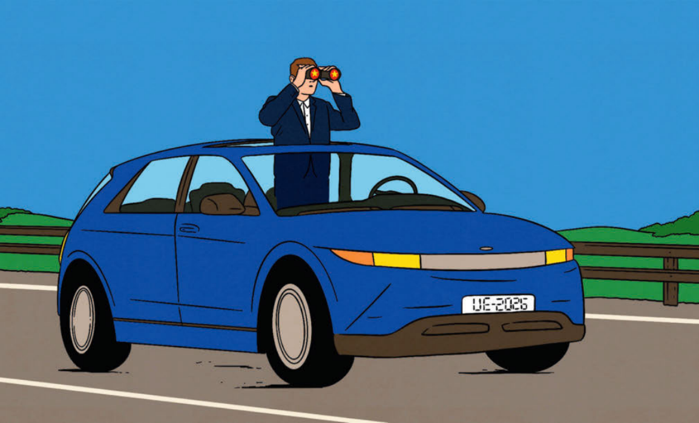
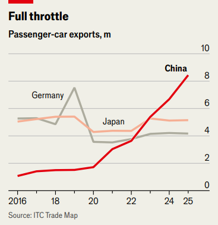

The auto industry

<audio controls> 
    <source src="https://audio.taffybook.cn/Economist/2026-05/060%20Business%20-%20The%20auto%20industry.mp3"> 
</audio>

<strong>Global carmakers desperately want to be more Chinese. </strong> 
<strong>Their approach carries big risks</strong>

ANY DOUBTS that China has become the heartland of the global car industry are quickly dispelled by a visit to the country’s main motor show. Beijing’s crowded event this year was twice as large as in 2024 (it moves to Shanghai on alternate years) with around 180 new cars on display. The show, which concluded on May 3rd, demonstrated once again that foreign carmakers are lagging behind their Chinese rivals in the race to the industry’s future.

只要逛一逛中国主流车展，便能打消所有质疑 —— 中国已然成为全球汽车产业核心腹地。今年北京车展盛况空前，展馆规模较 $\textcolor{#548dd4}{2024}$ 年扩大一倍（该车展逢双年移师上海举办），展出新车约 $\textcolor{#548dd4}{180}$ 款。这场于 $\textcolor{#548dd4}{5}$ 月 $\textcolor{#548dd4}{3}$ 日落幕的展会再度印证，在角逐汽车产业未来赛道的进程中，海外车企已然落后于中国本土同行。

Yet the show also illustrated the extent to which foreign carmakers are looking to remake themselves in the image of their ascendant Chinese competitors. At events to launch new models Western executives from Volkswagen (VW) and Mercedes switched effortlessly between English and Mandarin. VW opted to round off its show with a display of interpretive Chinese dance set to electronic music; Mercedes went for a Chinese rap.

但此次车展也清晰体现出，海外车企正竭力向势头正盛的中国同行看齐、重塑自身发展模式。新车发布活动上，大众、奔驰等西方车企高管自如切换中英双语。大众车展收官环节，搭配电子乐上演中式现代舞；奔驰则选用了中文说唱表演。

To stem their loss of market share, carmakers around the world are looking to become more like their Chinese competitors—and not just when operating in China. So they might. François Provost, Renault’s chief executive, admits that China now leads the industry in technology, speed and competitiveness. To match them, increasingly rattled car bosses are adopting Chinese practices and partnering with Chinese firms. Done <mark style="background:#fdbfff">judiciously</mark>[^1], this may help them close the gap. But further down the road potholes <mark style="background:#fdbfff">lurk</mark>[^2].

为遏制市场份额持续流失，全球车企纷纷开始对标中国本土竞品，且此番转变并非只针对中国市场。雷诺首席执行官弗朗索瓦・普罗斯特坦言，如今中国在汽车产业的技术迭代、研发效率与市场竞争力上均已领跑行业。倍感焦灼的海外车企高管纷纷效仿中方运营模式、寻求与中国企业合作，力求缩小差距。倘若举措得当，此举确能助力其追赶步伐，但前路依旧暗藏诸多隐患。

Slowing the pace of China’s <mark style="background:#fdbfff">blistering</mark>[^3] rise is vital. The market share of foreign firms in China has almost halved in five years, to around 30% in 2025. Moreover, in 2023 China passed Japan to become the world’s largest exporter of cars. In 2025 over 8m of its vehicles went abroad, nearly a third more than the year before. In Europe over the past five years, Chinese brands have gone from almost nowhere to nearly 9% of all sales, estimates Schmidt Automotive Research, a consultancy. <mark style="background:#fdbfff">Incumbents</mark>[^4] are also under siege in markets from Mexico and Brazil to Indonesia and Malaysia.

放缓中国汽车产业迅猛崛起的势头已成当务之急。外资车企在华市场份额五年内近乎腰斩，$\textcolor{#548dd4}{2025}$ 年已跌至约三成。此外，$\textcolor{#548dd4}{2023}$ 年中国超越日本，登顶全球第一大汽车出口国。$\textcolor{#548dd4}{2025}$ 年中国汽车出口量超 $\textcolor{#548dd4}{800}$ 万辆，同比增幅近三成。咨询机构施密特汽车研究数据显示，过去五年间，中国品牌在欧洲市场从近乎零份额一路攀升至近 $\textcolor{#548dd4}{9\%}$。从墨西哥、巴西到印尼、马来西亚，老牌车企在各地市场皆陷入四面受敌的困境。

Chinese cars are cheap. They are also packed with whizzy technology. Often in partnership with local tech giants, the country’s carmakers have developed software that has become an increasingly important differentiator; among the latest examples is the integration of voice-controlled artificial-intelligence systems.

中国车企车型性价比高，还搭载各类新潮前沿科技。国内车企常携手本土科技巨头研发车载软件，这也逐渐成为核心竞争优势，近期典型代表便是车载语音智能系统的全面落地应用。

The pace of innovation is stunning. “China speed” has become the “drumbeat” of the industry, says Ola Kallenius, boss of Mercedes. The legacy industry’s product development cycle—roughly 40 to 80 months for new models—now looks painfully slow. Production processes designed around electric vehicles (EVs), combined with deep vertical integration and a greater willingness to improve vehicles after they are released via software updates, mean it takes 24 months at most in China. The technology integrated into foreign cars is often two years or more behind rival Chinese offerings.

创新速度令人惊叹。奔驰总裁康林松称，“中国速度” 已然成为汽车行业的发展主旋律。传统车企以往一款新车研发周期长达 $\textcolor{#548dd4}{40}$ 至 $\textcolor{#548dd4}{80}$ 个月，如今看来格外迟缓。围绕电动汽车设计的生产流程，加上深度的垂直整合，以及更愿意通过软件更新在车辆发布后持续改进车辆，意味着在中国（这一周期）最多只需 $\textcolor{#548dd4}{24}$ 个月。外资车企车型搭载的技术，普遍比中国竞品落后两年甚至更久。

Incumbent carmakers have begun to overhaul their businesses in response. Designing cars in Europe for the world has “had its day”, says Oliver Blume, boss of VW. The carmaker has started engineering vehicles at a vast new research-and-development (R&D) facility in Hefei, at a pace 30% faster than in Europe. These will be sold not only in China, but also some overseas markets. Mr Kallenius of Mercedes, which has also expanded its R&D presence in China, argues that the speed of innovation there will have to spread around the world. Even Renault, which does not sell cars in China, is now using the country to hasten its innovation: its latest Twingo model, though designed in France and manufactured in Europe, was developed in China to save time and money and glean know-how.

老牌车企已然着手全面革新业务以求应对。大众集团首席执行官奥利弗・布鲁姆直言，昔日立足欧洲设计、行销全球的模式早已风光不再。大众在合肥落成大型全新研发中心，当地新车研发效率比欧洲高出三成，所研车型不仅投放中国市场，还将销往部分海外地区。同样加码在华研发布局的奔驰总裁康林松认为，中国的创新节奏终将席卷全球市场。就连早已退出中国市场的雷诺，也借力中国提速创新：其新款途易戈车型虽由法国设计、欧洲投产，却放在中国完成研发，借此节约成本、压缩周期并汲取行业核心技术经验。

To help them catch up in EVs, foreign carmakers have also sought the assistance of Chinese firms. VW, which is launching 20 new models in China this year alone, has allied with XPeng, a local carmaker, and Horizon Robotics, an autonomous driving startup. Toyota, which will make electric versions of its upmarket Lexus brand at a new factory near Shanghai starting in 2027, is working with Huawei and Tencent, two Chinese tech giants that develop software for cars, as well as Momenta, a rival to Horizon Robotics, and Xiaomi, a gadget-maker with a growing EV business of its own. BMW and Nissan have likewise teamed up with local companies.

为在电动汽车领域实现追赶，海外车企也纷纷寻求中国企业助力。仅今年，大众就计划在华推出 $\textcolor{#548dd4}{20}$ 款新车，现已联手本土车企小鹏与自动驾驶创业公司地平线机器人。丰田自 $\textcolor{#548dd4}{2027}$ 年起，将在上海近郊新工厂投产高端雷克萨斯纯电车型，同时携手华为、腾讯两大车载软件科技巨头，以及地平线的竞争对手魔门塔、正大力布局造车业务的数码品牌小米开展合作。宝马、日产也同样纷纷与中国本土企业达成合作。

Rumours of more tie-ups abound. Mercedes reportedly plans to use vehicle architecture from Geely, one of China’s biggest carmakers, to develop small EVs in the country independently of its European operations. Even American carmakers are starting to buddy up with the Chinese. Ford is said to be talking to Geely about sharing technology and making vehicles in Ford’s European factories.

业内传闻，更多合作正在涌现。有报道称，奔驰计划采用中国最大车企之一 —— 吉利的整车架构，在华独立于欧洲业务，开发小型纯电车型。就连美国车企也开始与中国企业抱团：据称，福特正与吉利洽谈技术共享，并考虑在福特欧洲工厂合作生产整车。

Will efforts to become more Chinese work? Pedro Pacheco of Gartner, another consultancy, warns that China speed is “not a magic formula but a mindset” that will be very hard to match. It is the result of a culture of long hours and an industry that has been built from the start around software-infused EVs. Restructuring legacy carmakers that have relied for decades on petrol power and mechanical engineering will be tough. Mr Blume adds that VW will never be as fast as a Chinese startup because it will never compromise on safety and testing. Get this wrong and the damage to its reputation could be serious.

这些向中国模式靠拢的举措能奏效吗？咨询机构高德纳的佩德罗・帕切科提醒，中国速度并非万能秘诀，而是一种极难效仿的思维理念。这一优势源于行业高强度工作氛围，以及从起步便围绕智能电气化车型搭建的产业体系。老牌车企数十年深耕燃油车与机械工程，想要彻底转型绝非易事。布鲁姆也坦言，大众永远无法比肩中国初创车企的研发效率，因其绝不会在安全标准与整车测试上妥协。一旦布局失误，品牌声誉或将遭受重创。

There is nothing wrong with embracing Chinese technology, supply chains and production methods and exporting them globally, reckons Patrick Hummel of UBS, a bank, as long as foreign carmakers are not “pushed to the passenger seat”. But as Tu Le of China Auto Insights, another consultancy, puts it: by relying on technology from Huawei and other Chinese firms for its new cars, what does Toyota now offer? Chevrolet’s attempts to rekindle sales in South America by putting its badge on EVs from its joint venture with SAIC, another Chinese carmaker that has a presence of its own on the continent, risks promoting a rival at the expense of the American <mark style="background:#fdbfff">marque</mark>[^5], says Felipe Munoz, an industry analyst.

瑞银银行的帕特里克・胡梅尔认为，接纳中国技术、供应链与生产模式并将其推向全球本无可厚非，前提是外资车企不至于沦为配角、丧失主导权。但另一家咨询机构的涂乐直言：新车研发一味依赖华为等中国企业技术，丰田自身还剩下什么核心竞争力？行业分析师费利佩・穆尼奥斯也指出，雪佛兰借助与上汽合资，贴标上汽电动车型试图重振南美市场销量，而上汽本身早已深耕当地市场，此举无异于变相扶持竞品，反倒削弱自身美系品牌影响力。

That points to the long-term risks that come with seeking the help of Chinese companies that are increasingly competing with the legacy carmakers abroad. Xpeng is expanding rapidly in Europe and Xiaomi has plans to arrive next year, for example. There is a danger that foreign incumbents are not provided with the latest and best technology by potential rivals whose activities they are now funding through licensing fees.

这也凸显出长期隐患：外资车企寻求中企助力，而这些中企在海外正不断与其同台竞争。譬如小鹏正加速布局欧洲，小米也计划明年进军海外市场。潜在风险已然显现：外资老牌车企如今支付授权费，变相为对手发展输血，到头来这些竞品未必会把顶尖前沿技术拱手相让。

Moreover, relying too heavily on partnerships risks creating a dependency that cannot be broken. Philippe Houchois of Jefferies, another bank, thinks that foreign carmakers may intend to move away from Chinese partnerships in the future. But that could prove difficult unless legacy car companies can transform into successful software-makers, a task at which they have so far failed. Mr Blume maintains that VW’s goal is to become a “leading tech player worldwide”. But its Cariad software division has struggled.

此外，过度依赖合作关系，极易形成难以摆脱的依附局面。杰富瑞投行的菲利普・乌舒瓦认为，外资车企日后或许有意脱离与中方的合作，但这条路势必举步维艰 —— 老牌车企至今始终没能成功转型为顶尖软件研发企业。大众高管布鲁姆坚称，品牌目标是跻身全球顶尖科技企业行列，但其旗下自研软件部门 $\textcolor{#548dd4}{\text{Cariad}}$ 发展一直步履维艰。

Therein lies the challenge. To avoid falling irrecoverably behind Chinese competitors in EVs, incumbent carmakers may have little choice but to <mark style="background:rgba(136, 49, 204, 0.2)">strike partnerships</mark>[^6]. But in doing so, they run the risk of <mark style="background:#fdbfff">ceding</mark>[^7] expertise in the areas that will define the future of the auto industry. That would leave them at the mercy of the rivals they fear the most.

挑战正源于此。为避免在电动汽车领域被中国同行彻底甩开，传统车企几乎别无选择，只能寻求合作结盟。可这般行事，又极易在决定汽车行业未来走向的核心领域逐步让出自身技术专长，最终彻底受制于自己最忌惮的竞争对手。

[^1]: **judicious** /dʒuˈdɪʃəs/: adj. having or showing good judgment; sensible and careful

[^2]: **lurk** /lɜːrk/: v. to exist unobserved or unsuspected

[^3]: **blistering** /ˈblɪstərɪŋ/: adj. extremely fast, quick or intense

[^4]: **incumbent** /ɪnˈkʌmbənt/: n. someone who holds an official position; established existing company

[^5]: **marque** /mɑːrk/: n. a famous brand of car

[^6]: **strike partnership**：建立伙伴关系

[^7]: **cede** /siːd/: v. to give up power, control, rights or skills to someone else
