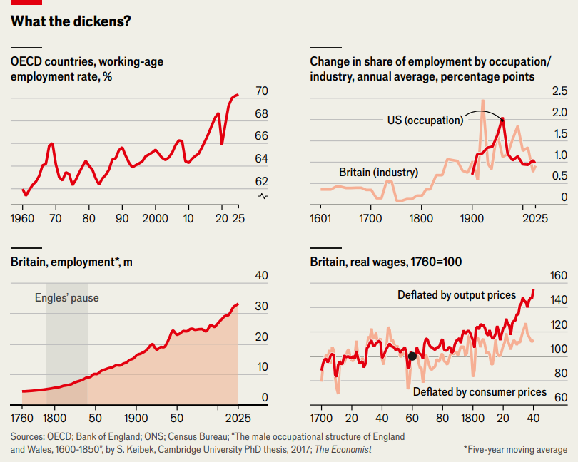

Techno-economics

<audio controls> 
    <source src=""> 
</audio>

<strong>The jobs apocalypse: a (very) short history</strong>

<strong>Mass unemployment induced by AI would be unprecedented</strong>

AT NO TIME in polling history have Americans been less optimistic about their long-term employment prospects. The average person believes they have a 22% chance of losing their job in the next five years, according to one survey, a higher share than even during the global financial crisis of 2007-09. The cause of this gloom is artificial intelligence. Nearly one in five American workers recently told another pollster that AI or automation is “very” or “somewhat” likely to replace them.

在民调历史上，美国人从未像现在这样对自己的长期就业前景感到悲观。一项调查显示，普通人认为自己未来五年内有 $\textcolor{#548dd4}{22\%}$ 的概率失业，这一比例甚至高于 $\textcolor{#548dd4}{2007-2009}$ 年全球金融危机期间。造成这种悲观情绪的原因是人工智能。最近，近五分之一的美国劳动者在另一项民调中表示，$\textcolor{#548dd4}{\ce{AI}}$ 或自动化 “很可能” 或 “在一定程度上可能” 取代自己的工作。

It isn’t just average people who are alarmed. So are the leaders of the very AI companies causing the anxiety. Dario Amodei of Anthropic has warned that AI could push unemployment to 10-20%. Bill Gates, co-founder of Microsoft, said that in an AI world people will not be needed for “most things”. Sam Altman, boss of OpenAI, has <mark style="background:#fdbfff">clocked</mark>[^1] that talking up the technology’s disruptive power is provoking a backlash, and now speaks of “tools to augment and elevate people, not entities to replace them”. But even he could not resist mentioning “disruption/significant transition as we switch to new jobs”.

忧心忡忡的不只是普通民众，引发这份焦虑的人工智能企业高管同样心存顾虑。$\textcolor{#548dd4}{\ce{Anthropic}}$ 的达里奥・阿莫迪警示，人工智能或致使失业率攀升至 $\textcolor{#548dd4}{10\%}$ 至 $\textcolor{#548dd4}{20\%}$。微软联合创始人比尔・盖茨称，人工智能普及后，多数工作岗位将不再需要人力参与。$\textcolor{#548dd4}{\ce{OpenAI}}$ 总裁山姆・奥尔特曼意识到，大肆宣扬技术颠覆性会引发公众抵触，如今转而表示 $\textcolor{#548dd4}{\ce{AI}}$ 是助力人类提升能力的工具，而非取代人类的存在。但他依旧坦言，就业格局将迎来剧变与重大转型，人们需要转向全新岗位。

Economists are, for a change, far less dismal. They are allergic to the “<mark style="background:rgba(136, 49, 204, 0.2)">lump of labour fallacy</mark>”[^2] which treats the jobs market as static and <mark style="background:rgba(136, 49, 204, 0.2)">zero-sum</mark>[^3]. If technology displaces workers from some occupations, they argue, it enriches others, who then spend their gains on goods and services that create new employment.

相较之下，经济学家态度乐观不少。他们并不认同劳动总量谬误，该观点将就业市场视作静止不变的零和博弈。经济学家认为，即便技术淘汰部分岗位，也会创造新财富，财富消费又能催生全新就业机会。

The labour market certainly is not cracking yet. The share of the <mark style="background:rgba(136, 49, 204, 0.2)">OECD</mark>[^4]’s working-age population with a job keeps breaking records, unemployment across the club of mostly rich countries is just 5%, and America employs more people than ever in “AI-exposed” industries like law. American graduates have been struggling since before OpenAI launched ChatGPT in late 2022. Many economists foresee relatively little disruption ahead. Those at America’s Bureau of Labour Statistics think the country will add 5.2m jobs between 2024 and 2034, increasing total employment by 3%.

劳动力市场目前尚未出现颓势。经合组织劳动年龄人口就业率屡创新高，一众发达经济体失业率仅为 $\textcolor{#548dd4}{5\%}$。美国法律等易受人工智能冲击的行业，从业人数也创下历史新高。早在 $\textcolor{#548dd4}{2022}$ 年末 $\textcolor{#548dd4}{\ce{OpenAI}}$ 推出聊天机器人前，美国毕业生就业便已承压。多数经济学家预判后续行业变动幅度有限。美国劳工统计局预估，$\textcolor{#548dd4}{2024}$ 至 $\textcolor{#548dd4}{2034}$ 年间国内将新增 $\textcolor{#548dd4}{520}$ 万个岗位，就业总量涨幅达 $\textcolor{#548dd4}{3\%}$。

Advances in AI’s capabilities could render current data, and extrapolations from this, obsolete. But if this happened, and AI really were to put millions of people out of work, it would be unprecedented in human history. Never have new technologies spread fast enough to make large numbers of people unemployed for a long time. Understanding why may shed light on how this time is—and is not—different.

人工智能性能的进步，或许会让现有数据及据此做出的推断失效。倘若 $\textcolor{#548dd4}{\ce{AI}}$ 真致使数百万人失业，这将成为人类史上前所未有的局面。过往新技术从未因普及速度过快，造成大规模长期失业。厘清背后缘由，便能知晓此次变革的异同之处。

Historical data suggest that technological diffusion always proceeds slowly. In a paper published in 2012 Robert Gordon of Northwestern University found that since 1300, growth of GDP per person at whatever was the world’s most sophisticated economy of its time has never exceeded about 2.5% a year. When other countries grew faster than this, they did so by catching up with a richer place that, almost by definition, sparked earlier wealthcreating technological progress. And the fact that growth at the frontier of innovation was slower meant that so was the pace of any job destruction.

历史数据表明，技术普及进程向来缓慢。西北大学罗伯特・戈登在 $\textcolor{#548dd4}{2012}$ 年发表的论文中指出，自 $\textcolor{#548dd4}{1300}$ 年以来，全球同期顶尖经济体的人均 $\textcolor{#548dd4}{\ce{GDP}}$ 年均增速从未突破 $\textcolor{#548dd4}{2.5\%}$。他国若实现更快增长，本质是追赶先行富裕地区，而财富创造类技术革新往往率先诞生于此。创新前沿增速偏缓，岗位淘汰的节奏也随之放缓。

Take farming. Although it has undergone monumental technological upheavals over the past millennium, farm employment has changed only slowly. The share of England’s labour force in agriculture has been falling steadily since the 16th century without ever collapsing suddenly. The recognisably modern tractor was invented in America at the start of the 20th century, and it took generations rather than years for the agricultural workforce to decline.

以农业为例。过去千年间农业历经颠覆性技术变革，但农业就业人数变化平缓。$\textcolor{#548dd4}{16}$ 世纪起，英国农业劳动力占比持续下降，从未出现骤减。具备现代形态的拖拉机于 $\textcolor{#548dd4}{20}$ 世纪初在美国问世，农业从业人口历经数代人才逐步缩减，而非短短数年。

Even when job disruption is faster, workers need not suffer. In the middle of the 20th century the first computers, shipping containers and other wonders led Harold Wilson, a British prime minister, to describe the “white heat of technology” burning through Western economies. GDP per person in America, which had by then <mark style="background:#fdbfff">dislodged</mark>[^5] Britain as the world’s frontier economy, grew by 2.5% a year, the fastest ever for a leading economic power. The level of job disruption, as measured by the share of employment shifting between industries or occupations, was at times more than twice as high as it is today. Yet many people look back fondly on that era as a time of rising wages, widening opportunity and unpolarised politics.

即便岗位更迭速度加快，劳动者也未必会蒙受损失。$\textcolor{#548dd4}{20}$ 世纪中叶，初代计算机、海运集装箱等新技术相继问世，英国首相哈罗德・威尔逊将席卷西方经济体的变革称作技术白热化浪潮。彼时美国取代英国，成为全球经济发展标杆，其人均 $\textcolor{#548dd4}{\ce{GDP}}$ 年均增速达 $\textcolor{#548dd4}{2.5\%}$，创下头号经济体增速纪录。以行业与职业间就业流转占比衡量，当时岗位变动幅度一度远超现今两倍。如今不少人回望那段岁月，仍感念薪资上涨、机遇增多、政治分歧缓和的美好光景。

One instance of technological change has become notorious: the Industrial Revolution in 19th-century Britain. According to some accounts, it was horribly disruptive to workers. James Watt’s inventions in the 1760-1780s made steam engines efficient enough to power factories. This led to a period of blistering economic growth that appeared to coincide with stagnation in inflation-adjusted wages. Between 1790 and 1840 these barely <mark style="background:#fdbfff">budged</mark>[^6], even as capitalists earned vast profits.

有一次技术变革声名狼藉：$\textcolor{#548dd4}{19}$ 世纪英国工业革命。部分记载显示，它对劳动者冲击极大。$\textcolor{#548dd4}{18}$ 世纪 $\textcolor{#548dd4}{60}$ 至 $\textcolor{#548dd4}{80}$ 年代，詹姆斯・瓦特改良蒸汽机，使其能效足以驱动工厂生产。此后经济飞速增长，同期扣除通胀后的实际薪资却陷入停滞。$\textcolor{#548dd4}{1790}$ 至 $\textcolor{#548dd4}{1840}$ 年间薪资几乎毫无变动，资本家却攫取巨额利润。

Today’s “thought leaders” in Silicon Valley often invoke this pause. It is associated with Friedrich Engels, a capitalist-heir-turned-communist who described it in “The Condition of the Working Class in England”, his account of Manchester’s slums in the 1840s. Recent scholarship, though, casts doubt on whether “Engels’ pause” is a useful blueprint for what AI may have <mark style="background:rgba(136, 49, 204, 0.2)">in store</mark>[^7] for workers.

如今硅谷各界思想领袖常援引这段薪资停滞期。该现象与弗里德里希・恩格斯相关，这位出身资本家家庭、后投身共产主义的学者，在《英国工人阶级状况》中记述了 $\textcolor{#548dd4}{19}$ 世纪 $\textcolor{#548dd4}{40}$ 年代曼彻斯特贫民窟的面貌。不过近代研究质疑，所谓 “恩格斯停滞” 能否作为预判人工智能就业影响的参考范本。

The composition of British employment saw little churn until the 1850s, and then only as much as it does today. Moreover, if technology destroyed jobs, it created plenty more. Between 1760 and 1860 the number of Britons in work ballooned from 4.5m to 12m. Unemployment generally remained modest.

$\textcolor{#548dd4}{19}$ 世纪 $\textcolor{#548dd4}{50}$ 年代前，英国就业结构变动幅度极小，此后更迭规模也仅与当下持平。技术即便淘汰岗位，也会催生更多就业机会。$\textcolor{#548dd4}{1760}$ 至 $\textcolor{#548dd4}{1860}$ 年，英国就业人数从 $\textcolor{#548dd4}{450}$ 万激增至 $\textcolor{#548dd4}{1200}$ 万，整体失业率始终维持低位。

Wage growth was indeed slow during Engels’ pause—but no slower than in the half-century before it. This reflected slow productivity growth in the Industrial Revolution’s early years, itself a function of the gradual diffusion of Watt’s technological breakthroughs. By 1830 only about 160,000 horsepower was in use in the whole of Britain, equivalent to 1,000 typical modern cars. Given rapid population growth in the period, it is a “truly remarkable achievement” that workers’ purchasing power grew at all, as Sir Tony Wrigley, a late British demographer, put it. It looks even more remarkable if you adjust wages not by the consumer-price index, as historians tend to, but by the average price of domestically produced output, the “<mark style="background:rgba(136, 49, 204, 0.2)">GDP deflator</mark>[^8]”.

恩格斯停滞期薪资增速确实低迷，但并未低于此前五十年水平。这源于工业革命初期生产力提升迟缓，本质是瓦特技术成果逐步普及所致。$\textcolor{#548dd4}{1830}$ 年全英在用马力仅约 $\textcolor{#548dd4}{16}$ 万，相当于千辆普通现代汽车动力。彼时人口激增，英国已故人口学家托尼・里格利爵士称，劳动者购买力仍能实现增长，已是不俗成就。若摒弃史学常用的居民消费价格指数，改用国内产出均价即 $\textcolor{#548dd4}{\ce{GDP}}$ 平减指数核算薪资，这份增长更显难得。

The gap between the two measures of real wages illustrates a crucial point about the Industrial Revolution. The average employer paid workers reasonably fairly after selling his wares and deducting the cost of materials. He did not profit from exploiting his staff, as Engels supposed. The problem for labourers was less unfair pay than sharp rises in the cost of living. Food prices rose steadily, and sometimes soared, because of war and high tariffs on grain imports. The <mark style="background:#fdbfff">villains</mark>[^9] of the Industrial Revolution were politicians, not machines.

两种实际薪资核算口径的差异，点明了工业革命的关键真相。雇主售出货品、扣除原料成本后，给工人的酬劳整体相对公允，并非如恩格斯所想靠压榨员工牟利。工人困境不在于薪资不公，而是生活成本大幅攀升。受战事与谷物进口高关税影响，粮价持续走高、时常暴涨。工业革命时期的症结源于政策层面，而非机器本身。

This puts a different <mark style="background:#fdbfff">gloss</mark>[^10] on the industrial unrest of the period. In the early 19th century textile workers revolted, destroying the power looms they thought would kill their craft. A few years later farm labourers smashed <mark style="background:#fdbfff">threshing</mark>[^11] machines across southern England. Historians link such unrest to technological disruption, yet strikes and wrecking are as old as time. In England, riots were less frequent in the early 1800s—the middle of Engels’ pause—than later in the century, when real wages were growing strongly. The Chartists, who secured <mark style="background:#fdbfff">suffrage</mark>[^12] and other rights for working men, did not gain ground until wage growth was unpaused in the 1840s.

这让人们对当时的劳工动乱有了全新解读。$\textcolor{#548dd4}{19}$ 世纪初，纺织工人发起反抗，捣毁他们认为会断送自身手艺的动力织布机。数年后，英格兰南部的农场劳工又大肆破坏脱粒机。史学家将这类动乱归咎于技术冲击，但罢工与破坏行为自古便存在。恩格斯停滞期的 $\textcolor{#548dd4}{19}$ 世纪初期，英国骚乱频次反倒低于薪资大幅上涨的世纪中后期。为工人争取选举权与其他权益的宪章运动，也是在 $\textcolor{#548dd4}{19}$ 世纪 $\textcolor{#548dd4}{40}$ 年代薪资恢复增长后才逐步壮大。

Nicholas Crafts, an economic historian, summed it up neatly. The Industrial Revolution, he wrote, is “not a template” for “technological change that [boosts] productivity at the expense of a significant …decline in labour’s share of national income”. In short, those warning of AI-driven mass unemployment are predicting something that has never happened before.

经济史学家尼古拉斯・克拉夫茨对此总结精辟。他表示，工业革命并不能当作参照范本，印证技术提升生产力会大幅压缩劳动收入占国民收入的比重。简言之，那些担忧人工智能引发大规模失业的预判，史无前例。

That does not mean it can never happen at all. The first signs would be sharply rising productivity combined with weak real-wage growth in America, the world’s frontier economy. This would show up as an increase in GDP per person, above Mr Gordon’s ceiling of 2.5%, and a simultaneous jump in corporate profits, reflecting the gains from higher output flowing to capital, not labour. Another signal would be big job losses in lots of industries.

这不代表此类情况绝不会出现。若全球前沿经济体美国出现生产力大幅攀升、实际薪资增长疲软，便是初步征兆。届时人均 $\textcolor{#548dd4}{\ce{GDP}}$ 增速将突破戈登提出的 $\textcolor{#548dd4}{2.5\%}$ 上限，企业利润同步暴涨，增产收益流向资本而非劳动者。各行业大规模岗位流失，也会是一大预警信号。

History holds a final lesson. If disruption is coming, it will show up in a recession. Downturns cleanse the economy of unproductive jobs. Companies must make radical changes to survive; weak firms go under; capital and labour moves to more productive ones. Almost all of America’s once-routine jobs have vanished during past downturns. Which ones vanish next time will offer a big hint. Until then everyone—including Messrs Amodei, Gates and Altman—will remain none the wiser about the shape of the AI world to come.

历史给出最后启示。若技术冲击终将到来，会率先在经济衰退中显现。经济下行会淘汰低效岗位，企业唯有大刀阔斧改革方能存续，弱势企业就此倒闭，资本与劳动力流向高效产业。美国过往衰退期里，绝大多数重复性工作都逐步消失。下一轮淘汰的岗位类型，将成为重要预兆。在此之前，无人能预判人工智能时代的最终格局，包括阿莫迪、盖茨、奥特曼等人。

[^1]: **clock**: v. to realize or notice something

[^2]: **lump of labour fallacy**：劳动总量谬误，认为‌经济中的工作总量是固定不变的“一块饼”‌，因此移民、技术进步或缩短工时只会“抢走”或“分配”现有岗位，导致失业，实则忽视了经济的动态性、需求弹性与新岗位创造能力

[^3]: **zero-sum**：零和博弈，非合作博弈类型，指参与各方在严格竞争中，一方的收益必然意味着另一方的损失，双方收益与损失相加总和永远为零

[^4]: **OECD**：经济合作与发展组织

[^5]: **dislodge** /dɪsˈlɑːdʒ/: v. take the place of something or someone previously dominant

[^6]: **budge** /bʌdʒ/: v. change a position, opinion or amount

[^7]: **in store**: 即将发生

[^8]: **GDP deflator**：GDP 平减指数，未剔除价格变动的 GDP（现价 GDP 或名义 GDP）与剔除价格变动的 GDP（不变价 GDP 或实际 GDP）之比

[^9]: **villain** /ˈvɪlən/: n. something regarded as the main cause of harm or trouble

[^10]: **gloss** /ɡlɔːs/: n. an interpretation or explanation of something

[^11]: **threshing** /ˈθreʃɪŋ/: n. separating grain from harvested crops

[^12]: **suffrage** /ˈsʌfrɪdʒ/: n. the right to vote in political elections
