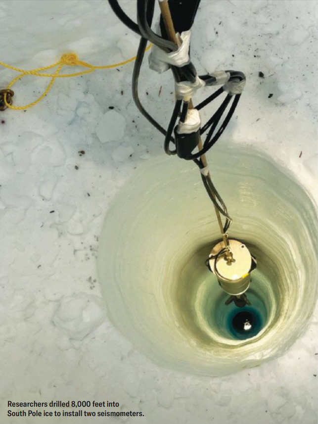

SEISMOLOGY

**ON THE SURFACE**, Antarctica’s vast ice sheet appears still and unchanging. But deep below, vibrations <mark style="background:#fdbfff">ripple</mark>[^1] through the frozen plain, transmitting the movements of Earth’s tectonic plates—and scientists now have a formidable new set of tools to listen in with. The U.S. Geological Survey (USGS), collaborating with the IceCube Neutrino Observatory at the South Pole, has installed the deepest <mark style="background:#fdbfff">seismometers</mark>[^2] ever deployed. At 8,000 feet under the ice, the two instruments will record earthquakes of magnitude 5 or greater anywhere on the planet with unprecedented accuracy and help to reveal new details of Earth’s deep interior in the process.

从表面上看，南极洲广袤的冰盖仿佛静止不变。但在冰层深处，震动如涟漪般在冰封大地上传导，传递着地球构造板块的活动信号 —— 如今科学家拥有了一套强大的全新设备来监听这些震动。美国地质调查局（USGS）与南极冰立方中微子天文台合作，布设了有史以来放置深度最深的地震仪。两台仪器深埋冰层8000 英尺，能够以前所未有的精度记录全球 5 级及以上地震，同时助力人类进一步探明地球深部内部构造的全新细节。

The South Pole is one of Earth’s quietest places because there is very little humanmade infrastructure and no background “noise” from the planet’s rotation, which can distort seismometer data. At their depth, the new seismometers may also be shielded from disruptive changes in atmospheric pressure, says USGS research geophysicist Robert Anthony, the Deep Ice Seismometer project manager.

南极是地球上最安静的区域之一，这里几乎没有人造基础设施，也没有来自地球自转的背景 “噪音”—— 这类噪音会干扰地震仪的数据。美国地质调查局研究地球物理学家、深冰地震仪项目经理罗伯特・安东尼表示，新布设的地震仪处于这般深度，还能避开大气压变化带来的干扰。

Engineers “drilled” holes by shooting pressurized hot water into the ice to melt it. “The drill is producing as much energy as the most powerful steam locomotive ever made and channeling it all through an <mark style="background:#fdbfff">orifice</mark>[^3] the size of a penny,” Anthony says. At a rate of roughly three feet per minute, the drill can complete a hole in about 50 hours, after which the team has another 50 hours to lower strings of instrumentation before the ice refreezes. To contend with the pressure at a depth of 8,000 feet, the seismometers are encased in a stainless steel vessel built to withstand 10,000 pounds per square inch.

工程师们通过向冰层喷射高压热水将冰层融化，以此 “钻探” 深井。安东尼说：“这台钻探设备输出的能量，堪比史上功率最大的蒸汽机车，且所有能量都从一枚硬币大小的喷口集中释放。”钻探速度约为每分钟三英尺，钻完一口井大约需要 50 小时。冰层重新冻结前，团队还有另外 50 小时下放成套仪器设备。为承受 8000 英尺深处的压力，地震仪被封装在不锈钢耐压舱内，其设计可抵御每平方英寸 10000 磅的压强。

Each seismometer contains a small pendulum suspended within a magnetic field; when a vibration reaches the sensor, a resistor measures the magneticfield strength required to keep the pendulum stationary. “This lets us record lower-frequency ground motions all the way down to the <mark style="background:rgba(136, 49, 204, 0.2)">solid Earth tides</mark>[^4] driven by the gravitational attraction of the sun, Earth and moon,” Anthony says. Scientists can use these data to quickly characterize how a <mark style="background:#fdbfff">fault</mark>[^5] moved to generate an earthquake, which can help them determine whether it also triggered a tsunami. The South Pole station fills a significant gap in global seismic coverage, researchers say, because of its distance from other stations and the lack of interference from Earth’s rotation.

每台地震仪内部都有一个悬挂在磁场中的小型摆锤；当震动传至传感器时，电阻器会测量出使摆锤保持静止所需的磁场强度。安东尼表示：“这让我们能够记录更低频率的地表运动，甚至可以捕捉到由太阳、地球和月球引力引发的固体潮振荡。”科学家可利用这些数据快速判定断层引发地震的运动方式，进而判断此次地震是否还会触发海啸。研究人员称，南极观测站填补了全球地震监测网络的一大空白，原因在于它远离其他监测站点，且不受地球自转带来的干扰。

“Earthquake waves don’t just shake the surface; they go in all directions, including down,” says David Wilson, director of the Global Seismographic Network. The deep seismometers will be particularly good at recording longperiod seismic waves created by large earthquakes (about magnitude 7 or greater). “These waves can go on for months after a large earthquake because there’s nowhere for the energy to go to dissipate,” Wilson says. “Imagine hitting a bell. It’s going to sit there and ring until the energy completely dies down.”

全球地震台网负责人戴维・威尔逊表示：“地震波不只是晃动地表，而是会向四面八方传播，也包括向地下深处传导。”这批深层地震仪尤其擅长记录大型地震（约 7 级及以上）产生的长周期地震波。威尔逊说：“强震发生后，这类波动可以持续数月之久，因为能量无处耗散。好比敲击一口钟，它会一直嗡鸣，直到能量完全衰减殆尽。”

—<i>Vanessa Bates Ramirez</i>

[^1]: **ripple** /ˈrɪpl/: v. to spread out in small waves or gentle vibrations across a surface or through a substance

[^2]: **seismometer** /saɪzˈmɒmɪtə(r)/: n. an instrument that detects and measures vibrations and seismic waves caused by earthquakes or underground movements

[^3]: **orifice** /ˈɒrɪfɪs/: n. a small opening or hole, especially one in a machine, pipe or body part

[^4]: **solid earth tide**：固体潮振荡，在日、月引潮力的作用下，固体地球产生的周期形变的现象

[^5]: **fault** /fɔːlt/: n. a crack or fracture in Earth’s crust where two blocks of rock move past each other
