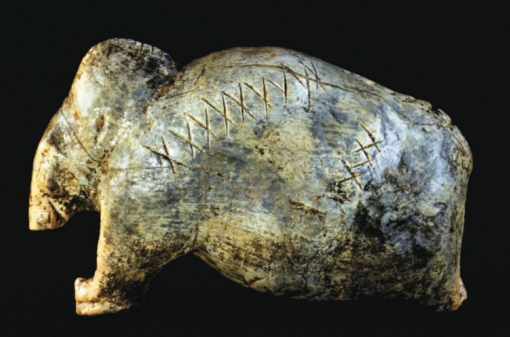

SCIENCE IN IMAGES

**ONE OF THE OLDEST KNOWN PIECES OF ART** on the planet is a <mark style="background:#fdbfff">figurine</mark>[^1] of a mammoth that was carved in ivory by a Stone Age artisan some 40,000 years ago. The figurine was found in what is now Germany and is marked with mysterious crosses and dots. A new analysis of the object and hundreds of others found in caves in the same region now suggests the markings might have held particular meaning to their ancient creators.

地球上已知最古老的艺术品之一，是一尊猛犸象雕像，约四万年前由石器时代的工匠以象牙雕刻而成。这尊雕像出土于今德国境内，表面刻有神秘的十字与圆点符号。研究人员对这件文物以及同一地区洞穴中出土的数百件其他器物展开新研究后认为，这些刻痕符号对远古创作者而言，或许蕴含着特殊含义。

Researchers examined more than 3,000 markings on 260 Stone Age objects, including the mammoth, a mysterious lion-human hybrid, and lesser known tools and musical instruments, says Ewa Dutkiewicz, a research associate at the Museum of Prehistory and Early History in Berlin. They determined that the markings’ patterns are as statistically complex as <mark style="background:#fdbfff">proto-cuneiform</mark>[^2], an early form of writing seen on tablets from ancient Mesopotamia dating to around 3500 B.C.E.

柏林史前与早期历史博物馆的副研究员埃娃・杜特凯维奇表示，研究人员检视了 260 件石器时代器物上的 3000 余处刻痕，包含这件猛犸象雕像、神秘的狮头人身像，以及一些知名度较低的工具与乐器。研究判定，这些刻痕图案在统计复杂度上，与原始楔形文字相当。原始楔形文字是古美索不达米亚泥板上出现的早期文字形式，可追溯至公元前约 3500 年。

This type of work can be “challenging,” in part because such ancient markings are practically impossible to interpret, explains Genevieve von Petzinger, a <mark style="background:#fdbfff">paleoanthropologist</mark>[^3] and National Geographic Emerging Explorer, who studies the origin of writing and wasn’t involved in the study. But looking for patterns in the symbols such as intentionality and repetition “are two excellent approaches for at least trying to confirm that these marks were meaningful beyond being decorative <mark style="background:#fdbfff">doodles</mark>[^4].”

古人类学家、《国家地理》新锐探险家吉纳维芙・冯・佩青格专门研究文字起源，她并未参与这项研究。她解释说，这类研究颇具挑战性，部分原因是这些远古刻痕几乎无法解读。但探寻符号中刻意排布、重复出现这类规律，是两种极佳的研究思路，至少可以尝试证实：这些符号绝非单纯装饰性涂鸦，而是另有深意。

 shows marks similar in complexity to those on the newly analyzed objects, including a 38,000-year-old figurine and a 40,000-year-old ivory mammoth carving")

To find out whether the markings were decorations, <mark style="background:#fdbfff">tallies</mark>[^5] of hunting kills, or something else, Dutkiewicz worked with linguist Christian Bentz, who studies the history of language at Saarland University in Germany. The pair digitized the markings and compared features—such as sign diversity and repetition—with those of other, more recent sign systems. The pattern doesn’t resemble modern-day writing. But when Bentz compared the marks with early protocuneiform, he says, the similarity was unmistakable.

为弄清这些刻痕究竟只是装饰、狩猎记数符号，还是另有含义，杜特凯维奇与德国萨尔大学研究语言史的语言学家克里斯蒂安・本茨展开合作。两人将这些刻痕数字化，把符号种类、重复频次等特征，与后世其他符号体系进行比对。研究发现，这类图案和现代文字并不相似。但本茨将其与早期原始楔形文字对比后表示，二者的相似之处显而易见、毋庸置疑。

“I couldn’t believe it. I went through the data again and again,” Bentz says. The Stone Age markings and proto-cuneiform appear to have equal complexity, even though their makers were separated by some tens of thousands of years and considerable distance.

本茨说：“我简直不敢相信，我把数据反复核对了一遍又一遍。”这些石器时代刻痕与原始楔形文字，在复杂程度上旗鼓相当，尽管二者的创造者相隔数万年之久，地理距离也十分遥远。

Across the 260 objects, ivory figurines such as the mammoth carried more information-dense markings than tools did, the researchers say. Crosslike marks didn’t appear on objects depicting humans, and dots didn’t appear on tools— indicating that the markings must have had some kind of symbolic meaning to the Stone Age humans who made them, Bentz says. “The organization [of the markings] points to the transmission of more complex ideas,” von Petzinger says. The findings were published recently in the *Proceedings of the National Academy of Sciences USA*.

研究人员表示，在这 260 件器物中，猛犸象等象牙小雕像上的刻痕，信息密度要高于普通工具上的刻痕。本茨指出，十字类符号从未出现在人形器物上，圆点符号也从不见于工具之上，这说明这些刻痕对创作它们的石器时代人类来说，必定具备某种象征意义。冯・佩青格称：“这些刻痕的排布方式，表明当时已有更复杂思想的传承与表达。”该研究成果近日发表于《美国国家科学院院刊》。

Decoding what these specific markings meant is an exceptionally difficult, if not impossible, task. But Bentz and Dutkiewicz’s methods could help other researchers determine what similar markings on other ancient objects from elsewhere around the world may signify—even though they cannot read them.

破译这些特定刻痕的含义，即便不是完全不可能，也是一项极其艰难的工作。但本茨与杜特凯维奇的研究方法，能够帮助其他学者判断全球各地其他古器物上的相似符号可能代表什么 —— 即便目前还无法读懂这些符号。

“The more we can learn about the selection of ‘writing’ surfaces and choices about specific images and signs, the more we will be able to learn about this period from which [writing] later emerged,” von Petzinger says.

佩青格说道：“我们对古人书写载体的选择，以及特定图案与符号的取舍了解得越多，就越能深入洞悉文字诞生前夕的那个时代。”

—<i>Jackie Flynn Mogensen</i>

[^1]: **figurine** /ˌfɪɡəˈriːn/: n. a small decorative statue of a person or animal, made of stone, ivory, clay, etc.

[^2]: **cuneiform** /ˈkjuːnɪfɔːm/: n. an ancient system of writing used in Mesopotamia, made of wedge-shaped marks pressed into clay tablets

[^3]: **paleoanthropologist** /ˌpeɪliəʊˌænθrəˈpɒlədʒɪst/: n. a scientist who studies the origins and development of early humans using fossil remains and ancient artifacts

[^4]: **doodle** /ˈduːdl/: n. simple, unconscious drawings made idly, without serious purpose

[^5]: **tally** /ˈtæli/: n. marks made to keep a count or record of something
