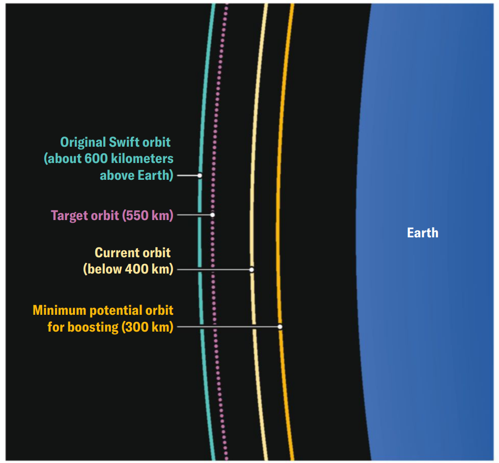

SPACE

<mark style="background:#d8c9eb;"><strong>NASA’S NEIL GEHRELS</strong> Swift Observatory</mark>[^1] is in a race against time. For more than 21 years the Earth-orbiting telescope has surveyed the sky for <mark style="background:#d8c9eb">gamma-ray bursts</mark>[^2]—the most powerful and luminous explosions in the universe—and whipped around to take a closer look. But on every orbit, it collides with countless particles from the planet’s atmosphere. Each impact steals a tiny bit of the spacecraft’s speed, pushing it a <mark style="background:#fdbfff">smidgen</mark>[^3] closer to Earth.

NASA 的尼尔・格雷尔斯雨燕天文台正在与时间赛跑。21 年多来，这台环绕地球运行的望远镜一直在巡天搜寻伽马射线暴 —— 宇宙中最剧烈、最明亮的爆炸现象，并迅速转向目标进行近距离观测。但在每一圈轨道运行中，它都会与来自地球大气层的无数粒子发生碰撞。每一次碰撞都会夺走航天器的一小部分速度，使它离地球更近一点点。

If left alone, the spacecraft will lose the race later this year and fall out of orbit, bringing a fiery end to its long scientific <mark style="background:#fdbfff">tenure</mark>[^4]. But NASA hopes to buy the telescope an extra decade through a long-standing space-technology dream: a mission in which a robot will gently <mark style="background:#d8c9eb">glom on to</mark>[^5]Swift, push it up into a safer orbit, then set it free. If it works, the technique could open up new possibilities for science spacecraft more generally.

如果放任不管，这颗航天器将在今年晚些时候输掉这场与时间的赛跑，脱离轨道，为它漫长的科学使命画上一个燃烧的句号。但 NASA 希望通过一个由来已久的航天技术梦想，为这台望远镜争取额外十年的寿命：一项由机器人轻柔地 “依附” 到雨燕号上，将其推至更安全的轨道，随后再与之分离的任务。如果成功，这项技术将为科学航天器的维护开启更广泛的新可能。

“There have been ideas like this around for a long time, and I think the technology is finally getting to the point where it’s not crazy,” says Jonathan McDowell, an astronomer and space sustainability analyst.

天文学家兼太空可持续发展分析师乔纳森・麦克道威尔表示：“这类构想早已存在多年，而且我认为这项技术终于发展到了不再是天方夜谭的阶段。”

The Swift Observatory is equipped with a Burst Alert Telescope that surveys a huge amount of the sky at once, looking for flashes of light and pinpointing their locations. When the spacecraft detects something interesting, it pivots within a minute or two to examine the spot with its other two telescopes—one catching ultraviolet and visible light and the other capturing x-rays.

雨燕天文台配备了爆发预警望远镜，可一次性对大片天区进行巡天扫描，搜寻闪光信号并精准定位其位置。一旦航天器探测到异常目标，便会在一两分钟内转向目标方位，通过另外两台望远镜开展观测：一台捕捉紫外线与可见光，另一台采集 X 射线。

It’s this <mark style="background:#fdbfff">agility</mark>[^6] that inspired the mission’s name and has enabled its continuing relevance to astronomy even after scientists solved their most pressing mysteries about gamma-ray bursts. Recently Swift has more often been used to follow up on intriguing detections made by other observatories. And in the coming years, as the Vera C. Rubin Observatory in Chile <mark style="background:#d8c9eb">ramps up</mark>[^7] its work and NASA’s Nancy Grace Roman Space Telescope launches, there will be many, many more such discoveries in need of swift—or, rather, Swift—observations.

正是这种灵活快速的反应能力，赋予了这项任务命名的灵感，也让它在科学家解开了伽马射线暴最紧迫的谜团之后，依旧在天文学领域保有持续的价值。近来，雨燕望远镜更多被用来跟进其他天文台捕捉到的奇特天文现象。未来几年，随着智利的薇拉・鲁宾天文台逐步投入满负荷运行，以及美国宇航局南希・格雷斯・罗曼太空望远镜发射升空，将会涌现出海量新发现，急需迅速—— 确切地说，急需雨燕号望远镜跟进观测。

“Swift is really the only facility out there that can provide that very rapid follow-up,” says Brad Cenko, an astrophysicist at the NASA Goddard Space Flight Center in Maryland and principal investigator of the mission. “We think this capability is actually something that the demand is just going to continue to grow for.”

马里兰州 NASA 戈达德太空飞行中心天体物理学家、该项目首席研究员布拉德・森科表示：“雨燕号确实是目前唯一能够实现这种超快速后续观测的设备。我们认为，这项观测能力的实际需求只会持续增长。”

Unfortunately, orbital physics has not cooperated. All spacecraft in low-Earth orbit, particularly the lowest 600 kilometers of space, are subject to drag from the atmosphere. The thicker the atmosphere, the worse the interference and the faster the fall. And the atmosphere’s thickness increases and decreases with solar activity. When the sun is especially active—as it has been in the past couple of years—atmospheric density is higher.

遗憾的是，轨道物理规律却并不配合。所有近地轨道航天器，尤其是运行在 600 公里以下低空区域的，都会受到大气阻力的影响。大气越稠密，干扰就越强，轨道衰减坠落的速度也越快。而大气密度会随太阳活动强弱起伏变化。当太阳活动格外剧烈时 —— 就像过去几年这样 —— 大气密度会变得更高。

Swift is feeling the burn of that extra atmosphere. The mission launched to an altitude of around 600 kilometers, where satellites can’t avoid atmospheric interference, but as recently as early 2024 it looked likely to withstand <mark style="background:#d8c9eb">solar maximum</mark>[^8] and operate into the 2030s. But the sun has been more active than expected, and by the beginning of 2025 it was clear that Swift was doomed to burn up later this year.

雨燕号正承受着大气密度升高带来的轨道损耗。该望远镜最初发射至约 600 公里的轨道高度，这一区域的卫星无法避开大气干扰。就在 2024 年初，它原本还有望挺过太阳活动极大期，继续服役至 2030 年代。但太阳活动强度超出预期，到 2025 年初，已经可以确定：雨燕号注定将在今年晚些时候坠入大气层焚毁。

The observatory’s team lobbied NASA for a rescue attempt based on the scientific value of Swift’s fast-response capability— and the fact that its <mark style="background:#fdbfff">days are already numbered</mark>[^9]. “If you’re successful, the scientific benefit is tremendous,” Cenko says. “If you’re not successful, obviously that’s not the outcome that we want, but it’s going to reenter sometime this year anyway.”

天文台团队凭借雨燕号快速响应能力的科研价值，以及它时日无多的现状，向美国国家航空航天局游说，争取开展救援任务。森科表示：“如果任务成功，科研收益将十分巨大；即便失败，固然不是我们想要的结果，但它反正今年迟早都会再入大气层坠毁。”

In September 2025 NASA signed a $30-million deal with Katalyst Space Technologies to attempt a rescue mission set to launch in early June. That’s an incredibly fast timeline for any mission, let alone one attempting robotic servicing, a feat that has long been a challenge for space technologists and has never been attempted for a science mission. When NASA’s space shuttles were flying, astronauts did carry out occasional servicing missions—most notably five flights to repair, upgrade and boost the Hubble Space Telescope. A robotic mission, though much cheaper, can’t fall back on human ingenuity and quick thinking when a challenge arises, making the tactic much more difficult.

2025 年 9 月，美国国家航空航天局与卡塔利斯特太空技术公司签署一份价值 3000 万美元的协议，计划实施救援任务，定于次年 6 月初发射。对任何航天任务而言，这个时间表都极其紧凑，更不用说这还是一次机器人在轨服务任务。这项技术长期困扰着航天技术专家，且从未在科研航天器上尝试过。NASA 航天飞机服役时期，宇航员曾执行过数次在轨维护任务，其中最著名的便是五次飞往哈勃空间望远镜，对其进行维修、升级和轨道抬升。机器人任务虽然成本低得多，但遇到突发状况时，无法依靠人类的智慧与临场应变，这也让这种作业方式难度大增。

But the moment may finally be ripe. For example, industry <mark style="background:#fdbfff">behemoth</mark>[^10] Northrop Grumman has successfully operated two Mission Extension Vehicles to revitalize commercial communications satellites. Now Katalyst is ready to take a shot and is building a three-armed robotic spacecraft to grab hold of the decades-old observatory. “Swift was never designed for capture,” says engineer Kieran Wilson, principal investigator on the Swift reboost mission at Katalyst. “The spacecraft was built more than 20 years ago, so there’s not even great documentation around what some of these interfaces look like that we’re looking to be able to grab on to.”

时机或许终于成熟了。例如，航天行业巨头诺斯罗普・格鲁曼公司已成功运营两艘任务延寿飞行器，为多颗商业通信卫星延长服役寿命。如今，卡塔利斯特公司准备放手一试，正在建造一艘带三机械臂的机器人航天器，用以捕获这台已有数十年历史的天文台。卡塔利斯特公司雨燕号轨道抬升任务首席工程师基兰・威尔逊表示：“雨燕号从一开始就没有按被捕获对接的标准设计。这颗航天器已是二十多年前建造的，就连我们计划抓取的一些接口结构，都没有完整详实的存档资料可供参考。”

Once complete, the spacecraft will be loaded onto a Northrop Grumman Pegasus rocket, which launches after being dropped out of a modified jet plane—a necessity to reach Swift’s unusual orbit close to the equator. By July or August, if all goes well, the spacecraft will begin the monthslong process of tugging Swift up, aiming for an altitude of about 550 kilometers. After releasing the observatory, the Katalyst spacecraft will dive down to burn up in the atmosphere, embracing the very fate from which it hopes to save Swift.

建造完成后，这艘服务航天器将被搭载到诺斯罗普・格鲁曼公司的飞马座火箭上。该火箭由改装飞机空中投放后点火发射，这也是抵达雨燕号靠近赤道特殊轨道的必要方式。如果一切顺利，到七八月份，服务航天器将开启为期数月的轨道拉升作业，目标是把雨燕号送至约 550 公里的轨道高度。完成分离释放后，卡塔利斯特的服务航天器将主动坠入大气层焚毁，甘愿走向它原本要为雨燕号规避的同一结局。

It’s a risky mission with no guarantee of success. “What keeps me up at night is the things that we don’t control,” says engineer Ghonhee Lee, Katalyst’s CEO. But if it works, the rescue mission could not just revive Swift but change the blueprint for science satellites in general by making robotic life extensions a spaceflight reality.

这是一场风险极高、成败未知的任务。卡塔利斯特公司首席执行官工程师李坤熙坦言：“最让我夜不能寐的，是那些我们无法掌控的未知因素。”但倘若任务成功，此次救援不仅能让雨燕号重获新生，还将把机器人在轨延寿变为航天常态，从根本上改写科研卫星的设计与运维范式。

“It’s almost like it’s a new mission,” Cenko says. “But you’re getting it for just a fraction of what it would cost to actually build something from scratch and fly it.”

森科说：“这几乎相当于开启了一项全新任务，但花费仅为从头研制并发射一颗新卫星的零头。”

—<i>Meghan Bartels</i>

[^1]: **NEIL GEHRELS Swift Observatory**：尼尔・格雷尔斯雨燕天文台，美国宇航局、英国、意大利联合研制的多波段空间天文台

[^2]: **gamma-ray burst**：γ 射线暴，来自天空中某一方向的伽玛射线强度在短时间内突然增强，随后又迅速减弱的现象，是已知宇宙中最强的能量爆发现象之一

[^3]: **smidgen** /ˈsmɪdʒɪn/: n. a small amount

[^4]: **tenure** /ˈtenjər/: n. the act, right, manner, or term of holding something

[^5]: **glom on to**: to grab hold of

[^6]: **agile** /ˈædʒəl/: adj. marked by ready ability to move with quick easy grace

[^7]: **ramp up**: to increase in amount, speed, or activity gradually and steadily

[^8]: **solar maximum**: 太阳活动极大期，太阳活动周期中太阳黑子、耀斑、日冕物质抛射等现象达到最频繁和最强烈的阶段

[^9]: **days are numbered**: to be likely to stop existing or fail very soon

[^10]: **behemoth** /bɪˈhiːməθ/: n. something enormous or powerful
