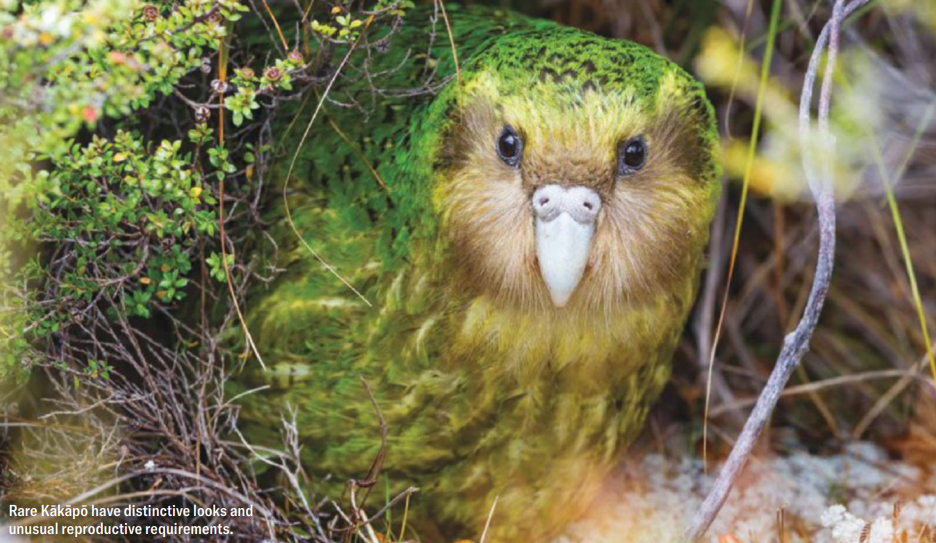

ECOLOGY

**THE BIGGEST BERRY BLOOM** in New Zealand’s forests in decades has set off a mating frenzy among the critically endangered <mark style="background:rgba(136, 49, 204, 0.2)">Kākāpō</mark>[^1], the world’s beefiest parrots.

新西兰森林数十年来规模最大的浆果盛产期，引发了极危物种鸮鹦鹉的疯狂求偶热潮，它们也是全球体型最壮硕的鹦鹉。

With the face of a Muppet and the physique of a <mark style="background:rgba(136, 49, 204, 0.2)">Furby</mark>[^2], the Kākāpō is an all-around <mark style="background:#fdbfff">preposterous</mark>[^3] creature. It’s <mark style="background:#fdbfff">nocturnal</mark>[^4] and <mark style="background:#fdbfff">lime</mark>[^5] green, and, as science-fiction writer Douglas Adams wrote, it “flies like a brick.” The animals produce a strong, fruity <mark style="background:#fdbfff">musk</mark>[^6], can weigh as much as a house cat, and can potentially live for 90 years or more.

鸮鹦鹉长着布偶娃娃般的脸蛋，身形又像菲比精灵，整体模样滑稽怪异。它夜行性，通体青柠绿；正如科幻作家道格拉斯・亚当斯所形容的，它 “飞起来像块砖头”。这种鹦鹉会散发出浓郁的果香麝味，体重堪比家猫，寿命甚至可达 90 年乃至更久。

At the beginning of 2026 only 236 Kākāpō remained in the world, and to the <mark style="background:#fdbfff">chagrin</mark>[^7] of their human conservation team, the birds rely primarily on a single fruit to set the mood for love. The animals mate <mark style="background:#fdbfff">prolifically</mark>[^8] only when the rimu tree—a towering <mark style="background:#fdbfff">conifer</mark>[^9] that can live for a millennium—produces a <mark style="background:rgba(136, 49, 204, 0.2)">bumper crop</mark>[^10] of bright-red berries, which happens every two to four years.

2026 年初，全球仅存 236 只鸮鹦鹉。令保育团队颇为无奈的是，这种鸟类主要依赖一种果实来触发求偶繁殖的状态。只有当陆均松 —— 这种可存活千年的高大针叶树 —— 结出漫山遍野的亮红色浆果时，鸮鹦鹉才会大量繁衍，而这种丰年结果的盛况，每两到四年才出现一次。

During the berry-backed <mark style="background:#fdbfff">courtship</mark>[^11] rituals, male Kākāpō use their <mark style="background:#fdbfff">stumpy</mark>[^12] little legs to scrape and <mark style="background:#fdbfff">stomp out</mark>[^13] earthen <mark style="background:#fdbfff">amphitheaters</mark>[^14] called booming bowls, which amplify their courtship song—a resonant, low-pitched call that carries for miles. “Rather than hearing it, you kind of feel it in the chest,” says Andrew Digby, science adviser for the Kākāpō team at the New Zealand Department of Conservation.

在这场依托浆果季展开的求偶仪式中，雄性鸮鹦鹉会用短小粗矮的爪子刨踩地面，造出一处泥土围成的圆形凹地，人称鸣求凹巢。这种土坑能放大它们的求偶鸣叫声 —— 一种低沉浑厚、回荡悠远的低频声响，可传至数英里之外。新西兰环保部鸮鹦鹉项目科学顾问安德鲁・迪格比表示：“这种声音不只是用耳朵听，更像是胸口能感受到的共振。”

Nearly all female Kākāpō of reproductive age have bred this year, Digby says, producing an impressive 248 eggs and counting. About half of the eggs will be fertile. Fewer will hatch, and fewer still will survive long enough to <mark style="background:#fdbfff">fledge</mark>[^15]. As of mid-March, scientists had tallied 70 living chicks.

迪格比称，几乎所有处于繁殖年龄的雌性鸮鹦鹉今年都完成了交配产卵，目前已产下多达 248 枚蛋，数量还在增加。这些蛋中约有一半可以受精，能成功孵化的更少，而最终活到羽翼丰满、离巢独立的幼鸟则还要再少一些。截至三月中旬，科研人员已统计出 70 只存活的雏鸟。

Recent population gains wouldn’t have been possible without a handful of Kākāpō “superbreeders” like Blades, a Kākāpō <mark style="background:rgba(136, 49, 204, 0.2)">Don Juan</mark>[^16] of unknown age who, after fathering 22 chicks since 1982, has been banished to “Bachelor Island” for fears that he’ll flood the gene pool. “He was a victim of his own success,” Digby says. “He was too popular.”

鸮鹦鹉种群数量近年得以增长，离不开少数几只 “超级繁殖个体”，比如布莱兹。它是一只年龄不详的鸮鹦鹉风流公子，自 1982 年以来已繁育出 22 只雏鸟。如今它被放逐到单身之岛，只因担心它的基因过度泛滥、挤占整个基因库。迪格比说：“它成了自己超强繁育能力的受害者，实在太受欢迎了。”

Once the fortunate eggs hatch, the females will rear their chicks alone. Every night Kākāpō moms use beak and <mark style="background:#fdbfff">talon</mark>[^17] to climb into the rimu tree <mark style="background:rgba(136, 49, 204, 0.2)">canopies</mark>[^18], up to 100 feet above the ground, to harvest berries—about a pound’s worth per chick each day. Some females have reproduced for more than 40 years, creating strong “dynasties,” Digby says. One Kākāpō <mark style="background:#fdbfff">matriarch</mark>[^19] named Nora has participated in 13 breeding cycles since 1981 and became both a mom and a great-great-grandmother this season.

有幸破壳的鸟蛋孵化后，雌鸮鹦鹉会独自抚育幼雏。每到夜晚，鸮鹦鹉妈妈便用喙和利爪爬上高达百英尺的陆均松树冠采食浆果，每只雏鸟每天大约需要进食一磅左右的果实。迪格比介绍，部分雌性鸮鹦鹉的繁殖生涯可长达四十余年，形成稳固的族群世系。有一只名叫诺拉的雌性领头鸮鹦鹉，自 1981 年以来已参与 13 次繁殖周期，今年繁殖季更是同时升级为妈妈和高曾祖母。

This year the New Zealand Department of Conservation set up a nest cam to let people watch Kākāpō supermom Rakiura hatch and rear foster chicks, fending off nest intruders that include shorebirds and bats. Although Rakiura is only 24 years old, she has successfully raised nine of her own chicks and fostered many more for less experienced females. Newly hatched chicks look like <mark style="background:rgba(136, 49, 204, 0.2)">dandelion</mark>[^20] puffs, but within a few weeks they become “weird little dinosaurs with these huge, oversize feet,” Digby says.

今年，新西兰环保部架设了鸟巢直播摄像头，让公众可以在线观看鸮鹦鹉超级慈母拉基乌拉孵化并抚育代养雏鸟的全过程，它还会驱赶包括滨鸟和蝙蝠在内的巢穴入侵者。拉基乌拉年仅 24 岁，却已成功养大 9 只亲生幼鸟，还为经验不足的雌鸟代养了更多雏鸟。迪格比说，刚孵化的雏鸟看上去像蒲公英绒球，几周之内，就长成了 “长着超大脚掌、模样古怪的小恐龙”。

The team hopes enough chicks will survive this year to bring the world Kākāpō population to 300—a major milestone for a species that was <mark style="background:#fdbfff">teetering</mark>[^21] with just 51 individuals in 1995. The flightless birds were easy pickings for invasive predators, including house cats, dogs and weasel-like stoats—the fruity eau de Kākāpō is <mark style="background:#fdbfff">pungent</mark>[^22] enough that even humans can track them by scent. The Kākāpō found sanctuary on three predator-free islands where the Ngāi Tahu people act as *kaitiaki*, or “caretakers,” of the birds. “It’s a *taonga* species, a treasure to us,” says Tāne Davis, who has been the Ngāi Tahu’s representative in Kākāpō conservation for 20 years.

保护团队希望今年能有足够多的雏鸟存活，让全球鸮鹦鹉种群数量突破 300 只。对这个 1995 年仅剩 51 只、种群岌岌可危的物种来说，这将是一个重要里程碑。这种不会飞的鸟类，很容易沦为入侵捕食者的猎物，包括家猫、野狗以及形似黄鼠狼的白鼬。鸮鹦鹉身上散发着浓郁的果香，气味浓烈到人类都能凭嗅觉追踪到它们。鸮鹦鹉如今在三座无捕食者的岛屿上找到了庇护所，毛利人纳吉塔胡部族担任着这些鸟类的守护者。已从事鸮鹦鹉保护工作二十年的部族代表塔内・戴维斯表示：“鸮鹦鹉是我们的珍宝物种，对我们而言弥足珍贵。”

The Kākāpō population has outgrown these refuges, and the pressure is on to “restore the *mauri*, or ‘life force,’ of the habitat” on larger islands by removing the invasive predators there, Davis says. The 2026 breeding cycle represents a new era for the Kākāpō, Davis and Digby agree. At the Ngāi Tahu’s request, some of the chicks born this year won’t be named. “It’s about letting them have their lives back in the wild,” Davis says.

戴维斯表示，鸮鹦鹉的种群数量已经超出了这些庇护小岛的承载能力，如今亟需在更大的岛屿上清除入侵捕食者，恢复栖息地的 “生命元气”。戴维斯与迪格比都认为，2026 年的繁殖季标志着鸮鹦鹉保护进入了全新阶段。应纳吉塔胡毛利部落的要求，今年出生的部分雏鸟将不再人工命名。戴维斯说：“这是为了让它们回归野性，拥有属于自己的自然生命。”

—<i>Elizabeth Anne Brown</i>

[^1]: **Kākāpō**：毛利语，kākā = 鹦鹉，pō = 夜晚

[^2]: **Furby**：菲比精灵，美国孩之宝公司于 1998 年推出的电子互动玩具

[^3]: **preposterous** /prɪˈpɒstərəs/: adj. contrary to reason or common sense; utterly absurd or ridiculous

[^4]: **nocturnal** /nɒkˈtɜːnl/: adj. active at night; happening or relating to the night

[^5]: **lime** /laɪm/: n. a pale green colour; a small round citrus fruit with sour juice

[^6]: **musk** /mʌsk/: n. a strong, sweet-smelling substance produced by certain animals; a similar scent used in perfume

[^7]: **chagrin** /ˈʃæɡrɪn/: n. a feeling of annoyance, disappointment, or embarrassment because of something unpleasant that has happened

[^8]: **prolifically** /prəˈlɪfɪkli/: adv. in a way that produces many offspring, works, or results; abundantly and frequently

[^9]: **conifer** /ˈkɒnɪfə(r)/: n. a tree with needles or leaves that stay green all year, and produces cones; evergreen tree

[^10]: **bumper crop**: 大丰收

[^11]: **courtship** /ˈkɔːtʃɪp/: n. the behaviour of animals when looking for a mate; the time and process of trying to attract someone to marry

[^12]: **stumpy** /ˈstʌmpi/: adj. short and thick, often looking clumsy

[^13]: **stomp out**: to create or mark an area by treading heavily with the feet

[^14]: **amphitheater** /ˈæmfɪθiːətə(r)/: n. a round or oval open-air place with rows of seats rising around a central open area; a bowl-shaped hollow place

[^15]: **fledge** /fledʒ/: v. (of a young bird) to grow feathers and become able to fly and leave the nest

[^16]: **Don Juan**: 唐·璜，源自西班牙民间传说的传奇风流人物，现在代指花花公子

[^17]: **talon** /ˈtælən/: n. a sharp curved claw of a bird of prey or other animal

[^18]: **canopy** /ˈkænəpi/：树冠层，由林木顶端枝叶形成的连续覆盖层，由树枝和树叶组成，具有生态学覆盖功能

[^19]: **matriarch** /ˈmeɪtriɑːrk/: n. a respected older female who is the leader of a family, group, or animal community

[^20]: **dandelion** /ˈdændɪlaɪən/: 蒲公英

[^21]: **teeter** /ˈtiːtə(r)/: v. to be in an unstable, precarious situation, close to failure or collapse

[^22]: **pungent** /ˈpʌndʒənt/: adj. having a strong, sharp, intense smell or taste
