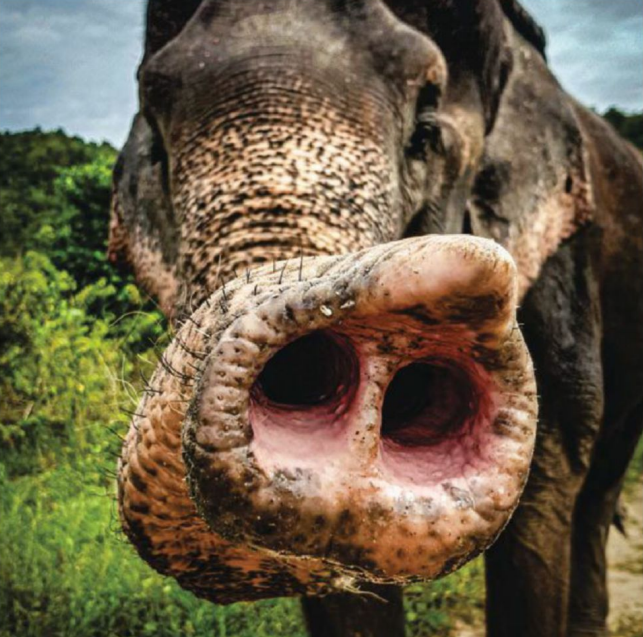

BIOMECHANICS

<strong>WATCHING AN ELEPHANT <mark style="background:#fdbfff">FORAGE</mark></strong>[^1] for roots reveals both the strength and the sensitivity of its trunk. With more than 40,000 muscles, an elephant’s trunk can upend a tree and then gently collect the fragments that fell. It takes baby elephants nearly a year to master using their trunk in this way, and it’s taken humans even longer to understand how they’re able to do it. The secret may come down to elephants’ <mark style="background:#fdbfff">whiskers</mark>[^2].

观察大象觅食寻找植物块茎，便能看出象鼻兼具力量与灵敏。大象的象鼻拥有四万多块肌肉，既能连根拔起整棵大树，又能轻柔收拢掉落的枝叶碎块。幼象要花将近一年时间，才能熟练掌握这样使用象鼻；而人类花了更久，才弄明白它们是如何做到的。其中的奥秘，或许就藏在大象的触须之中。

Researchers who analyzed the whiskers lining these animals’ trunks have discovered a unique structural property that helps elephants sense the world around them and determine whether a task calls for strength or sensitivity. In a study published in *Science*, the authors show that elephants’ whiskers—unlike the whiskers of other mammals—are more flexible at the tip and stiffer closer to the skin.

研究人员分析了大象象鼻表层排布的触须后，发现了一种独特的结构特性：这种特性能帮助大象感知周遭环境，并判断当下行为需要动用力量，还是依靠灵敏触感。这项发表在《科学》期刊上的研究指出，大象的触须与其他哺乳动物不同 ——尖端更柔韧，靠近皮肤的根部则更坚硬。

This observation helps scientists better understand elephants’ “<mark style="background:rgba(136, 49, 204, 0.2)">umwelt</mark>[^3],” or their individual sensory and perceptual experience of the world. “We found elephants are like aliens,” says Andrew K. Schulz, lead study author and a mechanical engineer at the Max Planck Institute for Intelligent Systems in Germany. “They have these hornlike whiskers with a [puzzling] stiffness gradient.”

这一发现有助于科学家更好地理解大象的周遭感知世界，也就是它们独有的感官与知觉体验。本研究第一作者、德国马克斯・普朗克智能系统研究所的机械工程师安德鲁・K・舒尔茨表示：“我们发现大象就像外星生物一般，它们长着角状的触须，且有着令人费解的硬度梯度变化。”

Because elephants have such rough, armorlike skin, investigators knew the whiskers on their trunks were probably doing a lot of sensory work to allow the animals to interact delicately with the world around them. But to truly understand these tiny filaments, they needed a much closer look. Alongside imaging and mechanical tests, Schulz and his colleagues used a CT scanner specially built for small objects to create a digital rendering of the elephant whiskers; this let the team analyze whisker structure from the inside out.

由于大象皮肤粗糙、如铠甲般坚硬，研究人员早就推测，它们象鼻上的触须大概率承担着大量感知功能，让这些动物能与周遭世界进行精细互动。但要真正理解这些微小的丝状物，他们还需要更深入的观察。除了成像与力学测试外，舒尔茨及其同事还使用一台专为小型物体打造的 CT 扫描仪，生成了大象触须的三维数字模型，这让团队得以从内到外分析触须的结构。

The part of the whisker closer to an elephant’s skin is very strong and porous, they found, whereas the tip’s material is denser and much more flexible. Wanting to understand the mechanics of this unique form, the team members 3D-printed a supersize version of a whisker with an accurate stiffness gradient to feel for themselves.

研究团队发现，大象触须靠近皮肤的部分质地坚硬且呈多孔结构，而尖端部分的材质则更致密，也柔韧得多。为了理解这种独特结构的力学特性，团队成员按真实的硬度梯度，3D 打印了一个超大尺寸的触须模型，亲自测试它的受力表现。

“I was walking down the hallway and hitting things [with the whisker], and I had this true eureka moment,” says Katherine  J. Kuchenbecker, senior author of the study and director of the <mark style="background:#fdbfff">haptic</mark>[^4] intelligence department at the Max Planck Institute for Intelligent Systems. She noticed that hitting something hard with the stiff base of the whisker felt much more solid and crisp than hitting something with the softer tip, giving her a sense of the object without her skin even touching it.

“我在走廊里走，用（触须模型）去碰各种东西，那一刻我突然茅塞顿开。” 这项研究的通讯作者、德国马克斯・普朗克智能系统研究所触觉智能部门主任凯瑟琳・J・库钦贝克说道。她发现，用触须坚硬的根部触碰硬物时，触感比用柔软的尖端要扎实、清晰得多，即便皮肤没有直接接触物体，也能感知到物体的存在。

Elephants use their trunks to breathe, smell, grab things, communicate and even perceive objects outside their line of sight. And their whiskers help to shape these experiences. “Nearly every mammal—not just elephants—has whiskers whose size, shape and material properties are almost certainly adapted to the way that species uses touch in its environment,” explains Mitra Hartmann, a biomedical and mechanical engineer at Northwestern University, who was not involved in the study.

大象依靠象鼻呼吸、嗅闻、抓取物品、进行交流，甚至能感知视线范围之外的物体。而它们的触须，也在这些感知活动中起到关键作用。美国西北大学生物医学与机械工程师米特拉・哈特曼（并未参与此项研究）解释道：“几乎所有哺乳动物 —— 不只是大象 —— 都长有触须，且其尺寸、形态与材质特性，几乎都是为适配该物种在生存环境中的触觉使用方式，经过演化适应而来。”

Schulz and his team incorporated their data into a tool kit for researchers in other fields to explore. They are particularly interested in seeing how materials with a similar stiffness gradient could be applied to robotics. Maintaining machines’ strength while making them soft enough to avoid damaging the materials they interact with is a major robotics challenge.

舒尔茨及其团队将研究数据整合为一套工具包，供其他领域的科研人员探索使用。他们尤其想知道，具备类似硬度梯度的材料该如何应用到机器人技术中。在保证机械结构强度的同时，又要使其足够柔软、避免损伤所接触的物体材料，这是机器人领域面临的一大难题。

“This study is a fabulous example of interdisciplinary science,” says John Hutchinson, a biologist at the University of London’s Royal Veterinary College. “It is elegant neuroscience, anatomy and mechanics.”

伦敦大学皇家兽医学院的生物学家约翰・哈钦森表示：“这项研究是跨学科科研的绝佳范例，融合了精妙的神经科学、解剖学与力学研究。”

—<i>K. R. Callaway</i>

[^1]: **forage** /ˈfɔːrɪdʒ/: v. to look around for something you need

[^2]: **whisker** /ˈwɪskər/: n. any of the long stiff hairs growing on the face of an animal

[^3]: **umwelt**: 来自德语，意为‌环境‌或‌周围世界‌，在生物学和哲学领域特指生物体主观感知的‌主体环境

[^4]: **haptic** /ˈhæptɪk/: adj. relating to the sense of touch, especially in technology and robotics
