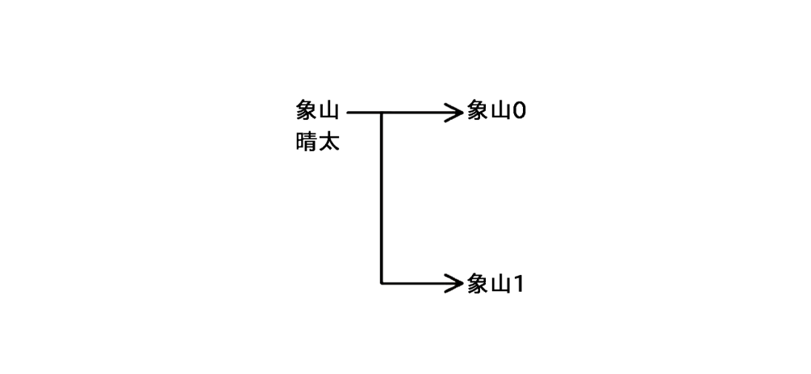
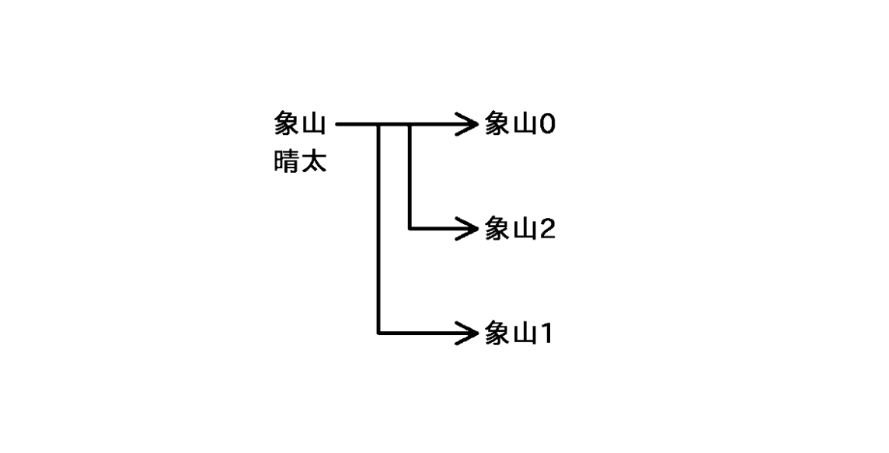

:::note[META]
`desc`: 精神科医生象山深爱着自己的家人。但他心知肚明：再幸福美满的家庭，也会因一道微小的裂痕，彻底分崩离析 ——。不久后，他偶然得到神秘药物，就此被卷入一连串超乎常理的杀人案件之中
:::

#### 1
ドン──ズズッ。

咚——滋滋。

そんな音で目が覚めた。

象山被这样的声音吵醒了。

全身が汗で湿っている。つい数秒前までひどい悪夢を見ていたのに、それがどんなものだったか思い出せない。不快な感覚だけが胸にわだかまっていた。

全身皆被汗水浸透，就在数秒之前，还做着一个可怕的噩梦，但梦中的情形已然记不清了，唯有不快的感觉盘踞于胸。

瞼を開く。目に映るものが変わらない。そこは完全な暗闇だった。尻の下に床があること以外、何も分からない。

睁开双眼，所见之物一成不变，此处唯有漆黑一片，除去屁股底下是地板之外，什么都感知不到。

ドン──ズズッ。

咚——滋滋。

音は頭上から響いていた。さっきよりも少し大きくなっている。

声音自头顶传来，比先前略大一些。

この音には聞き覚えがあった。まず左足を前に踏み出して、右足を引き寄せる。父さんの足音だ。気球から落下して小脳に傷を負った父さんは、退院後、真っすぐ歩くこともできなくなっていた。

这个声音十分耳熟，左脚先踏前一步，右脚拖拽着跟进，是父亲的脚步声。父亲自气球上跌落，小脑受到重创，出院后甚至连直立行走都做不到了。

ドン──ズズッ。

咚——滋滋。

ここは不死館の地下室だろう。父さんは家の中でも車椅子を使っている。自分の足で歩くのは、地下室のある別館へ来るときだけ。廊下の入り口と出口に段差があるため、車椅子が使えないのだ。

此处理应是不死馆的地下室。父亲在家里多用轮椅，唯有前往地下室所在的别屋时，才会用自己的双脚走路。那是因为走廊的出口和出口都设有台阶，无法通过轮椅。

ドン──ズズッ。

咚——滋滋。

父さんは機嫌が悪くなると、たびたび息子を地下室に閉じ込めた。一階の発電機を切ってしまえば、地下室からはエレベーターを動かせない。さらに床のタイルを塞いでしまえば、地下室は完全な暗闇になる。三日三晩、飲まず食わずのまま、暗闇の底で膝を抱えていたこともあった。

每当父亲情绪不佳时，总会把儿子关进地下室，只要关掉一楼的发动机，就没法从地下室开动电梯。只要把地砖堵上，地下室就会变成漆黑一片，他曾三天三夜没吃没喝，只能在黑暗的地底抱膝而坐。

ドン──ズズッ。

咚——滋滋。

さらに大きくなったところで、ふいに音がやんだ。別館に着いたのだろう。

声音越来越大，然后戛然而止。父亲大抵已经走到别屋了吧。

ようやく解放してもらえるのだろうか。暗闇の中で立ち上がり、ふと息を止める。

终于可以被放出来了吗？象山自黑暗中起身，却骤然屏住了呼吸。

そんなはずはない。父さんは犬死崖から落ちて死んだのだ。

不可能，父亲已经从犬死崖上跌死了。

では誰がやってきたのか。

那么，这又是谁？

エレベーターの下りてくる音。扉が開き、橙色の光が網膜を貫く。象山は両手を突き出した。

传来了电梯下来的声音，门开了，橙色的光穿透了视网膜，象山朝那道光伸出了双手。

「どういうことか説明してよ」

“把话说清楚。”

指の間から、彩夏が冷たく吐き捨てるのが見えた。

透过指缝，可以窥见彩夏冷淡的蔑视。
 
目を覚ますと、家はもぬけの殻だった。

悠悠醒转之际，象山发觉自家已成了空壳。

掃き出し窓から差した日が埃一つない床を照らしている。テーブルには硬くなったステーキが五つ。テレビも炭酸水メーカーもアロエの鉢植えもそのままなのに、家族だけがいなくなっていた。

从落地窗射进来的阳光照亮了一尘不染的地板。餐桌上摆着五块变硬的牛排，电视机、汽水机、芦荟盆栽一样不少，唯独不见家人的踪影。

父親と恋人の会話から、二人の間で起きたことを察したのだろう。舞冬は恋人を家から追い出し「死んでほしい」「きもすぎ」「ありえない」「本当に死んでほしい」とまくしたてた後、ふいに玄関に座り込み、喉が<ruby>嗄<rt>か</ruby>れるのも<ruby>厭<rt>いよ</ruby>わず嗚咽し続けた。

从父亲和恋人的对话中，舞冬似乎觉察到了两人的苟且之事。她将恋人赶出了家门，嘴里一停不停地说着 “去死吧” “真恶心” “不可能” “给我死远点”，然后突然坐倒在门口，不顾沙哑的嗓子没完没了地呜咽着。

「お父さんに出てってもらうか、わたしたちが出てくか。どっちかしかないよ」

“要么爸爸走，要么我们走，只能选一个了。”

母親に代わって<ruby>敢然<rt>かんぜん</ruby>と言い放ったのは彩夏だった。<ruby>醬窯<rt>ひしおがま</ruby>市の母親の実家に連絡し、身を寄せさせてほしいと掛け合ったのも彼女だった。

彩夏代替母亲毅然决然地说出了这番话，也是她联系了母亲位于酱窑市的本家，提出了寄宿的请求。

「ずっと分かってたような気がする」

“我好像一直都明白。”

家を出る間際、頰へ流れたアイシャドウを拭いながら、季々が言った。

出门前，季季一边摸着冲到脸颊的眼影，一边说道。

「こんな幸せな暮らし、夢なんじゃないかって何度も思った。やっぱり本物じゃなかったんだね」

“不知想过多少次了，如此幸福的生活，会不会只是一场梦呢？果然不是真的啊。”

別れの挨拶もないまま、季々は娘を連れて家を出て行った。

连道别的言语都没留下，季季就带着女儿离开了家。

象山は一人になった。

象山变成了孤身一人。

たった一つの過ち──よりによってあのすきっ歯の男の言葉を<ruby>鵜吞<rt>うの</ruby>みにしたことで、自分はすべてを失ったのだ。

他只犯了一个错误——偏偏一股脑地接受了那个歪牙男的话，害自己失去了一切。

憂さ晴らしにあの男を殺してやろうか。舌を抜き、眼球を抉って、迂闊な物言いを後悔させてやるか。

要不要杀了这个男人聊以解忧呢？必须拔其舌，抉其目，让其对自己的饶舌悔不当初。

くだらない。

没用的。

何をしても家族は戻ってこない。両親のように自分も崖から身を投げるか。潔く首を<ruby>縊<rt>くく</ruby>るか。それとも覚醒剤でも買ってオーバードーズを決めようか──。

无论做什么，家人都不会回来了。自己也要学父母的样，从悬崖上纵身一跃吗？还是痛快地上吊，又或者买来兴奋剂把自己毒死呢——

ふとポケットに入れたままのアンプルに気づいた。シスマだ。

象山骤然意识到自己口袋里还揣着安瓿瓶，是西斯玛。

ドラッグディーラーのエデンによれば、その薬は半分の確率で使用者に絶大な快楽をもたらすという。過去にその薬液を打った男は、あまりの快楽に生きる意味を見失い、自ら頭を割り脳を搔き出して命を絶ったという。

根据卖药人伊甸的说法，此药有一半的概率会给使用者带来绝顶的快感。据说之前某个注射过药液的男人，由于快乐过度而丧失了活下去的意义，最后劈开头颅抠出大脑了断了自己的性命。

ビニールケースからアンプルを出し、透明な液体を眺める。もしエデンの言ったことが本当だったとしたら。至上の快楽を味わえる上に命の始末まで付けてくれるとは、今の自分に打ってつけではないか。

象山从塑料盒里拿出安瓿瓶，凝视着透明的液体。倘若伊甸所言非虚，那么在享受无上快乐的同时交出自己的性命，岂不是恰好适合现在自己吗？

ペペ子を監禁している不死館の地下室に、催眠鎮静剤を打つための注射器がある。象山はジャガーを走らせ、妄鳴山へ向かった。

在囚禁佩佩子的不死馆地下室里，存放着注射催眠镇静剂的注射器。于是象山开着捷豹，朝妄鸣山飞驰而去。

不死館に到着したときには、空が朱に染まり、影になった<ruby>稜線<rt>りょうせん</ruby>が<ruby>瓦<rt>かわら</ruby><ruby>葺<rt>ぶ</ruby>きの屋根を見下ろしていた。時刻は午後五時四十分。指紋認証のロックを解除し、玄関ホールに入る。 床のシュラフから和泉の上半身が出ていた。数匹の<ruby>蛆<rt>うじ</ruby>虫が右目の刺し傷を出たり入ったりしている。産科の生田に処理を頼んだはずだが、まだ廣崎から戻っていないらしい。頭頂部を蹴ってシュラフに身体を押し込んだ。

抵达不死馆时，天空已绯色尽染。化为阴影的山脊棱线俯视着瓦片屋顶。时间是下午五点四十分，解除指纹锁踏进门厅，自地板上的睡袋里探出上半身的和泉映入眼帘，数只蛆虫在她右眼的伤口里进进出出。本已拜托妇产科的生田处理了，但他似乎尚未从广崎赶回。于是象山揣着尸体的脑门，将躯干塞回了睡袋深处。

廊下から別館へ向かい、床のタイルをずらす。エレベーターで地下室へ下りると、天窓から差した明かりがペペ子を照らしていた。昨日と変わらず、血まみれの枕カバーを被ったまま床に伸びている。死んだのかと思ったところで、ばふっ、とカバーが膨れた。

象山从走廊前往别屋，挪开地砖，乘坐电梯下到地下室。自天窗射入的灯光照在佩佩子身上，他和昨天一样，蒙着鲜血淋漓的枕套躺在地板上，就在象山以为他死了的时候，随着 “噗” 的一声，枕套鼓了起来。

草バットを咥え、ジッポーで火を点ける。これが人生最後の一服になるかもしれない。そう思うと、煙が胸に<ruby>沁<rt>し</ruby>みた。フィルター近くまで葉を燃やし、たっぷり肺を<ruby>燻<rt>いぶ</ruby>してから、吸い殻をバケツに放り込む。ロッカーの錠を外し、注射器を取り出した。アンプルの蓋を折り、針を中に入れる。押子を引き、液体を吸い上げる。

象山叼起 King Hitter，用 Zippo 点着了火，这或许是此生最后一根了吧。想到此处，烟气沁入胸中。待烟叶烧到滤嘴附近，肺部充分熏透后，他将烟头甩进了水桶。然后打开储物柜的锁，取出注射器，折断安瓿瓶的头，将针插了进去，拉起活塞，吸出液体。

ふと我に返ったような気分になった。

就在这时，象山骤然回过神来。

自分はエデンの言葉を信じているのか？もちろん違う。万に一つほど、自分の頭をかち割る幻覚を見る可能性はあるとしても、本当に脳を搔き出すことはない。自分は死を先延ばしにしているだけだ。それなのに何を感傷的になっているのか。

自己真的相信伊甸的话吗？当然不是，哪怕有万分之一的概率出现劈开自己脑袋的幻觉，也绝不可能把脑子抠出来。自己只是在拖延死期而已，那又有什么可感伤的呢？

自分の往生際の悪さに呆れながら、左上腕に針を刺した。親指で押子を押す。鈍い痛みに肩が強張る。シリンジ[^30]が空になったのを確かめ、針を抜く。

象山一边对自己不肯轻易赴死感到惊诧，一边把针扎进左臂，用拇指按下活塞。钝痛令肩膀变得僵硬。待确认筒身空了之后，把针头拔了出来。

腕時計は五時五十分を指していた。十秒、二十秒、三十秒──一分が過ぎても、案の定、何も起こらない。

手表的指针指向五点五十，十秒，二十秒，三十秒——一分钟过去了，什么没发生。

効き目のない五十パーセントを引いたのか、そもそも効き目など存在しなかったのか。もちろん後者だろうが、ひょっとすると前者だったのかも、と思ってしまうところがよくできている。 

是抽中了无效的百分之五十，还是根本不存在所谓有效呢？当然是后者，不过也有可能是前者吧——内心情不自禁这样想着。

空になった注射器とアンプルをバケツに放り込んだところで、ふと違和感を覚えた。

当象山把空了的注射器和安瓿瓶抛进水桶时，突然感觉有些不对劲。

何かがおかしい。

有种奇怪的感觉。

ロッカー。ベッド。枕。ペペ子。バケツ。床板。ゴキブリ。壁の煉瓦。天窓。あらゆるものの解像度がぐんと上がったような気がした。液晶テレビが有機ＥＬディスプレイに変わったように、世界が鮮やかさを増していく。

储物柜，枕头，佩佩子，水桶，地板，蟑螂，墙砖，天窗，感觉一切事物的分辨率都提高了，就似液晶电视变成有机 EL 显示器一样，世界变得越来越鲜艳。

気づけば猛烈に胸が高鳴っていた。母さんを犬死崖に落としたとき、解剖実習で死体の胸にメスを刺したとき、あるいは季々につきまとっていた男を初めて絞め殺したときの感覚にも似ている。

回过神来的时候，胸腔猛烈悸动起来，就似令母亲跌落犬死崖的时候，就像实习时用手术刀刺入尸体胸口的时候。

ふいに目眩を覚えた。脳が痒い。床に手を突き、胃液を吐く。<ruby>腸管<rt>ちょうかん</ruby>がのたうつ[^31]。

象山突感一阵眩晕，脑内瘙痒，手撑地面，胃液剧吐，肠管翻腾。

深呼吸しながら頭を上げると、床のペペ子が二つになっていた。

一面深呼吸一面抬起头，象山惊觉地板上的佩佩子化为了两个。

ねばついた手で瞼を<ruby>擦<rt>こす</ruby>る。目の焦点がぼけているのか。だが何度瞬きしてもペペ子が減らない。ばふっ、ばふっ、という鼻息も二つ重なって聞こえる。

用黏糊糊的手擦了擦眼睑。是眼睛失焦了吗？可无聊眨多少次眼睛，佩佩子都不曾减少，就连 “呼，呼” 的喘息声也重叠在了一起。

「さっきの話なんだけど」

“关于刚才的事——”

舞冬が言った。自宅のリビングだった。

是舞冬在说话，地点在自家客厅。

「会ってほしい人がいるの」

“我想让你见个人。”

そりゃ構わないけど。

我是无所谓。

お前、まさか。

莫非你——

「できてないよないよ」

“我没怀孕哦。”

舞冬が苦笑する。

舞冬苦笑道。

「ただ、ツアーが始まったら忙しくなるしなるし、それまでにそれまでにちゃんとちゃんと紹介して紹介しておきたいとおきたいとおきたいとおきたいと」

“我只是觉得，巡演开始后可能会忙不过来，想在那之前好好介绍一下。”

ムイさんには言ってあるのか。

穆伊那边也知道了吗？

「もちろん。アイドルじゃないし、真剣に考えてるなら構わないって」

“当然了，我们又不是偶像，只要认真考虑就无所谓。”

「もちろん。アイドルじゃないし、真剣に考えてるなら構わないって」

“当然了，我们又不是偶像，只要认真考虑就无所谓。”

舞冬が増えた。

舞冬增多了。

「あんまり怖い怖い怖い怖い顔しないでね」

“别摆出一张吓人吓人吓人吓人的脸啦。”

「あんまり怖い怖い怖い怖い顔しないでね」

“别摆出一张吓人吓人吓人吓人的脸啦。”

「春春春春春、緊緊張張張張しいいいいいだかかかかかかか」

“阿阿阿阿春春春春会会很很紧紧张张张张张的的的的的的。”

「春春春春春、緊緊張張張張しいいいいいだかかかかかかか」

“阿阿阿阿春春春春会会很很紧紧张张张张张的的的的的的。”

幻覚？　違う。

幻觉吗？不对。

「それらはほんの氷山の一角に過ぎないのではないかと考えています」

“但我怀疑这只是冰山一角。”

「それらはほんの氷山の一角に過ぎないのではないかと考えています」

“但我怀疑这只是冰山一角。”

「週末、恋人と海に行きまして」

“周末我和恋人一起去了海边。”

「週末、恋人と海に行きまして」

“周末我和恋人一起去了海边。”

「お巡りさんじゃ悪魔には敵いません」

”警察是敌不过恶魔的。“

「お巡りさんじゃ悪魔には敵いません」

”警察是敌不过恶魔的。“

「今は昭和じゃねえんだ」

“现在可不是昭和时代了。”

「今は昭和じゃねえんだ」

“现在可不是昭和时代了。”

「ぱんつくったことある？」

“你做过面包吗？”

「ぱんつくったことある？」

“你做过面包吗？”

「わたし、あんたの道具じゃないから」

“我又不是你的工具。”

「わたし、あんたの道具じゃないから」

“我又不是你的工具。”

「わたし、あんたの道具じゃないから」

“我又不是你的工具。”

「わたし、あんたの道具じゃないから」

“我又不是你的工具。”

「こんな幸せな暮らし、夢なんじゃないかって何度も思った」

“不知想过多少次了，如此幸福的生活，会不会只是一场梦呢？”

「こんな幸せな暮らし、夢なんじゃないかって何度も思った」

“不知想过多少次了，如此幸福的生活，会不会只是一场梦呢？”

「こんな幸せな暮らし、夢なんじゃないかって何度も思った」

“不知想过多少次了，如此幸福的生活，会不会只是一场梦呢？”

「こんな幸せな暮らし、夢なんじゃないかって何度も思った」

“不知想过多少次了，如此幸福的生活，会不会只是一场梦呢？”

これこそが現実。

这即是现实。

世界の本当の姿だ。

这即是世界的本来面目。

「やっぱり本物じゃなかったんだね」

“果然不是真的啊。”

現実が爆発する。

现实爆炸了。
#### 2
象山家の朝は忙しい。

象山家的早晨总是很忙。

だがこの日、八月三十日の<ruby>忙<rt>せわ</ruby>しなさは、普段のそれを遥かに上回っていた。

可是这天——八月三十日，忙碌程度远超平常。

午後零時五十分。普段より念入りに髭を剃り、オックスフォードシャツの襟を整えてリビングへ行くと、白ワインで蒸した黒毛和牛ヒレステーキの芳醇な香りが部屋を満たしていた。

下午十二点五十分，象山比平时更小心地剃掉了胡须，整理完牛津衬衫的衣领，然后走进客厅，白葡萄酒蒸过的牛里脊的醇香填满了整个房间。

「彩夏、テレビ消して。お父さん、玄関の家族写真、恥ずかしいから隠して。お母さん、芸能界の苦労話みたいなの要らないからね」

“彩夏，把电视关掉。爸爸，门口的全家福麻烦你藏起来，妈妈，就别说你那娱乐圈的艰辛往事了。”

いつになく大人っぽいボールチェーンのネックレスを下げた舞冬が、マウスウォッシュをぶくぶくしながらスーパーヒョロリンとスズナールの容器を食器棚の奥へ押し込む。

舞冬一反常态，脖子上戴着一串非常惹眼的珠子项链，一边咕嘟咕嘟地含着漱口水，一边将超级瘦身灵和芜菁素的瓶瓶罐罐推进了橱柜深处。

「自分だって人のこと道具扱いしてんじゃんね」文句を言いながらテレビを消そうとした彩夏が、「あ、お姉ちゃん。今日の乙女座は無理やり前に進もうとすると後悔するかも、だって」意趣返しとばかりに姉をからかう。つられてテレビを見ると、山羊座は八位。ラッキーアイテムは「新しい靴」だった。

“你也别把别人当工具啊。” 彩夏一边口吐怨言，一边准备关掉电视，“哦，姐姐，听说今天处女座的人太过硬来的话，可能会追悔莫及的哦。” 彩夏故意作弄姐姐。象山循着她的话看向电视，发现摩羯座排在第八，幸运物是 “新鞋”。

「あんたは死ぬまで占い師の言うことだけ聞いてれば」

“你就到死都听占卜师的话好了。”

舞冬が妹からリモコンを引ったくり、テレビを消して抽斗に放り込む。季々がテーブルのステーキにニンジンのグラッセを添えたところで、ブブッ、と舞冬のスマホが震えた。

舞冬从妹妹手里夺过遥控器，关掉电视并随手扔进了抽屉，正当季季为餐桌上的牛排添加法式胡萝卜时，舞冬的手机传来了 “噗噗” 的抖动。

「春、駅着いたって。迎えに行ってくる」

“阿春说他到车站了，我去接他。”

舞冬が、ごぐっ、と喉を鳴らして、慌ただしく玄関へ向かう。

舞冬 “咕” 了一声，急匆匆地向门口跑去。

「着いたらピンポンしてね」

“到家记得按门铃哦。”

シャツの下から手を突っ込んでコルセットのホックを留めながら、季々が声を飛ばす。ガチャ、バタン。象山は冷やしておいた台湾ビールをテーブルに並べる。彩夏は鏡の前で日焼けした肌の皮を剝がしている。

季季一边调整着衬衫下的紧身胸衣的挂扣，一边冲门口大喊大叫。喀嗒一声，象山把冰镇的台湾啤酒放在桌子上，彩夏则在镜子前抠着被太阳晒黑的皮。

「今日、バイトは？」

“今天去打工吗？”

そう尋ねて、妙な違和感を覚えた。

问过之后，心中萌生了古怪的违和感。

<ruby>自分は娘が次に口にする言葉を知っている<rt>、、、、、、、、、、、、、、、、、、、</ruby>。

自己知道女儿接下来会说的话。

休む…………………………酔っ払いの……………場合じゃない…

当然放假了…………………………现在可不是……………陪酒鬼的时候…

「休むに決まってるでしょ。酔っ払いの相手してる場合じゃないよ」

“当然放假了，现在可不是陪酒鬼的时候。”

彩夏から目を逸らし、「ああ」と生返事をする。逃げるように玄関へ向かい、飾り棚に手を置いて深呼吸する。

象山含糊地 “嗯” 了一声，把视线从彩夏身上移开，逃也似地冲向玄关，把手按在装饰柜上大口喘气。

何だこれは。デジャヴにしては具体的すぎる。

这算什么？作为既视感未免太具体了。

見慣れた玄関の扉が目に入ったところで、ふいに息ができなくなった。

刚看到熟悉的家门，突然变得喘不上气。

<ruby>自分はこれから起きることを知っている<rt>、、、、、、、、、、、、、、、、、、</ruby>。

自己知道接下来即将发生的事情。

インターホンが鳴る。扉を開ける。舞冬の恋人が頭を下げている。

对讲机响起，门打了开来，舞冬的恋人鞠躬行礼。

「か、加賀美と言います。初めまして」男は象山を見てあんぐりと口を開ける。「昨日、一万円くれたおじさんじゃないすか」

“我，我叫加贺美，初次见面。” 男人盯着象山，把嘴张得老大。“你不就是昨晚多给我一万円的叔叔吗？”

ありえない。自分は妄想に取り憑かれているのか。ミイラ取りがミイラになるように、精神科医が精神を病んでしまったのか。

不可能，自己是被妄想凭附了吗？就像去找木乃伊的人自己也变成木乃伊，精神科医生自己也变成精神病了吗？

ハンカチで手汗を拭き、ゆっくり息を吐く。舞冬に家族写真を隠すよう言われたのを思い出した。額縁を取り、頭上の収納に手を伸ばす──。

象山用手帕擦了擦汗，缓缓地吐了口气，他想起了舞冬嘱咐自己把全家福藏起来的事，于是拿起相框，把手伸向装饰柜的收纳格——

数秒後に起きることがはっきりと浮かんだ。

数秒之后所发生的事清晰地浮现在脑海中。

収納の扉を開けると靴が落ちてくる。額縁が床に落ちる。芳香瓶が倒れ、アロエの鉢から腐葉土がこぼれる。象山はテレビのでたらめな占いに悪態をつく。

打开收纳格的门，鞋子就会落下，相框也会掉到地上，香薰瓶倒下，芦荟盆栽里的腐叶土撒了出来，象山对电视上荒唐的占卜口吐恶言。

間違いない。自分には未来の記憶がある。

毫无疑问，自己拥有未来的记忆。

汗が止まらなくなり、縋るように草バットを咥えた。ジッポーで火を点ける。肺へ煙を送り込み、必死に動悸を鎮める。

象山一时间大汗淋漓，嘴里紧紧衔着草 Hitter，用 Zippo 点火，将烟气输入肺部，拼命镇住心中的悸动。

咥え煙草のまま両手を上げ、慎重に収納の扉を開けた。落ちそうになった靴を支え、そのまま奥へ戻す。五秒、十秒待っても靴は落ちてこない。芳香瓶も鉢植えもぴくりともしない。

他嘴里衔烟，双手举起，小心翼翼地打开了柜门。撑住快要落下的鞋子，顺势塞进了柜子深处。等了五秒，十秒，鞋子依旧没有落下，香薰瓶和盆栽纹丝不动。

未来の記憶は間違っていたのか？

难不成未来的记忆有误？

そうではない。象山が記憶と異なる行動を取ったことで、世界が変わったのだ。

并非如此，由于象山采取了与记忆不同的行动，因此世界发生了改变。

<ruby>未来は変えられる<rt>、、、、、、、、</ruby>。

未来是可变的。

ならば自分のすべきことは一つだ。あのすきっ歯のろくでなし──加賀美春がここへやってくるのを防ぐ。そして未来の家族に生じる亀裂を事前に取り除くのだ。

既然如此，自己该做的事只有一件，那就是阻止那个歪牙混蛋——加贺美春来到自家，提前抹消未来的家所产生的裂隙。

舞冬と春は今もこの家へ向かっている。腕時計を見ると、時刻は午後零時五十五分。インターホンが鳴ったのが午後一時ちょうどだから、あと五分で何か手を打たなければならない。

舞冬和春现在仍在朝这个家走来。看了眼手表，时间是下午十二点五十五分。门铃在下午一点整响起，所以必须在剩下的五分钟内采取一些措施。

二本目の草バットに火を点ける。フィルターを嚙み、眉間を強く押さえる。

象山点燃了第二支草 Hitter，紧咬滤嘴，使劲拧着眉头。

インターホン越しに難癖を付けて春を追い返すか。だが歓迎すると宣言していた自分が顔も合わせず掌を返すのはおかしい。

隔着对讲机百般刁难，把春赶回去如何？可原本宣称欢迎的自己突然翻脸避而不见，这也太奇怪了。

具合が悪いと言って寝室に籠もるか。あいにく象山は文句の付けどころのない健康体だ。家族もそれを知っている。それでもなんとか家族を騙せたとして、救急車でも呼ばれて騒ぎになったら本末転倒だ。

或者宣称身体不适，把自己关在卧室呢？不幸的是，偏偏象山健康得无可挑剔，家人也深知这点。何况就算骗过了家人，万一叫来救护车引发骚动，那就本末倒置了。

両目を閉じ、ゆっくりと煙を吐き出す。

象山阖上双眼，缓缓吐出一口气。

象山は季々のストーカーを始め、家族に危害を加えようとした者を何度も始末してきた。今、やるべきことも変わらない。

从季季的跟踪狂开始，自己一次又一次地除掉企图伤害家人的人物，如今要做的事也不会有半分改变。

「病院から電話がきた。すまないが先に挨拶していてくれ」

“医院来电话了，不好意思，你们先替我打招呼吧。”

リビングに顔を出して手刀を切り、すぐに廊下へ引き返した。「えー」とぼやく彩夏を無視して階段を上る。書斎の金庫を開け、ジャガーの電子キーを取り出す。窓からガレージの屋根に飛び移り、裏庭へ下りる。

他把头探进客厅，挥了挥手刀，随即返回走廊，无视彩夏充满怨气的 “诶——”，径直走上了楼梯，打开书房的保险柜，取出捷豹的电子钥匙，然后从窗户跃至车库的屋顶，从那里下到后院。

ガレージに入り、ジャガーのロックを外した。厚手のブルゾンに腕を通す。ジャーナリストの和泉早希を殺して以来、二日ぶりだ。ブルゾンは人を殺す際、背格好を隠すために用意したものだった。

象山进了车库，打开捷豹的锁，将胳膊套进了厚夹克的袖管里。两天前，他杀害了记者和泉早希，夹克是为了在杀人之时隐藏身形而准备的。

問題は、何で顔を覆うかだ。赤の他人ならさておき、娘から顔を隠すのにキャップやサングラスでは足りない。ダッシュボードやグローブボックスを漁り、覆面代わりになりそうなものを探す。祈るような気分でトランクを開けると、濡れたゾウのような色のストールが落ちていた。和泉が肩に巻いていた、あれだ。

问题是该用什么遮脸。陌生人姑且不论，单用帽子和墨镜遮脸对自家女儿而言远远不够。他翻着仪表盘和手套箱，寻找可以代替面罩的东西。当他怀着祈祷的心情打开行李箱时，蓦然发现里边掉着一条湿大象颜色的披肩，正是和泉围在肩膀上的那个。

布を広げ、包帯の要領で顔に巻いていく。目が見えるように布をずらし、余ったところをブルゾンの襟に押し込む。ドアミラーを見ると、頭が膨れてゾウのようになった男が立っていた。

象山把布摊开，用裹绷带的手法将其缠在脸上，稍微拽了拽布令眼睛能够看到外边，随即将多余的部分塞入夹克的领口。他看了眼后视镜，镜子里站着一个头胀得像大象一样的男人。

ガレージを飛び出し、十字路のカーブミラーに目をやる。自然公園の小道を歩く舞冬と春が見えた。いつものメスは使えない。隣家の前庭に敷かれた砂利から、大きいのを取る。素振りを一つしたところで自然公園の出口に二人が現れた。

象山冲出车库，看向十字路口的凸面镜，自然公园的小路上可以望见舞冬和春走过来的身影。没法用平常的手术刀，遂从邻居家庭院里铺着的碎石里挑了块大的，刚空挥了一下，两人的身影就出现在了自然公园的入口。

「え」

“诶？”

舞冬が足を止める。春は象山に目を留めるなり含み笑いを浮かべ、「何あれ」と舞冬の肩を突いた。

舞冬停下脚步，春的目光刚落到象山身上，边含着笑戳了戳舞冬的肩膀。“那是啥？”

象山はもう一発素振りをして、二人に駆け寄った。ストールが膨らむ。

象山又空挥了一把，随即朝两人冲去。披肩膨胀起来。

「何、何、何？」

“啥，啥，啥？”

死ね。

去死吧。

口の中で叫んで、象山は石を振り下ろした。

嘴里大叫一声，象山挥下了石头。
#### 3
蛍光灯の下を小蠅が飛び交っている。

荧光灯下，小苍蝇四处飞舞。

一時間近く硬い椅子に座っていたせいで、腰が痛くなっていた。一服しようと立ち上がったところで、

在硬邦邦的椅子上坐了将近一个小时，象山只觉得腰酸背痛。刚想站起来抽根烟时——

「お出迎えか。先生も忙しいな」

“来接人了吗？医生也很忙啊。”

神々精警察署のロビーに芋窪の<ruby>胴間<rt>どうま</ruby><ruby>声<rt>ごえ</ruby>[^32]が響く。奥の通路から舞冬を連れてきたところだった。

神神精警署的大厅里回荡着芋窪的破锣嗓子。他刚从里边的过道把舞冬带了出来。

襲撃事件から一夜明けた八月三十一日、午後四時過ぎ。舞冬は昨日に続き、今日も午後から事情聴取を受けていた。

现在是袭击事件发生的翌日，八月三十一日下午四点多。继昨天之后，舞冬今天下午也在警署接受询问。

「犯人の目星は付きましたか」

“袭击犯有眉目了吗？”

「ああ。テレビの見過ぎで自分を特撮ヒーローと思い込んだ童貞の引き籠もりだ」

“嗯，应该是特摄片看得太多，自以为是特摄英雄的处男阿宅。”

芋窪がいつの時代かと思うような暴言を口にする。象山は特撮ヒーロー番組を見たことがないし、童貞の引き籠もりでもなかった。

芋窪口吐着像是来自另一个时代的恶言。而象山既未看过什么英雄特摄片，也不是处男阿宅。

舞冬とともに警察署を出る。ジャガーの助手席に乗り込むなり、舞冬は「はあー」と肩を落とした。

象山和舞冬一起出了警署，刚坐进捷豹的副驾，舞冬就 “啊” 地一声垂下了肩膀。

「病院から連絡は？」

“医院那边有消息吗？”

「まだない」

“还没。”

預かっていたスマホを手渡す。着信履歴はなかった。

象山将寄存的手机递还过来，上面没有来电记录。

恋人の春は神々精医科大学附属病院の救命救急センターに搬送され、現在も治療を受けている。石を叩きつけられたことで頭蓋骨が陥没し、頸椎が破裂骨折を起こしていた。開頭手術で出血箇所を除去し、危険な状態は脱したというが、まだ意識は戻っていない。

舞冬的恋人春被送进了神神精医科大学附属医院的急救中心，目前仍在此接受治疗。他被石头砸中，颅骨凹陷，颈椎发生粉碎性骨折。虽通过开颅手术移除了血块，暂时脱离危险，但仍未恢复意识。

<ruby>命<rt>たま</ruby>を獲れなかったのは残念だったが、わずか五分で襲撃を敢行したことを考えれば及第点だろう。意識を取り戻したところで、象山らとの顔合わせは当分延期になるはずだ。ガネーシャの記憶を失っていてくれれば最高だが、そうでなくても時間さえあれば口を塞ぐ方法はいくらでもある。

没能取其性命固然是一桩憾事，但考虑到这是仅在五分钟之内发动的袭击，也可以算及格了吧。待他恢复意识后，与象山一家的会面也理应会推迟一段时间，如果他失去了关于象头神的记忆自然再好不过，哪怕没有，只要时间充裕，理应有足够的办法堵住他的嘴。

「今日は家で休みなさい。連絡が来たら教えてやるから」

“今天你就在家休息吧，一有消息我会通知你的。”

病院へ行きたそうな舞冬をそう諭して、象山はジャガーを自宅へ走らせた。

见舞冬想去医院，象山这般开导着她，然后开着捷豹回到自家。

今日は家族全員が仕事を休んでいた。象山は臨時休診。季々もタウン誌の取材を延期してもらい、彩夏もバイトのシフトを入れ替えたという。

今天全家人都没有出去工作。象山临时停诊，季季推后了 TOWN 杂志的采访，彩夏也调整了打工排班。

「わたしも少し休むよ」

“我也得休息一下。”

舞冬に続いて、象山も二階の書斎へ向かった。

继舞冬之后，象山也向二楼书房走去。

扉を閉め、錠をかける。金庫のテンキーに暗証番号を入力する。ロックの外れる音。扉を開けると、内側のフックにかけた鍵が揺れる。ポケットからアンプルを取り出し、中に入れる。

进书房后，关门上锁，然后在保险柜的数字键盘上输入密码。传来了一记开锁声，一打开门，挂在内侧挂钩上的钥匙就会晃动不休，他从口袋里拿出安瓿瓶放了进去。

扉を閉めると、一気に肩の力が抜けた。ハイバックチェアに腰を沈め、天井へ息を吐く。

关上柜门，肩膀一下子泄了气。象山委身于高背安乐椅，冲着天花板呼了口气。

昨日、八月三十日。自分の身にいったい何が起きたのか。春の頭を殴りつけたときは、まだどこか夢を見ているような感覚だった。逃走するふりをして家の陰に隠れ、ガレージの屋根から二階へ戻る。動転した舞冬に請われるまま春の容態を確かめ、１１９番通報する。救急車やパトカーが押し寄せ、家の周囲が騒がしくなったあたりで、どうやらこれは夢ではない、自分は時間を遡ったのだと確信するに至った。

昨天，八月三十日，自己身上究竟发生了什么事？砸破春的脑袋的那一刻犹如做梦。他先假装逃跑，躲在了屋子后边，然后从车库房顶回到二楼。之后在惊慌失措的舞冬的请求下确认了春的伤势，并拨打了 119。救护车和警车蜂拥而至，房子周围变得嘈杂起来。象山终于确信这不是梦，自己真的回到了过去。

自分は一度、家族を失った。それは事実だ。自棄になった自分は、エデンから買ったシスマなる薬液を注射した。現実が歪み、分裂していくような感覚に陥り、気づいたときには五時間前の自宅にいた。

自己曾一度失去家人，这亦是事实。自暴自弃的他注射了从伊甸手上买来的名为西斯玛的药液，陷入了现实扭曲，自我分裂的感觉中。待回过神来的时候，自己已然身处于五小时前的自家。

とはいえ自分は精神科医である。幻覚や妄想に囚われた患者を数え切れないほど目にしてきた。人間の脳はときに平然と噓をつく。時間<ruby>遡行<rt>そこう</ruby>としか思えない現象を体感しながらも、同時にそんなことはありえない、幻覚の一種だろうと冷静に考えてもいた。

话虽如此，自己仍是精神科医生。禁锢于幻觉和妄想的患者见过无数。人脑有时会堂而皇之地撒谎。尽管体验到了类似时间回溯的现象，但同时象山也冷静地认为这绝无可能。这有可能只是一种幻觉。

だが自分の事情聴取が済んだ後、警察署のトイレで用を足したとき。ハンカチで手を拭こうとポケットに手を入れ、指に触れたものを取り出したところで、象山はそれが紛れもない現実であることを悟った。

可后来象山接受完警方的询问，并在警署的厕所解了手，当他为拿手帕而把手插进口袋，把指尖触碰到的某物拿出来的那一刻，象山意识到那绝对是现实。

<ruby>エデンから二つ買ったアンプルのうち<rt>、、、、、、、、、、、、、、、、、</ruby>、<ruby>片方が空になっていたのだ<rt>、、、、、、、、、、、、</ruby>。

从伊甸手里买到的两个安瓿瓶，其中一只空空如也。

蓋を折らない限り、アンプルから薬液を取り出すことはできない。にもかかわらず、蓋の付いたままのアンプルから中身だけがなくなっていたのだ。

除非把瓶头折断，否则不可能抽出安瓿瓶中的药液。然而尽管安瓿瓶完好无损，里边的东西却消失了。

この現象に理屈をつけるとこうなる。

要解释这个现象，逻辑理应如是——

シスマは<ruby>摂取<rt>せっしゅ</ruby>した者を時間遡行させる。あらゆる現象が過去の状態に巻き戻るが、そこには二つ例外がある。

西斯玛令摄入者回溯了时间，一切现象尽皆回归到过去的状态。但唯有两个例外。

一つは摂取した者の意識だ。シスマを注射する前の記憶が残っていなければ、そもそも時間遡行を認識することもできない。

其一是摄取者的仪式，倘若不曾留下注射西斯玛的记忆，那就根本无从辨识时间回溯。

もう一つはシスマそのものだ。シスマの作用は外の世界に働きかけるもので、自分自身には働かない。ゆえにあらゆる現象が巻き戻っても、それを引き起こしたシスマだけは元に戻らないのだろう。

另一个是西斯玛本身。西斯玛的作用于外部世界，而非作用于自身。因此即便一切现象都回归过去，也只有作为始作俑者的西斯玛不会恢复原状。

もっとも例外はあくまでシスマそのものであって、それが入っていたアンプルは時間遡行の対象となる。そのためアンプルの蓋は折られていないのに中身だけが消えている、という本来はありえない状態が生じるのだ。

可是最最例外的依旧是西斯玛本身，盛放它的安瓿瓶亦是时间回溯的对象，因此便产生了明明安瓿瓶没有折断，却发生了内容物消失不见这般本不可能存在的状态。

このシスマの性質、自分にだけは効果が現れない言わば自己独立性は、シスマの効果に上限を設けているともいえる。

西斯玛的性质，也就是只对自身无效的自我独立性，亦可谓给西斯玛的效果设定了上限。

仮にシスマに自己独立性がなかった場合を想像してみる。あるところにシスマを長年所有していた人物Ｘがいる。Ｘがシスマを打ち、時間を遡る。遡った先の時間ではまだシスマを使用していないから、Ｘは再びシスマを打つことができる。さらに遡った先でもシスマを打つことができ──といった具合に時間遡行を繰り返せば、理論上、Ｘがシスマを手に入れた瞬間の数時間前まで、何度でも時間を遡れることになる。実際のシスマはその自己独立性によって、使用の効果を一回に制限しているというわけだ。

假使西斯玛不具备自我独立性，假设在某处，有个长年持有西斯玛的人物 X，X 为自己打了一针西斯玛，回溯到过去。由于在之前的时间并未使用西斯玛，因此 X 可以再次注射西斯玛，在回溯到的时间点再度注射西斯玛——倘使这样一停不停地往前回溯，那么理论上 X 可以回到他首次得到西斯玛的数小时前。事实上，正是西斯玛的自我独立性将其使用效果限制在了一次。

そこまで考えたところで、二つ目のアンプルを無造作にポケットに入れていた自分の迂闊さを呪いたくなった。

想到这里，再联想到之前随手把第二个安瓿瓶塞进口袋，象山不禁想要诅咒自己的愚蠢。

象山は家族を守るためあらゆる手を尽くしてきたが、それでも今回の事態を防ぐことができなかった。同様のことは今後も起こりうる。そんなとき、家族を取り戻せるのはシスマだけ。残り一つのシスマをどれだけ厳重に保管しても、厳重すぎることはないはずだ。

为了保护家人，象山想尽了一切办法，但仍旧未能阻止这次的事态。今后还有可能发生相同的事情，到了这一步，能挽回家人的唯有西斯玛。剩下的唯一一支西斯玛无论保管得多么严密都不为过。

ハイバックチェアから上半身を起こす。瞼がひどく重かった。腕時計を見ると、時刻は午後五時。時間を遡ってから二十八時間、一睡もしていない。身体はその前から起きていたはずだから、実際の疲労はそれ以上だ。

象山自高背安乐椅上坐起身来，眼皮似灌了铅一般。看了眼手表，时针指向下午五点，也是时间回溯后的第二十八个小时。自己一宿没睡，身体理应早在那一刻之前就醒了，因此实际的疲劳理应不止于此。

象山确认过保险柜的门牢牢关着之后，便起身走向卧室。

金庫の扉が閉まっているのを確かめ、象山は寝室へ向かった。
#### 4
ドン──ズズッ。

咚——滋滋。

頭上から音が聞こえた。

声音自头顶传来。

瞼を開く。暗闇。不死館の地下室だ。

睁开眼睛，所见唯有黑暗，此处是不死馆的地下室。

またこの夢か。

又是那个梦吗？

ドン──ズズッ。

咚——滋滋。

音が近づいてくる。

声音愈加迫近。

この音──父さんの足音は、象山の恐れるもの、つまりは家族の崩壊を象徴しているのだろう。家族に出て行かれた直後、この夢を見たのは分かりやすい符合だった。フロイトが聞いたら口笛を吹いて喜ぶだろう。

这个声音——父亲的脚步声，正是象山万分畏惧的东西。同时也象征着家庭的崩溃。家人刚破门而出，自己就做了这个梦。这般巧合已经是再明显不过了。倘若弗洛伊德听闻此事，想必会快活地吹起口哨吧。

だが今は違う。象山は家族を取り戻した。シスマの力を手にした自分に、恐れるものはない。

但现在有所不同，象山找回了家人，手握西斯玛之力的自己无所畏惧。

壁に手を突いて立ち上がる。踵を踏み締め、暗闇に耳を澄ます。

象山扶着墙壁站了起来，紧紧踩在地上，侧耳倾听着黑暗。

父さんの足音は聞こえてこなかった。

父亲的脚步声杳不可闻。

もうこの部屋に用はない。

这个房间已经没事了。

象山は瞼に力を込めた。

象山为眼睑灌注气力。

淡い光が差していた。

淡淡的光射了进来。

目を細め、ゆっくりと辺りを見る。

他眯着眼睛，缓缓地环顾四周。

狭い箱の中にいた。

自己身处于狭小的箱子中。

遠くに浮かんだ四角形に見覚えがある。地下室の天窓だ。目を覚ましたと思いきや、まだ同じ場所にいたらしい。

遥遥漂浮的四边形似曾相识。那是地下室的天窗，本以为自己已经醒了，不承想还在同一个地方。

首を起こし、部屋を見回した。絞首台、ギロチン台、電気椅子に手術台──趣味の悪い大道具が並んでいる。自分が入っていたのは木製の棺桶だった。

象山抬起头环顾房间。绞刑架、断头台、电椅、手术台——摆着的尽是些恶趣味的大型道具，而盛放自己的乃是一口木制棺材。

三十六年前、事故で身体の自由を失った父さんは、ショーに使っていた奇術道具をすべて地下室へ運び込ませた。ペペ子を監禁し始めたときに別の部屋へ運んだはずだから、ここはそれよりも前──象山が子どもだった頃の地下室ということになる。

三十六年前，由于事故而丧失身体自由的父亲，将表演时所用的魔术道具全都搬进了地下室。开始监禁佩佩子的时候理应搬去了别的房间。所以这里是更早以前——也就是象山小时候的地下室。

そこに人がいた。

那里有人。

「イチが来たぞ」

“一号来喽。”

奇妙な声だった。初めて聞いたような、それでいて何度も聞いたことがあるような──。

声音很是古怪，既像是初次听闻，又像是极其耳熟——

声のしたほうに目を凝らす。脚の曲がった電気椅子に男が座っていた。象山とよく似たワインレッドのナイトウェアを着ている。

眼睛循着声音的下方凝望过去，只见一个男人坐在弯腿的电椅上，身穿与象山极其相似的酒红色睡衣。

「やっぱりもう一人いたんだな」

“果真还有一个人。”

象山と目が合うなり、わざとらしく手を振る。

象山与他对上眼时，男人夸张地挥了挥手。

その男は自分もよく知っている人物──<ruby>象山晴太<rt>、、、、</ruby>だった。

这个男人就是自己再熟悉不过的人物——象山晴太。

「いちいち騒ぐなよ」

“别吵了。”

ギロチン台からも声が聞こえた。やたらと声量がでかく、舌ももつれているが、声色はまったく同じ。斬り落とした首を入れておくバケツを逆さにして、底の板に尻を載せている。こちらも自分と<ruby>瓜二<rt>うりふた</ruby>つの象山晴太だった。

断头台那边也传来了声音，音量特大，吐词也有些不清，可声音一模一样。只见他把用来盛放斩落头颅的桶倒转过来，桶底朝天坐在上边。这人也与自己长得一般无二。他也是象山晴太。

「鬱陶しいな」

“真烦人。”

貧乏ゆすりをしながらキングバットのケースを取り出す。身に着けているのは昨日の自分と同じオックスフォードシャツだ。よく見ると生地がよれ、あちこちに泥水を浴びたような黄色い染みができていた。両目を濃い影が囲み、顔の半分くらいが無精髭に覆われている。

他一边不自觉地抖着腿，一边掏出 King Hitter 的盒子，身上穿的是和昨天的自己同样的牛津衬衫。定睛一看，面料皱巴巴的，到处都是泥水溅过似的黄色污渍，双眼被浓重的阴影包围，半张脸覆着麻乱的胡茬。

ひどく居心地の悪い夢だった。どんな心理の表れなのか知らないが、さっさと目を覚ましたい。瞼を閉じ、現実へ手を伸ばす。

这是令人作呕的梦，虽不清楚这究竟表示了怎样的心理，但仍想快些醒来。象山闭上眼睛，向现实伸出了手。

「待て。目を覚ますにはまだ早い」

“等下，现在醒过来还太早了。”

瞼を開くと、ナイトウェアの象山が人差し指をこちらに向けていた。

睁开眼睛，身穿睡衣的象山正用食指指着自己。

「いいか。これは普通の夢じゃない。わたしやそこにいるわたしは、きみの大脳皮質が生み出したでたらめな幻覚じゃない。実際に生きている、きみと同じ象山晴太だ」

“听好了，这可不是普通的梦。我和那边的我，并不是大脑皮层产生的荒谬幻觉。而是真实活着的，跟你一模一样的象山晴太。”

幅の広い裾をはためかせ、人差し指をもう一人の象山に向ける。なるほど。舞冬の言う通り、昔の映画の悪党っぽい。

他把宽大的下摆一荡，食指指向了另一个象山。原来如此，舞冬说得没错，真是像极了古早电影里的恶棍。

「きみは今こう思ってるはずだ。自分はシスマの効果によって時間を遡った、と」

“现在的你大概是这样想的吧——自己是在西斯玛的作用下回到过去的。”

「違うのか？」

“难道不是吗？”

「違う。きみはシスマによって生まれた新たな時間へ移動したんだ。時間遡行はそれに伴う副作用に過ぎない」

“不是哦，你是通过西斯玛移动到了新的时间线上，时间回溯只不过是伴生的副作用而已。”

ナイトウェアの象山が部屋の隅の木箱を開ける。ロープ、チェーン、テグス、手錠、足枷、西洋剣、ジャックナイフ、金槌、ペンチ、電動ドリル、さらには含水爆薬、雷管、導火線、作り物の手首に生首まで詰まった箱の中から、鉛筆と紙を取り出した。素早く鉛筆を走らせ、系統図を書いてみせる。

睡衣象山打开了放在房间一隅的木箱，在装满绳子、锁链、鱼线、手铐，脚镣、西洋剑、大折刀、锤子、钳子、电钻，乃至于含水炸药、雷管、导火线、仿真的手和头的箱子里，取出了一支铅笔和一张纸。只见他飞快地划动铅笔，画出了一张系统图。

「きみがシスマを打ったことで、それまで一つだった時間が二つに分かれた。上が本来の時間、下が新しく生まれた時間だ。

“因为你注射了西斯玛，原本单一的时间线分作两条。上边的是原来的时间线，下边的是新生成的时间线。

それぞれの時間にそれぞれのわたしがいる。時間が二つになれば、わたしたちも二人になる。運の良いきみは新しく生まれた時間へ移動し、それに伴ってわずかに過去へ遡った。一方、運の悪いわたしは元の時間に留まった。シスマの作用する確率がきっかり五十パーセントなのは、この新しい時間へ移動する確率が二分の一だからだ」

每条时间线上都有一个象山晴太。如果时间线分作两条，我们也就会分作两人。幸运的你进入了新生成的时间线，并随之稍稍回到了过去。与此同时。倒霉的我则停留在原来的时间线。西斯玛发生作用的概率是百分之五十，是因为进入这条新时间线的概率是二分之一。”

系統図に照らし合わすと、悪党パジャマの彼が象山０で、そこから分岐した自分が象山１ということか。──だが。

参照系统图，穿着恶棍睡衣的他是象山 0，从此分支出来的自己就是象山 1 了，可是——

「それならわたしたちは二人になるはずじゃないか。なぜ三人目がいるんだ？」

“那我们应该分成两个才对吧，为什么会有第三个人呢？”

泥シャツの象山を一瞥して言う。泥シャツは、ははっ、と手を叩き、

象山瞥了眼穿脏衬衫的象山，这般说道。脏衬衫哈哈地拍了拍手。

「幸せ者にはそんなことも分からねえのか」

“幸运者连这种事都想不明白吗？”

「わたしたちはもう一度シスマを打ったのさ」

“我们又打了一针西斯玛。”

悪党パジャマが泥シャツを睨んで続ける。

恶棍睡衣象山瞪了眼脏衬衫，嘴里继续道：

「きみと違って、わたしたちは一度目のシスマ注射で新たな時間へ移動できなかった。一時間ほど意識を失っただけで、自分も世界もとくに変わった様子はない。予想通りではあったものの、がっかりしたのは事実だ。

“跟你不同，我们注射了第一针西斯玛后没能进入新的时间线，仅仅一个小时不省人事，无论自身还是世界都没什么特别的变化，虽然是意料之中的结果，但感到失望也是事实。

もう馬鹿な真似はやめよう。このときはそう思った。だが同じ日の夜更け、わたしはまたシスマを打った。エデンの言う通り、効果が現れる可能性が五十パーセントなら、一度目はたまたま運が悪かっただけとも考えられるからね」

别再做这种蠢事了。当时我确实是这么想的，但就在同一天深夜，我又打了一针西斯玛。若正如伊甸所言，出现效果的概率为百分之五十，那么第一次可能只是运气不好而已。”

呆れたように笑いながら系統図に分岐を加える。

他愕然地笑着，在系统图上添加了新的分支。

「その結果、もう一つの時間が生まれた。わたしは新しい時間へ移動し、わずかに過去へ遡った。一方、そこの顔色の悪いわたしは元の時間に残った」

“结果就产生了另一条时间线，我移动到了新的时间线，稍稍往过去回溯了一些，而那边那个脸色难看的我仍留在了原来的时间线。”

頭を整理し直す。横に真っすぐ伸びているのが元のままの時間、下へ分かれているのが分岐して生まれた時間だ。泥シャツの象山が一度も分岐していない象山０。自分が一度目のシスマ注射で分岐した象山１。悪党パジャマの象山が二度目のシスマ注射で分岐した象山２ということになる。

象山重新整理一下思绪。从侧边笔直延伸出去的是原来的时间线，向下岔开的是分支后产生的时间线，脏衬衫象山是没有任何分支的象山 0，自己则是第一次注射西斯玛后分支出来的象山 1，恶棍睡衣象山则是第二次注射西斯玛后分支出来的象山 2。

「きみも体験した通り、新しく生まれた時間へ移動すると、少しだけ時間が遡る。きみとわたし──象山１と象山２は一度ずつ時間遡行を経験しているが、象山０は一度も経験していない」

“正如你所体验的那样，倘若移动到了新生的时间线，时间就会稍微回溯。你和我——也就是象山 1 和象山 2 分别经历过一次回溯，而象山 0 则一次也没经历过回溯。”

「たかが薬の力で新しい時間が生まれるとか、時間が遡るなんてことがあるのか？」

“仅仅依靠药物的力量就能产生新的时间线，或者令时间回溯吗？”

象山がなおも首を傾げると、悪党パジャマは待ってましたとばかりにナイトウェアをはためかせた。

象山仍旧大惑不解。恶棍睡衣仿佛等待已久似的晃了晃睡衣。

「きみが一睡もしなかった昨夜、わたしたちはここで自分たちの身に起きたことを話し合い、一つの仮説を得た。きみは大学一年のときに教養科目の量子力学概論で学んだ、量子力学の解釈問題を覚えているかな？」

“就在你一宿没睡的昨夜，我们在这里讨论了自身遭遇的事情，得到了一个假设。你还记得大一时，在教养科目的量子力学概论学到的量子力学解释问题吗？”

当然だ。この男と自分は昨日まで同じ人間だったのだから。

这时当然的。到昨天为止这个男人还与自己是同一个人。

物質を構成する原子の要素に、原子核の周りを飛び回る電子がある。この電子の性質は、波を表す関数、すなわち波動関数によって表すことができる。これは電子が粒子ではなく、複数の可能性が重なり合った波のような存在であることを意味している。

构成物质的原子的构成要素里，有围绕原子核旋转的电子。这些电子可以通过体现波动的函数，即波函数来表示。这就意味着电子并非粒子，而是类似复数可能性叠加的波一样的存在。

だが実際に電子を観測すると、これと矛盾した現象が起きる。電子を抽出してスクリーンにぶつけると、一つの点が記録される。波のように広がった存在であるはずの電子が、観測という行為により、なぜか一つの粒子に変わってしまうのだ。

但当实际观测电子时，会产生与之矛盾的现象。若提取电子撞击屏幕，就能记录下一个点。本应像波一样广泛存在的电子，由于观测的行为，莫名变成了单独的粒子。

このパラドクスめいた現象をどう理解すべきか、というのが量子力学の解釈問題だった。

该如何理解这种看似悖论的现象呢？这便是量子力学的解释问题。

「電子は複数の可能性が重なり合った存在でありながら、人が観測したときにだけ一つに収縮する。ではこの世界はどうか。わたしたちは自分の世界がただ一つのものと信じているけど、それだって所詮、無数の原子の集合に過ぎない。量子力学的な発想を拡大すれば、この世界もまた波のように曖昧な存在であって、わたしたちが観測したときにだけ一つに収縮していると考えることもできる」

“电子是重叠了多种可能性的存在，只有在人做观测的时候才会坍缩成一点。那么这个世界又如何呢？我们都深信自己的世界独一无二的，但事实上那也只不过是诸多原子的集合而已。倘若放大量子力学的构想，那我们也能认定这个世界也是波一样的模糊存在，只有在我们观测之时才会坍缩为一个。”

悪党パジャマは人差し指を立てた。

恶棍睡衣象山竖起了食指。

「そこでだ。もし一人の人間の脳に、特殊な薬剤の作用で二つの意識が同時に存在していたとする。その人間の意識は、観測前の電子と同様、重なり合った状態で存在している。二つの意識がそれぞれに世界を観測すれば、世界は二通りに収縮することになる」

“那么，假设某人的大脑在特殊药剂的作用下同时存在两种意识，那这人的意识也就和未被观测的电子一样，处于叠加的状态。倘若这两个意识分别对世界做观测，那么这个世界便会以两种不同的形式坍缩。”

なるほど。悪党パジャマの言おうとしていることが見えてきた。

原来如此，象山大致理解了恶棍睡衣象山所表达的意思。

「なぜたかが薬の作用で新しい時間が生まれるのか？　きみのこの質問に答えるとこうなる。シスマは人間の脳に作用し、意識の状態を変えているに過ぎない。ただし意識が二つ重なった状態になると、観測される時間も二つになる。結果、わたしたちは新しい時間が生まれたように感じることになる」

“为什么仅依靠药物的力量就能产生新的时间呢？对于你的这个问题，答案是这样的——西斯玛仅仅作用于人类大脑，改变了意识的状态。可是当两个意识处于叠加态时，观测的时间也会一分为二。结果就让我们感觉到似乎诞生了新的时间线。”

「端的に言えば、シスマには人格を増やす働きがあるってことか」

“简而言之，就是西斯玛有增加人格的功效吗？”

んー、と悪党パジャマが唇を撫でる。

“嗯。” 恶棍睡衣象山摸了摸嘴唇。

「そうとも言えるけど、違うとも言える。わたしたちの脳に起きたことは、解離性同一性障害の患者の脳に起きていることとはまったく異なる。彼らはストレスに対処するために人格を分裂させている。いわば大きな器を仕切りで分けているわけだ。

“可以说是，也可以说不是。发生于我们大脑中的事情和解离性同一性障碍患者的脑内所发生的事情完全不同。他们是为了应对压力而分裂人格，相当于用隔板把大脑分了开来。

一方、わたしたちの脳は、意識のあり方そのものが変化している。古典的なコンピュータから量子コンピュータへ性能が上がったようなものだ。高い大脳化指数を持つ人間の脳でなければ、こんな変化にはとても対応できないだろうね」

而在我们的大脑中，意识存在的方式本身也已发生了变化。就像从传统计算机跃升到量子计算机的性能提升一样。倘若不是拥有高脑化指数的人类大脑，恐怕很难应对这样的变化。”

人の脳は百十五億個もの皮質ニューロンを持っている。これは体重数千キロのアフリカゾウとほぼ同じだ。自分もようやく、ゾウと同じくらい脳を使えるようになったということか。

人脑有一百一十五亿个大脑皮层神经元，几乎相当一头数吨重的非洲象。也就是说，自己终于能像大象那样使用大脑了。

「それじゃ意識が分岐した後、時間が遡行したことはどう説明する？」

“那么在意识的分支之后，时间回溯现象又该如何解释呢？”

「<ruby>帰納<rt>きのう</ruby>的な推測だけど、わたしたちの意識が観測前の電子のように重なり合っているなら、やはり波に似た性質を持っていると考えられる。波には点と違って、横幅がある。この状態の意識は、一つの点ではなく、幅を持ったまま時間を進んでいく。それは分岐によって新しく生まれた意識も同じだ。ただし波の幅の分だけ、新しい意識は元の意識よりも遡ったところから時間を歩み直さなければならない。結果として、新しい意識は少しだけ時間を遡ったように感じることになる。と、そういうことじゃないかな」

“这只是归纳的推测。要是我们的意识可以像观测前的电子一样叠加在一起，那就更可能具备类似波的性质。波和点不一样，是具有宽度的。在此状态下，意识并非一点，而是以一定的宽度在时间线上前进。通过分支而新生的意识也是同样。但是由于波长不同，相比原意识，新产生的意识必须回溯至更早的位置开始。就结果而言，新意识就会感觉时间稍微往前回溯了一点。情况大概就是这样吧。”

ちなみに、と悪党パジャマは地下室を見回す。

恶棍睡衣象山在地下室环顾了一圈。

「わたしたちは意識が分裂しているだけで、本来は同じ人間だ。世界を観測しているとき、つまり目を覚ましているときはそれぞれの時間を生きているけど、そうではないとき、つまり<ruby>就寝<rt>しゅうしん</ruby>中は世界が重なり合った状態に戻る。それがこの夢、この地下室というわけだ」

“顺便一提，我们只是意识分裂，原本就是同一个人，当我们观测世界，也就醒着的时候，都活在各自的时间里。而意识不清，也就是睡着的时候，世界又会重新回归到叠加态。也就是这个梦，这间地下室。”

象山は拍手したい気分になった。

象山真的很想鼓掌。

時間遡行に意識の分裂と立て続けに常識外れな事態に巻き込まれながら、たった一晩でこれほどの理屈を練り上げるとは。さすがは自分の分身だ。

在接连卷入时间回溯和意识分裂这般不合常理的事态之后，仅在一夜之间就构筑了如此复杂的理论，真不愧是自己的分身。

「わたしからも質問があるんだが、いいかな」

“我也想问一个问题，可以吗？”

一瞬、表情を強張らせた後、悪党パジャマは咳払いして続けた。

恶棍睡衣象山瞬间把脸一绷，随即清了清嗓子继续道：

「きみの世界では、わたしたちの家族はどうなってる？」

“在你的世界里，我们的家人怎样了？”

「余計なこと聞くなよ」泥シャツが横槍を入れる。「こいつはおれたちを踏み台にして人生をやり直したんだ。話を聞いても<ruby>胸糞<rt>むなくそ</ruby>が悪くなるだけだぜ」

“别问没用的问题。” 脏衬衫象山插嘴道，“他把我俩当成垫脚石，重新开始了自己的人生。听他讲话只会让人犯恶心。”

「きみこそいちいち<ruby>不貞<rt>ふて</ruby><ruby>腐<rt>くさ</ruby>れるのはやめてほしいな」悪党パジャマが鉛筆の先を泥シャツに向ける。「わたしたちは情報を共有すべきだよ。一つの時間で経験できることには限界がある。三人で情報を共有すれば、わたしたちはより望ましい人生を送ることができるはずだ」

“你也别事事都唱反调。” 恶棍睡衣象山把铅笔头转向了脏衬衫，“我们应该共享信息。在一条时间线内能够体验到的信息是有限的。要是三个人共享信息，我们就能过上更加理想的生活。”

悪党パジャマの言う通りだろう。もとより毎晩、夢で顔を合わせざるをえないなら、いちいち角を突き合わせても疲れるだけだ。

恶棍睡衣象山的话并没有错。当然了，要是每晚都不得不在梦中相见的话，总是怄气也只会徒增疲惫。

「わたしの家族は大丈夫だ。今も一緒に暮らしてる。春が家に来る前に、やつの口を塞いだからな」

“我的家人很好，现在还住在一起。在春到家之前，我就封住了他的嘴。”

春を襲い、顔合わせを中止に追い込んだことを説明する。泥シャツは「知性のねえやり方だ」と毒づき、悪党パジャマは「よく成功したな」と自分のことのように胸を撫で下ろした。

象山解释了突袭春并迫使会面终止的经过。脏衬衫象山怒斥说 “真是没脑子的做法”，恶棍睡衣象山则说了句 “干得不错”，就似为自己松了口气一样。

「きみたち──象山０と象山２の時間はどうなってるんだ？」

“那你们——象山 0 和象山 2 的时间线又是怎么回事。”

泥シャツと悪党パジャマに同じ問いを返す。

象山把同样的问题抛给了脏衬衫和恶棍睡衣。

「わたしから説明しよう」悪党パジャマがくるりと鉛筆を回した。「といっても、途中までは０と同じだ」

“就由我来说吧。” 恶棍睡衣转着铅笔。“不管怎么说，我到中途位置还是和 0 一样。”

電気椅子から立ち上がり、ベールのかかった置き物に近寄る。

他从电椅上站起身来，走近那个被帐布遮住的陈设物。

「実を言うと、わたしたちは<ruby>長広舌<rt>ちょうこうぜつ</ruby>を振るわずとも簡単に記憶を共有できるんだ」

“说实话，我们可以很方便地分享记忆，不需要说这么多废话。”

そう言ってベールを外す。高さ三メートルほどの鏡だった。父さんが首を吊ったり水槽に沈められたりする際、種がないことを示すためにステージに置いていたものだ。

说着，他揭开了帐布，那是一面高约三米的镜子，是父亲在上吊或者沉入水槽时，为了证明没有秘密而放置在舞台上的东西。

「この鏡をスクリーンにして、わたしの記憶を上映する」

“把这面镜子当作屏幕，播放我们的记忆吧。”

「そんな真似ができるのか？」

“这种事真能做到吗？”

「もちろん。ここはわたしたちの夢だからね」

“当然了，毕竟这只是我们的梦。”

そう微笑んで鏡を指す。額縁の中は不死館の地下室だった。

恶棍睡衣象山微笑地指着镜子，镜框里映出了不死馆的地下室。

×　×　×

「こんな幸せな暮らし、夢なんじゃないかって何度も思った」

“不知想过多少次了，如此幸福的生活，会不会只是一场梦呢？”

「こんな幸せな暮らし、夢なんじゃないかって何度も思った」

“不知想过多少次了，如此幸福的生活，会不会只是一场梦呢？”

「こんな幸せな暮らし、夢なんじゃないかって何度も思った」

“不知想过多少次了，如此幸福的生活，会不会只是一场梦呢？”

「こんな幸せな暮らし、夢なんじゃないかって何度も思った」

“不知想过多少次了，如此幸福的生活，会不会只是一场梦呢？”

これこそが現実。

这即是现实。

世界の本当の姿だ。

这即是世界的本来面目。

「やっぱり本物じゃなかったんだね」

“果然不是真的啊。”

現実が爆発する──。

现实爆炸了——
 
目まぐるしいトリップの果てに待っていたのは、夕暮れ時に午睡から覚めたような、ひどく気だるく、ありふれた目覚めだった。

在炫目的旅程之末，等待自己的是异常慵懒及平凡的醒觉，就似从黄昏时分的酣梦中回归一般。

床に手を突き、身体を起こす。頭上には見慣れた天窓。バケツには注射器と空のアンプル、草バットの吸い殻。ばふっ、ばふっ、と枕カバーを被ったペペ子が苦しそうに鼻を鳴らしている。不死館の地下室だった。

象山手扶地面站起身来。头顶是见惯的天窗，桶里有注射器、空安瓿瓶和草 Hitter 烟蒂。戴着枕套的佩佩子 “噗嗤，噗嗤” 地哼哼着，这里是不死馆的地下室。

腕時計を見る。午後六時五十分。注射から一時間が過ぎていたが、自分の頭をかち割ろうとした形跡はなかった。馬鹿げた薬に縋りついた自分に気が滅入る。思わずペペ子の腹を蹴った。

看了眼手表，时间是傍晚六点五十分，注射后已经过了一个小时，但是并无任何迹象表明自己曾尝试劈开脑袋。象山对依赖这般愚蠢药物的自己感到丧气，忍不住朝佩佩子的腹部踹了一脚。

先ほどの奇妙な感覚──世界が増殖していくような高揚感から察するに、シスマの正体はセロトニン[^33]作動性を持った幻覚剤だろう。五十パーセントの確率で快楽が得られるとはうまい売り文句を考えたものだ。

从先前那种奇妙的感觉——世界不断增值的高昂感来看，西斯玛的真相应该是具备某种血清素活性的致幻剂。所谓百分之五十的有效性应该是巧妙的噱头。

悪足搔きを続けても仕方ない。自分は人生に敗れたのだ。潔く幕を下ろすべきだろう。

继续做徒劳之举于事无补，自己已在人生中一败涂地，就该干净利落地落下帷幕。

ベッドの縁を摑んで立ち上がり、エレベーターで一階へ上がる。廊下から本館へ戻り、キャビネットから綿ロープを取り出した。死体の運搬にシュラフを使い始める前、ビニールシートで死体を包んでいた頃、シートを縛るために用意したものだった。

象山抓着床沿站起身子，乘电梯上到一楼，沿着走廊回到主屋，从收纳柜里取出绵绳。在使用睡袋搬运尸体以前，象山曾用塑料薄膜包裹尸体，绳子是为了捆绑薄膜而准备的。

やはり首を縊るのが一番だろう。父さんや母さんを真似て犬死崖から身を投げようかとも考えたが、カラスやネズミに肉をつままれるのは耐えられなかった。

或许上吊是最好的办法。象山也曾考虑过像父母那样从犬死崖上一跃而下，却实在不堪忍受被乌鸦和老鼠啃噬的惨状。

玄関ホールの扉の前にスツールを運び、<ruby>座板<rt>ざいた</ruby>に載ってシャンデリアの丸いアームにロープを引っかける。垂れたロープを首に巻き、解けないようにきつく結ぶ。

他将凳子搬到门厅，站在坐板上，将绳子搭在枝形吊灯的圆形灯臂上，将垂下的绳索绕在脖子上，紧紧地打了个结，确保其不会松脱。

さよなら、世界。

再见了，世界。

さよなら、家族。

再见了，家人。

スツールを蹴った瞬間、首から上を猛烈な痛みが襲った。思わず喉を摑んだが、体重のかかったロープはびくともしない。息苦しさもあったが、頭の痛みが強すぎてそれどころではなかった。

当象山踢到凳子的那一刻，剧烈地疼痛朝颈部以上奔袭而来。虽然下意识地抓住了喉咙，但绳子在体重的压迫下纹丝不动。窒息虽剧，但头痛弥烈，已然无暇顾及其他了。

視界が明滅する。手足が痙攣する。股間から温かいものが落ちる。頭から全身に広がった痛みが、徐々に甘い気分に溶けていく。 

视野乱闪，手足痉挛，温热的物事自股间流下。从头部蔓延至全身的疼痛，缓缓地溶解于甘美的心情之中。

案外あっけないものだと他人事のように思ったところで、頭上から陶器の割れるような音が聞こえた。

就在象山感觉整件事意外地平淡无趣，仿佛与己无关之时，自头顶传来了瓷器碎裂般的声音。

天井がゆっくりと遠ざかっていく。わけも分からず宙を搔いた直後、全身が床に叩きつけられた。

天花板逐渐远去，莫名地划过虚空后，整个身子重重地跌在了地板上。

感覚のなくなった指でなんとかロープを解き、息を吸い込む。咽せ込み、痛みに悶えながら、必死に肺を膨らませる。顔の涙やら涎やらを拭うと、シャンデリアの丸いアームが一つ、床に落ちているのが見えた。

象山用几乎麻木的手指解开绳子，深深吸气，缓缓咽下，在痛苦中挣扎着，拼死鼓胀着肺部。他抹掉了脸上的眼泪的和口水，看见了吊灯的一根圆形灯臂掉落在了地板上。

いったい何をやっているのか。

自己究竟在做什么呢？

ひどく情けない気分のまま、象山の意識は暗闇に吸い込まれた。

在极度的沮丧中，象山的意识被黑暗所吞噬。

×　×　×

「そりゃ三十年以上前のシャンデリアだからな。首を吊ったら壊れるだろ」

“那可是三十多年前的吊灯啊，拿来上吊的话会坏掉的。”

真っ暗になった鏡を見て、象山は苦笑するしかなかった。

望着漆黑的镜子，象山唯有苦笑。

「あのシャンデリアには感謝してるよ。あと少しアームが頑丈だったら、わたしは今ごろ玄関ホールにぶら下がって振り子みたいに揺れていたはずだ」

“真得感谢那个吊灯，要是灯臂再坚固一点，现在的我大概只能像钟摆一样在门厅里摇晃了。”

悪党パジャマが自分の肩を抱き締める。喉にロープを巻いた痕が薄く残っていた。

恶棍睡衣象山紧紧抱着自己的肩膀，咽喉上还残留着浅浅的绳索勒痕。

「そしてこのことが、後のわたしの運命を大きく左右することになる」

“而且，这事在很大程度上影响了我之后的命运。”

スイッチャーを切り替えるように指を振る。鏡を見ると、意識を取り戻したらしい悪党パジャマが玄関ホールを見回していた。

他像按开关一样晃了晃手指。象山望向镜子，发觉恢复了意识的恶棍睡衣象山似乎正环顾着门厅。

「さすがにあの痛みをもう一度味わう気にはなれなくてね。せっかくもう一つシスマがあるんだ。どうせなら打ってみようと思って、わたしは別館の地下室へ戻った」

“我再也不想经历那种痛苦了。好歹多出一支西斯玛，我想着反正试着再打一针，便回到了别屋的地下室。”

×　×　×

エレベーターを下り、地下室に入る。罅の入った腕時計が二時を指していた。首を吊ろうとしたのが午後七時ごろだから、それから日付を<ruby>跨<rt>また</ruby>いで七時間、床に伸びていたことになる。

象山下了电梯，走进地下室，爬满裂纹的手表指向两点。自己计划上吊的时间是晚上七点作业，也就是说在那之后，他在地上足足躺了七个小时。

ベッドに腰かけ、草バットを咥える。シスマを打つつもりで地下室へ来たものの、いざアンプルを手に取ってみると、あのトリップに再び飛び込むのは気が進まなかった。

象山坐在床上，把草 Hitter 衔在嘴里。虽说是打算注射西斯玛才到地下室的，可一旦拿起安瓿瓶，就再也不想进入那个幻觉了。

ポケットからジッポーを取り出す。ホイールを回そうとして、親指に痛みが走った。第一関節が赤く腫れている。床に落ちたとき、突き指したらしい。

他从口袋里掏出 Zippo，正待转动打火轮，拇指传来一阵剧痛。第一关节处又红又肿，似乎是掉下来时候撞到了地面。

左手に持ち替えてホイールを回そうとすると、今度は腕時計からガラスの破片が落ちた。親指が滑り、燃え上がった炎が顎を撫でる。

就在他换到左手打算转动打火轮时，玻璃碎片自手表上掉了下来。拇指一滑，燃烧的火焰燎到了下巴。

「糞っ」

“可恶！”

なんとか草バットに火を点け、腕時計をバケツに放り込む。ガラスの破片を拾おうと床に手を伸ばしたところで、枕カバーを被った肉の塊が目に入った。

费了老大劲才把火点上。象山把手表扔进水桶，正当他伸手去捡玻璃碎片时，盖着枕套的肉块映入眼帘。

自分がこんな散々な目に遭っているというのに、なぜこいつが能天気に眠っているのか。無性に腹立たしい気分になり、顔の真ん中あたりを蹴った。喉に、胸に、腹に、踵を押し込む。ばふっ、と枕カバーが膨れ、それきりぴくりとも動かなくなった。得意の寝たふりか、あるいは本当に死にかけているのか。とどめにシュートを打つように横っ腹を蹴飛ばすと、身体が引っくり返って上腕がねじ曲がり、べぎっ、とくの字に折れた。

明明自己遭了如此大罪，为什么这家伙还能如此酣眠呢？象山怒不可遏，朝着脸部猛踹过去。脚后跟狠狠地踏在咽喉，胸口和腹部。随着 “噗” 的一声，枕套被压得鼓胀起来，然后便一动不动了。也不晓得他是故意装睡，还是真的快要死了。最后象山似抬脚射门般朝侧腹踢去，踹得对方身体翻转，上臂弯曲，折成了一个 “く” 字。

天窓を見上げ、大きく深呼吸する。

象山仰望天窗，深深地吸了口气。

草バットを一つ吸い終えると、ようやく気分が落ち着いた。ロッカーを開け、注射器を取る。アンプルの蓋を折り、薬液を吸い上げる。

吸完一支草 Hitter，待情绪平复下来之后，象山打开橱柜，拿出注射器，掰开安瓿瓶帽，抽出药液。

どうにでもなれ。

怎样都好了。

腕に針を刺し、二度目のシスマを静脈へ押し込んだ。

针扎在了左臂上，第二支西斯玛被推入了静脉。

×　×　×

「ここまでがわたしと象山０の共通の記憶だ。図でいうところの、象山１が分岐してから象山２が分岐するまでの部分だね」悪党パジャマ、もとい象山２が系統図を指し示す。親指の腫れはもう引いていた。 「ここで再び時間が分岐した。象山２──つまりわたしの時間が生まれ、その副作用でわたしは時間を遡った」

“至此为止便是我和象山 0 的共同记忆。也就是如图上所示，象山 1 分支到象山 2 的部分。” 恶棍睡衣——也就是象山 2 指着系统图，大拇指上的肿已经消了，“时间在此处继续分支，产生了象山 2，即我的时间线。由于其副作用，我也回溯了时间。”

×　×　×

重くのしかかる<ruby>倦怠<rt>けんたい</ruby>感を振り払い、俯せの身体に力を込める。

将压迫于身的倦怠悉数甩脱，在俯卧的身体里灌注气力。

頰の下に冷たい床があった。二度目のシスマを打ったことを思い出し、頭を撫で回す。脳を搔き出そうとした形跡はない。

脚底是冰冰凉凉的地板。象山想起了第二次注射西斯玛的事情。他摸了摸自己的头，似乎没有想要挖出大脑的迹象。

「糞」

“可恶！”

やはりエデンに一杯食わされたのだろう。

果然被伊甸骗了。

肘を突き、上半身を起こす。目の前の床に目を凝らし、ふと違和感を覚えた。地下室の薄汚れた木板ではない。石材でできた玄関ホールの床がそこにあった。足元にはスツールが倒れ、シャンデリアの丸いアームが落ちている。

象山用手肘撑着支起上半身，盯着眼前的地板，骤然觉得有些不对。这里并非地下室肮脏不堪的木板，而是石材的门厅地板，脚边的凳子翻倒在地，吊灯的圆形灯臂也掉了下去。

象山は別館の地下室でシスマを打った。それなのになぜ本館の玄関ホールに移動しているのか。無意識のうちに館内を歩き回ったのか。

象山是在别屋的地下室里注射了西斯玛，那为何会移动到主屋的门厅呢？是无意识地在馆内走动了吗？

キャビネットに置いた時計を見て、目を疑った。午後九時。二度目のシスマを打ったのが午前二時だから、約五時間、時間が遡っている。

看到摆在收纳柜里的钟，象山不禁怀疑起自己的眼睛。现在是晚上九点，而第二次注射西斯玛是在凌晨两点多。因此时间回溯了大约五个小时。

そんなはずがない。時計がずれていたのだろう。

不可能，是表坏了吧。

短い廊下を抜け、別館へ戻る。エレベーターで地下室へ下りる。

象山穿过短走廊回到别屋，乘坐电梯下到地下室。

扉が開いた瞬間、象山は自分の身に起きたことを理解した。

开门的一瞬，象山骤然领会了发生在自己身上的事情。

へし折ったはずのペペ子の上腕が元に戻っている。関節のないところでくの字に折れていたはずの骨が、何事もなかったように真っすぐに伸びている。おそるおそる上腕に触れると、ばふっ、と枕カバーが膨らんだ。 

佩佩子本应折断的小臂复原了，原本在并非关节的位置折成 “く” 形的骨头，仿佛无事发生般笔直地伸展着。战战兢兢地往上一摸，枕套 “噗” 地一下鼓了起来。

間違いない。自分は時間を遡ったのだ。

毫无疑问，自己的时间回溯了。

三十一日の午前二時に二度目のシスマを打った自分は、約五時間前──首吊りに失敗して床に伸びていた三十日の午後九時へ遡った。そのため身体が玄関ホールへ移動し、ペペ子の腕がよみがえったのだ。

八月三十一日凌晨两点，自己二度注射了西斯玛，时间往前回溯了约五小时——即三十日晚上九点，上吊失败后躺在地板上的时刻。因此身体移至门厅，佩佩子的手臂也复原了。

「────」

現実を受け入れると、今度は後悔が押し寄せてきた。

接受了现实后，懊恼涌上心头。

もっと前の時間、たとえば春が家にやってくる前の時間に遡っていれば、その後の状況を大きく変えることができただろう。だが家族に出て行かれ、首を吊った後の時間に戻ったところで、できることはない。自分はまったく意味のない遡行をしてしまったのだ。宝くじが当たったと思ったら、賞金を洗いざらい税務署に持って行かれたような気分だった。

要是能回溯到更早的时刻，比如春造访自家之前，后面的情况就有可能大不相同。可就算回到了家人离去，愤恨上吊的时刻，可没什么可做的。自己做了完全没有意义的回溯。感觉就像中了彩票，奖金却尽数进了税务局口袋一样。

エレベーターで一階へ上る。発電機のスイッチを切り、ふらふらと本館へ戻る。

象山乘电梯回到一楼，关掉发电机，摇摇晃晃地回到主屋。

二度も薬を打ったせいだろう。徹夜明けのように身体が重かった。

大概是连打两次药的缘故吧，身体有如通宵熬夜一般沉重。

近くの客室に入り、ベッドに転がる。

象山进了附近的客房，躺倒在了床上。

ブナの揺れる音を聞きながら、象山は睡魔に身を委ねた。

听着山毛榉晃动的声音，象山将自己委身于睡魔。

×　×　×

「とどのつまり」象山は苦笑した。「きみはシスマを一つ、完全に無駄遣いしたわけだ」

“归根到底……” 象山苦笑道。“你浪费了一支西斯玛。”

バケツに座って不愛想に草バットをふかしていた泥シャツこと象山０が「その通り」と煙草ケースでギロチン台を叩いた。

坐在水桶上头冷冰冰地抽着草 Hitter 的脏衬衫象山 0 说了声 “没错”，用烟盒敲了敲断头台。

「あんた──象山１は午後五時五十分にシスマを打ったから、春がやってくる直前の午後零時五十分まで時間を遡ることができた。だがそこのお馬鹿さん──象山２は二度目のシスマを打つ前に七時間も床に伸びていたせいで、せっかくの時間遡行をすっかり棒に振っちまったんだ」

“你——象山 1 是在下午五点五十分注射西斯玛的，所以能把时间回溯到春到家之前的下午十二点五十分。可那边的蠢货——象山 2 在打第二针西斯玛之前已经在地板上躺了七个小时，让好不容易回溯得来的时间全都落了空。”

二度目のシスマを打つ前は同じ人間だったのだから、首を吊ろうとして伸びていたのは自分も同じだろう──というのはさておき。

在打第二针西斯玛前，他俩还是同一个人，所以伸长脖子上吊的事情你也有份吧——这个姑且不提。

シスマ注射の副作用によって遡る時間はおよそ五時間と決まっているらしい。悪党パジャマ、もとい象山２もすぐに二度目のシスマを打っていれば、午後二時あたりまで時間を遡ることができただろう。春は午後一時に家へ来てしまっている以上、状況を大きく変えられたとは思えないが、とはいえまったくの無駄遣いにはならなかったはずだ。

依据注射西斯玛的副作用，回溯时间大致是五个小时。倘若恶棍睡衣——也就是象山二立刻打了第二针西斯玛的话，时间应该可以回溯至下午两点左右。既然春下午一点多就来了，情况理应不会有太大改变，应该算不上全都落空。

「随分な言いようだな。わたしは二度目のシスマ注射が無駄だったとは思っていないよ」

“这话也太过分了，我可不觉得第二针西斯玛是浪费了哦。”

悪党パジャマは余裕ぶった笑みを浮かべた。

恶棍睡衣露出了从容不迫的笑容。

「きみと違って一度でも時間遡行を体験できたことには大きな価値がある。わたしはまだ諦めていない。家族を修復する方法が必ずあるはずだ。それを見つけるまで、わたしは何度でもシスマを打つつもりだよ」

“能像你一样体验一次时间回溯是非常有价值的，我还没有放弃，一定会有修复家庭的办法，在找到以前，我会一遍又一遍地打西斯玛。”

そこで思い出したように鏡を振り返る。

言毕，他仿佛想起什么似地看向了镜子。

「次は象山０、きみだ。分岐してから今までの出来事を共有してもらおう」

“接下来是象山 0，你来共享从分支到现在为止发生的事情吧。”

無精髭とシャツの染みを見れば、酒を飲み続けていただけなのは分かる。今度はすぐ終わりそうだ、と思ったのだが。

看一眼象山 0 的胡茬和衬衫上的污斑，就知道他只是在没完没了地喝酒，这次应该马上就能结束吧。

「ちょっと待てよ」泥シャツが立ち上がり、咥え煙草のまま悪党パジャマに詰め寄った。「おれの聞き間違いだと思いたいんだが、まさかまたシスマを打つと言ったのか？」

“等下。” 脏衬衫象山站了起来，叼着烟逼近了恶棍睡衣，“该不会听错了吧，难不成你还打算注射西斯玛吗？”

「ああ。明日にでもエデンに会おうと思ってる」

“没错，我打算明天去找伊甸。”

それがどうした？

那又如何？

というように肩を竦める。

——他耸了耸肩，似在说这样的话。

「シスマを打っても時間を遡れるとは限らない。それでもあんたが二分の一の賭けに勝ったとして、そのたびおれみたいな落伍者が生まれるんだぞ」

“就算打了西斯玛，也不见得能让时间回溯。哪怕你赢了二分之一的赌注，也会生出像我一样的落伍者。”

「そうしたらまたシスマを打てばいいじゃないか──」

“那样的话，再打一针西斯玛不就行了——”

泥シャツが悪党パジャマの下顎骨を殴った。悪党パジャマがよろめいたところにすかさず膝を打ち込む。象山は仕方なく割って入った。

脏衬衫象山的拳头打在了恶棍睡衣的下颚骨上，趁其站立不稳，又飞起一脚踢向他的膝盖，无法可想的象山只得挤进了两人中间。

「馬鹿だな。自分と喧嘩してどうすんだ」

“蠢货，和自己打架又有什么用？”

泥シャツはなおも象山の肩越しに悪党パジャマの胸倉を摑む。ひん剝いた目玉めがけて指を立てようとしたところで、ふいに泥シャツが消えた。

而脏衬衫仍越过象山的肩膀，揪住了恶棍睡衣的前襟，正待他伸出手指准备抠出对方的眼球时，却忽然间消失不见了。

思わず地下室を見回す。泥シャツの姿はない。悪党パジャマは乱れた襟を直し、呆れたように息を吐いた。

象山下意识地环顾地下室，到处不见脏衬衫象山的身影。而恶棍睡衣象山则整理着凌乱的衣襟，无奈地叹了口气。

「あんた、何したんだ？」

“你做了什么？”

「何も。象山０は興奮し過ぎて勝手に目を覚ましたんだろう」

“什么都没做哦，象山 0 应该是兴奋过头，把自己弄醒了吧。”

苦笑したまま鏡にベールをかける。

他苦笑着给镜子罩上帐布。

「冷静なきみ──象山１がいてくれて助かったよ。これから毎晩、顔を合わせるんだ。どうせなら仲良くやっていこう」

“多亏还有冷静的你——象山 1。从今往后大概每晚都要见面，既然如此，让我们好好相处吧。”

悪党パジャマが口角を持ち上げ、作り物めいた笑みを浮かべる。言葉とは裏腹に、目の奥に尖った感情がよぎったような気がした。家族を取り戻した自分への妬み──いや、恨みか。

恶棍睡衣象山扬起嘴角，露出了假惺惺的笑容。与表明的言辞相反，他的眼睛深处似乎掠过一丝尖锐的感情。是对找回家庭的自己感到忌妒——不对，是怨恨吗？

これから毎晩、こんな居心地の悪い夢を見なければならないのか。

今后每晚都要做这般不适的梦吗？

象山も無性に草バットを吸いたくなったが、ポケットから取り出したケースはすでに空だった。

象山情不自禁地想来一根草 Hitter，可从口袋里摸出的烟盒已然空无一物。

[^30]: **シリンジ** (syringe):［名］注射器の筒

[^31]: **のたうつ**:［動タ五（四）］苦しみもがく

[^32]: **胴間声**:［名］調子はずれの濁った太い声胴間声:［名］調子はずれの濁った太い声

[^33]: **セロトニン** (serotonin): 血清素