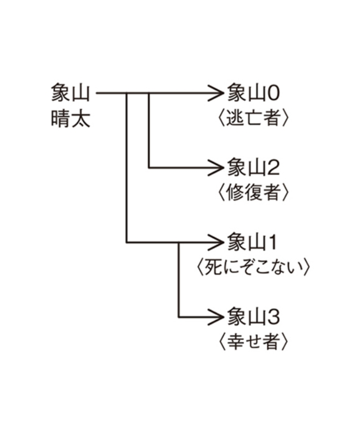

:::note[META]
`desc`: 精神科医生象山深爱着自己的家人。但他心知肚明：再幸福美满的家庭，也会因一道微小的裂痕，彻底分崩离析 ——。不久后，他偶然得到神秘药物，就此被卷入一连串超乎常理的杀人案件之中
:::

#### 1
「たたた大変だ。ありえないことが起きた」

“不得了不得了，不可能的事情发生了。”

目を開くと、ふざけたピンクのパーカーを着た逃亡者が猛然と肩を揺すっていた。

张开眼睛的时候，身穿搞笑粉色连帽衫的逃亡者正拼命摇晃着自己的肩膀。

<ruby>棺桶<rt>かんおけ</ruby>の縁を摑んで起き上がる。

象山抓着棺材的边缘缓缓坐了起来。

「あれを見ろ」

“快看那个。”

逃亡者が震える指で部屋の端を指す。修復者も同じところを見つめている。

逃亡者用震颤的手指指着房间边缘，修复者也望向同一个位置。

埃を被った木製の手術台。

那里是蒙尘已久的木制手术台。

<ruby>そこに男がいた<rt>丶丶丶丶丶丶丶</ruby>。

上面有一个男人。

鼻と口を覆う人工呼吸器のマスク。腕には点滴針。それ以外の大半の部位が包帯に覆われている。

呼吸机面罩覆盖着口鼻，手臂上扎着点滴针，除此之外的绝大多数部位都被绷带覆盖。

「どうなってるんだ」逃亡者が口をぱくぱくさせる。「<ruby>なんでおれたちの夢に知らねえ男がいるんだ<rt>丶丶丶丶丶丶丶丶丶丶丶丶丶丶丶丶丶丶丶丶</ruby>」

“究竟是怎么回事？” 逃亡者张大了嘴，“为什么我们的梦里会出现陌生人？”

「落ち着けよ」

“冷静点。”

象山は一つ息を吐き、手術台の男に歩み寄った。ひゅう、ひゅう、と<ruby>喘息<rt>ぜんそく</ruby>患者のような息遣いが聞こえる。

象山呼了口气，靠近了手术台上的男人。可以听见男人咻咻的呼吸声。

「わたしたちの夢に入ってこれるのはわたしたちだけ。彼も同じだよ」

“能够进入我们梦境的只有我们自己，他也一样。”

留め具を外し、顔の包帯を解く。どうせ夢の中、現実には影響しない。テープごとガーゼを剝がすと、右の瞼から頰にかけての肌が裂け、血と<ruby>膿<rt>うみ</ruby>の混じった汁が滲み出ていた。

修复者取下搭扣，解开脸上的绷带。反正身在梦境，对现实没有影响。把纱布连同胶带一起剥离下来。只见从右眼睑到脸颊的皮肤纷纷绽裂，渗出了血和脓混合在一起的汁液。

「ひでえな」

“太惨了。”

顔中のガーゼを剝がしていく。髪が剃られ、あちこちの皮膚が炎症を起こして膨れ上がっていたが、それでも自分と同じ象山晴太であることは辛うじて見て取れた。

修复者将脸上所有纱布都揭了下来。虽说头发被剃得精光，各处的皮肤因发炎而肿胀，但仍能勉强分辨出他是和自己一模一样的象山晴太。

逃亡者が顔を覗き込む。十秒ほど黙り込んだ後、

逃亡者窥探着那张脸，沉默了十秒之后。

「つまりこういうことか」

“也就是说……”

象山を睨んだ。

他死死地瞪着象山。

「幸せ者──あんたはとうとう、二つ目のシスマを使った」

“幸运者——你终于用了第二支西斯玛啊。”

象山は頷いた。

象山点了点头。

「やむをえない事情があってね」

“是因为迫不得已的情况。”

×　×　×

遡ること四日──三月二十三日、午後八時五十五分。

往前追溯四日——三月二十三日，晚上八点五十五分。

象山は仕事終わりに不死館を訪れた。

下班后，象山赶赴不死馆。

ロードバイクを降りたところで、ハンドルに取り付けたバックミラーに目が留まった。鏡に映った茂みに、木の板のようなものが隠れている。ススキを搔き分けると、「転落注意」と書いた手製の看板が立っていた。

下了公路自行车后，象山的视线被车把上的后视镜所吸引，映照在镜中的灌木丛里，隐藏着一块类似木板的东西。拨开芒草，一块写有 “小心跌落” 的自制招牌映入眼帘。

ブナ林を進んだところに犬死崖がある。父さんが気球から落下して重傷を負う前、まだ別荘に子どもたちを招待しようとしていた頃、崖への注意を促す看板を作っていたのを思い出した。よもや自分がその崖から落ちて死ぬことになるとは、父さんも思っていなかっただろう。

穿过山毛榉林，就是犬死崖的所在。在父亲从气球上坠落身负重伤之前，仍打算邀请孩子们光临别墅的时候，曾制作了一块提醒人注意悬崖的警示牌。父亲大概也不曾想到自己竟会坠崖身亡吧。

みすぼらしい看板を引っこ抜いたところで、車の走行音が聞こえた。ダスクブルーのアルトが山道を登ってくる。バンパーがへこんでいるのは、象山が妄想症患者の裏島を撥ねたときに使ったからだ。午後九時──象山の指示通りの時刻に、アルトは不死館の正面に停車した。

象山刚拔出破旧的告示牌，就传来了汽车驶来的声音。一辆深蓝色的奥拓驶上山路。前保险杠的凹陷是象山撞倒妄想症患者里岛所造成的。晚上九点——依照象山的指示，奥拓停在了不死馆的正前方。

「こんにちは、生田です！」

“你好，我是生田。”

朗らかな声とは裏腹に、生田の顔は真っ青だった。

与爽朗的声音相反，生田的面色苍白无比。

「ちょうどいい。これを持て」

“来得正好，拿着这个。”

土まみれの看板を持たせる。親指の泥を拭い、扉のセンサーにかざす。

象山把沾满泥土的告示牌递给生田，然后抹掉了拇指上的泥，将其按在了门上的传感器上。

玄関ホールに入るなり、カサカサとゴキブリの足音が聞こえた。生田が不安そうに視線を泳がせる。

一进门厅，就听到了像是蟑螂爬行的沙沙声，生田游移着视线，显得万分紧张。

「きみには本当に感謝してる。わたしが幸せに暮らせてるのはきみのおかげだ」

“我真的非常感激你，是你让我过上了幸福的生活。”

象山はスツールに尻を置き、キングバットの小箱を取り出した。一つ咥えて火を点ける。草バットを決めたいところだが、中身はあいにくただの煙草だ。

象山一屁股坐在凳子上，取出了 King Hitter 的小盒，抽出一支烟点了起来。本想来一支草 Hitter，不幸的是里边就只有普通的香烟。

「そんな友人にこんなことを頼むのは胸が痛むんだが──」生田にも一本差し出しながら言った。「そろそろ死んでくれないかな」

“对你这样的挚友提出这种要求，着实令人心痛——” 说这话的时候，他给生田递了一支烟，“能不能请你去死一死呢？”

生田は煙草を摑み、すぐに落とした。

生田刚接过香烟，立刻掉到了地上。

「は？」

“哈？”

「できれば自分で死んでほしいんだ。きみはわたしのことを知り過ぎてる。わたしにとってきみはリスクだ。だから死んでほしい」

“要是可以的话，我希望你自己主动去死。关于我的事情，你知道得太多了，对我而言是个风险，所以我希望你去死。”

生田の抱えた「転落注意」の看板が震えた。「そ、そんなこと、急に言われても」

“就，就算你突然提出这种事……” 生田抱着 “小心跌落” 的告示牌瑟瑟发抖。

「何も崖から飛び降りろと言ってるわけじゃない。やり方は自分で決めて構わないよ。塩化カリウムで心不全に見せかければ保険も下りるんじゃないかな」

“我不是非要叫你从悬崖上跳下去哦，你自己定个死法也行。用氯化钾假装心力衰竭的话，保险应该也能理赔的吧。”

「嫌です」は、は、と犬のような息を吐いて、「死にたくありません」

“不要！” 生田像狗一样哈哈地喘着气，“我不想死。”

「どうしてもか」

“说什么也不想？”

「どうしてもです」

“不想！”

「だったら仕方ないな」

“那就没办法了。”

象山は足先を走り抜けようとしたゴキブリを踏み潰した。

象山一脚踩烂了欲从脚边跑过去的蟑螂。

「本当はこんなことしたくないんだけど」

“其实我也不想做这种事。”

タブレットの電源を入れ、ドキュメントを開いて生田に見せる。

他打开平板电脑的电源，点开文档展示给生田看。

「きみが借金を返すために〝<ruby>慈善<rt>スイシャン</ruby>〟に売った赤ん坊の母親たちの住所だ。彼女たちにきみのやったことを知らせるお手紙を書こうと思う」

“这是你为了还债而卖给 ‘慈善’ 的婴儿母亲们的住址。我会写信揭发你的所作所为的哦。”

指でスクロールしながら言う。生田は看板を倒し、へなへなと床に尻をついた。

他一边用手指滚动屏幕，一边这样说道。生田扔掉了招牌，一屁股坐在地上。

「きみは逮捕され、あらゆるメディアで顔と名前を報じられる。生田家の名は当然、地に落ちるだろう。きみに期待していた親戚の失望といったらないだろうね。きみは一族の汚点として、末代まで<ruby>蔑<rt>さげす</ruby>み、罵られ続ける」

“你将会遭到逮捕，媒体会曝光你的脸孔和名字。生田家的名声当然也就彻底毁咯，更不用说那些对你寄予厚望的亲戚会有多失望了吧。你将作为家族的污点，永生永世遭到鄙视和唾骂。”

生田は、う、う、と唸りながら、看板に書かれた「転落」の文字を見つめた。やはりこの男、未だに親族の目を恐れているらしい。

生田 “唔” 了一声，紧紧盯着告示牌上 “跌落” 的文字。看来这个男人仍旧更害怕亲戚们的眼光。

「あと一週間待ってやる。家の名に泥を塗るか、潔く人生の幕を引くか。よく考えて決めることだ」

“我再等你一个礼拜。到时候究竟是抹黑家里的名声，还是干净利落地让人生落幕呢？你要考虑清楚再做决定哦。”

象山は腰を上げ、ゴキブリの臓物を床に擦りつけた。

象山站了起来，将死蟑螂的污物抹在了地板上。

×　×　×

「無理やり自殺に追い込めば、人質ルールに触れずに人を死なせられると考えたのか」

“要是你硬逼他自杀，可以在不触犯人质规则的情况下弄死他吗？”

逃亡者が堪えかねたように舌を打った。

逃亡者忍无可忍地咂了咂舌。

「お前、ろくな人間じゃねえな」

“你可真不是人啊。”

「後悔してるよ。もうこの手は使わない。そうでなきゃこうして手の内を明かすはずがないだろ？」

“我现在很后悔。再也不会用这种手段了，不然也不会把内心的想法对你们开诚布公。”

「急に殊勝なことを言いやがって」修復者が象山を一睨みして、手術台に目を落とす。「よほどひどい目に遭ったんだな」

“别突然说这种正气凛然的话。” 修复者瞪了象山一眼，将视线落在手术台上，“你可真是遭殃了。”

象山は鏡の中の時間を三日進めた。

象山把镜中的时间往后推了三天。

「これは昨日、三月二十六日の記憶だ。この日は家族とストリートキッチンＥＬＭのランチに行く約束をしていた。十一時に家を出ると、ガレージから突然、生田が飛び出してきた」

“这是昨天，也就是三月二十六日的记忆。这天我和家人们约好去榆树街头小厨共进午餐。就在十一点离开家时，生田突然从车库里冲了出来。”

血相を変えた生田が、死ねっ、死ねっ、と叫びながら迫ってくる。舞冬の悲鳴。生田は和包丁で象山に切りかかると、倒れたところにのしかかって顔をめちゃくちゃに切りつけ、とどめとばかりに刃を胸に押し込んだ。

勃然变色的生田一边叫嚣着 “去死吧，去死吧”，一边冲了过来。舞冬发出了惨叫，生田抡着日式菜刀朝象山砍了过去，压在倒地的象山身上一刀一刀地砍向他的脸，然后将刀直插胸口。

「包丁は<ruby>肋骨<rt>ろっこつ</ruby>の間から肺へ到達していた。死を覚悟したわたしは、１１９番通報する家族を横目に書斎へ駆け込み、金庫からシスマを取り出した。そして一緒に用意しておいた注射器でそれを打ち、気づいたときには寝室で天井のファンを見上げていた」

“刀子从肋骨之间穿到了肺部，我抱着必死的觉悟，撇下拨打 119 的家人冲进书房，从保险柜里拿出西斯玛，然后用一起准备的注射器打入体内，回过神来的时候，我正躺在卧室里，仰头看着天花板上的风扇。”

鏡の中が切り替わる。象山は身体を起こしてスマホを見た。時刻は午前六時。

镜中的画面切换了。象山撑起身子，看向手机。时间是上午六点。

「悪運の強いやつめ」

“你这运气也太好了吧。”

象山も思わず頷いた。二回連続で時間遡行に成功するとは、自分は本当に運が良い。

象山不由得点了点头，连续两次时间回溯都成功了，自己的运气真的不错。

「わたしは書斎の窓からガレージを見張り、生田が忍び込むところを撮影して警察を呼んだ。生田は<ruby>銃刀法<rt>じゅうとうほう</ruby>違反でしょっ引かれた。

“我通过书房的窗户监视车库，拍下了生田潜入的画面，然后叫来了警察，生田因违反刀枪法而被带走了。

一方、運の悪かったほうのわたしは救急車で搬送され、辛くも一命を取り留めた。そして今も病院で治療を受けている。そうだろ？」

而另一边，倒霉的我则被抬上救护车送去了医院，好不容易保住了一条命，现在仍在医院里接受治疗，对不对啊？”

象山が耳元で囁くと、手術台の象山は薄く目を開き、マスクの中で小さく言った。「死ね」

象山对着那人的耳朵低语道，手术台上的象山微微睁开了眼，在面罩里轻轻说了声 “去死”。

「するとこの男は──象山３？」

“这么说来，这个男人该叫——象山 3？”

「分岐した順に番号を振るなら、時間遡行で襲撃を回避したわたしが象山３。治療中の彼が象山１ということになる」

“要是按照分支点的顺序来编号的话，回溯时间躲过袭击的我是象山 3，正在治疗这个象山才是象山 1。”

修復者が小道具の木箱から鉛筆と紙を取り出し、新たな系統図を書いた。

修复者从装小道具的木箱中取出了铅笔和纸，绘制了新的系统图。

「これで全員が二度ずつシスマを打ったわけだ。二つのシスマで分岐できる限りのわたしが揃ったわけだな」

“这样一来，所有人都打了两次西斯玛，两支西斯玛的分支情况都凑齐了。”

「渾名はどうする？」

“绰号叫什么？”

「<ruby>死にぞこない<rt>ダイイング</ruby>しかねえだろ」

“只能是未死者了吧。”

「それよりお前だよ」逃亡者が象山を睨んだ。「ろくでもねえ真似ばっかしやがって。もし死にぞこないが死んでたら、連鎖現象でおれたち全員死ぬところだったんだぞ」

“要说该说的是你才对。” 逃亡者瞪着象山，“总是做些蠢事，如果未死者真的死了，那连锁现象也会要了我们的命。”

「ああ。悪かった」

“哦哦，对不住了。”

「問題は、どうやってこの手の不正を防ぐかだ。せっかくシンプルなルールを作ったのに、お前みたいなやつのせいでまたルールを増やさなきゃならなくなる」

“问题是如何制止这种不正手段。好不容易制定了简单的规则，却因为你这种家伙，不得不再次增添规则。”

「反省してる」

“已经在反省了。”

「だったら知恵を出せ。この中の誰かが、直接人を殺すんじゃなく、間接的に人を死に追い込むのを防ぐにはどうしたらいい？」

“既然如此，那就贡献出你的智慧吧，如何才能防止我们中的某人不直接杀人，而是间接逼人去死？”

象山が答えるより早く、修復者が応じた。

象山还没来得及回应，修复者就替他回答道：

「こうしよう。ルール四。我々の身近な人間が連鎖現象によって死んだときは、それが生じる原因となった時間のわたしが、その人物を死に追い込んだのではないことを証明しなければならない」

“那就这样吧。规则四，当我们身边的某人因连锁现象死亡时，必须证明在成为其死亡原因的时间线上的自己没有逼死这人。”

「それが生じる原因が──何だって？」

“成为其死亡原因——什么意思？”

「今回のケースでいえば、仮に生田が高カリウム血症で死んだ場合、それが幸せ者の言動の結果ではないことを幸せ者自身が証明しなければならないってことだ。それができなければ人を殺した場合と同様、人質を殺すこととする」

“以本次的案例来说，假设生田死于高血钾症，那么幸运者就必须证明这不是幸运者自身言行的结果。倘若不能做到这点，就视作杀人而杀死人质。”

修復者が二人を見る。逃亡者は「なるほど」と腕を組む。

修复者看着两人，逃亡者抱着胳膊说 “原来如此”。

この追加ルールが提案されることは予想していた。自分に拒む選択肢はない。追加ルールで逃亡者や修復者を縛っておかなければ、同じやり方で家族を殺されてしまうからだ。

提出这个附加规则其实是预料之内的事。自己也没有选择拒绝的权利。倘若不用附加规则约束逃亡者和修复者，自己的家人也会被同样的手段杀害。

「異論がないなら、ルール四も成立だな」

“既然没有异议，那么规则四也就成立了。”

逃亡者がギロチン台の前のバケツに腰を下ろし、いつものように草バットを咥える。修復者も電気椅子に戻り、背もたれに身体を預ける。どこか仕草がぎこちないのは、突然現れた四人目の象山──死にぞこないとの接し方を摑みかねているせいか。

逃亡者坐在断头台前的水桶上，像往常一样叼着草 Hitter。修复者也回到电椅上，将脊背紧靠在椅背上。他的动作不太利落，或许是不清楚该如何应对突然出现的第四个象山——也就是未死者吧。

象山も棺桶に尻を置く。 　

象山也一屁股坐进了棺材。

ひゅう、ひゅう。 　

呼咻，呼咻。

死にぞこないの苦しげな息遣いが耳に迫って聞こえた。

耳畔唯有他痛苦万分的呼吸声。
#### 2
「産科医の生田って男。ありゃいったい何を考えてんだ？」

“妇产科的那个生田，到底在想什么啊？”

屋上の手すりにもたれて、芋窪がぼやく。どこからか救急車のサイレンが響いていた。

芋窪倚靠在屋顶的栏杆上，嘴里发着牢骚。不知从何处传来了救护车的警笛声。

「おたくの長女の恋人を襲った覆面野郎もあの男で間違いないと思うんだが、野郎、すっかり黙り込んじまってね。恨みがあんなら吐きゃいいのに、うんともすんとも言いやしねえ」

“我敢肯定袭击你长女的那个蒙面人就是他。可是这家伙现在完全不吱声了。如果有什么怨恨都说出来不就好了，可他连嗯都不嗯一下。”

象山の報復を恐れているのだろう。赤ん坊の母親のリストを見せたのが効いているようだ。とはいえそんなことは<ruby>声帯<rt>せいたい</ruby>が捻じれても言えない。

他大概是畏惧象山的报复吧，给他看婴儿母亲名单的做法似乎奏了效。话虽如此，这种事即便扭破声带也不能说。

「分かりませんね。ただ──」

“我也不知道，只是——”

象山は手すりから上半身を乗り出し、病棟の前の道路を見下ろした。救急車が速度を落とすことなく救命救急センターへ走っていく。

象山自栏杆上探出上半身，俯视着病房前方的道路。救护车没有减速，就这样驶入了急救中心。

「わたしの妻は女優ですし、長女の歌手活動も軌道に乗っています。自分で言うのも何ですが、誰に<ruby>妬<rt>ねた</ruby>まれていても驚きませんよ」

“我的妻子是女演员，长女的歌手活动也已走上正轨。虽说这话由我来讲有些不妥，但招来嫉妒也没什么可奇怪的。”

芋窪はひどい渋っ面をして象山を見つめた後、手帳に「家族　妬み？」と書き殴った。ペンの頭で首を搔いてから、「そういや」と顔を上げる。 「ラジオで聞いたぜ。おたくの歌姫、青葉市でライブやんだろ？」

芋窪一脸不快地盯着象山，然后在笔记本上记下了 “家人，嫉妒？”。然后用笔头挠了挠脖子，然后抬起手问道：“说起来，我在广播里听到了，你家的歌姬不是正在青叶市开演唱会吗？”

興味がないことをアピールするように、唇をへの字に曲げて言う。春が襲われた際の事情聴取で、舞冬は自分がアカダマのeriminであることを警察に打ち明けていた。

他说话的时候把嘴撇成了 “乀” 字，就似提到了兴味索然的事情一样。在春遇袭一案的问话过程中，舞冬向警方透露了自己是赤玉的 erimin。

「ええ。<ruby>明後日<rt>あさって</ruby>、ツアーの最終公演があります。わたしも次女と見に行く予定です」

“嗯，后天是巡演的最后一场公演，我打算带次女一起去看。”

風がシイの枝を揺らし、賑やかな木漏れ日が足元を照らす。

轻风摇曳着米槠树的枝条，自间隙落下的明媚光斑照耀脚下。

「おかしいな。おれもうっかり包丁持って先生の家に乗り込みそうな気がしてきた」

“好怪啊，连我也觉得自己会不小心拿着菜刀闯进医生家了。”

芋窪は人気のない広場を見回し、

芋窪环顾着空无一人的广场。

「この幸せ者め」

“你这个幸运者。”

どこかで聞いたようなことを言った。

他说了句似乎在哪听过的话。
 
年を跨いで全国七カ所で開催されたアカダマのぶっとびトリップツアーは、四月三日、青葉市は一蛮町の老舗ライブハウス、アシッドルームで最終公演を迎えた。

四月三日，赤玉的 “一飞冲天周游旅行”——在全国七个地方举办的跨年度演唱会，终于在青叶市一蛮町的老字号 Live house——酸之间迎来了最后一场公演。

この日の彩夏はひどく浮足立っていた。開場二時間前の午後四時三十分に父親と青葉駅へ降り立つと、スマホでよくやっているゲーム──パルパルなんとかのコラボカフェで「<ruby>魚人探偵<rt>ギル</ruby>のイカ焼き」「<ruby>巨人探偵<rt>ジャイアント</ruby>のジャンボお好み焼き」「<ruby>増殖探偵<rt>オルゴ</ruby>の親子丼」「<ruby>透明探偵<rt>インビジブル</ruby>のバニラゼリータルト」をたいらげ、「<ruby>吸血探偵<rt>バンプ</ruby>のざくろクリームソーダ」を二杯飲み、「<ruby>電気探偵<rt>エレクトロ</ruby>の強炭酸コカコカライム」を注文しようとして「そちらはお酒になりますので」と店員を畏まらせた。

这点，彩夏显得坐立不安。下午四点三十分，距离开场还有两小时的时候，她已和父亲在青叶站下车，在手游帕尔帕拉的联名咖啡店里吃了 “人鱼侦探的烤墨鱼” “巨人侦探的特大大阪烧” “增殖侦探的亲子丼” “透明侦探的香草果冻挞”，还喝了两杯 “吸血侦探的石榴奶油苏打”。她原本还打算点 “电力侦探的强碳酸可乐酸橙"，吓了一跳的店员却告诉她说 “这是酒精饮料哦”。

「せっかく鯊田アンホと会うのに、そんなに飲み食いして大丈夫なのか？」

“好不容易才能见到鲨田安福，吃那么多东西真的不要紧吗？”

「大丈夫。朝、スーパーヒョロリン飲んできたから」

“没关系，我早上吃过超级瘦身灵了。”

もはや会話すら嚙み合わない。

真教人无言以对。

はたして会場へ向かう頃には泣き出しそうな顔で「やばい」「死ぬかも」と連呼し始め、クリームソーダに覚醒剤でも入っていたのではないかと父親を不安にさせた。

果然到了会场的时候，她露出一副快要哭出来的脸，连连惊呼 “糟了” “要死了”。这让父亲很是不安，甚至怀疑起奶油苏打里是不是掺了兴奋剂。

午後七時十分。メンバーとともにアシッドルームのステージに現れた舞冬は、葬式帰りのような黒のフォーマルドレスに、大きなトマトのような形のヘルメットを被っていた。素肌が出ているのは口元だけ。古い映画のサイボーグのようだ。

到了晚上七点十分，舞冬和乐团的成员们一起登上了酸之间的舞台。她身上穿着仿佛刚从葬礼上回家的黑色礼服，头顶巨大西红柿模样的头套，裸露在外的仅有嘴巴，活像古早电影里的机器人。

さすがに視界が狭かったのか、舞冬は何度かステージから落ちそうになり、『ぶっとびシロップ』の演奏中にはギターのterumoと激突していたが、それでも最後まで透明な歌声を響かせ続けた。アンコールで俳優の鯊田アンホが登場し、ドラマ主題歌の『魔法のきのこ』をデュエットで歌い上げると、千二百人のアカちゃんは「えりみーん」「アンちゃーん」と象山の耳がどうにかなりそうなほど絶叫した。

或许是视野狭小的缘故，舞冬数度差点从舞台上跌下来，在演奏《一飞冲天糖浆》的时候，还和吉他手 terumo 狠狠地撞到一起，但直到最后，她的歌声依旧通透如初。在安可的时候，演员鲨田安福登场，以二重唱的形式演唱了电视剧主题曲《魔法蘑菇》，一千两百名自称小赤的歌迷大吼着 “erimin” “小安”，把象山的耳朵几乎震碎了。

二時間弱のライブが終わると、象山と彩夏はスタッフの案内で控室を訪ねた。STAFF ONLYとプレートの貼られた扉を開けると、舞冬と鯊田アンホがポーズを変えながら写真を撮っていた。

不到两小时的演唱会结束后，象山和彩夏在工作人员的引导下来到了休息室。打开了贴有 “仅供工作人员使用” 牌子的门，只见舞冬和鲨田安福正一边换着 Pose 一边拍照。

「無理無理無理。死ぬ死ぬ死ぬ死ぬ」

“不行不行不行，要死要死要死。”

今にも逃げ出しそうな彩夏を舞冬が「妹です」と紹介する。鯊田アンホは頰にえくぼを並べて「初めまして」と会釈する。彩夏は耳を真っ赤にしてバッズで買ったレモンバターケーキを差し出し、「ささささ差し入れ、よかったらどうぞ」

彩夏眼看就要落荒而逃，却被舞冬介绍说 “这是家妹”，鲨田安福在脸颊上整整齐齐地挤出酒窝，点点头说 “初次见面”。彩夏连耳朵都胀得通红，赶忙把花芽买来的柠檬黄油蛋糕递了过去，嘴里说着“可可可可以的话请收下”。

鯊田アンホが「どうもすみません」と手を合わせたところで、プロデューサー兼マネージャーのムイが部屋に入ってきた。

正当鲨田安福合掌说着 “非常抱歉”之时，制作人兼经纪人穆伊走进了房间。

「象山さん、今日は楽しんでいただけましたか」

“象山先生，今天玩得开心吗？”

「お蔭様で」何を褒めようかと考えながら部屋を見回し、舞冬の被り物を手に取る。「まさか娘がトマトになってるとは思いませんでした」

“托你的福。” 象山一边想着该说什么夸赞的话，一边环顾着房间，随即拿起了舞冬的头套，“没想到女儿居然成了西红柿啊。”

遠目にはパーティーグッズのラバーマスクのように見えたが、実物は石膏でできていた。手作業で色を塗ったらしく、よく見るとむらが残っている。どうやら器用なプロデューサーのお手製らしい。

远远望去像是派对用的橡胶面具，实物则用石膏做的，貌似还是手工上色，仔细一看，还有些不均匀的地方。看样子是能干的制作人亲手制作的。

「なかなか良いでしょう。『魔法のきのこ』にちなんで、きのこの被り物を作ってみたんです」

“很棒吧。我以 ‘魔法蘑菇’ 为灵感，试着做了个蘑菇头套。”

トマトではなかった。

原来并不是西红柿。

「アカダマの世界観によくマッチしてるって、関係者の間でも好評なんですよ」

“很符合赤玉的世界观哦，在工作人员之间似乎也颇受好评呢。”

ムイはにっこり笑って、誇らしげに舞冬を見た。舞冬は鯊田アンホにレモンバターケーキを勧めている。鯊田アンホはケーキを一口頰張って、「美味しいです。お二人も食べてください」彩夏が魂の抜けたような顔で、「ははははい」

穆伊笑容满面，骄傲地看向舞冬。舞冬正向鲨田安福推荐柠檬黄油蛋糕，鲨田安福咬了口蛋糕说 “很美味，请两位也尝尝”，彩夏则 “哈哈哈” 地笑着，一副魂不守舍的样子。

「三年前、ライヒプロモーションに転がり込んだときは、まさかこんな日が来るとは思っていませんでした」

“三年前，当我加入帝国选拔时，根本没想到会有这一天。”

はしゃぐ三人の姿に目尻を下げ、ムイがつぶやく。

望着三人嬉闹的模样，穆伊垂下眼角，嘴里喃喃地道：

「わたしのやってきたことは間違ってなかった。今回のツアーで、そんな確信が持てたような気がしています」

“我做的事情没有错，通过这次巡演，我已有了确信。”
 
大食駅から自宅への帰り道、彩夏は数メートルおきにスマホで鯊田アンホとのツーショットを見返しては、はあん、と変なため息を吐いていた。

从大食站回家的路上，彩夏每走几米，就会拿起手机回看一眼和鲨田安福的合照，然后怪模怪样地 “哈” 一声。

「わたし、アンちゃんに変なこと言ってなかったよね？」

“我没对小安说什么奇怪的话吧？”

彩夏の息が白く曇る。午後十時半を回った自然公園には、四月とは思えない冷たい風が吹いていた。

彩夏的呼气化作了白雾。夜里十点半多的自然公园里，吹着不像是四月的冷风。

「アンちゃんはかっこいいし、バンドもイケてるし、きのこの被り物はちょっと変だったけど、お姉ちゃんの歌も上手かったし。わたし、罰当たんないか心配なんだけど」

“小安好帅，乐队也尽是帅哥，虽然蘑菇头套有点怪，但姐姐的歌唱得真好。我好担心会不会遭到报应啊。”

当の舞冬たちは一蛮町のバーを貸し切って打ち上げをしている。帰りは明日になるらしい。

舞冬等人包下了一蛮町的酒吧，正在大办庆功宴，看来要明天才能回家了。

「去年から十分大変な目に遭ってきたじゃないか。まだお釣りが来てもおかしくないくらいだよ」

“从去年开始就遭了不少罪吧？现在搞不好还有得找零呢。”

「あー、確かに」

“啊，确实也是。”

彩夏が夜空を見上げる。

彩夏仰望着夜空。

「よく考えたらやばいよね。変なフリージャーナリストに家を見張られたと思ったら、お姉ちゃんの彼氏が襲われて、挙句の果てに産科の先生が家に忍び込んでたんだから」

“仔细一想，确实很不容易啊。家里先是被奇怪的自由记者监视，姐姐的男朋友又遭到了袭击，最后还被一个妇产科医生偷偷溜进家里。”

彩夏が指を折って言う。まったくその通りだ。

彩夏掰着手指说道，这话并没有错。

「でも全部吹っ飛んだ。もうお姉ちゃんに足向けて寝らんない[^37]」

“可现在一切都不存在了，真得谢谢姐姐啊。”

はは、と笑ったところで、ふと何かが引っかかった。

象山哈哈一笑，心里却突然咯噔了一下。

気のせいだろうと思ったものの、考えるほどに違和感が大きくなる。ああ、そうだ──。

本以为是自己的错觉，可越想越不对劲，啊，对了——

「<ruby>変なフリージャーナリストに家を見張られた<rt>丶丶丶丶丶丶丶丶丶丶丶丶丶丶丶丶丶丶丶丶</ruby>？」

“家里被奇怪的自由记者监视了？”

言葉がこぼれた。

这话不由自主地滚了出来。

ヒノキに挟まれた小道で足を止める。

象山在木林中间的小路上停下了脚步。

「それはどういう意味だ」

“这话是什么意思？”

彩夏も足を止める。振り返った顔が引き攣っていた。歪んだ口元に、しまった、と書いてある。

彩夏驻足不前，她扭过了头，脸上的表情有些踌躇，扭曲的嘴角上写满了 “糟糕”。

「いや、なんか、そんなこともあったような気がして──」

“没没，我只是觉得似乎发生过这种事——”

フリージャーナリストの伊豆美崎──もとい和泉早希が象山の家を見張っていたのは事実だ。昨年の八月二十一日、あの女は家の前に黒のデリカを停め、家族が帰ってくるのを待っていた。

自由记者伊豆美崎——即和泉早希监视象山家的事确凿无疑。去年八月二十一日，那个女人把得利卡停在自家门口，等待着家人回来。

だが象山は彩夏にその話をしていない。家族を心配させたくない、という舞冬の意見に従ったからだ。もちろん舞冬がその話題を口にしたこともなかった。

但象山从未和彩夏提起这事，那是因为他听从了舞冬的意见，不想让家人担心。当然了，舞冬也从未提起这个话题。

なぜ、彩夏が和泉早希のことを知っていたのか。

那彩夏是怎么知道和泉早希的事呢？

あの車を目にした三人──象山、舞冬、ムイの中の誰かが教えていたことになる。

是看到那辆车的三人——象山、舞冬、穆伊中的某人告诉他的吧。

象山は当初、あの女の素性を知らなかった。彼女がフリーのジャーナリストだと分かったのは、偽の委任状を携えて自動車検査登録事務所へ行き、ナンバープレートの番号を照会した後だ。

起初象山并不知道那个女人的来历，直到拿着假委托书去了车辆检测登记办事处查询了车牌号后，才了解到她是自由记者。

でも彩夏はあの女がフリーのジャーナリストだと知っていた。彩夏にあの女のことを教えた人物は、彼女の素性を知っていたことになる。

可彩夏却知道那个女人是自由记者。也就是说，把那个女人的事告诉彩夏的人，也了解那个女人的来历。

和泉は芸能界の問題を専門に扱うジャーナリストだった。最近はとくにライヒプロモーション絡みの問題を取材していたという。ライヒプロモーションの社員なら、彼女が周囲を嗅ぎ回っていることに気づいていてもおかしくない。

和田早希是记者，专门调查娱乐圈的问题。据说近来在调查帝国选拔的问题。倘若是帝国选拔的员工，是有可能发觉她在四处打探的事。

あの女のことを彩夏に教えたのは、ムイだ。

把那个女人的事告诉彩夏的人，无疑就是穆伊。

「お父さん、早く行こうよ──」

“爸爸，快点走啦──”

胸騒ぎが膨らんでいく。

象山内心的悸动愈演愈烈。

ムイにとって、彩夏は担当タレントの妹に過ぎない。普通のマネージャーは、タレントが隠そうとしたことを妹に明かしたりしない。ムイと彩夏は、いつからか象山に明かせないような関係を築いていたのではないか。

对穆伊而言，彩夏不过是自己负责艺人的妹妹罢了。普通的经纪人，是不会把艺人想要隐瞒的事情告诉其妹妹的。穆伊和彩夏，不知从何时起，或许已经建立起了一段不能向象山坦白的关系。

「何考えてんのか知らないけど、絶対お父さんの思い過ごしだよ」

“我不知道爸爸在想什么，不过绝对是想多啦。”

彩夏が声を上ずらせる。 　

彩夏大声说道。

本当だろうか？ 　

这话当真吗？

つい数十秒前、彩夏はこんなことを言っていた。

就在数十秒前，彩夏还说过这样的话。

──アンちゃんはかっこいいし、バンドもイケてるし、<ruby>きのこの被り物はちょっと変だったけど<rt>丶丶丶丶丶丶丶丶丶丶丶丶丶丶丶丶丶丶</ruby>、お姉ちゃんの歌も上手かったし──。

——小安好帅，乐队也尽是帅哥，虽然蘑菇头套有点怪，但姐姐的歌唱得真好——

舞冬があの被り物を身に着けてステージに現れたとき、象山はそれがきのこをかたどったものとは思いもしなかった。終演後、ムイがモチーフを明かしたとき、彩夏は鯊田アンホを前に慌てふためいていて、とてもムイの話を聞いているようには見えなかった。

当舞冬套着那个头套上台表演的时候，象山根本就没意识到那是个蘑菇的形状。而演出结束后，穆伊透露构思时，彩夏正在鲨田安福面前魂不守舍，完全看不出她在听穆伊讲话。

それなのに彩夏は、なぜあの被り物がきのこをかたどったものだと知っていたのか。 　やはり思い過ごしではない。あの二人は象山の知らないところで、何らかの親密な関係を築いていたのだ。

那彩夏是怎么知道那个头套是蘑菇造型的呢？果然并非多虑，他俩在不为象山所知的地方，建立了某种亲密的关系。

ライヒプロモーションはこれまで数々の不祥事で世間を騒がせてきた。だがことアカダマのプロジェクトに関しては、有能なプロデューサーが目を光らせていたこともあり、過去にあったような問題は生じていない──象山はそう信じていた。

迄今为止，帝国选拔各种丑闻缠身，在世间早已是引人侧目。不过在赤玉的项目上，在颇有能耐的制作人的密切关注之下，并没有出现过去出现过的问题——象山深信这点。

自分はとんでもない思い違いをしていたのではないか。

自己是不是犯了个天大的错误呢？

──ライヒプロモーションはこれまで多くの問題を起こしてきました。でもわたしは、それらはほんの氷山の一角に過ぎないのではないかと考えています。

——帝国选拔迄今为止已经制造了很多问题，但我怀疑这只是冰山一角——

和泉もそう口にしていたではないか。

和泉不是也说过这样的话吗？

彼女がとくにマークしていたのがムイだったとしたら。あの日、彼女が話を聞こうとしていたのが舞冬ではなく、彩夏だったとしたら──。

如果她特别关注的人正是穆伊，而她想打探消息的对象并非舞冬，而是彩夏的话——

「ねえ、帰んないの？」

“喂，不回家了吗？”

彩夏が寒さで赤くなった鼻を擦る。象山が口を開こうとすると、不自然に目を逸らした。必死に動揺を抑え込んでいるのが分かる。

彩夏抹着因寒冷而冻得通红的鼻子。象山正待开口，却不自然地挪开了视线，他深知彩夏正在拼命掩饰着内心的动摇。

ムイとの関係を質すべきか。ここはいったんやり過ごし、外から堀を埋めるべきか。迷っている間に時間が過ぎていく。

应该质问她和穆伊的关系吗？又或者在这里暂时翻篇，首先清除外围的障碍呢？就在举棋不定之际，时间一分一秒地过去了。

「先帰るよ──」

“那我先回去了——”

そう言って象山に背を向ける。一陣の風が彩夏の髪を揺らした、そのとき。

言毕，她转过身背对象山，一阵风撩动了彩夏的秀发。就在这时——

パン、と音が鳴り、<ruby>彩夏が消えた<rt>丶丶丶丶丶丶</ruby>。

“砰” 的一声，彩夏失去了踪影。

硬い物が顔にぶつかる。熱い液体が降り注ぐ。嘔吐きを誘う強烈な臭い。

某个硬物砸在了脸上，滚热的液体奔泻而下，传来了令人作呕的强烈臭气。

右目を覆うようにこびりついた何かを剝がす。点滴バッグのような薄い袋に詰まった赤紫の組織。人間の腎臓だった。顔からぽたぽた垂れているのは血の混じったどろどろの消化物だ。黒く焦げたイカの欠片がぬるりと頰を滑り落ちていく。

象山拿开了遮住右眼的物体——紫红色的组织，装在输液袋似的薄袋子里，是人类的肾脏，从脸上滑落下来的乃是混合了血液的黏糊消化物。黑焦的墨鱼碎片从脸颊上滑落下来。

彩夏の立っていたところを見て、目を疑った。抉れた<ruby>膵臓<rt>すいぞう</ruby>、<ruby>小臼<rt>しょうきゅう</ruby><ruby>歯<rt>し</ruby>、腸管の切れ端、ミサンガ[^38]、潰れた右心房、三角筋付きの鎖骨、どこかの脳、<ruby>下<rt>か</ruby><ruby>顎骨<rt>がくこつ</ruby>、肋骨の生えた胸骨、腸管の切れ端、スマートフォン、折れた<ruby>橈骨<rt>とうこつ</ruby>、<ruby>長<rt>ちょう</ruby><ruby>趾<rt>し</ruby>伸筋付きの<ruby>脛骨<rt>けいこつ</ruby>、<ruby>萎<rt>しぼ</ruby>んだ<ruby>膀胱<rt>ぼうこう</ruby>、食道、手の親指、デニム[^39]の切れ端、指輪、頰の皮、舌、<ruby>犬<rt>けん</ruby><ruby>歯<rt>し</ruby>、腸管の切れ端、<ruby>腓<rt>ひ</ruby><ruby>腹<rt>ふく</ruby>筋付きの腓骨、卵管の千切れた<ruby>卵巣<rt>らんそう</ruby>、足の小指、<ruby>仙骨<rt>せんこつ</ruby>[^40]の砕けた骨盤──その他あらゆる人間の欠片が半径三メートルほどの範囲に飛散している。

看向彩夏站立的位置，象山不敢相信自己的眼睛，凹陷的胰脏，小臼齿，肠管断片，编织手带，破碎的右心房，连着三角肌的锁骨，某处的大脑，下颚骨，连着肋骨的胸骨，肠管断片，手机，折断的桡骨，带着长趾伸肌的胫骨，萎缩的膀胱，牛仔布的碎片，戒指，脸皮，舌头，犬齿，肠管断片，带着腓肠肌的腓骨，输卵管断裂的卵巢，小脚趾，腰椎破碎的骨盆——其他所有的人体碎片则散落在半径约三米的范围之内。

何だこれは。

这究竟是怎么回事？

つい数秒前まで小さな唇を尖らせていた彩夏が、ばらばらになって公園の小道を赤黒く染めている。<ruby>まるで爆発したかのように<rt>丶丶丶丶丶丶丶丶丶丶丶丶</ruby>。

就在数秒前还撅着小嘴的彩夏，瞬间变得四散碎裂，将公园的小径染成了红黑色，好似发生了爆炸。

ふいに恐怖が込み上げた。腎臓を投げ捨て、向かいのヒノキ林に駆け込む。彩夏のいたところを横切ると、ぬちゃっ、と血が跳ねた。ヒノキの陰に身を隠し、おそるおそる辺りを見回す。

恐惧感骤然涌上心头。象山抛下肾脏，冲进面前的桧木林。从彩夏所在的位置横穿过去，鲜血噗嗤噗嗤地溅了起来。躲在桧树的阴影里，小心地环顾四周。

誰かが銃器で彩夏を撃ったのか。だが発砲音は聞こえなかったし、火薬の臭いもしない。だいいち、どこかから弾丸を撃ち込まれたのなら、肉や血もそれと同じ方向に飛散するはずだ。でも彩夏の欠片は円状に広がっている。彼女自身が爆発したとしか思えない。

是谁枪击了彩夏吗？但没听到开枪的声音，也没有火药的气味。最重要的是，如果子弹是从某个方向飞来的，血肉理应也会朝着相同的方向飞散。可彩夏的碎片呈圆形铺开，那就只能认为是她自己爆炸了。

人間の身体は勝手に爆発したりはしない。教科書でも症例データベースでもそんな話は見たことがない。

人的身体不会自行爆炸，查遍教科书和病理数据库，都找不到这样的说法。

ミイラ取りがミイラに、精神科医が精神病に──そんな言葉が真実味を帯びる。自分は幻覚に囚われているのか？

去找木乃伊的人自己也成了木乃伊，精神科医生自己也成了精神病——这句话颇有些真实感，自己是被幻觉禁锢了吗？

「違う」

“不对！”

この奇っ怪な事態を合理的に説明しうる仮説が一つある。

有个假说可以合理地解释这种奇怪的事态。

<ruby>彩夏はこの時間ではなく<rt>丶丶丶丶丶丶丶丶丶丶丶</ruby>、<ruby>他の時間で死んだのだ<rt>丶丶丶丶丶丶丶丶丶丶</ruby>。

彩夏并不是在这条时间线，而是在其他时间线上死去的。

象山がメスでペペ子を刺し殺すと、他の時間のペペ子もメスで刺されたような傷ができて死んだ。同じことが彩夏にも起きたのだろう。

象山用手术刀刺死佩佩子后，其他时间线上的佩佩子也出现了类似被手术刀刺中的伤口而死。相同的事情也发生在了彩夏身上吧。

かつて父さんが不死館の地下室に運び込んだ奇術道具の中には、ショーに使う爆薬や、それを起爆させるための雷管や導火線があった。ペペ子を閉じ込めた際、別の部屋へ運んだが、探せばすぐに見つかるだろう。他の時間の象山があの爆薬で彩夏を爆破し、それがこちらの時間にも波及したのだ。

昔日父亲搬进不死馆地下室的道具中，也有表演用的炸药，还有引爆用的雷管和导火索。囚禁佩佩子的时候，虽然已经搬去了其他房间，但想必一找就能找到。其他时间线上的象山用那些炸药炸死了彩夏，也波及到了这边的时间线吧。

これは象山たちの定めた人質ルール──人を殺すときは残りの自分たちの許可を得ること──に反している。犯人を突き止め、人質を殺さなければならない。勝手に彩夏の命を奪ったのだから当然の報いだ。

这违反了象山们制定的人质规则——杀人的时候必须向其他人征得杀人许可。自己必须找出凶手，杀死人质。既然对方擅自夺走了彩夏的性命，这便是理所应得的报应。

だが今はそれどころではない。別の時間のことを考える前に、どうやってこの現実を切り抜けるかを考えなければならない。

但眼下不是处理这种事情的时候，在思考其他时间线的情形以前，必须首先考虑如何摆脱眼下的状况。

頰に付いた液体を拭う。娘の血と消化物を浴びた姿を見られたら言い訳はできない。娘が突然爆発したと訴えても誰も信じないだろう。シスマはもう残っていないから、時間を遡って手を打つこともできない。

象山擦干了溅到脸上的液体。要是被别人看到自己浑身沾满了女儿的血和消化液，那就百口莫辩了。就算告诉对方女儿突然爆炸了，也没人会信吧。西斯玛也已经不在了，所以也没法采取时间溯回的手段。

幸い、自然公園に人気はなかった。舞冬の打ち上げは朝まで続くはずだし、季々も『マルチなマルチ』の同窓会はなかなか帰れないとぼやいていた。時間は十分ある。

所幸自然公园里人迹罕至。舞冬的庆功宴理应会持续到早上，季季也抱怨过《千面千手》的同窗会很难脱身，时间很充裕。

肉と骨をビニール袋にまとめる。水を運び、地面を洗う。身体から血や消化物を洗い流し、肉と骨の入った袋を不死館へ運ぶ。

只要骨头和肉装进塑料袋里，搬来水冲洗地面，洗去身上的血和消化物，将装有骨肉的塑料袋运到不死馆即可。

大丈夫。これまでも大勢の人間を殺し、死体を消し去ってきた。実の娘というだけでやることは変わらない。

没事，迄今为止象山已杀过不少人，抹消过很多尸体了。只不过是亲生女儿而已，所做的事并没有半分改变。

ヒノキの陰からゆっくり顔を出したところで、甘酸っぱい匂いが鼻を突いた。黄色っぽいどろどろが目の前の幹を濡らしている。この匂いは、そう──彩夏が差し入れに持って行ったレモンバターケーキだ。

象山从桧树后边缓缓探出头来，一股又酸又甜的气味扑鼻而来，黄色的黏液濡湿了眼前的树干。这个气味——错不了，就是当慰劳品带去的柠檬黄油蛋糕。

そんな黄色のどろどろと一緒に、潰れた腎臓が一つ、きのこのようにこびりついていた。

在这些黄色的黏稠物边上，还有一个摔烂的肾脏，这些东西粘在一起，化作了一个蘑菇的形状。

#### 3
大食駅から電車の走る音が聞こえ始めた、午前五時過ぎ。

刚过凌晨五点，大食站开始传出电车飞驰的声音。

象山はマイスリー[^41]を飲んでベッドに横たわり、無理やり地下室を訪れた。

象山喝下了酒石酸唑吡坦片，躺倒在床上，硬是让自己来到了地下室。

他の自分たちの時間でも彩夏が死んでいるはずだ。犯人はもう名乗り出たのか。よもや自分がいないのをいいことに欠席裁判が進められているのではないか。

在另外的自己所处的时间线上，彩夏应该也死了吧。凶手认罪了吗？难不成已经趁自己不在的时候进行缺席审判了吗？

そんな想像を膨らませていたのだが、いざ棺桶から起き上がると、部屋にいたのはただ一人、手術台に横たわった死にぞこないだけだった。

这样的想象愈演愈烈，可当我从棺材里爬出来的时候，房间里仅有一人，那就是躺在手术台上的未死者。

生田の襲撃から九日。顔のガーゼは半分ほどに減ったものの、敗血症による発熱が治まらないらしく、人工呼吸器のマスクも取り付けられたままだった。

这是他被生田袭击后的第九天。脸上的纱布虽然减少了一半，但因败血症引发的高热似乎并没有好转，脸上仍戴着人工呼吸机的面罩。

死にぞこないが彩夏を殺した可能性はあるか？　答えはノーだろう。

虽然将死未死，但他有可能杀了彩夏吗？答案是否定的。

人間を爆発させるのは簡単ではない。爆薬や起爆装置を手に入れた上、狙った場所に標的を誘き出し、あるいは標的を拘束した上で爆弾を取り付けて、それを起爆させる必要がある。自分と分岐して以降、病院を一歩も出られていない死にぞこないに、そんな機会があったとは思えない。

想让人爆炸并不容易，首先要搞到炸药和引爆装置，然后再将目标引诱到起爆的位置，或是拘束目标后再绑上炸弹引爆。自从和自己进入不同的分支后，未死者半步都没离开过医院，难以想象他会有这种机会。

「きみは……幸せ者か」死にぞこないが首をもたげ、擦れた声でつぶやく。包帯から老人の下着のような臭いがした。「今日は誰も来ないのかと思ったよ。何かあったのか？」

“你……是幸运者？” 未死者抬起头，用喑哑的声音小声说道。绑带散发出老人内衣的臭味，“我还以为今天不会来人了呢，是不是发生什么事了？”

隠しても仕方ない。象山はライブの帰り道に彩夏が爆発したことを明かした。

隐瞒事实毫无裨益，于是象山告知了彩夏在演唱会的归途中爆炸的事。

「あ、彩夏が……？」

“彩，彩夏……”

さらに喉が嗄れる。やはり何も知らず、昨日から病室のベッドで眠り続けていたようだ。

未死者的嗓音愈加沙哑，他果然对此一无所知，毕竟从昨天开始就一直躺在病床上睡觉。

「誰が何のために彩夏を爆破するっていうんだ。からかってるならやめてくれ」

“是谁？究竟出于什么目的炸死彩夏，你这是在寻我开心吧，别这样。”

「からかってねえよ」

“他可没开玩笑。”

ぶっきら棒[^42]に割って入ったのは逃亡者だった。ちょうど眠りに落ちたところらしく、隈の浮いた目で地下室を見回し、

逃亡者粗鲁地插进两人中间，他貌似刚刚睡着，此刻正以黑眼圈浓重的眼睛环顾着地下室。

「彩夏を吹っ飛ばしたのはお前か」

“是你炸飞了彩夏吗？”

血の付いた指を象山に向けた。

他用沾血的手指着象山。

「馬鹿言うな。わたしはきみたちと違って家族と円満に暮らしていた。娘を殺すはずがないだろ」

“说什么蠢话。我和家人过着美满的生活，跟你们可不一样。我又怎么会杀了女儿呢？”

「御託はいい。証拠を見せろ」

“别废话，拿出证据来。”

逃亡者はにべもない。

逃亡者不为所动。

象山は鏡のベールを剝がし、約六時間半前、夜の自然公園を歩いていたときの記憶を鏡に映した。「先帰るよ」と象山に背を向けたところで、地雷でも踏んだように彩夏の身体が消える。

象山揭开镜子上的帐布，在上面映出了大约六个半小时前，两人在夜晚的自然公园散步的记忆——就在彩夏说完 “那我先回去了”，将后背转向象山的时候，她的身体就像踩到地雷般消失不见了。

「見ての通り、わたしは彩夏に指一つ触れてない。散弾銃を撃ってもないし、娘の身体に爆弾を括りつけてもいない」

“看到了吧，我没碰彩夏一根手指，没用霰弹枪打她，更没有在女儿身上绑炸弹。”

逃亡者は「そうだな」と頷き、手術台の死にぞこないに目を向けた。

逃亡者点头称是，随后将目光转向了手术台上的未死者。

「さすがにこいつは無理か」

“这家伙果然不行吧。”

死にぞこないは台に横たわったまま首をもたげ、鏡の中の出来事に息を吞んでいた。

未死者躺在手术台上，一味地仰着头，镜子里发生的事情令他忘记了呼吸。

「そういうきみは自分が犯人でないことを証明できるのか？」

“那你能证明你不是凶手吗？”

逃亡者に球を投げ返す。逃亡者は一瞬、眉間を力ませた後、「当たり前だ」と鏡に記憶を映した。

象山把球抛给了逃亡者，逃亡者瞬间皱了皱眉，随即对着镜子说道：“那是当然了。“

「おれはいつも通り、裏島の住んでる東栄荘の部屋にいた。裏島がコンビニへ酒を買いに行った隙に、おれはやつのスマホで配信アプリのスナッチを開いた。タイミングのいいことに〈あやかやか〉がゲーム配信を始めたところだった」

”我正像往常一样，待在里岛居住的东荣庄的家里。当时我趁里岛去便利店买酒的机会，用他的手机点开了直播应用，恰好 ‘AYAKAYAKA’ 刚刚开始直播游戏。”

鏡の中の逃亡者がスマホの左下をピンチアウトする。拡大された彩夏が「さ、やってきましょうか」とヘッドセットを着ける。

镜中的逃亡者在手机左下角做了个扩大的手势，放大后的彩夏戴着耳机说 “来，让我们开始吧”。

こちらの時間の彩夏はアカダマのツアーファイナルに呼ばれなかったらしい。象山の時間のムイが自分たちを招待したのは、象山の機嫌を取るためだったのだろう。逃亡者は警察に追われる身だし、彩夏一人を招待しても意味がない。

在这条时间线上，彩夏似乎没被邀请观看赤玉的最终巡演。象山的时间线上之所以邀请他们，大概是为了讨好象山吧。而如今的逃亡者正被警察追捕，邀请彩夏一个人也没意义。

──今日の配信はちょっとだけです。

——今天的直播只有一小会哦。

画面の中の彩夏が鼻声で言って、なぜか脚を持ち上げた。

屏幕中的彩夏带着鼻音说道，不知为何把把腿抬了起来。

──ぼーっとしてたらマンションの階段で転んじゃったんですよ。ほら。

——我一走神在公寓的楼梯上摔了一跤，瞧。

膝小僧をカメラに近づける。テープで貼りつけたガーゼが真っ赤に染まっていた。

她把膝盖凑近了摄像机，被胶带粘住的纱布被染成了鲜红色。

──熱あるっぽいんで、風邪薬飲みますね。

——好像发烧了，所以要吃感冒药哦。

彩夏は右手で透明探偵を走らせながら、左手で瓶の蓋を開け、カプセル剤を三錠、口へ放り込む。さすがに片手での操作は難しかったのか、画面の右横に「反応遅すぎ」「そっちじゃないよ」「こりゃだめだ」と辛辣なコメントが並んだ。

彩夏一边用右手操作透明侦探，一边用左手打开瓶盖，将三颗胶囊放进了嘴里。单手操作确实不大便利。这时屏幕右侧出现了 “反应好慢” “不是那个” “这可不行” 之类尖酸刻薄的评论。

「こんな雰囲気の彩夏、珍しいだろ。なかなか悪くないと思ったんだが、数分後に異変が起きた」

“这幅样子的彩夏不多见吧。原本觉得倒也不坏，但几分钟后就发生了异常。”

鏡の中の記憶が早回しになる。数分後の逃亡者は左手にスマホを持ち、右手で股間をまさぐっていた。

镜子里的记忆快进起来。数分钟后，只见逃亡者左手拿着手机，右手在裤裆里摸索着。

──あ、またぼーっとしてた。やっぱ今日、駄目かも。

——啊，又走神了。或许今天是不太行呢。

彩夏が目を擦った直後、パン、と聞き覚えのある音が鳴った。画面から彩夏が消える。カメラのレンズが赤く濁り、肉片らしい影がずるずる滑り落ちる。時刻は午後十時三十一分。こちらの彩夏が爆発した時刻と同じだ。

彩夏刚揉完眼睛，然后随着 “砰” 的一声似曾相识的声音，彩夏自屏幕上失去了踪迹。摄像机的镜头变得鲜红且污浊，肉片似的阴影缓缓滑落。时间是晚上十点三十分，和这边彩夏爆炸的时间一样。

逃亡者が震える指で画面をピンチインすると、透明探偵が鼻の曲がった男に酒瓶で殴り倒されていた。You Deadと文字が浮かぶ。右横には「なにいまの」「ドッキリ？」「こわいこわい」とコメントが並ぶ。

逃亡者颤抖着用手指放大显示画面，只见透明侦探被歪脖子男人用酒瓶打翻在地，浮现出 You Dead 的文字。右边则铺天盖地刷起了 “什么情况” “吓人是吧” “好怕好怕” 之类的评论。

「おれは裏島が帰ってくるのを待って、やつの原付[^43]で季々たちの住んでるマンション──シャイン醬窯へ向かった。足を運ぶのはもちろん初めてだ。錠を抉じ開けて中へ入ると、彩夏の部屋に肉やら骨やらが散乱していた」

“我等到里岛回来，就借用他的电动车去了季季她们住的公寓——阳光酱窑。当然是头一次去。我撬开门锁，一走进门，就看到彩夏的房间里到处飞散着肉和骨头。”

鏡の中の場面が切り替わる。

镜中的场景切换了。

逃亡者が扉を開けると、床にこびりついていた肉が押されてぬちゃぬちゃと音を立てた。自然公園のときと同様、彩夏のいたところから血や肉が円状に広がっている。ハイバックチェアが後ろに倒れ、髪と肉の絡みついたヘッドセットが転がっていた。スマホの画面の<ruby>罅<rt>ひび</ruby>が爆発の威力を示している。

逃亡者打开门，黏在地板上的血肉被门板推开，发出噶叽噶叽的声音。与自然公园的场面一样，彩夏所在的位置血肉呈圆形散布开来。高背安乐椅向后倒下。缠络着头发和碎肉的耳机掉在地上。手机屏幕上的裂纹分明地显示了爆炸的威力。

「見ての通り。彩夏が爆発したとき、おれは十キロ離れた空躁の東栄荘にいた。おれに彩夏は殺せねえよ」

“正如你所见的那样，彩夏爆炸的时候，我还在十公里外的空躁东荣庄，我杀不了彩夏。”

「現場が屋内なら、その場にいなくてもやり方はあるんじゃないか。時限式の爆破装置を椅子の背もたれに取り付けておくとか」

“如果现场位于室内，就算不在场也是有办法的吧，比如把定时爆炸装置装在椅背上。”

象山が思い付きを口にすると、

象山道出了自己的想法。

「だったら彩夏は背中からテーブルの方へ吹っ飛ぶはずだろ。見ての通り、彩夏の血は円状に広がってる。彩夏自身が爆発したとしか思えない」

“这样的话，彩夏应该会从后背的方向炸飞到桌子那头，但你也瞧见了。彩夏的血呈圆形扩散，只能认为是她自己爆炸了。”

逃亡者が即答した。すでに可能性を検討していたのだろう。

逃亡者即刻回应道，他应该已经研究过可能性了吧。

「そもそも部屋ん中で爆弾が爆発したんなら、どんなに損傷が激しくても導火線や雷管の破片が残るはずだ。隅々まで調べたが、そんなもんは見当たらなかった。何度見てもらっても構わねえが、この部屋に爆弾が使われた形跡はないぜ」

“况且如果炸弹是在房间里爆炸的，那么无论损伤多么严重，也该会留下导火索和雷管的碎片，我仔细检查过角角落落，没有发现任何东西。再看多少遍都一样，这个房间里并没有用过炸弹的痕迹。”

逃亡者の言う通り、鏡に映っているのは彩夏の血と肉と骨ばかり。この男は犯人ではありえない。すると残る一人が犯人ということになるが──。

正如逃亡者所言，镜中映出的全是彩夏的血肉骨头。这个男人不可能是凶手，那么凶手只剩下一个——

「わたしでもないよ」

“也不是我！”

いつの間にか電気椅子に座っていた修復者が、興奮気味に言った。

不知何时坐在椅子上的修复者激动地说道。

「百歩譲って舞冬ならさておき、わたしを疑っていなかった彩夏を殺すはずがない」

“退一百步讲，舞冬姑且不论，我不可能杀了对我没有丝毫怀疑的彩夏。”

「御託はいい。証拠を見せろ」 　

“别废话，拿出证据来。”

逃亡者が先ほどと同じことを言う。

逃亡者说了和刚才一样的话。

修復者は「分かってる」と頷いて、鏡の中の記憶を切り替えた。 

修复者点点头说 “知道了”，然后切换了镜中的记忆。

「爆発が起きたとき、わたしの時間の彩夏は神々精医科大病院の前の歩道にいた。春休みに短期で働いていた呼子鳥食堂の休憩室に荷物を取りに来ていたらしい」

“发生爆炸的时候，我时间线上的彩夏在神神精医科大学附属医院前方的人行道上。好像是去取春假短期打工时存放在呼子鸟食堂休息室里的个人物品的。”

こちらの彩夏もやはりアカダマのツアーファイナルには呼ばれなかったようだ。ムイから象山に打診があったのは一月の頭のこと。修復者はその頃、まだ家族と別居状態だった。そんな父親の機嫌を取る必要はない──ムイはそう判断したのだろう。

彩夏似乎没被邀请参加赤玉的最终巡演。穆伊探听象山口风是一月初的事，当时的修复者仍与家人分居，没有必要讨好这样的父亲——穆伊想必是这样判断的吧。

「わたしは週明けのカンファレンスの準備をしていた。九階の自販機で缶コーヒーを買って医局へ戻ろうとしたところで、長期入院中の患者の一人──夢沢文哉と鉢合わせしてね。彼女と話しながらふと窓を見ると、彩夏が病院を出て行くのが見えた」

“我正在准备下周的会议。刚在九楼的自贩机上买了罐装咖啡，正待回到医务室的时候，遇见了一位长年住院的患者——梦泽文哉。我一边和她说话，一边无意中往窗外望了一眼，看到彩夏离开了医院。”

鏡に第三病棟の廊下が映る。窓の向こうに制服姿の彩夏が見えた。横断歩道の信号が変わるのを待っているようだ。

镜子里映出了第三病房楼的走廊，窗外是身穿制服的彩夏，她似乎在等人行横道的信号灯。

「実はこの二人、ちょっとだけ仲良くなってたんだ。彩夏が呼子鳥食堂でバイトしてた頃、夢沢文哉が声をかけたらしい。つい数日前まで閉鎖病棟に入ってたんだけど、ずっと彩夏に会いたかったみたいで。彼女、彩夏に気づくなり走り出して行っちゃったんだ」

“其实那两个人关系还算要好。彩夏在呼子鸟食堂打工的时候，梦泽文哉就来跟她打过招呼。就在几天前，她还住在封闭病房里，似乎一直很想见彩夏。她一看到彩夏就冲了出去。”

横断歩道を渡った彩夏を、病衣の文哉が呼び止める。二人は道路を挟んで言葉を交わした後、互いに手を振った。トラックが通り過ぎたところで、パン、と彩夏が消える。通りがかった自転車が倒れ、文哉が悲鳴を上げた。

刚走过斑马线的彩夏被身穿病号服的文哉叫住了，两人隔着路交谈了几句，互相挥手道别。就在卡车经过的时候，彩夏突然消失了。路过的自行车也倒在地上，文哉发出了惨叫。

「見ての通り、わたしのいた廊下からこの歩道までは直線距離でも五十メートルくらい離れてる。わたしは銃器を持ち歩いてないし、舗装された道に地雷を埋められるはずもない。わたしに彩夏は殺せないよ」

“正如所见的那样，从我所在的走廊到这条人行道的直线距离也就五十米左右。我既没有随身带枪，又不可能在柏油路上埋地雷。我杀不了彩夏。”

地下室が静まり返った。

地下室里陷入了沉寂。

四人の視線が交錯したが、誰からも言葉が出てこない。

四个人交错着视线，谁都说不出话。

「信じられないな」

“真教人难以相信。”

修復者が小道具の木箱から鉛筆と紙を取り、素早く鉛筆を走らせる。くるりとこちらへ向けた紙には四人の状況がまとめてあった。

修复者从装小道具的木箱里取出铅笔和纸，运笔如飞，然后把总结了四人状况的纸转了过来。

<u>彩夏死亡時の状況</u>

幸せ者：象山と彩夏はライブからの帰り道、自然公園を一緒に歩いていた。彩夏が小道を歩き出そうとしたところで爆発した。

幸运者：象山和彩夏从演唱会回家的途中，一起在自然公园散步。彩夏正要沿着小路继续前行时发生了爆炸。

---

修復者：象山は病院の廊下から彩夏を見ていた。彩夏は病院内の食堂の休憩室に荷物を取りにきた帰り道、歩道を歩いていたところで爆発した。

修复者：象山站在医院走廊上看到彩夏。彩夏去医院食堂的休息室取完行李，正在回家的途中，走在人行道上的时候发生了爆炸。

---

逃亡者：象山は東栄荘でゲーム配信を見ていた。彩夏は醬窯のマンションの自室でゲーム配信中に爆発した。

逃亡者：象山在东荣庄观看游戏直播。彩夏在酱窑公寓自宅的房间里直播游戏时发生了爆炸。

---

死にぞこない：象山は受傷を負い入院していた。彩夏は状況不明。

未死者：象山身受重伤住院。彩夏的情况不明。

---

「人間は普通、爆発しない。この中の誰かが彩夏を爆破したのは明らかだ。それなのに、それができた者が見当たらない」

“人体一般是不会自行爆炸的。很明显我们之中有人炸死了彩夏。尽管如此，能做到这点的人却找不出来。”

まるでゲームに出てくる〝見えない爆弾〟が使われたかのようだ。

这简直就像游戏中登场的 “无形炸弹” 一样。

「何か手があるんだろ」

“有什么方法可以做到吗？”

「もちろんだ。犯人はわたしたちにばれずに人を殺す方法を見つけたことになる。これはまずいよ。犯人は人質ルールに縛られず、いつでも人を殺せてしまうんだから」

“当然了。也就是说凶手找到了在不被我们发现的情况下实施杀人的方法。这可不大妙啊，这样凶手就能不受人质规则的约束，随时随地杀人。”

修復者の言う通りだった。残る二人の家族を守るには、犯人を突き止め、ルールに<ruby>則<rt>のっと</ruby>って罰を与えるしかない。

修复者所言极是，为了保护剩下的两个家人，唯一的办法就是找出凶手，然后按照规则给予处罚。

だが犯人は、どうやって彩夏を爆発させたのだろうか？

但凶手究竟是如何引爆彩夏的呢？

#### 4
「起きて。お願い」

“求求你，快醒醒。”

瞼を開けると、季々が象山の肩を乱暴に揺すっていた。時刻は午前十時四十分。マイスリーを飲んだせいか、ひどく頭が重い。 

象山睁开眼睛，只见季季正粗暴地摇晃着象山的肩膀。时间是上午十点四十分，大抵是喝了酒石酸唑吡坦的缘故，脑袋非常沉重。

「彩夏がいないの。電話も出ないし。一緒に舞冬のライブ行ったんでしょ。どこ行ったか知らない？」

“彩夏不在家里，电话也没人接。你们不是一起去看舞冬的演唱会了吗？你知不知道她去哪了？”

季々の声が近づいたり遠くなったりする。唾を吞んで耳に空気を通し、ゆっくりと身体を起こした。

季季的话声忽远忽近，象山咽了口唾沫，让空气通过耳朵，然后缓缓坐起身来。

「遊んできたいって言うから、先に帰ってきたんだ。まだ戻ってないのか？」

“她说还想再玩玩，我就先回来了。她还没到家吗？”

考えておいた台詞を口にする。

象山道出了事先想好的台词。

犯人でもないのに噓をつくのは<ruby>癪<rt>しゃく</ruby>だったが、公園を歩いていたら娘が爆発した、と寝言めいたことを言うわけにもいかない。自ら死体を処分した以上、しらを切り通す以外の道は残されていなかった。

明明不是凶手却被迫撒谎，这着实令人恼火。可在公园一起散步的时候女儿走着走着就爆炸了——这种梦呓般的言语也实在说不出口。既然已经亲手处理了尸体，除了自断退路以外，再也没其他的路可走了。

「二十四時間営業のゲームセンターでも行ったんだろ。パルパルなんとかのコラボカフェで朝ご飯食べて帰ってくるんじゃないか？」

“是不是去二十四小时营业的游戏厅了呢？去 PALPAL 之类的可乐咖啡店吃个早餐就回来了吧。”

季々を落ち着かせながら階段を下り、眠気覚ましに炭酸水メーカーをセットする。

象山一边安抚季季，一边走下楼梯，为了消除困意打开了汽水机。

「誘拐されたのかも」「排水路に落ちたとか」「変な宗教に洗脳されたってことも」とさまざまに想像を膨らませる季々を<ruby>宥<rt>なだ</ruby>めていると、二階の部屋から舞冬が階段を下りてきた。

“是不是被绑架了” “掉进排水沟里了吧” “该不会被奇怪的宗教洗脑了”——正当象山安慰着浮想联翩的季季时，从二楼的房间里出来的舞冬走下了楼梯。

「お父さん、昨日はありがと」

“爸爸，昨天真是谢谢你了。”

母親とは対照的に、ひどく落ち着いた調子で言う。朝方まで打ち上げに参加していたはずだが、数時間の睡眠ですっかり目を覚ましたようだ。

和母亲完全不同，舞冬的语气显得异常平静。她本该参加庆功宴直至清晨，但只睡了几个小时似乎就清醒了。

「車借りていい？　運転の練習したくて」ハンドルを回すジェスチャーをしながら、「ジャガーじゃないほうね」

“能借你的车用用吗？我想练习开车。” 她摆出了转动方向盘的手势，“不是捷豹哦。”

断る理由はない。

这个要求并没有理由回绝。

象山は二階の書斎へ行き、暗証番号を入力して金庫を開けた。カローラには久しく乗っていない。内側のフックに並んだ鍵の中からそれらしい電子キーを取り、リビングへ戻る。

象山走到二楼的书房，输入密码打开保险柜。好久没开卡罗拉了。他从挂在门内侧的挂钩上的一排钥匙里取下电子钥匙，然后返回了客厅。

「たぶん、これだと思う」

“应该是这把吧。”

「ありがと」

“谢谢。”

舞冬は簡単に化粧を済ませると、ショルダーバッグに折り畳み傘と手袋を入れ、玄関へ向かった。カットソーにネックレスを下げただけのラフな装いで、半日前に千二百人のファンを熱狂させていたようにはとても見えない。

舞冬简单地化了妆，在挎包里放了折叠伞和手套，然后走向了玄关。她只是往针织衫上挂了项链，打扮得十分随意，完全看不出半天前让一千两百个粉丝为止疯狂的样子。

「けっこう遅くなるかも。高速乗る練習したくて」

“可能会晚点到家哦，我想练习高速。”

春が退院して間もない頃、電話で舞冬を温泉に誘っていたのを思い出す。最近はめっきり話題に出なくなっていたが、まだ交際は続いていたようだ。

这话让象山想起春刚出院不久那会，曾打电话邀请舞冬去泡温泉的事，最近虽然没有提及，但交往似乎仍在继续。

舞冬はクマの耳が付いたマフラーを脇に抱え、眩しそうに手を翳しながら玄関の扉を開けた。後を追って玄関を出ると、屋根の向こうから朗らかな日が差している。ガレージの壁のボタンを押し、シャッターを開けた。

舞冬将带熊耳朵的围巾夹在腋下，一边伸手挡着炫目的阳光，一边打开了玄关的门。象山紧随其后走出家门，阳光自屋顶的另一端照射下来。象山按下车库墙上的按钮，升起了卷帘门。

「いけっ」

“行了！”

舞冬が電子キーのボタンを押す。ピッ、とカローラのドアのロックが外れた。

舞冬按下电子钥匙的按钮，卡罗拉的门锁咔嚓一声打了开来。

「一年くらい乗ってなかったからガソリン入れ替えたほうがいいかもな。高速だからって飛ばすんじゃないぞ」

“这车差不多一年没开了，可能要换下汽油吧。不要上了高速就飙车哦。”

舞冬は、はいはい、と笑いながらショルダーバッグとマフラーを助手席に投げ込む。運転席に乗り込んでシートベルトを締めると、こなれた手つきでエンジンをふかし、ドライブにギアを入れた。パワーウィンドウを下げ、「じゃあね」と手を振って自然公園の前の道路を走り去る。

舞冬一边笑着说 “行了行了”，一边把挎包和围巾扔进副驾，随即坐上驾驶座，系上安全带，以熟稔的手法发车挂挡。她摇下电动车窗，挥挥手说了声“再见”，随即沿着自然公园前面的道路疾驰而去。

家に戻ると、季々が彩夏の同級生の家に電話をかけていた。「すみません」と頭を下げて通話を切る。それを四、五回繰り返したところで、とうとう床に尻をついた。

回到家里，季季正在给彩夏的同学打电话。只见她说了声 “打扰了”，鞠着躬挂断了电话。一连打了四五通后，终于一屁股坐在了地上。

「晴太さんも舞冬も、なんでそんな平然としてるの？」

“晴太和舞冬为什么像没事人一样呢？”

瞼を腫らした季々を見てさすがに不憫になった。時刻は午前十一時。そろそろ芋窪に連絡を入れてみるか。象山がスマホを手に取ったところで、 

看着眼睛浮肿的季季，象山心生怜惜。时间是上午十一点，差不多该给芋窪打电话了吧。于是象山拿出了手机。

「わたし、捜してくる」

“我去找找看。”

季々がふらふらと立ち上がった。炭酸の抜けた水をまずそうに飲み干し、トレンチコートを羽織ってリビングを出て行く。象山は聞こえないようにため息をつき、「わたしも行くよ」と背中を追いかけた。

季季摇摇晃晃地站起身来，把跑完气的汽水一饮而尽，披上风衣走出了客厅。象山背地里叹了口气，说了声 “我也去”，跟在了她的身后。

玄関を出ると、隣家の軒先で腕の太い男が靴を磨いていた。

走出大门，隔壁家的门口有个臂膀粗壮的男人正在擦鞋。

「<ruby>乙<rt>おと</ruby><ruby>田<rt>だ</ruby>さん。うちの彩夏、見かけませんでしたか」

“乙田先生，您有没有看到我们家彩夏？”

季々が声をかける。男は目を丸くして、「いや」と黒ずんだ指で額を搔いた。

季季向他询问，男人则瞪大眼睛，用发黑的手指挠了挠额头。

「どうもすみません」横から割って入った。「次女がなかなか帰らないもんですから。ちょっと動揺してまして──」

“不好意思。” 象山从一旁插嘴道，“小女一直没有回家，内人有些不安。”

ふいに日差しが翳った。

阳光倏然没入了阴翳。

季々が倒れる。

季季倒了下来。

右手で口を、左手で胸を押さえ、何かを懇願するように象山を見る。疲労による迷走神経反射か。額には脂汗が光っている。

她左手捂嘴，右手捂胸，恳求似地望向象山。额头上躺着油光锃亮的汗水。是疲惫过度引起的迷走神经反射吗？

「大丈夫か？　落ち着いて深呼吸してみろ」

“没事吧？先冷静下来，深吸一口气。”

季々は嘔吐を堪えるように喉を力ませる。

季季使劲憋着喉咙，像是在强忍呕吐。

「なんか、変──」

“总觉得，糟——”

おえええっ、と口を開け、大量の血とともに大きな袋を吐き出した。表面が薄桃色に湿っていて、細くうねった管が喉へ伸びている。胃袋だった。

她唔呕呕的张开嘴，吐出大量鲜血和一个大袋子，表面湿漉漉的，呈淡粉色，细长蜿蜒的管子通向喉咙。是胃袋。

濁った<ruby>双眸<rt>そうぼう</ruby>が象山を捉えた直後、おげぇっ、と一際大きく嘔吐いた。太くうねった管がにゅるにゅると出てくる。腸管だ。おえっ。肺の欠片が落ちる。おげぇっ。肝臓と<ruby>脾<rt>ひ</ruby><ruby>臓<rt>ぞう</ruby>が転がる。おげぇっ。とうとう腎臓まで飛び出す。肋骨の下が紙のように薄くなる。

她那浑浊的双眸刚捕捉到象山，就呕哇一声，变本加厉地呕吐起来，一根粗大盘曲的管子伸了出来，是肠道。呕哇，肺的碎片掉了出来，呕哇，肝脏脾脏纷纷坠地，呕哇，终于连肾脏都跳了出来，肋骨下方变得和纸一样薄。

「た、大変だ──」

“糟，糟了——”

隣家の男が道路へ出て来て言う。季々は釣られた魚のように目と口を開いてぴくぴく震えている。男は腰を屈めると、両手で季々の胃袋を掬い、あろうことか[^44]口へ戻そうとした。血まみれの胃袋は滑ってばかりでうまく中へ入らない。それでも無理やり口へ押し込もうとすると、犬歯が膜に刺さり、ぽこっ、と透明な消化液が溢れた。

邻居家的男人走到路上这样说道。季季就如钓上来的鱼，瞪大眼睛颤抖不已。男人弯下腰来，双手捧起季季的胃，想要塞回嘴里，可沾满血的胃袋总是打滑，根本放不进去。哪怕这样他还在往里硬塞，结果犬齿刺破了胃壁，透明的消化液噗哧一声流了出来。

もう駄目だ。季々は助からない。

不行了，季季没救了。

言うまでもなく、人間が内臓を吐くことは普通、ない。別の時間の誰かが季々の内臓を引き摺り出したのだろう。恐れていたことが起きたのだ。

自不必说，人类一般是不会把内脏吐出来的。大抵是其他时间线上的某人把季季的内脏拖出来了吧，最怕的事情终于发生了。

「これ、何なんです？」

“这算啥？”

両手から血を垂らしながら、男が言う。自然公園の出口からも男女の囁く声が聞こえた。人が倒れているのに気づいたのだろう。

双手滴血的男人这般说道。自然公园的门口也传来了男女的窃窃私语，大概是发觉有人倒下了吧。

「ご主人、お医者さんでしたよね。いったいどうしたらこんなことになるんです？」

“先生，你是医生吧，究竟为什么会变成这样呢？”

どうすればいいのか分からない。とりあえず男を殺しておくか？　だが人に見られていてはそれもできない。

象山不知该如何是好。该一不做二不休先杀了男人吗？可也没法在别人眼皮底下做这种事。

「──糞」

“——可恶。”

象山は踵を返し、十字路へ駆け出した。

象山背过身去，冲向了十字路口。

◆

右腕に冷たいものを感じ、空を見上げた。家を出たときは晴れていたのに、いつの間にか重みのある雲が空を覆っている。気のせいであってくれ、と思ったところでミラーの表面を水滴が流れた。

右臂骤觉一阵寒意，遂仰头望向天空。从家里驶出之际尚是晴空万里，不知不觉间，厚重的云层已然遮蔽了天空。就在思索是不是错觉的时候，后视镜的表面就淌下了水滴。

地平線まで伸びた道路に目を戻す。前の大型トラックのコンテナが近づいていたことに気づき、軽くブレーキをかけた。見たことのない外車が対向車線を走り去る。

视线拉回延伸至地平线的道路上，发觉前方大货车的集装箱已然向自己迫近，于是轻点刹车。一辆从未见过的外国车自对向车道疾驰而来。

両手でハンドルを握りながら、象山舞冬は自分の将来に思いを巡らせた。

象山舞冬一边双手紧把方向，一边畅想着自己的未来。

自分はこれからどうなってしまうのか。

自己今后会如何呢？

<ruby>傍<rt>はた</ruby><ruby>目<rt>め</ruby>には<ruby>順風満帆<rt>じゅんぷうまんぱん</ruby>な人生を歩んでいるように見えるだろう。大学に通いながら音楽活動を成功させ、家族や友人、少々身勝手ながら恋人にも恵まれている。

在旁人眼中，自己的生活一帆风顺，一边上大学，一边在音乐事业上获得成功，家人友人一样不缺，还有一个稍微自私的恋人。

だが舞冬は、この二年間、悪魔の拵えた檻に囚われ続けていた。 　チャウワット・クラダート。それが悪魔の名前だ。普段はムイという愛称で呼ばれている。

可是在这两年间，舞冬一直被囚禁在恶魔造就的牢笼里。Chaowat ·  Krabat，平时的昵称是穆伊。

ムイは陶人形のような男だった。プロデューサーとしての実力は間違いない。大衆の心を摑む才能は卓越している。だがそこに魂はない。良い仕事がしたいとか、優れた才能を世に問いたい、といった思いは一欠片もない。ただ、自分に求められた役割をこなしているだけだ。

穆伊是个陶瓷人偶一般的男子，作为制作人的实力毋庸置疑，在攫取人心方面有着卓著的才能。但他身上并无灵魂，没有一丝一毫想要做好工作的念头，也没有一星半点将卓著才能展露于世的想法，只完成自己被赋予的任务而已。

だからムイは平然と人を騙す。もっともらしい顔ででたらめな経歴を語るし、恋人と心中したバンドマンを声の出なくなる病だったことにしてしまう。人を人と思っていないから金にならないタレントには身体を売らせるし、担当タレントの妹にも平気で手を出す。

所以穆伊才会心安理得地欺骗，他装模作样地讲述自己荒唐的经历，将和恋人殉情的乐队成员说成患上了无法发声的病。因为从不把人当人看，所以才让无利可图的艺人卖身，对负责艺人的妹妹也会毫不在乎地出手。

彩夏はムイとの関係を誰にも気づかれていないと思っている。姉の当たりがきついことをおかしく思っているかもしれないが、そのことと二人の関係を結びつけてはいない。

彩夏以为自己和穆伊的关系神不知鬼不觉。也许她会觉得姐姐严厉的态度有些奇怪，但似乎并未把这事和两个人的关系联系在一起。

一方のムイはというと、本気で彩夏との関係を隠そうとはしていないように思える。今、スキャンダルが発覚したら失うものが一番多いのは誰か、口にせずとも分かっているからだ。

至于另一边的穆伊，看上去却并没有真心想要隐瞒他和彩夏的关系。因为他心里比谁都清楚，一旦丑闻曝光，损失最惨重的人是谁——这一点，根本不必说出口。

あの冷淡な男のこと。アカダマの人気が傾けば、眉一つ動かさずに自分を切り捨てるだろう。

那个冷漠的男人，倘若赤玉的人气一落千丈，便会毅然决然地舍弃自己。

道路は視界の果てまで伸びている。どこへでも行けそうな気になるが、たどり着く場所は決まっている。舞冬の人生と同じだ。

道路一直绵延到目力所及的尽头，总觉得可以通往任何地方，但目的地却是固定不变的。这就像舞冬的人生。

冷たい雨粒が肩を濡らす。

冰冷的雨点濡湿了肩膀。

ハンドル横のレバーに指をかけたところで、顔に強い衝撃を受けた。

就在舞冬把手指搭在方向轴侧边的控制杆时，脸部遭到了剧烈的冲击。

視界が赤く歪む。べきべき、と板を折ったような音。なぜか息ができない。

视野骤然变得通红。嘎叽嘎叽，像是木板摧折的声音，不知为何忽然喘不上气。

「──は？」

“——啊？”

バックミラーを見て、目を疑った。

舞冬望向后视镜，不禁怀疑起自己的眼睛。

顔が歪んでいる。額が窪み、眼球が浮き出し、<ruby>鼻<rt>び</ruby><ruby>梁<rt>りょう</ruby>が割れ、顎から肉が垂れ下がっている。左右の鼻孔と唇の端からぼたぼたと血が落ちた。耳の辺りからこぼれているのは──脳？ 　

脸孔扭曲，额头凹陷，眼球凸出，鼻梁断裂，肉块自下颚垂落，鲜血从左右鼻孔和嘴唇边缘潺潺滴落。从耳边溢出来的东西是——大脑？

何だこれは。<ruby>なぜ自分の頭が破裂しているのか<rt>丶丶丶丶丶丶丶丶丶丶丶丶丶丶丶</ruby>。

这算什么？自己的头又怎会破裂。

クラクションが鼓膜を貫いた。

喇叭声贯穿鼓膜。

慌てて前を見る。タイヤがガードレールを擦りかけていた。ハンドルを動かそうとしたが、腕に力が入らない。ペダルに載せた足もびくともしない。まるで他人の身体のようだ。後ろからクラクションが鳴り響く。

她慌忙将视线投向前方，轮胎险些擦过护栏。本欲打方向，无奈手臂使不上劲。踩在踏板上的脚也纹丝不动，就像是别人的身体。身后响彻着鸣笛声。

「あーあ」

“啊，啊。”

もう駄目だ。<ruby>鈍色<rt>にびいろ</ruby>の空を見上げようとしたところで、タイヤがガードレールに触れた。半回転した車体に後ろからトラックが突っ込む。シートの感触が消えた。

已经来不及了。她正待仰头望向昏暗的天空，轮胎就撞上了护栏，卡车从后边撞上了转了半圈的车身，座椅的触感消失了。

鉄が<ruby>撓<rt>たわ</ruby>み、ガラスが砕ける音。

然后是钢铁弯曲，玻璃碎裂的声音。

お父さんの顔が浮かんだ。ごめん。愛車、壊しちゃったみたい。

父亲的脸庞浮现在眼前。对不起，你的爱车好像被撞坏了。

数秒後、舞冬は冷たいアスファルトに転がっていた。 　

数秒之后，舞冬已然跌落到冰冷的柏油路上。

自分は死ぬ。

自己即将死亡。

何がなんだか分からないまま死ぬのは気に食わないが、それが運命だったのだろう。あの悪魔が自分にやったこともすべて闇に葬られる。やつはこの死もビジネスに利用するだろう。腹が立つがどうしようもない。

虽然讨厌莫名其妙的死亡，可这就是命吧。那个恶魔对自己所做的一切都将湮没于黑暗，就连这样的死亡也会被他用在生意上。虽然恼怒，但也莫可奈何。

意識が途切れる瞬間、目尻に涙が浮かんだが、数秒後には雨がそれを洗い流した。

意识中断的一瞬，舞冬的眼角泛起了泪花。但只过了数秒，就被雨水冲刷得不留痕迹。

#### 5
「舞冬さんが亡くなりました」

“舞冬过世了。”

スピーカーから荒い息遣いが洩れる。象山は大声で叫びたくなったが、スマホを握り締め、なんとか感情を抑え込んだ。

扬声器里传出急促的呼吸声。象山很想大声吼叫，但仍紧握手机，努力压抑自己的情绪。

「交通警察隊から事務所に連絡がありました。東北自動車道の<ruby>一脊<rt>いちのせき</ruby>インターチェンジ付近を走行中に事故に遭ったようです。わたしもこれから現地へ向かいますが、頭部の損傷が激しいため家族の方にも遺体を確認してほしいとのことでした」

“事务所接到交警队打来的电话，说车辆在东北高速公路一脊出口附近行驶时发生了事故。我现在也要赶赴现场。但因为头部损伤严重，希望家属也能一同过来确认遗体。”

ムイがわざとらしく声を軋ませる。外を歩いているらしく、雨が傘を打つ音が声を濁らせている。

穆伊那假惺惺话声夹杂着滋滋声。他似乎正走在外边，雨点打在伞上的震动模糊了话音。

「詳しい見分はこれからですが、舞冬さんの乗っていたカローラがガードレールと接触した形跡があったそうで、運転中に何らかの過失があったのは間違いないそうです。近いうちに会社からもリリースを出しますが、内容はご相談させてください」

“事故的详细情况还有待调查，但舞冬小姐驾驶的卡罗拉与护栏有碰撞的痕迹，肯定是驾驶时出了什么差错。公司会在近期发布公告，内容方面还要和您商量一下。”

「勝手にしろ」

“随你的便吧。”

ムイは数秒、黙り込んだ。

穆伊沉默了数秒。

「お父様。動揺されるのは分かりますが、<ruby>自棄<rt>やけ</ruby>になっては──」

“象山先生，我能理解您的动摇，还请不要自暴自弃……”

「彩夏に何をした？」 　

“你对彩夏做了什么？”

さらに長い沈黙。

而后是更久的沉默。

「きみはまともじゃない。まともなプロデューサーは担当タレントの妹と関係を持ったりしない。善人面にすっかり騙されたよ」

“你也太不正派了。正派的制作人是不会和自己负责艺人的妹妹发生关系的。我算是被你那张好人脸彻底骗了。”

「証拠でもあるんですか？」

“有什么证据吗？”

別人のように素っ気ない声だった。

对面的声音冷漠得像换了个人。

建物に入ったのか、雨音もやんでいる。

或许是走进了建筑物吧，雨声也停了下来。

「ないよ。彩夏も舞冬も死んでしまったからね」

“没，彩夏和舞冬都死了。”

象山は通話を切った。

象山掐断了电话。

娘に勝手なことをされたのは腹が立つが、こいつは<ruby>ただ<rt>丶丶</ruby>の悪党だ。報復はいつでもできる。

虽说痛恨他擅自对女儿出手，但这家伙就只是个无赖，想报复随时都行。

一番に考えなければならないのは、家族を殺した犯人にどう立ち向かうか。これだ。

眼下最该优先考虑的，乃是如何面对杀害家人的凶手。就是这个。

逃亡者、修復者、死にぞこない。あの三人の中に犯人がいるのは間違いない。犯人を突き止め、やったことを後悔させる。そうしなければ気持ちが収まらない。

逃亡者，修复者，未死者，凶手肯定在这三人之中。必须查明凶手，让其对自己的作为后悔不迭。不这样做就难泄心头之恨。

とはいえ犯人を探るには、まず三つの時間の事件の状況を知る必要がある。今夜、地下室に集まるまでは、知恵も絞りようがない。

话虽如此，要找出凶手，首先需要了解三条时间线上的案发状况，今晚在地下室集合之前，连穷尽智慧地思考都做不到。

警察は今ごろ、季々を残して逃走した象山を捜しているだろう。もう自宅には戻れない。かといって妄鳴山の不死館へ歩いて行ったら到着までに夜が明けてしまう。

警察此刻大概正在搜寻抛下季季独自逃走的象山吧，回家是不可能了。要是步行走到妄鸣山的不死馆，在到达前天就亮了。

幸い、象山には逃亡生活の先輩がいた。象山０こと逃亡者は、かれこれ半年以上、警察の目を搔いくぐって潜伏を続けている。彼の過ごした場所から隠れ家を選べば大きな危険はないはずだ。

幸好象山还有逃亡生活的前辈，象山 0——即逃亡者。他已然在警察的眼皮底下潜伏了半年多的时间。将他待过的地方选为藏身之所理应不会有太大的危险。

十一月ごろ、まだ妄想症の裏島の家に乗り込む前、逃亡者が身を潜めていた神霧山の麓の空き家。象山はそこを今夜の寝床に決めた。

十一月前后，在躲入妄想症患者里岛一年的家之前，逃亡者就潜伏在神雾山麓的空屋里。象山决定把此处定为今晚的下榻之所。

コンビニでレインコートを買い、フードを目深に被る。人気のない路地を選んで大食の住宅街を離れる。

他在便利店买了雨衣，把兜帽压得很低，选择了一条人迹罕至的小巷，离开了大食的住宅区。

坂道を一時間ほど歩いたところで、キャンプ場の入り口が見えた。逃亡者が麓の空き家に潜伏していた頃、よくゴミを漁っていた神霧山キャンプランドだ。入り口の前でライムグリーンのレインコートを着た女が二人、コカコカライムの試供品を配っていた。

象山沿着坡道走了一个小时左右，就抵达了露营地的入口。逃亡者潜伏在山麓处的空屋时，经常去露营地捡垃圾，入口处有两名身穿黄绿色雨衣的女子正在分发可乐酸橙的试用装。

思わず喉が疼いたが、さすがに酒を飲んでいる場合ではない。女たちに見つからないよう、キャンプ場の手前でブナ林に入った。

嗓子眼里不禁传来了一阵疼痛，但此刻毕竟不是喝酒的时候。为了不被女子发觉，他从露营地前方嵌入了山毛榉林。

十分ほど斜面を登ったところに、放棄された畑が現れる。群生したススキを搔き分けて畦道を進むと、トタン小屋を大きくしたような家があった。

爬了十分钟左右的斜坡，眼前出现了废弃的田地。象山拨开丛生的芒草，沿着田埂往前进发，来到一栋像是放大版棚屋的房子跟前。

立て付けの悪い引き戸を開ける。薄暗い土間に人形の置き物──案山子だろうか──が布をかけて置かれている。<ruby>黴<rt>かび</ruby>と土の交ざったような湿っぽい臭い。快適な寝床にはほど遠いが、贅沢は言えない。

打开关不严的拉门，昏暗的毛坯地上放着一个类似人偶的物件——大概是稻草人吧。带着霉味的泥土混杂着潮气，距离舒适的卧榻尚有千里之遥，但眼下也无法奢求。

レインコートのフードを下ろしたところで、壁の向こうから布の擦れる音が聞こえた。

象山刚掀起雨衣的兜帽，墙壁那头就传来了布料摩擦的声音。

誰かがいる。

里边有人。

よもや警察官が張り込んでいるはずもない。先客だろうか。

总不会是警察埋伏在里边吧？是先到的住客吗？

おそるおそる奥の部屋を覗く。毛布を重ねた寝床から男が立ち上がったところだった。屋内だというのにニューエラのキャップを被り、ウレタンマスクで顔を覆っている。丈のあるダウンにレザーの手袋。目元の印象はかなり若い。こぎれいな身なりを見るに借金取りに追われているのではなさそうだが、やくざの女にでも手を出したのか。

象山战战兢兢地朝里屋窥视，只见一个男人刚从铺着毛毯的床上站起身来。明明身在室内，却戴着 New Era 的帽子，用聚氨酯口罩把脸遮得严严实实，外加长款羽绒服和皮革手套，光看眉眼，给人的印象相当年轻。看他光鲜亮丽的打扮，不像是被讨债人撵到这里的，难不成是对黑帮的女人出手了吗？

「邪魔してすまないね」

“多有打扰，不好意思。”

ごくりと喉仏が上下する。何も答えない。

对方的喉结上下起伏，却根本没有回应。

「寝床が欲しいんだ。空いてる部屋を貸してくれ」

“我想要个下榻的地方，把空房间借我用用吧。”

男が顔を伏せる。視線を追うと、毛布の上にスマホがあった。古代ギリシア兵のような重装備の男が小さなピエロと対峙している。いや、よく見るとピエロが小さいのではなく、ギリシア兵のほうがビルのように大きいらしい。彩夏の配信で見たことがある。巨人探偵だ。

男人把脸耷拉下来，顺着他的视线看去，只见毛毯上放着一部手机。一个古希腊士兵模样的重装男子正在与矮小的小丑对峙。不对，倘使看仔细些，就能发觉并非小丑太矮，而是希腊士兵高若大厦。这个角色在彩夏的直播中曾经见过，是巨人侦探。

ふと疑問が浮かんだ。そこから一つの可能性に気づく。

象山骤然冒出了一个疑窦，并从中窥见了某种可能性。

象山は男の胸倉を摑んだ。押しのけようとする手を払い、ダウンのジッパーを下ろす。見覚えのあるニシキヘビが鎌首をもたげていた。

他揪住了男人的胸口，拨开试图抵挡的手，拉下了羽绒服的拉链，一条似曾相识的蟒蛇正扬着它镰刀形的脖子。

「ここにいたのか、エデン」

“原来你在这啊，伊甸。”

[^37]: 恩を受けた人への感謝の気持を表わす

[^38]: **ミサンガ**:［名］手首に巻き付ける刺繍糸のお守り

[^39]: **デニム** (denim):［名］綿織物の一つ。厚手の綾織物で、丈夫で洗濯によく耐えるので、作業服・子供服・スポーツ服地などに使われる

[^40]: **仙骨**:［名］脊柱の下方にある三角形の骨

[^41]: **マイスリー**: 酒石酸唑吡坦片的商品名，酒石酸唑吡坦临床作为催眠药用于短期失眠治疗

[^42]: **ぶっきら棒**:［名・形動］物の言い方や挙動などに愛想がないこと

[^43]: **原付**:［名］原動機付き自転車

[^44]: **あろうことか**: とんでもないことに