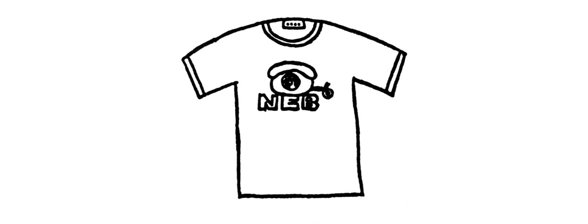

:::note[META]
`desc`: “世间万物，皆匆匆而过。无人能够将其挽留。我们，便是如此活着。”1970 年八月，返乡来到海边小镇。身为大学生的 “我”，在常去的酒吧与本地友人 “鼠” 彻夜长谈，邂逅一位少女，最终迎来夏日的落幕。这部作品敏锐捕捉行将消逝的青春余晖，斩获群像新人奖，既是村上春树的出道之作，亦是其「初期三部曲」的开篇首作。
:::

### 1
「完璧な文章などといったものは存在しない。完璧な絶望が存在しないようにね。」

“不存在十全十美的文章，如同不存在彻头彻尾的绝望。”

僕が大学生のころ偶然に知り合ったある作家は僕に向ってそう言った。僕がその本当の意味を理解できたのはずっと後のことだったが、少くともそれをある種の慰めとしてとることも可能であった。完璧な文章なんて存在しない、と。

这是大学时代偶然结识的一位作家对我说的话，但我对其含义的真正理解则是在很久很久以后——倒是至少能给我以某种安慰——的确，所谓十全十美的文章是不存在的。

しかし、それでもやはり何かを書くという段になると、いつも絶望的な気分に襲われることになった。僕に書くことのできる領域はあまりにも限られたものだったからだ。例えば象について何かが書けたとしても、象使いについては何も書けないかもしれない。そういうことだ。

尽管如此，每当我提笔写东西的时候，还是经常陷入绝望的情绪之中。因为我所能够写的范围实在过于狭小，譬如，我或许可以就大象本身写一点什么，但对象的驯化却不知从何写起。

８年間、僕はそうしたジレンマを抱き続けた。──８年間。長い歳月だ。

八年时间里，我总是怀有这样一种焦虑和苦闷——八年，八年之久。

もちろん、あらゆるものから何かを学び取ろうとする姿勢を持ち続ける限り、年老いることはそれほどの苦痛ではない。これは一般論だ。

当然，只要我始终保持事事留心的好学态度，即使衰老也算不得什么痛苦。这是就一般情况而言。

20歳を少し過ぎたばかりの頃からずっと、僕はそういった生き方を取ろうと努めてきた。おかげで他人から何度となく手痛い打撃を受け、欺かれ、誤解され、また同時に多くの不思議な体験もした。様々な人間がやってきて僕に語りかけ、まるで橋をわたるように音を立てて僕の上を通り過ぎ、そして二度と戻ってはこなかった。僕はその間じっと口を閉ざし、何も語らなかった。そんな風にして僕は20代最後の年を迎えた。

二十岁刚过，我就一直尽可能采取这样的生活态度，因此不知多少次被人重创，遭人欺骗，给人误解，同时也经历了许多莫可言喻的体验。各种各样的人赶来向我倾诉，然后浑如过桥一般带着声响从我身上走过，再也不曾返回。这种时候，我只是默默地缄口不语，绝对不语。如此迎来了我“二十年代”的最后一年。

今、僕は語ろうと思う。

而现在，我准备一吐为快。

もちろん問題は何ひとつ解決してはいないし、語り終えた時点でもあるいは事態は全く同じということになるかもしれない。結局のところ、文章を書くことは自己療養の手段ではなく、自己療養へのささやかな試みにしか過ぎないからだ。

诚然，难题一个也未得到解决，并且在我倾吐完之后事态怕也依然如故。说到底，写文章并非自我诊治的手段，充其量不过是自我疗养的一种小小的尝试。

しかし、正直に語ることはひどくむずかしい。僕が正直になろうとすればするほど、正確な言葉は闇の奥深くへと沈みこんでいく。

问题是，直言不讳是件极为困难的事。甚至越是想直言不讳，直率的言语越是遁入黑暗的深处。

弁解するつもりはない。少くともここに語られていることは現在の僕におけるベストだ。つけ加えることは何もない。それでも僕はこんな風にも考えている。うまくいけばずっと先に、何年か何十年か先に、救済された自分を発見することができるかもしれない、と。そしてその時、象は平原に還り僕はより美しい言葉で世界を語り始めるだろう。

我无意自我辩解。至少这里表述的是现在我所能表述的一切。别无任何补充。但我还是这样想：如若进展顺利，或许在几年或十几年之后可以发现解脱了的自己。到那时，大象将会重返平原，而我将用更为美妙的语言表述这个世界。

☆

僕は文章についての多くをデレク・ハートフィールド[^1]に学んだ。殆んど全部、というべきかもしれない。不幸なことにハートフィールド自身は全ての意味で不毛な作家であった。読めばわかる。文章は読み辛く、ストーリーは出鱈目であり、テーマは稚拙だった。しかしそれにもかかわらず、彼は文章を武器として闘うことができる数少ない非凡な作家の一人でもあった。ヘミングウェイ、フィツジェラルド、そういった彼の同時代人の作家に伍しても、ハートフィールドのその戦闘的な姿勢は決して劣るものではないだろう、と僕は思う。ただ残念なことに彼ハートフィールドには最後まで自分の闘う相手の姿を明確に捉えることはできなかった。結局のところ、不毛であるということはそういったものなのだ。

文章的写法，我大多——或者应该说几乎全部——是从德里克 · 哈特费尔德那里学得的。不幸的是，哈特费尔德本人在所有的意义上却是个无可救药的作家。这点一读他的作品即可了然。行文诘屈聱牙，情节颠三倒四，立意浮浅稚拙。然而他是少数几个能以文章为武器进行战斗的非凡作家之一。纵使同海明威、菲茨杰拉德等与他同时代的作家相比，我想其战斗姿态恐怕也毫不逊色。遗憾的是，这个哈特费尔德直到最后也未能认清敌手的面目，这也正是他的所谓无可救药之处。

８年と２ヵ月、彼はその不毛な闘いを続けそして死んだ。１９３８年６月のある晴れた日曜日の朝、右手にヒットラーの肖像画を抱え、左手に傘をさしたままエンパイア・ステート・ビル[^2]の屋上から飛び下りたのだ。彼が生きていたことと同様、死んだこともたいした話題にはならなかった。

他将这种无可救药的战斗锲而不舍地进行了八年零两个月，然后死了。一九三八年六月一个晴朗的周日早晨，他右臂抱着希特勒画像，左手拿伞，从纽约帝国大厦的天台上纵身跳下。同他生前一样，死时也没引起怎样的反响。

僕が絶版になったままのハートフィールドの最初の一冊を偶然手に入れたのは股の間にひどい皮膚病を抱えていた中学三年生の夏休みであった。僕にその本をくれた叔父は三年後に腸の癌を患い、体中をずたずたに切り裂かれ、体の入口と出口にプラスチックのパイプを詰め込まれたまま苦しみ抜いて死んだ。最後に会った時、彼はまるで狡猾な猿のようにひどく赤茶けて縮んでいた。

我偶然搞到的第一本哈特费尔德已经绝版的书，还是在初中三年级——胯间生着奇痒难忍的皮肤病的那年暑假。送给我这本书的叔父，三年后身患肠癌，死的时候被切割得体无完肤，身体的入口和出口插着塑料管，痛苦不堪。最后见面那次，他全身青黑透红，萎缩成一团，活像狡黠的猴。

☆

僕には全部で三人の叔父がいたが、一人は上海の郊外で死んだ。終戦の二日後に自分の埋めた地雷を踏んだのだ。ただ一人生き残った三人目の叔父は手品師になって全国の温泉地を巡っている。

我共有三个叔父，一个死于上海郊区——战败第三天踩响了自己埋下的地雷，活下来的第三个叔父成了魔术师，在全国各个有温泉的地方巡回表演。

☆

ハートフィールドが良い文章についてこんな風に書いている。

关于好的文章，哈特费尔德这样写道：

「文章をかくという作業は、とりもなおさず自分と自分をとりまく事物との距離を確認することである。必要なものは感性ではなく、ものさしだ。」（「気分が良くて何が悪い？」１９３６年）

“从事写文章这一作业，首先要确认自己同周遭事物之间的距离，所需要的不是感性，而是尺度。”（《心情愉悦有何不好》，一九三六年）

僕がものさしを片手に恐る恐るまわりを眺め始めたのは確かケネディー大統領の死んだ年で、それからもう15 年にもなる。15 年かけて僕は実にいろいろなものを放り出してきた。まるでエンジンの故障した飛行機が重量を減らすために荷物を放り出し、座席を放り出し、そして最後にはあわれなスチュワードを放り出すように、15 年の間僕はありとあらゆるものを放り出し、そのかわりに殆んど何も身につけなかった。

于是我一手拿尺，开始惶惶不安地张望周围的世界。那大概是肯尼迪总统惨死的那年，距今已有十五年之久。这十五年里我的确扔掉了很多很多东西，就像发动机出了故障的飞机为减轻重量而甩掉货物、甩掉座椅，最后连可怜的男乘务员也甩掉一样。十五年里我舍弃了一切，身上几乎一无所有。

それが果たして正しかったのかどうか、僕には確信は持てない。楽になったことは確かだとしても、年老いて死を迎えようとした時に一体僕に何が残っているのだろうと考えるとひどく怖い。僕を焼いた後には骨ひとつ残りはすまい。

至于这样做是否正确，我无从断定。心情变得痛快这点倒是确确实实。然而每当我想到临终时身上将剩何物，我便感到格外恐惧。一旦付诸一炬，想必连一截残骨也断难剩下。

「暗い心を持つものは暗い夢しか見ない。もっと暗い心は夢さえも見ない。」死んだ祖母はいつもそう言っていた。

死去的祖母常说：“心情抑郁的人只能做抑郁的梦，要是更加抑郁，连梦都不做的。”

祖母が死んだ夜、僕がまず最初にしたことは、腕を伸ばして彼女の瞼をそっと閉じてやることだった。僕が瞼を下ろすと同時に、彼女が79年間抱き続けた夢はまるで舗道に落ちた夏の通り雨のように静かに消え去り、後には何ひとつ残らなかった。

祖母辞世的夜晚，我做的第一件事，是伸手把她的眼睑轻轻合拢。与此同时，她七十九年来所怀有的梦，便如落在柏油路上的夏日阵雨一样悄然逝去，了无遗痕。

 ☆

もう一度文章について書く。これで最後だ。

我再说一次文章，最后一次。

僕にとって文章を書くのはひどく苦痛な作業である。一ヵ月かけて一行も書けないこともあれば、三日三晩書き続けた挙句それがみんな見当違いといったこともある。

对我来说，写文章是极其痛楚的事情。有时一整月都写不出一行，有时又挥笔连写三天三夜，到头来却又全都写得驴唇不对马嘴。

それにもかかわらず、文章を書くことは楽しい作業でもある。生きることの困難さに比べ、それに意味をつけるのはあまりにも簡単だからだ。

尽管这样，写文章同时又是一种乐趣。因为较之生之艰难，在这上面寻求意味的确太轻而易举了。

十代の頃だろうか、僕はその事実に気がついて一週間ばかり口もきけないほど驚いたことがある。少し気を利かしさえすれば世界は僕の意のままになり、あらゆる価値は転換し、時は流れを変える……そんな気がした。

意识到这一点时我大概还不到二十岁，当时竟惊愕得一星期都说不出话来。我觉得只要耍点小聪明，整个世界都将被自己玩于股掌之上，所有的价值观将全然为之一变，时光可以倒流……

それが落とし穴だと気づいたのは、不幸なことにずっと後だった。僕はノートのまん中に１本の線を引き、左側にその間に得たものを書き出し、右側に失ったものを書いた。失ったもの、踏みにじったもの、とっくに見捨ててしまったもの、犠牲にしたもの、裏切ったもの……僕はそれらを最後まで書き通すことはできなかった。

等我意识到这是一种错觉，不幸已是很久以后的事了。我在记事簿的正中画一条直线，左侧记载所得，右侧则写所失——失却的、毁掉的、早已抛弃的、付诸牺牲的、辜负的……但我没有坚持写到最后。

僕たちが認識しようと努めるものと、実際に認識するものの間には深い淵が横たわっている。どんな長いものさしをもってしてもその深さを測りきることはできない。僕がここに書きしめすことができるのは、ただのリストだ。小説でも文学でもなければ、芸術でもない。まん中に線が１本だけ引かれた一冊のただのノートだ。教訓なら少しはあるかもしれない。

我们要力图认识的对象和实际认识的对象之间，总是横陈着一道深渊，无论用怎样长的尺都无法完全测量其深度。我这里所能够书写出来的，不过是一览表而已。既非小说、文学，又不是艺术，只是正中画有一条直线的一本记事簿。若说教训，倒也许多少有一点。

もしあなたが芸術や文学を求めているのならギリシャ人の書いたものを読めばいい。真の芸術が生み出されるためには奴隷制度が必要不可欠だからだ。古代ギリシャ人がそうであったように、奴隷が畑を<ruby>耕<rt>たがや</ruby>し、食事を作り、船を漕ぎ、そしてその間に市民は地中海の太陽の下で詩作に耽り、数学に取り組む。芸術とはそういったものだ。

如果你志在追求艺术追求文学，那么去读一读希腊人写的东西好了。因为要诞生真正的艺术，奴隶制度是必不可少的。而古希腊人便是这样：奴隶们耕种、烧饭、划船，而市民们则在地中海的阳光下陶醉于吟诗作赋，埋头于数学解析。所谓艺术便是这么一种玩意儿。

夜中の３時に寝静まった台所の冷蔵庫を漁るような人間には、それだけの文章しか書くことはできない。

至于半夜三点在悄无声息的厨房寻找电冰箱里的食品的人，只能写出这等模样的文章。

そして、それが僕だ。

而那就是我。
### 2
この話は1970年の8月8日に始まり、18日後、つまり同じ年の8月26日に終わる。

故事从一九七〇年八月八日开始，结束于十八天后，即同年的八月二十六日。
### 3
「金持ちなんて・みんな・糞くらえさ。」

"什么有钱人，统统是王八蛋！"

鼠はカウンターに両手をついたまま僕に向って憂鬱そうにそうどなった。

鼠双手扶着吧台，满心不快似的对我吼道。

あるいは鼠のどなった相手は僕の後にあるコーヒー・ミルなのかもしれなかった。僕と鼠はカウンターに隣りあって腰かけていたのだし、わざわざ僕に向ってどなる必要なんて何もなかったからだ。しかし何れにせよ、大声を出してしまうと鼠はいつものように満足した面持でビールを美味そうに飲んだ。

或许鼠吼的对象是我身后的咖啡豆研磨机也未可知。因为我同他并肩而坐，毫无必要对我特意吼叫。但不管怎样，吼完之后，鼠总是现出一副满足的神情，津津有味地呷着啤酒。  

もっとも、まわりには鼠の大声を気にするものなど誰ひとりいなかった。狭い店は客で溢れんばかりだったし、誰も彼もが同じように大声でどなりあっていたからだ。それはまるで沈没寸前の客船といった光景だった。

当然，任何人也不会计较鼠的粗声大气。店小人多，险些坐到门外去，人人都同样大吼大叫，光景简直同即将沉没的客轮无异。  

「ダニさ。」鼠はそう言っておぞましそうに首を振った。 「奴らになんて何もできやしない。金持ち面をしてる奴らを見るとね、虫酸が走る。」

“寄生虫！”说着，鼠不胜厌恶似的摇了摇头，“那些家伙一无所能，看见财大气粗神气的家伙，我简直想吐！”  

僕は薄いビール・グラスの縁に唇をつけたまま黙って肯いた。鼠はそれっきり口をつぐむと、カウンターに載せた手の細い指をたき火にでもあたるような具合にひっくり返しながら何度も丹念に眺めた。僕はあきらめて天井を見上げた。10本の指を順番どおりにきちんと点検してしまわないうちは次の話は始まらない。いつものことだ。

我把嘴唇贴在薄薄的酒杯边上，默默点头。鼠也就此打住，不再言语，烤火似的翻动着搁在桌面上的纤细的手指，反复审视良久。我无可奈何地仰望天花板。这是他的老毛病：不把十根指头依序逐一清点完毕，便不可能再开口。  

一夏中かけて、僕と鼠はまるで何かに取り憑かれたように25メートル・プール一杯分ばかりのビールを飲み干し、「ジェイズ・バー」の床いっぱいに５センチの厚さにピーナツの殻をまきちらした。そしてそれは、そうでもしなければ生き残れないくらい退屈な夏であった。

整个夏天，我和鼠走火入魔一般喝光了足以灌满二十五米长的游泳池的巨量啤酒，丢下的花生壳足以按五厘米的厚度铺满杰氏酒吧的所有地板。否则简直熬不过这个无聊的夏天。

「ジェイズ・バー」のカウンターには煙草の脂で変色した一枚の版画がかかっていて、どうしようもなく退屈した時など僕は何時間も飽きもせずにその絵を眺めつづけた。まるでロールシャハ・テストにでも使われそうなその図柄は、僕には向いあって座った二匹の緑色の猿が空気の抜けかけた二つのテニス・ボールを投げあっているように見えた。

杰氏酒吧的柜台上方，挂着一幅被烟熏得变了色的版画。实在百无聊赖的时候，我便不厌其烦地盯着那幅画，一盯就是几个钟头。那俨然用来进行罗夏测验的图案，活像两只同我对坐的绿毛猴在相互传递两个漏完了气的网球。  

僕がバーテンのジェイにそう言うと、彼はしばらくじっとそれを眺めてから、そう言えばそうだね、と気のなさそうに言った。

我对调酒师杰这么一说，他注视了好一会儿，不无勉强地应道：那么说倒也是的。   

「何を象徴してるのかな？」僕はそう訊ねてみた。

“可象征什么呢？”我问。 

「左の猿があんたで、右のがあたしだね。あたしがビール瓶を投げると、あんたが代金を投げてよこす。」

“左边的猴子是你，右边的是我。我扔啤酒瓶，你扔钱过来。”   

僕は感心してビールを飲んだ。

我心悦诚服，埋头喝啤酒。   

「虫酸が走る。」 　鼠はひととおり指を眺め終えるとそう繰り返した。

“简直想吐！”鼠终于清点完手指，重复道。   

鼠が金持ちの悪口を言うのは今に始まったことではないし、また実際にひどく憎んでもいた。鼠の家にしたところで相当な金持ちだったのだけれど、僕がそれを指摘する度に鼠は決まって、「俺のせいじゃないさ。」と言った。時折（大抵はビールを飲み過ぎたような場合なのだが）、「いや、お前のせいさ。」と僕は言って、そして言ってしまった後で必ず嫌な気分になった。鼠の言い分にも一理はあったからだ。

鼠说有钱人的坏话，并非今天心血来潮，实际上他对有钱人也是深恶痛绝。其实鼠的家也相当有钱——每当我指出这点，鼠必定说不是他的责任。有时（一般都是喝过量的时候）我补上一句“不，是你的责任”，可话一出口又每每感到后悔。因为鼠说的毕竟也有道理。   

「何故金持ちが嫌いだと思う？」 　その夜、鼠はそう続けた。そこまで話が進んだのは初めてだった。

“你猜我为什么厌恶有钱人？”这天夜里鼠仍不收口。话说到这个地步还是头一次。   

わからない、といった風に僕は首を振った。

我摇摇脑袋，表示我不知道。   

「はっきり言ってね、金持ちなんて何も考えないからさ。懐中電灯とものさしが無きゃ自分の尻も搔けやしない。」

“说白啦，因为有钱人什么也不想。要是没有手电筒和尺子，连自己的屁股都搔不成。”   

はっきり言って、というのが鼠の口癖だった。

“说白啦”是鼠的口头禅。   

「そう？」

“真那样？”   

「うん。奴らは大事なことは何も考えない。考えてるフリをしてるだけさ。……何故だと思う？」

“当然。那些家伙关键的事情什么也不想，不过装出想的样子罢了……你说是为什么？”  

「さあね？」

“这——”   

「必要がないからさ。もちろん金持ちになるには少しばかり頭が要るけどね、金持ちであり続けるためには何も要らない。人工衛星にガソリンが要らないのと同じさ。グルグルと同じところを回ってりゃいいんだよ。でもね、俺はそうじゃないし、あんただって違う。生きるためには考え続けなくちゃならない。明日の天気のことから、風呂の栓のサイズまでね。そうだろ？」

“没有必要嘛！当然啰，要当上有钱人是要多少动动脑筋，但只要还是有钱人，就什么也不需要想，就像人造卫星不需要汽油，只消绕着一个地方团团转就行。可我不是那样，你也不同。要活着，就必须想个不停，从明天的天气想到浴盆塞子的尺寸。对吧？”   

「ああ。」と僕は言った。

“啊。”   

「そういうことさ。」

“就是这样。”   

鼠はしゃべりたいことだけをしゃべってしまうと、ポケットからティッシュ・ペーパーを取り出しつまらなそうに音をたてて鼻をかんだ。鼠がいったいどこまで真剣なのか、僕にはうまく<ruby>把<rt>つか</ruby>めなかった。

鼠畅所欲言之后，从衣袋里掏出纸巾，出声地擤了把鼻涕，一副无聊的样子。我真摸不准鼠的话里有多少正经成分。   

「でも結局はみんな死ぬ。」僕は試しにそう言ってみた。

“不过，到头来都是一死。”我试探着说道。   

「そりゃそうさ。みんないつかは死ぬ。でもね、それまでに50年は生きなきゃならんし、いろんなことを考えながら50年生きるのは、はっきり言って何も考えずに５千年生きるよりずっと疲れる。そうだろ？」

“那自然。人人早晚得死。可是死之前有五十年要活。这个那个地边想边活，说白啦，要比什么也不想地活五千年还辛苦得多。是吧？” 

そのとおりだった。

诚如所言。 
### 4
僕が鼠と初めて出会ったのは３年前の春のことだった。それは僕たちが大学に入った年で、２人ともずいぶん酔払っていた。だからいったいどんな事情で僕たちが朝の４時過ぎに鼠の黒塗りのフィアット６００に乗り合わせるような羽目になったのか、まるで記憶がない。共通の友人でもいたのだろう。

我同鼠初次相见，是三年前的春天。那年我们刚进大学，两人都醉到了相当得了的程度。清晨四点多，我们一起坐进鼠那辆涂着黑漆的菲亚特600型小汽车，至于由于什么碰到一起的，我实在记不得了。大概有一位我俩共同的朋友吧。   

とにかく僕たちは<ruby>泥酔<rt>でいすい</ruby>して、おまけに速度計の針は80キロを指していた。そんなわけで、僕たちが景気よく公園の垣根を突き破り、つつじ[^3]の植込みを踏み倒し、石柱に思い切り車をぶっつけた上に怪我ひとつ無かったというのは、まさに<ruby>僥倖<rt>ぎょうこう</ruby>というより他なかった。

总之我们喝得烂醉，时速仪的指针指在八十公里上。我们锐不可当地冲破公园的围墙，压倒盆栽杜鹃，气势汹汹地朝着石柱一头撞去。而我们居然丝毫无损，实在只能说是万幸。   

僕がショックから醒め、壊れたドアを蹴とばして外に出ると、フィアットのボンネット[^4]・カバーは10メートルばかり先の猿の檻の前にまで吹き飛び、車の鼻先はちょうど石柱の形にへこんで、突然眠りから叩き起こされた猿たちはひどく腹を立てていた。

我震醒过来。我踢开撞毁的车门，跳到外面一看，只见菲亚特的引擎盖一直飞到十米开外的猴栏跟前，车头前端凹得同石柱一般形状，突然从睡梦中惊醒的猴们怒不可遏。  

鼠はハンドルに両手を置いたまま体を折るようにかがみこんでいたが、怪我をしたというわけではなく、ダッシュボードの上に一時間前に食べたピザ・パイを吐いているだけの話だった。僕は車の屋根によじのぼり、<ruby>天窓<rt>サン・ルーフ</ruby>から運転席をのぞきこんだ。

鼠双手扶着方向盘，身体弯成两折，但并未受伤，只是把一小时前吃的比萨吐到了仪表盘上。我爬上车顶，从天窗窥视驾驶席：   

「大丈夫かい？」

“不要紧？”   

「ああ、でも少し飲みすぎたな。吐くなんてね。」

“嗯。有点过量，竟然吐了。”   

「出られるかい？」

“能出来？”   

「引っぱり上げてくれ。」

“拉我一把。”   

鼠はエンジンを切り、ダッシュボードの上の煙草の箱をポケットにつっこんでから、おもむろに僕の手をつかんで車の屋根によじのぼった。僕たちはフィアットの屋根に並んで腰を下ろしたまま、白み始めた空を見上げ、黙って何本か煙草を吸った。僕は何故かリチャード・バートン[^5]の主演した戦車映画を思い出した。鼠が何を考えていたのかはわからない。

鼠关掉发动机，把仪表盘上的香烟塞进衣袋，这才慢吞吞地抓住我的手，爬上车顶。我们在菲亚特的车顶并肩坐下，仰望开始泛白的天空，不声不响地抽了几支烟。不知为何，我竟想起理查德 · 伯顿主演的坦克电影。至于鼠在想什么，我自然无从知晓。   

「ねえ、俺たちはツイてるよ。」５分ばかり後で鼠はそう言った。「見てみなよ。怪我ひとつない。信じられるかい？」

“喂，咱们可真算好运！”五分钟后鼠开口道，“瞧嘛，浑身完好无损，能信？”   

僕は肯いた。「でも、車はもう駄目だな。」

我点点头：“不过，车算报废了。”   

「気にするなよ。車は買い戻せるが、ツキは金じゃ買えない。」

“别在意。车买得回来，运气可是千金难买。”   

僕は少しあきれて鼠の顔を眺めた。「金持ちなのか？」

我有些意外，看着鼠的脸：“你是阔佬不成？”   

「らしいね。」

“算是吧！”   

「そりゃ良かった。」

“那太好了！”   

鼠はそれには答えなかったが、不満足そうに何度か首を振った。「でも、とにかく俺たちはツイてる。」

鼠没有应声，不大满足似的摇了摇头。“总之我们交了好运。”   

「そうだな。」

“是啊。”   

鼠はテニス・シューズの踵で煙草をもみ消し、吸殻を猿の檻に向って指ではじいた。

鼠用网球鞋跟碾灭烟头，然后用手指把烟蒂朝猴栏那边弹去。   

「ねえ、俺たち二人でチームを組まないか？　きっと何もかも上手くいくぜ。」

“我说，咱俩合伙如何？保准无往不胜！”   

「手始めに何をする？」

“先干什么？”   

「ビールを飲もう。」

“喝啤酒去！”   

僕たちは近くの自動販売機で缶ビールを半ダースばかり買って海まで歩き、砂浜に寝ころんでそれを全部飲んでしまうと海を眺めた。素晴しく良い天気だった。

我们从附近的自动售货机里买了六听罐装啤酒，走到海边，歪倒在沙滩上一喝而光，随即眼望大海。天气好得无可挑剔。   

「俺のことは鼠って呼んでくれ。」と彼が言った。

“管我叫鼠好了。”他说。   

「何故そんな名前がついたんだ？」

“干吗叫这么个名字？”   

「忘れたね。随分昔のことさ。初めのうちはそう呼ばれると嫌な気もしたがね、今じゃなんともない。何にだって慣れちまうもんさ。」

“记不得了，很久以前的事。起初给人这么叫，心里是不痛快，现在无所谓。什么都可以习惯嘛。”   

僕たちはビールの空缶を全部海に向って放り投げてしまうと、堤防にもたれ頭の上からダッフル・コート[^6]をかぶって一時間ばかり眠った。目が覚めた時、一種異様なばかりの生命力が僕の体中にみなぎっていた。不思議な気分だった。

我俩将空啤酒罐一股脑儿扔到海里，背靠防波堤，把粗呢上衣蒙在脸上，睡了差不多一个小时。睁眼醒来，觉得一股异样的生命力充满全身，甚是不可思议。   

「１００キロだって走れる。」と僕は鼠に言った。

“能跑一百公里！”我对鼠说。   

「俺もさ。」と鼠は言った。

“我也能！”   

しかし実際に僕たちがしなければならなかったのは、公園の補修費を金利つきの三年割賦で市役所に払いこむことだった。

然而当务之急是：将公园维修费分三年连本带利交到市政府去。 
### 5
鼠はおそろしく本を読まない。彼がスポーツ新聞とダイレクト・メール以外の活字を読んでいるところにお目にかかったことはない。僕が時折時間潰しに読んでいる本を、彼はいつもまるで蠅が蠅叩きを眺めるように物珍しそうにのぞきこんだ。

鼠惊人地不看书。除了体育报纸和直邮广告，我还没有发现他看过其他铅字。我有时为了消磨时间看书，他便像苍蝇盯视苍蝇拍似的盯着书问：

「何故本なんて読む？」

“干嘛看什么书啊？”

「何故ビールなんて飲む？」

“干嘛喝什么啤酒啊？”

僕は<ruby>酢漬<rt>すづ</ruby>けの<ruby>鰺<rt>あじ</ruby>[^7]と野菜サラダを一口ずつ交互に食べながら、鼠の方も見ずにそう訊き返した。鼠はそれについてずっと考え込んでいたが、５分ばかり後で口を開いた。

我吃一口醋腌竹荚鱼，吃一口蔬菜沙拉，看都没看鼠一眼地反问。鼠沉思了五分钟之久，开口道：

「ビールの良いところはね、全部小便になって出ちまうことだね。ワン・アウト一塁ダブル・プレー[^8]、何も残りゃしない。」

“啤酒的好处，在于它能够全部化为小便排泄出去。一出局一垒双杀，什么也没剩下。”

鼠はそう言って、僕が食べつづけるのを眺めた。

说罢，鼠看着我，我兀自吃喝不休。

「何故本ばかり読む？」

“干嘛老看书？”

僕は鰺の最後の一切をビールと一緒に飲みこんでから皿を片付け、傍に置いた読みかけの「感情教育」を手に取ってパラパラとページを繰った。

我把最后剩下的竹荚鱼连同啤酒一起一口送进肚里，收拾一下碟盘，拿起旁边刚读个开头的《情感教育》，啪啦啪啦翻了几页：

「フローベルがもう死んじまった人間だからさ。」

“因为福楼拜早已经死掉了。”

「生きてる作家の本は読まない？」

“活着的作家的书就不看？”

「生きてる作家になんてなんの価値もないよ。」

“活着的作家一钱不值。”

「何故？」

“何以见得？”

「死んだ人間に対しては大抵のことが許せそうな気がするんだな。」 　僕はカウンターの中にあるポータブル・テレビの「ルート66」の再放送を眺めながらそう答えた。

“对于死去的人，我觉得一般都可原谅。”我一边回答，一边看着吧台里手提式电视机的重播节目“66号公路”。

鼠はまたしばらく考え込んだ。

鼠又思忖多时。

「ねえ、生身の人間はどう？　大抵のことは許せない？」

“我问你，活生生的人怎么了？一般都不可原谅？”

「どうかな？　そんな風に真剣に考えたことはないね。でもそういった切羽詰まった状況に追い込まれたら、そうなるかもしれない。許せなくなるかもしれない。」

“怎么说呢，我还真没认真想过。不过，一旦被逼得走投无路，或许是那样的。或许是不可原谅。”

ジェイがやってきて、僕たちの前に新しいビールを２本置いていった。

杰走过来，把两瓶新啤酒放在我们面前。

「許せなかったらどうする？」

“不原谅又怎么着？”

「枕でも抱いて寝ちまうよ。」

“抱枕头睡大觉。”

鼠は困ったように首を振った。

鼠困惑地摇摇头。

「不思議だね。俺にはよくわからない。」 　鼠はそう言った。

“奇谈怪论，我可是理解不了。”鼠说。

僕は鼠のグラスにビールを注いでやったが、彼はまだ体を縮めたまましばらく考え込んでいた。

我把啤酒倒进鼠的杯子。鼠再次缩起身子陷入沉思。

「この前、最後に本を読んだのは去年の夏だったよ。」鼠がそう言った。「題も作者も忘れた。何故読んだのかも忘れた。とにかくね、女が書いた小説さ。主人公は有名なファッション・デザイナーで30歳ばかりの女なんだが、なにしろ自分が不治の病に冒されてると信じこんでるわけさ。」

“我读最后一本书是在去年夏天。”鼠说，“书名忘了作者忘了，为什么读也忘了，反正是个女人写的小说。主人公是有名的女时装设计师，三十来岁，一门心思以为自己患了不治之症。”

「どんな病気？」

“什么病？”

「忘れたね。癌かなにかさ。それ以外に不治の病があるかい？　……それでね、彼女は海岸の避暑地にやってきて最初から最後までオナニーするんだ。風呂場だとか、林の中だとか、ベッドの上だとか、海の中だとか実にいろんな場所でさ。」

“忘了，癌什么的。此外还能有不治之症？……这么着，她来到海滨避暑，从来到去一直自慰个不停。在浴室，在树林，在床上，在海里，简直不分场所。”

「海の中？」

“海里？”

「うん。……信じられるかい？　何故そんなことまで小説に書く？　他に書くべきことは幾らでもあるだろう？」

“是啊。……你能信？何苦连这个都写进小说，该写的题材难道不多的是？”

「さあね？」

“怕也是吧。”

「俺は御免だね、そんな小説は。反吐が出る。」

“我可不欣赏。那种小说，简直倒胃口。”

僕は肯いた。

我点点头。

「俺ならもっと全然違った小説を書くね。」

“要是我，可就来个截然不同。”

「例えば？」

“比如说？”

鼠はビール・グラスの縁を指先でいじりまわしながら考えた。

鼠用指尖来回拨弄着啤酒杯，思索起来。

「こんなのはどうだい？　俺の乗っていた船が太平洋のまん中で沈没するのさ。そこで俺は浮輪につかまって星を見ながら一人っきりで夜の海を漂っている。静かな、綺麗な夜さ。するとね、向うの方からこれも浮輪につかまった若い女が泳いでくるんだな。」

“你看这样如何：我乘坐的船在太平洋正中沉没了，于是我抓住救生圈，一个人看着星星在夜海漂游。静静的、美丽的夜。正漂之间，发现对面也有一个年轻女子抓着救生圈漂来。”

「いい女かい？」

“女的可漂亮？”

「そりゃね。」

“那是的。”

僕はビールを一口飲んで頭を振った。

我呷了口啤酒，摇头道：

「なんだか馬鹿げてるよ。」

“像有点滑稽。”

「まあ聞けよ。それから俺たち二人は隣り合って海に浮かんだまま世間話をするのさ。来し方行く末、趣味だとか、寝た女の数だとか、テレビの番組についてだとか、昨日見た夢だとか、そういった話をね。そして二人でビールを飲むんだ。」

“老实听着好了。接着，我们两人就挨在一起，边漂边聊。聊来时的途径，聊以后的去处，还有爱好啦，睡过的女孩数量啦，电视节目啦，昨天做的梦啦，等等等等。并且一块儿喝啤酒。”

「ねえ、ちょっと待ってくれ。一体何処にビールがあるんだ？」

“慢着，哪里能有啤酒？”

鼠は少し考えた。

鼠略一沉吟：

「浮いてるのさ。船の食堂から缶ビールが流れ出したんだな。オイル・サーディンの缶と一緒にね。これでいいかい？」

“漂浮着的，从轮船食堂里漂来的罐装啤酒，和油炸沙丁鱼罐头一起。这回可以了吧？”

「うん。」

“嗯。”

「そのうちに夜が明けてきた。〈これからどうするの？〉って女が俺に訊ねる。〈私は島がありそうな方に泳いでみるわ〉って女は言うんだ。でも島は無いかもしれない。それよりここに浮かんでビールでも飲んでれば、きっと飛行機が救助に来てくれるさ、って俺は言う。でもね、女は一人で泳いでいっちまうんだ。」 　鼠はそこで一息ついてビールを飲んだ。 「女は二日と二晩泳ぎつづけてどこかの島にたどりつく。俺は俺で二日酔いのまま飛行機に救助される。それでね、何年か後に二人は山の手の小さなバーで偶然めぐりあうんだな。」

“喝着喝着，不一会儿，天亮了。女的问我往下怎么办，说她往估计有海岛的方向游。我说估计没有岛屿，还不如就在这儿喝啤酒，飞机肯定来搭救的。可是女的一个人游走了。”鼠停了一下，喝口啤酒。“女的连续游了两天两夜，终于爬上一个孤岛；我么，醉了两天后给飞机救出。这么着，好多年后两人竟在山脚下一家小酒吧里不期而遇。”

「それでまた二人でビールを飲むんだろ？」

“又一块儿喝啤酒了？”

「悲しくないか？」

“不觉得感伤？”

「さあね。」と僕は言った。

“或许。”我说。
### 6
鼠の小説には優れた点が二つある。まずセックス・シーンの無いことと、それから一人も人が死なないことだ。放って置いても人は死ぬし、女と寝る。そういうものだ。

鼠的小说有两大优点。一是没有性描写，二是一个人也没死。本来人是要死的，也要同女的睡觉，十有八九。

☆

「私が間違っていたと思う？」女がそう訊ねた。

“莫非是我错了？”女的问。

鼠はビールを一口飲み、ゆっくりと首を振った。「はっきり言ってね、みんな間違ってるのさ。」

鼠喝了口啤酒，缓缓摇头道：“说白啦，大家都错了。”

「何故そう思うの？」

“为什么那样认为？”

「うーん。」鼠はそう唸ってから上唇を舌でなめた。答えなど無かった。

“噢——”鼠只此一声，用舌头舔了舔上唇，并未作答。

「私は腕がもぎとれるくらい一生懸命に島まで泳いだのよ。とても苦しくて死ぬかと思ったわ。それでね、何度も何度もこんな風に考えたわ。私が間違っててあなたが正しいのかもしれないってね。私がこんなに苦しんでいるのに、何故あなたは何もせずに海の上にじっと浮かんでいるんだろうってね。」

“我拼命往岛上游，胳膊都差点儿累断了，难受得真以为活不成了。所以我好几次这样寻思：说不定是我错你对。我如此拼死拼活地挣扎，而你却干脆一动不动地只是在海上漂浮。这是为什么呢？”

女はそう言うと軽く笑って、しばらく憂鬱そうに目の縁を押さえた。鼠はモジモジしながらあてもなくポケットを探った。三年振りに無性に煙草が吸いたかった。

女的说到这里，淡然一笑，转而不无忧伤地揉了一会儿眼眶。鼠忸忸怩怩在衣袋里胡乱摸来摸去。三年没吸烟了，馋得不行。

「僕が死ねばいいと思った？」

“你是想我死了才对？”

「少しね。」

“有点儿。”

「本当に少し？」

“真的有点儿？”

「……忘れたわ。」

“……忘了。”

二人はしばらく黙った。鼠はまた何かをしゃべらなければならないような気がした。

两人沉默片刻。鼠觉得总该谈点什么才好。

「ねえ、人間は生まれつき不公平に作られてる。」

“喂，人生下来就是不公平的。”

「誰の言葉？」

“谁的话？”

「ジョン・Ｆ・ケネディー。」

“约翰 · F · 肯尼迪。”
### 7
小さい頃、僕はひどく無口な少年だった。両親は心配して、僕を知り合いの精神科医の家に連れていった。

小的时候，我是个十分沉默寡言的少年。父母很担心，把我领到一个相识的精神科医生家里。

医者の家は海の見える高台にあり、僕が陽あたりの良い応接室のソファーに座ると、品の良い中年の婦人が冷たいオレンジ・ジュースと二個のドーナツを出してくれた。僕は膝に砂糖をこぼさぬように注意してドーナツを半分食べ、オレンジ・ジュースを飲み干した。

医生的家位于看得见大海的高坡地段。刚在阳光朗朗的客厅沙发上坐下，一位举止不俗的中年妇女便端来冰镇橙汁和两个甜甜圈。我小心地——以免砂糖粒落在膝部——吃了半个甜甜圈，喝光了橙汁。

「もっと飲むかい？」と医者が訊ね、

“再喝点儿？”医生问。

僕は首を振った。僕たちは二人きりで向い合っていた。正面の壁からはモーツァルトの肖像画が臆病な猫みたいにうらめし気に僕をにらんでいた。

我摇摇头。房间里只剩我们两人面面相觑。莫扎特的肖像画从正面墙壁上如同胆怯的猫瞪着我，似乎在怨恨我什么。

「昔ね、あるところにとても人の良い山羊がいたんだ。」

“很早以前，有个地方有一只非常逗人喜爱的山羊。”

素敵な出だしだった。僕は目を閉じて人の良い山羊を想像してみた。

精彩的开头。于是我闭目想象那只逗人喜爱的山羊。

「山羊はいつも重い金時計を首から下げて、ふうふう言いながら歩き回ってたんだ。ところがその時計はやたらに重いうえに壊れて動かなかった。そこに友だちの兎がやってきてこう言った。〈ねえ山羊さん、なぜ君は動きもしない時計をいつもぶらさげてるの？　重そうだし、役にもたたないじゃないか〉ってさ。〈そりゃ重いさ〉って山羊が言った。〈でもね、慣れちゃったんだ。時計が重いのにも、動かないのにもね〉。」

“山羊脖子上总是挂着一只沉甸甸的金表，呼哧呼哧地到处走个不停。而那只金表却重得出奇，而且坏了不能走。这时兔子朋友赶来说道：‘喂小羊，干嘛总是挂着那只动都不动一下的表啊？又重，又没用，不是吗？’‘重是重，’山羊说，‘不过早已习惯了，重也好，坏了也好。’”

医者はそう言うと自分のオレンジ・ジュースを飲み、ニコニコしながら僕を見た。僕は黙って話の続きを待った。

说到这里，医生喝了口自己的橙汁，笑眯眯地看着我。我默默地等待下文。

「ある日、山羊さんの誕生日に兎はきれいなリボンのかかった小さな箱をプレゼントした。それはキラキラ輝いて、とても軽く、しかも正確に動く新しい時計だったんだね。山羊さんはとっても喜んでそれを首にかけ、みんなに見せて回ったのさ。」

“一天山羊过生日，兔子送来一个扎着礼品带的漂亮盒子，里面是一只光闪闪的又轻巧走时又准的新表。山羊高兴得什么似的，挂在脖子上到处走给大家看。”

そこで話は突然に終った。

话头突然就此打住。

「君が山羊、僕が兎、時計は君の心さ。」

“你是山羊，我是兔子，表是你的心。”

僕は騙されたような気分のまま、仕方なく肯いた。

我感到被人愚弄了，无可奈何地点点头。

週に一度、日曜日の午後、僕は電車とバスを乗り継いで医者の家に通い、コーヒー・ロールやアップルパイやパンケーキや蜜のついたクロワッサンを食べながら治療を受けた。一年ばかりの間だったが、おかげで僕は歯医者にまで通う羽目になった。

每个周日下午，我都乘电车再换公共汽车去一次这位医生家，一边吃咖啡瑞士卷、苹果派、薄饼和沾蜜糖的羊角包，一边接受治疗。大约花了一年时间，我也因此落得个再找牙医的下场。

文明とは伝達である、と彼は言った。もし何かを表現できないなら、それは存在しないのも同じだ。いいかい、ゼロだ。もし君のお腹が空いていたとするね。君は「お腹が空いています。」と一言しゃべればいい。僕は君にクッキーをあげる。食べていいよ。（僕はクッキーをひとつつまんだ。）君が何も言わないとクッキーは無い。（医者は意地悪そうにクッキーの皿をテーブルの下に隠した。）ゼロだ。わかるね？　君はしゃべりたくない。しかしお腹は空いた。そこで君は言葉を使わずにそれを表現したい。ゼスチュア・ゲームだ。やってごらん。

“文明就是传达。” 他说，“假如不能表达什么，就等于并不存在，懂吗？就是零。比方说你肚子饿了，只消说一句 ‘肚子饿了’ 就解决问题。我就会给你曲奇，你吃下去就是（我抓了一块曲奇）。可要是你什么都不说，那就没有曲奇（医生故意使坏似的把曲奇藏在桌子底下），就是零，明白？你是不愿意开口，但肚子空空。这样，你势必想不用语言而表达出来，也就是借助肢体动作。试试看！”

僕はお腹を押さえて苦しそうな顔をした。医者は笑った。それじゃ消化不良だ。

于是我捂着肚子，做出痛苦的神情。医生笑了，说那是消化不良。

消化不良……。

消化不良……

次に僕たちのやったことはフリー・トーキングだった。

接下去是自由讨论。

「猫について何んでもいいからしゃべってごらん。」

“就猫说点什么，什么都行。”

僕は考える振りをして首をグルグルと回した。

我佯装思索，转圈摇晃着脑袋。

「思いつくことなら何んだっていいさ。」

“想到什么说什么。”

「四つ足の動物です。」

“猫是四脚动物。”

「象だってそうだよ。」

“象也是嘛！”

「ずっと小さい。」

“猫小得多。”

「それから？」

“还有呢？”

「家庭で飼われていて、気が向くと鼠を殺す。」

“猫被人养在家里，高兴时捕老鼠。”

「何を食べる？」

“吃什么？”

「魚。」

“鱼。”

「ソーセージは？」

“香肠呢？”

「ソーセージも。」

“也吃。”

そんな具合だ。

便是如此一唱一和。

医者の言ったことは正しい。文明とは伝達である。表現し、伝達すべきことが失くなった時、文明は終る。パチン……ＯＦＦ。

医生讲得不错，文明就是传达。需要表达、传达之事一旦失去，文明即寿终正寝：咔嚓……OFF。

14歳になった春、信じられないことだが、まるで堰を切ったように僕は突然しゃべり始めた。何をしゃべったのかまるで覚えてはいないが、14年間のブランクを埋め合わせるかのように僕は三ヵ月かけてしゃべりまくり、７月の半ばにしゃべり終えると40度の熱を出して三日間学校を休んだ。熱が引いた後、僕は結局のところ無口でもおしゃべりでもない平凡な少年になっていた。

令人难以置信的是，十四岁那年春天我突然犹如河堤决口说了起来。说什么倒已全不记得，总之我就像要把十四年的空白全部填满似的一连说了三个月。到七月中旬说完时，发起四十度高烧，三天没有上学。烧退之后，我终于成了既不口讷又不饶舌的普通平常的少年。
### 8
喉の乾きのためだろう、僕が目覚めたのは朝の６時前だった。他人の家で目覚めると、いつも別の体に別の魂をむりやり詰めこまれてしまったような感じがする。やっとの思いで狭いベッドから立ちあがり、ドアの横にある簡単な流し台で馬のように水を何杯か続けざまに飲んでからベッドに戻った。

大概因为喉咙干渴，睁开眼睛时还不到早晨六点。在别人家里醒来，我总有一种感觉，就好像给人把别的灵魂硬是塞进别的躯体里似的。我勉强从狭窄的床上爬起身，走到门旁的简易洗涤槽，像马一样一口气喝了好几杯水，又折身上床。

開け放した窓からはほんのわずかに海が見える。小さな波が上ったばかりの太陽をキラキラと反射させ、眼をこらすと何隻かのうす汚れた貨物船がうんざりしたように浮かんでいるのが見えた。暑い一日になりそうだった。周りの家並みはまだ静かに眠り、聴こえるものといえば時折の電車のレールのきしみと、微かなラジオ体操のメロディーといったところだ。

从大敞四开的窗口，可以隐约望见海面：粼粼细波明晃晃地折射着刚刚腾起的太阳光。凝目细看，只见脏兮兮的货轮无精打采地浮在水上。看样子将是个大热天。四周的住户仍在酣然大睡，所能听到的，唯有时而响起的电车轨道的碾轧声，和广播体操的微弱旋律。

僕は裸のままベッドの背にもたれ、煙草に火を点けてから隣りに寝ている女を眺めた。南向きの窓から直接入り込んでくる太陽の光が女の体いっぱいに広がっている。彼女はタオル・カバーを足もとにまで押しやったままぐっすりと眠っていた。時折息づかいが激しくなって、形のよい乳房が上下に揺れる。体はよく日焼けしていたが、時間が経ったために少しくすんだ色に変わり始め、水着の形にくっきりと焼け残った部分は異様に白く、まるで腐敗しかけているように見えた。

我赤身裸体地倚着床背，点燃支烟，打量睡在旁边的女郎。从南窗直接射入的太阳光线，一下子洒满了她的全身。她把毛巾被一直蹬到脚底，睡得很香很死。形状姣好的乳房随着不时变得粗重的呼吸而上下摇颤。身体原本晒得恰到好处，但由于时间的流逝，颜色已开始有点黯淡。而呈泳装形状的、未被晒过的部分则白得异乎寻常，看上去竟像已趋腐烂一般。

煙草を吸い終ってから10分ばかりかけて女の名前を思い出してみようとしたが無駄だった。第一に女の名前を僕が知っていたのかどうかさえ思い出せない。僕はあきらめてあくびをし、もう一度彼女の体を眺めた。年齢は20歳より幾つか若く、どちらかといえば瘦せていた。僕は指をいっぱいに広げ、頭から順番に身長を測ってみた。８回指を重ね、最後に踵のあたりで親指が１本分残った。１５８センチというところだろう。

吸罢烟，我努力回想她的名字，想了十分钟也没想起，甚至连自己是否晓得她的名字都无从记起。我只好作罢，打了个哈欠，重新打量她的身体。年龄离二十还差几岁，总的说来有点偏瘦。我最大限度地张开手指，从头部开始依序测其身长。手指挪腾了八次，最后量到脚后跟时还剩有一拇指宽的距离——大约一米五八。

右の乳房の下に10円硬貨ほどのソースをこぼしたようなしみがあり、下腹部には細い陰毛が洪水の後の小川の水草のように気持よくはえ揃っている。おまけに彼女の左手には指が４本しかなかった。

右乳房的下边有块浅痣，十元硬币大小，如洒上的酱油。小腹处茸茸的耻毛，犹如洪水过后的小河水草一样生得整整齐齐，倒也赏心悦目。此外，她的左手只有四根手指。
### 9
彼女が目覚めるまでに、それからざっと３時間ばかりかかった。そして目覚めてから、物事の順序が幾らか理解できるようになるまでに５分かかった。その間、僕は腕を組み、水平線の上に浮かんだぶ厚い雲が姿を変え、東の方に流れるのをじっと眺めていた。

差不多三个小时过后，她才睁眼醒来。醒来后到多少可以理出事物的头绪，又花了五分钟。这时间里，我兀自抱拢双臂，目不转睛地看着水平线上飘浮的厚墩墩的云絮，看它们变换姿影，向东流转。

しばらく後で僕が振り向いた時、彼女は首までひっぱり上げたタオル・カバーにくるまって、胃の底に残ったウィスキーの匂いと闘いながら無表情に僕を見上げていた。

过了一会儿，当我回转头时，她已把毛巾被拉到脖梗，裹住身体，一边抑制胃底残存的威士忌味儿，一边木然地仰视着我。

「誰……あなたは？」

“谁……你是？”

「覚えてない？」

“不记得了？”

彼女は一度だけ首を振った。

她只摇了一下头。

僕は煙草に火を点け、一本勧めてみたが彼女はそれを無視した。

我给香烟点上火，抽出一支劝她，女孩没有搭理。

「説明して。」

“解释一下！”

「どのあたりから始める？」

“从哪里开始？”

「最初からよ。」

“从头啊！”

いったい何処が最初なのか僕には見当もつかなかったし、どんな風に話せば彼女を納得させられるのかもわからなかった。うまくいくかもしれないし、駄目かもしれない。僕は10秒ばかり考えてから話し始めた。

我弄不清哪里算是头，而且也不晓得怎么说才能使她理解。或许出师顺利，也可能中途败北。我盘算了十秒钟，开口道：

「暑いけれど気持の良い一日だった。僕は午後じゅうプールで泳いで、家に帰って少し昼寝をしてから食事を済ませた。８時過ぎだね。それから車に乗って散歩にでかけたんだ。海岸通りに車を停めてラジオを聴きながら海を眺めてた。いつもそうするんだ。

“热固然热，但一天过得还算开心。我在游泳池整整游了一个下午，回家稍稍睡了个午觉，然后吃了晚饭，那时八点刚过。接着开车外出散步。我把车停在海边公路上，边听收音机边望大海。这是常事。

30分ばかりしてから急に誰かに会いたくなった。海ばかり見てると人に会いたくなるし、人ばかり見てると海を見たくなる。変なもんさ。それで『ジェイズ・バー』に行くことにした。ビールも飲みたかったし、あそこでなら大抵は友だちにもあえるしね。でも奴は居なかった。それで一人で飲むことにしたんだ。一時間ばかりかけてビールを三本飲んだよ。」

“三十分钟过后，突然很想同人见面。看海看久了想见人，见人见多了想看海，真是怪事。这么着，我决定到杰氏酒吧去。一来想喝啤酒，二来那地方一般都能见到朋友。不料那些家伙不在。于是我自斟自饮，一个小时喝了三瓶啤酒。”

僕はそこで言葉を切って煙草の灰を灰皿に落とした。

说到这里，我止住话，把烟灰磕在烟灰缸里。

「ところで『熱いトタン屋根の猫』を読んだことあるかい？」

“对了，你可读过《热铁皮屋顶上的猫》？”

彼女はそれには答えず、まるで浜辺にうちあげられた人魚のようにしっかりとタオルにくるまったまま天井を睨んでいた。

她不予回答，眼望天花板，活像被捞上岸的人鱼似的把毛巾被裹得严严实实。

僕は構わずに話しつづけた。

我只管继续说下去：

「つまりね、一人で酒を飲む度にあの話を思い出すんだ。今に頭の中でカチンと音がして楽になれるんじゃないかってさ。でも現実にはそううまくはいかない。音なんてしたこともないよ。そのうちに待ちくたびれたんで奴のアパートに電話をかけてみたんだ。出て来て一緒に飲まないかって誘うつもりだった。でもね、電話に出たのは女だった。……変な気がしたよ。奴はそういったタイプじゃないんだ。たとえ部屋の中に50人の女を連れこんでグデングデンに酔払ってたとしても自分の電話は必ず自分で取る。わかるかい？

“就是说，每当我一个人喝酒，就想起那段故事，满以为脑袋里马上会咔嚓一声变得豁然开朗。当然实际上没这个可能，从来就没有声音响过。于是一会儿我就等得心烦意乱，往那小子家里打电话，打算拉他出来一块儿喝。结果接电话是个女的……我觉得纳闷儿，那小子本来不是这副德性的。即使往房间里领进五十个女人，哪怕再醉得昏天黑地，自己的电话也肯定自己接。明白？

僕は番号を間違えたフリをして謝って電話を切ったよ。切ってから少し嫌な気分になった。何故だかはわかんないけどね。そしてもう一本ビールを飲んだ。でも気分は晴れなかった。もちろんそんなのは馬鹿げてるとは思うよ。でもね、そういうもんさ。ビールを飲み終るとジェイを呼んで勘定を払い、家に帰ってスポーツ・ニュースで野球の結果を聞いて寝ちまおうと思った。ジェイは僕に顔を洗えと言った。たとえビールを一ケース飲んだって顔さえ洗えば運転できると信じてるんだね。仕方ないから僕は顔を洗うために洗面所まで行った。本当のことを言うと顔なんて洗うつもりはなかったんだ。フリをするだけさ。あの店の洗面所は大抵排水口がつまって水がたまってるからね。あまり中に入りたくない。でも昨夜は珍しく水がたまってなかった。そのかわり床に君が転がってた。」

“我装作打错电话，道歉放下。放下后心里有点怏怏不快，也不知是为什么，又喝了瓶啤酒，但心情还是没有畅快。当然，我觉得自己这样是有些发傻，可就是没奈何。喝罢啤酒，我喊来杰，付了账，准备回家听体育新闻，听完棒球比赛结果就睡觉。杰叫我洗把脸，他相信哪怕喝一箱啤酒，只要洗过脸就能开车。没办法，我就去卫生间洗脸。说实话，我并没有洗脸的打算，做做样子罢了。因为卫生间大多排不出水，积一洼水，懒得进去。出奇的是昨晚居然没有积水，你替积水倒在地板上。”

彼女は溜息をついて目を閉じた。

她叹了口气，闭上眼睛。

「それで？」

“往下呢？”

「君を抱き起こして洗面所から連れ出し、店じゅうの客に君のことを知らないかって訊ねてまわった。でも誰も知らなかった。それからジェイと二人で傷の手当をした。」

“我把你扶起，搀出卫生间，挨个问满屋子的顾客认不认得你，但谁都不认得。随后，我和杰两人给你处理了伤口。”

「傷？」

“伤口？”

「転んだ時にどこかの角で頭を打ったのさ。でもたいした傷じゃなかった。」

“摔倒时脑袋给什么棱角磕了一下。好在伤势不重。”

彼女は肯いてタオルの中から手を出し、指先で額の傷口を軽く押えた。

她点点头，从毛巾被里抽出手，用指尖轻轻按了按伤口。

「それでジェイと相談した。どうすりゃいいだろうってさ。結局僕が家まで車で送ることになった。君のバッグをひっくり返してみると財布とキー・ホルダーと君あての葉書が一枚出てきた。僕は財布の金で勘定を払い、葉書の住所を頼りに君をここまで連れてきて、鍵を開けてベッドに寝かせた。それだけさ。領収書は財布の中に入ってるよ。」

“我就和杰商量如何是好。结果是由我用车送你回家。把你的手袋往下一倒，出来的有钱包、钥匙和寄给你的一张明信片。我用你钱包里的款付了账，依照明信片上的地址把你拉来这里，开门扶你上床躺下。情况就是这样。发票在钱包里。”

彼女は息を深く吸った。

她深深吸了口气。

「何故泊ったの？」

“为什么住下？”

「？」

“？”

「何故私を送り届けた後ですぐに消えてくれなかったの？」

“为什么把我送回之后不马上消失？”

「僕の友だちに急性アルコール中毒で死んだのがいるんだ。ウィスキーをがぶ飲みした後でさよならって別れてから家まで元気に歩いて帰ってね、歯を磨いてパジャマに着がえて寝たのさ。朝になったら冷たくなって死んでたよ。立派な葬式だったな。」

“我有个朋友死于急性酒精中毒。猛猛地喝完威士忌后，道声再见，还很有精神地走回家里，刷完牙，换上睡衣就睡了。可到早上，已经变凉死掉了。葬礼倒满够气派。”

「……それで私を一晩中看病してたってわけね？」

“……那么说你守护了我一个晚上？”

「本当は４時頃には帰るつもりだったよ。でも眠っちゃってね。朝起きた時も帰ろうと思った。でもね、やめた。」

“四点左右本想回去来着，可是睡过去了。早上起来又想回去，但再次作罢。”

「何故？」

“为什么？”

「少くとも何があったのか君に説明しなきゃいけないと思ったんだ。」

“我想至少应该向你说明一下发生过什么。”

「ずいぶん親切なのね？」

“倒还蛮体贴的！”

僕は彼女の言葉の中にこめられた精いっぱいの毒を、首をすくめてやりすごした。それから雲を眺めた。

她这话里满是毒刺。我缩了缩脖子，没加理会，然后遥望云天。

「私……何かしゃべった？」

“我……说了什么？”

「少しね。」

“一点点。”

「どんなこと？」

“是什么？”

「いろいろさ。でも忘れたよ。たいしたことじゃない。」

“这个那个的，但我忘了。没什么大不了的。”

彼女は目を閉じたまま喉の奥で唸った。

她闭目合眼，喉头里一声闷响。

「葉書は？」

“明信片呢？”

「バッグの中に入ってるよ。」

“在手袋里。”

「読んだ？」

“看了？”

「まさか。」

“何至于。”

「何故？」

“为什么？”

「だって読む必要なんて何もないよ。」 　僕はうんざりした気分でそう言った。

“没什么必要看嘛！”我兴味索然地应道。

彼女の口調には僕を苛立たせる何かがあった。もっともそれを別にすれば、彼女は僕を少しばかり懐かしい気分にさせた。古い昔の何かだ。もっとごくあたり前の状況でめぐりあえたとしたら、僕たちはもう少し楽しい時間を過ごせたかもしれない。そんな気がした。しかし実際のところ、ごくあたり前の状況で女の子にめぐりあうというのがどういうことなのか、僕にはまるで思い出せなかった。

她的语气里含有一种让我焦躁的东西。不过除去这点，她又带给我几分怀旧的心绪。我觉得，假如是在正常情况下邂逅，我们说不定会多少度过一段愉快的时光。然而实际上，我根本记不起在正常情况下邂逅女孩是怎么一种滋味。

「何時？」彼女がそう訊ねた。

“几点？”她问。

僕は幾らかホッとして立ち上がり、机の上の電気時計を眺めてからグラスに水を注いで戻ってきた。

我算是舒了口气，起身看一眼桌上的电子闹钟，倒了杯水折回。

「９時。」

“九点。”

彼女は力なく肯いてから起き上がり、そのまま壁にもたれかかって一息に水を飲み干した。

她有气无力地点点头，直起身，就势靠在墙上一口喝干了水。

「ずいぶん飲んだ？」

“喝了好多酒？”

「かなりね。僕なら死んでる。」

“够量。要是我肯定没命。”

「死にそうよ。」

“离死不远了。”

彼女は、枕もとの煙草を手に取って火を点けると、溜息と一緒に煙を吐き出し、突然マッチ棒を開いた窓から港にむかって放り投げた。

她拿起枕边的香烟，点上火，随着叹气吐了口烟，猛然把火柴杆从开着的窗口往港口那边扔出。

「着るものを取って。」

“递穿的来。”

「どんな？」

“什么样的？”

彼女は煙草をくわえたまま、もう一度眼を閉じた。「何んだっていいのよ。お願いだから質問しないで。」

她叼着烟，再次闭上双眼。“什么都行，求求你，别问。”

僕はベッドの向い側にある洋服ダンスの扉を開き、少し迷ってから袖のないブルーのワンピースを選んで彼女に手渡した。彼女は下着もつけずに頭からすっぽりとそれをかぶり、自分で背中のジッパーをひっぱり上げてもう一度溜息をついた。

我打开床对面的衣柜，略一迟疑，挑了一件蓝色无袖连衣裙递过去。她也不穿内衣，整个从头套了进去，自己拉上背部的拉链，又叹了口气。

「もう行かなくっちゃ。」

“该走了。”

「何処に？」

“去哪儿？”

「仕事よ。」

“工作去啊！”

彼女は吐き捨てるようにそう言うと、よろめきながらベッドから立ち上がった。僕はベッドの端に腰を下ろしたまま、彼女が顔を洗い、髪にブラシをかけるのを意味もなくずっと眺めていた。

她极不耐烦地说罢，摇摇晃晃地从床上站起。我依然坐在床边，茫然地看着她洗脸、梳头。

部屋の中はきちんと片付けられてはいたが、それもある程度までで、それ以上はどうしようもないといった諦めに似た空気があたりに漂っていて、それが僕の気分を幾らか重くさせた。

房间里收拾得倒还整齐，但也就那个程度，荡漾着一股类似无可奈何的失望气氛，这使得我的心情有些沉重。

六畳ばかりの部屋に安物の家具をひととおり詰めこんだ後には人間ひとりがやっと横になれる程度の空間しか残ってはいない。彼女はそこに立って髪をとかしていた。

六张榻榻米大小的房间一应堆着廉价家具，所剩空间仅能容一个人躺下。她便站在那里梳头。

「どんな仕事？」

“什么工作？”

「あなたに関係ないわ。」

“与你无关。”

そのとおりだった。

如其所言。

煙草が一本燃えつきるまでの時間、僕はずっと黙っていた。彼女は、僕に背を向けたまま鏡の中で目の下にできた黒い筋を指先で押え続けていた。

一支烟燃完了，我仍一直沉默不语。她背朝着我，只顾面对镜子用指尖不断挤压眼窝下的青晕。

「何時？」彼女がもう一度訊ねた。

“几点？”她又问。

「10分過ぎた。」

“九点十分。”

「もう時間がないわ。あなたも早く服を着て自分の家に帰って。」彼女はそう言って、エアー・ゾル[^9]のオーデコロン[^10]を腋の下に吹きかけた。「もちろん家はあるんでしょ？」

“没时间了，你也快穿衣服回自己家去！”说着，她开始往腋下喷洒雾状香水。“当然有家的吧？”

あるさ、と言って僕はＴシャツをかぶり、ベッドに腰かけたままもう一度窓の外を眺めた。

我道了声“有”，套上T恤，依然坐在床沿不动，再次观望窗外。

「何処まで行く？」

“到什么地方？”

「港の近くよ。どうして？」

“港口附近。怎么？”

「車で送る。遅刻しなくて済むよ。」

“开车送你，免得迟到。”

彼女はヘアブラシを片手に握りしめたまま、いまにも泣き出しそうな目で僕をじっと見た。泣けたらきっと楽になるのだろう、と僕は思った。しかし彼女は泣かなかった。

她一只手紧握发梳，用马上要哭出来的眼神定定地看着我。我想，如果能哭出来，心里肯定畅快。但她没哭。

「ねえ、これだけは覚えといて。確かに私は飲みすぎたし、酔払ったわ。だから何か嫌なことがあったとしても、それは私の責任よ。」

“喂，记住这点：我的确喝多了，醉了，所以即使有什么不愉快的事，那也是我的责任。”

彼女はそう言うとヘアブラシの柄で殆んど事務的に何度か手のひらをピシャピシャと叩いた。僕は黙って話の続きを待った。

说罢，她几乎事务性地用发梳柄啪啪打了几下手心。我没作声，等她继续说下去。

「そうでしょ？」

“是吧？”

「だろうね。」

“或许。”

「でもね、意識を失くした女の子と寝るような奴は……最低よ。」

“不过，同人事不省的女孩睡觉的家伙……分文不值！”

「でも何もしてないぜ。」

“可我什么也没做呀！”

彼女は感情の高まりを押えるように少し黙った。

她停顿一下，似乎在平抑激动的情绪。

「じゃあ、何故私が裸だったの？」

“那，我为什么身子光光的？”

「君が自分で脱いだんだ。」

“你自己脱的嘛。”

「信じられないわ。」

“不信。”

彼女はブラシをベッドの上に放り投げ、ショルダー・バッグの中に財布や口紅や頭痛薬やこまごましたものを詰めこんだ。

她随手把发梳往床上一扔，把钱包、口红、头痛药和一些零碎东西塞进手袋。

「ねえ、本当に何もしなかったってあなたに証明できる？」

“我说，你能证明你真的什么也没做？”

「自分で調べてみりゃいい。」

“你自己检查好了。”

「どうやって？」

“怎么检查？”

彼女は確かに真剣に腹を立てているようだった。

她似乎真的动了气。

「誓うよ。」

“我发誓。”

「信じられないわ。」

“不信。”

「信じるしかないさ。」僕はそう言った。そして嫌な気持になった。

“只能信。”我说，心里大为不快。

彼女はそれ以上しゃべるのをあきらめて僕を部屋の外に放り出し、自分も外に出てドアをロックした。

她再没说下去，把我逐出门外，自己也出来锁上门。

僕たちは一言もしゃべらずに、川沿いのアスファルト道を車の停めてある空地まで歩いた。

我们一声不响地沿着河边的柏油路行走，走到停车的空地。

僕がフロント・グラスのほこりをティッシュ・ペーパーで拭き取っている間、彼女は疑わしそうに車のまわりをゆっくり歩いて一周してから、ボンネットに白ペンキで大きく描かれた牛の顔をしばらくじっと眺めた。牛は大きな鼻輪をつけ、口に白いバラを一輪くわえて笑っていた。ひどく下卑た笑い方だった。

我拿纸巾擦挡风玻璃的时间里，她满脸狐疑地慢慢绕车转了一圈，然后细细地盯视引擎盖上用白漆大笔勾勒的牛头。牛穿着一个大大的鼻环，嘴里衔着一朵白玫瑰发笑。笑得十分粗俗。

「あなたが描いたの？」

“你画的？”

「いや、前の持ち主さ。」

“不，原先的车主。”

「何故牛の絵なんて描いたのかしら？」

“干吗画牛呢？”

「さあね。」と僕は言った。

“哦——”

彼女は二歩後ろに下り、もう一度牛の絵を眺め、それからしゃべり過ぎたことを後悔するかのように口をつぐんで車に乗った。

她退后两步，又看了一气牛头画，随后像是后悔自己多嘴似的止住口。

車の中はひどく暑く、港に着くまで彼女は一言も口をきかずにタオルで流れ落ちる汗を拭き続けながら、ひっきりなしに煙草を吸った。火を点けて三口ばかり吸うと、フィルターについた口紅を点検するようにじっと眺めてからそれを車の灰皿に押し込み、そして次の煙草に火を点けた。

车里闷热得很。到港口之前她一言未发，只顾用手巾擦拭滚落的汗珠，只顾吸烟不止——点燃吸上两三口，便像检验沾在过滤嘴上的口红似的审视一番，旋即按进车体上的烟灰盒，又抽出一支点燃。

「ねえ、昨日の夜のことだけど、一体どんな話をしたの？」 　車を下りる時になって、彼女は突然そう訊ねた。

“喂，昨晚我到底说什么来着？”临下车时她突然问道。

「いろいろ、さ。」

“很多很多，嗯。”

「ひとつだけでいいわ。教えて。」 

“哪怕一句也好，告诉我。”

「ケネディーの話。」

“肯尼迪的话。”

「ケネディー？」

“肯尼迪？”

「ジョン・Ｆ・ケネディー。」

“约翰 · F · 肯尼迪。”

彼女は頭を振って溜息をついた。

她摇头叹息：

「何も覚えてないわ。」

“我是什么也记不得了。”

車を下りる時、彼女は何も言わずに千円札を一枚バックミラーの後ろにねじこんでいった。

下车之际，她不声不响地把一张一千元钞票塞进后视镜背后。
### 10
ひどく暑い夜だった。半熟卵ができるほどの暑さだ。

夜里异常热，简直可以把鸡蛋蒸个半熟。

僕は「ジェイズ・バー」の重い扉をいつものように背中で押し開けてから、エア・コンのひんやりとした空気を吸いこんだ。店の中には煙草とウィスキーとフライド・ポテトと腋の下と下水の匂いが、バウムクーヘン[^11]のようにきちんと重なりあって淀んでいる。

我像往常那样用脊背顶开杰氏酒吧沉重的门扇，深深吸了一口空调机凉飕飕的气流。酒吧里边，香烟味儿、威士忌味儿、薯片味儿，以及腋窝味儿、下水道味儿，如同年轮蛋糕那样重重叠叠地沉淀在一起。

僕はいつもと同じカウンターの端の席に座り、壁に背中をつけて店の中を見回してみた。見なれない制服を着たフランスの水兵が三人、その連れの女が二人、20歳ばかりのカップルが一組、それだけだった。鼠の姿はない。

我照例拣吧台尽头的座位坐下，背靠墙壁，四下打量：三个身穿罕见制服的法国水兵及其两个女伴、一对二十岁光景的恋人，如此而已。没有鼠的身影。

僕はビールとコーンビーフのサンドウィッチを注文してから、本を取り出し、ゆっくりと鼠を待つことにした。

我要了啤酒和咸牛肉三明治，掏出书，慢慢地等鼠。

10分ばかり後で、グレープフルーツのような乳房をつけ派手なワンピースを着た30歳ばかりの女が店に入ってきて僕のひとつ隣りに座り、僕がやったのと同じように店の中をぐるりと見まわしてからギムレット[^12]を注文した。彼女は飲み物を一口だけ飲んでから立ち上がり、うんざりするくらい長い電話をかけ、それが終るとハンドバッグを抱えて便所に入った。結局40分ばかりの間にそれが３回続いた。ギムレットを一口、長電話、ハンドバッグ、便所だ。

大约过了十分钟，一个叩着一对葡萄柚般的乳房、身穿漂亮连衣裙的三十岁模样的女子进来，在同我隔一个座位的地方坐下，也像我一样环视一圈之后，要了占列鸡尾酒，但只喝了一口便欠身离座，打了个长得烦人的电话。打罢电话，又夹起手袋钻进厕所。总之，四十分钟时间里她如此折腾了三遭：喝一口占列，打一个长电话，夹一次手袋，钻一次厕所。

バーテンのジェイが僕の前にやってきて、うんざりした顔で、ケツがすりきれるんじゃないかな、と言った。彼は中国人だが、僕よりずっと上手い日本語を話す。

调酒师杰走到我面前，神色不悦地说：不把屁股磨掉才怪！他虽说是中国人，日语却说得比我俏皮得多。

女は三度目の便所から戻ると、あたりを見回してから僕の隣りに滑りこみ、小声で言った。

那女子第三次从厕所返回后，扫一眼四周，滑到我身旁低声道：

「ねえ、悪いんだけど、小銭を貸していただけない？」

“嗯，对不起，能借一点零币？”

僕は肯いてポケットの小銭をあつめ、カウンターの上に並べた。10円玉が全部で13枚あった。

我点点头，把衣袋里的零币搜罗出来，排在桌面上：十元的共十三枚。

「ありがとう。助かるわ。これ以上店で両替すると嫌な顔されるのよ。」

“谢谢，这下好了。再在店里兑换的话，人家会不高兴的。”

「構いませんよ。おかげでずいぶん体が軽くなった。」

“无所谓，身上的负担倒因此减轻了嘛！”

彼女はニッコリ肯いて、すばやく小銭をかきあつめると電話の方に消えた。

她微笑点头，麻利地收起硬币，消失在电话机那边。

僕は本を読むのをあきらめ、ジェイに頼んでポータブル・テレビをカウンターに出してもらい、ビールを飲みながら野球中継を眺めることにした。たいした試合だった。４回の表だけで二人の投手が２本のホームランを含めて６本のヒットを打たれ、<ruby>外野手<rt>がいやしゅ</ruby>の一人はたまりかねて[^13]貧血を起こして倒れ、投手交代の間に６本のコマーシャルが入った。ビールと生命保険とビタミン剤と航空会社とポテト・チップと生理用ナプキンのコマーシャルだった。

我索性放下书本，请求把手提式电视机摆在吧台上面，边喝啤酒边看棒球转播。比赛好生了得：光是前四局便有两名投手被打中六球，包括两个本垒打。一个外场投手急出了贫血症，晕倒在地。换投手的时间里，加进六个广告：啤酒、人寿保险、维生素剂、民航公司、薯片和卫生巾。

女にあぶれたらしいフランス人の水兵の一人がビールのグラスを手にしたまま僕の後ろに来て、何を見ているのか、とフランス語で訊ねた。

那个像是没女伴的法国水兵手拿啤酒杯来到我身后，用法语问我看什么。

「野球。」と僕は英語で答えた。

“棒球。”我用英语回答。

「ベースボール？」

“棒球？”

僕は簡単にルールを説明してやった。あの男がボールを投げる、こいつが棒でひっぱたく、一周走って１点入る。水兵は５分ばかりじっとテレビを見ていたが、コマーシャルが始まると、何故ジューク・ボックスにジョニー・アリディ[^14]のレコードが無いのか、と僕に訊ねた。

我简单地向他解释了棒球规则：那个男的投球，这个家伙用棒子猛打，跑一圈得一分。水兵盯着看了五分钟，广告开始时，问我为什么自动点唱机里没有约翰尼·阿利代的唱片。

「人気がないからさ。」と僕は言った。

“没人喜欢。”我说。

「じゃあフランス人の歌手では誰が人気がある？」

“那么，法国歌手里哪个受人喜欢？”

「アダモ[^15]。」

“阿达莫。”

「ありゃベルギー人だ。」

“那是比利时人。”

「ミシェル・ポルナレフ[^16]。」

“米歇尔 · 波尔纳雷夫。”

「<ruby>糞だ<rt>メルドー</ruby>。」

“狗屎！”

水兵はそう言うとテーブルに戻った。

说罢，水兵返回自己的桌子。

５回の表になってやっと女が戻ってきた。

棒球打到第五局时，那女子总算转回。

「ありがとう。何かおごらせて。」

“谢谢。让我招待点什么？”

「気にしなくっていいですよ。」

“不必介意。”

「借りたものは返さないと気の済まない性格なのよ。良きにつけ悪しきにつけね。」

“有借必还嘛，我就这个性格，好也罢不好也罢。”

僕はニッコリしようとしたが上手くいかず、ただ黙って肯いた。女は指でジェイを呼んで、この人にビール、私にギムレット、と言った。ジェイは正確に３回肯いてカウンターの端に消えた。

我本想微笑，但未能如愿，只好默默点头。女子用手指叫来杰，吩咐为我来啤酒，给她拿基姆雷特。杰准确地点了三下头，消失在柜台里。

「待ち人来たらず、ね。あなたは？」

“久等人不至，对吧，您？”

「らしいですね。」

“好像。”

「相手は女の子？」

“对方是女孩？”

「男です。」

“男的。”

「じゃあ私と同じよ。話が合いそうね。」

“和我一样。看来我们话能投机。”

僕は仕方なく肯いた。

我无奈地点头。

「ねえ、私って幾つに見える？」

“喂，看我像是多少岁？”

「28。」

“二十八。”

「噓つきねえ。」

“说谎。”

「26。」

“二十六。”

女は笑った。

女子笑了。

「でも悪い気はしないわよ。独身に見える？　それとも亭主持ちに見える？」

“不过我倒不至于不快。像是单身？还是已有丈夫？”

「賞金は出るんですか？」

“猜中有奖不成？”

「出してもいいわよ。」

“未尝不可。”

「結婚してる。」

“已婚。”

「ん……、半分は当たってるわね。先月離婚したのよ。離婚した女の人とこれまでに話したことある？」

“喔……对了一半。上月离的婚。以前跟离婚女子交谈过？”

「いいえ。でも神経痛の牛には会ったことがある。」

“没有。不过碰到过患神经痛的牛。”

「何処で？」

“在哪里？”

「大学の実験室でね。５人がかりで教室に押しこんだ。」

“大学实验室。五个人把它推进教室的。”

女は楽しそうに笑った。

女子笑得似乎很快意。

「学生？」

“学生？”

「ええ。」

“嗯。”

「私も昔は学生だったわ。60年ごろね。良い時代よ。」

“过去我也是学生来着，六十年代，蛮不错的时代。”

「どんなところが？」

“什么地方不错？”

彼女は何も言わずにクスクス笑ってギムレットを一口飲み、思い出したように突然腕時計を見た。

她什么也没说，嗤嗤一笑，喝了口基姆雷特鸡尾酒，继而像突然想起似的觑了眼表。

「また電話しなくちゃ。」そう言って、ハンドバッグを手に立ち上がった。

“还得打电话。”说着，她提起手袋站起来。

彼女が消えた後も僕の質問は答えのないまま、しばらく空中をさまよっていた。

她走掉之后，我的提问因为没得到回答，在空中徘徊了一会儿。

ビールを半分飲んでからジェイを呼んで勘定を払った。

啤酒喝至一半，我叫来杰付账。

「逃げ出すのかい？」ジェイが言った。

“你是要逃？”

「そう。」

“是的。”

「年上の女は嫌なのかい？」

“讨厌大龄女人？”

「歳は関係ないさ。とにかく鼠が来たらよろしくって伝えといて。」

“与年龄无关。总之鼠来时代我问好。”

僕が店を出る時、女は電話を終えて四度目の便所に入るところだった。

出店门时，那女子已打完电话，正往厕所里钻第四次。

家に帰る途中、ずっと口笛を吹いていた。それは何処かで聴いたことのあるメロディーだったが、題名はなかなか浮かんではこなかった。ずっと昔の唄だ。僕は海岸通りに車を停め、暗い夜の海を眺めながらなんとか曲名を思い出そうと努力してみた。

回家路上，我一直吹着口哨。这是一支不知在哪里听过的曲子，但名字却总也记不起来。是很早以前的老歌了。我把车停在海滨公路上，一面望着黑夜中的大海，一面竭力想那歌名。

それは「ミッキー・マウス・クラブの歌」だった。こんな歌詞だったと思う。

是《米老鼠俱乐部之歌》。歌词我想是这样的：

「みんなの楽しい合言葉、 　<ruby>ＭＩＣ<rt>エムアイシー</ruby>・<ruby>ＫＥＹ<rt>ケーイーワイ</ruby>・<ruby>ＭＯＵＳＥ<rt>エムオーユーエスイー</ruby>。」

“我们大家喜欢的口令，MIC · KEY · MOUSE。”

確かに良い時代だったのかもしれない。

说不定真的算是不错的时代。

### 11
ON

やあ、みんな今晩は、元気かい？　僕は最高に御機嫌に元気だよ。みんなにも半分わけてやりたいくらいだ。こちらはラジオＮ・Ｅ・Ｂ、おなじみ「ポップス・テレフォン・リクエスト」の時間だよ。これから９時までの素晴しい土曜の夜の二時間、イカしたホット・チューンをガンガンかける。なつかしい曲、想い出の曲、楽しい曲、踊り出したくなる曲、うんざりする曲、吐き気のする曲、何んでもいいぜ、どんどん電話してくれ。電話番号はみんな知ってるね。いいかい、間違えないようにダイヤルしてくれよ。かけて損、受けて迷惑、間違い電話、少し字余り、なんてね。ところで６時の受付開始から一時間、局の10台の電話は休む暇もなく鳴りっぱなしだ。ねえ、ちょっとベルの音でも聞いてみるかい？　……どうだい、すごいだろ？　よーし、その調子だ。指が折れるまでどんどん電話してくれ。ところで先週は電話がかかりすぎてヒューズが飛んじまってみんなに迷惑をかけたね。でももう大丈夫。昨日特別製のケーブルにつけかえた。象の足くらいある太いやつだ。象の足、キリンの足より、ずっと太い、少し字余り。だから安心して気が狂うくらい電話してくれよ。たとえ放送局員の全員が気が狂ったとしても、ヒューズは絶対に飛ばない。いいね？　よーし。今日もうんざりするような暑さだったがそんなものは御機嫌なロックを聴いて吹き飛ばそう。いいかい。素晴しい音楽ってのはそういうためにあるんだぜ。可愛い女の子と同じだ。オーケー、一曲目。これをただ黙って聴いてくれ。本当に良い曲だ。暑さなんて忘れちまう。ブルック・ベントン[^17]、「レイニー・ナイト・イン・ジョージア」。

喂，诸位今晚都好？我可是高兴得不得了神气得不得了，恨不能分给诸位一半共享。N.E.B 广播电台，现在是大家熟悉的“流行歌曲电话点播节目”时间。从现在开始到九点，周六夜晚愉快的两小时中，将不停地播放诸位中意的热门歌曲。撩人情思之曲、怀念往昔之曲、舒心惬意之曲、欲舞欲蹈之曲、心烦意乱之曲、令人作呕之曲，一律欢迎，只管打电话点来。电话号码大家知道吧？好吧，注意不要拨错。打的人晦气、接的人烦恼——错误电话千万别打。好了，六点开始受理，受理一个小时，台里的十部电话一阵紧似一阵响个不停。对了，不听听电话铃声？……怎么样，够厉害吧？好——咧，就这声势。尽管打电话，打到手指断掉为止。上星期打来的电话实在太多，多得保险丝都飞了，给诸位添了麻烦。不过这回不要紧，昨天换上了特制电缆，有大象腿那般粗。不，比大象腿、长颈鹿腿还要粗得多，尽管打来就是，放心大胆地打，歇斯底里地打。即使电台里的人全都歇斯底里，保险丝也绝对不会跳开。好么？好——咧，今天实在热得叫人心烦，让我们听一支流行音乐冲淡一下，好吗？音乐的妙处就在这里，同可爱的女孩一样。OK，第一支曲！安安静静地听着，实在妙不可言，热浪一扫而光。布鲁克 · 本顿：《佐治亚的夜雨》。

OFF

&emsp;&emsp;&emsp;&emsp;&emsp;&emsp;&emsp;&emsp;&emsp;&emsp;……ふう……なんて暑さだい、まったく……

&emsp;&emsp;&emsp;&emsp;&emsp;&emsp;&emsp;&emsp;&emsp;……啊……简直热死了……

……ねえ、クーラーもっときかないの？　……地獄だよ、ここは……おい、よしてくれよ、俺はね、汗っかきなんだ……

&emsp;……喂，空调不能再放大点？……这里快成地狱了……喂喂，算了算了，我都给汗浸透了……

&emsp;&emsp;&emsp;&emsp;&emsp;……そう、そんなもんだ……

&emsp;&emsp;&emsp;&emsp;……对对，是那样的……

&emsp;&emsp;&emsp;&emsp;&emsp;&emsp;&emsp;&emsp;&emsp;&emsp;&emsp;&emsp;&emsp;……ねえ、喉が乾いちゃったよ、誰かよく冷えたコーラ持ってきてくれない？　……大丈夫さ。小便なんて出やしないよ。俺の膀胱はね、特別に頑丈に……そう、ボーコー……

&emsp;&emsp;&emsp;&emsp;&emsp;&emsp;&emsp;&emsp;&emsp;&emsp;&emsp;&emsp;……喂，喉咙渴得冒烟了，有谁给我拿瓶透心凉的可乐来？……放心，小便什么的无从谈起。我这膀胱特别强韧……对，无论如何……

&emsp;&emsp;……ありがとう、ミッちゃん、素敵だよ……うむ、よく冷えてる……

&emsp;……谢谢，由美子，这下可好了……嗬，凉得很……

&emsp;&emsp;&emsp;&emsp;……ねえ、栓抜きがないよ……

&emsp;&emsp;&emsp;……喂，没有开瓶器呀……

&emsp;……馬鹿言え、歯で開くわきゃないだろ？　……おい、レコードが終るよ。時間が無いんだ、悪ふざけはよせよ……ねえ、栓抜き！

……胡说，怎么好用牙齿来开？……喂喂，唱片快放完了，没时间了，别开玩笑……听着，开瓶器！

&emsp;&emsp;&emsp;……畜生……

&emsp;&emsp;……畜生……

ON

素晴しいね、これが音楽だ。ブルック・ベントン、「雨のジョージア」、少しは涼しくなったかい？　ところで今日の最高気温、何度だと思う？　37度だぜ、37度。夏にしても暑すぎる。これじゃオーブンだ。37度っていえば一人でじっとしてるより女の子と抱き合ってた方が涼しいくらいの温度だ。信じられるかい？　オーケー、おしゃべりはこれくらいにしよう。どんどんレコードをかける。クリーデンス・クリアウォーター・リヴァイヴァル[^18]、「フール・ストップ・ザ・レイン」、乗ってくれよ、ベイビー。

妙极了，这才叫音乐。布鲁克·本顿，《佐治亚的夜雨》，凉快点了吧？对了，你猜今天最高气温是多少？三十七度，三十七度！就算夏天也热过头了，简直是火炉！三十七度这个温度嘛，说起来与其一个人老实待着，还不如同女孩抱在一起凉快些。不相信？OK，闲话少叙，快放唱片好了。清水乐团再现：《谁会停止这场雨》。来吧，宝贝！

OFF

&emsp;……おいおい、もういいよ、マイク・スタンドの角で開けちゃったよ……

……喂喂，可以了，我已经用麦克风底座打开瓶盖了……

&emsp;&emsp;……ふう、うまい……

&emsp;……唔，好喝……

&emsp;&emsp;&emsp;&emsp;&emsp;&emsp;……大丈夫だよ。しゃっくりなんて出やしないさ。心配性だね、あなたも……

&emsp;&emsp;&emsp;&emsp;&emsp;……不要紧，不至于打嗝的，你也真是好担心……

……ねえ、野球はどうなってる？　……他の局で中継やってんだろう？　……

&emsp;……我说，棒球怎么样了？……其他台正在转播吧？……

&emsp;&emsp;&emsp;&emsp;&emsp;&emsp;&emsp;&emsp;&emsp;&emsp;&emsp;……おい、ちょっとまってくれ、何故放送局にラジオが一台も無いんだ？　犯罪だよ、そりゃ……

&emsp;&emsp;&emsp;&emsp;&emsp;&emsp;&emsp;&emsp;&emsp;&emsp;……喂，等一下，为什么广播电台没有收音机？这是犯罪……

……わかったよ、もういいよ。それはそうと今度はビールが飲みたいね。グッと冷たい……

&emsp;……明白了，好了好了，这回想喝啤酒了吧，冰凉冰凉的……

&emsp;&emsp;&emsp;&emsp;……おい、参ったね、しゃっくりが出そうだよ……

&emsp;&emsp;&emsp;……喂，不得了，要打嗝……

&emsp;&emsp;&emsp;&emsp;&emsp;&emsp;……ムッ……

&emsp;&emsp;&emsp;&emsp;&emsp;……唔……

### 12
７時15分に電話のベルが鳴った。

七点十五分，电话铃响了。

僕は居間の籐椅子に横になって、缶ビールを飲みながらひっきりなしにチーズ・クラッカーをつまんでいる最中だった。

此时我正歪在客厅的藤椅上，一边一口接一口喝罐装啤酒，一边抓奶酪饼干。

「やあ、こんばんは。こちらラジオＮ・Ｅ・Ｂのポップス・テレフォン・リクエスト。ラジオ聴いててくれたかい？」

“喂，晚上好。我是N.E.B广播电台的流行歌曲电话点播节目。听听广播可好？”

僕は口の中に残っていたチーズ・クラッカーを慌ててビールで喉の奥に流しこんだ。

我赶紧把嘴里剩的奶酪饼干就着啤酒冲进胃袋。

「ラジオ？」

“广播？”

「そう、ラジオ。文明が産んだ……ムッ……最良の機械だ。電気掃除機よりずっと精密だし、冷蔵庫よりずっと小さく、テレビよりずっと安い。君は今何してた。」

“对，广播。就是文明孕育的……唔……最好的器械。比电动吸尘器精密得多，比电冰箱玲珑得多，比电视机便宜得多。你现在做什么呢？”

「本を読んでました。」

“看书来着。”

「チッチッチ、駄目だよ、そりゃ。ラジオを聴かなきゃ駄目さ。本を読んだって孤独になるだけさ。そうだろ？」

“咦呀呀，不行啊，那。一定要听广播才行！看书只能落得孤独，对吧？”

「ええ。」

“噢。”

「本なんてものはスパゲティーをゆでる間の時間つぶしにでも片手で読むもんさ。わかったかい？」

“书那玩意儿是煮意面时用来打发时间才一只手拿着看的，明白？”

「ええ。」

“嗯。”

「よーし、……ムッ……これで話ができそうだね。ねえ、しゃっくりの止まらなくなったアナウンサーと話したことあるかい？」

“好——咧……唔……看来我们可以交谈了。我说，你可同不断打嗝的播音员交谈过？”

「いいえ。」

“没有。”

「じゃあ、これが最初だ。ラジオ聴いてるみんなも初めてだよな。ところで何故僕が放送中に君に電話してるかわかるかい？」

“那么，今天算首次，听广播的诸位怕也是头一遭。话说回来，你晓得为什么我在播音当中打电话给你？”

「いいえ。」

“不晓得。”

「実はね、君にリクエスト曲をプレゼントした女の子が……ムッ……いるわけなんだ。誰だかわかるかい？」

“实话跟你说，有个……呃……有个女孩要送给你一支点播歌曲。可知道她是谁？”

「いいえ。」

“不知道。”

「リクエスト曲はビーチ・ボーイズ[^19]の〈カリフォルニア・ガールズ〉、なつかしい曲だね。どうだい、これで見当はついた？」

“点播的歌曲是沙滩男孩的《加利福尼亚少女》，好个叫人怀念的曲子，怎么样，这回该想起来了吧？”

僕はしばらく考えてから、全然わからないと言った。

我沉吟片刻，说根本摸不着头脑。

「ん……、困ったね。もし当たれば君に特製のＴシャツが送られることになってるんだ。思い出してくれよ。」

“哦……这不好办。要是猜对的话，可以送你一件特制T恤。好好想想嘛！”

僕はもう一度考えてみた。今度はほんの少しではあるけれど記憶の片隅に何かがひっかかっているのが感じられた。

我再次转动脑筋。觉得记忆的角落里似乎有什么东西时隐时现——尽管极为缥缈。

「カリフォルニア・ガールズ……ビーチ・ボーイズ……、どう思い出した？」

“加利福尼亚少女……‘沙滩男孩’……怎么，想起来了？”

「そういえば５年ばかり前にクラスの女の子にそんなレコードを借りたことがあるな。」

“如此说来，大约五年前好像一个女孩儿借给我一张同样的唱片。”

「どんな女の子？」

“什么样的女孩？”

「修学旅行の時に落としたコンタクト・レンズを捜してあげて、そのお礼にレコードを貸してくれたんだ。」

“修学旅行时我替她找到隐形眼镜，作为回报，她借给了我一张唱片。”

「コンタクト・レンズねえ……、ところでレコードはちゃんと返した？」

“隐形眼镜？……那唱片你可还了？”

「いや、失くしちゃったんです。」

“没有，弄丢了。”

「そりゃまずいよ。買ってでも返した方がいい。女の子に貸しは作っても……ムッ……借りは作るなってね、わかるだろ？」

“那不大好。即使买新的也要还回才是。女孩借而不还倒也罢了……呃……自己可不能有借无还，意思明白？”

「はい。」

“明白。”

「よーし。５年前に修学旅行でコンタクト・レンズ落とした彼女、もちろんラジオは聴いてるね？　えーと、それで彼女の名前は？」

“那好！五年前修学旅行中失落隐形眼镜的她，当然正在听广播，对吧？噢——她的名字？”

僕はやっと思い出した名前を言った。

我报出好容易想起的名字。

「ねえ、彼がレコードを買って返してくれるそうだ。よかったね。……ところで君は幾つ？」

“啊，看来他准备买唱片送还，这很好……你的年龄？”

「21です。」

“二十一。”

「素敵な年だ。学生？」

“风华正茂。学生？”

「はい。」

“是的。”

「……ムッ……」

“……唔……”

「え？」

“哦？”

「何を専攻してる？」

“学什么专业？”

「生物学です。」

“生物。”

「ほう……動物は好き？」

“嗬……喜欢动物？”

「ええ。」

“嗯。”

「どんなところが？」

“喜欢动物什么地方？”

「……笑わないところかな。」

“……是它不笑吧。”

「ほう、動物は笑わない？」

“嘿，动物不笑？”

「犬や馬は少しは笑います。」

“狗和马倒是多少笑点儿的。”

「ほほう、どんな時に？」

“嗬嗬，什么时候笑？”

「楽しい時。」

“开心时。”

僕は何年かぶりに突然腹が立ち始めた。

我突然感到多年来未曾有过的气愤。

「じゃあ……ムッ……犬の漫才師なんてのがいてもいいわけだ。」

“那么说……噢……狗来当相声演员也未尝不可！”

「あなたがそうかもしれない。」

“你想必胜任。”

「はっはっはっはっは。」

“哈哈哈哈哈哈。”
### 13
**「カリフォルニア・ガールズ」**

**《加利福尼亚少女》：**

イースト・コーストの娘はイカしてる。

&emsp;东海岸少女多魅力，

ファッションだって御機嫌さ。

&emsp;时装都会笑眯眯。

<ruby>南部<rt>サウス</ruby>の女の子の歩き方、しゃべり方、

&emsp;南方少女多矜持，

うん、ノックダウンだね。

&emsp;走路、说话是组装式。

<ruby>中西部<rt>ミドル・ウエスト</ruby>のやさしい田舎娘、

&emsp;中西部少女多温柔，

ハートにグッときちゃうのさ。

&emsp;一见心脏就跳得急。

<ruby>北部<rt>ノース</ruby>のかわいい女の子、

&emsp;北方少女多可爱，

君をうっとり暖めてくれる。

&emsp;令人浑身流暖意。

素敵な女の子がみんな

&emsp;假如出色的少女全都是

カリフォルニア・ガールならね……。

&emsp;加利福尼亚州的……
### 14
Tシャツは三日目の午後に郵便で送られてきた。

第三天下午，T恤便寄来了。

こんなシャツだ。

下面是其样式。

### 15
翌日の朝、僕はその真新しいチクチクするＴシャツを着てしばらく港の辺りをあてもなく散歩してから、目についた小さなレコード店のドアを開けた。店には客の姿はなく、店の女の子が一人でカウンターに座り、うんざりした顔で伝票をチェックしながら缶コーラを飲んでいるだけだった。僕はしばらくレコード棚を眺めてから、突然彼女に見覚えがあることに気づいた。一週間前に洗面所に寝転がっていた小指のない女の子だ。やあ、と僕は言った。彼女は少し驚いて僕の顔を眺め、Ｔシャツを眺め、それから残りのコーラを飲み干した。

翌日早晨，我穿上那件棱角分明的崭新的T恤，在港口一带随便转了一圈，然后推开眼前一家唱片店的门。店内没有顾客，只见一个女孩坐在柜台里，以倦慵的神情一边清点单据一边喝罐装可乐。我打量了一番唱片架，蓦地发现女孩有点面熟：原来是一星期前躺在卫生间的那个没有小指的女孩。我“噢”了一声，对方不无惊愕地看看我的脸，又看看我的T恤，随后把剩的可乐喝干。

「何故ここで働いてるってわかったの？」 　彼女はあきらめたようにそう言った。

“你怎么知道我在这里做工？”她无奈似的说道。

「偶然さ。レコードを買いにきたんだ。」

“偶然，我是来买唱片的。”

「どんな？」

“什么唱片？”

「〈カリフォルニア・ガールズ〉の入ったビーチ・ボーイズのＬＰ。」

“沙滩男孩的《加利福尼亚少女》。”

彼女は疑り深そうに肯いてから立ち上がってレコード棚まで大股で歩き、よく訓練された犬のようにレコードを抱えて帰ってきた。

她不大相信似的点头站起，几大步走到唱片架跟前，像训练有素的狗一样挟着唱片折回。

「これでいいのね。」

“这个可以吧？”

僕は肯いて、ポケットに手をつっこんだまま店の中をぐるりと見回した。

我点了下头，手依然插在衣袋没动，环视店内道：

「それからベートーベンのピアノ・コンチェルトの３番。」

“另外要贝多芬第三钢琴协奏曲。”

彼女は黙って、今度は２枚のＬＰを持って戻ってきた。

她没有作声，这回拿了两张转来。

「グレン・グールド[^20]とバックハウス[^21]、どちらがいいの？」

“格伦 · 古尔德演奏和巴克豪斯演奏的，哪个好？”

「グレン・グールド。」

“格伦 · 古尔德。”

彼女は１枚をカウンターに置き、１枚をもとに戻した。

她将一张放在柜台，另一张送回。

「他には？」

“还要吗？”

「〈ギャル・イン・キャリコ〉の入ったマイルス・デイビス[^22]。」

“收有《白衣少女》的迈尔斯 · 戴维斯。”

今度は少し余分に時間がかかったが、彼女はやはりレコードを抱えて戻ってきた。

这回她多花了一些时间，但还是挟着唱片回来了。

「次は？」

“此外？”

「それでいいよ。ありがとう。」

“可以了，谢谢。”

彼女はカウンターの上に３枚のレコードを並べた。

她把三张唱片摊开在柜台上。

「これ、あなたが全部聴くの？」

“这，你全听？”

「いや、プレゼント用さ。」

“不，送礼。”

「気前がいいのね。」

“倒大方。”

「らしいね。」

“像是。”

彼女は窮屈そうに肩をすくめ、五千五百五十円、と言った。僕は金を払い、レコードの包みを受け取った。

她有点尴尬似的耸耸肩，说“五千五百五十元”。我付了钱，接过包好的唱片。

「まあとにかく、あなたのおかげで昼までにレコードが３枚売れたわ。」

“不管怎么说，上午算托你的福，卖掉了三张。”

「良かった。」

“那就好。”

彼女は溜息をついてカウンターの中の椅子に座り、伝票の束をもう一度繰り始めた。

她吁了口气，坐在柜台里的椅子上，开始重新清点那扎单据。

「いつも一人で店番してるの？」

“经常一个人值班？”

「もう一人女の子が居るわ。今は食事に出てるのよ。」

“还有一个，出去吃饭了。”

「君は？」

“你呢？”

「彼女が帰ったら交代するの。」

“她回来替我再去。”

僕はポケットから煙草を出して火を点け、彼女の作業をしばらく眺めた。

我从衣袋里掏香烟点燃，望了一会儿她操作的光景。

「ねえ、もしよかったら一緒に食事しないか？」

“喏，可以的话，一起吃饭好么？”

彼女は伝票から目を離さずに首を振った。

她眼皮也没抬，摇头道：

「一人で食事するのが好きなの。」

“我喜欢一个人吃饭。”

「僕もそうさ。」

“我也是。”

「そう？」  彼女は面倒臭そうに伝票を脇にやり、プレイヤーにハーパース・ビザール[^23]の新譜をのせて針を下ろした。

“是吗？”她不耐烦地将单据推到一边，把“Harpers Bizarre”乐队重新谱曲的唱片放在唱机上，落下唱针。

「じゃあ、何故誘うの？」

“那为什么邀我？”

「たまには習慣を変えてみたいんだ。」

“偶尔也想改变一下习惯。”

「一人で変えて。」 　 彼女は伝票を手もとに寄せて作業の続きを始めた。「もう私に構わないで。」

“要改一个人改去，”她把单据换在手上，继续操作，“别管我。”

僕は肯いた。

我点了下头。

「前にも言ったと思うけど、あなたって最低よ。」彼女はそう言い終ると、唇を丸くすぼめたまま４本の指で伝票の束をパラパラと繰った。

“我想上次我说过：你分文不值！”言毕，她撅起嘴唇，用四根手指啪啦啪啦地翻动单据。
### 16
僕がジェイズ・バーに入った時、鼠はカウンターに肘をついて顔をしかめながら、電話帳ほどもあるヘンリー・ジェームズ[^24]のおそろしく長い小説を読んでいた。

我走进杰氏酒吧时，鼠正臂肘支在桌上，苦着脸看亨利·詹姆斯那本电话簿一般厚的长篇小说。

「面白いかい？」

“有趣？”

鼠は本から顔を上げて首を横に振った。

鼠从书上抬起脸，摇了摇头。

「でもね、ずいぶん本を読んだよ。この間あんたと話してからさ。『私は貧弱な真実より華麗な虚偽を愛する。』知ってるかい？」

“不过，我还真看了不少书哩，自从上次跟你聊过以后。你可知道《较之贫瘠的真实我更爱华丽的虚伪》？”

「いや。」

“不知道。”

「ロジェ・ヴァディム[^25]。フランスの映画監督さ。こんなのもあった。『優れた知性とは二つの対立する概念を同時に抱きながら、その機能を充分に発揮していくことができる、そういったものである。』」

“罗杰 · 瓦迪姆，法国的电影导演。还有这样一句话：‘我可以同时拥有与聪明才智相对立的两个概念并充分发挥其作用。’”

「誰だい、それは？」

“谁说的，这是？”

「忘れたね。本当だと思う？」

“忘了。你以为这真能做到？”

「噓だ。」

“骗人。”

「何故？」

“为什么？”

「夜中の３時に目が覚めて、腹ペコだとする。冷蔵庫を開けても何も無い。どうすればいい？」

“假如半夜三点醒来，肚子里饥肠辘辘，打开电冰箱却什么也没有，你说如何是好？”

鼠はしばらく考えてから大声で笑った。僕はジェイを呼んでビールとフライド・ポテトを頼み、レコードの包みを取り出して鼠に渡した。

鼠略一沉吟，继而放声大笑。我喊来杰，要了啤酒和薯片，然后取出唱片递给鼠。

「なんだい、これは？」

“什么哟，这是？”

「誕生日のプレゼントさ。」

“生日礼物。”

「でも来月だぜ。」

“下个月呀！”

「来月にはもう居ないからね。」

“下个月我已不在了。”

鼠は包みを手にしたまま考えこんだ。

鼠把唱片拿在手上，沉思起来。

「そうか、寂しいね、あんたが居なくなると。」鼠はそう言って包みを開け、レコードを取り出してしばらくそれを眺めた。 「ベートーベン、ピアノ協奏曲第３番、グレン・グールド、レナード・バーンステイン[^26]。ム……聴いたことないね。あんたは？」

“是啊，寂寞呀，你不在的话。”说着，鼠打开包装，取出唱片，注视良久。“贝多芬，第三钢琴协奏曲，格伦·古尔德，伦纳德·伯恩斯坦。哦……都没听过。你呢？”

「ないよ。」

“没有。”

「とにかくありがとう。はっきり言って、とても嬉しいよ。」

“总之谢谢了。说白啦，十分高兴。”

### 17
三日間、僕は彼女の電話番号を捜しつづけた。僕にビーチ・ボーイズのＬＰを貸してくれた女の子のだ。

我一连花了三天时间查她的电话号码——那个借给我“沙滩男孩”唱片的女孩。

僕は高校の事務所に行って卒業生名簿を調べあげ、それをみつけた。しかし僕がその番号にかけてみるとテープのアナウンスが出て、その番号は現在使われておりません、と言った。僕は番号調べを呼び出し彼女の名前を告げたが、交換手は５分間捜しまわった末に、そういったお名前ではどうも電話帳には載っておりません、と言った。そういったお名前では、というところが良い。僕は礼を言って電話を切った。

我到高中办公室查阅毕业生名册，结果找到了。但当我按那个号码打电话时，磁带上的声音说此号码现已不再使用。我打到查号台，告以她的姓名。话务员查找了五分钟，最后说电话簿上没收这个姓名——就差没说怎么会收那个姓名。我道谢后放下听筒。

翌日、僕はかつてクラス・メートだった何人かに電話をかけて、彼女について何か知らないかと訊ねてみたが、誰も彼女については何も知らなかったし、大部分は彼女が存在していたことさえ覚えてはいなかった。最後の一人は何故だかはわからないが僕に向って、お前となんかは口もききたくない、と言って電話を切った。

第二天，我给几个高中同学打电话，询问知不知道她的情况，但全都一无所知，甚至大部分人连她曾经存在过都不记得。最后一人也不知为什么，居然说“不想和你这家伙说话”，旋即挂断了事。

三日目に僕はもう一度学校に行き、事務所で彼女の進んだ大学の名前を教えてもらった。それは山の手にある二流の女子大の英文科だった。僕は大学の事務所に電話をかけ、自分はマコーミック・サラダドレッシングのモニター担当の者だがアンケートに関して彼女と連絡を取りたいので正確な住所と電話番号を知りたい。申しわけないが重要な用件なので、と丁寧に言った。事務員は調べておくので15分後にもう一度電話を頂けないか、と言った。僕がビールを一本飲んでから電話をかけると、事務員は彼女は今年の３月に退学届けを出したと教えてくれた。理由は病気の療養です、と彼は言ったが、何の病気なのか、今ではサラダを食べられるほどに回復しているのか、そして何故休学届けではなく退学届けだったのか、といったことについては何も知らなかった。

第三天，我再次跑去母校，在办公室打听到了她所上大学的名称。那是一所位于山脚附近的二流女子大学，她读的是英文专业。我给大学办公室打电话，说自己是“味好美”沙拉酱调查员，想就问卷调查事宜同她取得联系，希望得知其准确的住址和电话号码，并客气地说事关重大，请多关照。事务员说即刻查找，让我过十五分钟再打电话，我便喝了一瓶啤酒后又打过去。这回对方告诉说，她今年三月便申请退学了，理由是养病。至于什么病，现在是否恢复到已能进食沙拉的地步，以及为何不申请休学而要退学等等，对方则不得而知。

古い住所でもいいんだけどわかりますか、と僕が訊ねると、彼はそれを調べてくれた。学校に近い下宿屋だった。僕がそこに電話をかけてみると女主人らしい人物が出て、彼女は春に部屋を出たっきり行く先は知らない、と言って電話を切った。知りたくもない、といった切り方だった。

我问她知不知道旧地址——旧地址也可以的，她查完回答说是在学校附近寄宿。于是我往那里打电话，一个大概是女主人的人接起，说她春天就退了房间，去哪里不晓得，接着一下子挂断了电话，仿佛在说也不想晓得。

それが僕と彼女を結ぶラインの最後の端だった。

这便是连接我和她的最后线头。

僕は家に戻り、ビールを飲みながら一人で「カリフォルニア・ガールズ」を聴いた。

我回到家，一边喝啤酒，一边一个人听《加利福尼亚少女》。
### 18
電話のベルが鳴った。

电话铃响了。

僕は籐椅子の上で半分眠りながら、開いたままの本をぼんやりと眺めていた。大粒の夕立がやってきて庭の木々の葉を湿らせ、そして立ち去った。雨が通り過ぎた後には海の匂いのする湿っぽい南風が吹き始め、ベランダに並んだ鉢植の観葉植物の葉を微かに揺らせ、そしてカーテンを揺らせた。

我正歪在藤椅上半醒半睡地怔怔注视着早已打开的书本。傍晚袭来一阵大粒急雨，打湿了院子里树木的叶片，又倏然离去。雨过之后，带有海潮味儿的湿润的南风开始吹来，轻轻摇晃着阳台上排列的盆栽观叶植物，摇晃着窗帘。

「もしもし、」と女が言った。それはまるで安定の悪いテーブルに薄いグラスをそっと載せるようなしゃべり方だった。「私のことを覚えてる？」

“喂喂，”女子开口道，那语气仿佛在四脚不稳的桌子上小心翼翼地放一只薄薄的玻璃杯，“还记得我？”

僕は少し考える振りをした。

我装出想一会儿的样子，说：

「レコードの売れ具合はどう？」

“唱片卖得如何？”

「たいして良くないわ。……不景気なのね、きっと。誰もレコードなんて聴かないのよ。」

“不大好……不景气啊，肯定。有谁肯听什么唱片呢！”

「うん。」

“呃。”

彼女は受話器の縁を爪でコツコツと叩いた。

她用指甲轻轻叩击听筒的一侧。

「あなたの電話番号捜すのに随分苦労したわ。」

“你的电话号码找得我好苦啊！”

「そう？」

“是吗？”

「『ジェイズ・バー』で訊ねてみたの。店の人があなたのお友達に訊ねてくれたわ。背の高いちょっと変った人よ。モリエールを読んでたわ。」

“在杰氏酒吧打听到的。店里的人问了你的朋友，就是那个有点古怪的大个子，读莫里哀来着。”

「なるほどね。」

“怪不得。”

沈黙。

沉默。

「みんな寂しがってたわ。一週間も来ないのは体の具合が悪いんじゃないかってね。」

“大家都挺没趣的，说你一个星期都没来，是不是身体不舒服。”

「そんなに人気があったとは知らなかったな。」

“还真不知道我会那么有人缘。”

「……私のことを怒ってる？」

“……在生我的气？”

「どうして？」

“何以见得？”

「ひどいことを言ったからよ。それで謝りたかったの。」

“我说话太过分了么，想向你道歉。”

「ねえ、僕のことなら何も気にしなくていい。それでも気になるんなら公園に行って鳩に豆でもまいてやってくれ。」

“啊，这方面你不必介意。要是你还是放心不下，就到公园撒豆喂鸽子去好了！”

彼女が溜息をついて、煙草に火を点けるのが受話器の向うから聞こえた。その後ろからはボブ・ディラン[^27]の「ナッシュヴィル・スカイライン」が聴こえる。店の電話なのだろう。

听筒那边传来她的叹气声和点香烟的声音，她的身后传来鲍勃 · 迪伦的《纳什维尔地平线》。大概打的是店里的电话。

「あなたがどう感じてるかって問題じゃないのよ。少くともあんな風に言うべきじゃなかったと思うの。」彼女は早口でそう言った。

“问题不是你怎么感觉的，起码我不应该那样讲话，我想。”她一连声地说道。

「自分に厳しいんだね。」

“挺严于律己的嘛！”

「ええ、そうありたいとはいつも思ってるわ。」 　彼女はしばらく黙った。 「今夜会えるかしら。」

“啊，我倒常想那样做的。”她沉默了一会儿，“今晚可以见面？”

「いいよ。」

“没问题。”

「８時にジェイズ・バーで。いい？」

“八点在杰氏酒吧，好么？”

「わかった。」

“遵命。”

「……ねえ、いろんな嫌な目にあったわ。」

“……哎，我碰到好多倒霉事。”

「わかるよ。」

“明白。”

「ありがとう。」

“谢谢。”

彼女は電話を切った。

她放下电话。
### 19
話せば長いことだが、僕は21歳になる。

说起来话长，我现已二十一岁。

まだ充分に若くはあるが、以前ほど若くはない。もしそれが気にいらなければ、日曜の朝にエンパイア・ステート・ビルの屋上から飛び下りる以外に手はない。

年轻固然十分年轻，但毕竟今非昔比。倘若对此不满，势必只能在星期日早晨从纽约帝国大厦的天台上跳将下去。

大恐慌[^28]を扱った古い映画の中でこんなジョークを聞いたことがある。

以前从一部世界经济危机题材的电影里听到这样一句笑话：

「ねえ、僕はエンパイア・ステート・ビルの下を通りかかる時にはいつも傘をさすんだ。だって上から人がバラバラ落ちてくるからね。」

“喂，我从纽约帝国大厦下面路过时经常撑一把伞，因为上面总是噼里啪啦地往下掉人。”

僕は21歳で、少くとも今のところは死ぬつもりはない。僕はこれまでに三人の女の子と寝た。

我二十一，至少眼下还没有寻死的念头。在此之前我同三个女孩睡过觉。

最初の女の子は高校のクラス・メートだったが、僕たちは17歳で、お互いに相手を愛していると信じこんでいた。夕暮の繁みの中で彼女は茶色のスリップオン・シューズを脱ぎ、白い綿の靴下を脱ぎ、淡い緑のサッカー地のワンピースを脱ぎ、あきらかにサイズが合わないとわかる奇妙な下着を取り、少し迷ってから腕時計も取った。それから僕たちは朝日新聞の日曜版の上で抱き合った。

第一个女孩是高中同学。我们都十七岁，都深信相互爱着对方。在暮色苍茫的草丛中，她脱下褐色无带鞋，脱下白色棉织袜，脱下浅绿色泡泡纱连衣裙，脱下显然尺寸不合适的式样奇特的内裤，略一迟疑后把手表也摘了。随即我们在周日版的《朝日新闻》上面抱在一起。

僕たちは高校を卒業してほんの数ヵ月してから突然別れた。理由は忘れたが、忘れる程度の理由だった。それ以来彼女には一度も会っていない。眠れぬ夜に、僕は時々彼女のことを考える。それだけだ。

高中毕业没过几个月我们便一下子分道扬镳了。理由已经忘了——是那种可以忘掉的理由。那以后一次也没见过。睡不着觉的夜晚有时想起她，仅此而已。

二人目の相手は地下鉄の新宿駅であったヒッピーの女の子だった。彼女は16歳で一文無しで寝る場所もなく、おまけに乳房さえ殆んどなかったが、頭の良さそうな綺麗な目をしていた。それは新宿で最も激しいデモが吹き荒れた夜で、電車もバスも何もかもが完全に止まっていた。

第二个是在地铁车站里碰见的嬉皮士女孩。年方十六，身无分文，连个栖身之处也没有，而且几乎没有乳房可言，但一对眼睛蛮漂亮，头脑也似乎很聪明。那是新宿暴发声势最为浩大的示威游行的夜晚，无论电车还是汽车，一律彻底瘫痪。

「そんな所でウロウロしてるとパクられるぜ。」と僕は彼女に言った。彼女は閉鎖された改札の中にうずくまって、ゴミ箱から拾ってきたスポーツ新聞を読んでいた。

“在这种地方游来逛去，小心给人拉走哟！”我对她说。她蹲在已经关门的检票口里，翻看从垃圾箱里拾来的报纸。

「でも<ruby>警察<rt>おまわり</ruby>は食べさせてくれるわ。」

“可警察会给我饭吃。”

「ひどい目にあわされるぞ。」

“要吃苦头的！”

「慣れてるもの。」

“习惯了。”

僕は煙草に火を点け、彼女にも一本をやった。催涙ガスのおかげで目がチクチクと痛んだ。

我点燃香烟，也给她一支。由于催泪弹的关系，眼睛一跳一跳地作痛。

「食ってないのか？」

“没吃吧？”

「朝からね。」

“从早上。”

「ねえ、何か食べさせてやるよ。とにかく外に出よう。」

“喂，给你吃点东西。反正出去吧！”

「何故食べさせてくれるの？」

“为什么给我东西吃？”

「さあね。」何故だかは僕にもわからなかったが、僕は彼女を改札からひきずり出し、人通りの途絶えた道を目白まで歩いた。

“这——”我也不知为什么，但还是把她拖出检票口，沿着已无人影的街道走到目白。

そのひどく無口な少女は一週間ばかり僕のアパートに滞在した。彼女は毎日昼すぎに目覚め、食事をして煙草を吸い、ぼんやりと本を読み、テレビを眺め、時折僕と気のなさそうなセックスをした。彼女の唯一の持ち物は白いキャンバス地のバッグで、その中にはぶ厚いウインド・ブレーカーと２枚のＴシャツ、ブルー・ジーンが１本、汚れた３枚の下着とタンポンが１箱入っているだけだった。

这个绝对寡言少语的少女在我的宿舍住了大约一个星期。她每天睡过中午才醒，吃完饭便吸烟，呆呆地看书，看电视，时而同我进行索然无味的性交。她唯一的持有物是个白帆布包，里边装有质地厚些的风衣、两件 T 恤、一条牛仔裤、三条脏乎乎的内裤和一包卫生棉条。

「何処から来たの？」 　ある時、僕はそう訊ねてみた。

“从哪儿来的？”有一次我问她。

「あなたの知らない所よ。」 　彼女はそう答え、それ以上は口をきかなかった。

“你不知道的地方。”如此言毕，便再不肯开口。

僕がある日スーパー・マーケットから食料品の袋をかかえて戻ってみると、彼女の姿は消えていた。彼女の白いバッグも消えていた。それ以外に消えたものも幾つかあった。机の上にばらまいておいた僅かばかりの小銭と、カートン・ボックス入りの煙草、それに洗いたての僕のＴシャツである。机の上には書き置きらしいノートの切れ端があり、そこにはたった一言、「嫌な奴」と記されていた。恐らく僕のことなのだろう。

一天我从超市抱着食品袋回来时，她已不见了，那个白帆布包也没有了。此外还少了几样东西：桌上扔着的一点零钞、一条香烟，以及我的刚刚洗过的T恤。桌上放着一张留言条模样的从笔记本撕下的纸条，上面只写着一句话：“讨厌的家伙。”想必指我。

三人目の相手は大学の図書館で知り合った<ruby>仏文<rt>ふつぶん</ruby>科の女子学生だったが、彼女は翌年の春休みにテニス・コートの脇にあるみすぼらしい雑木林の中で首を吊って死んだ。彼女の死体は新学期が始まるまで誰にも気づかれず、まるまる二週間風に吹かれてぶら下がっていた。今では日が暮れると誰もその林には近づかない。

第三个是在大学图书馆认识的法文专业女生，次年春假她在网球场旁边一处好不凄凉的杂木林里上吊死了，尸体直到开学才被发现，整整在风中摇摆了两个星期。如今一到黄昏，再没有人走近那座树林。
### 20
彼女はジェイズ・バーのカウンターに居心地悪そうに腰かけ、氷が殆んど溶けてしまったジンジャー・エール[^29]のグラスの底をストローでかきまわしていた。

她看上去不大舒适似的坐在杰氏酒吧的桌旁，用吸管在冰块融化殆尽的姜汁汽水玻璃杯底来回搅拌。

「来ないのかと思ったわ。」 　僕が隣りに座ると、彼女は少しほっとしたように言った。

“以为你不来了。”我坐到她身旁时，她不无释然地说。

「すっぽかしたりはしないよ。用事があって少し遅れたんだ。」

“绝不至于说了不算。有事晚了点儿。”

「どんな用事？」

“什么事？”

「靴さ。靴を磨いてたんだ。」

“鞋，擦皮鞋来着。”

「そのバスケットボール・シューズのこと？」 　彼女は僕の運動靴を指さして疑ぐり深そうにそう言った。

“这双篮球鞋？”她指着我的运动鞋，大为疑惑地问。

「まさか。親父の靴さ。家訓なんだよ。子供はすべからく父親の靴を磨くべしってね。」

“哪里。父亲的鞋。家训：孩子必须擦父亲的皮鞋。”

「何故？」

“为什么？”

「さあね。きっと靴が何かの象徴だと思ってるのさ。とにかくね、親父は毎晩判で押したみたいに８時に家に帰ってくる。僕は靴を磨いて、それからいつもビールを飲みに飛んで出るんだ。」

“说不清。我想那鞋肯定是一种什么象征。总之父亲每晚分秒不差地八点钟回来，我来擦鞋，然后跑出去喝啤酒，天天如此。”

「良い習慣ね。」

“良好习惯。”

「そう思う？」

“真这么认为？”

「ええ。お父さんに感謝するべきよ。」

“嗯。应该感谢你父亲。”

「親父の足が二本しかないことにはいつも感謝してる。」

“我是经常感谢，感谢他仅有两只脚。”

彼女はクスクス笑った。

她嗤嗤地笑。

「きっと立派なお家なのね。」

“你家一定很气派吧？”

「ああ、立派な上に金がないとくれば、嬉しくて涙が出るよ。」

“啊，要是气派加没钱，会乐出眼泪的。”

彼女はストローの先でジンジャー・エールをかきまわし続けた。

她继续用吸管头搅拌姜汁汽水。

「でも私の家の方がずっと貧乏だったわ。」

“可我家穷酸得多。”

「何故わかる？」

“怎么知道？”

「匂いよ。金持ちが金持ちを嗅ぎわけられるように、貧乏な人間には貧乏な人間を嗅ぎわけることができるのよ。」

“闻味啊！就像阔佬能闻出阔佬的味道一样，穷人也能闻出穷人的味道。”

ジェイの持ってきたビールを僕はグラスに注いだ。

我把杰拿来的啤酒倒进杯子。

「両親は何処に居る？」

“父母在哪儿？”

「話したくないわ。」

“不想说。”

「どうして？」

“为什么？”

「立派な人間は自分の家のゴタゴタなんて他人に話したりしないわ。そうでしょ？」

“正经人不跟人家讲自家的琐事，对吧？”

「君は立派な人間？」

“你是正经人？”

15秒間、彼女は考えた。

她想了十五秒。

「そうなりたいとは思ってるわ。かなり真剣にね。誰だってそうでしょ？」

“想当正经人，而且相当认真。谁都如此吧？”

僕はそれには答えないことにした。

对此我决定不予回答。

「でも、話した方がいい。」僕はそう言った。

“不过还是说出为好。”我说。

「何故？」

“为什么？”

「第一に、どうせいつかは誰かに話すことになるし、第二に僕ならそのことについて誰にもしゃべらない。」

“首先，早晚总得向人讲起；其次，我不会再讲给任何人听了。”

彼女は笑って煙草に火を点け、煙を３回吐き出す間、黙ってカウンターの羽目板の木目を眺めていた。

她笑着点燃香烟。吐三口烟的时间里，她只是默然注视着拼接桌面的板缝。

「お父さんは五年前に脳<ruby>腫瘍<rt>しゅよう</ruby>で死んだの。ひどかったわ。丸二年苦しんでね。私たちはそれでお金を使い果したのよ。きれいさっぱり何もなし。おまけに家族はクタクタになって空中分解。よくある話よ。そうでしょ？」

“父亲五年前死于脑肿瘤，很惨，整整折腾了两年。我们因此把钱花个精光，分文不剩，而且整个家也来个空中开花，七零八落。常有的事，是不？”

僕は肯いた。「お母さんは？」

我点点头。“母亲呢？”

「何処かで生きてるわ。年賀状が来るもの。」

“在某处活着，有贺年卡来。”

「好きじゃないみたいだね。」

“像是不大喜欢她？”

「そうね。」

“算是吧。”

「兄弟は？」

“兄弟姐妹？”

「双子の妹がいるの。それだけ。」

“有个双胞胎妹妹，别的没有。”

「何処に居る？」

“住哪儿？”

「三万光年くらい遠くよ。」 　彼女はそう言ってしまうと神経質そうに笑い、ジンジャー・エールのグラスを脇に押しやった。 「家族の悪口なんて確かにあまり良いもんじゃないわね。気が滅入るわ。」

“三万光年之遥。”说罢，她神经质地笑笑，把姜汁汽水的玻璃杯拨到一边。“说家里人坏话，的确不大地道，心里不是滋味啊。”

「気にすることはないさ。誰だって何かを抱えてるんだよ。」

“不必在意。任何人都肯定有他的心事。”

「あなたもそう？」

“你也？”

「うん。いつもシェービング・クリームの缶を握りしめて泣くんだ。」

“嗯。时常狠狠捏住剃须膏空盒落泪。”

彼女は楽しそうに笑った。何年か振り、といった笑い方だった。

她看上去笑得很开心——像是很多年不曾笑过。

「ねえ、何故ジンジャー・エールなんて飲んでるの？」僕はそう訊ねてみた。「まさか禁酒してるわけじゃないんだろ？」

“喂，你干嘛喝什么姜汁汽水？”我问，“总不至于戒酒吧？”

「ん……、そのつもりだったんだけど、もういいわ。」

“呃……倒有这个打算，算了。”

「何を飲む？」

“喝什么？”

「よく冷えた白ワイン。」

“冰透的白葡萄酒。”

僕はジェイを呼んで新しいビールと白ワインを注文した。

我叫来杰，点了另一瓶啤酒和白葡萄酒。

「ねえ、双子の姉妹がいるってどんな感じ？」

“我问你，有个双胞胎妹妹，你是怎样感觉的？”

「そうね、変な気分よ。同じ顔で、同じ知能指数で、同じサイズのブラジャーをつけて……、いつもうんざりしてたわ。」

“噢，像有点不可思议。同样的脸，同样的智商，戴同样规格的乳罩……想起来就心烦。”

「よく間違えられた？」

“常被认错？”

「ええ、八つの時まではね。その年に私は９本しか手の指がなくなったから、もう誰も間違えなくなったわ。」

“嗯，八岁以前。八岁那年我只剩下九根手指，就再也没人弄错了。”

彼女はそう言って、コンサート・ピアニストが意識を集中する時のように、両手をきちんとくっつけたままカウンターに並べた。僕は彼女の左手を取って、ダウンライトの光の下で注意深く眺めた。カクテル・グラスのようにひんやりとした小さな手で、そこには生まれつきそうであるかのようにごく自然に、４本の指が気持良さそうに並んでいた。その自然さは奇跡に近いものだったし、少くとも指が６本並んでいるよりは遥かに説得力があった。

说着，她像音乐会上的钢琴家全神贯注的时候一样将双手整齐地在桌上并拢，我拿过她的左手，在低垂的灯光下聚精会神地看着。那是一只像鸡尾酒杯一般的凉冰冰的小手，四根手指令人心情愉快地并列在一起，极为自然，俨然如与生俱来。这种自然程度近乎奇迹，至少比六根手指并列在一起远为得体。

「八つの時に電気掃除機のモーターに小指をはさんだの。はじけ飛んだわ。」

“八岁时小拇指夹进电动吸尘器的马达，一下子飞掉了。”

「今、何処にある？」

“如今在哪？”

「何が？」

“什么？”

「小指さ。」

“小拇指呀！”

「忘れたわ。」彼女はそう言って笑った。「そんなこと訊いた人、あなたが初めてよ。」

“忘了。”她笑道，“问这种话的，你是头一个。”

「小指のないことは気になる？」

“会意识到没有小拇指？”

「ええ、手袋をつける時にね。」

“会的，戴手套的时候。”

「それ以外には？」

“此外？”

彼女は首を振った。 「全くないと言えば噓ね。でも他の女の子が首の太いのやすね[^30]毛の濃いのを気にするのと同じ程度よ。」

她摇摇头。“说完全不会是撒谎。不过，也就是别的女孩意识到自己脖子粗些或小腿汗毛黑些那种程度。”

僕は肯いた。

我点了下头。

「あなたは何してるの？」

“你干什么？”

「大学に通ってる。東京のね。」

“上大学，东京的。”

「帰省中なのね。」

“眼下回来探家？”

「そう。」

“是的。”

「何を勉強してるの？」

“学什么？”

「生物学。動物が好きなんだ。」

“生物学。喜欢动物。”

「私も好きよ。」

“我也喜欢。”

僕はグラスに残ったビールを飲み干し、フライド・ポテトを幾つかつまんだ。

我一口喝干杯里的啤酒，抓了几枚薯片。

「ねえ……、インドのバガルプール[^31]に居た有名な豹は３年間に３５０人ものインド人を食い殺した。」

“跟你说……印度帕加尔布尔一只有名的豹三年吃了三百五十个印度人。”

「そう？」

“真的？”

「そして豹退治に呼ばれたイギリス人のジム・コルヴェット大佐はその豹も含めて８年間に１２５匹の豹と虎を撃ち殺した。それでも動物が好き？」

“包括那只豹在内，人称打豹手的英国人吉姆·科贝特上校八年时间里杀死了一百二十五只老虎和豹。还喜欢动物？”

彼女は煙草をもみ消し、ワインを一口飲んでから感心したようにしばらく僕の顔を眺めた。

她熄掉烟，喝了口葡萄酒，心悦诚服似的望着我的脸：

「あなたって確かに少し変ってるわ。」

“你这人真有点与众不同哩！”
### 21
三人目のガール・フレンドが死んだ半月後、僕はミシュレ[^32]の「魔女」を読んでいた。優れた本だ。そこにこんな一節があった。

第三个女朋友死后半个月，我读了米什莱的《女巫》。书写得不错，其中有这样一节：

「ロレーヌ地方のすぐれた裁判官レミーは八百の魔女を焼いたが、この『恐怖政治』について勝ち誇っている。彼は言う、『わたしの正義はあまりにあまねき[^33]ため、先日捕えられた十六名はひとが手をくだすのを待たず、まずみずからくびれてしまったほどである。』」（篠田浩一郎・訳）

“洛林地区的优秀法官莱米烧死了八百个女巫，而他对这种 ‘恐怖政治’ 仍引以为自豪。他说：‘由于我的正义播撒太甚，以致日前被捕的十六人不待别人下手，便主动自缢身亡。’”（筱田浩一郎　译）

私の正義はあまりにあまねきため、というところがなんともいえず良い。

“由于我的正义播撒太甚”，这句话委实妙不可言。
### 22
電話のベルが鳴った。

电话铃响了。

僕はプール通いですっかり赤く焼けた顔を、カーマイン・ローション[^34]で冷やしている最中だった。10回ベルをやりすごしてから僕はあきらめて顔の上に市松模様[^35]に綺麗に並べたカット綿を払い落し、椅子から立ち上がって受話器を取った。

我正用化妆水冷敷——脸由于整天去游泳池而晒得通红——铃声响过几遍，我只好作罢，将脸上整齐地拼成方格图案的块块棉片拨掉，从沙发上起身拿过听筒。

「こんにちは。私よ。」

“你好，是我。”

「やあ。」と僕は言った。

“噢。”我应道。

「何かしてたの？」

“做什么呢？”

「何もしてないさ。」

“没做什么。”

僕は首に巻いたタオルでひりひりする顔を拭った。

我用脖子上缠的毛巾擦了把隐隐作痛的脸。

「昨日は楽しかったわ。久し振りにね。」

“昨天真够开心的，好久没这么开心过了。”

「そりゃ良かった。」

“那就好。”

「ん……、ビーフ・シチューは好き？」

“唔……可喜欢炖牛肉？”

「ああ。」

“啊。”

「作ったんだけど、私一人じゃ食べ切るのに一週間はかかるわ。食べに来ない。」

“做好了。我一个人要吃一个星期，你不来？”

「悪くないな。」

“不赖啊。”

「オーケー、一時間で来て。もし遅れたら全部ゴミ箱に放り込んじゃうわよ。わかった？」

“OK，一小时后来！要是晚了，我可就一股脑儿倒进垃圾箱。明白？”

「ねえ……。」

“我说……”

「待つのが嫌いなのよ。それだけ。」 　彼女はそう言うと、僕が口を開くのも待たずに電話を切った。

“我不乐意等人，完了。”说到这里，没等我再开口便挂断了电话。

僕はソファーにもう一度寝ころんでラジオのトップ・フォーティーを聴きながら10分ばかりぼんやりと天井を眺め、そしてシャワーに入り熱い湯で丁寧に髭を剃ると、クリーニングから戻ったばかりのシャツとバーミューダ・ショーツを着た。気持の良い夕方だった。僕は海岸に沿って夕陽を見ながら車を走らせ、国道に入る手前で冷えたワインを二本と煙草のカートン・ボックスを買った。

我重新在沙发上歪倒，一边听收音机里的“TOP 40”节目，一边出神地望着天花板。十分钟后，我冲了热水淋浴，用热水仔细刮过胡子，穿上刚从洗衣店取回的衬衫和百幕大短裤。一个心旷神怡的傍晚。我沿着海滨大道，眼望夕阳驱车赶路。进入国道前，我买了两瓶葡萄酒和一条烟。

彼女がテーブルを片付けてその上に真白な食器を並べている間、僕はワインのコルク栓を果物ナイフの先でこじ開けていた。ビーフ・シチューの湿っぽい熱気で部屋の中はひどく蒸し暑かった。

她收拾好餐桌，摆上雪白的碟碗，我用水果刀启开葡萄酒的软木塞，放在中间。炖牛肉的腾腾热气使得房间异常闷热。

「こんなに暑くなるとは思わなかったわ。まるで地獄ね。」

“没想到这么热，地狱一样。”

「地獄はもっと暑い。」

“地狱更热。”

「見てきたみたいね。」

“像你见过似的。”

「人に聞いたんだ。あんまり暑いんで気が狂いそうになるともう少し涼しいところにやられるんだ。そしてそこで少し持ち直すと、またもとの場所に戻される。」

“听人说的。由于太热了，等热得快要发狂时，便被送到稍微凉快点的地方，过一会儿再送回原处。”

「サウナ風呂ね、まるで。」

“简直是桑拿浴。”

「そんなもんだ。でも中には気が狂って、もうもとには戻らないやつもいる。」

“差不多，里边也有些家伙发狂后再也回不到原来的地方。”

「そんな人はどうするの？」

“那怎么办？”

「天国に連れてかれるのさ。そしてそこで壁のペンキ塗りをやらされるんだ。つまりね、天国の壁はいつも真白でなくちゃならないんだ。シミひとつあっちゃ困るのさ。イメージが悪くなるからね。そんなわけで毎日朝から晩までペンキ塗りばかりしてるんで大抵の奴は気管を悪くする。」

“被带到天国去，在那里往墙上刷漆。就是说，天国的墙壁必须时刻保持一色洁白，有一点点污痕都不行，因为影响外观。这样一来，那些从早到晚刷墙不止的家伙，几乎全都得气管炎。”

彼女はそれ以上は何も質問しなかった。僕は瓶の中に落ちたコルクの屑を注意深く取り去ってから、グラスに二つ分注いだ。

她再没询问什么。我把掉在瓶内的软木屑小心翼翼地取出，斟满两只杯子。

「冷たいワインと暖かい心。」 　乾杯する時、彼女はそう言った。

“冰凉的葡萄酒温暖的心。”干杯时她说道。

「何んだい、それは？」

“什么啊，这是？”

「テレビのコマーシャルよ。冷たいワインと暖かい心。見たことないの？」

“电视广告呀。冰凉的葡萄酒温暖的心。没看过？”

「ないね。」

“没有。”

「テレビは見ない？」

“不看电视？”

「少しだけ見る。昔はよく見たけどね。一番好きなのは名犬ラッシー[^36]だったな。もちろん初代のね。」

“偶尔。以前常看。最中意的是《灵犬莱西》，当然是第一代的。”

「動物が好きなのね。」

“到底喜欢动物？”

「うん。」

“嗯。”

「私なんて暇さえあれば一日中でも見てるわ。何もかもよ。昨日はね、生物学者と化学者の討論会を見たわ。あなたも見た？」

“我是有时间就看，一看就一天，什么都看。昨天看生物学家和化学家的讨论会来着。你也看了？”

「いや。」

“没有。”

彼女はワインを一口飲んで、思い出すように軽く首を振った。

她喝了口葡萄酒，突然想起似的轻轻摇头道：

「ねえ、パスツール[^37]は科学的直感力を持っていたのよ。」

“巴斯德具有科学直觉力。”

「科学的直感力？」

“科学直觉力？”

「……つまりね、通常の科学者はこんな風に考えるのよ。ＡイコールＢ、ＢイコールＣ、故にＡイコールＣ、Ｑ・Ｅ・Ｄ、そうでしょ？」

“……就是说，一般科学家是这样思考的：A 等于 B，B 等于 C，因此 A 等于 C，证明完毕。是吧？”

僕は肯いた。

我点头称是。

「でもパスツールは違うの。彼の頭の中にあるのはＡイコールＣ、それだけなのよ。証明なんて何もないのね。でも彼の理論の正しかったことは歴史が証明したし、彼は生涯に数え切れないくらいの貴重な発見をしたわ。」

“但巴斯德不同。他脑袋里装的只有 A 等于 C，无需任何证明。然而理论的正确已经被历史所证明，他一生中有数不清的宝贵发现。”

「<ruby>種痘<rt>しゅとう</ruby>[^38]。」

“种痘。”

彼女はワイン・グラスをテーブルの上に置き、あきれた顔で僕を見た。

她把葡萄酒杯放在桌上，满脸惊诧地看着我说：

「ねえ、種痘はジェンナー[^39]でしょ？　よく大学に入れたわね。」

“瞧你，种痘不是詹纳吗？你这水平居然也上了大学。”

「……狂犬病の抗体、それに減温殺菌、かな。」

“……狂犬病抗体，还有减温杀菌，是吧？”

「正解。」 　彼女は歯を見せずに得意そうに笑ってからグラスのワインを飲み干し、新しく自分で注いだ。 「テレビの討論会ではそういった能力を科学的直感力って呼んでいたの。あなたにはある？」

“对。”她得意但不露齿地一笑，喝干杯里的葡萄酒，重新斟上。“电视讨论会上将这种能力称为科学直觉力。你可有？”

「殆んど無いな。」

“几乎没有。”

「あればいいと思う？」

“有好，你觉得？”

「何かの役には立つかもしれないな。女の子と寝る時に使えるかもしれない。」

“或许有所用处。和女孩睡觉时很可能用得上。”

彼女は笑って台所に行き、シチュー鍋とサラダ・ボールとロールパンを持って戻ってきた。いっぱいに開けた窓から涼しい風がやっと少しずつ入ってきた。

她笑着走去厨房，拿来炖锅、沙拉碗和面包卷。大敞四开的窗口有些许凉风吹来。

僕たちは彼女のプレイヤーでレコードを聴きながらゆっくりと食事をした。その間、彼女は主に僕の大学と東京での生活について質問した。たいして面白い話ではない。猫を使った実験の話や（もちろん殺したりはしない、と僕は噓をついた。主に心理面での実験なんだ、と。しかし本当のところ僕は二ヵ月の間に36匹もの大小の猫を殺した。）、デモやストライキの話だ。そして僕は機動隊員に叩き折られた前歯の跡を見せた。

我们用她的唱机听着音乐，不慌不忙地吃着。这时间里她大多问的是我上的大学和东京生活。也没什么趣闻，不外乎用猫做实验（我撒谎说：当然不杀的，主要是进行心理方面的实验。而实际上两个月里我杀死了大小三十六只猫）、游行示威、罢课之类。我还向她出示了被机动队员打断门牙的遗痕。

「復讐したい？」 

“想复仇？”

「まさか。」と僕は言った。

“不至于。”我说。

「何故？　私があなただったら、そのオマワリをみつけだして金槌で歯を何本か叩き折ってやるわ。」

“那为什么？我要是你，不找到那个警察用铁锤敲掉他好几颗门牙才怪。”

「僕は僕だし、それにもうみんな終ったことさ。だいいち機動隊員なんてみんな同じような顔してるからとてもみつけだせやしないよ。」

“我是我，况且一切都已过去。再说机动队员全长得一副模样，根本辨认不出。”

「じゃあ、意味なんてないじゃない？」

“那，岂非毫无意义了？”

「意味？」

“意义？”

「歯まで折られた意味よ。」

“牙齿都被敲掉的意义啊！”

「ないさ。」と僕は言った。

“没有。”我说。

彼女はつまらなさそうに唸ってからビーフ・シチューを一口食べた。

她失望地哼一声，吃了一口炖牛肉。

僕たちは食後のコーヒーを飲み、狭い台所に並んで食器を洗ってからテーブルに戻ると、煙草に火を点けてＭ・Ｊ・Ｑ[^40]のレコードを聴いた。

我们喝罢饭后咖啡，并排站在狭窄的厨房里洗完餐具，折回桌旁点燃香烟，开始听现代爵士四重奏的唱片。

彼女は乳首の形がはっきり見える薄いシャツを着て、腰まわりのゆったりとした綿のショート・パンツをはいていたし、おまけにテーブルの下で僕たちの足は何度もぶつかって、その度に僕は少しずつ赤くなった。

她穿一件可以清楚地看见乳头形状的薄薄的衬衣，腰间穿一条宽松的布短裤，两人的脚又在桌下不知相碰了多少次——每当这时我便觉得有点脸红。

「おいしかった？」

“好吃？”

「とてもね。」

“好得很。”

彼女は下唇を軽く嚙んだ。

她略微咬了下嘴唇：

「何故いつも訊ねられるまで何も言わないの？」

“为什么我问一句你说一句？”

「さあね、癖なんだよ。いつも肝心なことだけ言い忘れる。」

“这——我的坏毛病。关键的话总是记不起来。”

「忠告していいかしら？」

“可以忠告你一句么？”

「どうぞ。」

“请。”

「なおさないと損するわよ。」

“不改要吃亏的！”

「多分ね。でもね、ポンコツ車と同じなんだ。何処かを修理すると別のところが目立ってくる。」

“可能。和破车一个样，刚修了这里，那里又出问题。”

彼女は笑って、レコードをマービン・ゲイ[^41]に替えた。時計は８時近くを指している。

她笑了笑，把唱片换成马文 · 盖伊。时针已近八点。

「今日は靴を磨かなくていいの？」

“今天不用擦皮鞋了？”

「夜中に磨くさ。歯と一緒にね。」

“半夜再擦，和牙一起。”

彼女はテーブルに細い両肘をつき、その上に気持良さそうに顎を載せたまま僕の目をのぞきこむようにしてしゃべった。そしてそれは僕をひどくどぎまぎさせた。僕は煙草に火を点けたり窓の外を眺める振りをして何度か目をそらせようとしたが、その度に彼女は余計におかしそうに僕を眺めた。

她将两只细嫩的胳膊支在桌面上，很是惬意地手托下巴盯住我的眼睛说话。这使我感到十分慌乱。我时而点燃香烟，时而装出张望窗外的样子移开眼睛，但每次她都更加好笑似的盯住不放。

「ねえ、信じてもいいわよ。」

“嗳，信也未尝不可。”

「何を？」

“信什么？”

「あなたがこの間、私に何もしなかったことよ。」

“上次你对我什么也没做的事呀。”

「何故そう思う？」

“何以那么认为？”

「聞きたい？」

“想听？”

「いや。」と僕は言った。

“不。” 我说。

「そう言うと思ったわ。」彼女はクスクス笑って僕のグラスにワインを注いで、それから何かを考えるように暗い窓を眺めた。

“知道你这么说。” 她扑哧一笑，给我的杯子里斟上葡萄酒，而后眼望窗外，仿佛在思考什么。

「時々ね、誰にも迷惑をかけないで生きていけたらどんなに素敵だろうって思うわ。できると思う？」 　彼女はそう訊ねた。

“我时常想：假如活着不给任何人添麻烦该有多好！你说能做到吗？” 她问。

「どうかな？」

“怎么说呢……”

「ねえ、あなたに迷惑かけてないかしら？」

“咦，我莫不是在给你添麻烦吧？”

「大丈夫だよ。」

“无所谓。”

「今のところはね？」

“现在无所谓？”

「今のところは。」

“现在。”

彼女はテーブル越しにそっと手を伸ばして僕の手に重ね、しばらくそのままにしてから元に戻した。

她隔着桌子悄然伸过手，同我的手合在一起，许久才收回。

「明日から旅行するの。」

“明天开始旅行。”

「何処に？」

“去哪里？”

「決めてないわ。静かで涼しいところに行くつもりよ。一週間ほどね。」

“还没定。准备找个又幽静又凉爽的地方。一周左右。”

僕は肯いた。

我点头。

「帰ったら電話するわ。」

“回来就给你打电话。”

☆

帰り道、僕は車の中で突然、初めてデートした女の子のことを思い出した。七年前の話だ。

归途车中，我蓦地想起最初幽会的那个女孩，已是七年前的往事了。

僕はデートしている間、始めから終りまで、「ねえ、退屈じゃない？」と訊ね続けていたような気がする。 　僕たちはエルヴィス・プレスリー[^42]の主演映画を観た。主題歌はこんな唄だった。

感觉上，幽会时间里她似乎始终一个劲地问我是否觉得没意思。我们看了埃尔维斯·普雷斯利主演的电影。主题歌是这样的：

「僕は彼女と喧嘩した。

我和她吵了一架，

だから彼女に手紙を書いた。

所以写封信给她：

ごめんね、僕が悪かった、ってさ。

是我错了，原谅我吧。

でも手紙は返ってきた。

可是信原样返回：

宛先不明、受取人不明。」

“姓名不详地址差。”

時は、余りにも早く流れる。

时光流得着实太快。
### 23
僕が三番目に寝た女の子は、僕のペニスのことを「あなたのレーゾン・デートゥル」と呼んだ。

第三个同我睡觉的女孩，称我的阴茎为 “你存在的理由”。

☆

僕は以前、人間の<ruby>存在理由<rt>レーゾン・デートゥル</ruby>をテーマにした短かい小説を書こうとしたことがある。結局小説は完成しなかったのだけれど、その間じゅう僕は人間のレーゾン・デートゥルについて考え続け、おかげで奇妙な性癖にとりつかれることになった。全ての物事を数値に置き換えずにはいられないという癖である。約８ヵ月間、僕はその衝動に追いまわされた。僕は電車に乗るとまず最初に乗客の数をかぞえ、階段の数を全てかぞえ、暇さえあれば脈を測った。当時の記録によれば、１９６９年の８月15日から翌年の４月３日までの間に、僕は３５８回の講義に出席し、54回のセックスを行い、６９２１本の煙草を吸ったことになる。

以前，我曾想以人存在的理由为主题写一部短篇小说。小说终归没有完成，而我在那段时间里由于连续不断地就人存在的理由进行思考，结果染上了一种怪癖：凡事非换算成数值不可。我在这种冲动的驱使下整整生活了八个月之久。乘电车时先数乘客的人数，数楼梯的级数，一有时间就测量脉搏跳动的次数。据当时的记录，一九六九年八月十五日至翌年四月三日之间，我听课三百五十八次，性交五十四次，吸烟六千九百二十一支。

その時期、僕はそんな風に全てを数値に置き換えることによって他人に何かを伝えられるかもしれないと真剣に考えていた。そして他人に伝える何かがある限り僕は確実に存在しているはずだと。しかし当然のことながら、僕の吸った煙草の本数や上った階段の数や僕のペニスのサイズに対して誰ひとりとして興味など持ちはしない。そして僕は自分のレーゾン・デートゥルを見失ない、ひとりぼっちになった。

那些日子里，我当真以为这种将一切换算成数值的做法也许能向别人传达什么，并且深信只要有什么东西向别人传达，我便可以确确实实地存在。然而无须说，任何人都不会对我吸烟的支数、所上楼梯的级数以及阴茎的尺寸怀有半点兴致。我感到自己失去了存在的理由，只落得顾影自怜。

☆

そんなわけで、彼女の死を知らされた時、僕は６９２２本めの煙草を吸っていた。

因此，当我得知她的噩耗时，正在吸第六千九百二十二支烟。
### 24
その夜、鼠は一滴もビールを飲まなかった。これは決して良い徴候ではない。そのかわりに、ジム・ビーム[^43]のロック[^44]をたてつづけに５杯飲んだ。

这天夜里，鼠一滴啤酒未沾。这绝非好的征兆。他因而一口气喝了五杯冰镇占边威士忌。

僕たちは店の奥にある薄暗いコーナーでピンボールを相手に時間を潰した。幾ばくかの小銭の代償に死んだ時間を提供してくれるただのガラクタだ。しかし鼠はどんなものに対しても真剣だった。だから僕がその夜の６回のゲームのうちの２回を勝てたのは殆んど奇跡に近いことだった。

我们在酒吧的幽暗角落里玩弹子球来消磨时间。这玩意儿实在毫无价值可言：花几枚零币，换取它提供僵死的时间。然而鼠对什么都一本正经。因此我在六局之中能赢上两局已近于奇迹。

「ねえ、どうしたんだ？」

“喂，怎么搞的？”

「何もないさ。」と鼠は言った。

“没什么。” 鼠说。

僕たちはカウンターに戻り、ビールとジム・ビームを飲んだ。

我们返回餐桌，继续喝啤酒和占边威士忌。

そして殆んど何もしゃべらず、黙り込んだままジューク・ボックスに次々にかかるレコードをただぼんやりと聴いていた。「エブリデイ・ピープル[^45]」、「ウッドストック[^46]」、「スピリット・イン・ザ・スカイ[^47]」、「ヘイ・ゼア・ロンリー・ガール[^48]」……。

两人几乎没有交谈，只是默默地、不经意地听着自动点唱机继续播放的唱片：《普通人》、《伍德斯托克》、《天空中的精灵》、《来呀孤独的少女》……

「頼みがあるんだ。」と鼠が言った。

“有事相求。”鼠开口道。

「どんな？」

“什么事？”

「人に会ってほしいんだ。」

“希望你去见个人。”

「……女？」

“……女的？”

少し迷ってから鼠は肯いた。

鼠略显犹豫，然后点了点头。

「何故僕に頼む？」

“为什么求我？”

「他に誰が居る？」鼠は早口でそう言うと６杯目のウィスキーの最初の一口を飲んだ。「スーツとネクタイ持ってるかい？」

“舍你有谁？”鼠快速说罢，喝下了第六杯威士忌的第一口。“有西装和领带？”

「持ってるさ。でも……」

“有。可是……”

「明日の２時。」と鼠が言った。「ねえ、女って一体何を食って生きてるんだと思う？」

“明天两点。”鼠说，“喂，你知道女人到底靠吃什么活着？”

「靴の底。」

“皮鞋底。”

「まさか。」と鼠が言った。

“哪里会！”
### 25
鼠の好物は焼きたてのホット・ケーキである。彼はそれを深い皿に何枚か重ね、ナイフできちんと４つに切り、その上にコカ・コーラを１瓶注ぎかける。

鼠最喜欢吃的东西是刚出锅的美式松饼，他将几块重叠放在一个深底盘内，用小刀整齐地一分为四，然后将一瓶可口可乐浇在上面。

僕が初めて鼠の家を訪れた時、彼は５月のやわらかな日ざしの下にテーブルを持ち出して、その不気味な食物を胃の中に流しこんでいる最中だった。

我第一次去鼠家时，他正在五月暖融融的阳光下搬出餐桌，往胃袋里冲灌这种令人反胃的食物。

「この食い物の優れた点は、」と鼠は僕に言った。「食事と飲み物が一体化していることだ。」

“这种食物的优点，”鼠对我说，“是将吃的和喝的合二为一。”

木々の生い繁った広い庭には様々な色と形の野鳥が集り、芝生いっぱいにまかれた白いポップコーンを懸命についばんでいた。

宽敞的院子里草木葱茏，各式各样的野鸟从四面飞来，拼命啄食洒满草坪的爆米花。
### 26
僕が寝た三番目の女の子について話す。

谈一下我睡过的第三个女孩。

死んだ人間について語ることはひどくむずかしいことだが、若くして死んだ女について語ることはもっとむずかしい。死んでしまったことによって、彼女たちは永遠に若いからだ。

谈论死去的人是非常困难的事情，何况是年纪轻轻便死去的女郎。她们由于一死了之而永葆青春年华。

それに反して生き残った僕たちは一年ごと、一月ごと、一日ごとに齢を取っていく。時々僕は自分が一時間ごとに齢を取っていくような気さえする。そして恐しいことに、それは真実なのだ。

相反，苟活于世的我们却年复一年、月复一月、日复一日地增加着年龄。我甚至时常觉得每隔一小时便长了一岁。而可怕的是，这是千真万确的。

☆

彼女は決して美人ではなかった。しかし「美人ではなかった」という言い方はフェアではないだろう。「彼女は彼女にとってふさわしいだけの美人ではなかった」というのが正確な表現だと思う。

她绝对不是美人。但“不是美人”这种说法也未必公正。我想正确的说法应该是：“她不是长得对她来说相得益彰的那种类型的美人。”

僕は彼女の写真を一枚だけ持っている。裏に日付けがメモしてあり、それは１９６３年８月となっている。ケネディー大統領が頭を撃ち抜かれた年だ。彼女は何処かの避暑地らしい海岸の防潮堤に座り、少し居心地悪そうに微笑んでいる。髪はジーン・セバーグ[^49]風に短かく刈り込み（どちらかというとその髪型は僕にアウシュヴィツを連想させたのだが）、赤いギンガムの裾の長いワンピースを着ている。彼女は幾らか不器用そうに見え、そして美しかった。それは見た人の心の中の最もデリケートな部分にまで突き通ってしまいそうな美しさだった。

我只存有她的一张照片。背面写有日期，一九六三年八月，即肯尼迪总统被子弹射穿头颅的那年。她坐在一处像是避暑胜地的海岸防波堤上，有点不大自然地微微含笑。头发剪得很短，颇有珍·茜宝风度（总的说来，那发型使我联想起奥斯威辛集中营），身穿下摆偏长的红方格连衣裙。她看上去带有几分拘泥，却很美，那是一种似乎能够触动对方心中最敏感部分的美。

軽くあわされた唇と、繊細な触角のように小さく上を向いた鼻、自分でカットしたらしい前髪は無造作に広い額に落ちかかり、そこからわずかに盛り上がった頰にかけて微かなニキビの痕跡が残っている。

轻轻合拢的双唇，犹如纤纤触角一般向上翘起的鼻子，似乎是自己修剪的刘海不经意地垂挂在宽宽的前额，由此到略微隆起的脸颊之间，散布着粉刺淡淡的遗痕。

彼女は14歳で、それが彼女の21年の人生の中で一番美しい瞬間だった。そしてそれは突然に消え去ってしまった、としか僕には思えない。どういった理由で、そしてどういった目的でそんなことが起こり得るのか、僕にはわからない。誰にもわからない。

她十四岁，这是她二十一载人生中最美的一瞬间。接着，美就突然逝去了——我只能这样认为。究竟那种事是由于什么、为了什么而发生的，我无法捉摸，别人也全然不晓。

☆

彼女は真剣に（冗談ではなく）、私が大学に入ったのは天の啓示を受けるためよ、と言った。それは朝の４時前で、僕たちは裸でベッドの中にいた。僕は天の啓示とはどんなものなのかと訊ねてみた。

她一本正经地（不是开玩笑）说她上大学是因为受到天的启示。当时还不到凌晨四点，我们赤身裸体地躺在床上。我问所谓天的启示是怎么回事。

「わかるわけないでしょ。」と彼女は言ったが、少し後でこうつけ加えた。「でもそれは天使の羽根みたいに空から降りてくるの。」

“那怎么晓得呢，”她说。稍顷，又补充道：“不过，那就像是天使的翅膀从天而降。”

僕は天使の羽根が大学の中庭に降りてくる光景を想像してみたが、遠くから見るとそれはまるでティッシュ・ペーパーのように見えた。

我想象天使的翅膀飘落大学校园的情景。远远看去，宛如一方卫生纸。

☆

何故彼女が死んだのかは誰にもわからない。彼女自身にわかっていたのかどうかさえ怪しいものだ、と僕は思う。

关于她为什么死，任何人都不清楚。我甚至怀疑她本人恐怕也不明了。
### 27
僕は嫌な夢を見ていた。

我做了个噩梦。

僕は黒い大きな鳥で、ジャングルの上を西に向かって飛んでいた。僕は深い傷を負い、羽には血の痕が黒くこびりついている。西の空には不吉な黒い雲が一面に広がり始め、あたりには微かな雨の香りがした。

我成了一只硕大的黑鸟，在森林上空向西飞去，而且身负重伤，羽毛上沾着块块发黑的血迹。西天有一块不吉祥的黑云遮天盖地，四周飘荡着隐隐雨腥。

夢を見たのは久し振りだった。あまり久し振りだったので、それが夢だと気づくまでにしばらく時間がかかった。

许久没做梦了。由于时隔太久，我花了好半天才意识到这是梦。

僕はベッドから起き上がり、シャワーで体中の嫌な汗を流してからトーストとリンゴ・ジュースで朝食を済ませた。煙草とビールのおかげで喉はまるで古綿をつめこまれたような味がする。食器を流しに放り込んでから、僕はオリーブ・グリーンのコットン・スーツとなるべくきちんとプレス[^50]されたシャツ、それに黒いニット・タイを選び、それを手に抱えたまま応接室のエア・コンの前に座った。

我从床上翻身下来，拧开淋浴喷头冲去全身讨厌的汗腻，接着用烤吐司和苹果汁对付了早餐。由于烟和啤酒的关系，喉头竟有一股被旧棉花整个堵塞的感觉。把餐具扔进洗涤槽之后，我挑出一套橄榄绿布料西装，一件最大限度地熨烫工整的衬衣和一条黑针织领带，抱着它们坐在客厅的空调机前。

テレビのニュース・ショーのアナウンサーは、今日は夏一番の暑さになるでしょう、と得意気に断言していた。僕はテレビを消すと隣りにある兄の部屋に入り、<ruby>厖大<rt>ぼうだい</ruby>な本の山から何冊かを選び出し、応接室のソファーに寝転んでそれを眺めた。

电视里新闻播音员自以为是地断言今天将达到本夏季最高温度。我关掉电视，走进隔壁哥哥的房间，从庞大的书山里找出几本书，歪在客厅沙发里读起来。

二年前、兄は部屋いっぱいの本とガール・フレンドを一人残したまま理由も言わずにアメリカに行ってしまった。彼女と僕は時折一緒に食事をする。僕たち兄弟は本当によく似ている、と彼女は言う。

两年前，哥哥留下满屋子书和一个女友，未说任何缘由便去了美国。有时她和我一起吃饭，还说我们兄弟俩实在相似得很。

「何処が？」僕は驚いて彼女にそう訊ねてみた。

“什么地方？”我惊讶地问。

「全部よ。」と彼女は言った。

“全部。”她说。

そのとおりかもしれない。そしてそれは僕たちが十何年間交代で磨き続けた靴のせいだと思う。

或许如她所说。这也是我们轮流擦了十年皮鞋的结果，我想。

時計が12時を指し、僕は外の暑さを想ってうんざりしながらネクタイを結び、上着を着こんだ。

时针指向十二点。想到外面的酷热，心里不免有点发怵，但我还是系上领带，穿好西装。

時間はたっぷりあったし、するべきことは何もない。僕は街の中をゆっくりと車で回ってみた。海から山に向かって伸びた惨めなほど細長い街だ。川とテニス・コート、ゴルフ・コース、ずらりと並んだ広い屋敷、壁そして壁、幾つかの小綺麗なレストラン、ブティック、古い図書館、月見草の繁った野原、猿の檻のある公園、街はいつも同じだった。

时间绰绰有余，加之无所事事，我便开车在市内缓缓兜风。街市细细长长，细长得叫人可怜，从海边往山前伸展开去。溪流，网球场，高尔夫球场，鳞次栉比的房屋，绵绵不断的围墙，几家还算漂亮的餐馆、服装店，古旧的图书馆，夜来香姿影婆娑的草地，有猴栏的公园——城市总是这副面孔。

> [!note]
> ● ブティック (\[フランス語\] boutique):［名］しゃれた洋服や装身具などを扱う店

僕は山の手特有の曲りくねった道をしばらく回ってから、川に沿って海に下り、川口近くで車を下りて川で足を冷やした。テニス・コートではよく日焼けした女の子が二人、白い帽子をかぶりサングラスをかけたままボールを打ち合っていた。日差しは午後になって急激に強まり、ラケットを振るたびに彼女たちの汗はコートに飛び散った。

我沿着山麓特有的弯路转了一阵子，然后沿河畔下到海边，在河口附近下得车，把脚伸到河水里浸凉。网球场上有两个晒得红扑扑的女孩，戴着白帽和太阳镜往来击球。阳光到午后骤然变得势不可挡，两人的汗珠随着球拍的挥舞飞溅在网球场上。

僕は５分ばかりそれを眺めてから車に戻り、シートを倒して目を閉じ、しばらく波の音に混じったそのボールを打ち合う音をぼんやりと聞き続けた。微かな南風の運んでくる海の香りと焼けたアスファルトの匂いが、僕に昔の夏を想い出させた。女の子の肌のぬくもり、古いロックン・ロール、洗濯したばかりのボタン・ダウン・シャツ、プールの更衣室で喫った煙草の匂い、微かな予感、みんないつ果てるともない甘い夏の夢だった。そしてある年の夏（いつだったろう？）、夢は二度と戻っては来なかった。

我观看了五分钟，随后转身上车，放倒车座的靠背，闭目合眼，茫然听着海涛声和其间夹杂的击球声，听了好一会儿。柔和的南风送来海水的馨香和柏油路面的焦味，使得我想起往昔的夏日。女孩肌体的温存，过时的摇滚乐，刚刚洗过的纽扣领衬衫，在游泳池更衣室吸烟时的甘美，稍纵即逝的预感——一幕幕永无休止的甜蜜的夏日之梦。而在某一年的夏天（何时来着？），那梦便一去杳然，再也不曾光临。

僕が２時ぴったりに「ジェイズ・バー」の前に車を着けた時、鼠はガードレールに腰かけてカザンザキス[^51]の「再び十字架にかけられたキリスト」を読んでいた。

两点不多不少，我把车开到杰氏酒吧门前，只见鼠正坐在路旁护栏上，看卡赞扎基斯的《基督最后的诱惑》。

「彼女は何処にいるんだ？」僕はそう訊ねてみた。

“她在哪儿？”我问。

鼠は黙って本を閉じ、車に乗りこんでからサングラスをかけた。

鼠悄然合上书，钻进车，戴上太阳镜。

「止めたよ。」

“算了。”

「止めた？」

“算了？”

「止めたんだ。」

“是算了。”

僕は溜息をついてネクタイをゆるめ、上着を後ろの座席に放り投げてから煙草に火を点けた。

我叹口气，松开领带，把上衣扔到后排座席，点上一支烟。

「さて、何処かに行きますか？」

“那么，总得有个去处吧？”

「動物園。」

“动物园。”

「いいね。」と僕は言った。

“好啊。”我应道。
### 28
街について話す。僕が生まれ、育ち、そして初めて女の子と寝た街である。

谈一下城市——我出生、成长，并且第一次同女孩睡觉的城市。

前は海、後ろは山、隣りには巨大な港街がある。ほんの小さな街だ。港からの帰り、国道を車で飛ばす時には煙草は吸わないことにしている。マッチをすり終るころには車はもう街を通りすぎているからだ。

前面临海，后面依山，侧面有座庞大的港口。其实城市很小。从港口回来，如果驱车在国道上疾驰，我是概不吸烟的。因为还不等火柴擦燃，车便驰过了市区。

人口は７万と少し。この数字は５年後にも殆んど変わることはあるまい。その大抵は庭のついた二階建ての家に住み、自動車を所有し、少なからざる家は自動車を２台所有している。

人口七万略多一点，这个数目五年后恐怕也不会变。这些人差不多都住在带有小院的二层楼里，都有小汽车，不少人家还有两辆。

この数字は僕の好い加減な想像ではなく、市役所の統計課が年度末にきちんと発表したものである。二階建ての家というところが良い。

此数字并非我的随意想象，而是市政府统计科每年年底正式发表的。拥有二层小楼住房这点确实够开心的。

鼠は三階建ての家に住んでおり、屋上には温室までついている。斜面をくりぬいた地下はガレージになっていて、父親のベンツと鼠のトライアンフＴＲⅢが仲良く並んでいる。不思議なことに、鼠の家で最も家庭らしい雰囲気を備えているのがこのガレージであった。小型飛行機ならすっぽりと入ってしまいそうなほど広いガレージには型が古くなってしまったり飽きられたりしたテレビや冷蔵庫、ソファー、テーブル・セット、ステレオ装置、サイドボード、そんなものが所狭しと並べられ、僕たちはよくそこでビールを飲みながら気持ちの良い時間を過ごした。

鼠的家是三层楼，天台上还带有温室。车库是沿斜坡开凿出来的地下室，父亲的“奔驰”和鼠的“凯旋TRⅢ”相亲相爱地并排停在那里。奇怪的是，鼠家里最有家庭气氛的倒是这间车库。车库甚是宽敞，似乎连小型飞机都停得进去，里面还紧挨紧靠地摆着型号过时或厌弃不用的电视机、电冰箱、沙发、成套餐具、音响、餐柜等什物。我们经常在这里喝啤酒，度过一段愉快的时光。

鼠の父親については僕は殆んど何も知らない。会ったこともない。どんな人なのかと僕が訊ねると、俺よりずっと年上で、しかも男だ、と鼠はきっぱりと言った。

对鼠的父亲，我几乎一无所知，也没见过。我问过是何等人物，鼠答得倒也干脆：年纪远比他大，男性。

噂によると鼠の父親は昔、ひどく貧乏だったらしい。戦前のことだ。彼は戦争の始まる直前に苦労して化学薬品の工場を手に入れ、虫よけの軟膏を売り出した。その効果にはかなりの疑問はあったが、うまい具合に戦線が南方に広がっていくと、軟膏は飛ぶように売れ始めた。

听人说，鼠的父亲从前好像穷得一塌糊涂，那是战前。战争快开始时他好歹搞到一家化学药物工厂，卖起了驱虫膏，效果如何虽颇有疑问，但碰巧赶上战线向南推进，那软膏便卖得如同飞起来一般。

戦争が終ると彼は軟膏を倉庫に放りこんで、今度は怪し気な栄養剤を売りだし、朝鮮戦争の終る頃には突如それを家庭用洗剤に切り替えた。それらの成分はみな同じであるという話だった。ありそうなことだ。

战争一结束，他便把软膏一股脑儿收进仓库，这回卖起了不三不四的营养剂。待朝鲜战场停火之时，又突如其来地换成了家用洗涤剂。据说成分却始终如一。我看有这可能。

25年前、ニューギニアのジャングルには虫よけ軟膏を塗りたくった日本兵の死体が山をなし、今ではどの家庭の便所にもそれと同じマークのついたトイレ用パイプ磨きが転がっている。

二十五年前，在新几内亚岛的热带丛林里，浑身涂满驱虫膏的日本兵尸体堆积如山；如今每家每户的卫生间又堆有贴着同样商标的厕所用管道洗涤剂。

そんなわけで鼠の父親は金持ちになった。

如此这般，鼠的父亲成了阔佬。

もちろん僕の友だちには貧乏な家の子供もいる。彼の父親は市営バスの運転手だった。多分金持ちのバスの運転手だっているのだろうが、僕の友だちの父親は貧乏な方のバスの運転手だった。彼の家には殆んど両親が居なかったので、僕はよくそこに遊びに行った。父親はバスに乗っているか競馬場に居るかだったし、母親は一日中パート・タイムにでかけていた。

当然，我的朋友里也有穷人家的孩子，他的父亲是市营公共汽车的司机。有钱的公共汽车司机也未必没有，但我朋友的父亲却属于穷的那一类。因为他父亲几乎都不在家，我得以时常去那里玩。他父亲不是开车就是在赛马场，母亲则一天到晚打短工。

彼は僕の高校の同級生だったが、僕たちが友だちになったのにはちょっとしたきっかけがある。

他是我高中同学，我们成为朋友是由一段小小的插曲引起的。

ある日、昼休みに僕が小便をしていると、彼が隣りにやってきてズボンのジッパーを下ろした。僕たちは殆んど黙ったまま同時に小便を終え、一緒に手を洗った。

一天午休，我正在小便，他来我身旁拉下拉链。我们没有交谈，差不多同时结束，一起洗手。

「おい、いいものがあるんだ。」 　彼はズボンの尻で手を拭きながらそう言った。

“喂，有件好东西。”他一边往裤子屁股上擦手一边说。

「へえ。」

“噢。”

「見せてやろうか？」 　彼は財布から一枚の写真をひっぱり出して僕に渡した。それは裸の女がいっぱいに股を広げ、そこにビール瓶を突き立てている写真だった。 「凄いだろ？」

“给你看看？”他从钱夹里抽出一张照片递给我。原来是女人的裸体照，张大了腿，那儿插着一个啤酒瓶。“厉害吧？”

「確かにね。」

“的确。”

「家に来ればもっと大変なのがあるぜ。」と彼は言った。

“来我家还有更厉害的哩！”他说。

そんな風にして僕たちは友だちになった。

就这样，我们成了朋友。

街にはいろんな人間が住んでいる。僕は18年間、そこで実に多くを学んだ。街は僕の心にしっかりと根を下ろし、想い出の殆んどはそこに結びついている。しかし大学に入った春にこの街を離れた時、僕は心の底からホッとした。

这城市里住着各种各样的人。十八年时间里，我在这个地方确实学到了很多东西，它已经在我心中牢牢地扎下根，我几乎所有的回忆都同它联系在一起，但上大学那年春天离开这座城市的时候，我却从心底舒了口长气。

夏休みと春休みに僕は街に帰ってくるが、大抵はビールを飲んで過ごす。

暑假和春假期间我都回到这里，但大多靠喝啤酒打发日子。
### 29
一週間ばかり鼠の調子はひどく悪かった。秋の近づいてきたせいもあるだろうし、例の女の子のせいもあるのかもしれない。鼠はそれについては一言もしゃべらなかった。

大约有一个星期，鼠的情况非常不妙。或许由于秋日临近，也可能因为那个女孩的关系。鼠对此只字不吐。

鼠の姿が見えない時、僕はジェイをつかまえてさぐりを入れてみた。

鼠不在时，我抓住杰寻根摸底：

「ねえ、鼠はどうしたんだと思う？」

“喂，你说鼠怎么了？”

「さあね、あたしにもどうもよくわかんないよ。夏が終りかけてるからかね。」

“这个——我也莫名其妙。莫不是因为夏天快要完了？”

秋が近づくと、いつも鼠の心は少しずつ落ちこんでいった。カウンターに座ってぼんやりと本を眺め、僕が何を話しかけても気の無さそうなとおりいっぺんの答えを返すだけだった。夕暮になって涼しい風が吹き、あたりにほんの僅かにでも秋の匂いが感じられる頃になると、鼠はぱったりとビールを止め、バーボンのロックを無茶苦茶に飲み、カウンターの横にあるジューク・ボックスに際限なく金を放り込み、ピンボールの機械を反則サインの出るまで蹴とばしてジェイを慌てさせた。

随着秋天的降临，鼠的心绪总是有些消沉，常常坐在餐桌旁呆愣愣地看书，我同他搭话，他也只是无精打采地应付了事。而到暮色苍茫凉风徐来，四周氤氲几丝秋意的时分，鼠便一下子停止了喝啤酒，气急败坏似的大喝冰镇波旁威士忌，无尽无休地往吧台旁的自动点唱机里投硬币，在弹子球机前手拍脚刨，直到亮起警告红灯。杰被弄得惶惶不安。

「多分取り残されるような気がするんだよ。その気持はわかるね。」 　とジェイは言った。

“怕是有一种被抛弃之感吧，心情可以理解。”杰说。

「そう？」

“是吗？”

「みんな何処かに行っちまうんだよ。学校へ帰ったり、職場に戻ったりさ。あんただってそうだろ？」

“大家都一走了之，有的返校，有的回单位。你也是吧？”

「そうだね。」

“是啊。”

「わかってやれよ。」

“要理解才行。”

僕は肯いた。「例の女の子のことは？」

我点点头。“那个女孩呢？”

「少したてば忘れるよ、きっと。」

“不久就会淡忘的，肯定。”

「何かまずいことでもあったの？」

“有什么不愉快不成？”

「どうかな？」

“怎么说呢？”

ジェイは口を濁して他の仕事に戻っていった。僕はそれ以上は何も訊かず、ジューク・ボックスに小銭を入れて何曲かを選び、カウンターに戻ってビールを飲んだ。

杰含糊了一句，接着去做别的事。我没再追问，往自动点唱机里投下硬币，选了几支曲，回桌旁喝啤酒。

10分ばかりして、ジェイがもう一度僕の前にやってきた。

过了十多分钟，杰再次来我跟前问：

「ねえ、鼠はあんたに何も言わなかった？」

“怎么，鼠对你什么也没说？”

「うん。」

“嗯。”

「変だね。」

“怪呀。”

「そう？」

“真的怪？”

ジェイは手にしたグラスを何度も磨きながら考えこんだ。

杰一边反复擦拭手中的玻璃杯，一边深思起来。

「きっとあんたに相談したがっているはずだよ。」

“应该想找你商量才是。”

「何故しない？」

“干嘛不开口？”

「しづらいのさ。馬鹿にされそうな気がしてね。」

“难开口嘛。好像怕遭抢白。”

「馬鹿になんかしないよ。」

“哪里还会抢白！”

「そんな風に見えるのさ。昔からそんな気がしたよ。優しい子なのにね、あんたにはなんていうか、どっかに悟り切ったような部分があるよ。……別に悪く言ってるんじゃない。」

“看上去像是那样，以前我就有这个感觉。倒是个会体贴人的孩子。你嘛，怎么说呢，好像有些地方已经看破红尘了……可不是把你往差里说。”

「わかってるよ。」

“知道。”

「ただね、あたしはあんたより20も年上だし、その分だけいろんな嫌な目にもあってる。だから、これはなんていうか……。」

“只不过是我比你大二十岁，碰上的晦气事也多。所以，怎么说好呢……”

「老婆心。」 

“苦口婆心。”

「そう。」

“对啰。”

僕は笑ってビールを飲んだ。

我笑着喝了口啤酒：

「鼠には僕の方から言い出してみるよ。」

“鼠那里由我说说看。”

「うん、それがいいよ。」

“嗯，那就好。”

ジェイは煙草を消して仕事に戻った。僕は席を立って洗面所に入り、手を洗うついでに鏡に顔を映してみた。そしてうんざりした気分でもう一本ビールを飲んだ。

杰熄掉烟，转身回去做事。我起身走进厕所，洗手时顺便照了照镜子，然后又怏怏不快地喝了瓶啤酒。
### 30
かつて誰もがクールに生きたいと考える時代があった。

曾有过人人都试图冷静生活的年代。

高校の終り頃、僕は心に思うことの半分しか口に出すまいと決心した。理由は忘れたがその思いつきを、何年かにわたって僕は実行した。そしてある日、僕は自分が思っていることの半分しか語ることのできない人間になっていることを発見した。

高中快毕业时，我决心把内心所想的事项只说出一半。起因我忘了，总之好几年时间里我始终秉持这一念头，并且有一天我发现自己果真成了仅说一半话的人。

それがクールさとどう関係しているのかは僕にはわからない。しかし年じゅう霜取りをしなければならない古い冷蔵庫をクールと呼び得るなら、僕だってそうだ。

我并不知道这同冷静有何关系。但如果将一年到头都得除霜的旧式冰箱称为冷静的话，那么我也是这样。

そんなわけで、僕は時の淀みの中ですぐに眠りこもうとする意識をビールと煙草で蹴とばしながらこの文章を書き続けている。熱いシャワーに何度も入り、一日に二回髭を剃り、古いレコードを何度も何度も聴く。今、僕の後ろではあの時代遅れなピーター・ポール＆マリー[^52]が唄っている。

由此之故，我用啤酒和香烟把即将在时间的积水潭中昏昏欲睡的意识踢打起来，同时续写这篇文字。我洗了不知多少次热水淋浴，一天刮两回胡须，周而复始地听旧唱片。此时此刻，落后于时代的彼得、保罗和玛丽就在我背后唱道：

「もう何も考えるな。終ったことじゃないか。」

“再也无须前思后想，一切岂非已然过往。”
### 31
翌日、僕は鼠を誘って山の手にあるホテルのプールにでかけた。夏も終りかけていたし、交通の不便なせいもあって、プールには10人ほどの客しかいなかった。そしてその半分は泳ぎよりは日光浴に夢中になっているアメリカ人の泊り客だった。

第二天，我邀鼠来到山脚下一家宾馆的游泳池。由于夏季将逝，且交通不便，池里只有十来个人。其中一半是美国住客：他们与其说是游泳，莫如说是在专心晒日光浴。

旧<ruby>華族<rt>かぞく</ruby>の別邸を改築したホテルには芝生を敷きつめた立派な庭があり、プールと母屋を隔てているバラの垣根づたいに小高くなった丘に上ると、眼下に海と港と街がくっきりと見下ろせた。

这座由旧华族别墅改建成的酒店，有一方芳草萋萋的庭院，游泳池与主建筑之间隔着一道蔷薇篱笆，沿篱笆爬上略略高出的山坡，海面、港口和街市尽收眼底。

僕と鼠は25メートル・プールを競争して何度か往復してからデッキ・チェアに並んで座り、冷たいコーラを飲んだ。僕が呼吸を整えてから煙草を一服する間、鼠はたった一人で気持ち良さそうに泳ぎ続けているアメリカ人の少女をぼんやりと眺めていた。

我和鼠在二十五米长的游泳池里竞相游了几个来回，然后并排躺在轻便折叠椅上，喝着冰镇可乐。我调整完呼吸抽罢一支烟的时间里，鼠愣愣地望着一个独自尽情游泳的美国少女。

晴れわたった空を、何機かのジェット機が凍りついたような白い飛行機雲を残して飛び去るのが見えた。

万里无云的晴空，几架喷气式飞机留下几缕冻僵似的白色航迹线，倏然飞去。

「子供の頃はもっと沢山の飛行機が飛んでいたような気がするね。」 　鼠が空を見上げてそう言った。

“小时候天上的飞机好像更多来着。”鼠望了眼天空说。

「殆んどはアメリカ軍の飛行機だったけどね。プロペラの双胴のやつさ。覚えているかい？」

“几乎清一色是美军飞机，有一对螺旋桨的双体家伙。记得？”

「Ｐ38[^53]？」

“P-38？”

「いや、輸送機さ。Ｐ38よりはずっとでかいよ。とても低く飛んでいた時があってね、空軍のマークまで見えたな。……あと覚えてるのはＤＣ６[^54]、ＤＣ７[^55]、それにセイバー・ジェット[^56]を見たことがあるよ。」

“不，运输机。比 P-38 大得多，有时飞得很低很低，连空军标志都能看到……此外记得的有 DC-6、DC-7，还见过佩刀战斗机哩。”

「随分古いね。」

“够老的了！”

「そう、アイゼンハワー[^57]の頃さ。港に<ruby>巡洋艦<rt>じゅんようかん</ruby>が入ると、街中ＭＰ[^58]と水兵だらけになってね。ＭＰは見たことあるかい？」

“是啊，还是艾森豪威尔时代。巡洋舰一进港，就满街都是美国宪兵和水兵。见过美国宪兵？”

「うん。」

“嗯。”

「いろんなものがなくなっていくね。もちろん兵隊なんて好きなわけじゃないんだけどね……。」

“好些东西都失去了。当然不是说我喜欢军人……”

僕は肯いた。

我点点头。

「セイバーは本当に素敵な飛行機だったよ。ナパーム[^59]さえ落とさなきゃね。ナパームの落ちるところ見たことあるかい？」

“佩刀战斗机真是帅气，只要不投凝固汽油弹。见过凝固汽油弹下落的光景？”

「戦争映画でね。」

“在战争片里。”

「人間ってのは実にいろんなものを考え出すものさ。また、それが本当によくできてるんだね。あと10年もたてばナパームでさえ懐しくなるかもしれない。」

“人这东西想出的名堂真是够多的，而且又都那么精妙。再过十年，恐怕连凝固汽油弹都令人怀念也未可知。”

僕は笑って２本目の煙草に火を点けた。「飛行機は好きなのかい？」

我笑着点燃第二支烟。“喜欢飞机？”

「操縦士になりたいと思ったよ、昔ね。でも目を悪くしてあきらめた。」

“想当飞行员来着，过去，可惜搞坏了眼睛，只好死心。”

「そう？」

“真的？”

「空が好きなんだ。いつまで見てても飽きないし、見たくない時には見なくて済む。」 　鼠は５分間ずっと黙っていたが、突然口を開いた。 「時々ね、どうしても我慢できなくなることがあるんだ。自分が金持ちだってことにね。逃げだしたくなるんだよ。わかるかい？」

“喜欢天空，百看不厌。当然不看也可以。” 鼠沉默了五分钟，蓦然开口道，“有时候我无论如何都受不了，受不了自己有钱。恨不能一逃了事。你能理解？”

「わかるわけないさ。」と僕はあきれて言った。「でも逃げ出せばいい。本当にそう思うんならね。」

“无法理解。” 我不禁愕然，“不过逃就是喽，要是真心那么想的话。”

「……多分ね、それが一番いいと思うよ。どこか知らない街に行ってね、そもそもの始めからやり直すんだ。それも悪かないよ。」

“……或许那样最好。跑到一处陌生的城市，一切从头开始，也并不坏。”

「大学には戻らない？」

“不回大学了？”

「止めたんだ。戻りようもないさ。」鼠はサングラスの奥から、まだ泳ぎ続けている女の子を目で追っていた。

“算了。也无法回去嘛！”鼠从太阳镜的背后用眼睛追逐仍在游泳的女孩。

「何故止めた？」

“干嘛算了？”

「さあね、うんざりしたからだろう？　でもね、俺は俺なりに頑張ったよ。自分でも信じられないくらいにさ。自分と同じくらいに他人のことも考えたし、おかげでお巡りにも殴られた。だけどさ、時が来ればみんな自分の持ち場に結局は戻っていく。俺だけは戻る場所がなかったんだ。椅子取りゲームみたいなもんだよ。」

“怎么说呢，大概因为厌烦了吧。可我也在尽我的努力——就连自己都难以置信。我也在考虑别人，像考虑自己的事一样，也因此挨过警察的揍。但到时候人们终究要各归其位，唯独我无处可归，就像玩‘抢椅子’游戏没了椅子。”

「これから何をする？」

“往后做什么？”

鼠はタオルで足を拭きながらしばらく考えた。

鼠用毛巾擦着脚，沉吟多时。

「小説を書こうと思うんだ。どう思う。」

“想写小说，你看如何！”

「もちろん書けばいいさ。」

“还用说，那就写嘛！”

鼠は肯いた。

鼠点头。

「どんな小説？」

“什么小说？”

「良い小説さ。自分にとってね。俺はね、自分に才能があるなんて思っちゃいないよ。しかし少くとも、書くたびに自分自身が啓発されていくようなものじゃなくちゃ意味がないと思うんだ。そうだろ？」

“好小说，对自己来说。我么，不觉得自己有什么才能，我想如果写，起码得写足以使自己本身受到启发的东西才行，否则没有意思。是吧？”

「そうだね。」

“是啊。”

「自分自身のために書くか……それとも蟬のために書くかさ。」

“或是为自己本身写……或是为知了写。”

「蟬？」

“知了？”

「ああ。」 　鼠は裸の胸に吊したケネディー・コインのペンダントをしばらくいじくりまわしていた。 「何年か前にね、女の子と二人で奈良に行ったことがあるんだ。ひどく暑い夏の午後でね、俺たちは３時間ばかりかけて山道を歩いた。その間に俺たちの出会った相手といえば鋭い鳴き声を残して飛び立っていく野鳥とか畔道に転がって羽をバタバタさせているアブラ蟬とか、そんなところさ。なにしろ暑かったからね。

“嗯。”鼠捏弄了一会儿悬挂在裸胸前的肯尼迪硬币垂饰，“几年前，我同一个女孩去过奈良。那是个异常闷热的夏日午后，我俩在山路上走了三个小时。途中遇到的活物，只有留下一声尖叫拔地飞走的野鸟，和路旁不停振翅的知了。因为太热了。

しばらく歩いた後で俺たちは夏草がきれいに生え揃ったなだらかな斜面に腰を下ろして、気持ちの良い風に吹かれて体の汗を拭いた。斜面の下には深い<ruby>濠<rt>ごう</ruby>が広がって、その向う側には鬱蒼と木の繁った小高い島のような<ruby>古墳<rt>こふん</ruby>があったんだ。昔の天皇のさ。見たことあるかい？」

“走了一大阵子，我们找到一处夏草整齐茂密的缓坡，弓身坐下，在沁人心脾的山风的吹拂中擦去汗水。斜坡下面横着一条很深的壕沟，对面是一处古坟，小岛一般高，上面长满苍郁的树木，是古代天皇的。看过？”

僕は肯いた。

我点点头。

「その時に考えたのさ。何故こんなにでかいものを作ったんだろうってね。……もちろんどんな墓にだって意味はある。どんな人間でもいつかは死ぬ、そういうことさ。教えてくれる。でもね、そいつはあまりに大きすぎた。巨大さってのは時々ね、物事の本質を全く別のものに変えちまう。実際の話、そいつはまるで墓には見えなかった。山さ。濠の水面は蛙と水草でいっぱいだし、柵のまわりは蜘蛛の巣だらけだ。

“那时我想：干嘛要建造这么个庞然大物呢？……当然，无论什么样的坟墓都自有意义，就是说它告诉人们，无论什么样的人迟早都是一死。问题是那家伙过于庞大，庞大有时候会把事物的本质弄得面目全非。说老实话，那家伙看上去根本就不像墓，是山，壕沟的水面上到处是青蛙和水草，周围栅栏挂满蜘蛛网。

俺は黙って古墳を眺め、水面を渡る風に耳を澄ませた。その時に俺が感じた気持ちはね、とても言葉じゃ言えない。いや、気持ちなんてものじゃないね。まるですっぽりと包みこまれちまうような感覚さ。つまりね、蟬や蛙や蜘蛛や風、みんなが一体になって宇宙を流れていくんだ。」

“我一声不响地看着古坟，倾听风掠水面的声响。当时我体会到的心情，用语言绝对无法表达。不，那压根儿就不是心情，而是一种感觉，一种完完全全被包围的感觉。就是说，知了也罢青蛙也罢蜘蛛也罢风也罢，统统融为一体在宇宙中漂流。”

鼠はそう言うと、もう泡の抜けてしまったコーラの最後の一口を飲んだ。

说到这里，鼠喝掉泡沫早已消失的最后一口可乐。

「文章を書くたびにね、俺はその夏の午後と木の生い繁った古墳を思い出すんだ。そしてこう思う。蟬や蛙や蜘蛛や、そして夏草や風のために何かが書けたらどんなに素敵だろうってね。」

“每次写东西，我都要想起那个夏日午后和树木苍郁的古坟。并且心想，要是能为知了、青蛙、蜘蛛以及夏草和风写点什么，该是何等美妙！”

語り終えてしまうと鼠は首の後ろに両手を組んで、黙って空を眺めた。

说罢，鼠双手抱在颈后，默然望着天空。

「それで、……何か書いてみたのかい？」

“那……你是写什么了？”

「いや、一行も書いちゃいないよ。何も書けやしない。」

“哪里，一行也没写成，什么也没写成。”

「そう？」

“是吗？”

「汝らは地の塩なり。」

“汝等乃地中之盐。”

「？」

“ ？”

「塩もし効力を失わば、何をもてか之に塩すべき。」 　鼠はそう言った。

“倘盐失效，当以何物为盐？”鼠如此说道。

夕方になって日が<ruby>翳<rt>かげ</ruby>り始める頃、僕たちはプールから出て、マントバーニ[^60]のイタリア民謡の流れるホテルの小さなバーに入り、冷たいビールを飲んだ。広い窓からは港の灯がくっきりと見えた。

黄昏时分，阳光黯淡下来。我们离开游泳池，跨进荡出曼托瓦尼的意大利民谣旋律的宾馆小酒吧，端起冰啤酒。宽大的窗口外面，港口的灯火历历在目。

「女の子はどうしたんだ？」 　僕は思い切ってそう訊ねてみた。

“女孩怎么样了？”我咬咬牙问。

鼠は手の甲で口についた泡を拭い、考え込むように天井を眺めた。

鼠用手背拭去嘴边沾的酒沫，沉思似的望着天花板。

「はっきり言ってね、そのことについちゃあんたには何も言わないつもりだったんだ。馬鹿馬鹿しいことだからね。」

“说白啦，这件事原本打算什么也不告诉你来着。简直傻气得很。”

「でも一度は相談しようとしただろう？」

“不是想找我商量一次么？”

「そうだね。しかし一晩考えて止めた。世の中にはどうしようもないこともあるんだってね。」

“那倒是。但想了一个晚上，还是免了。世上有的事情是奈何不得的。”

「例えば？」

“比如说？”

「例えば虫歯さ。ある日突然痛み出す。誰が慰めてくれたって痛みが止まるわけじゃない。そうするとね、自分自身に対してひどく腹が立ち始める。そしてその次に自分に対して腹を立ててない奴らに対して無性に腹が立ち始めるんだ。わかるかい？」

“比如虫牙：一天突然作痛，谁来安慰都照旧痛个不止。这一来，就开始对自己大为气恼，并接着对那些不对自己生气的家伙无端气恼起来。明白？”

「少しはね。」と僕は言った。「でもね、よく考えてみろよ。条件はみんな同じなんだ。故障した飛行機に乗り合わせたみたいにさ。もちろん運の強いのもいりゃ運の悪いものもいる。タフなのもいりゃ弱いのもいる、金持ちもいりゃ貧乏人もいる。だけどね、人並み外れた強さを持ったやつなんて誰もいないんだ。みんな同じさ。何かを持ってるやつはいつか失くすんじゃないかとビクついてるし、何も持ってないやつは永遠に何も持てないんじゃないかと心配してる。みんな同じさ。だから早くそれに気づいた人間がほんの少しでも強くなろうって努力するべきなんだ。振りをするだけでもいい。そうだろ？　強い人間なんてどこにも居やしない。強い振りのできる人間が居るだけさ。」

“多多少少。” 我说，“不过你认真想想看：条件大伙都一样，就像同坐一架出了故障的飞机。诚然，有的运气好些有的运气差些，有的坚强些有的懦弱些，有的有钱有的没钱。但没有一个家伙怀有超乎常人的自信，大家一个样，拥有什么的家伙生怕一旦失去，一无所有的家伙担心永远一无所有，大家一个样。所以，早些觉察到这一点的人应该力争使自己多少怀有自信，哪怕装模作样也好，对吧？什么自信之人，那样的人根本没有，有的不过是能够装出自信的人。”

「ひとつ質問していいか？」

“提个问题好么？”

僕は肯いた。

我点点头。

「あんたは本当にそう信じてる？」

“你果真这样认为？”

「ああ。」

“嗯。”

鼠はしばらく黙りこんで、ビール・グラスをじっと眺めていた。

鼠默然不语，久久盯着啤酒杯不动。

「噓だと言ってくれないか？」 　鼠は真剣にそう言った。

“就不能说是说谎？”鼠神情肃然。

僕は車で鼠を家まで送り届けてから、一人でジェイズ・バーに立ち寄った。

我用车把鼠送回家，而后一个人走进杰氏酒吧。

「話せたかい？」

“说了？”

「話せたよ。」

“说了。”

「そりゃ良かった。」

“那就好。”

ジェイはそう言って、僕の前にフライド・ポテトを置いた。

杰说罢，把薯片放在我面前。
### 32
デレク・ハートフィールドは、その厖大な作品の量にもかかわらず人生や夢や愛について直接語ることの極めて稀な作家であった。比較的シリアス（シリアスというのは宇宙人や化け物が登場しないという意味でだが）な半自伝的作品、「虹のまわりを一周半」（１９３７）の中でハートフィールドは皮肉や悪口や冗談や逆説にまぎらせて、ほんの少しだけ言葉短かに本音を<ruby>披瀝<rt>ひれき</ruby>している。

哈特费尔德这位作家，他的作品尽管量很庞大，却极少直接涉及人生、抱负和爱情。在比较严肃的（所谓严肃，即没有外星人或怪物出场之意）半自传性质的作品《绕虹一周半》（一九三七年）中，哈特费尔德以混合着嘲讽、冷言恶语、开玩笑和正话反说的语气，极为简洁地道出了他的肺腑之言：

「私はこの部屋にある最も神聖な書物、すなわちアルファベット順電話帳に誓って真実のみを述べる。人生は空っぽである、と。しかし、もちろん救いはある。というのは、そもそもの始まりにおいては、それはまるっきりの空っぽではなかったからだ。私たちは実に苦労に苦労を重ね、一生懸命努力してそれをすり減らし、空っぽにしてしまったのだ。どんな風に苦労し、どんな風にすり減らしてきたかはいちいちここには書かない。面倒だからだ。どうしても知りたい方はロマン・ロラン著『ジャン・クリストフ』を読んでいただきたい。そこに全部書かれている。」

“我向这房间中至为神圣的书籍、即按字母顺序编印的电话号码簿发誓：写实，我仅仅写实。人生是空的。但当然有救。因为在其开始之时并非完全空空如也，而是我们自己费尽千辛万苦、无所不用其极地将其磨损以至彻底掏空的。至于如何辛苦、如何磨损，在此不一一叙述。因为很麻烦。如果有人无论如何都想知道，那么请去阅读罗曼·罗兰著的《约翰·克利斯朵夫》。一切都写在那里。”

ハートフィールドが「ジャン・クリストフ」をひどく気に入っていた理由は、ただ単にそれが一人の人間の誕生から死までを実に丹念に順序どおり描いてあるという点と、しかもそれが恐しく長い小説であるという点にあった。小説というものは情報である以上グラフや年表で表現できるものでなくてはならないというのが彼の持論であったし、その正確さは量に比例すると彼は考えていたからだ。

哈特费尔德之所以对《约翰·克利斯朵夫》大为欣赏，原因之一是由于书中对一个人由生至死的过程描写得无微不至、有条不紊；二是由于它是一部长而又长的长篇。他一向认为，既然小说是一种信息，那就必须是可以用图表和年表之类表现出来的，而且其准确性和量堪成正比。

トルストイの「戦争と平和」については彼は常々批判的であった。もちろん量について問題はないが、と彼は述べている。そこには宇宙の観念が<ruby>欠如<rt>けつじょ</ruby>しており、そのために作品は実にちぐはぐな印象を私に与える、と。「宇宙の観念」という言葉を彼が使う時、それは大抵「不毛さ」を意味した。

对于托尔斯泰的《战争与和平》，他往往持批评态度。他说，问题当然不在量的方面，而在于其中宇宙观念的阙如，因而作品给人的印象不够谐调。他使用到“宇宙观念”这一字眼时，大多是意味着该作品“不可救药”。

彼が一番気に入っていた小説は「フランダースの犬[^61]」である。「ねえ、君。絵のために犬が死ぬなんて信じられるかい？」と彼は言った。

他最满意的小说是《佛兰德的狗》。他说：“喂，你能相信狗是为一幅画而死的？”

ある新聞記者がインタヴューの中でハートフィールドにこう訊ねた。

一位新闻记者在一次采访中这样问哈特费尔德：

「あなたの本の主人公ウォルドは火星で二度死に、金星で一度死んだ。これは矛盾じゃないですか？」

“您书中的主人公瓦尔德在火星上死了两次，金星上死了一次，这不矛盾么？”

ハートフィールドはこう言った。

哈特费尔德应道：

「君は宇宙空間で時がどんな風に流れるのか知っているのかい？」

“你可知道时间在宇宙空间是怎样流转的？”

「いや、」と記者は答えた。「でも、そんなことは誰にもわかりゃしませんよ。」

“不知道，”记者回答，“可是又有谁能知道呢？”

「誰もが知っていることを小説に書いて、いったい何の意味がある？」

“把谁都知道的事写成小说，那究竟有何意味可言？”

☆

ハートフィールドの作品のひとつに「火星の井戸」という彼の作品群の中でも異色な、まるでレイ・ブラドベリ[^62]の出現を暗示するような短編がある。ずっと昔に読んだっきり細かいところは忘れてしまったが、大まかな筋だけをここに記す。

哈特费尔德有部短篇小说叫《火星的井》，在他的作品中最为标新立异，仿佛在暗示莱伊 · 布拉德贝利的即将出现。书是很早以前读的，细节已经忘了，现将梗概写在下面：

それは火星の地表に無数に掘られた底なしの井戸に潜った青年の話である。井戸は恐らく何万年の昔に火星人によって掘られたものであることは確かだったが、不思議なことにそれらは全部が全部、丁寧に水脈を外して掘られていた。いったい何のために彼らがそんなものを掘ったのかは誰にもわからなかった。実際のところ火星人はその井戸以外に何ひとつ残さなかった。文字も住居も食器も鉄も墓もロケットも街も自動販売機も、貝殻さえもなかった。井戸だけである。それを文明と呼ぶべきかどうかは地球人の学者の判断に苦しむところではあったが、確かにその井戸は実にうまく作られていたし、何万年もの歳月を経た後も煉瓦ひとつ崩れてはいなかった。

那是一个青年钻进火星地表无数个无底深井的故事。井估计是几万年前由火星人挖掘的。奇特的是这些井全都巧妙地避开水脉。没有任何人知道他们挖这些东西出于什么目的。实际上，除了这些井，火星人什么都未留下，没有文字没有住宅没有餐具没有铁没有墓没有火箭没有城镇没有自动售货机，连贝壳也没有。唯独有井。至于能否将其称为文明，作为地球人的学者甚难判断。的确，这些井建造得委实无懈可击，虽经几万年的岁月，而砖块却一块都未塌落。

もちろん何人かの冒険家や調査隊が井戸に潜った。ロープを携えたものたちはそのあまりの井戸の深さと横穴の長さ故に引き返さねばならなかったし、ロープを持たぬものは誰一人として戻らなかった。

不用说，曾有好几个探险家和考察队员钻进井里。携带绳索者，由于井纵向过深和横洞过长而不得不返回地面；未带绳索者，则无一人返回。

ある日、宇宙を彷徨う一人の青年が井戸に潜った。彼は宇宙の広大さに倦み、人知れぬ死を望んでいたのだ。下に降りるにつれ、井戸は少しずつ心地よく感じられるようになり、奇妙な力が優しく彼の体を包み始めた。１キロメートルばかり下降してから彼は適当な横穴をみつけてそこに潜りこみ、その曲がりくねった道をあてもなくひたすらに歩き続けた。どれほどの時間歩いたのかはわからなかった。時計が止まってしまっていたからだ。二時間かもしれぬし、二日間かもしれなかった。空腹感や疲労感はまるでなかったし、先刻感じた不思議な力は依然として彼の体を包んでくれていた。

一天，一个在宇宙中往来彷徨的青年钻入井内。他已经厌倦了宇宙的浩渺无垠，而期待悄然死去。随着身体的下降，青年觉得井逐渐变得舒服起来，一股奇妙的力开始温柔地包拢他的全身。下降大约一公里之后，他觅得一处合适的横洞，钻入其中，沿着曲曲折折的路漫无目的地走动不止。不知走了多长时间。表早已停了。或许两小时，也可能两天。全然没有饥饿感和疲劳感，原先感觉到的不可思议的力依然包拢着他的身体。

そしてある時、彼は突然日の光を感じた。横穴は別の井戸に結ばれていたのだ。彼は井戸をよじのぼり、再び地上に出た。彼は井戸の縁に腰を下ろし、何ひとつ遮るものもない荒野を眺め、そして太陽を眺めた。何かが違っていた。風の匂い、太陽……太陽は中空にありながら、まるで夕陽のようにオレンジ色の巨大な塊りと化していたのだ。

某一时刻，他突然觉察到了日光，原来是横洞同别的井连在了一起。他沿井壁攀登，重新返回地面。他在井边弓身坐下，望着无遮无拦的茫茫荒野，又望望太阳。是有什么出了错！风的气息、太阳……太阳虽在中天，却如夕阳一般成了橙色的巨大块体。

「あと25万年で太陽は爆発するよ。パチン……ＯＦＦさ。25万年。たいした時間じゃないがね。」 　風が彼に向ってそう囁いた。 「私のことは気にしなくていい。ただの風さ。もし君がそう呼びたければ火星人と呼んでもいい。悪い響きじゃないよ。もっとも、言葉なんて私には意味はないがね。」

“再过二十五万年，太阳就要爆炸。啪……OFF。二十五万年，时间也并不很长。”风向他窃窃私语，“用不着为我担心，我不过是风。假如你愿意，叫我火星人也没关系，听起来还不坏嘛！当然话语对我来说是没有意义的。”

「でも、しゃべってる。」

“可你是在讲话。”

「私が？　しゃべってるのは君さ。私は君の心にヒントを与えているだけだよ。」

“我？讲话的是你。我只是给你的心一点提示。”

「太陽はどうしたんだ、一体？」

“太阳是怎么回事，到底？”

「年老いたんだ。死にかけてる。私にも君にもどうしようもないさ。」

“老啦，奄奄一息。你我都毫无办法。”

「何故急に……？」

“干嘛突如其来地……”

「急にじゃないよ。君が井戸を抜ける間に約15億年という歳月が流れた。君たちの<ruby>諺<rt>ことわざ</ruby>にあるように、光陰矢の如しさ。君の抜けてきた井戸は時の歪みに沿って掘られているんだ。つまり我々は時の間を彷徨っているわけさ。宇宙の創生から死までをね。だから我々には生もなければ死もない。風だ。」

“不是突如其来。你在井内穿行之间，时光已流逝了约十五亿年，正如你们的谚语所说，光阴似箭啊。你所穿行的井是沿着时间的斜坡开凿出来的。也就是说，我们是在时间之中彷徨，从宇宙诞生直到死亡的时间里。所以我们无所谓生也无所谓死，只是风。”

「ひとつ質問していいかい？」

“有句话问一下好么？”

「喜んで。」

“愿闻。”

「君は何を学んだ？」

“你学得了什么？”

大気が微かに揺れ、風が笑った。そして再び永遠の静寂が火星の地表を被った。若者はポケットから拳銃を取り出し、銃口をこめかみにつけ、そっと引き金を引いた。

大气微微摇颤，风绽出笑容，须臾，亘古不灭的沉寂重新笼罩了火星的表面。青年从衣袋里掏出手枪，用枪口顶住太阳穴，轻轻扣动了扳机。

### 33
電話のベルが鳴った。

电话铃响了。

「帰ったわ。」と彼女が言った。

“回来啦。”她说。

「会いたいな。」

“想见你啊。”

「今出られる？」

“现在出得来？”

「もちろん。」

“没问题。”

「５時にＹＷＣＡ[^63]の門の前で。」

“五点钟在 YWCA 门前。”

「ＹＷＣＡで何してる？」

“在YWCA做什么？”

「フランス語会話。」

“法语会话。”

「フランス語会話？」

“法语会话？”

「ＯＵＩ。」

“是的。”

僕は電話を切ってからシャワーに入り、ビールを飲んだ。僕がそれを飲み終えるころ、滝のような夕立が降り始めた。

我放下电话，冲罢淋浴，喝起啤酒。快喝完的黄昏时分，瀑布般的阵雨从天而降。

僕がＹＷＣＡに着いた時には雨はもうすっかり上がっていたが、門を出てくる女の子たちは疑ぐり深そうに空を見上げながら傘をさしたりすぼめたりしていた。僕は門の向い側に車を止め、エンジンを切って煙草に火を点けた。雨で黒く濡れた門柱は荒野に立った２本の墓石のように見える。ＹＷＣＡの薄汚れて陰気な建物の隣りには新しくはあるがその分だけ安手の貸ビルが建っていて、屋上には電気冷蔵庫の巨大な広告パネルが取り付けられていた。エプロンをつけた30歳ばかりのいかにも貧血症といった感じの女が前かがみになって、それでも楽しそうにドアを開けているおかげで、僕は冷蔵庫の中身をのぞき見ることができた。

来到 YWCA 时，雨已完全止息。走出门的女孩们满脸疑惑地抬头打量天空，有的撑伞，有的收拢起来。我在门口的对面把车刹住，熄掉引擎，点燃一支烟。被雨淋得黑乎乎的门柱，看上去活像荒野中矗立的两块墓石。YWCA 寒碜凄然的建筑物旁边，建起了一座崭新然而廉价的出租楼宇，天台上竖着巨幅的电冰箱广告牌，一个身扎围裙的三十岁光景的女子向前倾着身子，尽管看起来十足患有贫血症，但仍然喜不自胜地打开冰箱门，里边的贮藏品也因此得以窥见。

フリーザーには氷と１リットル入りのバニラ・アイスクリーム、冷凍海老のパック、二段めには卵のケースとバターにカマンベール[^64]・チーズ、ボーンレス・ハム、三段めには魚と鶏のもも肉、一番下のプラスチック・ケースにはトマト、キュウリ、アスパラガス、レタスにグレープフルーツ、ドアにはコカ・コーラとビールの大瓶が３本ずつ、それに牛乳のパックが入っていた。

第一层是冰块和一公升香草冰淇淋，以及一包冰冻虾；第二层是蛋盒、黄油、卡芒贝尔奶酪、无骨火腿；第三层是鱼和鸡腿；最下边的塑料箱里是西红柿、黄瓜、芦笋、生菜、葡萄柚；门上是可口可乐和啤酒各三大瓶，以及软包装牛奶。

僕は彼女を待つ間、ハンドルにもたれかかったまま冷蔵庫の中身を平らげる順番をずっと考えてみたが、何れにせよ１リットルのアイスクリームはいかにも多すぎたし、ドレッシングの無いのは致命的だった。

等她的时间里，我一直俯在方向盘上逐个琢磨电冰箱里的内容。不管怎样，我总觉得一公升冰淇淋未免过多，而没有色拉酱是致命的疏漏。

彼女が門から出てきたのは５時を少し過ぎる頃だった。彼女はラコステ[^65]のピンクのポロシャツと白い綿のミニ・スカートをはき、髪を後で束ねて眼鏡をかけていた。一週間ばかりの間に彼女は三歳くらいは老けこんでいた。髪型と眼鏡のせいかもしれない。 

五点稍过，她从门里出来：身穿法国鳄鱼牌粉色 Polo 衫和一条白布迷你裙，头发在脑后束起，戴副眼镜。一星期不见，她看上去老了三四岁。大概是发型和眼镜的关系。

「ひどい雨だったわ。」助手席に乗り込むなり彼女はそう言って、神経質そうにスカートの裾を直した。

“好猛的雨。”一钻进副驾驶席她便说道，并且神经质地拉了拉裙摆。

「濡れた？」 

“淋湿了？”

「少しね。」

“一点点。”

僕は後の座席から、プール以来置きっ放しになっていたビーチ・タオルを取って彼女に手渡した。彼女はそれで顔の汗を拭き、髪を何度か拭ってから僕に返した。

我从后排座席拿出上次去游泳池以后一直放在那里的沙滩浴巾，递到她手里。她用来擦了擦脸上的汗，又抹了几把头发，还给我。

「降り出した時は近くでコーヒー飲んでたの。まるで洪水だったわ。」

“开始下的时候在附近喝咖啡来着，发大水似的。”

「でもおかげで涼しくはなったよ。」 

“不过变得凉快啰！”

「そうね。」

“那倒是。”

彼女は肯いてから腕を窓の外につきだし、外の温度を確かめた。僕と彼女の間には、この前に会った時とは違った何かしらちぐはぐな空気があった。

她点了下头，把胳臂探出窗外，试了试外面的温度。同上次见面时相比，两人之间似乎有一种不大融洽的气氛。

「旅行は楽しかった？」僕はそう訊ねてみた。

“旅行可愉快？”我试着问。

「旅行になんて行かなかったの。あなたには噓をついてたのよ。」

“哪里去什么旅行，说谎骗你。”

「何故噓なんてついた？」

“为什么说谎？”

「後で話すわ。」

“一会儿告诉你。”
### 34
僕は時折噓をつく。

我有时说谎。

最後に噓をついたのは去年のことだ。

最后一次说谎是在去年。

噓をつくのはひどく嫌なことだ。噓と沈黙は現代の人間社会にはびこる二つの巨大な罪だと言ってもよい。実際僕たちはよく噓をつき、しょっちゅう黙りこんでしまう。

说谎是非常令人讨厌的勾当。不妨说，说谎与沉默是现代人类社会中流行的两大罪过。我们实际上经常说谎，也往往沉默不语。

しかし、もし僕たちが年中しゃべり続け、それも真実しかしゃべらないとしたら、真実の価値など失くなってしまうのかもしれない。

然而，倘若我们一年四季都喋喋不休，而且喋喋不休的无不真实，那么真实的价值势必荡然无存。

☆

去年の秋、僕と僕のガール・フレンドは裸でベッドの中にもぐりこんでいた。そして僕たちはひどく腹をすかせていた。

去年秋天，我和我的女友光着身子躺在床上，而且两人都饥不可耐。

「何か食べ物は無いかな？」僕は彼女にそう訊ねてみた。

“没什么吃的？”我问她。

「捜してみるわ。」

“找找看。”

彼女は裸のまま起き上がり、冷蔵庫を開けて古いパンをみつけだし、レタスとソーセージで簡単なサンドウィッチを作り、インスタントのコーヒーと一緒にベッドまで運んでくれた。それは10月にしては少し寒すぎる夜で、ベッドに戻った時には彼女の体は缶詰の鮭みたいにすっかり冷えきっていた。

她赤条条地翻身下床，打开电冰箱，找到一块旧面包，放进生菜和香肠简单做成三明治，连同速溶咖啡一起端到床上。那是一个就十月来说多少有点偏冷的夜晚，上床时她身上已经凉透，宛如罐头里的三文鱼。

「芥子はなかったわ。」

“没有芥末。”

「上等さ。」

“够高级的了！”

僕たちは布団にくるまったままサンドウィッチを<ruby>齧<rt>かじ</ruby>りながらテレビで古い映画を見た。

我们裹着被，边嚼三明治边看电视上的老影片。

「戦場にかける橋[^66]」だった。

《桂河大桥》。

最後に橋が爆破されたところで彼女はしばらく唸った。

最后桥被炸毁时，她长长地呻吟了一声。

「何故あんなに一生懸命になって橋を作るの？」彼女は茫然と立ちすくむアレック・ギネス[^67]を指して僕にそう訊ねた。

“何苦那么死命架桥？” 她指着茫然伫立的亚历克·基尼斯向我问道。

「誇りを持ち続けるためさ。」

“为了继续保持自豪。”

「ム……。」彼女は口にパンを頰ばったまま人間の誇りについてしばらく考え込んだ。いつものことだが、彼女の頭の中でいったい何が起こっているのか、僕には想像もつかなかった。

“唔……”她嘴里塞满面包，就人的自豪问题沉思多时。至于她脑袋里又起了什么别的念头，我无法想象，平时也是如此。

「ねえ、私を愛してる？」

“嗳，爱我么？”

「もちろん。」

“当然。”

「結婚したい？」

“想结婚？”

「今、すぐに？」

“现在、马上？”

「いつか……もっと先によ。」

“早晚……早着呢。”

「もちろん結婚したい。」

“当然想。”

「でも私が訊ねるまでそんなこと一言だって言わなかったわ。」

“可在我询问之前你可是只字未提哟！”

「言い忘れてたんだ。」

“忘提了。”

「……子供は何人欲しい？」

“……想要几个孩子？”

「３人。」

“三个。”

「男？　女？」

“男的？女的？”

「女が２人に男が１人。」

“女的两个，男的一个。”

彼女はコーヒーで口の中のパンを嚥み下してからじっと僕の顔を見た。

她就着咖啡咽下口里的面包，目不转睛地看着我的脸。

「噓つき！」  　と彼女は言った。

“说谎！”她说。

しかし彼女は間違っている。僕はひとつしか噓をつかなかった。

但她错了，我只说过一个谎。
### 35
僕たちは港の近くにある小さなレストランに入り、簡単な食事を済ませてからブラディー・マリーとバーボンを注文した。

我们走进港口附近一家小餐馆，简单吃完饭，随后要了血腥玛丽和波旁威士忌。

「本当のことを聞きたい？」 　彼女がそう訊ねた。

“想听真实的？”她问。

「去年ね、牛を解剖したんだ。」

“去年啊，解剖了一头牛。”

「そう？」

“是么？”

「腹を裂いてみると、胃の中にはひとつかみの草しか入ってはいなかった。僕はその草をビニールの袋に入れて家に持って帰り、机の上に置いた。それでね、何か嫌なことがある度にその草の塊りを眺めてこんな風に考えることにしてるんだ。何故牛はこんなまずそうで惨めなものを何度も何度も大事そうに反芻して食べるんだろうってね。」

“划开肚子一看，胃里边只有一把草。我把草装进塑料袋，拿回家放在桌上。这么着，每当遇到什么不开心的事，我就对着那草团想：牛何苦好多遍好多遍地反复咀嚼这么难吃又难看的东西呢？”

彼女は少し笑って唇をすぼめ、しばらく僕の顔を見つめた。

她淡淡一笑，撅起嘴唇，盯着我的脸看了许久。

「わかったわ。何も言わない。」

“明白了，什么也不说就是。”

僕は肯いた。

我点点头。

「あなたに訊ねようと思ってたことがあるの。いいかしら？」

“有件事要问你来着，可以么？”

「どうぞ。」

“请。”

「何故人は死ぬの？」

“人为什么要死？”

「進化してるからさ。個体は進化のエネルギーに耐えることができないから世代交代する。もちろん、これはひとつの説にすぎないけどね。」

“由于进化。个体无法承受进化的能量，因而必然换代。当然，这只是一种说法。”

「今でも進化してるの？」

“现今仍在进化？”

「少しずつね。」

“一点一点地。”

「何故進化するの？」

“为什么进化？”

「それにもいろんな意見がある。ただ確実なことは宇宙自体が進化してるってことなんだ。そこに何らかの方向性や意志が介在してるかどうかってことは別にしても宇宙は進化してるし、結局のところ僕たちはその一部にすぎないんだ。」僕はウィスキー・グラスを置いて煙草に火を点けた。 「そのエネルギーが何処から来ているのかは誰にもわからない。」

“对此众说纷纭。但有一点是确切无疑的，即宇宙本身在不断进化。至于是否有某种方向性或意志介入其中，可以暂且不论，总之宇宙是在进化。而我们，归根结蒂不过是其中的一部分罢了。”我放下威士忌酒杯，给香烟点上火。“没有任何人知道那种能量来自何处。”

「そう？」 

“是吗？”

「そう。」

“是的。”

彼女はグラスの氷を指先でくるくると回しながら白いテーブル・クロスをじっと眺めていた。

她一边用指尖反复旋转杯里的冰块，一边出神地盯视白色的桌布。

「ねえ、私が死んで百年もたてば、誰も私の存在なんか覚えてないわね。」

“我死后百年，谁也不会记得我的存在了吧？”

「だろうね。」と僕は言った。

“有可能。” 我说。

店を出て、僕たちは不思議なくらい鮮明な夕暮の中を、静かな倉庫街に沿ってゆっくりと歩いた。並んで歩くと、彼女の髪のヘヤー・リンスの匂いが微かに感じられる。柳の葉を揺らせる風は、ほんの少しだけれど夏の終りを思わせた。しばらく歩いてから、彼女は指が５本ついた方の手で僕の手を握った。

出得店门，我们在鲜明得近乎不可思议的暮色之中，沿着幽静的仓库街缓缓移步。并肩而行，可以隐约感觉出她头上洗发水的气味。轻轻摇曳柳叶的风，使人多少想到夏日的尾声。走了一会儿，她用那只五指俱全的手抓住我的手问：

「いつ東京に帰るの？」

“什么时候回东京？”

「来週だね。テストがあるんだ。」

“下星期。有考试的。”

彼女は黙っていた。

她悄然不语。

「冬にはまた帰ってくるさ。クリスマスのころまでにはね。12月24日が誕生日なんだ。」

“冬天还回来，圣诞节前。十二月二十四日是我生日。”

彼女は肯いたが、何か別のことを考えているようだった。

她点点头，但似乎另有所思。

「<ruby>山羊<rt>やぎ</ruby>座ね？」

“摩羯座吧？”

「そう、君は？」

“嗯。你呢？”

「同じよ。１月10日。」

“一样。一月十日。”

「なんとなく損な星まわりらしいな。イエス・キリストと同じだ。」

“总好像星运不大好。和耶稣基督相同。”

「そうね。」 　彼女はそう言って僕の手を握りなおした。 「あなたがいなくなると寂しくなりそうな気がするわ。」

“是啊。”说着，她重新抓起我的手，“你这一走，我真有些寂寞。”

「きっとまた会えるさ。」

“后会有期。”

彼女は何も言わなかった。

她什么也没说。

倉庫のひとつひとつはかなり古びていて、煉瓦と煉瓦の間には深い緑色の滑らかな苔がしっかりと貼りついている。高く暗い窓には頑丈そうな鉄格子がはめられ、重く錆びついた扉のそれぞれには貿易会社の表札がかかっていた。はっきりとした海の香りが感じられるあたりで倉庫街は途切れ、柳の並木も歯が抜けたように終っていた。僕たちはそのまま草の茂った<ruby>港湾<rt>こうわん</ruby>鉄道の軌道を越え、人気のない<ruby>突堤<rt>とってい</ruby>の倉庫の石段に腰を下ろし、海を眺めた。

每一座仓库都已相当古旧，砖与砖之间紧紧附着光滑的苍绿色苔藓。高高的、黑洞洞的窗口镶着似乎很坚牢的钢筋，严重生锈的铁门上分别贴有各贸易公司的名签，在可以明显闻到海水味儿的地段，仓库街中断了，路旁的柳树也像掉牙似的现出缺口。我们径自穿过野草茂密的港湾铁道，在没有人影的防波堤的仓库石阶上坐下，望着海面。

正面には<ruby>造船<rt>ぞうせん</ruby>会社のドックの灯がともり、その隣りには荷物を下ろして<ruby>吃水<rt>きっすい</ruby>線の上がったギリシャ籍の貨物船がまるで見捨てられたように浮かんでいる。デッキの白いペンキは潮風で赤く錆びつき、その脇腹には病人のかさぶた[^68]のように貝殻がびっしりとこびりついている。

对面造船厂的船坞已经灯火点点，旁边一艘卸空货物而露出吃水线的希腊货轮，仿佛遭人遗弃似的漂浮不定。那甲板的白漆由于潮风的侵蚀已变得红锈斑驳，船舷密密麻麻地沾满贝壳，犹如病人身上脓疮愈后的硬疤。

僕たちは随分長い間、口をつぐんだまま海と空と船をずっと眺めていた。夕暮の風が海を渡りそして草を揺らせる間に、夕闇がゆっくりと淡い夜に変わり、幾つかの星がドックの上にまたたき始めた。

我们许久许久地缄口不语，只是一味地望着海面望着天空望着船只，晚风掠过海面而拂动草丛的时间里，暮色渐渐变成淡淡的夜色，几颗银星开始在船坞上方闪闪眨眼。

長い沈黙の後で彼女は左手でこぶしを作り、右の手のひらを神経質そうに何度も叩いた。そして赤くなるまで叩きつづけてから、まるで気が抜けたように手のひらをじっと眺めた。

长时间沉默过后，她用左手攥起拳头，神经质地连连捶击右手的掌心，直到捶得发红，这才怅然若失地盯着手心不动。

「みんな大嫌いよ。」 　彼女はぽつんとそう言った。

“全都讨厌透顶！”她冒出这么一句。

「僕も？」

“我也？”

「御免なさい。」彼女は顔を赤らめて気を取り直したように手を膝の上に戻した。「あなたは嫌な人じゃないわ。」

“对不起，”她脸一红，恍然大悟似的把手放回膝头，“你不是讨厌的人。”

「それほどはね？」

“能算得上？”

彼女は少し微笑むようにして肯いてから小刻みに震える手で煙草に火を点けた。煙は海からの風に乗り、彼女の髪の脇をすり抜けて闇の中に消えた。

她浅浅地露出笑意，点了点头，随即用微微颤抖的手给烟点上火。一缕烟随着海面上吹来的风，掠过她的发侧，在黑暗中消失了。

「一人でじっとしてるとね、いろんな人が私に話しかけてくるのが聞こえるの。……知っている人や知らない人、お父さん、お母さん、学校の先生、いろんな人よ。」

“一个人呆着不动，就听见很多很多人来找我搭话……熟人，陌生人，爸爸，妈妈，学校的老师，各种各样的人。”

僕は肯いた。

我点头。

「大抵は嫌なことばかりよ。お前なんか死んでしまえとか、後は汚らしいこと……。」

“说的话大都不很入耳，什么你这样的人快点死掉算了，还有令人作呕的……”

「どんな？」

“什么？”

「言いたくないわ。」 　彼女は二口ばかり吸った煙草を皮のサンダルで踏んで消し、指先でそっと目を押えた。 「病気だと思う？」

“不想说。”她把吸了两三口的香烟用皮凉鞋碾灭，拿指尖轻轻揉了下眼睛，“你不认为是一种病？”

「どうかな。」僕はわからない、という風に首を振った。 「心配なら医者にみてもらった方がいいよ。」

“怎么说呢？”我摇摇头，表示是不明白。“如果担心，最好找医生看看。”

「いいのよ。気にしないで。」 　彼女は二本めの煙草に火を点け、それから笑おうとしたがうまくはいかなかった。 「こんなこと話したのはあなたが初めてよ。」

“不必的，别介意。”她点燃第二支烟，似乎想笑，但没笑出来，“向别人谈起这种话，你是第一个。”

僕は彼女の手を握った。手はいつまでも小刻みに震え、指と指の間には冷えた汗がじっとりとにじんでいた。

我握住她的手。手依然颤抖不止，指间已渗出冷汗，湿漉漉的。

「噓なんて本当につきたくなかったのよ。」

“我从来都不想说谎骗人！”

「わかってるよ。」

“知道。”

僕たちはもう一度黙りこみ、突堤にぶつかる小さな波の音を聞きながらずっと黙っていた。それは思い出せぬほど長い時間だった。

我们再度陷入沉默，只是听着微波细浪拍击海堤的声响。沉默的时间很长，竟至忘了时间。

気がついた時、彼女は泣いていた。僕は彼女の涙で濡れた頰を指でたどってから肩を抱いた。

等我注意到时，她早已哭了。我用手指上下抚摸她泪水涟涟的脸颊，搂过她的肩。

夏の香りを感じたのは久し振りだった。潮の香り、遠い汽笛、女の子の肌の手ざわり、ヘヤー・リンスのレモンの匂い、夕暮の風、淡い希望、そして夏の夢……。

好久没有感觉出夏日的气息了。海潮的清香，遥远的汽笛，女孩肌体的感触，洗发水的柠檬味儿，傍晚的和风，缥缈的憧憬，以及夏日的梦境……

しかしそれはまるでずれてしまったトレーシング・ペーパーのように、何もかもが少しずつ、しかしとり返しのつかぬくらいに昔とは違っていた。

然而，这一切宛如挪动过的复写纸，无不同原有位置有着少许然而无可挽回的差异。
### 36
30分かけて彼女のアパートまで歩いた。

我们花三十分钟走到她的宿舍。

気持ちの良い夜だったし、泣いてしまった後で、彼女は驚くほど上機嫌だった。帰り道、僕たちは何軒かの店に入ってあまり役にも立ちそうにないこまごまとした買物をした。苺の匂いのする歯磨きや派手なビーチ・タオル、何種類かのデンマーク製のパズル、６色のボールペン、そんなものを抱えて僕たちは坂道を上り、時折立ち止まって港の方を振り返った。

这是个心情愉快的良宵，加之已经哭过，她的情绪令人吃惊地好。归途中，我们走进几家商店，买了一些看上去可有可无的零碎物品：带有草莓芳香的牙膏、花里胡哨的沙滩浴巾、几种丹麦进口的智力玩具、六色圆珠笔。我们抱着这些登上坡路，不时停止脚步，回头望一眼海港。

「ねえ、車は置いたままでしょ？」

“嗳，车还停在那里吧？”

「後で取りにいくさ。」

“过后再取。”

「明日の朝じゃまずい？」

“明天早上怕不大妥吧？”

「かまわないよ。」

“没关系。”

それから僕たちは残りの道をゆっくりと歩いた。

我们接着慢慢走剩下的路。

「今夜は一人でいたくないのよ。」 　彼女は舗道の敷石にむかってそう言った。

“今晚不想一个人过。”她对着铺路石说道。

僕は肯いた。

我点了下头。

「でも靴が磨けないわ。」

“可这一来你就擦不成皮鞋了。”

「たまには自分で磨けばいいさ。」

“偶尔自己擦也无妨。”

「磨くかな、自分で？」

“擦吗，自己？”

「律義な人だからね。」

“本分人嘛。”

静かな夜だった。

静谧的夜。

彼女はゆっくりと寝返りを打って、鼻先を僕の右肩につけた。

她缓缓翻了个身，鼻尖触在我右肩上。

「寒いわ。」 

“冷啊。”

「寒い？　30度はあるぜ。」

“冷？三十度咧！”

「わかんないわ、寒いのよ。」

“管它，反正冷。”

僕は足もとに投げ捨てられたタオル・カバーを取って、肩口までひっぱり上げてから彼女を抱いた。彼女の体はガタガタと小刻みに震えていた。

我拉起蹬在脚下的毛巾被，一直拉到肩头，然后抱住她。她的身体瑟瑟颤抖不止。

「具合でも悪いのかい？」

“不大舒服？”

彼女は軽く首を振った。

她轻轻摇头：

「怖いのよ。」 

“害怕。”

「何が？」

“怕什么？”

「何もかもよ。あなたは怖くないの？」

“什么都怕。你就不怕？”

「怖くなんかないさ。」

“有什么好怕！”

彼女は黙った。それは僕の答えの存在感を手のひらの上で確かめてみるといったような沈黙だった。

她沉默着，一种仿佛在手心上确认我答话分量的沉默。

「私とセックスしたい？」 

“想和我性交？”

「うん。」

“嗯。”

「御免なさい。今日は駄目なの。」

“原谅我，今天不成。”

僕は彼女を抱いたまま黙って肯いた。

我依然抱着她，默默点头。

「手術したばかりなのよ。」

“刚做过手术。”

「子供？」

“孩子？”

「そう。」 　彼女は僕の背中に回した手の力を緩め、指先で肩の後に小さな円を何度か描いた。

“是的。”她放松搂在我背上的手，用指尖在我肩后画了几个小圆圈。

「不思議ね。何も覚えてないわ。」

“也真是怪，什么都不记得了。”

「そう？」

“真的？”

「相手の男のことよ。すっかり忘れちゃったわ。顔も思い出せないのよ。」

“我是说那个男的。忘得一干二净，连长的模样都想不起了。”

僕は手のひらで彼女の髪を撫でた。

我用手心抚摸她的头发。

「好きになれそうな気がしたの。ほんの一瞬だけどね。……誰か好きになったことある？」

“好像觉得可以喜欢他来着，尽管只是一瞬间……你可喜欢过谁？”

「ああ。」

“啊。”

「彼女の顔を覚えてる？」

“记得她的长相？”

僕は三人の女の子の顔を思い出そうとしてみたが、不思議なことに誰一人としてはっきり思い出すことができなかった。

我试图回想三个女孩的面庞，但不可思议的是，居然一个都记不清晰。

「いや。」と僕は言った。

“记不得。”我说。

「不思議ね。何故かしら？」

“怪事，为什么？”

「多分その方が楽だからさ。」

“因为或许这样才好受。”

彼女は横顔を僕の裸の胸につけたまま、黙って何度も肯いた。

她把脸颊贴在我赤裸的胸部，无声地点了几下头。

「ねえ、もしどうしてもやりたいんなら、何か別の……。」

“我说，要是十分想干的话，是不是用别的……”

「いや、気にしなくていい。」

“不不，别多想。”

「本当？」

“真的？”

「うん。」

“嗯。”

彼女は僕の背中に回した腕の力をもう一度強めた。僕はみぞおちのあたりに彼女の乳房を感じた。たまらなくビールが飲みたかった。

她手臂再次用力搂紧我的背，胸口处可以感觉出她的乳房。我想喝啤酒，想得不行。

「ずっと何年も前から、いろんなことがうまくいかなくなったの。」

“从好些好些年以前就有很多事不顺利。”

「何年くらい前？」

“多少年前？”

「12、13……お父さんが病気になった年。それより昔のことは何ひとつ覚えてないわ。ずっと嫌なことばかり。頭の上をね、いつも悪い風が吹いてるのよ。」

“十二、十三……父亲有病那年。再往前的事一件都不记得了。全都是顶顶讨厌的事。恶风一直在头上吹个不停。”

「風向きも変わるさ。」

“风向是会变的嘛。”

「本当にそう思う？」 

“真那么想？”

「いつかね。」

“总有一天。”

彼女はしばらく黙った。砂漠のような沈黙の乾きの中に僕の言葉はあっという間もなく飲みこまれ、苦々しさだけが口に残った。

她默然良久。沙漠一般干涸的沉默，把我的话语倏地吞吸进去，口中只剩下一丝苦涩。

「何度もそう思おうとしたわ。でもね、いつも駄目だった。人も好きになろうとしたし、辛棒強くなろうともしてみたの。でもね……。」

“好几次我都尽可能那么想，但总是不成。也想喜欢上一个人，也想坚强一些来着。可就是……”

僕たちはそれ以上は何もしゃべらずに抱き合った。彼女は僕の胸に頭を乗せ、唇を僕の乳首に軽くつけたまま眠ったように長い間動かなかった。

我们往下再没开口，相互抱在一起。她把头放在我胸上，嘴唇轻轻吻着我的乳头，就那样像睡熟了一样久久未动。

長い間、本当に長い間、彼女は黙っていた。僕は半分まどろみながら暗い天井を眺めていた。

她久久、久久地一声不响。我迷迷糊糊地望着幽暗的天花板。

「お母さん……。」

“妈妈……”

彼女は夢を見るように、そっとそう呟いた。彼女は眠っていた。

她做梦似的悄然低语。她睡过去了。
### 37
やあ、元気かい？　こちらはラジオＮ・Ｅ・Ｂ、ポップス・テレフォン・リクエスト。また土曜日の夜がやってきた。これからの２時間、素敵な音楽をたっぷりと聴いてくれ。ところで夏もそろそろおしまいだね。どうだい、良い夏だったかい？

噢，还好吗？N.E.B 广播电台，现在是流行音乐电话点播节目时间。又迎来了周末夜晚。往下两个小时，只管尽情欣赏精彩的音乐。对了。今年夏天即将过去，怎么样，这个夏天不错吧？

今日はレコードをかける前に、君たちからもらった一通の手紙を紹介する。読んでみる。こんな手紙だ。

今天放唱片之前，介绍一封你们大家的来信。我来读一下。信是这样的：

「お元気ですか？ 　毎週楽しみにこの番組を聴いています。早いもので、この秋で入院生活ももう三年目ということになります。時の経つのは本当に早いもんです。もちろんエア・コンディショナーのきいた病室の窓から僅かに外の景色を眺めている私にとって季節の移り変わりなど何の意味もないのだけれど、それでもひとつの季節が去り、新しいものが訪れるということはやはり心の躍るものなのです。

您好！　每个星期都饶有兴味地收听这个节目。转瞬之间，到今年秋天便是住院生活的第三年了。时间过得真快。诚然，对于从有良好空调设备病房的窗口观望外面景色的我来说，季节的更迭并无任何意义。尽管如此，每当一个季节离去，而新的季节降临之时，我心里毕竟有一种跃动之感。

私は17歳で、この三年間本も読めず、テレビを見ることもできず、散歩もできず、……それどころかベッドに起き上がることも、寝返りを打つことさえできずに過ごしてきました。この手紙は私にずっと付き添ってくれているお姉さんに書いてもらっています。彼女は私を看病するために大学を止めました。もちろん私は彼女には本当に感謝しています。私がこの三年間にベッドの上で学んだことは、どんなに惨めなことからでも人は何かを学べるし、だからこそ少しずつでも生き続けることができるのだということです。

我十七岁。三年来，不能看书，不能看电视，不能散步……不仅如此，连起床、翻身都不可能。这封信是求一直陪伴我的姐姐代写的，她为了看护我而中断了大学学业，我当然真诚地感谢她。三年时间里，我都在床上学习。事情无论多么凄惨，也还是可以从中学到什么。正因如此，我才得以一天一天生存下来。

私の病気は脊椎の神経の病気なのだそうです。ひどく厄介な病気なのですが、もちろん回復の可能性はあります。３％ばかりだけど……。これはお医者様（素敵な人です）が教えてくれた同じような病気の回復例の数字です。彼の説によると、この数字は新人投手がジャイアンツを相手にノーヒット・ノーランをやるよりは簡単だけど、完封するよりは少し難しい程度のものなのだそうです。

我的病听说叫脊椎神经症，是一种十分棘手的病，当然康复的可能性也是有的，尽管只有百分之三……这是医生（一个极好的人）告诉我的同类病症康复的比例。按他的说法，较之新投手面对读卖巨人队无安打无失分（no hit no run），这个数字是够乐观的。或者说基本上相当于把对方完全封死那个难度。

時々、もし駄目だったらと思うととても怖い。叫び出したくなるくらい怖いんです。一生こんな風に石みたいにベッドに横になったまま天井を眺め、本も読まず、風の中を歩くこともできず、誰にも愛されることもなく、何十年もかけてここで年老いて、そしてひっそりと死んでいくのかと思うと我慢できないほど悲しいのです。夜中の３時頃に目が覚めると、時々自分の背骨が少しずつ溶けていく音が聞こえるような気がします。そして実際そのとおりなのかもしれません。

有时想到要是长此以往，心里就怕得不行，真想大声喊叫。就这样像块石头一样终身躺在床上眼望天花板，不看书，不能在风中行走，也得不到任何人的爱，几十年后在此衰老，并且悄悄死去——每当想到这里，我就悲哀得难以自已。半夜三点睁眼醒来，时常觉得好像听见自己的脊梁骨一点点溶化的声音，说不定实际也是如此。

嫌な話はもうやめます。そしてお姉さんが一日に何百回となく私に言いきかせてくれるように、良いことだけを考えるよう努力してみます。それから夜はきちんと寝るようにします。嫌なことは大抵真夜中に思いつくからです。

算了，不说这些不快的事了。我要按照姐姐一天几百回向我说的那样，尽可能只往好的方面想，晚上好好睡觉，因为不快的事情大半是在夜晚想到的。

病院の窓からは港が見えます。毎朝私はベッドから起き上って港まで歩き、海の香りを胸いっぱいに吸いこめたら……と想像します。もし、たった一度でもいいからそうすることができたとしたら、世の中が何故こんな風に成り立っているのかわかるかもしれない。そんな気がします。そしてほんの少しでもそれが理解できたとしたら、ベッドの上で一生を終えたとしても耐えることができるかもしれない。　さよなら。お元気で。」

从医院的窗口可以望见港口。我不禁想象：假如每天清晨我能从床上起来步行到港口，满满地吸一口海水的清香……倘能如愿以偿——哪怕只有一次——我也会理解世界何以这般模样，我觉得。而且，如果真能多少理解这点，那么纵使在床上终老此生，恐怕我也能忍耐。　再见，祝您愉快！

名前は書いてない。

没有署名。

僕がこの手紙を受けとったのは昨日の３時過ぎだった。僕は局の喫茶室でコーヒーを飲みながらこれを読んで、夕方仕事が終ると港まで歩き、山の方を眺めてみたんだ。君の病室から港が見えるんなら、港から君の病室も見える筈だものね。山の方には実にたくさんの灯りが見えた。もちろんどの灯りが君の病室のものかはわからない。あるものは貧しい家の灯りだし、あるものは大きな屋敷の灯りだ。あるものはホテルのだし、学校のもあれば、会社のもある。実にいろんな人がそれぞれに生きてたんだ、と僕は思った。そんな風に感じたのは初めてだった。そう思うとね、急に涙が出てきた。泣いたのは本当に久し振りだった。でもね、いいかい、君に同情して泣いたわけじゃないんだ。僕の言いたいのはこういうことなんだ。一度しか言わないからよく聞いておいてくれよ。

收到这封信是昨天三点多钟。我走进电台里的咖啡室，边喝咖啡边看信。傍晚下班，我走到港口，朝山那边望去。既然从你病房可以望见港口，那么港口也应该可以望见你的病房，是吧？山那边的灯光真够多的。当然我不晓得哪点灯光属于你的病房。有的属于贫家寒舍，有的属于深宅大院，有的属于宾馆酒楼，有的属于校舍或公司。我想，世上的的确确有多种多样的人以各种各样的方式活着。产生这样的感觉还是第一次。想到这里，眼泪不由得夺眶而出，我实在好久未曾哭过了。不过，好么，我并非为同情你而哭。我想说的只是这样一句话——只说一次，希望你听真切才好：

僕は・君たちが・好きだ。

我、爱、你们！

あと10年も経って、この番組や僕のかけたレコードや、そして僕のことをまだ覚えていてくれたら、僕のいま言ったことも思い出してくれ。

十年以后，如果还能记得这个节目，记得我放的唱片和我这个人，那么也请想起我此时说的这句话。

彼女のリクエストをかける。エルヴィス・プレスリーの「グッド・ラック・チャーム」。この曲が終ったらあと１時間50分、またいつもみたいな犬の漫才師に戻る。

下面我放她点播的歌曲，埃尔维斯·普雷斯利的《好运的咒符》（Good Luck Charm）。曲终之后，还有一小时五十分，再回到平时的狗相声演员上来。

御清聴ありがとう。

谢谢收听。
### 38
東京に帰る日の夕方、僕はスーツ・ケースを抱えたまま「ジェイズ・バー」に顔を出した。まだ開店してはいなかったが、ジェイは僕を中に入れてビールを出してくれた。 

准备回东京这天的傍晚，我抱着小旅行箱直接赶到杰氏酒吧。还没有开始营业，杰把我让到里边，拿出啤酒。

「今夜バスで帰るよ。」 　

“今晚坐大巴回去。”

ジェイはフライド・ポテトにするための芋をむきながら何度か肯いた。 

杰一边给用来做薯片的马铃薯削皮，一边连连点头。

「あんたが居なくなると寂しいよ。猿のコンビも解消だね。」ジェイはカウンターの上にかかった版画を指さしてそう言った。「鼠もきっと寂しがる。」 

“你不在，我要寂寞的。猴子的搭档也散伙了。”杰指着柜台上挂的版画说道，“鼠也肯定觉得孤单。”

「うん。」 

“呃。”

「東京は楽しいかね。」 

“东京有意思？”

「どこだって同じさ。」 

“哪儿都一个德性。”

「だろうね。あたしは東京オリンピックの年以来一度もこの街を出たことがないんだ。」

“怕也是。东京奥运会以来，我还没离开过这座城市一步呢。”

「この街は好き？」 

“喜欢这城市？”

「あんたも言ったよ。どこでも同じってさ。」

“你也说了，哪儿都一个德性。”

「うん。」

“嗯。”

「でも何年か経ったら一度中国に帰ってみたいね。一度も行ったことはないけどね。……港に行って船を見る度そう思うよ。」

“不过过几年想回一次中国，还一次都没回过……每次去港口看见船我都这样想。”

「僕の叔父さんは中国で死んだんだ。」

“我叔叔是在中国死的。”

「そう……。いろんな人間が死んだものね。でもみんな兄弟さ。」

“噢……很多人都死了。都是兄弟。”

ジェイは僕にビールを何本かごちそうしてくれ、おまけに揚げたてのフライド・ポテトをビニールの袋に入れて持たせてくれた。 

杰招待了我几瓶啤酒，还把刚炸好的薯片装进塑料袋叫我带着。

「ありがとう。」

“谢谢。”

「いいのよ。気持ちだけ。……でも、みんなあっという間に大きくなるね。初めてあんたに会った時、まだ高校生だった。」 

“不用谢，一点心意……说起来，一转眼都长大了。刚见到你时，还是个高中生哩。”

僕は笑って肯き、さよなら、と言った。

我笑着点头，道声再见。

「元気でね。」とジェイが言った。 

“多保重！”杰说。

８月26日、という店のカレンダーの下にはこんな格言が書かれていた。 

酒吧八月二十六日这天的日历下面，写有这样一句格言：

「惜しまずに与えるものは、常に与えられるものである。」

“慷慨付出的，便是经常得到的。”

僕は夜行バスの切符を買い、待合所のベンチに座ってずっと街の灯を眺めていた。夜が更けるにつれて灯は消え始め、最後には街灯とネオンの灯だけが残った。遠い汽笛が微かな海風を運んでくる。 

我买了张夜班大巴的票，坐在候车室凳子上，专心望着街上的灯火。随着夜迟更深，灯火渐次稀落，最后只剩下路灯和霓虹灯。汽笛夹带习习的海风由远而近。

バスの入口には二人の乗務員が両脇に立って切符と座席番号をチェックしていた。僕が切符を渡すと、彼は「21番のチャイナ」と言った。 

大巴门口，两个乘务员站在两边检查车票和座号。我递出车票，他说道：“21号中国。”

「チャイナ？」 

“中国？”

「そう、21番のＣ席、頭文字ですよ。Ａはアメリカ、Ｂはブラジル、Ｃはチャイナ、Ｄはデンマーク。こいつが聞き違えると困るんでね。」 

“是的。21号C席，C是第一个字母。A是美国，B是巴西，C是中国，D是丹麦。听错了可不好办。”

彼はそう言って座席表をチェックしている相棒を指さした。僕は肯いてバスに乗り込み、21番のＣ席に座ってまだ暖かいフライド・ポテトを食べた。  

说着，他用手指了一下正在确认座位表的同伴。我点头上车，坐在21号C席上，开始吃还热乎乎的薯片。

あらゆるものは通りすぎる。誰にもそれを捉えることはできない。

一切都将一去杳然，任何人都无法将其捕获。

僕たちはそんな風にして生きている。

我们便是这样活着。
### 39
これで僕の話は終わるのだが、もちろん後日談はある。

我的故事到这里结束了。自然有尾声。

僕は29歳になり、鼠は30歳になった。ちょっとした歳だ。「ジェイズ・バー」は道路拡張の際に改築され、すっかり小綺麗な店になってしまった。とはいってもジェイはあい変わらず毎日バケツ一杯の芋をむいているし、常連客も昔の方が良かったねとブツブツ文句を言いながらもビールを飲み続けている。

我二十九岁，鼠三十岁，都已是老大不小的年纪了。杰氏酒吧在马路扩建时改造了一番，成了面目一新的漂亮酒吧。但杰仍一如往日，每天削满一桶马铃薯，一边嘟嘟囔囔地说常客们还是从前的好，一边不停地喝啤酒。

僕は結婚して、東京で暮らしている。

我结了婚，在东京过活。

僕と妻はサム・ペキンパー[^69]の映画が来るたびに映画館に行き、帰りには日比谷公園でビールを二本ずつ飲み、鳩にポップコーンをまいてやる。サム・ペキンパーの映画の中では僕は「ガルシアの首」が気に入っているし、彼女は「コンボイ」が最高だと言う。ペキンパー以外の映画では、僕は「灰とダイヤモンド[^70]」が好きだし、彼女は「尼僧ヨアンナ[^71]」が好きだ。長く暮していると趣味でさえ似てくるのかもしれない。

每当有萨姆·佩金帕的电影上映，我和妻子便到电影院去，回来的路上在日比谷公园喝两瓶啤酒，给鸽子撒些爆米花。萨姆·佩金帕的影片中，我中意的是《惊天动地抢人头》，妻子则说《大车队》最好。佩金帕以外的影片，我喜欢《灰烬与钻石》，她欣赏《修女乔安娜》。生活时间一长，连趣味恐怕都会变得相似。

幸せか？　と訊かれれば、だろうね、と答えるしかない。夢とは結局そういったものだからだ。

如果有人问：幸福吗？我只能回答：或许。因为所谓理想到头来就是这么回事。

鼠はまだ小説を書き続けている。彼はその幾つかのコピーを毎年クリスマスに送ってくれる。昨年のは精神病院の食堂に勤めるコックの話で、一昨年のは「カラマーゾフの兄弟」を下敷きにしたコミック・バンドの話だった。あい変わらず彼の小説にはセックス・シーンはなく、登場人物は誰一人死なない。

鼠仍在写他的小说，每年圣诞节都寄来几份复印本。去年写的是精神病院食堂里的一个厨师，前年以《卡拉马佐夫兄弟》为基础写了滑稽乐队的故事。他的小说始终没有性场面，出场人物没有一个死去。

原稿用紙の一枚めにはいつも、

其原稿纸的第一页上经常写着：

「ハッピー・バースデイ、

“生日快乐

&emsp;&emsp;そして

&emsp;&emsp;并

ホワイト・クリスマス。」

圣诞幸福”

と書かれている。僕の誕生日が12月24日だからだ。

因为我的生日是十二月二十四日。

左手の指が４本しかない女の子に、僕は二度と会えなかった。僕が冬に街に帰った時、彼女はレコード屋をやめ、アパートも引き払っていた。そして人の洪水と時の流れの中に跡も残さずに消え去っていた。

那位左手只有四个手指的女孩，我再未见过。冬天我回来时，她已辞去唱片店的工作，宿舍也退了，在人的洪流与时间的长河中消失得无影无踪。

僕は夏になって街に戻ると、いつも彼女と歩いた同じ道を歩き、倉庫の石段に腰を下ろして一人で海を眺める。泣きたいと思う時にはきまって涙が出てこない。そういうものだ。

等到夏天回去，我便经常走那条同她一起走过的路，坐在仓库石阶上一个人眼望大海。想哭的时候却偏偏出不来眼泪，每每如此。

「カリフォルニア・ガールズ」のレコードは、まだ僕のレコード棚の片隅にある。夏になるたびに僕はそれをひっぱり出して何度も聴く。そしてカリフォルニアのことを考えながらビールを飲む。

《加利福尼亚少女》那张唱片，依然待在我唱片架的一角。每当夏日来临，我都抽出倾听几次，而后一面想加利福尼亚一面喝啤酒。

レコード棚の隣りには机があり、その上には乾いてミイラのようになった草の塊りがぶらさがっている。牛の胃袋から取り出した草だ。

唱片架旁边是一张桌子，上方悬挂着干得一如木乃伊的草团——从牛胃里取出的草。

死んだ仏文科の女の子の写真は引越しに紛れて失くしてしまった。

死去的法文专业女孩的照片，在搬家时弄丢了。

ビーチ・ボーイズは久し振りに新しいＬＰを出した。

沙滩男孩乐队时隔好久以后推出了新唱片。

素敵な女の子がみんな、

假如出色的少女全都是

カリフォルニア・ガールならね……。

加利福尼亚州的……
### 40
最後にもう一度デレク・ハートフィールドについて語ろう。

最后再谈一下哈特费尔德。

ハートフィールドは１９０９年にオハイオ州の小さな町に生まれ、そこに育った。父親は無口な電信技師であり、母親は星占いとクッキーを焼くのがうまい小太りな女だった。陰気なハートフィールド少年には友だちなど一人もなく、暇をみつけてはコミック・ブックやパルプ・マガジン[^72]を読み漁り、母のクッキーを食べるといった具合にしてハイスクールを卒業した。卒業後、彼は町の郵便局に勤めてはみたが長続きするわけはなく、この頃から彼は自分の進むべき道は小説家以外にはないと確信するようになった。

哈特费尔德一九〇九年生于俄亥俄州一座小镇，并在那里长大。父亲是位沉默寡言的电信技师，母亲是善于占星和烤曲奇的微胖的妇女。哈特费尔德生性抑郁，少年时代没有一个朋友，每有时间就浏览漫画书和纸浆杂志，吃母亲做的曲奇，如此从高中毕业。毕业后他在镇上的邮局工作，但时间不长。从这时开始，他确信只有当小说家才是自己的唯一出路。

彼の五作目の短編が「ウェアード・テールズ[^73]」に売れたのは１９３０年で、稿料は20ドルであった。その次の１年間、彼は月間７万語ずつ原稿を書きまくり、翌年そのペースは10万語に上り、死ぬ前年には15万語になっていた。レミントンのタイプライターを半年毎に買いかえた、という伝説が残っている。

他的第五个短篇投给《Weird Tales》是在一九三〇年，稿费二十美元。第二年整一年时间里，他每月平均写七万字，转年达十万字以上，去世前一年已是每月十五万字。据说他每半年便要更换一部雷明顿打字机。

彼の小説の殆んどは冒険小説と怪奇ものであり、その二つをうまく合わせた「冒険児ウォルド」のシリーズは彼の最大のヒット作となり、全部で42編を数える。その中でウォルドは３回死に、５千人もの敵を殺し、火星人の女も含めて全部で３７５人の女と交わった。そのうちの幾つかを、僕たちは翻訳で読むことができる。

他的小说几乎全是冒险和妖魔鬼怪方面的，二者熔为一炉的有《冒险儿瓦尔德》系列小说。这是他最受欢迎的作品，共有四十二部。在那里边，瓦尔德死了三次，杀了五千个敌人，同包括火星女人在内的三百七十五个女子发生了性关系。其中几部我们可以读到译作。

ハートフィールドは実に多くのものを憎んだ。郵便局、ハイスクール、出版社、人参、女、犬、……数え上げればキリがない。しかし彼が好んだものは三つしかない。銃と猫と母親の焼いたクッキーである。彼はパラマウントの撮影所とＦＢＩの研究所を除けば恐らく全米一の完璧に近い銃のコレクションを持っていた。高射砲と対戦車砲以外は全てである。中でも彼の自慢の品は銃把に真珠の飾りをつけた38口径のリヴォルヴァーで、それには弾は一発しか装塡されてはおらず、「俺はいつかこれで俺自身をリヴォルヴするのさ。」というのが彼の口癖だった。

哈特费尔德憎恶的对象相当之多，邮局、高中、出版社、胡萝卜、女人、狗……数不胜数。而合他心意的则只有三样：枪、猫和母亲烤制的曲奇。除去派拉蒙影业公司和 FBI 的研究所，他所收藏的枪支恐怕是全美国最齐全的，除高射炮和反坦克炮以外无所不有。其中他最珍爱的是一把枪柄镶有珍珠的38口径左轮手枪，里面只装一发子弹。他经常挂在嘴上的话是：“我迟早用它来给自己一发。”

しかし１９３８年に母が死んだ時、彼はニューヨークまででかけてエンパイア・ステート・ビルに上り、屋上から飛び下りて蛙のようにペシャンコになって死んだ。

然而，当一九三八年他母亲去世之际，他特意赶到纽约爬上帝国大厦，从天台上一跃而下，像青蛙一样瘪瘪地摔死了。

彼の<ruby>墓碑<rt>ぼひ</ruby>には遺言に従って、ニーチェの次のような言葉が引用されている。

按照他的遗嘱，其墓碑上引用了尼采这样一句话：

「昼の光に、夜の闇の深さがわかるものか。」

“白昼之光，岂知夜色之深。”
### ハートフィールド、再び……　（あとがきにかえて）
もしデレク・ハートフィールドという作家に出会わなければ小説なんて書かなかったろう、とまで言うつもりはない。けれど、僕の進んだ道が今とはすっかり違ったものになっていたことも確かだと思う。

我无意说假如我碰不上哈特费尔德这位作家，恐怕不至于写什么小说，但是我所走的道路将完全与现在不同，这点却是毋庸置疑的，我想。

高校生の頃、神戸の古本屋で外国船員の置いていったらしいハートフィールドのペーパー・バックスを何冊かまとめて買ったことがある。一冊が50円だった。もしそこが本屋でなければそれはとても書物とは思えないような代物だった。派手派手しい表紙は殆んど外れかけて、ページはオレンジ色に変色している。恐らくは貨物船か駆逐艦の下級船員のベッドの上に乗ったまま太平洋を渡り、そして時の遥か彼方から僕の机の上にやってきたわけだ。

高中时代，我曾在神户的旧书店里一气买了好几本估计是外国船员丢下的哈特费尔德的平装书。一本五十日元。如果那里不是书店，绝对不会被视为书籍。花花绿绿的封面脱落殆尽，纸也成了橙黄色，想必是搭乘货轮或驱逐舰下等船员的床铺横渡太平洋，而后经过漫长的时光来到我桌面上的。

★

何年か後、僕はアメリカに渡った。ハートフィールドの墓を尋ねるだけの短かい旅だ。墓の場所は熱心な（そして唯一の）ハートフィールド研究家であるトマス・マックリュア氏が手紙で教えてくれた。「ハイヒールの踵くらいの小さな墓です。見落とさないようにね。」と彼は書いていた。

几年以后，我来到了美国。这是一次短暂的旅行，目的只是为了探访哈特费尔德之墓。墓所在的地点是一位（也是唯一的）热心的哈特费尔德研究专家托马斯·麦克卢尔先生写信告诉的。他写道：“墓很小，小得像高跟鞋的后跟，注意别看漏。”

ニューヨークから巨大な<ruby>棺桶<rt>かんおけ</ruby>のようなグレイハウンド・バス[^74]に乗り、オハイオ州のその小さな町に着いたのは朝の７時であった。僕以外にその町で下りた客は誰ひとり居なかった。町の外れの草原を越えたところに墓地はあった。町よりも広い墓地だ。僕の頭上では何羽もの<ruby>雲雀<rt>ひばり</ruby>がぐるぐると円を描きながら<ruby>舞い唄<rt>フライト・ソング</ruby>を唄っていた。

从纽约乘上如巨大棺材般的大型公共汽车出发，到达俄亥俄州这座小镇时是早上七点。除了我，没有任何人在这里下车。穿过小镇郊外一片荒野，便是墓地。墓地比小镇子还大。几只云雀在我头上一边盘旋一边歌唱。

たっぷり一時間かけて僕はハートフィールドの墓を捜し出した。まわりの草原で摘んだ埃っぽい野バラを捧げてから墓にむかって手を合わせ、腰を下ろして煙草を吸った。五月の柔らかな日ざしの下では、生も死も同じくらい安らかなように感じられた。僕は仰向けになって眼を閉じ、何時間も雲雀の唄を聴き続けた。

整整花了一个小时，我才找到哈特费尔德的墓。我从周围草地采来沾有灰尘的野蔷薇，对着墓双手合十，然后坐下来吸烟。在五月温存的阳光下，我觉得生和死都同样闲适而平和。我仰面躺下，谛听云雀的吟唱，听了几个小时。

この小説はそういった場所から始まった。そして何処に辿り着いたのかは僕にもわからない。 「宇宙の複雑さに比べれば」とハートフィールドは言っている。「この我々の世界などミミズの脳味噌のようなものだ。」

这部小说便是从这样的地方开始的，而止于何处我却不得而知。“同宇宙的复杂性相比，”哈特费尔德说，“我们这个世界不过如蚯蚓的脑髓而已。”

そうであってほしい、と僕も願っている。

但愿如此，但愿。

★

最後になってしまったが、ハートフィールドの記事に関しては前述したマックリュア氏の労作、「<ruby>不妊<rt>ふにん</ruby>の星々の伝説」（Thomas McClure; The Legend of the Sterile Stars: 1968）から幾つか引用させていただいた。感謝する。

最后，我要感谢上面提到的麦克卢尔先生——在哈特费尔德的事迹记述方面，有若干处引自先生的力作《不妊群星的传说》（Thomas McClure；The Legend of the Sterile Stars；1968）。谢谢。

一九七九年五月

村上春樹

[^1]: **デレク・ハートフィールド**: 架空的人物。作为 "我" 最受影响的作家登场

[^2]: **エンパイア・ステート・ビル** (Empire State Building): 帝国大厦，纽约市曼哈顿中城南区的 102 层装饰艺术风格超高层摩天大楼

[^3]: **つつじ**: 也写作躑躅。杜鹃

[^4]: **ボンネット** (bonnet):［名］自動車の前部にあるエンジン部分のおおい

[^5]: **リチャード・バートン** (Richard Burton, 1925－1984): 英国著名演员，代表作:《埃及艳后》 (*Cleopatra, 1963*)

[^6]: **ダッフル・コート** (Duffle Coat): 起源于比利时的经典粗呢连帽大衣

[^7]: **鰺**: 竹荚鱼

[^8]: **ダブル・プレー**:［名］併殺、野球やソフトボールの守備における記録の一種で、一連のプレイで2個のアウトが記録されることである

[^9]: **エアー・ゾル** (aerosol):［名］液化ガスあるいは圧縮ガスと使用目的とする液体を、弁を持つ容器に封入し、ガスの力によって使用目的の液体を弁から放出させる構造にしたもの

[^10]: **オーデコロン** (eau de cologne): 古龙水

[^11]: **バウムクーヘン** (Baumkuchen): 年轮蛋糕

[^12]: **ギムレット** (Gimlet): 基姆雷特，一种鸡尾酒，主要材料：金酒，青柠汁和糖浆

[^13]: **堪り兼ねる**:［動ナ下一］がまんしきれなくなる

[^14]: **ジョニー・アリディ** (Johnny Hallyday, 1943－2017)： 法国最具影响力的摇滚巨星之一，代表作《*Que je t'aime*》《*Allumer le feu*》

[^15]: **アダモ** (Salvatore Adamo, 1943－)： 比利时籍意大利裔歌手，代表作《*La Nuit*》《*C'est ma vie*》

[^16]: **ミシェル・ポルナレフ** (Michel Polnareff, 1944－)：法国传奇歌手、作曲家和音乐家，代表作 《*La Poupée qui fait non*》

[^17]: **ブルック・ベントン** (Brook Benton, 1931－1988)：美国传奇节奏布鲁斯和灵魂乐歌手、词曲作者，代表作 《*It's Just a Matter of Time*》, 《*Baby (You've Got What It Takes)*》

[^18]: **クリーデンス・クリアウォーター・リヴァイヴァル** (Creedence Clearwater Revival)：1960年代末至1970年代初风靡全球的美国摇滚乐队，代表作品：《*Proud Mary*》，《*Bad Moon Rising*》，《*Who'll Stop the Rain*》

[^19]: **ビーチ・ボーイズ** (The Beach boys): 60年代的美国迷幻摇滚乐队，代表作《*Surfin' U.S.A.*》，《*California Girls*》

[^20]: **グレン・グールド** (Glenn Gould, 1932－1982): 20世纪最具传奇色彩的加拿大钢琴家之一

[^21]: **バックハウス** (Wilhelm Backhaus, 1884－1969), 20世纪德国著名的钢琴家

[^22]: **マイルス・デイビス** (Miles Davis, 1926－1991): 爵士乐史上的革命者，20世纪最具影响力的音乐家之一，代表作《*Round About Midnight*》，《*Sketches of Spain*》

[^23]: **ハーパース・ビザール** (Harpers Bizarre): 活跃于1960年代的美国流行/迷幻乐队，代表作《*Feelin' Groovy*》，《*Come to the Sunshine*》

[^24]: **ヘンリー・ジェームズ** (Henry James, 1843－1916): 美国著名作家和文学评论家，代表作《*The Portrait of a Lady*》，《*The Wings of the Dove*》

[^25]: **ロジェ・ヴァディム** (Roger Vadim, 1928－2000): 法国著名电影导演、编剧和制片人，代表作《*Les Liaisons dangereuses*》，《*Et Dieu… créa la femme*》

[^26]: **レナード・バーンステイン** (Leonard Bernstein, 1918－1990): 20世纪最杰出的音乐家之一，集指挥家、作曲家、钢琴家和教育家于一身，代表作《*West Side Story*》，《*Candide*》

[^27]: **ボブ・ディラン** (Bob Dylan, 1941－): 美国传奇音乐人、诗人、社会活动家，20世纪最具影响力的文化偶像之一，代表作《*Like a Rolling Stone*》

[^28]: **大恐慌**: 一九二九年秋、アメリカ株式市場に始まった世界的な規模の恐慌

[^29]: **ジンジャー・エール** (Ginger Ale): 姜汁汽水

[^30]: **すね**:［名］解剖学名では下腿といい、膝から足首までの間をさす

[^31]: **バガルプール** (Bhagalpur): 帕加尔布尔，印度比哈尔邦东部的一个主要城市，位于恒河南岸

[^32]: **ミシュレ** (Jules Michelet，1798－1874): 朱尔·米什莱，19世纪法国最具影响力的浪漫主义历史学家之一，代表作《女巫》(*La Sorciere*)

[^33]: **遍く**:［副］すべてにわたって広く

[^34]: **カーマイン・ローション** (carmine lotion)：化妆水

[^35]: **市松模様**:［名］地紋の一種。黒と白を交互に並べた碁盤目の模様

[^36]: **名犬ラッシー** (Lassie)：灵犬莱西，20世纪最具影响力的动物题材经典之一，讲述了牧羊犬莱西跨越千里的忠诚归家之旅

[^37]: **パスツール** (Louis Pasteur, 1822－1895)：路易·巴斯德，19世纪法国微生物学家、化学家，被誉为 “微生物学之父” 和 “现代疫苗之父”

[^38]: **種痘**:［名］人体の皮膚に痘苗を接種して，天然痘に対する免疫を与える方法

[^39]: **ジェンナー** (Edward Jenner, 1749－1823)：爱德华·琴纳，英国医生，被誉为 “免疫学之父”，他发明的牛痘接种法彻底改变了人类对抗传染病的方式，为现代疫苗学奠定基础

[^40]: **Ｍ・Ｊ・Ｑ** (Modern Jazz Quartet)：现代爵士四重奏，20世纪最具影响力的爵士乐团之一，代表专辑《*Pyramid*》，《*The Comedy*》

[^41]: **マービン・ゲイ** (Marvin Gaye)：马文·盖伊，被称为 “摩城王子”，20 世纪最具影响力的音乐人之一，代表作《*Let’s Get It On*》

[^42]: **エルヴィス・プレスリー** (Elvis Presley)：埃尔维斯·普雷斯利，“摇滚之王”，20 世纪最具影响力的文化偶像之一，代表作《*That’s All Right*》

[^43]: **ジム・ビーム** (Jim Beam)：金宾或占边，美国著名的波本威士忌品牌

[^44]: **ロック**:「オン‐ザ‐ロック (On the rocks)」の略、グラスに氷のかたまりを入れ、その上からウイスキーやジンなどの酒類を注いだ飲み物

[^45]: **エブリデイ・ピープル** (Everyday People)：*Sly & The Family Stone, 1968*

[^46]: **ウッドストック** (Woodstock)：*Crosby, Stills, Nash & Young, 1970*

[^47]: **スピリット・イン・ザ・スカイ** (Spirit In the Sky): *Norman Greenbaum, 1969*

[^48]: **ヘイ・ゼア・ロンリー・ガール** (Hey There Lonely Girl): *Eddie Holman, 1969*

[^49]: **ジーン・セバーグ** (Jean Seberg, 1938－1979)：让 · 西伯格，美国女演员和社会活动家，以在法国新浪潮电影和好莱坞作品中的表演闻名

[^50]: **プレス**:［名］(スル) 衣服や布地にアイロンをかけて、しわをのばしたり折り目をつけたりすること

[^51]: **カザンザキス** (Nikos Kazantzakis，1883－1957)：尼科斯 · 卡赞扎基斯，20世纪希腊最重要的作家、诗人和思想家之一，代表作《基督的最后诱惑》(*The Last Temptation of Christ*)

[^52]: **ピーター・ポール＆マリー** (Peter, Paul and Mary)：美国著名的民谣三重唱组合，成立于1961年，代表作《*If I Had a Hammer*》

[^53]: **P-38** (Lockheed P-38 Lightning)：美国洛克希德公司在二战期间研制的一款双发重型战斗机

[^54]: **DC-6** (Douglas DC-6)：美国道格拉斯飞机公司在二战后期研制的一款四发活塞式民用客机/运输机

[^55]: **DC-7** (Douglas DC-7)：道格拉斯公司最后一款活塞引擎客机，螺旋桨时代的巅峰之作

[^56]: **セイバー・ジェット** (Sabre Jet)：美国 F-86 战斗机的非官方昵称

[^57]: **アイゼンハワー** (Dwight D. Eisenhower, 1890－1969)：美国第34任总统 (1953－1961)，二战期间盟军欧洲最高司令官

[^58]: **ＭＰ**(Military Police)：美军中的执法与安全部队

[^59]: **ナパーム** (napalm):［名］油脂焼夷弾の一種

[^60]: **マントバーニ** (Annunzio Paolo Mantovani，1905－1980)：意大利裔英国指挥家、编曲家和轻音乐大师

[^61]: **フランダースの犬** (A Dog of Flanders)：英国作家奥维达 (Ouida) 于1872年创作的一部经典儿童文学作品。这部小说以19世纪的比利时佛兰德斯地区为背景，讲述了一个贫穷但善良的孤儿男孩尼洛和他的忠犬帕特拉什之间感人至深的故事

[^62]: **レイ・ブラドベリ** (Ray Bradbury，1920－2012)：20世纪美国最具影响力的科幻小说、奇幻小说、恐怖小说作家之一，代表作《Fahrenheit 451》，《The Martian Chronicles》

[^63]: **YWCA** (Young Women's Christian Association)：基督教女青年会，国际性的非政府组织，致力于促进女性及青少年的社会权益、教育、健康和平等

[^64]: **カマンベール** (Camembert)：法国的经典软质乳酪，以其浓郁的香气和奶油般的口感闻名

[^65]: **ラコステ** (Lacoste)：法国著名的时尚品牌，以标志性的鳄鱼 Logo 闻名

[^66]: 戦場にかける橋 (The Bridge on the River Kwai)：1957年上映的英国史诗战争电影，由 David Lean 执导，改编自 Pierre Boulle 的同名小说

[^67]: **アレック・ギネス** (Alec Guinness, 1914－2000)：英国著名演员，代表作《*The Bridge on the River Kwai, 1957*》，《*Star Wars, 1977*》

[^68]: **瘡蓋/痂**:［名］できものや傷が治りかけ、その上が乾いてできる皮

[^69]: **サム・ペキンパー** (Sam Peckinpah，1925－1984)：美国著名电影导演、编剧，以暴力美学和极具冲击力的电影风格闻名，被称为 “暴力电影大师”

[^70]: **灰とダイヤモンド** (Ashes and Diamonds): 波兰电影大师安杰伊·瓦伊达 (Andrzej Wajda) 于1958年执导的经典电影

[^71]: **尼僧ヨアンナ** (Mother Joan of the Angels): 1961年由波兰导演耶尔齐·卡瓦莱罗维奇 (Jerzy Kawalerowicz) 执导的一部心理惊悚/宗教题材黑白电影

[^72]: **パルプ・マガジン** (Pulp Magazine)：19世纪末到20世纪中期，主要在欧美流行的一种廉价大众娱乐杂志。名字来源于其粗糙、廉价的木浆纸

[^73]: **ウェアード・テールズ**：具有传奇色彩的美国恐怖、奇幻与科幻小说杂志

[^74]: **グレイハウンド・バス** (Greyhound bus)：灰狗长途巴士，北美历史最悠久的长途汽车公司
